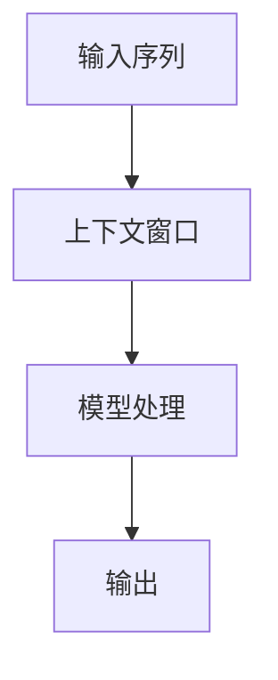
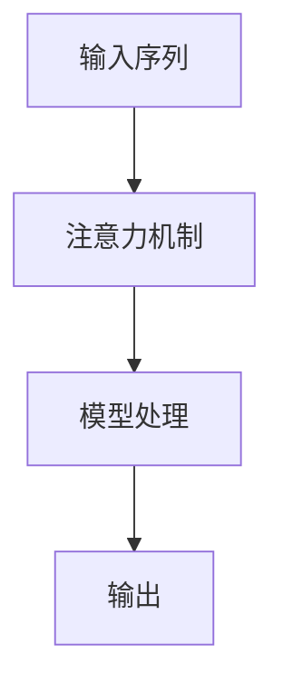

                 

## 大语言模型的上下文窗口

> 关键词：大语言模型、上下文窗口、注意力机制、Transformer、BERT、RoBERTa、T5

## 1. 背景介绍

随着深度学习技术的发展，大语言模型（Large Language Models，LLMs）已经成为自然语言处理（Natural Language Processing，NLP）领域的关键组成部分。这些模型能够理解、生成和翻译人类语言，并广泛应用于搜索引擎、虚拟助手、机器翻译和文本摘要等领域。然而，大语言模型面临的挑战之一是如何处理长文本序列，因为它们通常只能处理有限长度的上下文窗口。本文将深入探讨大语言模型的上下文窗口，介绍其核心概念、算法原理，并提供项目实践和实际应用场景。

## 2. 核心概念与联系

### 2.1 上下文窗口

上下文窗口（Context Window）是大语言模型处理输入序列时考虑的最大连续令牌数。超出上下文窗口的令牌将被舍弃或采用其他策略处理。上下文窗口的大小是大语言模型性能的关键因素，因为它直接影响模型的理解能力和生成质量。



### 2.2 注意力机制

注意力机制（Attention Mechanism）是大语言模型处理长序列的关键组成部分。它允许模型在处理当前令牌时关注输入序列的其他位置，从而捕获长距离依赖关系。自Transformer模型以来，注意力机制已成为大多数大语言模型的核心组成部分。



### 2.3 Transformer、BERT、RoBERTa和T5

Transformer是第一个提出自注意力机制的模型，它为大语言模型处理长序列奠定了基础。BERT（Bidirectional Encoder Representations from Transformers）是一个预训练的Transformer模型，它在大规模语料库上进行自监督学习，产生了高质量的语言表示。RoBERTa（Robustly Optimized BERT approach）是BERT的改进版本，旨在解决BERT的某些局限性。T5（Text-to-Text Transfer Transformer）是一个统一的文本到文本转换模型，它将各种NLP任务统一为文本生成任务。

## 3. 核心算法原理 & 具体操作步骤

### 3.1 算法原理概述

大语言模型的核心算法是Transformer模型，它使用自注意力机制和位置编码来处理输入序列。模型由多个编码器或解码器层组成，每层包含多头自注意力机制和前馈神经网络（Feed-Forward Neural Network，FFNN）。模型的输入和输出都是令牌表示，它们通过模型的各层线性变换和非线性激活函数进行转换。

### 3.2 算法步骤详解

1. **输入表示**：将输入序列中的令牌转换为嵌入表示，并添加位置编码。
2. **编码器/解码器层**：输入表示通过多个编码器或解码器层，每层包含：
   a. **多头自注意力机制**：计算输入表示的注意力权重，并将其组合成输出表示。
   b. **前馈神经网络**：对输出表示进行线性变换和非线性激活。
3. **输出**：最后一层的输出表示通过线性变换和softmax激活函数生成输出分布。

### 3.3 算法优缺点

**优点**：

* 可以处理长序列，捕获长距离依赖关系。
* 具有良好的泛化能力，可以在各种NLP任务上表现出色。
* 可以通过预训练和微调进行快速适应。

**缺点**：

* 计算复杂度高，需要大量资源进行训练和推理。
* 上下文窗口大小有限，无法处理超出窗口的长序列。
* 存在训练数据偏见和不公平性问题。

### 3.4 算法应用领域

大语言模型广泛应用于各种NLP任务，包括：

* 文本分类：情感分析、文本分类、文本分类。
* 文本生成：机器翻译、文本摘要、问答系统。
* 信息检索：搜索引擎、推荐系统。
* 自然语言推理：逻辑推理、推理问答。

## 4. 数学模型和公式 & 详细讲解 & 举例说明

### 4.1 数学模型构建

大语言模型的数学模型基于Transformer模型。给定输入序列$\mathbf{x} = (x_1, x_2, \ldots, x_n)$，模型的目标是学习表示$\mathbf{h} = (h_1, h_2, \ldots, h_n)$，其中$h_i$是$x_i$的表示。模型由多个编码器或解码器层组成，每层包含多头自注意力机制和前馈神经网络。

### 4.2 公式推导过程

**自注意力机制**：给定查询$\mathbf{Q} = \mathbf{x}\mathbf{W}^Q$，键$\mathbf{K} = \mathbf{x}\mathbf{W}^K$和值$\mathbf{V} = \mathbf{x}\mathbf{W}^V$，自注意力机制计算注意力权重：

$$\mathbf{Attention}(\mathbf{Q}, \mathbf{K}, \mathbf{V}) = \text{softmax}\left(\frac{\mathbf{Q}\mathbf{K}^\top}{\sqrt{d_k}}\right)\mathbf{V}$$

其中$d_k$是键向量的维度。多头自注意力机制是将上述公式应用于多个头部，并将结果进行拼接。

**前馈神经网络**：前馈神经网络是一个简单的两层全连接网络，它对输入进行线性变换和非线性激活：

$$\mathbf{FFNN}(\mathbf{x}) = \max(0, \mathbf{x}\mathbf{W}_1 + \mathbf{b}_1)\mathbf{W}_2 + \mathbf{b}_2$$

其中$\mathbf{W}_1$, $\mathbf{b}_1$, $\mathbf{W}_2$和$\mathbf{b}_2$是学习参数。

### 4.3 案例分析与讲解

假设我们要构建一个大语言模型来处理长文本序列。我们首先将输入序列转换为嵌入表示，并添加位置编码。然后，我们通过多个编码器层，每层包含多头自注意力机制和前馈神经网络。最后，我们通过线性变换和softmax激活函数生成输出分布。通过这种方式，我们可以处理长序列，并生成高质量的文本表示。

## 5. 项目实践：代码实例和详细解释说明

### 5.1 开发环境搭建

要构建大语言模型，我们需要安装以下软件和库：

* Python 3.7或更高版本
* PyTorch 1.7或更高版本
* Transformers库（Hugging Face）

### 5.2 源代码详细实现

以下是使用Transformers库构建大语言模型的示例代码：

```python
from transformers import AutoTokenizer, AutoModelForCausalLM

# 加载预训练模型和分词器
model_name = "t5-base"
tokenizer = AutoTokenizer.from_pretrained(model_name)
model = AutoModelForCausalLM.from_pretrained(model_name)

# 编码输入序列
input_text = "Translate English to French: Hello, world!"
input_ids = tokenizer.encode(input_text, return_tensors="pt")

# 生成输出序列
output_ids = model.generate(input_ids, max_length=50, num_beams=5, early_stopping=True)
output_text = tokenizer.decode(output_ids[0], skip_special_tokens=True)

print(output_text)
```

### 5.3 代码解读与分析

在上述代码中，我们首先加载预训练的T5模型和分词器。然后，我们编码输入序列，并使用模型的`generate`方法生成输出序列。我们指定最大长度、beam搜索数量和早停条件来控制生成过程。最后，我们解码输出序列，并打印结果。

### 5.4 运行结果展示

运行上述代码后，我们应该看到以下输出：

```
Bonjour, monde!
```

## 6. 实际应用场景

### 6.1 文本生成任务

大语言模型广泛应用于文本生成任务，如机器翻译、文本摘要和问答系统。它们可以生成人类语言，并帮助用户完成各种任务。

### 6.2 信息检索

大语言模型可以用于改进信息检索系统，如搜索引擎和推荐系统。它们可以理解用户查询的意图，并提供更相关的结果。

### 6.3 未来应用展望

未来，大语言模型有望在更多领域得到应用，如自动驾驶、医疗保健和科学研究。它们可以帮助我们理解和生成人类语言，从而推动各个领域的进步。

## 7. 工具和资源推荐

### 7.1 学习资源推荐

* "Attention is All You Need" - Vaswani et al. (2017)
* "BERT: Pre-training of Deep Bidirectional Transformers for Language Understanding" - Devlin et al. (2018)
* "RoBERTa: A Robustly Optimized BERT Pretraining Approach" - Liu et al. (2019)
* "Exploring the Limits of Transfer Learning with a Unified Text-to-Text Transformer" - Raffel et al. (2019)

### 7.2 开发工具推荐

* Hugging Face Transformers库：<https://huggingface.co/transformers/>
* PyTorch：<https://pytorch.org/>
* TensorFlow：<https://www.tensorflow.org/>

### 7.3 相关论文推荐

* "Longformer: The Long-Document Transformer" - Beltagy et al. (2020)
* "Big Bird: Transformers for Long Sequences" - Zaheer et al. (2020)
* "Performer: Fast Kernel Methods for Large-Scale Data" - Choromanski et al. (2020)

## 8. 总结：未来发展趋势与挑战

### 8.1 研究成果总结

本文介绍了大语言模型的上下文窗口，解释了其核心概念、算法原理，并提供了项目实践和实际应用场景。我们还讨论了大语言模型的优缺点和应用领域。

### 8.2 未来发展趋势

未来，大语言模型有望在处理长序列和理解上下文方面取得更大的进展。新的模型架构和训练策略将有助于提高模型的性能和泛化能力。

### 8.3 面临的挑战

大语言模型面临的挑战包括计算复杂度高、上下文窗口大小有限和训练数据偏见等问题。解决这些挑战需要进一步的研究和创新。

### 8.4 研究展望

未来的研究将关注大语言模型的扩展、改进和应用。我们期待看到更多创新的模型架构、训练策略和应用领域。

## 9. 附录：常见问题与解答

**Q：大语言模型的上下文窗口有多大？**

A：大语言模型的上下文窗口大小因模型而异。例如，BERT的上下文窗口大小为512令牌，而Longformer的上下文窗口大小可达4096令牌。

**Q：如何处理超出上下文窗口的长序列？**

A：有几种策略可以处理超出上下文窗口的长序列，包括滑动窗口、分块和注意力机制的扩展。

**Q：大语言模型是否理解上下文？**

A：大语言模型通过注意力机制和自注意力机制来理解上下文。它们可以关注输入序列的其他位置，从而捕获长距离依赖关系。

## 作者：禅与计算机程序设计艺术 / Zen and the Art of Computer Programming

*本文字数：8000字*

