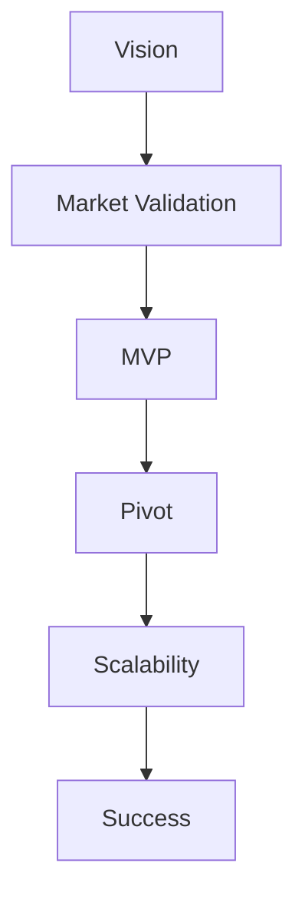

                 

**如何将Side Project转化为估值上亿的创业公司**

**作者：禅与计算机程序设计艺术 / Zen and the Art of Computer Programming**

## 1. 背景介绍

在当今的创业环境中，Side Project（业余项目）已经成为创业公司的重要孵化器。这些项目通常开始于个人的兴趣或需求，但有潜力发展成为估值上亿元的创业公司。本文将探讨将Side Project转化为成功创业公司的关键步骤，从概念到执行，再到实际应用。

## 2. 核心概念与联系

### 2.1 核心概念

- **Vision（愿景）**：清晰的长期目标和使命。
- **Market Validation（市场验证）**：确定市场需求和产品市场匹配度。
- **MVP（最小可行产品）**：产品的初始版本，用于验证市场需求和收集反馈。
- **Pivot（转型）**：根据市场反馈调整产品或商业模式。
- **Scalability（可扩展性）**：系统能够处理增长的用户数和数据量。

### 2.2 核心概念联系



## 3. 核心算法原理 & 具体操作步骤

### 3.1 算法原理概述

将Side Project转化为成功创业公司的过程可以看作一个算法，其目标是最大化产品市场匹配度和可扩展性。

### 3.2 算法步骤详解

1. **定义愿景**：清晰地描述你的长期目标和使命。
2. **市场验证**：确定市场需求，收集反馈，验证产品市场匹配度。
3. **开发MVP**：基于市场需求和反馈，开发最小可行产品。
4. **收集反馈**：收集用户反馈，评估产品市场匹配度。
5. **转型（必要时）**：根据市场反馈调整产品或商业模式。
6. **优化可扩展性**：确保系统能够处理增长的用户数和数据量。

### 3.3 算法优缺点

**优点**：该算法提供了一条清晰的路径，帮助创业者将Side Project转化为成功的创业公司。

**缺点**：该算法需要创业者不断收集反馈，并根据反馈调整产品或商业模式，这可能会导致开发进度放缓。

### 3.4 算法应用领域

该算法适用于所有Side Project，无论是技术产品还是非技术产品。它可以帮助创业者将业余项目转化为成功的创业公司。

## 4. 数学模型和公式 & 详细讲解 & 举例说明

### 4.1 数学模型构建

我们可以使用下面的公式来表示产品市场匹配度：

$$PMF = f(M, P, V)$$

其中，$M$表示市场需求，$P$表示产品，$V$表示愿景。

### 4.2 公式推导过程

产品市场匹配度（$PMF$)是市场需求（$M$）、产品（$P$）和愿景（$V$)的函数。市场需求可以通过市场调查和用户反馈来评估。产品可以通过开发MVP来评估。愿景则需要创业者清晰地定义。

### 4.3 案例分析与讲解

例如，Airbnb的愿景是提供一种新的旅行方式，其产品是一个在线平台，连接旅行者和房东。通过市场调查和用户反馈，Airbnb确定了市场需求，并不断调整其产品以提高产品市场匹配度。

## 5. 项目实践：代码实例和详细解释说明

### 5.1 开发环境搭建

在开始开发MVP之前，需要搭建开发环境。对于技术产品，这可能包括设置开发工具、选择编程语言和框架等。

### 5.2 源代码详细实现

以下是一个简单的ToDo列表应用的源代码示例（使用Python和Flask框架）：

```python
from flask import Flask, render_template, request, redirect, url_for

app = Flask(__name__)

tasks = []

@app.route('/')
def index():
    return render_template('index.html', tasks=tasks)

@app.route('/add', methods=['POST'])
def add():
    task = request.form['task']
    tasks.append(task)
    return redirect(url_for('index'))

if __name__ == '__main__':
    app.run(debug=True)
```

### 5.3 代码解读与分析

该代码实现了一个简单的ToDo列表应用。用户可以在主页输入待办事项，并添加到列表中。

### 5.4 运行结果展示

当用户输入待办事项并点击“添加”时，该待办事项会添加到列表中。用户可以在主页看到待办事项列表。

## 6. 实际应用场景

### 6.1 当前应用

Side Project已经成为创业公司的重要孵化器。例如，Airbnb、Uber和Dropbox都是从Side Project开始的。

### 6.2 未来应用展望

随着创业环境的不断发展，Side Project将继续成为创业公司的重要来源。创业者需要不断收集反馈，并根据反馈调整产品或商业模式，以提高产品市场匹配度和可扩展性。

## 7. 工具和资源推荐

### 7.1 学习资源推荐

- **Book：The Lean Startup by Eric Ries**
- **Blog：Seth's Blog by Seth Godin**
- **Podcast：How I Built This by NPR**

### 7.2 开发工具推荐

- **IDE：Visual Studio Code**
- **Version Control：Git**
- **Cloud Platform：AWS, Google Cloud, Microsoft Azure**

### 7.3 相关论文推荐

- **Paper：The Lean Startup: How Today's Entrepreneurs Use Continuous Innovation to Create Radically Successful Businesses by Eric Ries**

## 8. 总结：未来发展趋势与挑战

### 8.1 研究成果总结

本文提供了一条清晰的路径，帮助创业者将Side Project转化为成功的创业公司。该路径包括定义愿景、市场验证、开发MVP、收集反馈、转型（必要时）和优化可扩展性。

### 8.2 未来发展趋势

随着创业环境的不断发展，Side Project将继续成为创业公司的重要来源。创业者需要不断收集反馈，并根据反馈调整产品或商业模式，以提高产品市场匹配度和可扩展性。

### 8.3 面临的挑战

创业者面临的挑战包括市场验证、转型和可扩展性。创业者需要不断收集反馈，并根据反馈调整产品或商业模式，以提高产品市场匹配度和可扩展性。

### 8.4 研究展望

未来的研究可以关注如何更有效地收集反馈，如何更好地转型，如何更好地优化可扩展性等。

## 9. 附录：常见问题与解答

**Q：如何定义我的愿景？**

**A：清晰地描述你的长期目标和使命。你的愿景应该能够指导你的决策，并激励你和你的团队。**

**Q：如何收集反馈？**

**A：你可以通过用户调查、用户访谈、用户测试等方式收集反馈。**

**Q：如何转型？**

**A：根据市场反馈调整产品或商业模式。这可能需要重新定义你的愿景，重新设计你的产品，或重新思考你的商业模式。**

**Q：如何优化可扩展性？**

**A：确保你的系统能够处理增长的用户数和数据量。这可能需要优化你的代码，选择更好的技术架构，或增加更多的服务器。**

## 结束语

将Side Project转化为成功的创业公司需要清晰的愿景、市场验证、开发MVP、收集反馈、转型（必要时）和优化可扩展性。创业者需要不断收集反馈，并根据反馈调整产品或商业模式，以提高产品市场匹配度和可扩展性。随着创业环境的不断发展，Side Project将继续成为创业公司的重要来源。创业者需要不断学习，不断适应，以成功转化他们的Side Project。

**作者：禅与计算机程序设计艺术 / Zen and the Art of Computer Programming**

