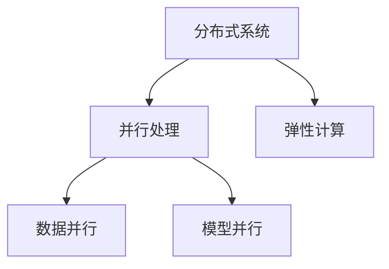

                 

## 1. 背景介绍

随着人工智能（AI）的飞速发展，大型模型的应用变得越来越普遍。这些模型需要大量的计算资源和数据来训练和部署。因此，构建高效的AI大模型应用数据中心变得至关重要。本文将介绍如何构建这样一个数据中心，以支持大规模AI模型的训练和部署。

## 2. 核心概念与联系

在构建AI大模型应用数据中心时，有几个核心概念需要理解。这些概念包括分布式系统、并行处理、弹性计算、数据并行和模型并行。下面是这些概念的Mermaid流程图：



- **分布式系统**：将任务分布在多台计算机上执行，以提高性能和可靠性。
- **并行处理**：在同一时间执行多个任务，以提高处理速度。
- **弹性计算**：根据需求动态调整计算资源。
- **数据并行**：将数据集分成多个子集，在多个处理器上并行处理。
- **模型并行**：将模型分成多个部分，在多个处理器上并行处理。

## 3. 核心算法原理 & 具体操作步骤

### 3.1 算法原理概述

构建高效的AI大模型应用数据中心需要使用各种算法。其中两个关键算法是MapReduce和Spark。

- **MapReduce**：这是一个分布式并行计算模型，用于处理大规模数据集。它将数据分成多个片段，在多个节点上并行处理，然后将结果汇总。
- **Spark**：这是一个快速且通用的大数据处理引擎。它提供了一个弹性分布式数据集，可以在集群上并行处理。

### 3.2 算法步骤详解

构建AI大模型应用数据中心的步骤如下：

1. **数据收集**：收集大量的数据，这些数据将用于训练和测试AI模型。
2. **数据预处理**：清洗和预处理数据，以便于模型训练。
3. **模型选择**：选择合适的AI模型，如神经网络或决策树。
4. **模型训练**：使用MapReduce或Spark在分布式系统上并行训练模型。
5. **模型评估**：评估模型的性能，并进行调优。
6. **模型部署**：将模型部署到生产环境中，以提供预测服务。

### 3.3 算法优缺点

MapReduce和Spark都有其优缺点：

- **MapReduce**：优点是简单易用，缺点是不支持迭代计算，不适合机器学习任务。
- **Spark**：优点是支持迭代计算，适合机器学习任务，缺点是复杂度高，学习曲线陡峭。

### 3.4 算法应用领域

这两种算法都广泛应用于大数据处理和机器学习领域。它们可以用于构建各种AI大模型应用，如图像识别、语音识别和自然语言处理。

## 4. 数学模型和公式 & 详细讲解 & 举例说明

### 4.1 数学模型构建

在构建AI大模型应用数据中心时，需要构建数学模型来描述数据和模型。例如，线性回归模型可以表示为：

$$y = wx + b$$

其中，$y$是目标变量，$x$是输入变量，$w$是权重，$b$是偏置项。

### 4.2 公式推导过程

权重和偏置项可以通过最小化误差平方和来学习：

$$J(w,b) = \frac{1}{2} \sum_{i=1}^{n} (y_i - (wx_i + b))^2$$

其中，$n$是数据集的大小，$y_i$是第$i$个数据点的目标变量，$x_i$是第$i$个数据点的输入变量。

### 4.3 案例分析与讲解

例如，假设我们要构建一个简单的线性回归模型来预测房价。我们的输入变量是房屋的面积，目标变量是房屋的价格。我们可以使用上面的公式来构建和训练模型。在训练过程中，我们会不断调整权重和偏置项，以最小化误差平方和。

## 5. 项目实践：代码实例和详细解释说明

### 5.1 开发环境搭建

构建AI大模型应用数据中心需要一个开发环境。推荐使用Anaconda来管理依赖项，并使用Jupyter Notebook来编写和运行代码。

### 5.2 源代码详细实现

以下是使用Python和Scikit-learn库构建简单线性回归模型的代码示例：

```python
from sklearn.linear_model import LinearRegression
from sklearn.model_selection import train_test_split
from sklearn.metrics import mean_squared_error

# Load data
X, y = load_data()

# Split data into training and test sets
X_train, X_test, y_train, y_test = train_test_split(X, y, test_size=0.2, random_state=42)

# Create a linear regression model
model = LinearRegression()

# Train the model
model.fit(X_train, y_train)

# Make predictions on the test set
y_pred = model.predict(X_test)

# Evaluate the model
mse = mean_squared_error(y_test, y_pred)
print("Mean Squared Error:", mse)
```

### 5.3 代码解读与分析

这段代码首先加载数据，然后将其分成训练集和测试集。它创建一个线性回归模型，并使用训练集来训练模型。然后，它使用测试集来评估模型的性能，并打印出均方误差。

### 5.4 运行结果展示

运行这段代码后，您会看到均方误差的值。这个值越小，模型的性能就越好。

## 6. 实际应用场景

AI大模型应用数据中心可以应用于各种领域，如医疗保健、金融服务和交通运输。例如，在医疗保健领域，可以使用AI大模型应用数据中心来分析病人的数据，预测疾病的发展，并提供个性化的治疗方案。

### 6.1 当前应用

目前，AI大模型应用数据中心已经在各种领域得到广泛应用。例如，Google使用其TensorFlow和TPU技术来训练和部署大型神经网络模型。Facebook使用其Big Sur数据中心来支持其各种AI应用。

### 6.2 未来应用展望

未来，AI大模型应用数据中心将变得更加智能和自适应。它们将能够自动调整资源，以优化性能和成本。它们还将能够处理更大规模的数据集，并提供更准确的预测。

## 7. 工具和资源推荐

### 7.1 学习资源推荐

以下是一些学习AI大模型应用数据中心的推荐资源：

- **书籍**："Designing Data-Intensive Applications" by Martin Kleppmann
- **在线课程**："Machine Learning" on Coursera by Stanford University
- **论文**："Large-Scale Distributed Deep Learning on Spark" by Li et al.

### 7.2 开发工具推荐

以下是一些构建AI大模型应用数据中心的推荐工具：

- **编程语言**：Python
- **机器学习库**：TensorFlow, PyTorch, Scikit-learn
- **大数据处理库**：Apache Spark, Hadoop MapReduce
- **云平台**：Amazon Web Services, Microsoft Azure, Google Cloud Platform

### 7.3 相关论文推荐

以下是一些相关论文的推荐：

- "Large-Scale Distributed Deep Learning on Spark" by Li et al.
- "TensorFlow: A System for Large-Scale Machine Learning" by Abadi et al.
- "Distributed Deep Learning with Apache MXNet" by Chen et al.

## 8. 总结：未来发展趋势与挑战

### 8.1 研究成果总结

本文介绍了如何构建高效的AI大模型应用数据中心。我们讨论了核心概念、算法原理、数学模型和工具资源。我们还提供了一个项目实践的例子，并展示了如何评估和改进模型。

### 8.2 未来发展趋势

未来，AI大模型应用数据中心将变得更加智能和自适应。它们将能够自动调整资源，以优化性能和成本。它们还将能够处理更大规模的数据集，并提供更准确的预测。

### 8.3 面临的挑战

构建高效的AI大模型应用数据中心面临着几个挑战：

- **数据隐私**：如何保护数据隐私，并符合数据保护法规。
- **计算资源**：如何有效地管理和分配计算资源。
- **模型复杂性**：如何处理复杂的模型，并提高其性能。

### 8.4 研究展望

未来的研究将关注如何构建更智能和自适应的AI大模型应用数据中心。这将需要开发新的算法和工具，以优化性能和成本。此外，研究还将关注如何处理更大规模的数据集，并提供更准确的预测。

## 9. 附录：常见问题与解答

**Q：如何选择合适的AI模型？**

A：选择合适的AI模型取决于您的数据和任务。您需要考虑模型的复杂性、训练时间和预测精确度。您可以尝试多种模型，并比较其性能。

**Q：如何评估模型的性能？**

A：您可以使用交叉验证和评估指标来评估模型的性能。常用的评估指标包括准确率、精确度、召回率和F1分数。

**Q：如何处理不平衡的数据集？**

A：您可以使用过采样、欠采样或SMOTE技术来平衡数据集。您还可以使用类权重或成本敏感学习来处理不平衡的数据集。

## 作者：禅与计算机程序设计艺术 / Zen and the Art of Computer Programming

