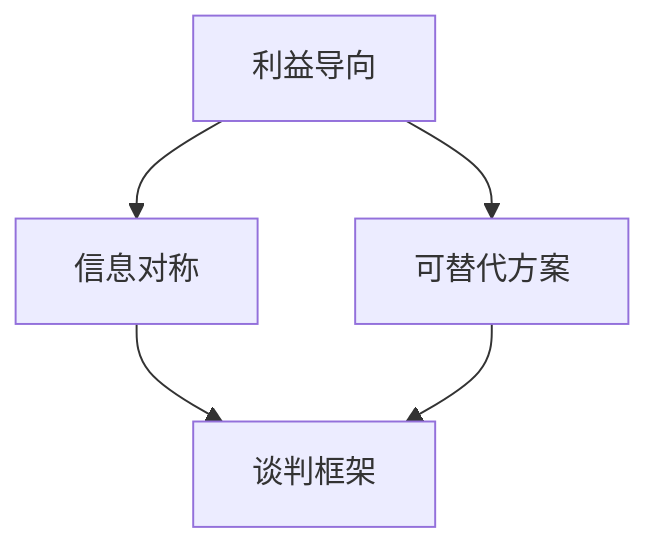

                 

## 1. 背景介绍

在当今快速变化的商业环境中，谈判技巧已成为企业成功的关键因素之一。无论是签订合同、谈判价格，还是解决争端，有效的谈判都能为企业带来巨大的利益。然而，谈判并非易事，它需要一定的技巧和策略。本文将深入探讨谈判技巧，帮助读者提高谈判能力，从而更有效地进行谈判和沟通。

## 2. 核心概念与联系

### 2.1 核心概念

- **利益导向**：谈判的目的是满足各方的利益需求，而不是单纯的妥协或胜利。
- **信息对称**：谈判双方对信息的掌握程度会影响谈判结果，信息对称有助于达成更公平的协议。
- **可替代方案（BATNA）**：这是谈判者在达成协议前的最佳替代方案，它有助于谈判者设定合理的目标和底线。
- **谈判框架**：谈判的结构和程序，包括谈判的开始、中间过程和结束。

### 2.2 核心概念联系

谈判的核心概念是相互联系的，它们共同构成了谈判的框架。例如，利益导向需要信息对称的支持，因为只有掌握了充分的信息，谈判者才能准确地判断对方的利益所在。可替代方案则为谈判者设定了底线，防止谈判者在谈判中失去理智或被对方牵着鼻子走。谈判框架则是这些概念的外在表现，它确保谈判有序进行，并最终达成协议。



## 3. 核心算法原理 & 具体操作步骤

### 3.1 算法原理概述

谈判技巧的核心算法原理是**利益最大化算法**。该算法的目的是帮助谈判者找到一种方案，使得各方利益最大化。算法的输入是各方的利益需求，输出是一种或多种可行的解决方案。

### 3.2 算法步骤详解

1. **信息收集**：收集谈判双方（或多方）的利益需求信息，包括直接利益和间接利益。
2. **信息分析**：分析收集到的信息，找出各方的利益重合点和差异点。
3. **目标设定**：基于信息分析，设定谈判的目标，即各方的利益最大化。
4. **方案生成**：生成一系列可行的解决方案，这些方案应能满足各方的利益需求。
5. **方案评估**：评估各个方案，选择最优方案，即各方利益最大化的方案。
6. **协议达成**：与对方协商，达成协议，并执行协议。

### 3.3 算法优缺点

**优点**：该算法能够帮助谈判者找到各方利益最大化的解决方案，从而达成公平合理的协议。它鼓励谈判者关注对方的利益，而不是单纯地追求自己的利益，有助于建立长期的合作关系。

**缺点**：该算法需要大量的信息收集和分析工作，谈判者需要具备一定的信息收集和分析能力。此外，该算法假设谈判者是理性的，能够客观地评估各方的利益需求，但现实中谈判者的决策可能受到情感因素的影响。

### 3.4 算法应用领域

该算法适用于各种谈判场景，包括但不限于商业谈判、政治谈判、国际谈判等。它可以帮助谈判者找到各方利益最大化的解决方案，从而达成公平合理的协议。

## 4. 数学模型和公式 & 详细讲解 & 举例说明

### 4.1 数学模型构建

谈判技巧的数学模型可以用博弈论来建模。在博弈论中，谈判者被视为博弈参与者，各方的利益需求被视为博弈的收益函数。谈判的目标是找到一种均衡状态，即各方的收益函数都达到了最大值。

### 4.2 公式推导过程

设谈判双方为A和B，各方的利益需求分别为$u_A(x)$和$u_B(x)$，其中$x$是谈判的决策变量。谈判的目标是找到一种决策$x^*$，使得$u_A(x^*)$和$u_B(x^*)$都达到了最大值。即：

$$
x^* = \arg\max_{x} \{u_A(x), u_B(x)\}
$$

### 4.3 案例分析与讲解

例如，在商业谈判中，谈判双方分别是买方和卖方。买方的利益需求是以最低成本购买商品，卖方的利益需求是以最高价格出售商品。谈判的决策变量是商品的价格$x$. 买方的收益函数$u_A(x)$是价格$x$与买方的成本之间的差值，卖方的收益函数$u_B(x)$是价格$x$与卖方的成本之间的差值。谈判的目标是找到一种价格$x^*$，使得$u_A(x^*)$和$u_B(x^*)$都达到了最大值。

## 5. 项目实践：代码实例和详细解释说明

### 5.1 开发环境搭建

本项目使用Python作为编程语言，并使用NumPy和Matplotlib库进行数值计算和可视化。读者需要安装Python和相关库才能运行代码。

### 5.2 源代码详细实现

以下是一个简单的谈判技巧算法的Python实现。该算法假设谈判双方的利益需求是线性的，即各方的收益函数是线性函数。

```python
import numpy as np
import matplotlib.pyplot as plt

# 定义收益函数
def u_A(x):
    return 10 - x

def u_B(x):
    return x - 5

# 定义谈判算法
def negotiate():
    # 信息收集
    x = np.linspace(0, 10, 100)

    # 信息分析
    u_A_x = u_A(x)
    u_B_x = u_B(x)

    # 目标设定
    target = np.max(u_A_x * u_B_x)

    # 方案生成
    x_star = x[np.argmax(u_A_x * u_B_x)]

    # 方案评估
    if u_A(x_star) > 0 and u_B(x_star) > 0:
        return x_star
    else:
        return None

# 执行谈判算法
x_star = negotiate()

# 可视化结果
plt.plot(x, u_A(x), label='u_A(x)')
plt.plot(x, u_B(x), label='u_B(x)')
plt.scatter(x_star, u_A(x_star), color='red', label='x*')
plt.legend()
plt.show()
```

### 5.3 代码解读与分析

该代码定义了谈判双方的收益函数$u_A(x)$和$u_B(x)$, 并实现了谈判算法。算法首先收集了谈判的决策变量$x$的信息，然后分析了各方的收益函数，设定了目标，生成了方案，并评估了方案。如果方案能够满足各方的利益需求，则返回方案；否则，返回None。

### 5.4 运行结果展示

运行该代码后，会生成一个图形，显示了谈判双方的收益函数和谈判算法找到的最优解$x^*$. 从图中可以看出，$x^*$是各方收益函数的交点，这说明$x^*$是各方利益最大化的解决方案。

## 6. 实际应用场景

### 6.1 商业谈判

在商业谈判中，谈判双方通常是买方和卖方。买方的利益需求是以最低成本购买商品，卖方的利益需求是以最高价格出售商品。谈判的决策变量是商品的价格。谈判技巧算法可以帮助双方找到一种价格，使得各方利益最大化。

### 6.2 政治谈判

在政治谈判中，谈判双方通常是不同国家或政党。各方的利益需求可能涉及领土、资源、政策等多个方面。谈判技巧算法可以帮助各方找到一种方案，使得各方利益最大化，从而达成公平合理的协议。

### 6.3 未来应用展望

随着人工智能技术的发展，谈判技巧算法有望在未来得到更广泛的应用。例如，人工智能可以帮助谈判者收集和分析信息，生成和评估方案，从而提高谈判的效率和公平性。

## 7. 工具和资源推荐

### 7.1 学习资源推荐

- 书籍：《谈判力》《谈判的艺术》《谈判圣经》等
- 在线课程： Coursera、Udemy、edX等平台上的谈判技巧课程
- 网站：[Harvard Negotiation Mastery](https://online-learning.harvard.edu/course/negotiation-mastery/)、[MIT Sloan Management Review](https://sloanreview.mit.edu/)等

### 7.2 开发工具推荐

- Python：一个强大的编程语言，适合实现谈判技巧算法
- NumPy：一个数值计算库，适合进行数值计算
- Matplotlib：一个可视化库，适合进行可视化

### 7.3 相关论文推荐

- Fisher, R., Ury, W., & Patton, B. (1991). Getting to Yes: Negotiating Agreement Without Giving In. Penguin.
- Raiffa, H. (1982). The Art and Science of Negotiation. Harvard University Press.
- Thompson, L. (2005). The Mind and Heart of the Negotiator. Westview Press.

## 8. 总结：未来发展趋势与挑战

### 8.1 研究成果总结

本文介绍了谈判技巧的核心概念、算法原理、数学模型和公式，并提供了代码实例和实际应用场景。谈判技巧算法能够帮助谈判者找到各方利益最大化的解决方案，从而达成公平合理的协议。

### 8.2 未来发展趋势

未来，谈判技巧算法有望得到更广泛的应用，并与人工智能技术结合，提高谈判的效率和公平性。此外，谈判技巧算法有望在更复杂的谈判场景中得到应用，例如多方谈判、谈判博弈等。

### 8.3 面临的挑战

谈判技巧算法面临的挑战包括信息收集和分析的难度、谈判者决策的非理性等。此外，谈判技巧算法需要考虑谈判的动态性，即谈判过程中各方利益需求的变化。

### 8.4 研究展望

未来的研究可以从以下几个方向展开：

- 研究谈判技巧算法在更复杂谈判场景中的应用
- 研究谈判技巧算法与人工智能技术的结合
- 研究谈判技巧算法在谈判博弈中的应用
- 研究谈判技巧算法在谈判动态性中的应用

## 9. 附录：常见问题与解答

**Q1：谈判技巧算法能否保证达成协议？**

**A1：谈判技巧算法不能保证达成协议，因为谈判的结果取决于谈判者的决策，而谈判者的决策可能受到情感因素的影响。谈判技巧算法只能帮助谈判者找到各方利益最大化的解决方案，但不能保证谈判者会接受这个方案。**

**Q2：谈判技巧算法适用于所有谈判场景吗？**

**A2：谈判技巧算法适用于大部分谈判场景，但不适用于一些特殊场景，例如零和博弈、谈判者有明确的目标但不关注对方利益的场景等。**

**Q3：谈判技巧算法需要多长时间才能达成协议？**

**A3：谈判技巧算法的时间开销取决于谈判的复杂度。简单的谈判可能只需要几分钟，复杂的谈判可能需要几个小时甚至几天。**

**Q4：谈判技巧算法需要什么样的输入？**

**A4：谈判技巧算法需要谈判双方（或多方）的利益需求信息作为输入。这些信息可以通过直接询问谈判者、分析谈判者的行为等方式收集。**

**Q5：谈判技巧算法需要什么样的输出？**

**A5：谈判技巧算法的输出是一种或多种可行的解决方案，这些方案能够满足各方的利益需求。谈判者可以选择其中一个方案作为协议。**

## 作者：禅与计算机程序设计艺术 / Zen and the Art of Computer Programming

