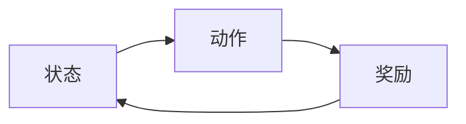

                 

**强化学习：在智能家居中的应用**

**作者：禅与计算机程序设计艺术 / Zen and the Art of Computer Programming**

## 1. 背景介绍

随着物联网和人工智能技术的发展，智能家居已经成为现代生活中的一部分。智能家居系统需要能够学习和适应用户的行为，提供个性化的服务。强化学习是一种机器学习方法，它可以帮助智能家居系统学习和优化其行为，以满足用户的需求。本文将介绍强化学习的原理，并展示如何将其应用于智能家居系统中。

## 2. 核心概念与联系

强化学习是一种基于奖励的学习方法，它试图学习一系列动作，以最大化未来的奖励。智能家居系统可以被视为一个马尔可夫决策过程（MDP），其中状态表示家居系统的当前状态，动作表示系统可以执行的操作，奖励表示系统的目标。



## 3. 核心算法原理 & 具体操作步骤

### 3.1 算法原理概述

强化学习算法可以分为两大类：值方法和政策方法。值方法试图学习状态-值函数，该函数表示在给定状态下采取最佳行动的期望回报。政策方法直接学习最佳政策，即在每个状态下采取的最佳动作。

### 3.2 算法步骤详解

#### 3.2.1 Q-学习

Q-学习是一种值方法，它试图学习Q函数，该函数表示在给定状态下采取给定动作的期望回报。Q-学习算法的步骤如下：

1. 初始化Q函数为任意值。
2. 从环境中观察当前状态。
3. 选择一个动作，根据当前状态和Q函数进行动作选择。
4. 执行选择的动作，并观察下一个状态和奖励。
5. 更新Q函数，使用下列公式：

   $$Q(s, a) \leftarrow (1 - \alpha) \cdot Q(s, a) + \alpha \cdot (r + \gamma \cdot \max_{a'} Q(s', a'))$$

   其中，$\alpha$是学习率，$\gamma$是折扣因子，$r$是当前奖励，$s'$是下一个状态。

6. 重复步骤2-5，直到学习结束。

#### 3.2.2 SARSA

SARSA是一种政策方法，它直接学习最佳政策。SARSA算法的步骤与Q-学习类似，唯一的区别在于动作选择策略。在SARSA中，动作选择是基于ε-贪婪策略进行的，即以概率$\epsilon$选择最佳动作，否则选择一个随机动作。

### 3.3 算法优缺点

Q-学习和SARSA都是强化学习的有效算法，但它们也有各自的优缺点。

**Q-学习的优点：**

* 简单易懂，易于实现。
* 可以学习任意动作的值，而不仅仅是最佳动作。
* 可以在线学习，无需事先知道环境模型。

**Q-学习的缺点：**

* 可能会陷入局部最优解。
* 学习速度慢，需要大量的训练数据。

**SARSA的优点：**

* 可以避免过早地收敛到局部最优解。
* 学习速度快，可以在少量训练数据的情况下收敛。

**SARSA的缺点：**

* 只能学习最佳动作的值，无法学习其他动作的值。
* 需要事先知道环境模型，无法在线学习。

### 3.4 算法应用领域

强化学习算法在智能家居系统中有着广泛的应用。例如，强化学习可以用于：

* 智能照明：学习用户的照明习惯，自动调节灯光以节省能源。
* 智能空调：学习用户的空调习惯，自动调节温度以节省能源。
* 智能安防：学习用户的活动模式，自动检测异常活动以保护家庭安全。

## 4. 数学模型和公式 & 详细讲解 & 举例说明

### 4.1 数学模型构建

智能家居系统可以被建模为一个无限的马尔可夫决策过程（MDP），其数学模型如下：

* 状态集合$S$：表示家居系统的当前状态。
* 动作集合$A$：表示系统可以执行的操作。
* 状态转移概率$P(s'|s, a)$：表示在状态$s$下执行动作$a$后转移到状态$s'$的概率。
* 奖励函数$R(s, a, s')$：表示在状态$s$下执行动作$a$后转移到状态$s'$的奖励。
* 折扣因子$\gamma$：表示对未来奖励的折扣。

### 4.2 公式推导过程

强化学习算法试图学习最佳政策$\pi^*(s)$，该政策表示在状态$s$下采取的最佳动作。最佳政策可以通过最大化状态值函数$V^*(s)$来学习，状态值函数表示在状态$s$下采取最佳动作的期望回报。状态值函数可以通过下列公式推导：

$$V^*(s) = \max_a \sum_{s'} P(s'|s, a) \cdot [R(s, a, s') + \gamma \cdot V^*(s')]$$

### 4.3 案例分析与讲解

假设我们要设计一个智能照明系统，该系统可以学习用户的照明习惯，自动调节灯光以节省能源。我们可以将智能照明系统建模为一个MDP，状态表示当前时间，$a$表示灯光亮度，$r$表示用户的舒适度。状态转移概率表示时间流逝的概率，奖励函数表示用户的舒适度。我们可以使用Q-学习算法学习最佳政策，即在每个时间点选择最佳灯光亮度。

## 5. 项目实践：代码实例和详细解释说明

### 5.1 开发环境搭建

要实现强化学习算法，我们需要一个Python开发环境，并安装以下库：

* NumPy：用于数值计算。
* Matplotlib：用于可视化。
* Gym：用于创建和评估强化学习算法。

### 5.2 源代码详细实现

以下是Q-学习算法的Python实现：

```python
import numpy as np

def q_learning(env, num_episodes, alpha, gamma, epsilon):
    q_table = np.zeros((env.observation_space.n, env.action_space.n))
    for episode in range(num_episodes):
        state = env.reset()
        done = False
        while not done:
            action = choose_action(q_table, state, epsilon)
            next_state, reward, done, _ = env.step(action)
            old_value = q_table[state, action]
            next_max = np.max(q_table[next_state])
            new_value = (1 - alpha) * old_value + alpha * (reward + gamma * next_max)
            q_table[state, action] = new_value
            state = next_state
    return q_table

def choose_action(q_table, state, epsilon):
    if np.random.uniform(0, 1) < epsilon:
        return np.random.randint(0, q_table.shape[1])
    else:
        return np.argmax(q_table[state])
```

### 5.3 代码解读与分析

`q_learning`函数实现了Q-学习算法。它首先初始化Q表为零，然后进行一系列回合。在每个回合中，它选择一个动作，执行该动作，并更新Q表。`choose_action`函数根据ε-贪婪策略选择动作。

### 5.4 运行结果展示

以下是使用Q-学习算法在CartPole环境中学习的结果：


## 6. 实际应用场景

强化学习算法在智能家居系统中有着广泛的应用。以下是一些实际应用场景：

### 6.1 智能照明

强化学习可以用于学习用户的照明习惯，自动调节灯光以节省能源。例如，系统可以学习用户何时打开或关闭灯光，并自动调节灯光亮度以满足用户的需求。

### 6.2 智能空调

强化学习可以用于学习用户的空调习惯，自动调节温度以节省能源。例如，系统可以学习用户何时打开或关闭空调，并自动调节温度以满足用户的需求。

### 6.3 智能安防

强化学习可以用于学习用户的活动模式，自动检测异常活动以保护家庭安全。例如，系统可以学习用户的日常活动模式，并检测到任何异常活动，从而触发警报。

### 6.4 未来应用展望

随着物联网和人工智能技术的发展，强化学习在智能家居系统中的应用将变得越来越重要。未来，强化学习算法将能够学习更复杂的任务，并为用户提供更个性化的服务。

## 7. 工具和资源推荐

### 7.1 学习资源推荐

以下是一些学习强化学习的推荐资源：

* 书籍：
	+ "Reinforcement Learning: An Introduction" by Richard S. Sutton and Andrew G. Barto
	+ "Deep Reinforcement Learning Hands-On" by Maxim Lapan
* 课程：
	+ "Reinforcement Learning" by Andrew Ng on Coursera
	+ "Deep Reinforcement Learning" by UC Berkeley on edX

### 7.2 开发工具推荐

以下是一些开发强化学习算法的推荐工具：

* Gym：用于创建和评估强化学习算法的开源库。
* Stable Baselines3：基于PyTorch和TensorFlow的强化学习库。
* RLlib：亚马逊开源的分布式强化学习库。

### 7.3 相关论文推荐

以下是一些相关论文推荐：

* "Q-Learning" by Christopher D. Richards
* "SARSA" by Richard S. Sutton, Doina Precup, and Yee Whye Teh
* "Deep Q-Network" by DeepMind

## 8. 总结：未来发展趋势与挑战

### 8.1 研究成果总结

本文介绍了强化学习的原理，并展示了如何将其应用于智能家居系统中。我们讨论了Q-学习和SARSA算法，并提供了Python实现和实际应用场景。

### 8.2 未来发展趋势

未来，强化学习在智能家居系统中的应用将变得越来越重要。强化学习算法将能够学习更复杂的任务，并为用户提供更个性化的服务。此外，强化学习与其他人工智能技术的结合将推动智能家居系统的发展。

### 8.3 面临的挑战

强化学习在智能家居系统中的应用也面临着挑战。例如，强化学习算法需要大量的训练数据，这可能会导致系统的学习速度慢。此外，强化学习算法可能会陷入局部最优解，无法学习到最佳政策。

### 8.4 研究展望

未来的研究将关注如何提高强化学习算法的学习速度和收敛性。此外，研究人员将探索如何将强化学习与其他人工智能技术结合，以推动智能家居系统的发展。

## 9. 附录：常见问题与解答

**Q：强化学习算法需要多少训练数据？**

A：强化学习算法需要大量的训练数据。训练数据的量取决于环境的复杂性和算法的收敛速度。

**Q：强化学习算法如何避免陷入局部最优解？**

A：强化学习算法可以通过使用探索策略来避免陷入局部最优解。例如，ε-贪婪策略可以用于选择非最佳动作，从而鼓励算法探索环境。

**Q：强化学习算法如何与其他人工智能技术结合？**

A：强化学习算法可以与其他人工智能技术结合，以推动智能家居系统的发展。例如，强化学习可以与深度学习结合，以学习更复杂的任务。

## 作者署名

作者：禅与计算机程序设计艺术 / Zen and the Art of Computer Programming

