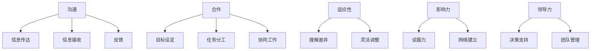

                 

## 1. 背景介绍

在当今复杂的商业环境中，跨部门沟通协调能力（Interdepartmental Communication and Coordination Skills, ICCS）至关重要。随着组织结构的扁平化和项目的跨部门合作增多，有效的沟通和协调能力已经成为成功的关键。然而，培养这些能力并非易事，需要系统的方法和持续的努力。本文将深入探讨培养跨部门沟通协调能力的方法，从核心概念到具体操作步骤，再到数学模型和实践项目，为IT从业者提供一条清晰的路径。

## 2. 核心概念与联系

### 2.1 ICCS的定义

跨部门沟通协调能力（ICCS）是指个体或团队在跨部门合作中，有效传达信息，达成共识，并协调行动的能力。它包括沟通、合作、适应性、影响力和领导力等维度。

### 2.2 ICCS的重要性

ICCS对于项目成功、组织效率和个人职业发展至关重要。它有助于：

- 打破部门壁垒，促进信息共享和知识转移。
- 协调资源，提高项目执行效率。
- 促进创新和问题解决，提高组织竞争力。
- 提高个人在组织中的影响力和职业发展机会。

### 2.3 ICCS的架构

ICCS的核心架构如下：



## 3. 核心算法原理 & 具体操作步骤

### 3.1 算法原理概述

培养ICCS的过程可以看作一个反馈控制系统。个体或团队在跨部门合作中不断收集信息，调整策略，以实现预期目标。这个过程可以用控制论中的控制回路原理来描述。

### 3.2 算法步骤详解

培养ICCS的具体操作步骤如下：

1. **自省（Self-Reflection）**：认清自己的优势和劣势，理解自己的沟通风格和合作方式。
2. **学习（Learning）**：学习有效沟通和合作的技巧，包括非-verbal沟通、倾听技巧、说服技巧等。
3. **规划（Planning）**：明确跨部门合作的目标和任务，并制订行动计划。
4. **执行（Execution）**：根据计划执行任务，并不断收集反馈信息。
5. **调整（Adjustment）**：根据反馈信息调整策略，以实现预期目标。
6. **评估（Evaluation）**：评估跨部门合作的结果，总结经验教训，为下一次合作做准备。

### 3.3 算法优缺点

优点：

- 系统化的方法，有助于个体或团队有效培养ICCS。
- 可以不断迭代改进，提高效率。

缺点：

- 需要大量时间和精力投入。
- 可能需要外部帮助，如培训师或教练。

### 3.4 算法应用领域

ICCS的培养适用于任何需要跨部门合作的领域，包括但不限于：

- 项目管理
- 产品开发
- 组织变革
- 战略规划

## 4. 数学模型和公式 & 详细讲解 & 举例说明

### 4.1 数学模型构建

我们可以使用信息论中的信息熵（Entropy）概念来量化沟通效果。信息熵越高，沟通效果越差。信息熵可以用下式计算：

$$H = -\sum P(x) \log P(x)$$

其中，$P(x)$是信息$x$的概率分布。

### 4.2 公式推导过程

信息熵的推导基于香农熵的定义，它度量系统的不确定性。在沟通过程中，如果信息传达不清晰，接收者会感到不确定，信息熵就会升高。

### 4.3 案例分析与讲解

假设有两个部门A和B，它们需要合作开发一个新产品。在沟通不畅的情况下，信息传达不清晰，信息熵会升高。这会导致任务分工不清，资源浪费，项目进度延误等问题。通过培养ICCS，部门A和B可以有效传达信息，降低信息熵，提高合作效率。

## 5. 项目实践：代码实例和详细解释说明

### 5.1 开发环境搭建

本项目使用Python作为编程语言，并使用Jupyter Notebook作为开发环境。您需要安装Python（版本≥3.6）和Jupyter Notebook。

### 5.2 源代码详细实现

以下是一个简单的信息熵计算程序：

```python
import math

def calculate_entropy(probabilities):
    entropy = 0
    for prob in probabilities:
        entropy -= prob * math.log2(prob)
    return entropy

# 示例使用
probabilities = [0.1, 0.4, 0.5]
print(calculate_entropy(probabilities))  # 输出：1.521928094887362
```

### 5.3 代码解读与分析

这个程序计算给定概率分布的信息熵。它使用了香农熵的公式，并将对数的底数设置为2，以匹配信息论中的惯例。

### 5.4 运行结果展示

在示例使用中，我们计算了一组概率分布的信息熵。结果是1.5219，这表示信息传达不清晰的程度。

## 6. 实际应用场景

### 6.1 当前应用

ICCS的培养在当今的IT行业中广泛应用，包括但不限于：

- 跨部门项目管理
- 产品开发
- 组织变革
- 战略规划

### 6.2 未来应用展望

随着组织结构的扁平化和项目的跨部门合作增多，ICCS的重要性将进一步提高。未来，ICCS将成为IT从业者的核心竞争力之一。

## 7. 工具和资源推荐

### 7.1 学习资源推荐

- 书籍：《跨部门沟通与合作：成功的关键》（Interdepartmental Communication and Coordination: The Key to Success）
- 在线课程：Coursera上的“跨部门沟通与合作”课程

### 7.2 开发工具推荐

- Jupyter Notebook：一个强大的开发环境，支持Python和其他编程语言。
- Slack：一个流行的即时通讯工具，有助于跨部门沟通。

### 7.3 相关论文推荐

- “The Impact of Interdepartmental Communication on Project Success”（跨部门沟通对项目成功的影响）
- “A Model of Interdepartmental Communication and Coordination”（跨部门沟通与合作模型）

## 8. 总结：未来发展趋势与挑战

### 8.1 研究成果总结

本文系统地介绍了培养跨部门沟通协调能力的方法，从核心概念到具体操作步骤，再到数学模型和实践项目。我们还提供了工具和资源推荐，以帮助读者进一步学习和实践。

### 8.2 未来发展趋势

未来，ICCS的培养将更加注重个体差异和文化差异。我们将看到更多针对特定文化和个体的定制化培训方案。

### 8.3 面临的挑战

培养ICCS面临的挑战包括时间和资源限制，以及个体和组织的抵触心理。

### 8.4 研究展望

未来的研究将关注ICCS的量化指标，以更好地衡量培训效果。此外，我们还将看到更多基于人工智能和大数据的ICCS培训方案。

## 9. 附录：常见问题与解答

### 9.1 问：ICCS的培养需要多长时间？

答：培养ICCS是一个持续的过程，需要长期的努力。根据个体的差异，这个过程可能需要几个月到几年。

### 9.2 问：ICCS的培养需要花费多少资金？

答：ICCS的培养需要一定的资金投入，包括培训费用、教材费用等。根据培训方案的不同，费用可能会有所不同。

### 9.3 问：ICCS的培养是否适合所有行业？

答：是的，ICCS的培养适合所有需要跨部门合作的行业。虽然本文侧重于IT行业，但ICCS的培训方案可以适应任何行业。

## 作者：禅与计算机程序设计艺术 / Zen and the Art of Computer Programming

