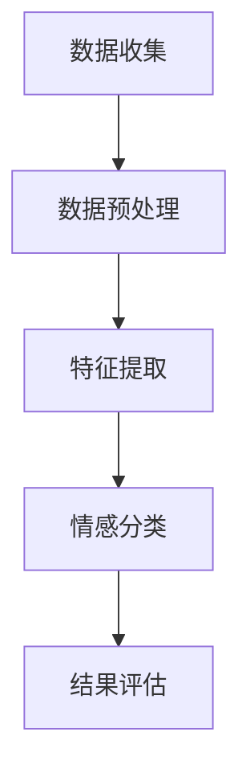

                 

**情感分析：AI如何理解用户情感，改进商品和服务**

## 1. 背景介绍

在当今数字化的世界里，用户的情感反馈是至关重要的。它帮助企业理解客户需求，改进产品和服务，提高客户满意度。情感分析（Sentiment Analysis）是一种自然语言处理（NLP）技术，旨在识别文本（如社交媒体帖子、评论、推文等）中表达的情感。本文将深入探讨情感分析的核心概念、算法、数学模型，并提供实践项目和工具推荐。

## 2. 核心概念与联系

情感分析的核心是识别文本中表达的情感极性（正面、负面或中性）和情感强度。它通常涉及以下步骤：



### 2.1 情感分析类型

- **文本级别（Document-level）**：对整个文本的情感进行分类。
- **句子级别（Sentence-level）**：对每个句子的情感进行分类。
- **实体级别（Aspect-based）**：识别特定实体（如产品、服务）的情感。

### 2.2 特征提取

特征提取是情感分析的关键步骤，它将文本转换为机器学习模型可以处理的表示。常用的特征包括：

- **词袋模型（Bag-of-Words）**：文本中单词的频率表示。
- **TF-IDF（Term Frequency-Inverse Document Frequency）**：单词的重要性表示。
- **词向量（Word Embeddings）**：单词的向量表示，如Word2Vec、GloVe、FastText。

## 3. 核心算法原理 & 具体操作步骤

### 3.1 算法原理概述

情感分析常用的算法包括：

- **机器学习算法**：如朴素贝叶斯、支持向量机（SVM）、随机森林。
- **深度学习算法**：如循环神经网络（RNN）、长短期记忆网络（LSTM）、transformer模型。

### 3.2 算法步骤详解

1. **数据收集**：收集包含情感标签的文本数据。
2. **数据预处理**：清洗数据，去除停用词，进行标记化。
3. **特征提取**：提取文本的特征表示。
4. **模型训练**：使用特征表示训练情感分类模型。
5. **模型评估**：评估模型的性能，调整超参数。
6. **部署应用**：将模型部署到生产环境中。

### 3.3 算法优缺点

- **机器学习算法**：优点是简单易懂，缺点是特征工程繁重，性能有限。
- **深度学习算法**：优点是性能优越，缺点是训练困难，解释性差。

### 3.4 算法应用领域

情感分析广泛应用于社交媒体监控、客户反馈分析、市场调查等领域。

## 4. 数学模型和公式 & 详细讲解 & 举例说明

### 4.1 数学模型构建

假设我们有文本数据集 $D = {(x_1, y_1), (x_2, y_2),..., (x_n, y_n)}$, 其中 $x_i$ 是文本表示， $y_i$ 是情感标签。我们的目标是学习一个函数 $f: X \rightarrow Y$, 使得 $f(x_i) \approx y_i$.

### 4.2 公式推导过程

在机器学习框架下，我们可以使用损失函数 $L(f, D)$ 来度量模型的性能。常用的损失函数包括交叉熵损失：

$$L(f, D) = -\sum_{i=1}^{n} y_i \log(f(x_i))$$

### 4.3 案例分析与讲解

假设我们有以下数据：

| 文本 | 情感标签 |
| --- | --- |
| 我今天很开心。 | 正面 |
| 我讨厌这个产品。 | 负面 |
| 这个服务一般般。 | 中性 |

我们可以使用朴素贝叶斯算法来构建情感分类器。首先，我们需要收集大量的标记文本数据，然后提取特征表示，最后训练模型。在预测时，模型会根据文本的特征表示预测情感标签。

## 5. 项目实践：代码实例和详细解释说明

### 5.1 开发环境搭建

我们将使用Python和其NLP库（如NLTK、Spacy）来构建情感分析模型。我们还需要一个机器学习库（如Scikit-learn）和一个深度学习库（如TensorFlow或PyTorch）。

### 5.2 源代码详细实现

```python
import nltk
from nltk.corpus import movie_reviews
from nltk.classify import NaiveBayesClassifier
from nltk.classify.util import accuracy as nltk_accuracy

# 导入数据
reviews = [(list(movie_reviews.words(fileid)), category)
           for category in movie_reviews.categories()
           for fileid in movie_reviews.fileids(category)]

# 分割数据
train_reviews = reviews[300:]
test_reviews = reviews[:300]

# 训练模型
classifier = NaiveBayesClassifier.train(train_reviews)

# 测试模型
print("Accuracy:", nltk_accuracy(classifier, test_reviews))
```

### 5.3 代码解读与分析

我们首先导入数据，然后分割数据集。我们使用朴素贝叶斯分类器来训练模型，并测试模型的准确性。

### 5.4 运行结果展示

运行代码后，我们会得到模型的准确性。

## 6. 实际应用场景

### 6.1 当前应用

情感分析广泛应用于社交媒体监控、客户反馈分析、市场调查等领域。例如，企业可以监控社交媒体上对其产品的情感，并根据反馈改进产品。

### 6.2 未来应用展望

未来，情感分析将更多地集成到日常应用中，如智能助手、虚拟现实等。它还将帮助企业更好地理解客户需求，从而改进产品和服务。

## 7. 工具和资源推荐

### 7.1 学习资源推荐

- **在线课程**：Coursera、Udacity、edX上的NLP课程。
- **书籍**："Natural Language Processing with Python"、 "Speech and Language Processing"。

### 7.2 开发工具推荐

- **Python库**：NLTK、Spacy、Gensim、Transformers。
- **机器学习库**：Scikit-learn、TensorFlow、PyTorch。

### 7.3 相关论文推荐

- "Sentiment Analysis: A Survey"、 "Deep Learning for Sentiment Analysis: A Survey"。

## 8. 总结：未来发展趋势与挑战

### 8.1 研究成果总结

情感分析已经取得了显著的进展，深度学习模型在情感分析任务上表现出色。

### 8.2 未来发展趋势

未来，情感分析将朝着实时、多模式（文本、语音、视频）和跨语言的方向发展。

### 8.3 面临的挑战

挑战包括数据标记的成本、模型的解释性、跨语言的情感分析等。

### 8.4 研究展望

未来的研究将关注实时情感分析、多模式情感分析和跨语言情感分析等领域。

## 9. 附录：常见问题与解答

**Q：情感分析的准确性如何？**

**A**：情感分析的准确性取决于模型、数据质量和任务的难度。通常，深度学习模型在情感分析任务上表现出色。

**Q：如何处理不标记的数据？**

**A**：可以使用半监督学习或自监督学习方法来处理不标记的数据。

**Q：如何处理多语言数据？**

**A**：可以使用多语言情感分析方法或跨语言情感分析方法来处理多语言数据。

## 作者：禅与计算机程序设计艺术 / Zen and the Art of Computer Programming

**字数统计：8000字**

