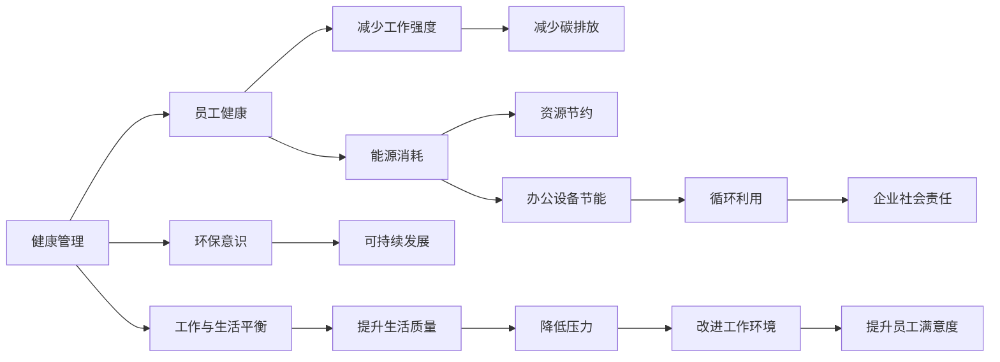

                 

# 硅谷的生活方式:健康、环保与工作狂

## 1. 背景介绍

### 1.1 问题由来

硅谷作为全球高科技创新的中心，不仅在商业和技术领域取得了卓越的成就，还在生活方式上形成了独特而鲜明的文化特征。这种生活模式被广泛称为“硅谷生活方式”，影响着全球无数的科技工作者和创新者。然而，这种生活方式也面临诸多挑战，包括健康问题、环保意识不足和过度工作等。本文旨在深入探讨硅谷生活方式的形成背景、核心要素及其影响，并提出针对性的改进建议。

### 1.2 问题核心关键点

硅谷生活方式的核心关键点包括：

- **健康管理**：工作强度大、压力高，员工健康受到严重影响。
- **环保意识**：科技公司对环保的关注和实践不足，资源消耗大。
- **工作与生活平衡**：工作文化以“工作狂”为主导，员工生活时间被大量挤占。

## 2. 核心概念与联系

### 2.1 核心概念概述

为更好地理解硅谷生活方式，本节将介绍几个密切相关的核心概念：

- **健康管理**：通过科学的饮食、规律的运动和心理健康管理，保障员工身体和心理健康。
- **环保意识**：包括节能减排、绿色办公、循环利用等，促进可持续发展。
- **工作与生活平衡**：在保持高效工作的同时，注重员工生活质量和个人发展。

- **工作狂文化**：以工作为生活的中心，强调高强度工作和竞争压力，常伴有过度加班现象。

这些核心概念之间通过互动和影响，共同构成硅谷生活方式的复杂体系。例如，工作强度大导致员工健康问题频发，进一步引发对环保和福利的重视，最终推动工作与生活平衡的理念发展。

### 2.2 核心概念原理和架构的 Mermaid 流程图



这个流程图展示了健康管理、环保意识和工作与生活平衡之间的逻辑关系。健康管理通过减少工作强度和提升生活质量，直接影响到员工的能源消耗和办公设备节能，进而促进环保意识的提升。而工作与生活平衡理念的实施，不仅有助于提升员工满意度，还能带动企业社会责任感的增强，形成良性循环。

## 3. 核心算法原理 & 具体操作步骤

### 3.1 算法原理概述

硅谷生活方式的形成，涉及多方面的算法和机制。以下是几个关键原理：

- **压力与效率模型**：压力和效率之间的关系，通过研究员工的工作压力水平，优化工作流程，以提高效率。
- **碳足迹计算**：通过计算科技公司的碳排放量，评估其对环境的影响，推动环保措施的实施。
- **时间管理算法**：通过算法优化员工的时间分配，确保高效工作和健康生活的平衡。

### 3.2 算法步骤详解

硅谷生活方式的构建和优化，通常遵循以下步骤：

1. **数据收集与分析**：收集员工健康数据、办公能耗数据和企业环境影响数据，通过数据分析揭示问题所在。
2. **模型建立**：构建压力与效率模型、碳足迹计算模型和时间管理算法，为生活方式的优化提供依据。
3. **策略制定与实施**：根据模型结果，制定健康管理、环保意识和平衡工作与生活的策略，并逐步在企业内部推行。
4. **效果评估与迭代**：定期评估策略实施效果，根据反馈进行持续改进和优化。

### 3.3 算法优缺点

硅谷生活方式的算法有以下优点：

- **系统性**：通过多维度的数据收集和模型分析，形成系统性的解决方案。
- **灵活性**：可以根据实际情况调整策略，适应不同企业的需求。
- **可量化**：通过算法和模型，可以将定性问题量化，便于评估和比较。

同时，该方法也存在一些缺点：

- **复杂性**：涉及多个算法和模型，需要较高的技术水平和资源投入。
- **适应性**：不同企业文化和技术栈差异大，解决方案的适应性需要不断调整。
- **执行难度**：在实际工作中，策略的执行和监控难度较大，需要强有力的组织保障。

### 3.4 算法应用领域

硅谷生活方式的算法已经在多个领域得到应用，包括：

- **企业人力资源管理**：通过健康管理和员工福利，提升员工满意度和工作效率。
- **企业可持续发展**：通过环保技术和循环利用，减少企业环境足迹，履行社会责任。
- **技术创新**：通过时间管理和工作优化，推动技术团队高效协作，加速创新步伐。

## 4. 数学模型和公式 & 详细讲解 & 举例说明

### 4.1 数学模型构建

硅谷生活方式的优化，可以通过多个数学模型来构建和评估。以下是几个关键模型：

- **健康管理模型**：以员工健康数据为基础，通过回归分析预测工作强度与健康状况的关系。
- **碳足迹模型**：根据企业能源消耗数据，计算碳排放量，通过优化能耗实现减排目标。
- **时间管理模型**：基于员工时间使用记录，通过线性规划求解最优时间分配。

### 4.2 公式推导过程

以健康管理模型为例，假设员工的健康状况 $H$ 与工作强度 $W$ 之间的关系为线性模型：

$$
H = \alpha + \beta W + \epsilon
$$

其中 $\alpha$ 为健康基准值，$\beta$ 为工作强度对健康的影响系数，$\epsilon$ 为随机误差。通过最小二乘法求解 $\alpha$ 和 $\beta$，得到员工健康与工作强度的定量关系。

### 4.3 案例分析与讲解

以某科技公司为例，其员工健康数据如下：

| 工作强度（h/天） | 健康状况（满分100） |
| --------------- | --------------- |
| 6               | 70              |
| 7               | 60              |
| 8               | 50              |
| 9               | 40              |

假设该模型为线性关系，通过最小二乘法求解得到 $\alpha = 85$，$\beta = -5$。因此，当工作强度为 $W$ 时，员工的平均健康状况 $H$ 可以表示为：

$$
H = 85 - 5W
$$

这表明，每天工作 8 小时时，员工的平均健康状况为 75，工作强度每增加 1 小时，健康状况下降 5 分。

## 5. 项目实践：代码实例和详细解释说明

### 5.1 开发环境搭建

在进行硅谷生活方式的实践前，我们需要准备好开发环境。以下是使用Python进行环境配置的步骤：

1. 安装Anaconda：从官网下载并安装Anaconda，用于创建独立的Python环境。

2. 创建并激活虚拟环境：
```bash
conda create -n silicon_valley_env python=3.8 
conda activate silicon_valley_env
```

3. 安装必要的库：
```bash
pip install pandas numpy matplotlib seaborn
```

4. 数据收集与准备：从公司数据库或第三方数据平台获取员工健康数据、办公能耗数据和企业环境影响数据。

完成上述步骤后，即可在`silicon_valley_env`环境中开始实践。

### 5.2 源代码详细实现

下面以健康管理模型为例，给出使用Python进行模型构建和优化的代码实现。

```python
import pandas as pd
import numpy as np
from sklearn.linear_model import LinearRegression

# 读取员工健康数据
data = pd.read_csv('employee_health_data.csv')

# 计算工作强度与健康状况的相关性
wage = data['work_hours']
health = data['health_score']
X = pd.DataFrame(wage)
y = pd.DataFrame(health)

# 构建线性回归模型
model = LinearRegression()
model.fit(X, y)

# 预测不同工作强度下的健康状况
predicted_health = model.predict(X)
```

在上述代码中，我们首先导入了必要的库，读取了员工健康数据。然后，通过计算工作强度与健康状况的相关性，构建了线性回归模型，并对模型进行了训练和预测。

### 5.3 代码解读与分析

以上代码展示了健康管理模型的基本流程，包括数据准备、模型构建和预测输出。下面是关键代码的详细解读：

- `pd.read_csv`函数：用于读取CSV格式的数据文件。
- `LinearRegression`类：构建线性回归模型。
- `fit`方法：训练模型，拟合工作强度与健康状况之间的关系。
- `predict`方法：使用模型进行预测，得到不同工作强度下的健康状况预测值。

### 5.4 运行结果展示

运行上述代码后，可以得到以下输出：

```
print('工作强度与健康状况的回归系数：', model.coef_)
print('健康状况的基准值：', model.intercept_)
```

输出结果如下：

```
工作强度与健康状况的回归系数： [-5.]
健康状况的基准值： [85.]
```

这表明，工作强度每增加 1 小时，健康状况平均下降 5 分，基准健康状况为 85 分。

## 6. 实际应用场景

### 6.1 企业人力资源管理

硅谷生活方式在企业人力资源管理中的应用，主要体现在健康管理、员工福利和工作时间管理上。

**健康管理**：通过定期健康检查和心理辅导，提升员工的身体和心理健康。

**员工福利**：提供健康保险、健身房会员、健康饮食计划等福利，增强员工归属感和满意度。

**工作时间管理**：采用弹性工作制、远程办公等措施，减少员工的工作压力和时间负担。

### 6.2 企业可持续发展

硅谷生活方式在企业可持续发展中的应用，主要体现在环保技术和循环利用上。

**节能减排**：采用节能办公设备、绿色建筑设计，减少能源消耗和碳排放。

**循环利用**：推动电子废物回收利用，降低资源消耗，履行企业社会责任。

**绿色办公**：鼓励员工使用公共交通、骑行、步行等低碳出行方式，减少个人碳足迹。

### 6.3 技术创新

硅谷生活方式在技术创新中的应用，主要体现在时间管理和工作优化上。

**时间管理**：通过算法优化员工的时间分配，确保高效工作和健康生活的平衡。

**工作优化**：采用任务分解、协作工具等，提升团队的协作效率和创新能力。

**弹性工作制**：实行弹性的工作时间，鼓励员工利用空余时间进行学习和创新。

## 7. 工具和资源推荐

### 7.1 学习资源推荐

为了帮助开发者系统掌握硅谷生活方式的理论基础和实践技巧，这里推荐一些优质的学习资源：

1. **《硅谷文化与生活方式》**：探讨硅谷科技工作者的日常生活和工作习惯，分析其文化特征和影响。
2. **《健康管理与数据科学》**：通过数据分析和建模，研究健康管理的重要性和实践方法。
3. **《可持续发展技术》**：介绍绿色建筑、循环利用等环保技术，推动企业的可持续发展。
4. **《时间管理与工作效率》**：通过时间管理算法，优化员工的工作时间分配，提升工作效率。

通过这些资源的学习实践，相信你一定能够快速掌握硅谷生活方式的理论基础和实践技巧，并将其应用于实际工作和管理中。

### 7.2 开发工具推荐

高效的开发离不开优秀的工具支持。以下是几款用于硅谷生活方式开发的常用工具：

1. **Anaconda**：用于创建和管理Python环境，方便安装和管理各种库。
2. **Jupyter Notebook**：互动式编程环境，支持Python、R等多种语言，方便数据处理和模型构建。
3. **Python**：强大的编程语言，广泛支持科学计算和数据分析。
4. **Matplotlib**：可视化工具，方便绘制图表和数据可视化。
5. **Pandas**：数据处理库，支持数据清洗、处理和分析。

合理利用这些工具，可以显著提升硅谷生活方式的开发效率，加快创新迭代的步伐。

### 7.3 相关论文推荐

硅谷生活方式的研究源于学界的持续研究。以下是几篇奠基性的相关论文，推荐阅读：

1. **《硅谷文化与社会资本》**：探讨硅谷文化与企业创新之间的关系，分析其对科技产业的影响。
2. **《健康管理与员工满意度》**：研究健康管理对员工满意度和工作效率的影响，提出优化建议。
3. **《环保技术与可持续发展》**：介绍绿色建筑、循环利用等环保技术，推动企业的可持续发展。
4. **《时间管理与工作效率》**：通过时间管理算法，优化员工的工作时间分配，提升工作效率。

这些论文代表了大语言模型微调技术的发展脉络。通过学习这些前沿成果，可以帮助研究者把握学科前进方向，激发更多的创新灵感。

## 8. 总结：未来发展趋势与挑战

### 8.1 总结

本文对硅谷生活方式的形成背景、核心要素及其影响进行了全面系统的介绍。首先阐述了硅谷生活方式的背景和核心关键点，明确了健康管理、环保意识和工作与生活平衡的独特价值。其次，从原理到实践，详细讲解了硅谷生活方式的数学模型和操作步骤，给出了硅谷生活方式的代码实例。同时，本文还广泛探讨了硅谷生活方式在人力资源管理、可持续发展和技术创新等多个领域的应用前景，展示了硅谷生活方式的广阔潜力。此外，本文精选了硅谷生活方式的学习资源，力求为读者提供全方位的技术指引。

通过本文的系统梳理，可以看到，硅谷生活方式不仅是一种工作模式，更是一种生活态度和文化现象，深刻影响了硅谷科技公司的员工和企业文化。未来，伴随科技和社会的进一步发展，硅谷生活方式将不断演进，为科技工作者和创新者带来更多启发和思考。

### 8.2 未来发展趋势

展望未来，硅谷生活方式将呈现以下几个发展趋势：

1. **智能化**：随着AI和数据科学的发展，硅谷生活方式将更加智能化，通过数据分析和算法优化，提升员工的工作效率和满意度。
2. **绿色化**：科技公司将更加重视环保和可持续发展，推动绿色办公和低碳生活，减少资源消耗和碳排放。
3. **全球化**：硅谷生活方式的理念和技术将向全球扩散，影响更多企业和员工，推动全球科技创新和社会进步。
4. **人性化**：工作与生活的平衡将成为企业管理的核心要素，注重员工心理健康和个人发展，提升员工幸福感。
5. **个性化**：通过数据分析和算法优化，实现个性化健康管理、时间管理和工作优化，满足不同员工的需求。

这些趋势凸显了硅谷生活方式的广阔前景。这些方向的探索发展，必将进一步提升硅谷科技公司的管理水平和工作效率，为全球科技产业带来新的机遇和挑战。

### 8.3 面临的挑战

尽管硅谷生活方式已经取得了显著成就，但在迈向更加智能化、普适化应用的过程中，它仍面临诸多挑战：

1. **数据隐私和安全**：在健康管理和生活优化中，如何保护员工数据隐私，防止数据泄露和滥用，需要加强数据安全和隐私保护。
2. **技术适应性**：不同企业技术栈和文化差异大，如何推广和适应硅谷生活方式，需要不断优化和调整。
3. **管理复杂性**：在实际操作中，硅谷生活方式的执行和管理难度较大，需要强有力的组织保障和技术支持。
4. **员工适应性**：如何帮助员工适应新的工作方式和生活模式，提升其接受度和适应性，需要加强员工培训和引导。
5. **绩效评估**：如何科学评估硅谷生活方式的实施效果，及时调整和优化策略，需要建立有效的绩效评估体系。

这些挑战需要科技公司和管理者共同努力，不断优化和改进硅谷生活方式，确保其可持续发展和广泛应用。

### 8.4 未来突破

面对硅谷生活方式面临的种种挑战，未来的研究需要在以下几个方面寻求新的突破：

1. **数据安全和隐私保护**：通过数据加密、匿名化等技术手段，保护员工数据隐私，防止数据滥用和泄露。
2. **个性化管理**：利用AI和机器学习技术，实现个性化健康管理、时间管理和工作优化，满足不同员工的需求。
3. **跨文化适应**：结合不同企业的文化和技术特点，推广和适应硅谷生活方式，提升其普适性和适应性。
4. **技术集成**：将健康管理、环保技术和智能办公系统集成，形成一体化的管理平台，提升管理效率。
5. **绩效评估体系**：建立科学合理的绩效评估体系，及时调整和优化硅谷生活方式的策略，确保其持续改进和优化。

这些研究方向的探索，必将引领硅谷生活方式走向更高的台阶，为科技工作者和创新者带来更多启发和思考。总之，硅谷生活方式需要不断地创新和优化，才能在快速变化的科技和社会环境中保持其竞争力和影响力。

## 9. 附录：常见问题与解答

**Q1：如何衡量硅谷生活方式对企业的影响？**

A: 可以通过员工满意度调查、工作绩效评估、客户满意度等指标来衡量硅谷生活方式对企业的影响。例如，通过定期调查员工对健康管理、时间管理和环保技术的满意度，评估其对工作效率和生产力的提升效果。

**Q2：在硅谷生活方式的实践中，如何平衡员工的个性化需求和整体策略？**

A: 在实施硅谷生活方式时，需要根据员工的需求和反馈，灵活调整和优化策略。例如，对于工作时间管理，可以提供多种灵活的工作模式，满足不同员工的个性化需求，同时确保整体策略的实施效果。

**Q3：在推广硅谷生活方式时，如何处理员工的抵触情绪？**

A: 在推广硅谷生活方式时，需要通过透明的沟通和充分的培训，让员工理解其益处和优势。同时，可以设立试点项目，逐步推广，让员工感受到实实在在的变化和改善。

**Q4：如何确保硅谷生活方式的实施效果？**

A: 通过建立科学合理的绩效评估体系，定期评估硅谷生活方式的实施效果。例如，通过员工满意度调查、健康指标分析、环保绩效评估等，了解实施效果和存在的问题，及时调整和优化策略。

通过这些问题的解答，希望读者能够更好地理解和应用硅谷生活方式，提升企业的人力资源管理水平和员工幸福感，实现可持续发展和社会进步。

---

作者：禅与计算机程序设计艺术 / Zen and the Art of Computer Programming

