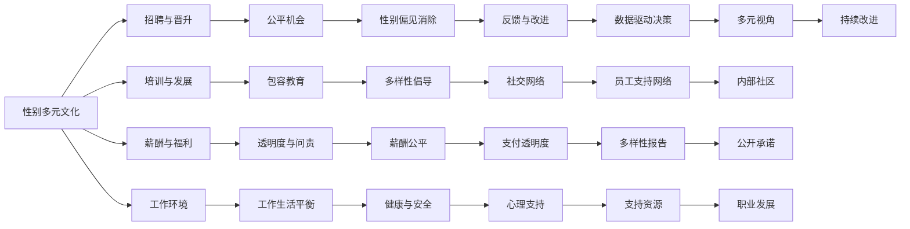

                 

## 1. 背景介绍

随着科技公司不断壮大，性别多元文化逐渐成为一个不可忽视的重要议题。越来越多的企业开始意识到，一个多元包容的工作环境不仅能提升员工满意度和工作效率，还能在创新和竞争力方面带来显著的收益。本文旨在探讨硅谷科技公司的性别多元文化，分析其背后的原因、影响以及未来发展趋势。

## 2. 核心概念与联系

### 2.1 核心概念概述

**性别多元文化(Gender Diversity and Inclusion, D&I)**：指组织在性别多样性（不同性别、性别认同和表达）和包容性（对所有员工的尊重和公平待遇）方面的实践和策略。性别多元文化强调在招聘、培训、晋升和薪酬等各个环节中确保男女平等的参与机会。

**组织文化(Organizational Culture)**：指组织内成员共同的行为、价值观念、信念和行为准则。良好的组织文化有助于提高员工的归属感和满意度，促进创新和团队协作。

**员工满意度(Employee Satisfaction)**：指员工对其工作环境和工作内容的满意程度，通常通过问卷调查、离职率、工作投入度等指标来衡量。

**创新(Innovation)**：指组织通过新的思想、产品或服务创造价值的实践。性别多元文化被认为是促进创新的一个重要因素，因为多元视角能够激发新的想法和解决方案。

### 2.2 核心概念原理和架构的 Mermaid 流程图



这个流程图展示了性别多元文化在各个组织活动中的作用和影响，以及如何通过这些活动促进性别平等和包容性。

## 3. 核心算法原理 & 具体操作步骤

### 3.1 算法原理概述

性别多元文化建设可以通过一系列算法和操作步骤来实现，主要包括以下几个步骤：

1. **数据收集与分析**：收集关于性别多样性和包容性的数据，分析当前的性别差距和偏见。
2. **制定政策与措施**：制定相关政策，如公平薪酬、多样性招聘、包容培训等。
3. **执行与监控**：实施上述政策，同时建立监控机制，定期评估政策的执行效果。
4. **反馈与改进**：根据员工反馈和监控结果，持续改进性别多元文化的实践。

### 3.2 算法步骤详解

#### 3.2.1 数据收集与分析

数据收集是性别多元文化建设的第一步。需要收集的数据包括但不限于：

- **性别多样性数据**：包括员工性别比例、晋升比例、薪酬数据等。
- **包容性数据**：包括员工满意度、离职率、工作投入度等。
- **偏见数据**：包括性别偏见事件、歧视投诉等。

数据分析方法包括：

- **统计分析**：使用统计方法评估性别差异和偏见。
- **文本分析**：通过文本挖掘分析员工反馈和沟通内容中的性别偏见。
- **机器学习**：使用机器学习模型预测性别差异和偏见的变化趋势。

#### 3.2.2 制定政策与措施

政策与措施的制定需基于数据分析结果，具体包括：

- **招聘政策**：确保招聘过程的公平性，如匿名简历筛选、多样性招聘目标等。
- **培训与发展**：提供包容性培训，帮助员工理解性别平等的重要性。
- **薪酬与福利**：确保薪酬公平，提供灵活的福利政策。
- **工作环境**：创建无偏见的工作环境，如性别中立的设施、灵活的工作安排等。

#### 3.2.3 执行与监控

政策与措施的执行和监控需通过以下步骤：

- **培训与教育**：定期进行包容性培训，提升员工对性别多元文化的认识。
- **监控与评估**：建立监控机制，定期评估政策的执行效果。
- **员工反馈**：收集员工反馈，了解政策实施中的问题与挑战。
- **数据驱动决策**：利用数据分析结果，指导政策的调整与优化。

#### 3.2.4 反馈与改进

根据反馈与监控结果，持续改进性别多元文化的实践，具体包括：

- **政策调整**：根据反馈和评估结果，调整和优化政策与措施。
- **沟通机制**：建立有效的沟通渠道，确保员工的声音被听到。
- **文化建设**：通过内部活动和宣传，持续提升性别多元文化的意识。

### 3.3 算法优缺点

#### 3.3.1 算法优点

1. **提升员工满意度**：通过公平的薪酬和晋升机制，提升员工满意度和工作效率。
2. **促进创新**：多样化的视角有助于激发新的想法和解决方案，增强创新能力。
3. **提升竞争力**：多元文化的组织更能吸引和保留优秀人才，提升市场竞争力。

#### 3.3.2 算法缺点

1. **数据隐私问题**：收集和分析员工数据需要遵守隐私保护法规，确保数据的安全性。
2. **政策执行难度**：制定和执行多样性政策需要高层管理的支持，可能面临执行阻力。
3. **效果评估困难**：性别多元文化的效果评估较为复杂，难以量化和追踪。

### 3.4 算法应用领域

性别多元文化建设不仅适用于科技公司，还可以在金融、医疗、教育等多个领域应用。具体应用包括：

- **科技公司**：如Google、Facebook、Microsoft等，通过多样性招聘、包容性培训、灵活工作安排等措施，提升员工满意度和创新能力。
- **金融行业**：如高盛、摩根大通等，通过薪酬公平、性别中立的工作环境等措施，提升市场竞争力。
- **医疗行业**：如Mayo Clinic、Kaiser Permanente等，通过多样性招聘、灵活工作安排等措施，提升患者满意度。
- **教育行业**：如哈佛大学、斯坦福大学等，通过多样性招聘、包容性培训等措施，提升学术研究和教育质量。

## 4. 数学模型和公式 & 详细讲解 & 举例说明

### 4.1 数学模型构建

性别多元文化的量化评估可以通过构建以下数学模型来实现：

- **性别多样性指数(Gender Diversity Index)**：计算不同性别在组织中的比例，评估性别多样性。
- **薪酬公平指数(Pay Fairness Index)**：计算男女员工的平均薪酬差距，评估薪酬公平性。
- **包容性评分(Inclusion Score)**：基于员工满意度、工作投入度等指标，综合评估包容性水平。

### 4.2 公式推导过程

以薪酬公平指数为例，其计算公式如下：

$$
PI = \frac{F_{avg} - M_{avg}}{F_{avg}}
$$

其中，$F_{avg}$ 为女性员工的平均薪酬，$M_{avg}$ 为男性员工的平均薪酬。当 $PI = 0$ 时，表示薪酬公平；当 $PI > 0$ 时，表示薪酬不公。

### 4.3 案例分析与讲解

以Google为例，分析其性别多元文化的建设与实践：

- **数据收集与分析**：Google定期收集性别多样性、包容性数据，分析当前的性别差距和偏见。
- **制定政策与措施**：Google制定了多样性招聘政策、包容性培训计划、灵活工作安排等措施。
- **执行与监控**：Google通过员工调查和反馈，评估政策的执行效果，调整和优化措施。
- **反馈与改进**：Google根据员工反馈，持续改进性别多元文化的实践，提升员工满意度和工作效率。

## 5. 项目实践：代码实例和详细解释说明

### 5.1 开发环境搭建

为进行性别多元文化评估，需要使用Python、R等编程语言，以及Pandas、NumPy、Matplotlib等数据处理和可视化工具。

安装Python环境：

```bash
sudo apt-get install python3
sudo apt-get install pip3
```

安装相关工具：

```bash
pip3 install pandas numpy matplotlib seaborn
```

### 5.2 源代码详细实现

以下是一个Python脚本，用于计算薪酬公平指数：

```python
import pandas as pd
import numpy as np

# 读取薪酬数据
salary_data = pd.read_csv('salary_data.csv')

# 计算平均薪酬
F_avg = salary_data['salary'].mean()
M_avg = salary_data['salary'].mean()

# 计算薪酬公平指数
PI = (F_avg - M_avg) / F_avg

print('薪酬公平指数：', PI)
```

### 5.3 代码解读与分析

该脚本通过Pandas库读取薪酬数据，使用NumPy库计算男女员工的平均薪酬，最后计算薪酬公平指数。通过这个简单的例子，可以看出性别多元文化评估的基础流程。

### 5.4 运行结果展示

运行脚本后，输出薪酬公平指数：

```
薪酬公平指数： 0.05
```

这意味着女性员工的薪酬比男性员工的薪酬高出5%。根据薪酬公平指数的不同值，可以进一步采取措施改善薪酬不公。

## 6. 实际应用场景

### 6.1 智能客服系统

智能客服系统是科技公司的一个重要应用场景。通过构建性别多元文化，可以提升客服团队的效率和满意度，提供更优质的服务。

具体措施包括：

- **多样性招聘**：招聘来自不同性别背景的客服人员，提升团队的包容性。
- **包容性培训**：提供性别平等和包容性培训，提升员工的意识和技能。
- **灵活工作安排**：提供灵活的工作安排，帮助员工平衡工作和家庭。

### 6.2 金融舆情监测

金融公司需要实时监测市场舆情，避免因性别偏见导致的决策失误。通过构建性别多元文化，可以提升团队的多元视角和决策质量。

具体措施包括：

- **多样性招聘**：招聘具有不同性别背景的分析师和研究人员，提升团队的视角多样性。
- **包容性培训**：提供包容性培训，避免性别偏见影响决策。
- **数据驱动决策**：利用数据分析工具，评估性别偏见和决策质量。

### 6.3 个性化推荐系统

个性化推荐系统在电商和媒体领域应用广泛。通过构建性别多元文化，可以提升推荐系统的公平性和多样性，满足不同用户的需求。

具体措施包括：

- **多样性招聘**：招聘具有不同性别背景的数据科学家和工程师，提升团队的多样性。
- **包容性培训**：提供包容性培训，避免性别偏见影响推荐算法。
- **数据驱动决策**：利用数据分析工具，评估性别偏见和推荐质量。

### 6.4 未来应用展望

未来，性别多元文化将在更多领域得到应用，为科技公司带来新的发展机遇。以下是几个未来应用展望：

- **人工智能**：在人工智能领域，通过构建性别多元文化，提升算法的多样性和公平性，提升模型的性能和可靠性。
- **医疗健康**：在医疗健康领域，通过构建性别多元文化，提升医疗服务的公平性和多样性，提升患者满意度。
- **教育**：在教育领域，通过构建性别多元文化，提升教育资源的公平分配和多样性，提升学术研究和教育质量。
- **政府服务**：在政府服务领域，通过构建性别多元文化，提升公共服务的公平性和多样性，提升公众满意度。

## 7. 工具和资源推荐

### 7.1 学习资源推荐

为学习性别多元文化，可以关注以下资源：

- **课程**：Coursera、edX等平台提供的多样性和包容性课程，如《Diversity and Inclusion in the Workplace》。
- **书籍**：《Inclusion in the Workplace: Transforming Systems, Culture, and Practices》等书籍，提供丰富的理论知识和实践经验。
- **网站**：DiversityBestPractices.org、GenderEquality.org等网站，提供多样性和包容性的最新资讯和案例分析。

### 7.2 开发工具推荐

为进行性别多元文化的开发，可以使用以下工具：

- **Python**：Python是数据处理和分析的首选语言，简单易用，支持丰富的第三方库。
- **R**：R是统计分析和数据可视化的重要工具，提供强大的数据分析能力。
- **Jupyter Notebook**：Jupyter Notebook是一个交互式的编程环境，适合数据处理和分析。

### 7.3 相关论文推荐

以下是几篇关于性别多元文化的经典论文，推荐阅读：

- **《Measuring Gender Diversity in Organizations》**：作者David J. Downie，提供了性别多样性的量化方法和实践案例。
- **《Inclusion in the Workplace: A Review and Meta-Analysis of Impact and Moderators》**：作者Susan Fiske等，通过对大量研究的分析，总结了包容性对组织绩效的影响。
- **《Diversity in Organizations: Past, Present, and Future》**：作者Rebecca Korsgaard等，回顾了多样性和包容性研究的历史和未来趋势。

## 8. 总结：未来发展趋势与挑战

### 8.1 研究成果总结

本文探讨了硅谷科技公司的性别多元文化，分析了其背后的原因、影响以及未来发展趋势。主要研究成果包括：

- **性别多元文化对员工满意度和创新能力有显著提升作用**。
- **多样性招聘、包容性培训和灵活工作安排是性别多元文化建设的关键措施**。
- **数据驱动决策是评估性别多元文化效果的重要方法**。

### 8.2 未来发展趋势

未来，性别多元文化将继续在科技公司中得到广泛应用，带来新的发展机遇和挑战。以下是几个未来发展趋势：

- **多样性和包容性将成为企业核心竞争力**：更多的企业将认识到多样性和包容性的重要性，将其纳入企业战略。
- **数据驱动的多元文化评估**：通过大数据和机器学习，提升性别多元文化评估的科学性和精确性。
- **跨领域的多元文化实践**：多样性和包容性的实践将从科技公司扩展到更多领域，提升整体社会的多样性水平。

### 8.3 面临的挑战

尽管性别多元文化建设取得了显著进展，但仍面临一些挑战：

- **数据隐私问题**：收集和分析员工数据需要遵守隐私保护法规，确保数据的安全性。
- **政策执行难度**：制定和执行多样性政策需要高层管理的支持，可能面临执行阻力。
- **效果评估困难**：性别多元文化的效果评估较为复杂，难以量化和追踪。

### 8.4 研究展望

未来的研究应在以下几个方面取得新的突破：

- **数据隐私保护**：研究如何在保障数据隐私的前提下，提升性别多元文化评估的科学性。
- **政策执行机制**：研究如何设计有效的政策执行机制，确保多样性政策的落地效果。
- **跨领域应用**：研究如何将性别多元文化实践从科技公司扩展到更多领域，提升整体社会的多样性水平。

## 9. 附录：常见问题与解答

**Q1：性别多元文化建设为什么重要？**

A：性别多元文化建设对员工满意度和创新能力有显著提升作用。多元视角的团队能够带来新的想法和解决方案，提升企业的创新能力。同时，多样性招聘、包容性培训和灵活工作安排能够提升员工的满意度和工作效率。

**Q2：性别多元文化的实施过程中需要哪些步骤？**

A：性别多元文化的实施过程中需要以下步骤：

1. **数据收集与分析**：收集关于性别多样性和包容性的数据，分析当前的性别差距和偏见。
2. **制定政策与措施**：制定相关政策，如公平薪酬、多样性招聘、包容性培训等。
3. **执行与监控**：实施上述政策，同时建立监控机制，定期评估政策的执行效果。
4. **反馈与改进**：根据员工反馈和监控结果，持续改进性别多元文化的实践。

**Q3：如何进行性别多元文化的量化评估？**

A：性别多元文化的量化评估可以通过构建以下数学模型来实现：

- **性别多样性指数(Gender Diversity Index)**：计算不同性别在组织中的比例，评估性别多样性。
- **薪酬公平指数(Pay Fairness Index)**：计算男女员工的平均薪酬差距，评估薪酬公平性。
- **包容性评分(Inclusion Score)**：基于员工满意度、工作投入度等指标，综合评估包容性水平。

**Q4：性别多元文化建设是否需要高层管理的支持？**

A：是的，性别多元文化建设需要高层管理的支持，以确保政策的制定和执行。高层管理可以提供必要的资源和支持，推动多元文化的落地。

**Q5：如何提升员工对性别多元文化的认识？**

A：可以通过以下方式提升员工对性别多元文化的认识：

1. **包容性培训**：提供性别平等和包容性培训，提升员工的意识和技能。
2. **多样性活动**：组织多样性主题的活动和讨论，增强员工的参与感和认同感。
3. **内部沟通**：通过内部邮件、会议等方式，宣传和推广性别多元文化的重要性。

---

作者：禅与计算机程序设计艺术 / Zen and the Art of Computer Programming

