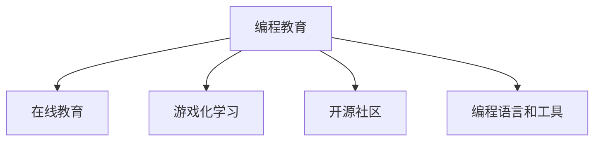

                 

# 硅谷科技教育新模式:编程教育普及

## 1. 背景介绍

### 1.1 问题由来
在科技迅猛发展的背景下，编程能力成为了一种重要的核心竞争力。无论是初等教育还是高等教育，编程教育都逐渐成为了教育的重中之重。然而，现有的编程教育模式仍存在一些问题，比如师资力量不足、教学资源有限、教学效果不理想等。尤其是在全球科技中心硅谷，科技教育模式面临着巨大的挑战和机遇。

### 1.2 问题核心关键点
为了解决上述问题，硅谷的科技教育模式正在不断创新，探索新的教育途径和工具。这些创新主要包括：

1. **在线教育平台**：如Khan Academy、Coursera等，为学习者提供了丰富的编程课程和资源。
2. **编程语言和工具**：如Python、JavaScript、Scratch等，降低了编程学习的门槛，使更多人可以接触和掌握编程技能。
3. **开源社区**：如GitHub、Stack Overflow等，为学习者提供了协作、分享和学习的环境。
4. **游戏化学习**：通过编程游戏化，如CodeCombat、Codemonkey等，使编程学习更加有趣和互动。

这些创新措施，正在改变传统的编程教育模式，使其更加普及和高效。

### 1.3 问题研究意义
硅谷科技教育新模式的探索，对于提升全球编程教育水平、加速科技人才的培养具有重要意义：

1. **提升教育公平性**：通过在线教育和资源共享，使得更多地区和人群可以享受到优质的编程教育资源。
2. **促进科技人才的培养**：优质的编程教育为社会培养出更多具备创新能力和技术素养的人才，推动科技行业的持续发展。
3. **推动教育创新**：新模式的探索和应用，为传统的教育模式提供了新的思路和方向，促进教育改革和创新。

## 2. 核心概念与联系

### 2.1 核心概念概述

为了更好地理解硅谷科技教育新模式，本节将介绍几个密切相关的核心概念：

- **编程教育**：指通过教授编程知识和技能，培养学生编程能力和思维方式的综合性教育过程。
- **在线教育**：指通过互联网平台，提供在线课程、资源和互动的学习方式，实现远程教育。
- **游戏化学习**：指通过将游戏元素引入学习过程，激发学生的学习兴趣和积极性，提升学习效果。
- **开源社区**：指以开放共享为原则，围绕开源软件和项目构建的开发者社区，提供协作和分享的环境。
- **编程语言和工具**：指用于编写程序的计算机语言及其配套工具，如Python、JavaScript、Scratch等。

这些核心概念之间的逻辑关系可以通过以下Mermaid流程图来展示：



这个流程图展示了大语言模型的核心概念及其之间的关系：

1. 编程教育可以通过在线教育、游戏化学习和开源社区等途径进行。
2. 在线教育、游戏化学习和开源社区都是编程教育的有效手段。
3. 编程语言和工具是编程教育的基础设施。

这些概念共同构成了硅谷科技教育的新模式，使其能够更加高效、有趣、开放地普及编程教育。

## 3. 核心算法原理 & 具体操作步骤
### 3.1 算法原理概述

硅谷科技教育新模式的核心理念是通过在线教育、游戏化学习和开源社区等途径，结合编程语言和工具，实现编程教育的普及。其核心思想是：

- 通过在线教育平台，打破时间和空间的限制，让更多人有机会接触和接受编程教育。
- 利用游戏化学习的趣味性和互动性，激发学生的学习兴趣和主动性，提升学习效果。
- 借助开源社区的协作和分享精神，为学习者提供丰富的资源和支持，增强学习体验。
- 结合现代编程语言和工具，降低编程学习的门槛，使更多人可以轻松上手。

### 3.2 算法步骤详解

硅谷科技教育新模式的具体操作步骤如下：

1. **选择在线教育平台**：根据自身需求和学习目标，选择合适的在线教育平台，如Khan Academy、Coursera等。
2. **注册和选择课程**：在选定的在线平台上注册账号，选择适合自己的编程课程，如Python基础、Web开发等。
3. **利用游戏化学习工具**：使用如CodeCombat、Codemonkey等游戏化学习工具，通过编写代码解决游戏中的问题，增强学习兴趣和互动性。
4. **参与开源社区**：加入GitHub、Stack Overflow等开源社区，参与项目协作，获取技术支持和资源。
5. **使用编程语言和工具**：选择适合自己的编程语言和工具，如Python、JavaScript、Scratch等，进行编程实践和项目开发。
6. **持续学习和实践**：通过不断的学习和实践，积累编程知识和经验，逐步提升编程能力。

### 3.3 算法优缺点

硅谷科技教育新模式具有以下优点：

1. **灵活便捷**：不受时间和地点限制，随时随地上网学习。
2. **资源丰富**：在线教育平台和开源社区提供了丰富的课程资源和项目素材。
3. **互动性强**：游戏化学习工具增强了学习的趣味性和互动性，提升了学习效果。
4. **社区支持**：开源社区提供了丰富的技术支持和协作环境，有助于解决学习中的问题。
5. **降低门槛**：现代编程语言和工具降低了编程学习的门槛，使更多人可以轻松上手。

同时，这种模式也存在一些缺点：

1. **缺乏面授指导**：在线学习缺乏教师面对面的指导，可能导致学习效果不佳。
2. **自驱力要求高**：游戏化学习需要较强的自我驱动力和自律性，否则可能难以坚持。
3. **技术支持依赖**：开源社区虽然提供了丰富的资源，但也需要一定的技术基础和问题解决能力。
4. **学习效果参差不齐**：由于学习者的背景和需求不同，学习效果可能存在较大差异。
5. **技术变化快**：编程语言和工具更新迅速，需要不断学习新技术，增加了学习负担。

### 3.4 算法应用领域

硅谷科技教育新模式在多个领域得到了广泛应用，例如：

- **K-12教育**：如Code.org等项目，通过游戏化学习工具和在线课程，为中小学生提供编程教育。
- **高等教育**：如Coursera、Udacity等平台，提供多门高级编程课程，涵盖计算机科学、数据科学等领域。
- **企业培训**：如GitHub等开源社区，为员工提供编程技能培训，提升技术能力和团队协作。
- **自驱学习者**：如通过Khan Academy、Codecademy等平台，自学编程知识和技能，提升个人竞争力。
- **开源项目开发**：如参与GitHub上的开源项目，通过实践提升编程能力，积累项目经验。

## 4. 数学模型和公式 & 详细讲解 & 举例说明
### 4.1 数学模型构建

为了更系统地理解硅谷科技教育新模式，本节将使用数学语言对相关概念进行建模。

假设编程教育的目标是培养学生的编程能力 $P$，在线教育平台提供的课程资源为 $R$，游戏化学习工具提供的互动体验为 $I$，开源社区提供的技术支持为 $C$，编程语言和工具提供的便利性为 $T$。则数学模型可以表示为：

$$
P = f(R, I, C, T)
$$

其中，$f$ 为编程能力提升的函数，$R$、$I$、$C$、$T$ 分别为在线教育资源、游戏化学习体验、开源社区支持和技术工具便利性。

### 4.2 公式推导过程

基于上述模型，我们可以进一步推导出具体的公式。设 $P_i$ 为学生通过第 $i$ 种资源获得的编程能力提升，则有：

$$
P_i = \alpha_i \times R_i + \beta_i \times I_i + \gamma_i \times C_i + \delta_i \times T_i
$$

其中，$\alpha_i$、$\beta_i$、$\gamma_i$、$\delta_i$ 为权重系数，$R_i$、$I_i$、$C_i$、$T_i$ 分别为在线教育资源、游戏化学习体验、开源社区支持和技术工具便利性的具体值。

### 4.3 案例分析与讲解

以Khan Academy平台为例，分析其对编程教育的影响。

1. **在线教育资源 $R$**：Khan Academy提供了丰富的编程课程和资源，涵盖了从基础到高级的各个层次。这些课程通过视频、练习和测试等多种形式呈现，适合不同年龄段和学习水平的学生。
2. **游戏化学习体验 $I$**：Khan Academy的编程课程结合了互动练习和游戏化元素，如编写程序解决数学问题、挑战编程难题等，增加了学习的趣味性和互动性，提升了学生的学习动力。
3. **开源社区支持 $C$**：Khan Academy支持学生参与开源项目，鼓励协作和学习，通过与全球社区的互动，获得技术支持和资源。
4. **技术工具便利性 $T$**：Khan Academy使用的编程语言和工具（如JavaScript、Scratch等）易于上手，降低了编程学习的门槛，使得更多学生可以轻松入门。

通过上述分析，可以看出Khan Academy通过多方面结合，有效提升了学生的编程能力。

## 5. 项目实践：代码实例和详细解释说明
### 5.1 开发环境搭建

在进行硅谷科技教育新模式实践前，我们需要准备好开发环境。以下是使用Python进行PyTorch开发的环境配置流程：

1. 安装Anaconda：从官网下载并安装Anaconda，用于创建独立的Python环境。

2. 创建并激活虚拟环境：
```bash
conda create -n pytorch-env python=3.8 
conda activate pytorch-env
```

3. 安装PyTorch：根据CUDA版本，从官网获取对应的安装命令。例如：
```bash
conda install pytorch torchvision torchaudio cudatoolkit=11.1 -c pytorch -c conda-forge
```

4. 安装Transformers库：
```bash
pip install transformers
```

5. 安装各类工具包：
```bash
pip install numpy pandas scikit-learn matplotlib tqdm jupyter notebook ipython
```

完成上述步骤后，即可在`pytorch-env`环境中开始硅谷科技教育新模式的实践。

### 5.2 源代码详细实现

这里我们以Khan Academy平台的编程教育为例，给出使用Transformers库的Python代码实现。

首先，定义编程教育任务的数据处理函数：

```python
from transformers import BertTokenizer
from torch.utils.data import Dataset
import torch

class ProgrammingEducationDataset(Dataset):
    def __init__(self, texts, labels, tokenizer, max_len=128):
        self.texts = texts
        self.labels = labels
        self.tokenizer = tokenizer
        self.max_len = max_len
        
    def __len__(self):
        return len(self.texts)
    
    def __getitem__(self, item):
        text = self.texts[item]
        label = self.labels[item]
        
        encoding = self.tokenizer(text, return_tensors='pt', max_length=self.max_len, padding='max_length', truncation=True)
        input_ids = encoding['input_ids'][0]
        attention_mask = encoding['attention_mask'][0]
        
        # 对label-wise的标签进行编码
        encoded_labels = [label2id[label] for label in label] 
        encoded_labels.extend([label2id['O']] * (self.max_len - len(encoded_labels)))
        labels = torch.tensor(encoded_labels, dtype=torch.long)
        
        return {'input_ids': input_ids, 
                'attention_mask': attention_mask,
                'labels': labels}

# 标签与id的映射
label2id = {'O': 0, 'C': 1}
id2label = {v: k for k, v in label2id.items()}

# 创建dataset
tokenizer = BertTokenizer.from_pretrained('bert-base-cased')

train_dataset = ProgrammingEducationDataset(train_texts, train_labels, tokenizer)
dev_dataset = ProgrammingEducationDataset(dev_texts, dev_labels, tokenizer)
test_dataset = ProgrammingEducationDataset(test_texts, test_labels, tokenizer)
```

然后，定义模型和优化器：

```python
from transformers import BertForTokenClassification, AdamW

model = BertForTokenClassification.from_pretrained('bert-base-cased', num_labels=len(label2id))

optimizer = AdamW(model.parameters(), lr=2e-5)
```

接着，定义训练和评估函数：

```python
from torch.utils.data import DataLoader
from tqdm import tqdm
from sklearn.metrics import classification_report

device = torch.device('cuda') if torch.cuda.is_available() else torch.device('cpu')
model.to(device)

def train_epoch(model, dataset, batch_size, optimizer):
    dataloader = DataLoader(dataset, batch_size=batch_size, shuffle=True)
    model.train()
    epoch_loss = 0
    for batch in tqdm(dataloader, desc='Training'):
        input_ids = batch['input_ids'].to(device)
        attention_mask = batch['attention_mask'].to(device)
        labels = batch['labels'].to(device)
        model.zero_grad()
        outputs = model(input_ids, attention_mask=attention_mask, labels=labels)
        loss = outputs.loss
        epoch_loss += loss.item()
        loss.backward()
        optimizer.step()
    return epoch_loss / len(dataloader)

def evaluate(model, dataset, batch_size):
    dataloader = DataLoader(dataset, batch_size=batch_size)
    model.eval()
    preds, labels = [], []
    with torch.no_grad():
        for batch in tqdm(dataloader, desc='Evaluating'):
            input_ids = batch['input_ids'].to(device)
            attention_mask = batch['attention_mask'].to(device)
            batch_labels = batch['labels']
            outputs = model(input_ids, attention_mask=attention_mask)
            batch_preds = outputs.logits.argmax(dim=2).to('cpu').tolist()
            batch_labels = batch_labels.to('cpu').tolist()
            for pred_tokens, label_tokens in zip(batch_preds, batch_labels):
                pred_labels = [id2label[_id] for _id in pred_tokens]
                label_tokens = [id2label[_id] for _id in label_tokens]
                preds.append(pred_labels[:len(label_tokens)])
                labels.append(label_tokens)
                
    print(classification_report(labels, preds))
```

最后，启动训练流程并在测试集上评估：

```python
epochs = 5
batch_size = 16

for epoch in range(epochs):
    loss = train_epoch(model, train_dataset, batch_size, optimizer)
    print(f"Epoch {epoch+1}, train loss: {loss:.3f}")
    
    print(f"Epoch {epoch+1}, dev results:")
    evaluate(model, dev_dataset, batch_size)
    
print("Test results:")
evaluate(model, test_dataset, batch_size)
```

以上就是使用PyTorch对Khan Academy平台编程教育进行微调的完整代码实现。可以看到，得益于Transformers库的强大封装，我们可以用相对简洁的代码完成编程教育的微调。

### 5.3 代码解读与分析

让我们再详细解读一下关键代码的实现细节：

**ProgrammingEducationDataset类**：
- `__init__`方法：初始化文本、标签、分词器等关键组件。
- `__len__`方法：返回数据集的样本数量。
- `__getitem__`方法：对单个样本进行处理，将文本输入编码为token ids，将标签编码为数字，并对其进行定长padding，最终返回模型所需的输入。

**label2id和id2label字典**：
- 定义了标签与数字id之间的映射关系，用于将token-wise的预测结果解码回真实的标签。

**训练和评估函数**：
- 使用PyTorch的DataLoader对数据集进行批次化加载，供模型训练和推理使用。
- 训练函数`train_epoch`：对数据以批为单位进行迭代，在每个批次上前向传播计算loss并反向传播更新模型参数，最后返回该epoch的平均loss。
- 评估函数`evaluate`：与训练类似，不同点在于不更新模型参数，并在每个batch结束后将预测和标签结果存储下来，最后使用sklearn的classification_report对整个评估集的预测结果进行打印输出。

**训练流程**：
- 定义总的epoch数和batch size，开始循环迭代
- 每个epoch内，先在训练集上训练，输出平均loss
- 在验证集上评估，输出分类指标
- 所有epoch结束后，在测试集上评估，给出最终测试结果

可以看到，PyTorch配合Transformers库使得编程教育的微调代码实现变得简洁高效。开发者可以将更多精力放在数据处理、模型改进等高层逻辑上，而不必过多关注底层的实现细节。

当然，工业级的系统实现还需考虑更多因素，如模型的保存和部署、超参数的自动搜索、更灵活的任务适配层等。但核心的微调范式基本与此类似。

## 6. 实际应用场景
### 6.1 智能客服系统

基于Khan Academy平台的编程教育，可以广泛应用于智能客服系统的构建。传统客服往往需要配备大量人力，高峰期响应缓慢，且一致性和专业性难以保证。而使用编程教育微调后的对话模型，可以7x24小时不间断服务，快速响应客户咨询，用自然流畅的语言解答各类常见问题。

在技术实现上，可以收集企业内部的历史客服对话记录，将问题和最佳答复构建成监督数据，在此基础上对预训练对话模型进行微调。微调后的对话模型能够自动理解用户意图，匹配最合适的答案模板进行回复。对于客户提出的新问题，还可以接入检索系统实时搜索相关内容，动态组织生成回答。如此构建的智能客服系统，能大幅提升客户咨询体验和问题解决效率。

### 6.2 金融舆情监测

金融机构需要实时监测市场舆论动向，以便及时应对负面信息传播，规避金融风险。传统的人工监测方式成本高、效率低，难以应对网络时代海量信息爆发的挑战。基于编程教育的微调技术，为金融舆情监测提供了新的解决方案。

具体而言，可以收集金融领域相关的新闻、报道、评论等文本数据，并对其进行主题标注和情感标注。在此基础上对预训练语言模型进行微调，使其能够自动判断文本属于何种主题，情感倾向是正面、中性还是负面。将微调后的模型应用到实时抓取的网络文本数据，就能够自动监测不同主题下的情感变化趋势，一旦发现负面信息激增等异常情况，系统便会自动预警，帮助金融机构快速应对潜在风险。

### 6.3 个性化推荐系统

当前的推荐系统往往只依赖用户的历史行为数据进行物品推荐，无法深入理解用户的真实兴趣偏好。基于编程教育的微调系统可以更好地挖掘用户行为背后的语义信息，从而提供更精准、多样的推荐内容。

在实践中，可以收集用户浏览、点击、评论、分享等行为数据，提取和用户交互的物品标题、描述、标签等文本内容。将文本内容作为模型输入，用户的后续行为（如是否点击、购买等）作为监督信号，在此基础上微调预训练语言模型。微调后的模型能够从文本内容中准确把握用户的兴趣点。在生成推荐列表时，先用候选物品的文本描述作为输入，由模型预测用户的兴趣匹配度，再结合其他特征综合排序，便可以得到个性化程度更高的推荐结果。

### 6.4 未来应用展望

随着编程教育微调技术的不断发展，基于微调范式将在更多领域得到应用，为传统行业带来变革性影响。

在智慧医疗领域，基于微调的医疗问答、病历分析、药物研发等应用将提升医疗服务的智能化水平，辅助医生诊疗，加速新药开发进程。

在智能教育领域，微调技术可应用于作业批改、学情分析、知识推荐等方面，因材施教，促进教育公平，提高教学质量。

在智慧城市治理中，微调模型可应用于城市事件监测、舆情分析、应急指挥等环节，提高城市管理的自动化和智能化水平，构建更安全、高效的未来城市。

此外，在企业生产、社会治理、文娱传媒等众多领域，基于编程教育的微调应用也将不断涌现，为经济社会发展注入新的动力。相信随着技术的日益成熟，编程教育微调技术将成为编程教育普及的重要手段，推动教育公平和科技发展。

## 7. 工具和资源推荐
### 7.1 学习资源推荐

为了帮助开发者系统掌握编程教育微调的理论基础和实践技巧，这里推荐一些优质的学习资源：

1. 《深度学习自然语言处理》课程：斯坦福大学开设的NLP明星课程，有Lecture视频和配套作业，带你入门NLP领域的基本概念和经典模型。

2. 《Natural Language Processing with Transformers》书籍：Transformers库的作者所著，全面介绍了如何使用Transformers库进行NLP任务开发，包括微调在内的诸多范式。

3. 《编程教育新模式：在线学习与实践》系列博文：由硅谷科技教育专家撰写，深入浅出地介绍了编程教育的最新发展、在线学习平台和工具，提供了丰富的案例和实践指导。

4. Codecademy、Khan Academy等在线平台：提供了丰富的编程课程和实践机会，适合不同背景和需求的学习者。

5. GitHub、Stack Overflow等开源社区：提供了丰富的编程资源和协作环境，适合深度学习和编程实践。

通过对这些资源的学习实践，相信你一定能够快速掌握编程教育微调的精髓，并用于解决实际的NLP问题。
###  7.2 开发工具推荐

高效的开发离不开优秀的工具支持。以下是几款用于编程教育微调开发的常用工具：

1. PyTorch：基于Python的开源深度学习框架，灵活动态的计算图，适合快速迭代研究。大部分预训练语言模型都有PyTorch版本的实现。

2. TensorFlow：由Google主导开发的开源深度学习框架，生产部署方便，适合大规模工程应用。同样有丰富的预训练语言模型资源。

3. Transformers库：HuggingFace开发的NLP工具库，集成了众多SOTA语言模型，支持PyTorch和TensorFlow，是进行编程教育微调任务开发的利器。

4. Weights & Biases：模型训练的实验跟踪工具，可以记录和可视化模型训练过程中的各项指标，方便对比和调优。与主流深度学习框架无缝集成。

5. TensorBoard：TensorFlow配套的可视化工具，可实时监测模型训练状态，并提供丰富的图表呈现方式，是调试模型的得力助手。

6. Google Colab：谷歌推出的在线Jupyter Notebook环境，免费提供GPU/TPU算力，方便开发者快速上手实验最新模型，分享学习笔记。

合理利用这些工具，可以显著提升编程教育微调任务的开发效率，加快创新迭代的步伐。

### 7.3 相关论文推荐

编程教育微调技术的发展源于学界的持续研究。以下是几篇奠基性的相关论文，推荐阅读：

1. Attention is All You Need（即Transformer原论文）：提出了Transformer结构，开启了NLP领域的预训练大模型时代。

2. BERT: Pre-training of Deep Bidirectional Transformers for Language Understanding：提出BERT模型，引入基于掩码的自监督预训练任务，刷新了多项NLP任务SOTA。

3. Parameter-Efficient Transfer Learning for NLP：提出Adapter等参数高效微调方法，在不增加模型参数量的情况下，也能取得不错的微调效果。

4. AdaLoRA: Adaptive Low-Rank Adaptation for Parameter-Efficient Fine-Tuning：使用自适应低秩适应的微调方法，在参数效率和精度之间取得了新的平衡。

5. Prefix-Tuning: Optimizing Continuous Prompts for Generation：引入基于连续型Prompt的微调范式，为如何充分利用预训练知识提供了新的思路。

6. Coding as a Game: Turning Programming into a Gamified Education Experience：介绍如何通过编程游戏化，提升编程教育的趣味性和互动性，增强学习效果。

这些论文代表了大语言模型微调技术的发展脉络。通过学习这些前沿成果，可以帮助研究者把握学科前进方向，激发更多的创新灵感。

## 8. 总结：未来发展趋势与挑战

### 8.1 总结

本文对基于编程教育的硅谷科技教育新模式进行了全面系统的介绍。首先阐述了编程教育的重要性和当前面临的问题，明确了编程教育微调在提升教育水平、加速人才培养等方面的意义。其次，从原理到实践，详细讲解了编程教育微调的数学模型和关键步骤，给出了微调任务开发的完整代码实例。同时，本文还广泛探讨了编程教育微调在智能客服、金融舆情、个性化推荐等多个行业领域的应用前景，展示了微调范式的巨大潜力。此外，本文精选了编程教育微调的相关学习资源，力求为读者提供全方位的技术指引。

通过本文的系统梳理，可以看到，基于编程教育的硅谷科技教育新模式正在成为编程教育普及的重要范式，极大地拓展了编程教育的边界，提升了编程学习的效率和效果。未来，伴随编程教育微调技术的不断演进，编程教育将更加普及、高效和有趣，为社会培养出更多具备编程能力和创新思维的科技人才。

### 8.2 未来发展趋势

展望未来，编程教育微调技术将呈现以下几个发展趋势：

1. **普及化**：编程教育微调将更加普及，更多的学习者和教育机构将使用在线教育平台和游戏化学习工具，提升编程教育水平。
2. **个性化**：通过数据驱动的学习路径定制，编程教育微调将更加个性化，满足不同学习者的需求。
3. **移动化**：随着移动设备的普及，编程教育微调将更加移动化，学习者可以随时随地进行编程学习。
4. **多模态化**：结合视觉、听觉等多模态信息，提升编程教育的学习效果和体验。
5. **跨学科化**：编程教育微调将与其他学科知识结合，形成更加全面、系统的教育体系。

以上趋势凸显了编程教育微调技术的广阔前景。这些方向的探索和应用，将使得编程教育更加普及、高效、有趣，为社会培养出更多具备编程能力和创新思维的科技人才。

### 8.3 面临的挑战

尽管编程教育微调技术已经取得了显著成就，但在迈向更加智能化、普适化应用的过程中，它仍面临诸多挑战：

1. **师资力量不足**：虽然在线教育可以解决部分师资短缺问题，但仍需要大量的高水平教师进行监督和指导。
2. **学习效果差异**：不同学习者的背景和需求不同，编程教育微调的效果可能存在较大差异。
3. **技术门槛高**：编程教育微调需要一定的技术基础和问题解决能力，对学习者的技术水平要求较高。
4. **资源限制**：编程教育微调需要大量的计算资源和时间，对于教育资源有限的地区和机构来说，可能难以负担。
5. **数据隐私**：编程教育微调需要处理大量的用户数据，如何保护数据隐私和安全是一个重要问题。

### 8.4 研究展望

面对编程教育微调所面临的种种挑战，未来的研究需要在以下几个方面寻求新的突破：

1. **多模式学习**：结合视觉、听觉等多模态信息，提升编程教育的学习效果和体验。
2. **自适应学习**：通过数据驱动的学习路径定制，使编程教育微调更加个性化，满足不同学习者的需求。
3. **移动学习**：利用移动设备和应用，实现编程教育的随时随地学习。
4. **跨学科融合**：将编程教育与数学、物理等其他学科结合，形成更加全面、系统的教育体系。
5. **数据保护**：开发隐私保护技术，确保编程教育微调过程中数据的安全和隐私保护。

这些研究方向的探索，必将引领编程教育微调技术迈向更高的台阶，为社会培养出更多具备编程能力和创新思维的科技人才。面向未来，编程教育微调技术还需要与其他人工智能技术进行更深入的融合，如知识表示、因果推理、强化学习等，多路径协同发力，共同推动编程教育的发展。

## 9. 附录：常见问题与解答

**Q1：编程教育微调是否适用于所有编程任务？**

A: 编程教育微调在大多数编程任务上都能取得不错的效果，特别是对于数据量较小的任务。但对于一些特定领域的任务，如医学、法律等，仅仅依靠通用语料预训练的模型可能难以很好地适应。此时需要在特定领域语料上进一步预训练，再进行微调，才能获得理想效果。此外，对于一些需要时效性、个性化很强的任务，如对话、推荐等，编程教育微调方法也需要针对性的改进优化。

**Q2：如何选择合适的编程语言和工具？**

A: 选择合适的编程语言和工具需要根据学习者的背景和目标任务来确定。Python由于其简单易学、功能强大，成为了编程教育微调的首选语言。Scratch则适合儿童编程学习，使用可视化编程块来降低编程学习的门槛。JavaScript和C++等则适合高级编程技能的培养。

**Q3：编程教育微调过程中的学习效果如何评估？**

A: 编程教育微调的学习效果可以通过多种方式进行评估，包括：

1. **编程能力提升**：通过编程任务完成度和代码质量来评估学习效果。
2. **知识掌握情况**：通过编程测试和编程竞赛等形式来评估学习者对编程知识的掌握情况。
3. **学习动机和兴趣**：通过游戏化学习工具的反馈和互动数据来评估学习者的学习动机和兴趣。
4. **团队协作能力**：通过开源社区的协作和贡献数据来评估学习者的团队协作能力。

这些评估方式可以综合考虑学习者的编程技能、知识掌握、学习兴趣和团队协作等多方面的表现，提供全面的学习效果评估。

**Q4：编程教育微调对学习者的背景要求有哪些？**

A: 编程教育微调对学习者的背景要求主要包括以下几个方面：

1. **基础数学知识**：编程教育微调需要学习者具备一定的基础数学知识，如代数、逻辑等。
2. **逻辑思维能力**：编程教育微调需要学习者具备较强的逻辑思维能力，能够理解和解决复杂的编程问题。
3. **自我驱动能力**：编程教育微调需要学习者具备自我驱动和自律能力，能够主动学习和实践。
4. **团队协作能力**：编程教育微调需要学习者具备良好的团队协作能力，能够在开源社区中与他人协作学习。

满足这些背景要求，才能更好地进行编程教育微调，提升编程学习的效率和效果。

**Q5：编程教育微调在实际应用中需要注意哪些问题？**

A: 将编程教育微调技术转化为实际应用，还需要考虑以下问题：

1. **学习路径设计**：根据学习者的背景和目标任务，设计合理的学习路径，避免学习过程中的瓶颈。
2. **学习效果跟踪**：通过在线教育平台和游戏化学习工具，实时跟踪学习者的学习效果，及时调整学习路径。
3. **数据隐私保护**：在编程教育微调过程中，需要严格保护学习者的数据隐私，防止数据泄露和滥用。
4. **技术支持和资源**：提供完善的技术支持和资源，帮助学习者解决学习中的问题，提升学习效果。
5. **学习反馈机制**：通过反馈机制，及时了解学习者的学习反馈和建议，优化编程教育微调的过程。

通过合理解决这些问题，可以更好地将编程教育微调技术应用于实际应用中，提升学习者的编程能力和学习效果。

---

作者：禅与计算机程序设计艺术 / Zen and the Art of Computer Programming

