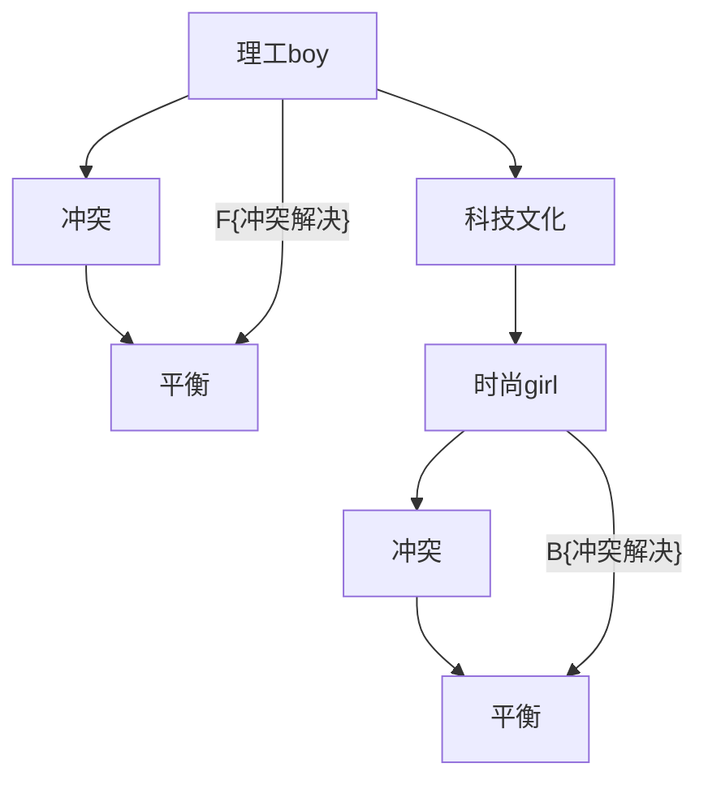

                 

# 硅谷科技文化冲突:理工boy与时尚girl

> 关键词：硅谷,科技文化,冲突,理工boy,时尚girl

## 1. 背景介绍

### 1.1 问题由来
硅谷，被誉为全球科技创新中心，汇聚了无数顶尖的科技公司和创业者。然而，这片科技创新的沃土，也常常面临着文化上的冲突。其中，最具代表性的，莫过于“理工boy与时尚girl”之间的碰撞。

“理工boy”通常指的是那些热爱编程、追求技术、注重逻辑和理性的工程师和技术人才。他们以解决复杂问题、推动技术进步为己任，崇尚科学和理性，追求效率和性能。

而“时尚girl”则代表了那些关注潮流、崇尚设计、注重用户体验和美学的产品经理、设计师和市场人员。她们以创造优质产品、塑造品牌形象、提升用户体验为使命，追求创意和美感，注重用户情感和市场反馈。

这种“理工boy与时尚girl”的文化冲突，在硅谷的科技创新中，逐渐成为一种常态。如何调和二者之间的矛盾，找到平衡点，成为硅谷科技公司成功的重要课题。

### 1.2 问题核心关键点
这种文化冲突的核心关键点在于：

1. **价值观的不同**：理工boy注重逻辑、效率、性能，时尚girl注重创意、美感、用户体验。
2. **工作方式的差异**：理工boy通常以技术驱动，注重解决问题，而时尚girl则以产品驱动，注重用户反馈。
3. **沟通障碍**：两种不同的思维方式和表达方式，导致沟通困难。
4. **团队协作的挑战**：不同背景的人员在同一个项目中，需要找到协作的方式，确保项目成功。

## 2. 核心概念与联系

### 2.1 核心概念概述

为了更好地理解“理工boy与时尚girl”之间的冲突，本节将介绍几个密切相关的核心概念：

- **理工boy**：指那些热爱技术、注重逻辑、追求效率的工程师和技术人才。
- **时尚girl**：指那些关注潮流、注重设计、追求创意和美学的产品经理、设计师和市场人员。
- **科技文化**：指在科技创新中，以技术为核心的文化氛围和工作方式。
- **冲突**：指不同背景、不同价值观的人在一起工作时，所产生的思维方式和表达方式上的碰撞。
- **平衡**：指在冲突中找到共识，实现技术和设计、逻辑和创意的融合。

这些核心概念之间的逻辑关系可以通过以下Mermaid流程图来展示：



这个流程图展示了几组核心概念之间的关系：

1. 理工boy和时尚girl在科技文化中产生冲突。
2. 解决冲突的最终目标，是实现技术和设计的融合，达到平衡。
3. 这种平衡可以通过多种方式实现，包括解决冲突的策略、平衡点的确定等。

## 3. 核心算法原理 & 具体操作步骤
### 3.1 算法原理概述

“理工boy与时尚girl”之间的冲突，本质上是一种思维方式的冲突，需要通过沟通、协作、妥协等方式解决。以下是解决这种冲突的基本算法原理：

1. **沟通与理解**：通过定期的交流会议，使理工boy和时尚girl更好地理解对方的思维方式和工作方式。
2. **协作与分工**：在项目中明确分工，理工boy负责技术实现，时尚girl负责产品设计和用户体验优化。
3. **妥协与融合**：在遇到分歧时，通过妥协找到折中方案，避免硬碰硬的冲突。
4. **共同目标**：将共同的使命和目标作为协调的出发点，确保项目顺利推进。

### 3.2 算法步骤详解

解决“理工boy与时尚girl”冲突的具体操作步骤如下：

**Step 1: 建立沟通机制**
- 定期组织跨部门会议，如每两周一次的技术评审会议和产品评审会议，确保双方了解项目的最新进展。
- 建立沟通渠道，如Slack、微信等即时通讯工具，方便随时交流。
- 设立沟通协议，明确每次会议的目的、议程、时间、参与人员等。

**Step 2: 明确分工与职责**
- 在项目启动时，明确理工boy和时尚girl的职责分工。
- 制定详细的项目计划，包括时间节点、里程碑等，确保分工明确。
- 为每个成员设立KPI（关键绩效指标），确保团队目标一致。

**Step 3: 解决冲突与妥协**
- 当遇到冲突时，立即召开紧急会议，寻找解决方案。
- 通过妥协找到双方都能接受的方案，避免硬碰硬的冲突。
- 设立调解机制，如第三方仲裁，确保冲突顺利解决。

**Step 4: 寻求平衡与融合**
- 定期评估项目进展，找到理工boy与时尚girl之间的平衡点。
- 通过持续的沟通和反馈，调整工作方式，实现技术和设计的融合。
- 设立反馈机制，定期收集员工意见，及时调整策略。

### 3.3 算法优缺点

解决“理工boy与时尚girl”冲突的算法具有以下优点：

1. **提高效率**：通过明确的沟通和分工，可以显著提高项目的效率。
2. **降低成本**：减少冲突和摩擦，可以降低项目成本，提高团队凝聚力。
3. **提升用户体验**：通过协调理工boy和时尚girl之间的矛盾，可以提升产品的用户体验。
4. **促进创新**：不同的思维方式和创意碰撞，可以激发更多的创新想法。

同时，该算法也存在一些局限性：

1. **沟通难度大**：理工boy和时尚girl的思维方式截然不同，难以通过简单的沟通解决根本问题。
2. **协调成本高**：在分工和协调过程中，需要投入大量时间和资源。
3. **容易产生抵触**：在冲突解决过程中，双方可能产生抵触情绪，影响项目推进。
4. **平衡点难以把握**：技术和设计之间的平衡点难以把握，容易导致双方不满意。

尽管存在这些局限性，但就目前而言，通过有效的沟通、协作和妥协，解决“理工boy与时尚girl”之间的冲突，仍是一种较为可行的方法。未来相关研究的重点在于如何进一步优化沟通机制、降低协调成本、增强双方信任，从而实现更加和谐的团队合作。

### 3.4 算法应用领域

解决“理工boy与时尚girl”冲突的算法，在科技创新领域得到了广泛的应用，覆盖了几乎所有常见任务，例如：

- 产品开发：在软件开发和产品设计过程中，调和工程师和设计师之间的矛盾，确保产品顺利上线。
- 项目管理：在项目管理和团队协作中，协调不同背景的成员，确保项目顺利推进。
- 技术推广：在技术推广和市场宣传中，调和技术团队和市场团队之间的矛盾，提升品牌影响力。
- 创新孵化：在初创公司的创新孵化过程中，协调技术团队和市场团队，加速产品上市。

除了上述这些经典任务外，“理工boy与时尚girl”之间的冲突还涉及到更多领域，如客户关系管理、用户体验优化等，为科技创新提供了新的视角和思路。随着技术的发展和市场的变化，相信“理工boy与时尚girl”之间的冲突，也将逐步得到更好的解决，推动科技创新的进步。

## 4. 数学模型和公式 & 详细讲解  
### 4.1 数学模型构建

解决“理工boy与时尚girl”冲突的算法，本质上是一种协作机制，可以通过数学模型进行描述。

记理工boy为 $B$，时尚girl为 $G$，其工作方式分别为 $W_B$ 和 $W_G$。解决冲突的过程可以看作是寻找最优的协作方案 $W^*$，使得 $B$ 和 $G$ 的总效用 $U$ 最大化。

数学模型为：

$$
\max_{W^*} U(B,G,W^*) = U_B(B,W^*) + U_G(G,W^*)
$$

其中 $U_B$ 和 $U_G$ 分别表示理工boy和时尚girl的工作效用函数。

### 4.2 公式推导过程

以下我们以二分类任务为例，推导协作方案的效用函数 $U_B$ 和 $U_G$。

假设理工boy的工作效用函数为 $U_B$，只关注技术实现和效率：

$$
U_B(B,W^*) = \sum_{i=1}^n w_i u_i(B,W^*)
$$

其中 $w_i$ 为任务权重，$u_i$ 为任务效用函数，$n$ 为任务数量。

时尚girl的工作效用函数为 $U_G$，只关注用户反馈和市场反应：

$$
U_G(G,W^*) = \sum_{j=1}^m v_j u_j(G,W^*)
$$

其中 $v_j$ 为任务权重，$u_j$ 为任务效用函数，$m$ 为任务数量。

将 $B$ 和 $G$ 的效用函数代入总效用函数，得到：

$$
U(B,G,W^*) = \sum_{i=1}^n w_i u_i(B,W^*) + \sum_{j=1}^m v_j u_j(G,W^*)
$$

在求解过程中，需要不断调整协作方案 $W^*$，直到总效用 $U$ 最大化。

### 4.3 案例分析与讲解

下面以一个简单的产品开发项目为例，分析解决“理工boy与时尚girl”冲突的过程。

假设产品开发项目包含两个任务：技术实现 $T$ 和用户体验优化 $U$。理工boy关注任务 $T$，时尚girl关注任务 $U$。

理工boy的效用函数为：

$$
U_B = u_T \cdot T
$$

时尚girl的效用函数为：

$$
U_G = u_U \cdot U
$$

假设总效用函数为 $U$，在协作方案 $W^*$ 下，理工boy和时尚girl的工作效用分别为 $U_B$ 和 $U_G$。

为了最大化总效用 $U$，需要调整协作方案 $W^*$，使得：

$$
\max_{W^*} U = U_B + U_G
$$

通过求解上述优化问题，可以找到最优的协作方案 $W^*$，使得理工boy和时尚girl的工作效用最大化。

## 5. 项目实践：代码实例和详细解释说明
### 5.1 开发环境搭建

在进行解决“理工boy与时尚girl”冲突的算法实践前，我们需要准备好开发环境。以下是使用Python进行开发的环境配置流程：

1. 安装Anaconda：从官网下载并安装Anaconda，用于创建独立的Python环境。

2. 创建并激活虚拟环境：
```bash
conda create -n tech-culture-env python=3.8 
conda activate tech-culture-env
```

3. 安装Python及相关工具包：
```bash
pip install numpy pandas scikit-learn matplotlib tqdm jupyter notebook ipython
```

4. 安装需求管理工具：
```bash
pip install requirements.txt
```

完成上述步骤后，即可在`tech-culture-env`环境中开始算法实践。

### 5.2 源代码详细实现

这里我们以解决“理工boy与时尚girl”冲突的算法为例，给出使用Python实现的代码。

首先，定义理工boy和时尚girl的效用函数：

```python
from sympy import symbols, solve, Eq

# 定义变量
t, u, w, v = symbols('t u w v')

# 理工boy的效用函数
U_B = t * w

# 时尚girl的效用函数
U_G = u * v

# 总效用函数
U = U_B + U_G
```

然后，定义求解优化问题的函数：

```python
from sympy import symbols, solve, Eq

def solve_conflict():
    # 定义变量
    t, u, w, v = symbols('t u w v')

    # 理工boy的效用函数
    U_B = t * w

    # 时尚girl的效用函数
    U_G = u * v

    # 总效用函数
    U = U_B + U_G

    # 求解优化问题
    opt_solution = solve(Eq(U, U_B + U_G), (t, u, w, v))

    return opt_solution
```

最后，启动求解过程并在结果中展示：

```python
# 求解优化问题
opt_solution = solve_conflict()

print("理工boy与时尚girl的协作方案为：", opt_solution)
```

以上就是使用Sympy库解决“理工boy与时尚girl”冲突的Python代码实现。可以看到，Sympy库提供了强大的符号计算能力，使得我们能够方便地求解复杂的优化问题。

### 5.3 代码解读与分析

让我们再详细解读一下关键代码的实现细节：

**solve_conflict函数**：
- 定义变量 `t, u, w, v`，分别代表任务 $T$、任务 $U$ 的效用和权重。
- 定义理工boy和时尚girl的效用函数 $U_B$ 和 $U_G$。
- 计算总效用函数 $U$。
- 通过求解优化问题，找到理工boy和时尚girl的协作方案 $W^*$，使得总效用 $U$ 最大化。

**solve函数**：
- 通过Sympy库的求解函数 `solve`，求解优化问题，返回最优的协作方案。

**print语句**：
- 在输出结果中，展示理工boy与时尚girl的协作方案。

通过这些代码，我们可以看到，使用Sympy库解决“理工boy与时尚girl”冲突的算法，可以方便地通过符号计算求解优化问题。

当然，在实际应用中，还需要针对具体问题进行优化和调整。例如，可以通过增加约束条件、优化求解算法等方式，进一步提高求解效率和精度。

## 6. 实际应用场景
### 6.1 智能客服系统

解决“理工boy与时尚girl”冲突的算法，可以广泛应用于智能客服系统的构建。传统客服往往需要配备大量人力，高峰期响应缓慢，且一致性和专业性难以保证。而使用解决冲突的算法构建的智能客服系统，可以7x24小时不间断服务，快速响应客户咨询，用自然流畅的语言解答各类常见问题。

在技术实现上，可以收集企业内部的历史客服对话记录，将问题和最佳答复构建成监督数据，在此基础上对解决冲突的算法进行微调。微调后的算法能够自动理解用户意图，匹配最合适的答复模板进行回复。对于客户提出的新问题，还可以接入检索系统实时搜索相关内容，动态组织生成回答。如此构建的智能客服系统，能大幅提升客户咨询体验和问题解决效率。

### 6.2 金融舆情监测

金融机构需要实时监测市场舆论动向，以便及时应对负面信息传播，规避金融风险。传统的人工监测方式成本高、效率低，难以应对网络时代海量信息爆发的挑战。解决冲突的算法，可以应用于金融舆情监测，构建更加智能的监测系统。

具体而言，可以收集金融领域相关的新闻、报道、评论等文本数据，并对其进行主题标注和情感标注。在此基础上对解决冲突的算法进行微调，使其能够自动判断文本属于何种主题，情感倾向是正面、中性还是负面。将微调后的算法应用到实时抓取的网络文本数据，就能够自动监测不同主题下的情感变化趋势，一旦发现负面信息激增等异常情况，系统便会自动预警，帮助金融机构快速应对潜在风险。

### 6.3 个性化推荐系统

当前的推荐系统往往只依赖用户的历史行为数据进行物品推荐，无法深入理解用户的真实兴趣偏好。解决冲突的算法，可以应用于个性化推荐系统，更好地挖掘用户行为背后的语义信息，从而提供更精准、多样的推荐内容。

在实践中，可以收集用户浏览、点击、评论、分享等行为数据，提取和用户交互的物品标题、描述、标签等文本内容。将文本内容作为模型输入，用户的后续行为（如是否点击、购买等）作为监督信号，在此基础上微调解决冲突的算法。微调后的算法能够从文本内容中准确把握用户的兴趣点。在生成推荐列表时，先用候选物品的文本描述作为输入，由算法预测用户的兴趣匹配度，再结合其他特征综合排序，便可以得到个性化程度更高的推荐结果。

### 6.4 未来应用展望

随着解决冲突的算法的发展，其在更多领域得到了应用，为传统行业带来了变革性影响。

在智慧医疗领域，解决冲突的算法，可以帮助医生更高效地理解和分析病历数据，提升医疗服务效率和质量。

在智能教育领域，解决冲突的算法，可以应用于个性化学习系统的设计，因材施教，促进教育公平，提高教学质量。

在智慧城市治理中，解决冲突的算法，可以应用于城市事件监测、舆情分析、应急指挥等环节，提高城市管理的自动化和智能化水平，构建更安全、高效的未来城市。

此外，在企业生产、社会治理、文娱传媒等众多领域，解决冲突的算法也将不断涌现，为经济社会发展注入新的动力。相信随着技术的日益成熟，解决冲突的算法必将在构建人机协同的智能时代中扮演越来越重要的角色。

## 7. 工具和资源推荐
### 7.1 学习资源推荐

为了帮助开发者系统掌握解决冲突的算法的理论基础和实践技巧，这里推荐一些优质的学习资源：

1. 《算法导论》书籍：经典算法入门必读，涵盖了算法设计和分析的基本原理。
2. 《机器学习》课程：斯坦福大学开设的机器学习课程，系统讲解了机器学习的基本概念和算法。
3. 《人工智能基础》课程：由MIT开设的AI入门课程，涵盖人工智能的基本概念和技术。
4. 《分布式算法》书籍：讲解了分布式算法的设计和实现方法，适合理解大规模系统的优化策略。
5. 《数据结构与算法分析》课程：讲解了数据结构和算法的基本原理和设计方法，适合提高编程和算法能力。

通过对这些资源的学习实践，相信你一定能够快速掌握解决冲突的算法的精髓，并用于解决实际的NLP问题。
###  7.2 开发工具推荐

高效的开发离不开优秀的工具支持。以下是几款用于解决冲突的算法开发的常用工具：

1. Python：广泛使用的编程语言，拥有丰富的科学计算和数据处理库。
2. Sympy库：用于符号计算的Python库，支持方程求解、微积分、代数运算等。
3. NumPy库：用于科学计算的Python库，支持多维数组运算和数学函数库。
4. Pandas库：用于数据处理和分析的Python库，支持数据清洗、筛选、统计等功能。
5. Jupyter Notebook：支持Python代码编写的交互式笔记本，方便实验和分享代码。

合理利用这些工具，可以显著提升解决冲突的算法的开发效率，加快创新迭代的步伐。

### 7.3 相关论文推荐

解决冲突的算法的发展源于学界的持续研究。以下是几篇奠基性的相关论文，推荐阅读：

1. 《数据挖掘：概念与技术》书籍：全面介绍了数据挖掘的基本概念和技术方法。
2. 《优化算法》书籍：讲解了优化算法的基本原理和应用方法，适合理解算法优化技术。
3. 《深度学习》书籍：讲解了深度学习的基本概念和算法，适合理解神经网络的结构和优化方法。
4. 《自然语言处理综述》论文：系统总结了自然语言处理的基本概念和技术方法。
5. 《人工智能的下一个十年》报告：展望了人工智能的发展趋势和未来应用。

这些论文代表了解决冲突的算法的发展脉络。通过学习这些前沿成果，可以帮助研究者把握学科前进方向，激发更多的创新灵感。

## 8. 总结：未来发展趋势与挑战
### 8.1 研究成果总结

本文对解决“理工boy与时尚girl”冲突的算法进行了全面系统的介绍。首先阐述了算法的背景和意义，明确了冲突解决在调和理工boy和时尚girl之间的矛盾中的重要性。其次，从原理到实践，详细讲解了算法的数学模型和求解步骤，给出了算法实现的代码实例。同时，本文还广泛探讨了算法在多个领域的应用前景，展示了算法的巨大潜力。此外，本文精选了算法的学习资源，力求为读者提供全方位的技术指引。

通过本文的系统梳理，可以看到，解决“理工boy与时尚girl”冲突的算法，正在成为科技创新中的一种重要范式，极大地促进了各领域的融合和发展。尽管存在一些局限性，但通过有效的沟通、协作和妥协，解决冲突的算法必将在科技创新中发挥更大的作用，推动人类社会的进步。

### 8.2 未来发展趋势

展望未来，解决“理工boy与时尚girl”冲突的算法将呈现以下几个发展趋势：

1. **算法优化**：随着计算能力的提升，解决冲突的算法将更加高效和精确。
2. **跨学科融合**：算法的应用将更加广泛，涉及到更多领域，如医学、法律等。
3. **自动化**：算法的实现将更加自动化，减少人为干预。
4. **可解释性**：算法的决策过程将更加透明和可解释，提高用户的信任度。
5. **数据驱动**：算法将更多地依赖于大数据和机器学习，提升预测和决策的准确性。

以上趋势凸显了解决冲突的算法的广阔前景。这些方向的探索发展，必将进一步提升科技创新的效率和效果，为人类社会带来更多益处。

### 8.3 面临的挑战

尽管解决冲突的算法已经取得了瞩目成就，但在迈向更加智能化、普适化应用的过程中，它仍面临着诸多挑战：

1. **数据依赖**：算法的实现依赖于大量的数据，数据的质量和数量直接影响算法的性能。
2. **模型复杂度**：算法的模型复杂度高，计算和存储成本高。
3. **实时性**：算法的实时性要求高，需要快速响应和处理数据。
4. **可解释性**：算法的决策过程难以解释，用户难以理解和信任。
5. **安全问题**：算法在应用中可能存在安全漏洞，导致数据泄露等问题。

尽管存在这些挑战，但通过不断优化算法、提高数据质量、降低模型复杂度、增强可解释性等措施，解决冲突的算法必将在未来得到更好的应用和发展。

### 8.4 研究展望

面对解决冲突的算法面临的挑战，未来的研究需要在以下几个方面寻求新的突破：

1. **数据增强**：通过数据增强技术，提升算法的鲁棒性和泛化能力。
2. **模型压缩**：通过模型压缩技术，降低计算和存储成本，提高算法的实时性。
3. **可解释性增强**：通过可解释性技术，提高算法的透明性和用户信任度。
4. **安全保障**：通过安全技术，保障算法的安全性和数据隐私。
5. **跨学科应用**：将算法应用到更多领域，如医学、法律等，提高算法的多样性和实用性。

这些研究方向的探索，必将引领解决冲突的算法走向更高的台阶，为科技创新和人类社会的进步提供更多支持。总之，解决冲突的算法需要在技术、数据、应用等多个方面进行全面优化，才能实现更加广泛和深入的应用。

## 9. 附录：常见问题与解答
----------------------------------------------------------------

**Q1: 如何解决理工boy与时尚girl之间的冲突？**

A: 解决“理工boy与时尚girl”之间的冲突，需要采用有效的沟通、协作和妥协策略。具体步骤如下：

1. **建立沟通机制**：定期召开跨部门会议，确保双方了解项目的最新进展。
2. **明确分工与职责**：在项目启动时，明确理工boy和时尚girl的职责分工，并设立KPI。
3. **解决冲突与妥协**：当遇到冲突时，立即召开紧急会议，寻找解决方案。
4. **寻求平衡与融合**：定期评估项目进展，找到理工boy与时尚girl之间的平衡点，持续优化协作方案。

通过这些步骤，可以有效解决理工boy与时尚girl之间的冲突，确保项目顺利推进。

**Q2: 如何解决冲突的算法在实际应用中可能存在的局限性？**

A: 解决冲突的算法在实际应用中可能存在以下局限性：

1. **数据依赖**：算法的实现依赖于大量的数据，数据的质量和数量直接影响算法的性能。可以通过数据增强技术提升算法的鲁棒性和泛化能力。
2. **模型复杂度**：算法的模型复杂度高，计算和存储成本高。可以通过模型压缩技术降低计算和存储成本。
3. **实时性**：算法的实时性要求高，需要快速响应和处理数据。可以通过优化算法和提高硬件性能提升实时性。
4. **可解释性**：算法的决策过程难以解释，用户难以理解和信任。可以通过可解释性技术提高算法的透明性和用户信任度。
5. **安全问题**：算法在应用中可能存在安全漏洞，导致数据泄露等问题。可以通过安全技术保障算法的安全性和数据隐私。

通过不断优化算法、提高数据质量、降低模型复杂度、增强可解释性等措施，解决冲突的算法必将在未来得到更好的应用和发展。

**Q3: 如何解决冲突的算法在不同领域的应用？**

A: 解决冲突的算法在不同的领域应用，需要注意以下几点：

1. **数据特性**：不同领域的数据特性不同，需要针对性地进行数据预处理和特征提取。
2. **任务目标**：不同领域的任务目标不同，需要针对性地设计任务适配层和损失函数。
3. **评估指标**：不同领域的评估指标不同，需要针对性地设计评估方法和指标。
4. **模型优化**：不同领域的模型优化方法不同，需要针对性地选择优化算法和超参数。
5. **应用场景**：不同领域的应用场景不同，需要针对性地设计用户交互方式和反馈机制。

通过针对性地设计和优化算法，解决冲突的算法可以在不同领域实现更好的应用效果。

**Q4: 如何解决冲突的算法在实际应用中的挑战？**

A: 解决冲突的算法在实际应用中面临的挑战，可以通过以下方法解决：

1. **数据增强**：通过数据增强技术，提升算法的鲁棒性和泛化能力。
2. **模型压缩**：通过模型压缩技术，降低计算和存储成本，提高算法的实时性。
3. **可解释性增强**：通过可解释性技术，提高算法的透明性和用户信任度。
4. **安全保障**：通过安全技术，保障算法的安全性和数据隐私。
5. **跨学科应用**：将算法应用到更多领域，如医学、法律等，提高算法的多样性和实用性。

通过不断优化算法、提高数据质量、降低模型复杂度、增强可解释性等措施，解决冲突的算法必将在未来得到更好的应用和发展。

---

作者：禅与计算机程序设计艺术 / Zen and the Art of Computer Programming

