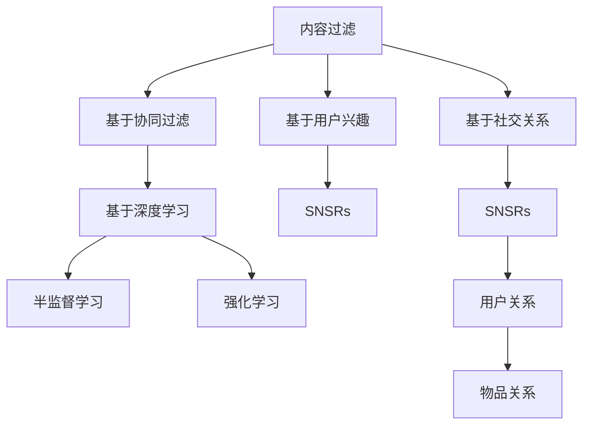

                 

# 社交网络推荐系统的进化：连接用户兴趣与社交关系

## 1. 背景介绍

社交网络推荐系统（Social Network Recommendation Systems, SNSRs）作为社交网络应用的重要组成部分，已经在信息传播、用户个性化推荐、广告精准投放等方面产生了深远的影响。从早期的基于内容过滤（Content-Based Filtering）到基于协同过滤（Collaborative Filtering），再到目前的深度学习驱动的推荐系统，推荐技术的演进体现了从用户行为到用户关系的不断深化。社交网络的特殊性在于，用户间除了文本交流外，还有着复杂的社交关系（如朋友、同事、家人等），这为推荐系统的设计带来了更多挑战和机会。本文将从历史演变、核心概念、算法原理、实际应用等多个角度，系统回顾社交网络推荐系统的进化历程，并探讨其未来的发展趋势。

## 2. 核心概念与联系

### 2.1 核心概念概述

在介绍推荐系统原理之前，我们先概述几个关键概念：

- 社交网络推荐系统（Social Network Recommendation Systems, SNSRs）：基于用户社交关系，为用户提供个性化推荐的系统。通过分析用户及其社交网络的特性，构建推荐模型，从而提升推荐的精准性和多样性。
- 基于内容的推荐（Content-Based Recommendation）：根据用户的历史行为，推荐与其兴趣相关的物品。主要基于用户对物品的评分或点击记录。
- 基于协同过滤的推荐（Collaborative Filtering, CF）：基于用户间或物品间的相似性，推荐其他用户或物品的推荐列表。主要依赖用户和物品间的隐式行为（评分、点击等）。
- 深度学习推荐（Deep Learning-Based Recommendation）：通过深度神经网络模型，对用户行为和物品特征进行联合建模，构建复杂的关系网络，提升推荐的准确性和个性化。
- 半监督学习（Semi-Supervised Learning）：在标注数据较少的情况下，利用大规模未标注数据，通过深度模型进行推荐。
- 强化学习（Reinforcement Learning）：通过模拟用户行为，不断调整推荐策略，最大化用户满意度。

这些概念通过以下Mermaid流程图进行连结：



### 2.2 核心概念原理和架构

社交网络推荐系统通过分析用户及其社交网络的行为特征，构建用户画像和物品画像，并基于这些画像进行个性化推荐。核心架构包括数据采集、特征提取、模型训练、推荐输出等环节。

1. **数据采集**：收集用户行为数据（如点击、评分、评论等）、物品属性数据（如类别、价格、描述等），以及用户社交网络数据（如好友、关注、社区等）。
2. **特征提取**：对用户和物品数据进行特征提取，构建用户画像和物品画像。如将文本数据转换为词向量，将图像数据转换为特征向量等。
3. **模型训练**：基于收集到的数据，训练推荐模型。如利用协同过滤模型进行用户-物品相似度计算，利用深度神经网络进行用户行为和物品特征的联合建模等。
4. **推荐输出**：根据用户画像和物品画像，以及用户的历史行为和社交关系，生成个性化推荐列表。

## 3. 核心算法原理 & 具体操作步骤

### 3.1 算法原理概述

社交网络推荐系统主要依赖于用户行为和社交关系的建模。常见的推荐算法包括：

- 基于内容的推荐（Content-Based Recommendation）：基于用户的历史行为数据，推荐相似的物品。
- 基于协同过滤的推荐（Collaborative Filtering）：通过分析用户和物品的相似性，推荐用户未交互过的物品。
- 基于深度学习的推荐（Deep Learning-Based Recommendation）：通过深度神经网络，对用户行为和物品特征进行联合建模，构建复杂的关系网络。
- 基于半监督学习的推荐（Semi-Supervised Learning-Based Recommendation）：利用未标注数据提升推荐模型的泛化能力。
- 基于强化学习的推荐（Reinforcement Learning-Based Recommendation）：通过模拟用户行为，不断调整推荐策略，最大化用户满意度。

### 3.2 算法步骤详解

以下以基于深度学习的推荐系统为例，详细介绍其具体操作步骤：

1. **数据预处理**：对用户行为数据、物品属性数据、社交网络数据进行清洗、归一化等预处理，构建特征向量。
2. **模型构建**：选择合适的深度神经网络模型，如自编码器、神经网络、注意力机制等，构建推荐模型。
3. **参数初始化**：对模型参数进行随机初始化，设置合适的超参数。
4. **模型训练**：利用用户行为和物品属性数据，训练推荐模型，通过损失函数（如均方误差、交叉熵等）调整模型参数。
5. **模型评估**：在验证集上评估模型性能，如使用准确率、召回率、F1值等指标。
6. **模型部署**：将训练好的模型部署到实际推荐系统中，进行在线推荐。

### 3.3 算法优缺点

基于深度学习的推荐系统具有以下优点：

- 准确度高：深度学习模型能够捕捉用户行为和物品特征之间的复杂关系，提高推荐的准确性。
- 个性化强：深度模型可以根据用户特征和物品特征进行联合建模，生成更加个性化的推荐。
- 模型可解释：深度学习模型通过可解释的架构设计，如注意力机制，可以一定程度上解释推荐逻辑。

但同时也存在以下缺点：

- 计算量大：深度模型需要大量的计算资源进行训练和推理。
- 数据依赖强：深度模型对数据质量要求高，标注数据不足时可能难以有效训练。
- 过拟合风险：深度模型在训练过程中容易出现过拟合现象，需要适当的正则化技术。
- 模型复杂度高：深度模型结构复杂，难以解释和调试。

### 3.4 算法应用领域

社交网络推荐系统在多个领域具有广泛的应用，包括但不限于：

- 电子商务：推荐用户可能感兴趣的商品，提升购买转化率。
- 社交媒体：推荐用户可能感兴趣的内容，提高用户粘性。
- 新闻媒体：推荐用户可能感兴趣的新闻，增加阅读量。
- 视频平台：推荐用户可能感兴趣的视频，提升观看时长。
- 广告投放：推荐用户可能感兴趣的广告，提高广告效果。
- 在线教育：推荐用户可能感兴趣的课程，提高学习效果。

## 4. 数学模型和公式 & 详细讲解 & 举例说明

### 4.1 数学模型构建

社交网络推荐系统通常基于用户行为和社交关系建模。以下以基于协同过滤的推荐系统为例，介绍其数学模型构建。

设用户集为 $U$，物品集为 $I$，用户行为矩阵为 $\mathbf{R} \in \mathbb{R}^{n \times m}$，其中 $n$ 为用户数，$m$ 为物品数。设用户 $u$ 对物品 $i$ 的评分向量为 $\mathbf{r}_u \in \mathbb{R}^m$，物品 $i$ 的特征向量为 $\mathbf{i} \in \mathbb{R}^k$，其中 $k$ 为特征维度。

协同过滤推荐的目标是最小化预测评分与实际评分之间的差异，即：

$$
\min_{\mathbf{I},\mathbf{r}_u} \sum_{u=1}^{n} \sum_{i=1}^{m} (\mathbf{r}_u^T\mathbf{I}\mathbf{i} - r_{ui})^2
$$

其中 $\mathbf{I} \in \mathbb{R}^{k \times m}$ 为物品特征的转换矩阵。

### 4.2 公式推导过程

协同过滤推荐的优化目标是找到最优的特征转换矩阵 $\mathbf{I}$ 和用户评分向量 $\mathbf{r}_u$，使得预测评分与实际评分最接近。

令 $\mathbf{R}_{\text{pred}} = \mathbf{R} * \mathbf{I}$ 为预测评分矩阵，其中 $*$ 表示矩阵乘法。优化目标转化为：

$$
\min_{\mathbf{I},\mathbf{r}_u} \|\mathbf{R} - \mathbf{R}_{\text{pred}}\|_F^2
$$

其中 $\|\cdot\|_F$ 为矩阵的 Frobenius 范数。

根据矩阵分解的思想，可以将 $\mathbf{R}_{\text{pred}}$ 表示为 $\mathbf{R}_{\text{pred}} = \mathbf{P} * \mathbf{Q}$，其中 $\mathbf{P} \in \mathbb{R}^{n \times k}$ 为用户嵌入矩阵，$\mathbf{Q} \in \mathbb{R}^{k \times m}$ 为物品嵌入矩阵。优化目标进一步转化为：

$$
\min_{\mathbf{P},\mathbf{Q}} \|\mathbf{R} - \mathbf{P} * \mathbf{Q}\|_F^2
$$

此优化问题通常采用奇异值分解（SVD）或矩阵分解技术（如基于矩阵分解的CF算法）求解，具体公式如下：

$$
\mathbf{P} = \mathbf{U} * \mathbf{\Lambda} * \mathbf{V}^T, \quad \mathbf{Q} = \mathbf{U}_1 * \mathbf{\Lambda}_1 * \mathbf{V}_1^T
$$

其中 $\mathbf{U} \in \mathbb{R}^{n \times k}, \mathbf{V} \in \mathbb{R}^{k \times m}, \mathbf{U}_1 \in \mathbb{R}^{k \times k}, \mathbf{V}_1 \in \mathbb{R}^{m \times k}$ 分别为不同特征值的矩阵。

### 4.3 案例分析与讲解

假设我们有一个社交网络推荐系统，用于推荐用户可能感兴趣的文章。该系统包含 10000 个用户和 10000 篇文章。我们收集到每个用户对文章的评分数据（1-5 分），并记录了用户之间的关注关系。

基于协同过滤的推荐系统将首先对用户评分数据进行归一化处理，构建用户-文章评分矩阵 $\mathbf{R} \in \mathbb{R}^{10000 \times 10000}$。然后，采用奇异值分解的方法，对用户和文章进行低秩矩阵分解，得到用户嵌入矩阵 $\mathbf{P}$ 和文章嵌入矩阵 $\mathbf{Q}$。最后，计算用户嵌入矩阵与文章嵌入矩阵的点乘，得到用户对文章的预测评分矩阵 $\mathbf{R}_{\text{pred}}$。

该系统可以通过用户-文章评分矩阵 $\mathbf{R}$ 和预测评分矩阵 $\mathbf{R}_{\text{pred}}$ 的差异度量来评估推荐效果。例如，可以计算平均绝对误差（MAE）和均方误差（MSE）等指标。

## 5. 项目实践：代码实例和详细解释说明

### 5.1 开发环境搭建

为了搭建社交网络推荐系统的开发环境，我们首先需要准备以下软件和硬件资源：

1. **软件环境**：
   - 安装 Python 3.x
   - 安装 PyTorch、TensorFlow、scikit-learn 等常用机器学习库
   - 安装 Elasticsearch、Flume 等大数据处理工具

2. **硬件环境**：
   - 配置高性能 GPU 或 TPU，用于模型训练和推理
   - 安装 Docker 或 Kubernetes 等容器化平台，方便模型部署和管理

### 5.2 源代码详细实现

以下是一个基于协同过滤推荐系统的 Python 代码实现，包括数据预处理、模型训练、推荐输出等关键步骤：

```python
import numpy as np
import pandas as pd
import torch
import torch.nn as nn
import torch.nn.functional as F
from torch.utils.data import DataLoader
from sklearn.model_selection import train_test_split
from sklearn.metrics import mean_squared_error

# 数据预处理
def load_data():
    # 加载用户-文章评分矩阵
    R = pd.read_csv('user_article_matrix.csv')
    # 加载用户之间的关注关系
    follow = pd.read_csv('user_follow_relationship.csv')
    # 对用户-文章评分矩阵进行归一化处理
    R = (R - R.mean()) / R.std()
    # 将关注关系转换为用户嵌入矩阵
    P = pd.get_dummies(follow['follower_id'], prefix='follower', drop_first=True)
    # 对用户嵌入矩阵进行归一化处理
    P = (P - P.mean()) / P.std()
    # 加载文章特征向量
    Q = pd.read_csv('article_features.csv')
    return R, P, Q

# 构建协同过滤推荐模型
class协同过滤推荐模型(nn.Module):
    def __init__(self, n_users, n_items, k):
        super(协同过滤推荐模型, self).__init__()
        self.n_users = n_users
        self.n_items = n_items
        self.k = k
        # 定义用户嵌入矩阵
        self.P = nn.Embedding(n_users, k)
        # 定义物品嵌入矩阵
        self.Q = nn.Embedding(n_items, k)
        # 定义预测评分矩阵
        self.U = nn.Embedding(n_users, k)
        self.V = nn.Embedding(n_items, k)
        # 定义预测评分矩阵的线性层
        self.linear = nn.Linear(k * k, 1)

    def forward(self, user_id, article_id):
        # 根据用户ID和文章ID查询用户嵌入矩阵和物品嵌入矩阵
        P = self.P(user_id)
        Q = self.Q(article_id)
        # 计算用户嵌入矩阵与物品嵌入矩阵的点乘
        U = self.U(user_id)
        V = self.V(article_id)
        P = P * Q
        # 计算预测评分矩阵
        R_pred = P * (U * V).transpose(0, 1)
        # 计算预测评分
        R_pred = self.linear(R_pred)
        # 返回预测评分
        return R_pred

# 训练协同过滤推荐模型
def train_model(R, P, Q, batch_size, epochs, learning_rate):
    # 划分训练集和验证集
    train_R, val_R, train_P, val_P, train_Q, val_Q = train_test_split(R, P, Q, test_size=0.2)
    # 将训练集和验证集转换为DataLoader
    train_loader = DataLoader(train_R, batch_size=batch_size, shuffle=True)
    val_loader = DataLoader(val_R, batch_size=batch_size, shuffle=False)
    # 初始化协同过滤推荐模型
    model = 协同过滤推荐模型(R.shape[0], R.shape[1], P.shape[1])
    # 定义优化器
    optimizer = torch.optim.Adam(model.parameters(), lr=learning_rate)
    # 定义损失函数
    criterion = nn.MSELoss()
    # 训练模型
    for epoch in range(epochs):
        for user_id, article_id in train_loader:
            # 查询用户嵌入矩阵和物品嵌入矩阵
            P = P[user_id]
            Q = Q[article_id]
            # 前向传播计算预测评分
            R_pred = model(user_id, article_id)
            # 计算损失
            loss = criterion(R_pred, train_R[user_id, article_id])
            # 反向传播更新模型参数
            optimizer.zero_grad()
            loss.backward()
            optimizer.step()
        # 在验证集上评估模型性能
        with torch.no_grad():
            for user_id, article_id in val_loader:
                R_pred = model(user_id, article_id)
                mse = criterion(R_pred, val_R[user_id, article_id]).item()
                print(f'Epoch {epoch+1}, MSE on validation set: {mse:.3f}')
```

### 5.3 代码解读与分析

上述代码实现了基于协同过滤的推荐系统，其中包含了数据预处理、模型构建、训练和评估等关键步骤。

- `load_data` 函数负责加载数据集，并进行归一化处理和特征提取。
- `协同过滤推荐模型` 类定义了推荐模型的结构，包含用户嵌入矩阵、物品嵌入矩阵、预测评分矩阵等组件。
- `train_model` 函数负责训练模型，使用随机梯度下降算法优化模型参数，并在验证集上评估模型性能。

## 6. 实际应用场景

### 6.1 社交网络推荐系统在电子商务中的应用

社交网络推荐系统在电子商务中的应用非常广泛。通过分析用户及其社交网络的行为数据，推荐系统可以向用户推荐可能感兴趣的商品，提升购物体验和购买转化率。例如，某电商平台通过分析用户浏览、点击、购买等行为数据，结合用户之间的关注关系，为用户推荐可能感兴趣的商品，使用户在购物过程中得到个性化推荐，提升用户满意度和复购率。

### 6.2 社交网络推荐系统在社交媒体中的应用

社交媒体平台上的内容推荐也是社交网络推荐系统的重要应用场景之一。通过分析用户的社交网络关系，推荐系统可以为用户推荐可能感兴趣的内容，提高用户粘性和活跃度。例如，某社交媒体平台通过分析用户的点赞、评论、分享等行为数据，结合用户之间的关注关系，为用户推荐可能感兴趣的文章、视频、照片等内容，使用户在平台上得到个性化的内容推荐，提升用户使用体验。

### 6.3 社交网络推荐系统在视频平台中的应用

视频平台上的内容推荐也是社交网络推荐系统的重要应用场景之一。通过分析用户的观看历史和社交网络关系，推荐系统可以为用户推荐可能感兴趣的视频内容，提升观看时长和用户粘性。例如，某视频平台通过分析用户的观看历史和点赞、评论、分享等行为数据，结合用户之间的关注关系，为用户推荐可能感兴趣的视频内容，使用户在平台上得到个性化的视频推荐，提升用户使用体验。

## 7. 工具和资源推荐

### 7.1 学习资源推荐

为了帮助开发者系统掌握社交网络推荐系统的原理和实践，这里推荐一些优质的学习资源：

1. 《推荐系统实战》：该书详细介绍了推荐系统的原理和实现，包括协同过滤、深度学习等推荐算法。
2. 《深度学习入门》：该书介绍了深度学习的基本概念和实践，包括神经网络、卷积神经网络、循环神经网络等。
3. 《社交网络分析》：该书介绍了社交网络分析的基本概念和实现方法，包括社交网络结构、社区发现等。
4. 《NLP入门教程》：该书介绍了自然语言处理的基本概念和实践，包括词向量、卷积神经网络、循环神经网络等。
5. 《强化学习》：该书介绍了强化学习的基本概念和实践，包括Q-learning、深度强化学习等。

通过对这些资源的学习实践，相信你一定能够快速掌握社交网络推荐系统的原理和实践。

### 7.2 开发工具推荐

高效的开发离不开优秀的工具支持。以下是几款用于社交网络推荐系统开发的常用工具：

1. PyTorch：基于Python的开源深度学习框架，灵活动态的计算图，适合快速迭代研究。
2. TensorFlow：由Google主导开发的开源深度学习框架，生产部署方便，适合大规模工程应用。
3. Elasticsearch：分布式全文搜索引擎，适合存储和检索大规模文本数据。
4. Flume：大数据日志收集系统，适合采集和存储大规模日志数据。
5. Scikit-learn：Python科学计算库，提供多种机器学习算法和工具。
6. Keras：基于TensorFlow的高级神经网络API，简化深度学习模型的构建。

合理利用这些工具，可以显著提升社交网络推荐系统的开发效率，加快创新迭代的步伐。

### 7.3 相关论文推荐

社交网络推荐系统的研究已经取得了很多重要的进展，以下是几篇奠基性的相关论文，推荐阅读：

1. "Collaborative Filtering for Implicit Feedback Datasets"：介绍协同过滤推荐算法的基本原理和实现方法。
2. "Factorization Machines"：介绍因子分解机推荐算法的基本原理和实现方法。
3. "Deep Neural Networks for Collaborative Filtering"：介绍深度神经网络推荐算法的基本原理和实现方法。
4. "Neural Networks with Many Hidden Layers"：介绍深度神经网络推荐算法的优化方法和加速方法。
5. "Adaptive Recommendation via Sparsity"：介绍基于稀疏性推荐算法的基本原理和实现方法。

这些论文代表了大数据推荐系统的研究脉络。通过学习这些前沿成果，可以帮助研究者把握学科前进方向，激发更多的创新灵感。

## 8. 总结：未来发展趋势与挑战

### 8.1 研究成果总结

社交网络推荐系统已经取得了显著的进展，并在多个领域得到了广泛应用。其主要成果包括：

- 基于内容的推荐：通过分析用户历史行为数据，推荐相似的物品。
- 基于协同过滤的推荐：通过分析用户和物品的相似性，推荐未交互过的物品。
- 基于深度学习的推荐：通过深度神经网络，对用户行为和物品特征进行联合建模。
- 基于半监督学习的推荐：利用未标注数据提升推荐模型的泛化能力。
- 基于强化学习的推荐：通过模拟用户行为，不断调整推荐策略，最大化用户满意度。

### 8.2 未来发展趋势

展望未来，社交网络推荐系统的发展趋势包括：

1. 深度学习与协同过滤的结合：深度学习和协同过滤是推荐系统的主要分支，未来将进一步融合，构建更加复杂和精准的推荐模型。
2. 半监督学习和强化学习的应用：利用半监督学习和强化学习提升推荐模型的泛化能力和实时性。
3. 多模态数据的融合：将文本、图像、音频等多种模态数据结合，提升推荐系统的精准度和多样性。
4. 分布式计算和协同计算：在大数据环境下，推荐系统需要采用分布式计算和协同计算技术，提升计算效率和模型训练速度。
5. 用户隐私保护：推荐系统需要保护用户隐私，避免数据泄露和恶意攻击。

### 8.3 面临的挑战

尽管社交网络推荐系统已经取得了显著的进展，但在迈向更加智能化、普适化应用的过程中，它仍面临着诸多挑战：

1. 数据隐私和安全：推荐系统需要保护用户隐私，避免数据泄露和恶意攻击。
2. 计算资源限制：推荐系统需要大量的计算资源进行模型训练和推理，在大数据环境下可能面临计算资源限制。
3. 算法复杂度高：深度学习模型的结构复杂，难以解释和调试。
4. 推荐准确性和多样性：推荐系统需要平衡推荐准确性和多样性，避免过拟合和单调性。
5. 系统稳定性：推荐系统需要在高并发和分布式环境下保持稳定性，避免崩溃和数据损坏。

### 8.4 研究展望

面向未来，社交网络推荐系统需要在以下几个方面寻求新的突破：

1. 增强用户隐私保护：采用匿名化和差分隐私技术，保护用户隐私。
2. 提升计算效率：采用分布式计算和协同计算技术，提升推荐系统的计算效率。
3. 优化推荐算法：开发更加高效和可解释的推荐算法，提升推荐系统的准确性和多样性。
4. 多模态数据融合：将文本、图像、音频等多种模态数据结合，提升推荐系统的精准度和多样性。
5. 实时推荐系统：开发实时推荐系统，提升推荐系统的实时性和用户体验。

这些研究方向的探索，必将引领社交网络推荐系统迈向更高的台阶，为构建智能推荐系统提供新的技术路径。相信随着技术的不断进步，社交网络推荐系统将在更多领域得到应用，为人类生产生活方式带来深刻变革。

## 9. 附录：常见问题与解答

**Q1：推荐系统如何平衡推荐准确性和多样性？**

A: 推荐系统需要在推荐准确性和多样性之间找到平衡点。通过采用多样性优先或准确性优先的推荐策略，可以实现不同的平衡效果。例如，采用基于深度学习的推荐系统可以平衡推荐准确性和多样性，通过增加样本多样性或引入噪声等方法，提升推荐系统的多样性。

**Q2：推荐系统如何应对用户行为变化？**

A: 推荐系统需要不断调整推荐策略，以应对用户行为的变化。通过实时分析和用户行为变化，可以不断调整推荐模型，保持推荐系统的时效性。例如，采用强化学习的方法，可以实时调整推荐策略，最大化用户满意度。

**Q3：推荐系统如何应对数据分布变化？**

A: 推荐系统需要不断更新数据集，以应对数据分布的变化。通过定期更新数据集，可以保持推荐模型的泛化能力和适应性。例如，采用半监督学习和深度学习的方法，可以提升推荐模型的泛化能力和适应性。

**Q4：推荐系统如何应对恶意攻击和数据泄露？**

A: 推荐系统需要采用安全性和隐私保护技术，以应对恶意攻击和数据泄露。通过采用加密技术、匿名化技术、差分隐私技术等，可以保护用户隐私和数据安全。

**Q5：推荐系统如何优化计算效率？**

A: 推荐系统需要采用高效的计算和存储技术，以优化计算效率。通过采用分布式计算、协同计算、压缩存储等技术，可以提升推荐系统的计算效率和存储效率。

---

作者：禅与计算机程序设计艺术 / Zen and the Art of Computer Programming

