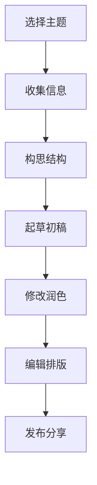

                 

**技术写作：程序员的副业选择**

## 1. 背景介绍

在当今信息爆炸的时代，技术写作已然成为程序员的必备技能之一。技术写作不仅是一种表达思想的方式，更是一种提高个人影响力和职业发展的手段。本文将深入探讨技术写作的意义、技巧，并提供实践指南，帮助程序员将技术写作作为一种有益的副业。

## 2. 核心概念与联系

技术写作是一种特殊的写作形式，它需要将复杂的技术概念转化为易于理解的语言。技术写作的核心概念包括：

- **清晰明确**：使用简单直接的语言，避免专业术语和缩写。
- **结构化**：使用清晰的结构，如标题、段落、列表，帮助读者理解文章的脉络。
- **实用性**：提供实际的解决方案或见解，而不是空洞的理论。

下面是技术写作流程的 Mermaid 流程图：



## 3. 核心算法原理 & 具体操作步骤

### 3.1 算法原理概述

技术写作的核心是将复杂的技术概念转化为简单易懂的语言。这可以看作是一个信息压缩算法，其目标是保留信息的关键部分，去除冗余和无关信息。

### 3.2 算法步骤详解

1. **理解主题**：深入理解需要写作的技术主题，确保自己是该领域的专家。
2. **收集信息**：收集与主题相关的信息，包括文献资料、实验数据等。
3. **构思结构**：设计文章的结构，确保它清晰明确，便于读者理解。
4. **起草初稿**：根据设计的结构，起草文章的初稿。此时，不必过分追求完美，只需将想法记录下来。
5. **修改润色**：修改初稿，使其更加清晰明确，并添加实用的细节和例子。
6. **编辑排版**：编辑文章，使其符合排版规范，并添加图表等视觉元素。
7. **发布分享**：将文章发布到适合的平台，并分享给相关读者。

### 3.3 算法优缺点

**优点**：

- 提高个人影响力：技术写作可以帮助程序员建立个人品牌，提高行业地位。
- 提高写作技能：通过技术写作，程序员可以提高自己的写作技能，这对于职业发展非常有益。
- 传播知识：技术写作可以帮助传播技术知识，推动行业发展。

**缺点**：

- 时间投入：技术写作需要投入大量时间，这可能会分散程序员的精力。
- 回报不确定：技术写作的回报并不确定，它可能需要很长时间才能看到回报。

### 3.4 算法应用领域

技术写作的应用领域非常广泛，包括但不限于：

- 博客文章：分享技术见解和经验。
- 技术文档：记录项目的设计和实现细节。
- 白皮书：阐述新技术或项目的原理和应用。
- 学术论文：记录技术研究的成果。

## 4. 数学模型和公式 & 详细讲解 & 举例说明

### 4.1 数学模型构建

技术写作的数学模型可以看作是信息熵模型。信息熵是一种度量信息不确定性的指标。在技术写作中，信息熵的目标是最小化，即将复杂的技术概念转化为简单易懂的语言。

数学模型为：

$$H(X) = -\sum P(x) \log P(x)$$

其中，$H(X)$是信息熵，$P(x)$是信息源中各符号出现的概率。

### 4.2 公式推导过程

信息熵模型的推导过程如下：

1. 计算信息源中各符号出现的概率$P(x)$。
2. 使用公式$-\sum P(x) \log P(x)$计算信息熵$H(X)$。
3. 目标是最小化信息熵，即将复杂的技术概念转化为简单易懂的语言。

### 4.3 案例分析与讲解

例如，在写作一篇关于机器学习的文章时，信息熵模型可以帮助我们确定哪些概念需要解释，哪些概念可以直接使用。如果一个概念的信息熵很高（即它很复杂），那么我们需要花更多的时间来解释它。如果一个概念的信息熵很低（即它很简单），那么我们可以直接使用它。

## 5. 项目实践：代码实例和详细解释说明

### 5.1 开发环境搭建

技术写作的开发环境非常简单，只需要一个文本编辑器和一个 markdown 编辑器即可。推荐使用 Visual Studio Code 作为文本编辑器，并安装 Markdown Preview Enhanced 插件以预览 markdown 文件。

### 5.2 源代码详细实现

技术写作的“源代码”就是 markdown 文件。下面是一段写作技术博客的示例代码：

```markdown
# 标题

## 段落

这是一段技术博客的示例文本。它使用 markdown 语法编写，可以很容易地转化为 HTML 格式。

### 列表

- 列表项1
- 列表项2
- 列表项3

#### 引用

> 这是一段引用文本。它可以用来引用其他人的观点或话语。

##### 代码块

```python
def hello_world():
    print("Hello, World!")
```

##### 图片


##### 链接

[链接描述](链接地址)
```

### 5.3 代码解读与分析

这段代码使用 markdown 语法编写，它包含了技术博客的常见元素，如标题、段落、列表、引用、代码块、图片和链接。通过这段代码，我们可以看到技术写作的实现过程非常简单，只需要遵循 markdown 语法即可。

### 5.4 运行结果展示

运行结果就是技术博客的 HTML 格式。它可以直接发布到博客平台，供读者阅读。

## 6. 实际应用场景

技术写作的实际应用场景非常广泛，包括但不限于：

- **个人博客**：分享技术见解和经验，提高个人影响力。
- **技术文档**：记录项目的设计和实现细节，方便其他人理解和维护项目。
- **白皮书**：阐述新技术或项目的原理和应用，吸引投资者和用户。
- **学术论文**：记录技术研究的成果，推动学术发展。

### 6.4 未来应用展望

随着技术的发展，技术写作的应用场景将会越来越丰富。未来，技术写作可能会成为一种常态，每个程序员都会写作，每个项目都会有技术文档。技术写作将会成为技术传播和交流的主要手段之一。

## 7. 工具和资源推荐

### 7.1 学习资源推荐

- **书籍**：推荐阅读《写给大家看的技术文档》和《技术写作指南》。
- **在线课程**：推荐 Coursera 的“技术写作”课程和 Udemy 的“技术写作指南”课程。
- **博客**：推荐阅读 Smashing Magazine 和 CSS Weekly 的技术文章。

### 7.2 开发工具推荐

- **文本编辑器**：推荐使用 Visual Studio Code。
- **Markdown 编辑器**：推荐使用 Typora 和 Markdown Preview Enhanced 插件。
- **博客平台**：推荐使用 Medium、Dev.to 和 GitHub Pages。

### 7.3 相关论文推荐

- [Technical Writing in the Age of the Internet](https://www.jstor.org/stable/40431346)
- [The Role of Technical Writing in Software Development](https://ieeexplore.ieee.org/document/7024154)
- [Technical Writing: A Multimodal Approach](https://www.researchgate.net/publication/320639626_Technical_Writing_A_Multimodal_Approach)

## 8. 总结：未来发展趋势与挑战

### 8.1 研究成果总结

技术写作是一种有效的传播技术知识和见解的手段。它可以帮助程序员提高个人影响力，推动技术发展。本文提供了技术写作的算法原理、数学模型、实践指南和工具推荐，帮助程序员将技术写作作为一种有益的副业。

### 8.2 未来发展趋势

未来，技术写作将会越来越重要。随着技术的发展，技术写作的应用场景将会越来越丰富。技术写作将会成为技术传播和交流的主要手段之一。

### 8.3 面临的挑战

技术写作面临的挑战包括：

- **时间投入**：技术写作需要投入大量时间，这可能会分散程序员的精力。
- **回报不确定**：技术写作的回报并不确定，它可能需要很长时间才能看到回报。
- **写作技能**：技术写作需要一定的写作技能，这对于一些程序员来说可能是一个挑战。

### 8.4 研究展望

未来的研究可以从以下几个方向展开：

- **自动化技术写作**：研究如何使用 AI 等技术自动生成技术文档。
- **多模式技术写作**：研究如何结合图表、视频等多模式元素提高技术写作的效果。
- **技术写作的影响力研究**：研究技术写作对技术传播和交流的影响力。

## 9. 附录：常见问题与解答

**Q1：技术写作需要什么样的技能？**

A1：技术写作需要一定的写作技能，包括清晰明确地表达复杂的技术概念，以及结构化地组织信息。此外，还需要一定的技术背景知识。

**Q2：技术写作有什么回报？**

A2：技术写作的回报包括提高个人影响力，传播技术知识，推动技术发展等。回报并不确定，可能需要很长时间才能看到回报。

**Q3：技术写作需要投入多少时间？**

A3：技术写作需要投入大量时间，这可能会分散程序员的精力。因此，需要平衡技术写作和其他工作的时间分配。

**Q4：技术写作有哪些工具？**

A4：技术写作的工具包括文本编辑器、Markdown 编辑器、博客平台等。推荐使用 Visual Studio Code、Typora 和 Markdown Preview Enhanced 插件、Medium、Dev.to 和 GitHub Pages。

**Q5：技术写作有哪些学习资源？**

A5：技术写作的学习资源包括书籍、在线课程、博客等。推荐阅读《写给大家看的技术文档》和《技术写作指南》，以及 Coursera 的“技术写作”课程和 Udemy 的“技术写作指南”课程，还有 Smashing Magazine 和 CSS Weekly 的技术文章。

## 作者：禅与计算机程序设计艺术 / Zen and the Art of Computer Programming

