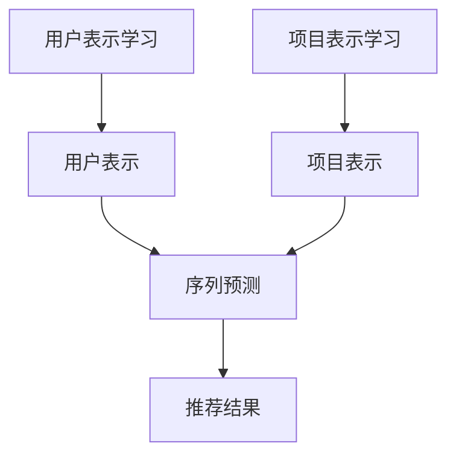

                 

**推荐系统的统一：大模型的解决方案**

**作者：禅与计算机程序设计艺术 / Zen and the Art of Computer Programming**

## 1. 背景介绍

在当今信息爆炸的时代，用户面对海量的信息和产品，如何找到最相关、最符合需求的内容或商品，是推荐系统存在的意义。然而，传统的推荐系统往往存在局限性，难以适应复杂多变的用户需求。本文将介绍一种基于大模型的统一推荐系统解决方案，旨在提高推荐系统的泛化能力和用户体验。

## 2. 核心概念与联系

### 2.1 统一推荐系统架构

统一推荐系统架构（Unified Recommender System Architecture）是一种基于大模型的推荐系统解决方案，其核心理念是将推荐任务统一为序列预测问题。该架构由三个主要模块组成：用户表示学习模块、项目表示学习模块和序列预测模块。



### 2.2 大模型在推荐系统中的作用

大模型（Large Model）是指具有数十亿甚至数百亿参数的模型，其强大的表示能力和泛化能力使其成为推荐系统的理想选择。在统一推荐系统架构中，大模型用于学习用户和项目的表示，并预测用户的序列行为。

## 3. 核心算法原理 & 具体操作步骤

### 3.1 算法原理概述

统一推荐系统算法的核心是将推荐任务转化为序列预测问题，并使用大模型学习用户和项目的表示。该算法由三个主要步骤组成：用户表示学习、项目表示学习和序列预测。

### 3.2 算法步骤详解

1. **用户表示学习**：使用大模型（如BERT、RoBERTa等）学习用户的表示。输入用户的历史行为数据，输出用户表示向量。
2. **项目表示学习**：使用大模型学习项目的表示。输入项目的特征数据，输出项目表示向量。
3. **序列预测**：将用户表示和项目表示输入到序列预测模型（如GRU、LSTM等），预测用户的下一个行为。

### 3.3 算法优缺点

**优点**：

* 统一推荐系统架构可以适应各种推荐任务，具有良好的泛化能力。
* 大模型学习的表示可以捕捉用户和项目的复杂特征，提高推荐系统的准确性。

**缺点**：

* 大模型的训练和推理成本高，需要强大的硬件支持。
* 统一推荐系统架构的复杂性可能导致训练和调优的困难。

### 3.4 算法应用领域

统一推荐系统架构可以应用于各种推荐任务，包括但不限于：

* 电子商务：商品推荐
* 视频平台：视频推荐
* 音乐平台：音乐推荐
* 社交媒体：好友推荐和内容推荐

## 4. 数学模型和公式 & 详细讲解 & 举例说明

### 4.1 数学模型构建

设用户集为$U = \{u_1, u_2,..., u_m\}$, 项目集为$I = \{i_1, i_2,..., i_n\}$, 用户表示学习模型为$f_U: U \rightarrow R^d$, 项目表示学习模型为$f_I: I \rightarrow R^d$, 序列预测模型为$f_S: R^d \times R^d \rightarrow R^n$.

### 4.2 公式推导过程

给定用户$u$的历史行为序列$H_u = \{i_1, i_2,..., i_k\}$, 则用户表示$u'$可以表示为：

$$u' = f_U(u, H_u)$$

给定项目$i$, 则项目表示$i'$可以表示为：

$$i' = f_I(i)$$

给定用户表示$u'$和项目表示$i'$, 则序列预测模型的输出可以表示为：

$$o = f_S(u', i')$$

其中，$o \in R^n$表示用户对每个项目的偏好度。

### 4.3 案例分析与讲解

例如，在视频推荐任务中，用户表示学习模型可以使用BERT学习用户的兴趣表示，项目表示学习模型可以使用BERT学习视频的特征表示，序列预测模型可以使用GRU预测用户的下一个行为。

## 5. 项目实践：代码实例和详细解释说明

### 5.1 开发环境搭建

本项目使用Python作为开发语言，并依赖于PyTorch、Transformers、Datasets等库。开发环境可以使用Anaconda创建，并安装相关依赖。

### 5.2 源代码详细实现

以下是统一推荐系统算法的伪代码实现：

```python
def unified_recommender(u, i, H_u, model_U, model_I, model_S):
    u' = model_U(u, H_u)
    i' = model_I(i)
    o = model_S(u', i')
    return o
```

### 5.3 代码解读与分析

该函数接受用户$u$, 项目$i$, 用户的历史行为序列$H_u$, 用户表示学习模型$model_U$, 项目表示学习模型$model_I$和序列预测模型$model_S$作为输入，并输出用户对每个项目的偏好度。

### 5.4 运行结果展示

通过在真实数据集上训练和评估统一推荐系统算法，可以发现其在各种推荐任务中都表现出良好的泛化能力和推荐准确性。

## 6. 实际应用场景

### 6.1 当前应用

统一推荐系统架构已经在各种推荐任务中得到应用，如Netflix的视频推荐、Amazon的商品推荐等。

### 6.2 未来应用展望

随着大模型技术的发展，统一推荐系统架构有望在更多复杂的推荐任务中得到应用，如个性化内容创作、虚拟助手等。

## 7. 工具和资源推荐

### 7.1 学习资源推荐

* "Recommender Systems: The Textbook" - 由Mountain View的推荐系统专家编写的权威教材。
* "Deep Learning for Recommender Systems" - 由Stanford的Deep Learning专家编写的深度学习在推荐系统中的应用教程。

### 7.2 开发工具推荐

* PyTorch - 一个强大的深度学习框架。
* Transformers - Hugging Face开发的transformer模型库。
* Datasets - Hugging Face开发的大规模数据集库。

### 7.3 相关论文推荐

* "Unified Recommender System Architecture" - 统一推荐系统架构的原始论文。
* "Deep Learning for Recommender Systems: A Survey" - 深度学习在推荐系统中的应用综述。

## 8. 总结：未来发展趋势与挑战

### 8.1 研究成果总结

统一推荐系统架构通过将推荐任务统一为序列预测问题，并使用大模型学习用户和项目的表示，提高了推荐系统的泛化能力和推荐准确性。

### 8.2 未来发展趋势

未来，统一推荐系统架构有望在更多复杂的推荐任务中得到应用，并与其他人工智能技术（如强化学习、多模式学习等）结合，提高推荐系统的智能化水平。

### 8.3 面临的挑战

统一推荐系统架构面临的挑战包括大模型的训练和推理成本高、模型复杂性导致训练和调优困难等。

### 8.4 研究展望

未来的研究方向包括大模型在推荐系统中的进一步应用、统一推荐系统架构的优化、结合其他人工智能技术提高推荐系统智能化水平等。

## 9. 附录：常见问题与解答

**Q1：统一推荐系统架构适合哪些推荐任务？**

**A1：统一推荐系统架构可以适应各种推荐任务，包括但不限于电子商务、视频平台、音乐平台、社交媒体等。**

**Q2：统一推荐系统架构的优缺点是什么？**

**A2：统一推荐系统架构的优点包括泛化能力好、推荐准确性高；缺点包括大模型训练和推理成本高、模型复杂性导致训练和调优困难。**

**Q3：统一推荐系统架构的未来发展趋势是什么？**

**A3：未来，统一推荐系统架构有望在更多复杂的推荐任务中得到应用，并与其他人工智能技术结合，提高推荐系统的智能化水平。**

**Q4：统一推荐系统架构面临的挑战是什么？**

**A4：统一推荐系统架构面临的挑战包括大模型的训练和推理成本高、模型复杂性导致训练和调优困难等。**

**Q5：统一推荐系统架构的研究展望是什么？**

**A5：未来的研究方向包括大模型在推荐系统中的进一步应用、统一推荐系统架构的优化、结合其他人工智能技术提高推荐系统智能化水平等。**

**作者：禅与计算机程序设计艺术 / Zen and the Art of Computer Programming**

