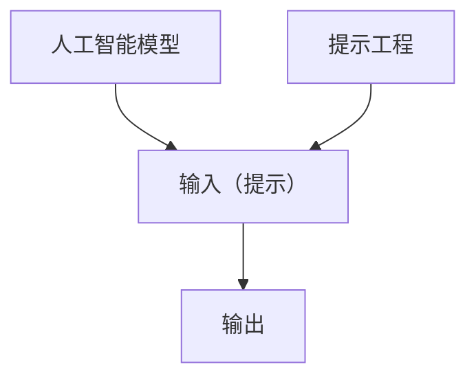

                 

**提示工程** (Prompt Engineering) 是一种新兴的编程范式，它利用人工智能模型的能力，通过设计和优化输入（提示）来实现复杂的任务。本文将探讨提示工程如何替代传统编程语言，并深入剖析其核心概念、算法原理、数学模型，以及实际应用场景。

## 1. 背景介绍

在传统编程范式中，程序员需要使用特定的编程语言编写代码，指导计算机完成任务。然而，随着人工智能模型（如transformer模型）的发展，我们可以通过提供合适的输入（提示）来引导模型生成所需的输出。提示工程就是一种利用这种能力的编程范式。

## 2. 核心概念与联系

### 2.1 核心概念

- **提示（Prompt）**：输入给人工智能模型的文本，用于引导模型生成特定的输出。
- **提示工程（Prompt Engineering）**：设计和优化提示以实现复杂任务的过程。
- **人工智能模型（AI Model）**：用于处理提示并生成输出的计算机模型，如transformer模型。

### 2.2 核心联系

人工智能模型通过处理输入（提示）并生成输出来工作。提示工程师设计和优化提示，以指导模型生成所需的输出。这个过程可以替代传统的编程范式，因为它允许我们使用自然语言指令来实现复杂的任务。



## 3. 核心算法原理 & 具体操作步骤

### 3.1 算法原理概述

提示工程的核心原理是利用人工智能模型的能力，通过设计和优化输入（提示）来实现复杂的任务。这涉及到理解模型的工作原理，并设计合适的输入来引导模型生成所需的输出。

### 3.2 算法步骤详解

1. **理解任务需求**：明确需要实现的任务。
2. **选择模型**：选择适合任务的AI模型。
3. **设计提示**：基于模型的工作原理，设计合适的输入（提示）来引导模型生成所需的输出。
4. **测试和优化**：测试提示，并根据模型的输出优化提示。

### 3.3 算法优缺点

**优点**：

- 使用自然语言指令实现复杂任务。
- 可以快速原型化和部署应用。
- 可以利用大型语言模型的知识库。

**缺点**：

- 模型的输出可能不准确或不一致。
- 模型的性能取决于训练数据的质量。
- 模型可能生成不相关或有害的输出。

### 3.4 算法应用领域

提示工程可以应用于各种领域，包括自然语言处理（NLP）、数据分析、图像和视频处理等。它还可以用于开发新的应用程序和服务，如智能助手、聊天机器人和自动化工具。

## 4. 数学模型和公式 & 详细讲解 & 举例说明

### 4.1 数学模型构建

人工智能模型通常基于统计模型或神经网络构建。transformer模型是一种基于自注意力机制的神经网络模型，它可以处理序列数据，如文本和图像。

### 4.2 公式推导过程

transformer模型的核心是自注意力机制，其公式如下：

$$ \text{Attention}(Q, K, V) = \text{softmax}\left(\frac{QK^T}{\sqrt{d_k}}\right)V $$

其中，$Q$, $K$, $V$分别是查询、键和值向量，$d_k$是键向量的维度。

### 4.3 案例分析与讲解

例如，我们可以使用transformer模型来实现文本翻译。我们的提示可以是：

"Translate the following English text to French: 'Hello, how are you?'"

模型会生成以下输出：

"Bonjour, comment ça va?"

## 5. 项目实践：代码实例和详细解释说明

### 5.1 开发环境搭建

我们需要一个支持transformer模型的开发环境。我们可以使用Hugging Face的Transformers库，它提供了预训练的transformer模型和简单的API。

### 5.2 源代码详细实现

以下是一个简单的Python示例，使用Hugging Face的Transformers库来实现文本翻译：

```python
from transformers import AutoTokenizer, AutoModelForSeq2SeqLM

tokenizer = AutoTokenizer.from_pretrained("Helsinki-NLP/opus-mt-en-fr")
model = AutoModelForSeq2SeqLM.from_pretrained("Helsinki-NLP/opus-mt-en-fr")

inputs = tokenizer("Translate the following English text to French: 'Hello, how are you?'", return_tensors="pt")
outputs = model.generate(inputs["input_ids"], max_length=50)
translation = tokenizer.decode(outputs[0], skip_special_tokens=True)

print(translation)  # Output: Bonjour, comment ça va?
```

### 5.3 代码解读与分析

我们首先加载预训练的transformer模型和其对应的分词器。然后，我们使用分词器将输入文本转换为模型可以处理的形式。我们使用模型的`generate`方法来生成翻译，并使用分词器将输出转换回文本形式。

### 5.4 运行结果展示

当我们运行这个示例时，模型会生成以下输出：

"Bonjour, comment ça va?"

## 6. 实际应用场景

### 6.1 当前应用

提示工程已经在各种应用中得到广泛应用，包括智能助手（如Siri和Alexa）、聊天机器人、自动化工具和内容生成系统。

### 6.2 未来应用展望

未来，提示工程可能会成为一种主流的编程范式，因为它允许使用自然语言指令来实现复杂的任务。它还可以与其他编程范式结合使用，以提供更强大和灵活的解决方案。

## 7. 工具和资源推荐

### 7.1 学习资源推荐

- [Hugging Face的Transformers教程](https://huggingface.co/transformers/)
- [Prompt Engineering Guide](https://github.com/datitran/big-list-of-naughty-strings)
- [The Book of Shaders](https://thebookofshaders.com/)

### 7.2 开发工具推荐

- [Hugging Face的Transformers库](https://huggingface.co/transformers/)
- [Google Colab](https://colab.research.google.com/)
- [Jupyter Notebook](https://jupyter.org/)

### 7.3 相关论文推荐

- [Attention is All You Need](https://arxiv.org/abs/1706.03762)
- [Language Models are Few-Shot Learners](https://arxiv.org/abs/2005.14165)
- [Prompt Tuning Meets Parameter-Efficient Transfer Learning](https://arxiv.org/abs/2107.13586)

## 8. 总结：未来发展趋势与挑战

### 8.1 研究成果总结

提示工程是一种新兴的编程范式，它利用人工智能模型的能力，通过设计和优化输入（提示）来实现复杂的任务。它已经在各种应用中得到广泛应用，并展示出巨大的潜力。

### 8.2 未来发展趋势

未来，提示工程可能会成为一种主流的编程范式，因为它允许使用自然语言指令来实现复杂的任务。它还可以与其他编程范式结合使用，以提供更强大和灵活的解决方案。

### 8.3 面临的挑战

然而，提示工程也面临着挑战，包括模型的输出可能不准确或不一致，模型的性能取决于训练数据的质量，以及模型可能生成不相关或有害的输出。

### 8.4 研究展望

未来的研究应该关注提高模型输出的准确性和一致性，优化提示设计以提高模型性能，并开发新的模型和技术来解决这些挑战。

## 9. 附录：常见问题与解答

**Q：提示工程与传统编程有何不同？**

**A**：提示工程使用自然语言指令来实现复杂的任务，而传统编程则使用特定的编程语言编写代码来指导计算机完成任务。

**Q：提示工程的优点是什么？**

**A**：提示工程的优点包括使用自然语言指令实现复杂任务，可以快速原型化和部署应用，以及可以利用大型语言模型的知识库。

**Q：提示工程的缺点是什么？**

**A**：提示工程的缺点包括模型的输出可能不准确或不一致，模型的性能取决于训练数据的质量，以及模型可能生成不相关或有害的输出。

**Q：提示工程可以应用于哪些领域？**

**A**：提示工程可以应用于各种领域，包括自然语言处理（NLP）、数据分析、图像和视频处理等。它还可以用于开发新的应用程序和服务，如智能助手、聊天机器人和自动化工具。

**Q：未来提示工程的发展趋势是什么？**

**A**：未来，提示工程可能会成为一种主流的编程范式，因为它允许使用自然语言指令来实现复杂的任务。它还可以与其他编程范式结合使用，以提供更强大和灵活的解决方案。

**Q：提示工程面临的挑战是什么？**

**A**：提示工程面临的挑战包括模型的输出可能不准确或不一致，模型的性能取决于训练数据的质量，以及模型可能生成不相关或有害的输出。

**Q：未来提示工程的研究方向是什么？**

**A**：未来的研究应该关注提高模型输出的准确性和一致性，优化提示设计以提高模型性能，并开发新的模型和技术来解决这些挑战。

## 作者：禅与计算机程序设计艺术 / Zen and the Art of Computer Programming

