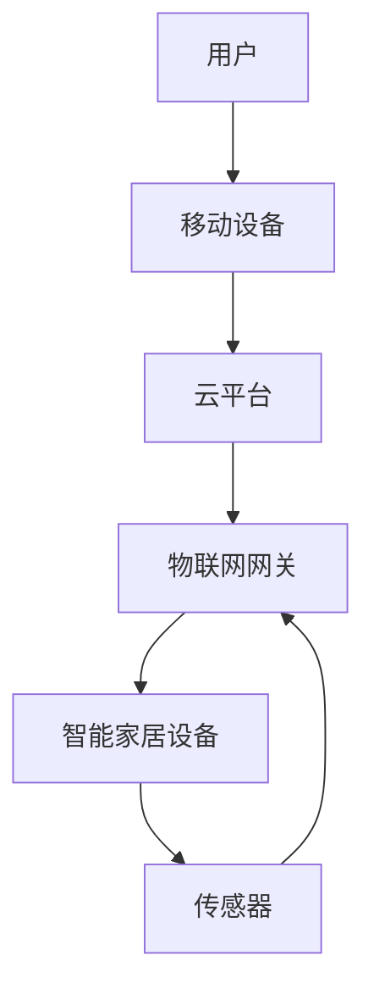

                 

**未来的智能家居：2050年的家庭机器人管家与智能家电**

**作者：禅与计算机程序设计艺术 / Zen and the Art of Computer Programming**

## 1. 背景介绍

智能家居是指将智能技术和家居设备相结合，实现家居自动化控制的系统。随着人工智能、物联网、大数据等技术的发展，智能家居正在从科幻走向现实。本文将探讨未来智能家居的发展趋势，重点关注2050年家庭机器人管家和智能家电的发展。

## 2. 核心概念与联系

### 2.1 核心概念

- **物联网（IoT）**：智能家居的基础，指通过各种信息传感设备，实现物与物、物与人的连接，实现信息交换和通信。
- **人工智能（AI）**：智能家居的大脑，指模拟人类智能的计算机系统，能够学习、推理和解决问题。
- **云计算**：智能家居的后台，指通过互联网将计算任务交由远程的服务器完成，实现资源共享和高效管理。

### 2.2 核心架构

智能家居的核心架构如下：



## 3. 核心算法原理 & 具体操作步骤

### 3.1 算法原理概述

智能家居的核心算法包括机器学习、深度学习、自然语言处理等。本节以机器学习为例进行介绍。

### 3.2 算法步骤详解

1. **数据收集**：收集智能家居设备产生的数据，如温度、湿度、光照强度等。
2. **数据预处理**：清洗数据，去除异常值，并对数据进行标准化。
3. **特征选择**：选择有意义的特征，忽略无关特征。
4. **模型训练**：使用机器学习算法（如决策树、支持向量机等）对数据进行训练。
5. **模型评估**：评估模型的准确性，并进行调参以提高性能。
6. **预测**：使用训练好的模型对新数据进行预测。

### 3.3 算法优缺点

**优点**：机器学习算法可以从数据中学习规律，实现自动化控制。此外，机器学习算法可以适应环境变化，实现智能化控制。

**缺点**：机器学习算法需要大量数据进行训练，且模型的准确性受数据质量的影响。此外，机器学习算法的复杂性也限制了其在资源受限的设备上的应用。

### 3.4 算法应用领域

机器学习算法在智能家居领域的应用包括：

- **环境控制**：根据用户的偏好和环境条件，自动控制空调、照明等设备。
- **能源管理**：根据用户的使用习惯，优化能源消耗，实现节能。
- **安全防护**：通过分析设备数据，检测异常情况，实现安全防护。

## 4. 数学模型和公式 & 详细讲解 & 举例说明

### 4.1 数学模型构建

智能家居的数学模型可以表示为：

$$Y = f(X, \theta)$$

其中，$Y$表示智能家居设备的输出，$X$表示输入特征，$f$表示学习到的模型，$theta$表示模型的参数。

### 4.2 公式推导过程

模型的参数可以通过最小化损失函数来学习：

$$\theta^* = \arg\min_{\theta} L(Y, f(X, \theta))$$

其中，$L$表示损失函数，$theta^*$表示最优参数。

### 4.3 案例分析与讲解

例如，在智能照明系统中，输入特征$X$可以包括时间、天气、用户位置等，输出$Y$可以是照明强度。模型可以通过回归算法学习到用户的照明偏好，实现智能化控制。

## 5. 项目实践：代码实例和详细解释说明

### 5.1 开发环境搭建

智能家居项目的开发环境包括：

- **编程语言**：Python
- **开发平台**：Jupyter Notebook
- **库和框架**：TensorFlow、Keras、Pandas、NumPy

### 5.2 源代码详细实现

以下是智能照明系统的代码实现：

```python
import pandas as pd
from sklearn.model_selection import train_test_split
from sklearn.preprocessing import StandardScaler
from tensorflow.keras.models import Sequential
from tensorflow.keras.layers import Dense

# 加载数据
data = pd.read_csv('smart_lighting.csv')

# 分割数据
X = data.drop('light_intensity', axis=1)
y = data['light_intensity']
X_train, X_test, y_train, y_test = train_test_split(X, y, test_size=0.2, random_state=42)

# 数据预处理
scaler = StandardScaler()
X_train = scaler.fit_transform(X_train)
X_test = scaler.transform(X_test)

# 构建模型
model = Sequential()
model.add(Dense(64, input_dim=X_train.shape[1], activation='relu'))
model.add(Dense(32, activation='relu'))
model.add(Dense(1, activation='linear'))

# 编译模型
model.compile(loss='mean_squared_error', optimizer='adam')

# 训练模型
model.fit(X_train, y_train, epochs=100, batch_size=32, verbose=1)

# 评估模型
loss = model.evaluate(X_test, y_test, verbose=0)
print('Test loss:', loss)
```

### 5.3 代码解读与分析

代码首先加载数据，并分割为训练集和测试集。然后，代码对数据进行预处理，并构建一个神经网络模型。模型使用relu激活函数和线性输出，编译时使用均方误差作为损失函数。最后，代码训练模型并评估其性能。

### 5.4 运行结果展示

运行代码后，输出的测试损失值可以表示模型的性能。损失值越小，表示模型的性能越好。

## 6. 实际应用场景

### 6.1 当前应用

当前，智能家居已经开始应用于实际生活。例如，Amazon Echo、Google Home等智能音箱可以实现语音控制家居设备。此外，智能照明、智能空调等设备也开始普及。

### 6.2 未来应用展望

到2050年，智能家居将更加智能化和人性化。例如：

- **家庭机器人管家**：机器人可以学习用户的习惯，自动完成家务，如清洁、购物等。
- **智能家电**：家电可以实现自动化控制，如智能冰箱可以根据用户的饮食习惯自动购物，智能洗衣机可以根据衣物的材质和颜色自动选择洗涤程序。

## 7. 工具和资源推荐

### 7.1 学习资源推荐

- **书籍**："人工智能：一种现代方法"、"机器学习"、"深度学习"
- **在线课程**：Coursera、Udacity、edX上的人工智能和机器学习课程

### 7.2 开发工具推荐

- **编程语言**：Python
- **开发平台**：Jupyter Notebook、PyCharm
- **库和框架**：TensorFlow、Keras、Pandas、NumPy

### 7.3 相关论文推荐

- "A Survey on Smart Home: Technologies, Standards, and Applications"、"Smart Home: A Survey on Technologies, Applications, and Challenges"、"A Survey on Machine Learning Techniques for Smart Homes"

## 8. 总结：未来发展趋势与挑战

### 8.1 研究成果总结

本文介绍了智能家居的核心概念、架构、算法原理、数学模型和实际应用。通过项目实践，展示了智能照明系统的实现过程。

### 8.2 未来发展趋势

未来，智能家居将朝着更加智能化、人性化和可持续化的方向发展。例如，家庭机器人管家将更加普及，智能家电将更加智能化，智能家居将更加注重能源管理和环保。

### 8.3 面临的挑战

智能家居面临的挑战包括：

- **隐私保护**：智能家居收集大量用户数据，如何保护用户隐私是一个挑战。
- **安全性**：智能家居连接互联网，如何保证安全性是一个挑战。
- **标准化**：智能家居设备的标准化是一个挑战，不同设备之间的兼容性需要解决。

### 8.4 研究展望

未来的研究方向包括：

- **人机交互**：研究更加自然和人性化的交互方式。
- **能源管理**：研究智能家居在能源管理方面的应用。
- **安全防护**：研究智能家居在安全防护方面的应用。

## 9. 附录：常见问题与解答

**Q1：智能家居需要消耗大量能源吗？**

**A1：智能家居的能源消耗取决于具体设备。例如，智能照明系统可以实现节能，而智能空调系统则可能会增加能源消耗。未来的智能家居将更加注重能源管理，实现节能和可持续发展。**

**Q2：智能家居是否会侵犯隐私？**

**A2：智能家居收集大量用户数据，如何保护用户隐私是一个挑战。未来的智能家居将更加注重隐私保护，实现数据匿名化和加密等技术。**

**Q3：智能家居是否会被黑客攻击？**

**A3：智能家居连接互联网，如何保证安全性是一个挑战。未来的智能家居将更加注重安全防护，实现设备认证、加密通信等技术。**

**Q4：智能家居是否会取代人力？**

**A4：智能家居的目的是辅助人类，而不是取代人类。未来的智能家居将更加人性化，实现人机协作。**

**Q5：智能家居是否会导致就业岗位减少？**

**A5：智能家居的发展将带来新的就业岗位，如智能家居设计师、智能家居维护工程师等。未来的智能家居将更加注重人机协作，实现人类和智能家居的共同发展。**

## 结束语

智能家居是未来家庭生活的重要组成部分。到2050年，智能家居将更加智能化和人性化，实现家庭机器人管家和智能家电的普及。未来的智能家居将更加注重能源管理、隐私保护和安全防护，实现节能和可持续发展。智能家居的发展将带来新的就业岗位，实现人类和智能家居的共同发展。智能家居的未来充满希望，让我们一起期待智能家居的发展。

**作者：禅与计算机程序设计艺术 / Zen and the Art of Computer Programming**

