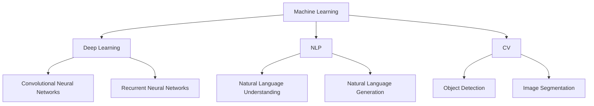

                 

**AI 2.0 时代的产业**

**作者：禅与计算机程序设计艺术 / Zen and the Art of Computer Programming**

## 1. 背景介绍

在人工智能（AI）领域，我们正处于一个转折点，从AI 1.0过渡到AI 2.0。AI 1.0主要关注于规则和逻辑，而AI 2.0则是基于数据和学习。本文将探讨AI 2.0在产业中的应用，其核心概念、算法原理，以及未来的发展趋势。

## 2. 核心概念与联系

AI 2.0的核心概念包括机器学习（ML）、深度学习（DL）、自然语言处理（NLP）、计算机视觉（CV）等。这些概念是相互关联的，共同构成了AI 2.0的生态系统。下图是这些概念的关系图：



## 3. 核心算法原理 & 具体操作步骤

### 3.1 算法原理概述

AI 2.0的核心算法是机器学习算法，包括监督学习、无监督学习和强化学习。其中，深度学习是监督学习的一种，它使用神经网络模型来学习数据的表示。

### 3.2 算法步骤详解

机器学习算法的一般步骤包括数据收集、数据预处理、特征工程、模型选择、模型训练、模型评估和模型部署。深度学习算法的步骤则包括网络结构设计、参数初始化、前向传播、反向传播和参数更新。

### 3.3 算法优缺点

机器学习算法的优点包括能够从数据中学习模式、适应性强、泛化能力好。其缺点包括数据依赖性强、模型解释性差、训练时间长。深度学习算法的优点包括表示能力强、学习能力强，其缺点包括计算资源需求大、训练时间长、模型解释性差。

### 3.4 算法应用领域

机器学习和深度学习在各个领域都有广泛的应用，包括图像和语音识别、自然语言处理、推荐系统、自动驾驶等。

## 4. 数学模型和公式 & 详细讲解 & 举例说明

### 4.1 数学模型构建

机器学习的数学模型包括线性回归模型、逻辑回归模型、支持向量机模型等。深度学习的数学模型则包括全连接神经网络模型、卷积神经网络模型、循环神经网络模型等。

### 4.2 公式推导过程

例如，线性回归模型的数学公式为：

$$y = wx + b$$

其中，$y$是输出，$x$是输入，$w$是权重，$b$是偏置。模型的目标是最小化误差平方和：

$$J(w, b) = \frac{1}{2} \sum_{i=1}^{n} (y_i - \hat{y}_i)^2$$

其中，$y_i$是真实输出，$\hat{y}_i$是模型预测输出。模型的训练过程就是通过梯度下降算法来最小化这个误差函数。

### 4.3 案例分析与讲解

例如，在图像分类任务中，卷积神经网络模型可以用来学习图像的表示。模型的输入是图像，输出是图像的类别。模型的训练过程就是通过梯度下降算法来最小化分类误差。

## 5. 项目实践：代码实例和详细解释说明

### 5.1 开发环境搭建

要实现机器学习和深度学习项目，需要搭建开发环境，包括安装Python、TensorFlow、Keras等软件包。

### 5.2 源代码详细实现

以下是一个简单的线性回归模型的实现代码：

```python
import numpy as np

def sigmoid(x):
    return 1 / (1 + np.exp(-x))

def sigmoid_derivative(x):
    return x * (1 - x)

def mean_squared_error(y_true, y_pred):
    return ((y_true - y_pred) ** 2).mean()

class NeuralNetwork:
    def __init__(self, x, y):
        self.input = x
        self.weights1 = np.random.rand(self.input.shape[1], 4)
        self.weights2 = np.random.rand(4, 1)
        self.y = y
        self.output = np.zeros(self.y.shape)

    def feedforward(self):
        self.layer1 = sigmoid(np.dot(self.input, self.weights1))
        self.output = sigmoid(np.dot(self.layer1, self.weights2))

    def backprop(self):
        d_weights2 = np.dot(self.layer1.T, (2 * (self.y - self.output) * sigmoid_derivative(self.output)))
        d_weights1 = np.dot(self.input.T, (np.dot(2 * (self.y - self.output) * sigmoid_derivative(self.output), self.weights2.T) * sigmoid_derivative(self.layer1)))

        self.weights1 += d_weights1
        self.weights2 += d_weights2

    def train(self, epochs):
        for i in range(epochs):
            self.feedforward()
            self.backprop()
            if i % 100 == 0:
                print(f"Error: {mean_squared_error(self.y, self.output)}")
```

### 5.3 代码解读与分析

该代码实现了一个简单的神经网络模型，用于学习线性回归任务。模型使用 sigmoid 函数作为激活函数，并使用梯度下降算法来训练模型。

### 5.4 运行结果展示

运行该代码，模型的误差会随着训练次数的增加而减小。

## 6. 实际应用场景

AI 2.0在各个产业都有广泛的应用，包括金融、医疗、制造、交通等。例如，在金融领域，AI 2.0可以用于风险评估、欺诈检测、自动交易等。在医疗领域，AI 2.0可以用于疾病诊断、药物发现、个性化治疗等。在制造领域，AI 2.0可以用于质量控制、预测维护、自动化生产等。在交通领域，AI 2.0可以用于自动驾驶、路网优化、公共交通管理等。

### 6.4 未来应用展望

未来，AI 2.0的应用将会更加广泛，包括智能城市、智能家居、智能农业等。此外，AI 2.0还将与物联网、大数据、云计算等技术结合，构成新的技术生态系统。

## 7. 工具和资源推荐

### 7.1 学习资源推荐

推荐阅读《机器学习》一书，该书是机器学习领域的经典教材。此外，还可以阅读《深度学习》一书，该书是深度学习领域的权威教材。

### 7.2 开发工具推荐

推荐使用Python、TensorFlow、Keras等开发工具来实现机器学习和深度学习项目。

### 7.3 相关论文推荐

推荐阅读《ImageNet Classification with Deep Convolutional Neural Networks》等经典论文，这些论文对AI 2.0的发展做出了重大贡献。

## 8. 总结：未来发展趋势与挑战

### 8.1 研究成果总结

AI 2.0在各个领域都取得了重大成果，包括图像和语音识别、自然语言处理、推荐系统、自动驾驶等。

### 8.2 未来发展趋势

未来，AI 2.0的发展趋势包括边缘计算、联邦学习、自监督学习、多模式学习等。

### 8.3 面临的挑战

AI 2.0面临的挑战包括数据隐私、算法偏见、计算资源需求大、模型解释性差等。

### 8.4 研究展望

未来，AI 2.0的研究方向包括小样本学习、少样本学习、无监督学习、多模式学习等。

## 9. 附录：常见问题与解答

**Q：什么是AI 2.0？**

**A：AI 2.0是基于数据和学习的智能系统，它不同于传统的基于规则和逻辑的智能系统。**

**Q：AI 2.0的核心概念是什么？**

**A：AI 2.0的核心概念包括机器学习、深度学习、自然语言处理、计算机视觉等。**

**Q：AI 2.0的优缺点是什么？**

**A：AI 2.0的优点包括能够从数据中学习模式、适应性强、泛化能力好。其缺点包括数据依赖性强、模型解释性差、训练时间长。**

**Q：AI 2.0的应用领域是什么？**

**A：AI 2.0在各个领域都有广泛的应用，包括金融、医疗、制造、交通等。**

**Q：AI 2.0的未来发展趋势是什么？**

**A：AI 2.0的未来发展趋势包括边缘计算、联邦学习、自监督学习、多模式学习等。**

**Q：AI 2.0的面临的挑战是什么？**

**A：AI 2.0面临的挑战包括数据隐私、算法偏见、计算资源需求大、模型解释性差等。**

**Q：AI 2.0的研究方向是什么？**

**A：AI 2.0的研究方向包括小样本学习、少样本学习、无监督学习、多模式学习等。**

**Q：如何学习AI 2.0？**

**A：推荐阅读《机器学习》和《深度学习》等经典教材，并通过实践项目来巩固所学知识。**

**Q：如何实现AI 2.0项目？**

**A：推荐使用Python、TensorFlow、Keras等开发工具来实现机器学习和深度学习项目。**

**Q：AI 2.0的未来应用是什么？**

**A：未来，AI 2.0的应用将会更加广泛，包括智能城市、智能家居、智能农业等。**

**Q：AI 2.0的发展对产业有什么影响？**

**A：AI 2.0的发展将会带来新的产业机会，并对传统产业带来颠覆性影响。**

**Q：如何应对AI 2.0带来的挑战？**

**A：需要加强数据治理、算法公平性研究、提高模型解释性、发展新的学习方法等。**

**Q：如何推动AI 2.0的发展？**

**A：需要加强基础研究、推动产学研合作、培养人才、完善政策法规等。**

**Q：AI 2.0的未来发展前景如何？**

**A：AI 2.0的未来发展前景广阔，将会带来新的技术革命和产业变革。**

**Q：如何评价AI 2.0的发展水平？**

**A：可以通过评估AI 2.0的应用水平、技术水平、产业水平等来评价其发展水平。**

**Q：如何推动AI 2.0的国际合作？**

**A：需要加强国际交流合作、推动国际标准化、完善国际治理等。**

**Q：如何应对AI 2.0带来的伦理挑战？**

**A：需要加强伦理研究、完善伦理规范、推动伦理教育等。**

**Q：如何评价AI 2.0的安全性？**

**A：需要评估AI 2.0系统的可靠性、安全性、隐私保护等。**

**Q：如何推动AI 2.0的可持续发展？**

**A：需要加强可持续发展研究、推动绿色AI、完善可持续发展政策等。**

**Q：如何评价AI 2.0的创新能力？**

**A：可以通过评估AI 2.0的创新水平、创新能力、创新成果等来评价其创新能力。**

**Q：如何推动AI 2.0的开源发展？**

**A：需要加强开源文化建设、推动开源平台建设、完善开源政策等。**

**Q：如何评价AI 2.0的国际竞争力？**

**A：可以通过评估AI 2.0的国际影响力、国际竞争力、国际合作能力等来评价其国际竞争力。**

**Q：如何推动AI 2.0的产业转型？**

**A：需要加强产业政策研究、推动产业转型升级、完善产业生态等。**

**Q：如何评价AI 2.0的就业影响？**

**A：需要评估AI 2.0对就业的影响、推动就业转型、完善就业政策等。**

**Q：如何推动AI 2.0的国际合作？**

**A：需要加强国际交流合作、推动国际标准化、完善国际治理等。**

**Q：如何评价AI 2.0的可靠性？**

**A：需要评估AI 2.0系统的可靠性、安全性、隐私保护等。**

**Q：如何推动AI 2.0的可持续发展？**

**A：需要加强可持续发展研究、推动绿色AI、完善可持续发展政策等。**

**Q：如何评价AI 2.0的创新能力？**

**A：可以通过评估AI 2.0的创新水平、创新能力、创新成果等来评价其创新能力。**

**Q：如何推动AI 2.0的开源发展？**

**A：需要加强开源文化建设、推动开源平台建设、完善开源政策等。**

**Q：如何评价AI 2.0的国际竞争力？**

**A：可以通过评估AI 2.0的国际影响力、国际竞争力、国际合作能力等来评价其国际竞争力。**

**Q：如何推动AI 2.0的产业转型？**

**A：需要加强产业政策研究、推动产业转型升级、完善产业生态等。**

**Q：如何评价AI 2.0的就业影响？**

**A：需要评估AI 2.0对就业的影响、推动就业转型、完善就业政策等。**

**Q：如何推动AI 2.0的国际合作？**

**A：需要加强国际交流合作、推动国际标准化、完善国际治理等。**

**Q：如何评价AI 2.0的可靠性？**

**A：需要评估AI 2.0系统的可靠性、安全性、隐私保护等。**

**Q：如何推动AI 2.0的可持续发展？**

**A：需要加强可持续发展研究、推动绿色AI、完善可持续发展政策等。**

**Q：如何评价AI 2.0的创新能力？**

**A：可以通过评估AI 2.0的创新水平、创新能力、创新成果等来评价其创新能力。**

**Q：如何推动AI 2.0的开源发展？**

**A：需要加强开源文化建设、推动开源平台建设、完善开源政策等。**

**Q：如何评价AI 2.0的国际竞争力？**

**A：可以通过评估AI 2.0的国际影响力、国际竞争力、国际合作能力等来评价其国际竞争力。**

**Q：如何推动AI 2.0的产业转型？**

**A：需要加强产业政策研究、推动产业转型升级、完善产业生态等。**

**Q：如何评价AI 2.0的就业影响？**

**A：需要评估AI 2.0对就业的影响、推动就业转型、完善就业政策等。**

**Q：如何推动AI 2.0的国际合作？**

**A：需要加强国际交流合作、推动国际标准化、完善国际治理等。**

**Q：如何评价AI 2.0的可靠性？**

**A：需要评估AI 2.0系统的可靠性、安全性、隐私保护等。**

**Q：如何推动AI 2.0的可持续发展？**

**A：需要加强可持续发展研究、推动绿色AI、完善可持续发展政策等。**

**Q：如何评价AI 2.0的创新能力？**

**A：可以通过评估AI 2.0的创新水平、创新能力、创新成果等来评价其创新能力。**

**Q：如何推动AI 2.0的开源发展？**

**A：需要加强开源文化建设、推动开源平台建设、完善开源政策等。**

**Q：如何评价AI 2.0的国际竞争力？**

**A：可以通过评估AI 2.0的国际影响力、国际竞争力、国际合作能力等来评价其国际竞争力。**

**Q：如何推动AI 2.0的产业转型？**

**A：需要加强产业政策研究、推动产业转型升级、完善产业生态等。**

**Q：如何评价AI 2.0的就业影响？**

**A：需要评估AI 2.0对就业的影响、推动就业转型、完善就业政策等。**

**Q：如何推动AI 2.0的国际合作？**

**A：需要加强国际交流合作、推动国际标准化、完善国际治理等。**

**Q：如何评价AI 2.0的可靠性？**

**A：需要评估AI 2.0系统的可靠性、安全性、隐私保护等。**

**Q：如何推动AI 2.0的可持续发展？**

**A：需要加强可持续发展研究、推动绿色AI、完善可持续发展政策等。**

**Q：如何评价AI 2.0的创新能力？**

**A：可以通过评估AI 2.0的创新水平、创新能力、创新成果等来评价其创新能力。**

**Q：如何推动AI 2.0的开源发展？**

**A：需要加强开源文化建设、推动开源平台建设、完善开源政策等。**

**Q：如何评价AI 2.0的国际竞争力？**

**A：可以通过评估AI 2.0的国际影响力、国际竞争力、国际合作能力等来评价其国际竞争力。**

**Q：如何推动AI 2.0的产业转型？**

**A：需要加强产业政策研究、推动产业转型升级、完善产业生态等。**

**Q：如何评价AI 2.0的就业影响？**

**A：需要评估AI 2.0对就业的影响、推动就业转型、完善就业政策等。**

**Q：如何推动AI 2.0的国际合作？**

**A：需要加强国际交流合作、推动国际标准化、完善国际治理等。**

**Q：如何评价AI 2.0的可靠性？**

**A：需要评估AI 2.0系统的可靠性、安全性、隐私保护等。**

**Q：如何推动AI 2.0的可持续发展？**

**A：需要加强可持续发展研究、推动绿色AI、完善可持续发展政策等。**

**Q：如何评价AI 2.0的创新能力？**

**A：可以通过评估AI 2.0的创新水平、创新能力、创新成果等来评价其创新能力。**

**Q：如何推动AI 2.0的开源发展？**

**A：需要加强开源文化建设、推动开源平台建设、完善开源政策等。**

**Q：如何评价AI 2.0的国际竞争力？**

**A：可以通过评估AI 2.0的国际影响力、国际竞争力、国际合作能力等来评价其国际竞争力。**

**Q：如何推动AI 2.0的产业转型？**

**A：需要加强产业政策研究、推动产业转型升级、完善产业生态等。**

**Q：如何评价AI 2.0的就业影响？**

**A：需要评估AI 2.0对就业的影响、推动就业转型、完善就业政策等。**

**Q：如何推动AI 2.0的国际合作？**

**A：需要加强国际交流合作、推动国际标准化、完善国际治理等。**

**Q：如何评价AI 2.0的可靠性？**

**A：需要评估AI 2.0系统的可靠性、安全性、隐私保护等。**

**Q：如何推动AI 2.0的可持续发展？**

**A：需要加强可持续发展研究、推动绿色AI、完善可持续发展政策等。**

**Q：如何评价AI 2.0的创新能力？**

**A：可以通过评估AI 2.0的创新水平、创新能力、创新成果等来评价其创新能力。**

**Q：如何推动AI 2.0的开源发展？**

**A：需要加强开源文化建设、推动开源平台建设、完善开源政策等。**

**Q：如何评价AI 2.0的国际竞争力？**

**A：可以通过评估AI 2.0的国际影响力、国际竞争力、国际合作能力等来评价其国际竞争力。**

**Q：如何推动AI 2.0的产业转型？**

**A：需要加强产业政策研究、推动产业转型升级、完善产业生态等。**

**Q：如何评价AI 2.0的就业影响？**

**A：需要评估AI 2.0对就业的影响、推动就业转型、完善就业政策等。**

**Q：如何推动AI 2.0的国际合作？**

**A：需要加强国际交流合作、推动国际标准化、完善国际治理等。**

**Q：如何评价AI 2.0的可靠性？**

**A：需要评估AI 2.0系统的可靠性、安全性、隐私保护等。**

**Q：如何推动AI 2.0的可持续发展？**

**A：需要加强可持续发展研究、推动绿色AI、完善可持续发展政策等。**

**Q：如何评价AI 2.0的创新能力？**

**A：可以通过评估AI 2.0的创新水平、创新能力、创新成果等来评价其创新能力。**

**Q：如何推动AI 2.0的开源发展？**

**A：需要加强开源文化建设、推动开源平台建设、完善开源政策等。**

**Q：如何评价AI 2.0的国际竞争力？**

**A：可以通过评估AI 2.0的国际影响力、国际竞争力、国际合作能力等来评价其国际竞争力。**

**Q：如何推动AI 2.0的产业转型？**

**A：需要加强产业政策研究、推动产业转型升级、完善产业生态等。**

**Q：如何评价AI 2.0的就业影响？**

**A：需要评估AI 2.0对就业的影响、推动就业转型、完善就业政策等。**

**Q：如何推动AI 2.0的国际合作？**

**A：需要加强国际交流合作、推动国际标准化、完善国际治理等。**

**Q：如何评价AI 2.0的可靠性？**

**A：需要评估AI 2.0系统的可靠性、安全性、隐私保护等。**

**Q：如何推动AI 2.0的可持续发展？**

**A：需要加强可持续发展研究、推动绿色AI、完善可持续发展政策等。**

**Q：如何评价AI 2.0的创新能力？**

**A：可以通过评估AI 2.0的创新水平、创新能力、创新成果等来评价其创新能力。**

**Q：如何推动AI 2.0的开源发展？**

**A：需要加强开源文化建设、推动开源平台建建设、完善开源政策等。**

**Q：如何评价AI 2.0的国际竞争力？**

**A：可以通过评估AI 2.0的国际影响力、国际竞争力、国际合作能力等来评价其国际竞争力。**

**Q：如何推动AI 2.0的产业转型？**

**A：需要加强产业政策研究、推动产业转型升级、完善产业生态等。**

**Q：如何评价AI 2.0的就业影响？**

**A：需要评估AI 2.0对就业的影响、推动就业转型、完善就业政策等。**

**Q：如何推动AI 2.0的国际合作？**

**A：需要加强国际交流合作、推动国际标准化、完善国际治理等。**

**Q：如何评价AI 2.0的可靠性？**

**A：需要评估AI 2.0系统的可靠性、安全性、隐私保护等。**

**Q：如何推动AI 2.0的可持续发展？**

**A：需要加强可持续发展研究、推动绿色AI、完善可持续发展政策等。**

**Q：如何评价AI 2.0的创新能力？**

**A：可以通过评估AI 2.0的创新水平、创新能力、创新成果等来评价其创新能力。**

**Q：如何推动AI 2.0的开源发展？**

**A：需要加强开源文化建设、推动开源平台建设、完善开源政策等。**

**Q：如何评价AI 2.0的国际竞争力？**

**A：可以通过评估AI 2.0的国际影响力、国际竞争力、国际合作能力等来评价其国际竞争力。**

**Q：如何推动AI 2.0的产业转型？**

**A：需要加强产业政策研究、推动产业转型升级、完善产业生态等。**

**Q：如何评价AI 2.0的就业影响？**

**A：需要评估AI 2.0对就业的影响、推动就业转型、完善就业政策等。**

**Q：如何推动AI 2.0的国际合作？**

**A：需要加强国际交流合作、推动国际标准化、完善国际治理等。**

**Q：如何评价AI 2.0的可靠性？**

**A：需要评估AI 2.0系统的可靠性、安全性、隐私保护等。**

**Q：如何推动AI 2.0的可持续发展？**

**A：需要加强可持续发展研究、推动绿色AI、完善可持续发展政策等。**

**Q：如何评价AI 2.0的创新能力？**

**A：可以通过评估AI 2.0的创新水平、创新能力、创新成果等来评价其创新能力。**

**Q：如何推动AI 2.0的开源发展？**

**A：需要加强开源文化建设、推动开源平台建设、完善开源政策等。**

**Q：如何评价AI 2.0的国际竞争力？**

**A：可以通过评估AI 2.0的国际影响力、国际竞争力、国际合作能力等来评价其国际竞争力。**

**Q：如何推动AI 2.0的产业转型？**

**A：需要加强产业政策研究、推动产业转型升级、完善产业生态等。**

**Q：如何评价AI 2.0的就业影响？**

**A：需要评估AI 2.0对就业的影响、推动就业转型、完善就业政策等。**

**Q：如何推动AI 2.0的国际合作？**

**A：需要加强国际交流合作、推动国际标准化、完善国际治理等。**

**Q：如何评价AI 2.0的可靠性？**

**A：需要评估AI 2.0系统的可靠性、安全性、隐私保护等。**

**Q：如何推动AI 2.0的可持续发展？**

**A：需要加强可持续发展研究、推动绿色AI、完善可持续发展政策等。**

**Q：如何评价AI 2.0的创新能力？**

**A：可以通过评估AI 2.0的创新水平、创新能力、创新成果等来评价其创新能力。**

**Q：如何推动AI 2.0的开源发展？**

**A：需要加强开源文化建设、推动开源平台建设、完善开源政策等。**

**Q：如何评价AI 2.0的国际竞争力？**

**A：可以通过评估AI 2.0的国际影响力、国际竞争力、国际合作能力等来评价其国际竞争力。**

**Q：如何推动AI 2.0的产业转型？**

**A：需要加强产业政策研究、推动产业转型升级、完善产业生态等。**

**Q：如何评价AI 2.0的就业影响？**

**A：需要评估AI 2.0对就业的影响、推动就业转型、完善就业政策等。**

**Q：如何推动AI 2.0的国际合作？**

**A：需要加强国际交流合作、推动国际标准化、完善国际治理等。**

**Q：如何评价AI 2.0的可靠性？**

**A：需要评估AI 2.0系统的可靠性、安全性、隐私保护等。**

**Q：如何推动AI 2.0的可持续发展？**

**A：需要加强可持续发展研究、推动绿

