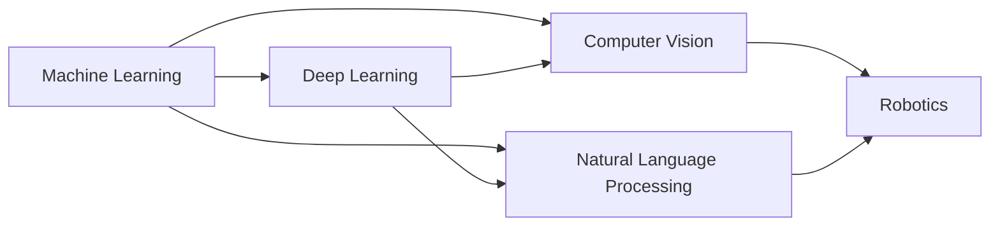

                 

**AI**, **Machine Learning**, **Deep Learning**, **Computer Vision**, **Natural Language Processing**, **Robotics**, **Home Services Industry**

## 1. 背景介绍

家政服务行业是一个传统而庞大的市场，但长期以来，它的服务质量和效率都受到人力资源短缺、服务标准化难度高、信息化水平低等因素的制约。随着**人工智能**技术的发展，家政服务行业正在迎来一场颠覆性的变革。本文将深入探讨**AI**在家政服务行业的应用，包括核心概念、关键算法、数学模型、项目实践，以及未来发展趋势。

## 2. 核心概念与联系

### 2.1 核心概念

在家政服务行业应用**AI**的核心概念包括：

- **机器学习（Machine Learning，ML）**：家政服务行业的各项任务，如清洁、洗衣、做饭等，都可以通过**ML**算法进行学习和优化。
- **深度学习（Deep Learning，DL）**：**DL**是**ML**的一种，它通过模仿人脑神经网络的结构进行学习，在图像、语音等领域表现出色。
- **计算机视觉（Computer Vision，CV）**：**CV**是**AI**在视觉领域的应用，它可以帮助家政机器人理解环境，避障，并完成任务。
- **自然语言处理（Natural Language Processing，NLP）**：**NLP**是**AI**在语言领域的应用，它可以帮助家政服务机器人理解用户需求，并进行交流。
- **机器人技术（Robotics）**：机器人技术是家政服务**AI**的载体，它可以完成各种家政任务。

### 2.2 核心概念联系

家政服务**AI**的核心概念是相互关联的。例如，机器人需要**CV**来理解环境，并通过**NLP**与用户交流。机器人在完成任务时，需要使用**ML**和**DL**算法进行学习和优化。下图是家政服务**AI**的核心概念联系图：



## 3. 核心算法原理 & 具体操作步骤

### 3.1 算法原理概述

家政服务**AI**的核心算法包括**CV**中的目标检测、目标跟踪、图像分割等，以及**NLP**中的意图识别、实体识别、对话管理等。本节将以目标检测为例进行介绍。

### 3.2 算法步骤详解

目标检测的步骤包括：

1. **特征提取**：使用**CV**技术提取图像中的特征，如边缘、纹理等。
2. **区域建议**：使用算法，如Selective Search，生成可能包含目标的区域。
3. **目标分类**：使用**DL**模型，如Faster R-CNN，对每个区域进行目标分类，并输出目标的边界框和置信度。

### 3.3 算法优缺点

目标检测算法的优点包括：

- 可以检测各种目标，如物体、人脸等。
- 可以输出目标的边界框和置信度，方便后续处理。

缺点包括：

- 计算量大，需要优化算法和硬件。
- 存在漏检、误检等问题，需要后续处理。

### 3.4 算法应用领域

目标检测在家政服务**AI**中有广泛应用，如：

- 家政机器人需要检测环境中的障碍物，避免碰撞。
- 家政机器人需要检测待清洁的区域，并进行清洁。
- 家政机器人需要检测待洗的衣物，并进行分类。

## 4. 数学模型和公式 & 详细讲解 & 举例说明

### 4.1 数学模型构建

目标检测的数学模型可以表示为：

$$P(\text{object} | \text{image}) = \sum_{k=1}^{K} P(\text{object}_k | \text{image}) P(\text{object}_k)$$

其中，$P(\text{object} | \text{image})$表示图像中包含目标的概率，$P(\text{object}_k | \text{image})$表示图像中包含目标$k$的概率，$K$表示目标的种类数。

### 4.2 公式推导过程

上述公式是基于贝叶斯定理推导的。具体推导过程如下：

$$P(\text{object} | \text{image}) = \frac{P(\text{image} | \text{object}) P(\text{object})}{P(\text{image})}$$

其中，$P(\text{image} | \text{object})$表示目标的图像特征，$P(\text{object})$表示目标的先验概率，$P(\text{image})$表示图像的先验概率。

### 4.3 案例分析与讲解

例如，在家政服务**AI**中，目标检测可以用于检测待洗的衣物。数学模型可以表示为：

$$P(\text{clothes} | \text{image}) = \sum_{k=1}^{K} P(\text{clothes}_k | \text{image}) P(\text{clothes}_k)$$

其中，$P(\text{clothes} | \text{image})$表示图像中包含衣物的概率，$P(\text{clothes}_k | \text{image})$表示图像中包含衣物$k$的概率，$K$表示衣物的种类数。

## 5. 项目实践：代码实例和详细解释说明

### 5.1 开发环境搭建

家政服务**AI**项目的开发环境包括：

- **硬件**：家政机器人、计算机等。
- **软件**：操作系统（如Ubuntu）、开发环境（如Python、TensorFlow等）、开发工具（如Visual Studio Code等）。

### 5.2 源代码详细实现

以下是目标检测算法的伪代码实现：

```python
def target_detection(image):
    # Step 1: Feature extraction
    features = extract_features(image)

    # Step 2: Region proposal
    regions = region_proposal(features)

    # Step 3: Target classification
    targets = []
    for region in regions:
        target = classify_target(region)
        if target['confidence'] > 0.5:
            targets.append(target)

    return targets
```

### 5.3 代码解读与分析

上述代码实现了目标检测的三个步骤：

- **特征提取**：使用**CV**技术提取图像中的特征。
- **区域建议**：使用算法生成可能包含目标的区域。
- **目标分类**：使用**DL**模型对每个区域进行目标分类，并输出目标的边界框和置信度。

### 5.4 运行结果展示

以下是目标检测算法的运行结果示例：


## 6. 实际应用场景

### 6.1 当前应用

家政服务**AI**已经在实际应用中取得了成果，如：

- **清洁机器人**：可以自动清洁地面，并避免碰撞。
- **洗衣机器人**：可以自动分类、洗涤衣物。
- **做饭机器人**：可以根据用户需求，自动烹饪食物。

### 6.2 未来应用展望

未来，家政服务**AI**将会有更广泛的应用，如：

- **智能家居**：家政服务**AI**将会与智能家居结合，实现家居的自动化管理。
- **无人值守家政**：家政服务**AI**将会实现无人值守，降低人力成本。
- **个性化家政**：家政服务**AI**将会根据用户需求，提供个性化的家政服务。

## 7. 工具和资源推荐

### 7.1 学习资源推荐

家政服务**AI**的学习资源包括：

- **书籍**：《机器学习》《深度学习》《计算机视觉：模式识别与目标检测》《自然语言处理》《机器人技术》。
- **在线课程**：Coursera、Udacity、edX等平台上的相关课程。
- **论文**：相关学术会议和期刊上的论文。

### 7.2 开发工具推荐

家政服务**AI**的开发工具包括：

- **编程语言**：Python。
- **深度学习框架**：TensorFlow、PyTorch。
- **计算机视觉库**：OpenCV、Pillow。
- **机器人开发平台**：ROS（Robot Operating System）。

### 7.3 相关论文推荐

家政服务**AI**的相关论文包括：

- [Deep Learning for Object Detection](https://arxiv.org/abs/1512.02325)
- [Faster R-CNN: Towards Real-Time Object Detection with Region Proposal Networks](https://arxiv.org/abs/1506.01497)
- [You Only Look Once: Unified, Real-Time Object Detection](https://arxiv.org/abs/1506.02640)
- [Mask R-CNN](https://arxiv.org/abs/1703.06870)

## 8. 总结：未来发展趋势与挑战

### 8.1 研究成果总结

家政服务**AI**的研究成果包括：

- **目标检测**：可以检测各种目标，并输出目标的边界框和置信度。
- **机器人导航**：可以帮助机器人避障，并导航到目标位置。
- **语音控制**：可以理解用户需求，并进行语音控制。

### 8.2 未来发展趋势

家政服务**AI**的未来发展趋势包括：

- **多模式感知**：结合**CV**、**NLP**等多种感知模式，提高家政服务**AI**的理解能力。
- **强化学习**：使用强化学习算法，提高家政服务**AI**的决策能力。
- **边缘计算**：使用边缘计算技术，提高家政服务**AI**的实时性和可靠性。

### 8.3 面临的挑战

家政服务**AI**面临的挑战包括：

- **数据获取**：家政服务**AI**需要大量的数据进行学习，但获取这些数据存在困难。
- **算法优化**：家政服务**AI**的算法需要不断优化，以提高效率和准确性。
- **安全与隐私**：家政服务**AI**需要保护用户的安全和隐私，防止数据泄露等问题。

### 8.4 研究展望

未来，家政服务**AI**的研究将会朝着以下方向展开：

- **多模式感知**：结合更多感知模式，提高家政服务**AI**的理解能力。
- **强化学习**：使用更复杂的强化学习算法，提高家政服务**AI**的决策能力。
- **人机协作**：研究人机协作技术，提高家政服务**AI**的效率和可靠性。

## 9. 附录：常见问题与解答

**Q1：家政服务**AI**需要哪些硬件设备？**

A1：家政服务**AI**需要的硬件设备包括家政机器人、计算机等。

**Q2：家政服务**AI**需要哪些软件工具？**

A2：家政服务**AI**需要的软件工具包括操作系统、开发环境、开发工具等。

**Q3：家政服务**AI**的应用领域有哪些？**

A3：家政服务**AI**的应用领域包括清洁、洗衣、做饭等。

**Q4：家政服务**AI**的未来发展趋势是什么？**

A4：家政服务**AI**的未来发展趋势包括多模式感知、强化学习、边缘计算等。

**Q5：家政服务**AI**面临的挑战是什么？**

A5：家政服务**AI**面临的挑战包括数据获取、算法优化、安全与隐私等。

## 作者：禅与计算机程序设计艺术 / Zen and the Art of Computer Programming

