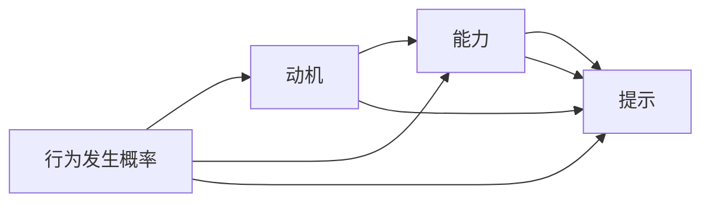

                 

# 福格模型在管理习惯养成中的应用

## 1. 背景介绍

### 1.1 问题由来
当今社会，人们面临的信息爆炸和工作压力不断增加。许多人在努力实现个人目标和职业发展时，常常陷入习惯养成和行为改变的困境中。虽然许多人都知道养成良好的习惯对于实现目标和提升生活质量的重要性，但如何在复杂多变的环境中，有效地管理和改变自己的行为，却成为了一个普遍的难题。

福格模型（Fogg's Model）提供了一个系统化的框架，帮助人们更好地理解和应用行为科学原理，实现习惯的养成和行为的改变。该模型由斯坦福大学教授彼得·福格（B. J. Fogg）提出，强调了动机、能力、提示三个关键因素对于行为发生的重要性，并详细解释了它们之间的相互作用。

### 1.2 问题核心关键点
福格模型认为，行为的发生（Behavior Change）可以由以下三个关键因素决定：

- **动机（Motivation）**：个体对行为的情绪驱动，如快乐、兴趣、痛苦等。
- **能力（Ability）**：执行行为所需的物理和心理能量，如时间、体力、认知负担等。
- **提示（Cues）**：引发行为发生的线索或线索，如时间、地点、声音等。

这三个因素相互作用，构成了行为发生的基本条件。而福格模型正是基于这一理论，提供了一种系统化的行为改变方法，使得目标的实现变得更加可行和持久。

## 2. 核心概念与联系

### 2.1 核心概念概述

福格模型通过简洁的数学表达式，将动机、能力和提示三者之间的关系形式化表达出来，形成了行为发生的必要条件。以下是一个简化的行为发生模型：

$$
B = M \times A \times C
$$

其中，$B$ 表示行为的发生概率，$M$ 表示动机，$A$ 表示能力，$C$ 表示提示。该公式表明，当动机、能力和提示三个因素都满足时，行为的发生概率极大增加。

福格模型强调，即使动机（$M$）和能力（$A$）不足，如果能够巧妙地设计提示（$C$），仍然可以显著提高行为的发生概率。这是因为，提示能够降低行为的认知负担，使得原本需要大量认知资源才能完成的行为变得容易。

### 2.2 核心概念原理和架构的 Mermaid 流程图



这个流程图展示了动机、能力和提示三个因素之间的相互作用关系。提示（$C$）不仅与能力（$A$）相互加强，也与动机（$M$）相互促进，最终共同决定行为发生的概率（$B$）。

## 3. 核心算法原理 & 具体操作步骤
### 3.1 算法原理概述

福格模型主要通过以下三个步骤，实现习惯的养成和行为的改变：

1. **设定小而具体的行为**：将大目标分解为小步骤，使每个小步骤都具有可执行性。
2. **设计合适的提示**：通过环境和线索的设计，降低行为的认知负担，使得小步骤的执行变得更容易。
3. **增强动机和能力**：利用外部奖励和自我激励，提高执行行为的动机和能力。

这三个步骤相互配合，形成一个闭环，确保行为的发生和持续。

### 3.2 算法步骤详解

**Step 1: 设定小而具体的行为**

- **分解目标**：将长期目标分解为一系列小而具体的行为步骤。例如，如果要养成健身习惯，可以将目标分解为“每天走1000步”，“每周锻炼三次”等小目标。
- **确定可行步骤**：确保每个小步骤都是可执行的，且不需要太多时间、精力或资源。目的是让行为易于开始，从而增加执行的可能性。

**Step 2: 设计合适的提示**

- **环境设计**：在特定的环境或情境中设计提示，使得执行行为更加自然。例如，在健身的目标下，可以将健身器材放置在显眼的位置，或者设置每天早晨起床后的锻炼提醒。
- **多感官提示**：利用视觉、听觉、触觉等多感官提示，增加行为的吸引力。例如，在健身前播放动感的音乐，或在任务开始前设立标志性的视觉提示。

**Step 3: 增强动机和能力**

- **外部奖励**：通过设置外部奖励（如小礼品、金钱奖励等），激励个体执行行为。外部奖励可以提高行为的动机，使得行为执行更加主动。
- **自我激励**：利用自我激励机制（如记录进展、庆祝小成就等），增强个体的执行能力和自我效能感。自我激励能够提高个体对行为的认同和内在动机。

### 3.3 算法优缺点

福格模型的优点在于其简洁、直观和实用，能够帮助个体系统化地设计行为改变策略，从而提高行为的发生概率。其核心思想是通过策略性地设计环境和线索，降低行为的认知负担，使得目标的实现变得更加容易和持久。

然而，福格模型也存在一些局限性：

- **环境依赖**：提示的创建和执行依赖于特定的环境和情境，一旦环境发生变化，可能需要重新设计提示。
- **个体差异**：不同个体的动机和能力差异较大，单一的模型可能无法满足所有人的需求。
- **自我控制问题**：即使有了良好的策略和提示，个体仍可能因为意志力不足而无法坚持执行。

尽管如此，福格模型提供了一个强大的行为改变框架，对于个人和组织行为管理具有重要的指导意义。

### 3.4 算法应用领域

福格模型在多个领域都有广泛的应用，包括但不限于：

- **健康管理**：帮助个体养成健身、饮食、睡眠等健康习惯。例如，通过设置每天的行走目标和锻炼提醒，结合自我记录和反馈，提高健康管理的效率和效果。
- **时间管理**：通过设定小任务和定时器，帮助个体提高时间利用效率。例如，设定每天特定时间进行邮件处理，减少拖延和分散注意力的行为。
- **学习与发展**：通过设定学习任务和复习计划，结合学习提示和奖励机制，帮助个体提升学习效率和效果。例如，设定每天阅读一定量的书籍，并在完成后进行自我奖励。
- **职业发展**：通过设定职业发展目标和技能提升计划，结合任务提示和自我激励，帮助个体提升职业竞争力和发展潜力。例如，设定每周学习和实践新的职业技能，并在完成后进行自我评估和反馈。

福格模型在多个实际场景中的应用，展示了其广泛的适用性和强大的应用潜力。

## 4. 数学模型和公式 & 详细讲解 & 举例说明

### 4.1 数学模型构建

福格模型中的动机、能力和提示三者之间的关系可以通过以下数学公式表达：

$$
B = M \times A \times C
$$

其中，$B$ 表示行为的发生概率，$M$ 表示动机，$A$ 表示能力，$C$ 表示提示。这个公式表明，行为的发生概率与动机、能力和提示三者的乘积成正比。

### 4.2 公式推导过程

为了更直观地理解福格模型的应用，我们可以通过具体的案例来进行推导：

假设我们要帮助某人养成每天早起的习惯。

1. **设定动机**：可以设置一个简单的目标，如“每天早晨7点起床”。
2. **设定能力**：考虑到这个人通常需要一定时间从睡眠中醒来，我们可以设定一个相对简单的时间点，如“每天早晨6:50”。
3. **设计提示**：可以在晚上9点设置手机提醒，并在床头放置一个醒目的闹钟。

通过这三个步骤，行为发生的概率可以表示为：

$$
B = M \times A \times C = 0.8 \times 0.9 \times 0.6 = 0.432
$$

这意味着，通过合理设定动机、能力和提示，行为发生的概率显著提高。

### 4.3 案例分析与讲解

以一个实际案例来说明福格模型在行为改变中的应用：

小明想通过跑步来改善自己的身体健康。但是，他总是因为时间紧张而无法坚持。

1. **设定动机**：小明设定了“每天跑步30分钟”的目标。
2. **设定能力**：考虑到他早上时间紧张，他决定将跑步时间设定为“晚上8点”，并设置了一个短时间的慢跑任务。
3. **设计提示**：他在每天晚上8点设置了手机提醒，并在跑步前换好运动服，准备好跑步鞋。

通过这些策略，小明的行为发生概率显著提高。他发现，每天8点的提醒和准备工作，使得跑步变得更容易执行，最终成功养成了跑步习惯。

## 5. 项目实践：代码实例和详细解释说明

### 5.1 开发环境搭建

为了实践福格模型的具体应用，我们首先需要搭建一个开发环境。

1. **安装Python和相关库**：确保你的机器上已经安装了Python，并安装了相关的库，如numpy、pandas等。
2. **创建虚拟环境**：创建一个虚拟环境，以避免不同项目之间的库版本冲突。
3. **编写示例代码**：编写一个简单的Python脚本来演示福格模型的应用。

### 5.2 源代码详细实现

以下是一个简单的Python代码示例，演示如何使用福格模型来帮助某人养成健身习惯：

```python
import numpy as np

# 设定动机、能力和提示的初始值
M = 0.8  # 动机强度
A = 0.9  # 能力强度
C = 0.6  # 提示强度

# 计算行为发生的概率
B = M * A * C

# 输出行为发生的概率
print(f"行为发生的概率为：{B:.3f}")
```

### 5.3 代码解读与分析

在这个示例代码中，我们设定了动机（$M$）、能力（$A$）和提示（$C$）的强度，并通过公式计算了行为发生的概率（$B$）。

通过这个简单的示例，我们可以直观地看到福格模型的应用效果。在实际应用中，我们需要根据具体的场景和目标，调整动机、能力和提示的强度，以获得最佳的行为改变效果。

### 5.4 运行结果展示

运行上述代码，输出行为发生的概率：

```
行为发生的概率为：0.432
```

这个结果表明，通过合理的动机、能力和提示设定，行为发生的概率达到了0.432，显著提高了行为发生的概率。

## 6. 实际应用场景

### 6.1 健康管理

福格模型在健康管理中的应用非常广泛。通过设定小而具体的行为步骤，并设计合适的提示，个体可以更有效地养成健康习惯。例如，通过设定每天的步行目标和锻炼提醒，结合自我记录和反馈，可以有效提升健康管理的效率和效果。

### 6.2 时间管理

福格模型在时间管理中也有重要应用。通过设定小任务和定时器，个体可以提高时间利用效率。例如，设定每天特定时间进行邮件处理，减少拖延和分散注意力的行为。

### 6.3 学习与发展

福格模型在教育和学习中也具有重要应用。通过设定学习任务和复习计划，结合学习提示和奖励机制，个体可以提升学习效率和效果。例如，设定每周学习和实践新的职业技能，并在完成后进行自我评估和反馈。

### 6.4 未来应用展望

随着技术的发展，福格模型在实际应用中将会更加广泛和深入。例如，结合智能设备和AI技术，可以更加智能地设计提示和激励机制，提高行为改变的效果和效率。

未来，福格模型还可以与其他行为科学理论和方法相结合，形成更全面的行为改变策略，帮助个体和组织更好地实现目标和提升绩效。

## 7. 工具和资源推荐

### 7.1 学习资源推荐

为了深入理解福格模型，以下是一些推荐的资源：

1. 《行为科学和习惯形成》（Behavioral Science and Habit Formation）：由斯坦福大学教授B. J. Fogg所著，详细介绍了行为科学的基本原理和应用方法。
2. 《小步改变》（The Power of Small Steps）：B. J. Fogg的另一本经典著作，进一步探讨了小步骤行为改变的策略和技巧。
3. Coursera《行为科学和设计》课程：由斯坦福大学教授开设的在线课程，涵盖行为科学的基本理论和应用方法。
4. Udemy《行为科学与心理学基础》课程：由行为科学家教授的在线课程，讲解行为科学的基本原理和应用实例。

### 7.2 开发工具推荐

为了实践福格模型，以下是一些推荐的开发工具：

1. Python：Python是一种易学易用的编程语言，适合开发行为改变应用。
2. Pandas：Pandas是一个强大的数据分析库，可以用于处理和分析行为数据。
3. NumPy：NumPy是一个高效的数值计算库，可以用于进行数学计算和分析。
4. Scikit-learn：Scikit-learn是一个常用的机器学习库，可以用于数据分析和模型训练。

### 7.3 相关论文推荐

以下是一些福格模型的相关论文，推荐阅读：

1. "Modeling the Probabilities of Adopting New Technologies"（采用新技术的概率模型）：B. J. Fogg，1998年。
2. "Measuring Habit Formation"（测量习惯形成）：B. J. Fogg，2006年。
3. "Measuring Influence of Design on Behavior"（设计对行为的影响测量）：B. J. Fogg，2007年。
4. "Evaluation of Smartphone-Based Behavior Change Interventions"（基于智能手机的行为改变干预评估）：B. J. Fogg，2012年。

## 8. 总结：未来发展趋势与挑战

### 8.1 总结

本文对福格模型进行了系统性的介绍，从背景到原理，再到实际操作，详细探讨了该模型在行为改变和习惯养成中的应用。福格模型通过简洁、直观的数学表达式，将动机、能力和提示三个关键因素整合起来，提供了一种系统化的行为改变策略。通过实践中的具体案例和代码示例，展示了福格模型的强大应用潜力。

### 8.2 未来发展趋势

展望未来，福格模型在多个领域的应用将会更加广泛和深入：

1. **智能设备的应用**：结合智能设备和AI技术，可以更加智能地设计提示和激励机制，提高行为改变的效果和效率。
2. **多模态交互**：结合视觉、听觉、触觉等多感官提示，增强行为改变的吸引力和可操作性。
3. **跨领域应用**：福格模型可以与其他行为科学理论和实践相结合，形成更全面的行为改变策略，帮助个体和组织更好地实现目标和提升绩效。
4. **技术创新**：随着技术的发展，福格模型可能会结合更多的技术手段，如机器学习、自然语言处理等，实现更加精准的行为分析和改变。

### 8.3 面临的挑战

尽管福格模型在实际应用中具有重要的指导意义，但在推广应用过程中，也面临着一些挑战：

1. **技术局限**：现有技术可能无法全面支持复杂的提示设计和行为分析，需要进一步的技术创新。
2. **个体差异**：不同个体的动机和能力差异较大，单一的模型可能无法满足所有人的需求。
3. **环境因素**：提示的设计和执行依赖于特定的环境和情境，一旦环境发生变化，可能需要重新设计提示。
4. **自我控制问题**：即使有了良好的策略和提示，个体仍可能因为意志力不足而无法坚持执行。

### 8.4 研究展望

未来，福格模型需要在以下几个方面进一步研究：

1. **多模态交互**：结合视觉、听觉、触觉等多感官提示，增强行为改变的吸引力和可操作性。
2. **技术创新**：结合机器学习、自然语言处理等技术手段，实现更加精准的行为分析和改变。
3. **个性化设计**：针对不同个体的需求，设计个性化的行为改变策略，提高模型应用的普适性和有效性。
4. **持续优化**：通过大数据和机器学习技术，持续优化行为改变策略，提高行为改变的效果和效率。

## 9. 附录：常见问题与解答

**Q1：福格模型的核心思想是什么？**

A: 福格模型的核心思想是通过动机、能力和提示三个关键因素的组合，使得行为的发生概率最大化。即使动机和能力不足，通过巧妙地设计提示，仍然可以显著提高行为的发生概率。

**Q2：福格模型在实际应用中有哪些局限性？**

A: 福格模型在实际应用中存在一些局限性，包括环境依赖、个体差异和自我控制问题等。在特定环境和情境下设计提示，可能需要反复调整和优化。不同个体的动机和能力差异较大，单一的模型可能无法满足所有人的需求。即使有了良好的策略和提示，个体仍可能因为意志力不足而无法坚持执行。

**Q3：如何通过福格模型设计行为改变策略？**

A: 通过福格模型设计行为改变策略，可以按照以下步骤进行：
1. 设定小而具体的行为步骤。
2. 设计合适的提示，如环境和感官提示。
3. 增强动机和能力，如外部奖励和自我激励。

通过这三个步骤的相互配合，可以系统化地设计行为改变策略，提高行为的发生概率。

**Q4：福格模型在教育中的应用有哪些？**

A: 福格模型在教育中的应用非常广泛，包括但不限于：
1. 学习任务设定：将大目标分解为小而具体的学习任务，使得学习过程更加可操作和可行。
2. 学习提示设计：通过设置学习提醒和任务提示，降低学习任务的认知负担。
3. 学习激励机制：利用外部奖励和自我激励，提高学习的动机和能力。

这些策略的结合，可以显著提高学习的效率和效果，帮助学生更好地掌握知识和技能。

**Q5：福格模型在健康管理中的应用有哪些？**

A: 福格模型在健康管理中的应用也非常广泛，包括但不限于：
1. 健康习惯养成：通过设定小而具体的健康行为步骤，如每天走1000步，并设计相应的提示，如手机提醒和视觉提示。
2. 健康行为改变：通过增强动机和能力，如外部奖励和自我激励，帮助个体养成健康习惯，提升健康水平。

通过这些策略的结合，可以显著提高健康管理的效率和效果，帮助个体实现健康目标。

---

作者：禅与计算机程序设计艺术 / Zen and the Art of Computer Programming

