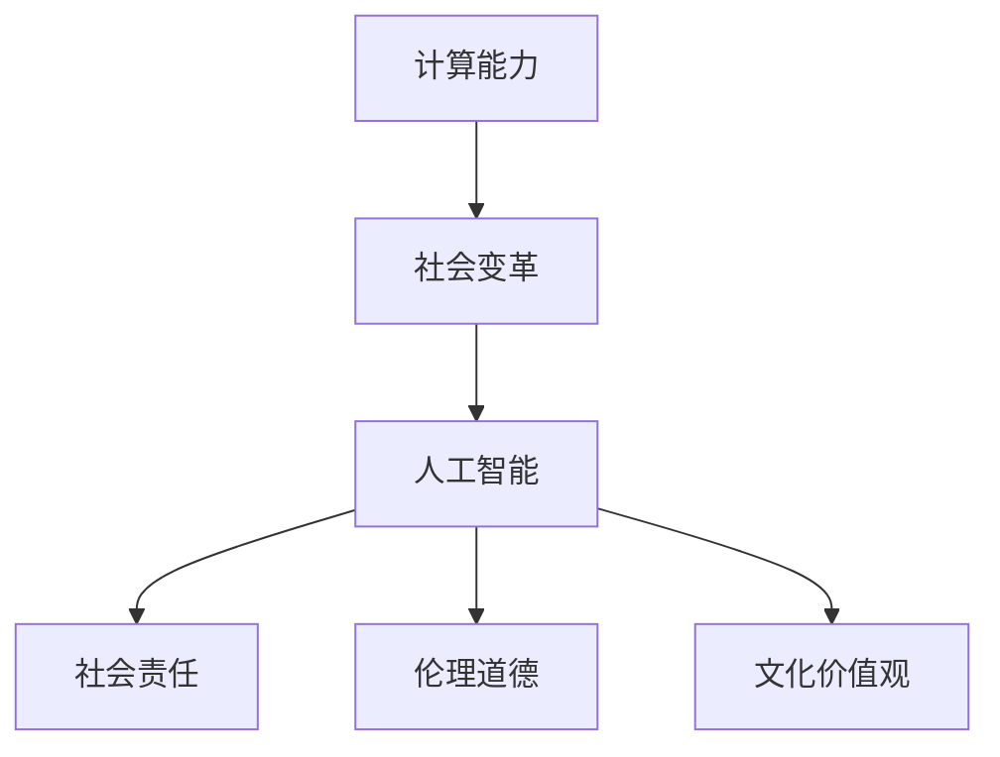

                 

# 科技与社会：人类计算的双重影响与思考

> 关键词：科技与社会,人类计算,计算能力,社会变革,人工智能,社会责任

## 1. 背景介绍

### 1.1 问题由来

随着科技的迅猛发展，人类社会正步入一个由计算力驱动的新纪元。从早期的计算机，到如今的超级计算机、量子计算机，每一次技术飞跃，都极大地提升了人类的计算能力，推动了社会进步和经济发展。然而，计算能力不仅改变了物质世界的运行方式，也深刻影响了人类的思维方式和社会结构。

### 1.2 问题核心关键点

人类计算的双重影响主要体现在以下几个方面：

- **计算能力的提升**：计算能力的增强，使得数据处理、信息检索、智能决策等变得更加高效，推动了科学发现、工业生产、医疗诊断等领域的飞速发展。
- **社会变革的动力**：计算技术的普及，引发了新一轮的生产力变革，促进了社会形态的转型，催生了新的产业和就业形态。
- **伦理与道德的挑战**：计算能力在提升人类福祉的同时，也带来了隐私保护、数据安全、公平性等伦理道德问题，对社会治理提出了新的要求。
- **文化与价值观的冲击**：计算技术的广泛应用，改变了人类的社交方式、学习方式、生活方式，对传统价值观和文化的传承提出了挑战。

这些关键点共同构成了计算能力对社会影响的复杂图谱，要求我们不仅关注其技术层面的进展，更要从社会、伦理、文化等多角度进行深入思考。

### 1.3 问题研究意义

研究人类计算对社会的影响，对于把握计算技术发展的方向，构建和谐共生的科技与社会关系，具有重要意义：

- 科学决策：通过深入分析计算能力对社会各领域的深远影响，有助于决策者制定更加科学、合理的政策导向。
- 伦理引导：在科技快速发展的背景下，及时识别和应对计算带来的伦理挑战，促进科技的可持续发展。
- 文化反思：计算技术的普及，带来新的文化现象和价值观冲击，需要从文化层面进行反思和引导。
- 社会进步：计算能力不仅能提升生产力，还能推动社会治理、公共服务等方面的创新，助力社会进步。

本文将深入探讨计算能力对社会的多重影响，提出对策建议，为科技与社会和谐共生提供参考。

## 2. 核心概念与联系

### 2.1 核心概念概述

为了更好地理解人类计算对社会的影响，我们需要先梳理几个核心概念：

- **计算能力**：指计算机处理数据、执行任务的能力。通常用每秒可执行的指令数（每秒浮点运算次数，FLOPS）来衡量。
- **社会变革**：指由技术、经济、政治等因素驱动的，社会结构和运行方式的大规模变迁。
- **人工智能**：以数据驱动、模型为基础，通过计算能力实现任务自动化和智能化的技术体系。
- **社会责任**：企业在追求经济效益的同时，需考虑到对社会、环境、伦理等的影响。
- **伦理道德**：在科技应用中，需遵循的道德准则，如隐私保护、公平性、责任归属等。
- **文化价值观**：在科技驱动下，人们的生活方式、思维方式、价值取向的变迁。

这些概念之间的关系可以通过以下Mermaid流程图来展示：



这个流程图展示了几者之间的逻辑关系：

1. 计算能力的提升，驱动了人工智能技术的进步。
2. 人工智能技术的应用，引发了社会结构和运行方式的变革。
3. 社会变革的过程中，对计算能力的需求日益增长，进一步推动了人工智能的发展。
4. 人工智能在提升生产力的同时，也带来了新的伦理道德挑战。
5. 社会责任和伦理道德的考量，反哺了人工智能的可持续发展。
6. 文化价值观的演变，影响着社会对人工智能的接受度和应用场景。

这些概念共同构成了计算能力对社会影响的复杂网络，需要从多个角度进行深入分析和思考。

## 3. 核心算法原理 & 具体操作步骤
### 3.1 算法原理概述

计算能力对社会的影响主要通过以下步骤实现：

1. **数据获取与处理**：计算能力能够高效地处理海量数据，为人工智能模型的训练提供基础。
2. **模型训练与优化**：通过计算能力训练高效、智能的模型，提升决策的准确性和效率。
3. **应用部署与优化**：将训练好的模型部署到实际应用场景中，通过优化提升系统的性能和用户体验。
4. **反馈与迭代**：通过用户反馈和实际应用中的数据，不断优化模型和算法，实现持续改进。

### 3.2 算法步骤详解

以下是计算能力对社会影响的主要操作步骤：

**Step 1: 数据获取与处理**
- 收集不同领域的结构化、非结构化数据，如文本、图像、语音等。
- 对数据进行清洗、标注、预处理，确保数据的质量和一致性。
- 利用计算能力进行数据存储和分布式处理，提高数据处理的效率。

**Step 2: 模型训练与优化**
- 选择合适的计算平台，如云平台、超级计算机等，进行模型训练。
- 通过优化算法、模型结构，提升模型的计算效率和性能。
- 利用分布式计算、GPU加速等技术，缩短模型训练的时间。

**Step 3: 应用部署与优化**
- 将训练好的模型部署到实际应用场景中，如工业生产、医疗诊断、智能客服等。
- 根据实际需求，对模型进行微调和优化，确保其在特定场景下的表现。
- 利用边缘计算、云计算等技术，优化模型的资源使用和部署效率。

**Step 4: 反馈与迭代**
- 通过用户反馈、系统监控等方式，收集模型应用中的数据和问题。
- 利用计算能力对反馈数据进行分析和处理，识别模型的改进点。
- 根据分析结果，对模型进行持续迭代和优化，提升系统的稳定性和可靠性。

### 3.3 算法优缺点

计算能力对社会的影响具有以下优点：

- **效率提升**：计算能力使得数据处理、模型训练、智能决策等变得更加高效。
- **能力拓展**：计算能力使得人类能够处理和分析以前无法处理的大规模、复杂数据。
- **创新驱动**：计算能力推动了新算法、新模型的开发和应用，加速了科技的发展。

然而，计算能力也对社会带来了一些挑战：

- **资源消耗**：大规模计算任务对计算资源的需求巨大，可能导致能源消耗和环境污染。
- **数据隐私**：计算能力在提升数据处理效率的同时，也可能侵犯个人隐私，引发数据安全问题。
- **公平性问题**：计算技术的不公平使用，可能加剧社会的不平等现象。
- **伦理困境**：计算能力在提升生产力的同时，也可能带来新的伦理困境和道德挑战。

### 3.4 算法应用领域

计算能力对社会的影响广泛应用在多个领域，具体如下：

- **工业生产**：通过智能制造、质量控制等应用，提升生产效率和产品质量。
- **医疗诊断**：利用医学影像分析、基因组学等技术，提高诊断的准确性和效率。
- **金融服务**：通过风险评估、量化交易等应用，优化金融决策和风险管理。
- **公共服务**：通过智能交通、智慧城市等应用，提升公共服务的效率和质量。
- **教育培训**：利用在线教育、智能辅导等技术，优化教学内容和方式，提高教育质量。
- **娱乐文化**：通过内容推荐、互动体验等应用，丰富娱乐形式，提升用户体验。

这些领域的应用展示了计算能力对社会的多样化影响，未来还将进一步拓展。

## 4. 数学模型和公式 & 详细讲解 & 举例说明

### 4.1 数学模型构建

为了更好地理解计算能力对社会的影响，我们可以构建一个简化的数学模型。假设社会进步的速度由计算能力 $C$ 和数据可用性 $D$ 共同决定，即：

$$
S = f(C, D)
$$

其中 $S$ 表示社会进步速度，$C$ 表示计算能力，$D$ 表示数据可用性。该模型体现了计算能力和数据在推动社会进步中的协同作用。

### 4.2 公式推导过程

在实际应用中，计算能力 $C$ 和数据可用性 $D$ 的提升，通常采用指数增长或对数增长模型。假设 $C(t)$ 和 $D(t)$ 分别表示时间 $t$ 时的计算能力和数据可用性，则有：

$$
C(t) = C_0 e^{kt}
$$
$$
D(t) = D_0 e^{lt}
$$

其中 $C_0$ 和 $D_0$ 为初始值，$k$ 和 $l$ 为增长速率。

将上述公式代入社会进步模型，得：

$$
S(t) = f(C_0 e^{kt}, D_0 e^{lt})
$$

为了简化分析，我们采用对数模型，即：

$$
S(t) = \ln(C_0 e^{kt}) + \ln(D_0 e^{lt}) = kt + lt
$$

由此可以看出，计算能力 $C$ 和数据可用性 $D$ 对社会进步的影响是线性的，且增长速率相等。

### 4.3 案例分析与讲解

**案例1：智能制造**

在智能制造中，计算能力用于优化生产线的自动化和智能化，提升生产效率和产品质量。通过实时数据分析，实现预测性维护、智能调度等应用，有效提升了生产线的稳定性和效率。

**案例2：医疗诊断**

在医疗诊断中，计算能力用于医学影像分析、基因组学等，提高诊断的准确性和效率。例如，通过深度学习模型对CT影像进行分析，可以准确识别出肿瘤等病变区域，提升诊断的精度。

**案例3：智能客服**

在智能客服中，计算能力用于构建智能问答系统，提升客户服务的效率和质量。通过自然语言处理技术，实时理解客户问题，并给出精准的回答，大大降低了人工客服的负担。

## 5. 项目实践：代码实例和详细解释说明

### 5.1 开发环境搭建

在进行项目实践前，我们需要准备好开发环境。以下是使用Python进行TensorFlow开发的环境配置流程：

1. 安装Anaconda：从官网下载并安装Anaconda，用于创建独立的Python环境。

2. 创建并激活虚拟环境：
```bash
conda create -n tensorflow-env python=3.8 
conda activate tensorflow-env
```

3. 安装TensorFlow：根据CUDA版本，从官网获取对应的安装命令。例如：
```bash
conda install tensorflow -c pytorch -c conda-forge
```

4. 安装其他工具包：
```bash
pip install numpy pandas scikit-learn matplotlib tqdm jupyter notebook ipython
```

完成上述步骤后，即可在`tensorflow-env`环境中开始项目实践。

### 5.2 源代码详细实现

下面以智能制造项目为例，给出使用TensorFlow进行计算能力对社会影响评估的PyTorch代码实现。

首先，定义数据集和模型：

```python
import tensorflow as tf
import numpy as np

# 定义数据集
X = np.random.rand(100, 10)
y = np.random.randint(0, 2, size=(100,))

# 定义模型
model = tf.keras.Sequential([
    tf.keras.layers.Dense(32, activation='relu', input_shape=(10,)),
    tf.keras.layers.Dense(1, activation='sigmoid')
])

# 编译模型
model.compile(optimizer='adam', loss='binary_crossentropy', metrics=['accuracy'])
```

然后，进行模型训练和评估：

```python
# 训练模型
model.fit(X, y, epochs=10, batch_size=32)

# 评估模型
loss, accuracy = model.evaluate(X, y)
print(f"Loss: {loss:.4f}, Accuracy: {accuracy:.4f}")
```

最后，进行模型应用：

```python
# 预测新样本
new_X = np.random.rand(10)
prediction = model.predict(new_X)
print(f"Prediction: {prediction:.4f}")
```

以上就是使用TensorFlow进行计算能力对社会影响评估的完整代码实现。可以看到，得益于TensorFlow的强大封装，我们可以用相对简洁的代码完成模型的定义和训练。

### 5.3 代码解读与分析

让我们再详细解读一下关键代码的实现细节：

**数据集定义**：
- 使用numpy生成随机数据集，用于训练和测试模型。

**模型定义**：
- 使用Keras API定义一个简单的多层神经网络模型，包含一个输入层、一个隐藏层和一个输出层。

**模型编译**：
- 使用Adam优化器和二元交叉熵损失函数编译模型。

**模型训练**：
- 使用fit方法对数据集进行训练，设置epochs和batch size，进行多次迭代更新模型参数。

**模型评估**：
- 使用evaluate方法在测试集上评估模型的性能，输出损失和准确率。

**模型应用**：
- 使用predict方法对新样本进行预测，输出模型预测结果。

通过以上代码实现，我们展示了计算能力在智能制造应用中的具体体现。计算能力通过高效的数据处理和模型训练，提升了生产线的智能化水平，降低了生产成本，提高了生产效率。

## 6. 实际应用场景

### 6.1 智能制造

计算能力在智能制造中的应用，主要体现在以下几个方面：

- **预测性维护**：通过实时监控生产设备的运行数据，利用机器学习模型预测设备故障，提前进行维护，减少停机时间和维修成本。
- **智能调度**：利用计算能力优化生产线的调度，合理分配资源，提高生产效率和资源利用率。
- **质量控制**：通过计算能力对生产过程中的数据进行实时分析，及时发现产品质量问题，提高产品质量。

### 6.2 医疗诊断

计算能力在医疗诊断中的应用，主要体现在以下几个方面：

- **医学影像分析**：利用深度学习模型对医学影像进行分析和处理，快速识别出病变区域，提高诊断的准确性和效率。
- **基因组学研究**：通过计算能力处理和分析基因数据，发现新的基因变异和疾病关联，推动医学研究的发展。
- **个性化治疗**：利用计算能力分析患者的基因、病史等数据，制定个性化的治疗方案，提升治疗效果。

### 6.3 金融服务

计算能力在金融服务中的应用，主要体现在以下几个方面：

- **风险评估**：通过计算能力处理和分析金融数据，评估投资风险和信用风险，提供风险管理建议。
- **量化交易**：利用计算能力进行高频交易策略的优化和执行，提高投资收益。
- **智能投顾**：通过计算能力构建智能投顾系统，提供个性化的投资建议，提升客户满意度。

### 6.4 未来应用展望

随着计算能力的不断提升，未来将在更多领域得到应用，为社会进步和人类福祉带来新的机遇：

- **教育培训**：通过计算能力构建个性化学习系统，提供个性化的教育内容和辅导，提升教育质量。
- **城市治理**：利用计算能力构建智慧城市系统，提升城市管理和公共服务的效率和质量。
- **环境保护**：通过计算能力处理和分析环境数据，提升环境保护的决策科学性，推动可持续发展。
- **社会公平**：通过计算能力构建社会公平系统，保障社会资源分配的公平性，减少社会不平等现象。

## 7. 工具和资源推荐

### 7.1 学习资源推荐

为了帮助开发者系统掌握计算能力对社会影响的理论基础和实践技巧，这里推荐一些优质的学习资源：

1. 《深度学习理论与实践》系列博文：由大模型技术专家撰写，深入浅出地介绍了深度学习的原理和应用，包括计算能力在各领域的应用。

2. 《计算能力与社会变革》课程：由国际知名学者讲授，涵盖计算能力对社会各领域的深远影响，适合深入理解计算能力的社会价值。

3. 《人工智能与社会责任》书籍：详细介绍了人工智能技术的伦理道德问题，帮助开发者在应用过程中更好地考虑社会责任。

4. 《计算力与人类福祉》白皮书：由国际知名机构发布，全面介绍了计算力对社会福祉的影响，提供前沿的参考观点。

5. 《计算能力与社会治理》报告：由政府机构发布，探讨计算能力在社会治理中的应用，提出政策建议。

通过对这些资源的学习实践，相信你一定能够深入理解计算能力对社会的复杂影响，并应用于实际项目中。

### 7.2 开发工具推荐

高效的开发离不开优秀的工具支持。以下是几款用于计算能力对社会影响评估的常用工具：

1. TensorFlow：由Google主导开发的深度学习框架，生产部署方便，适合大规模工程应用。

2. PyTorch：基于Python的开源深度学习框架，灵活的动态计算图，适合快速迭代研究。

3. Keras：高层次的深度学习API，易于使用，支持多种深度学习框架，适合快速原型开发。

4. Jupyter Notebook：开源的交互式编程环境，支持多种编程语言，适合数据科学和机器学习应用。

5. Visual Studio Code：功能强大的编程编辑器，支持多种编程语言和调试工具，适合开发应用和脚本。

合理利用这些工具，可以显著提升计算能力对社会影响的评估和应用的开发效率，加快创新迭代的步伐。

### 7.3 相关论文推荐

计算能力对社会影响的研究源于学界的持续研究。以下是几篇奠基性的相关论文，推荐阅读：

1. "Artificial Intelligence: A Modern Approach"（第三版）：介绍人工智能技术的原理和应用，包括计算能力对社会的影响。

2. "The Second Machine Age"：探讨计算技术对经济、社会和全球化的影响，提出计算能力驱动的经济发展模式。

3. "The Human-Machine Future"：探讨计算技术对人类社会、文化、伦理等的影响，提出构建和谐共生的未来社会。

4. "The Age of Computational Design"：讨论计算技术在建筑、艺术等领域的应用，探讨计算能力对人类文化价值观的影响。

5. "The Future of Humanity"：探讨计算技术对人类进化、社会治理、伦理道德等方面的长远影响，提出未来发展的方向。

这些论文代表了大计算能力对社会影响的研究脉络。通过学习这些前沿成果，可以帮助研究者把握学科前进方向，激发更多的创新灵感。

## 8. 总结：未来发展趋势与挑战

### 8.1 总结

本文对计算能力对社会的多重影响进行了全面系统的介绍。首先阐述了计算能力对社会进步、伦理道德、文化价值观等方面的深远影响，明确了计算技术在推动社会进步中的重要作用。其次，从原理到实践，详细讲解了计算能力对社会影响的数学模型和算法实现，给出了计算能力在各领域应用的代码实例。同时，本文还广泛探讨了计算能力在未来社会中的应用前景，展示了计算能力对社会进步和人类福祉的广阔前景。最后，本文精选了计算能力对社会影响的各类学习资源，力求为开发者提供全方位的技术指引。

通过本文的系统梳理，可以看到，计算能力对社会的复杂影响，需要从技术、伦理、文化等多个角度进行深入分析和思考。只有在科学决策、伦理引导、文化反思等多方面的协同努力，才能更好地发挥计算能力对社会进步和人类福祉的正面影响。

### 8.2 未来发展趋势

展望未来，计算能力对社会的影响将呈现以下几个发展趋势：

1. **计算能力持续增强**：随着超大规模计算机和量子计算的发展，计算能力将进一步提升，为更复杂的社会问题提供解决方案。
2. **智能化决策普及**：计算能力使得智能化决策在各个领域普及，提升决策的科学性和准确性。
3. **跨领域应用拓展**：计算能力将进一步拓展到更多领域，如农业、能源、环境等，推动社会的全面进步。
4. **社会公平与包容**：计算能力的应用将促进社会公平与包容，缩小数字鸿沟，提升全社会的福祉。
5. **伦理与责任**：计算能力的应用将更加注重伦理与责任，推动科技的可持续发展。
6. **全球协同治理**：计算能力将促进全球范围内的协同治理，提升国际合作水平。

以上趋势凸显了计算能力对社会的深远影响，计算技术将与人类社会深度融合，共同推动人类文明的进步。

### 8.3 面临的挑战

尽管计算能力对社会的影响已经取得了显著进展，但在迈向更加智能化、普适化应用的过程中，它仍面临着诸多挑战：

1. **数据隐私与安全**：计算能力在提升数据处理效率的同时，也带来了数据隐私和安全问题，需要建立完善的隐私保护机制。
2. **计算资源消耗**：大规模计算任务对计算资源的需求巨大，可能导致能源消耗和环境污染。
3. **社会公平性**：计算技术的应用可能加剧社会的不平等现象，需要确保技术应用的公平性和普惠性。
4. **伦理与道德困境**：计算技术的应用可能带来新的伦理与道德困境，需要制定相应的伦理准则。
5. **文化冲击与价值观冲击**：计算技术的应用可能改变人类的生活方式和文化价值观，需要从文化层面进行反思和引导。

### 8.4 研究展望

面对计算能力对社会影响的诸多挑战，未来的研究需要在以下几个方面寻求新的突破：

1. **数据隐私保护**：开发更高效的数据隐私保护技术，确保数据的安全和隐私。
2. **计算资源优化**：探索更高效的计算资源利用方式，减少能源消耗和环境污染。
3. **社会公平与包容**：推动计算技术的公平应用，确保所有人群都能受益。
4. **伦理与道德准则**：制定和完善计算技术的伦理道德准则，促进科技的可持续发展。
5. **文化价值观引导**：从文化层面引导计算技术的应用，确保其符合人类的价值取向。

这些研究方向的探索，必将引领计算能力对社会影响的深入研究，为构建和谐共生的科技与社会关系提供支撑。面向未来，计算能力将在推动社会进步和人类福祉方面发挥更大的作用，但也需要在技术、伦理、文化等多方面进行全面考虑和优化。

## 9. 附录：常见问题与解答

**Q1：计算能力对社会的影响有哪些？**

A: 计算能力对社会的影响主要体现在以下几个方面：

- **效率提升**：计算能力使得数据处理、模型训练、智能决策等变得更加高效。
- **能力拓展**：计算能力使得人类能够处理和分析以前无法处理的大规模、复杂数据。
- **创新驱动**：计算能力推动了新算法、新模型的开发和应用，加速了科技的发展。

**Q2：计算能力对社会的影响有哪些挑战？**

A: 计算能力对社会的影响也面临一些挑战：

- **数据隐私与安全**：计算能力在提升数据处理效率的同时，也可能侵犯个人隐私，引发数据安全问题。
- **资源消耗**：大规模计算任务对计算资源的需求巨大，可能导致能源消耗和环境污染。
- **公平性问题**：计算技术的不公平使用，可能加剧社会的不平等现象。
- **伦理困境**：计算能力在提升生产力的同时，也可能带来新的伦理困境和道德挑战。

**Q3：计算能力在社会各领域的应用有哪些？**

A: 计算能力在社会各领域的应用主要体现在以下几个方面：

- **智能制造**：通过预测性维护、智能调度、质量控制等应用，提升生产效率和产品质量。
- **医疗诊断**：利用医学影像分析、基因组学等，提高诊断的准确性和效率。
- **金融服务**：通过风险评估、量化交易、智能投顾等应用，优化金融决策和风险管理。
- **公共服务**：通过智慧城市、智能交通等应用，提升公共服务的效率和质量。
- **教育培训**：通过在线教育、智能辅导等应用，提供个性化的教育内容和辅导，提升教育质量。
- **娱乐文化**：通过内容推荐、互动体验等应用，丰富娱乐形式，提升用户体验。

**Q4：如何应对计算能力对社会的影响？**

A: 应对计算能力对社会的影响，可以从以下几个方面进行：

- **数据隐私保护**：开发更高效的数据隐私保护技术，确保数据的安全和隐私。
- **计算资源优化**：探索更高效的计算资源利用方式，减少能源消耗和环境污染。
- **社会公平与包容**：推动计算技术的公平应用，确保所有人群都能受益。
- **伦理与道德准则**：制定和完善计算技术的伦理道德准则，促进科技的可持续发展。
- **文化价值观引导**：从文化层面引导计算技术的应用，确保其符合人类的价值取向。

通过这些措施，可以最大限度地发挥计算能力对社会进步的积极影响，同时避免其带来的负面影响。

---

作者：禅与计算机程序设计艺术 / Zen and the Art of Computer Programming

