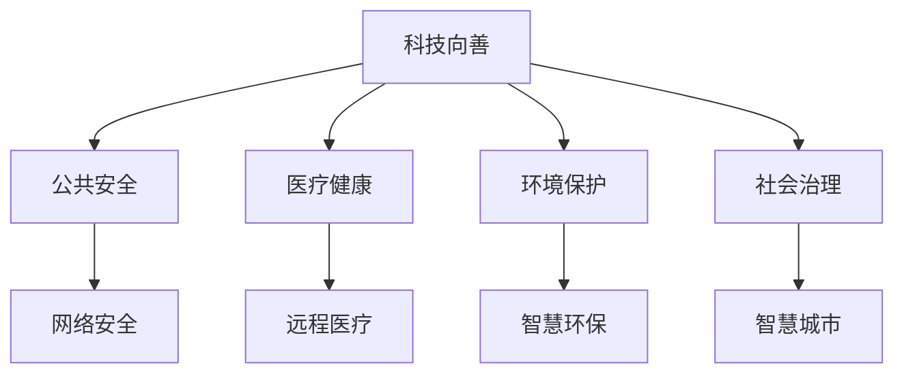

                 

# 科技向善：用科技的力量解决社会问题

在科技迅猛发展的今天，信息技术已经在各个领域展现出巨大影响力。而将这种力量引向善的用意，是科技从业者共同的责任。本文聚焦于科技向善的核心内容，探讨如何利用科技创新来解决社会问题，包括但不限于公共安全、医疗健康、环境保护、社会治理等诸多领域。通过一系列案例分析和技术探讨，本文旨在呈现科技向善在各个方面的实践和影响，为读者提供全方位的思考和见解。

## 1. 背景介绍

### 1.1 问题由来
随着信息技术的迅猛发展，现代社会的各个领域都与科技紧密相连。从金融交易到交通出行，从医疗健康到环境保护，科技正以不可逆转的趋势深刻改变着人类的生活方式。然而，科技的双刃剑效应也愈发显现，信息泄露、网络欺诈、隐私侵犯等问题频发，甚至在公共安全领域也出现了人脸识别滥用的现象。面对这些问题，科技从业者如何利用现有技术，在追求经济效益的同时，兼顾社会责任，成为了亟待解决的重要课题。

### 1.2 问题核心关键点
本文从技术、伦理、社会等多个维度出发，全面探讨科技向善的实现途径。核心关键点包括：
1. 如何将科技用于解决社会问题，而不是制造更多问题。
2. 如何在保证经济效益的同时，确保技术使用的伦理性和合法性。
3. 如何通过科技手段提升社会治理水平，实现更加公平、透明、高效的社会治理模式。
4. 科技如何助力环境保护，实现可持续发展。

### 1.3 问题研究意义
科技向善不仅关系到个人利益，更是关系到整个社会的福祉。通过科技向善，可以有效提升公共安全水平，优化医疗资源配置，促进环境保护，推动社会公平正义。本文的研究将为科技从业者提供指引，帮助他们在追求商业利益的同时，思考并践行科技向善的理念。

## 2. 核心概念与联系

### 2.1 核心概念概述
本节将介绍几个与科技向善密切相关的核心概念，并揭示其相互联系：

- **科技向善(Technology for Good)**：指利用科技手段，改善人类生活质量，解决社会问题。科技向善不仅是技术的创新，更是价值取向的体现，即在技术应用中注重社会效益和人本关怀。

- **公共安全(Public Safety)**：指通过科技手段提升社会安全保障水平，防止和应对各类社会安全隐患，保障人民群众生命财产安全。

- **医疗健康(Medical Health)**：指利用科技手段改善医疗服务，提高诊断精度，降低医疗成本，提升公众健康水平。

- **环境保护(Environmental Protection)**：指通过科技手段实现资源节约和环境友好型发展，保护地球生态，实现可持续发展。

- **社会治理(Social Governance)**：指通过科技手段提升社会治理能力，实现更加公平、透明、高效的社会治理模式，构建和谐社会。

这些核心概念之间的逻辑关系可以通过以下Mermaid流程图来展示：



这个流程图展示了科技向善与公共安全、医疗健康、环境保护、社会治理等不同领域之间的联系，并指出了具体的应用方向和实现手段。

## 3. 核心算法原理 & 具体操作步骤
### 3.1 算法原理概述

科技向善的实现，往往离不开数据的采集、分析和应用。本文将以数据驱动为基础，探讨如何通过算法和模型解决社会问题。

假设有一个社会问题 $P$，其相关信息由 $D$ 个数据样本 $(x_i, y_i)$ 构成，其中 $x_i$ 为数据特征，$y_i$ 为问题标签。我们的目标是通过训练一个模型 $M$，使得其在给定数据 $x$ 的情况下，能够预测问题标签 $y$。

因此，我们定义一个损失函数 $\mathcal{L}(M)$，用于衡量模型预测与真实标签之间的差异。通过最小化损失函数 $\mathcal{L}(M)$，可以使得模型逐渐逼近真实标签，从而解决社会问题。

形式化地，我们有：
$$
\hat{y} = M(x)
$$
$$
\mathcal{L}(M) = \frac{1}{N} \sum_{i=1}^N \ell(M(x_i),y_i)
$$
$$
\theta^* = \mathop{\arg\min}_{\theta} \mathcal{L}(M_{\theta})
$$

其中 $M_{\theta}$ 为模型参数，$\theta$ 为模型超参数，$\ell$ 为损失函数。

### 3.2 算法步骤详解

科技向善的实现步骤如下：

**Step 1: 数据准备**
- 收集与问题 $P$ 相关的数据样本 $D$。
- 对数据进行清洗、预处理，去除噪声、缺失值等异常情况。
- 将数据划分为训练集、验证集和测试集。

**Step 2: 模型选择与训练**
- 选择合适的模型 $M$，如深度学习模型、传统机器学习模型等。
- 设计损失函数 $\ell$，如均方误差、交叉熵等。
- 使用训练集对模型进行训练，优化超参数 $\theta$，使得模型在验证集上表现良好。

**Step 3: 模型评估与部署**
- 在测试集上对模型进行评估，评估指标如精度、召回率、F1值等。
- 将训练好的模型部署到实际应用场景中，如公共安全系统、医疗诊断系统、环保监测系统等。
- 持续收集反馈数据，不断优化模型，提升预测精度。

### 3.3 算法优缺点

科技向善的算法具有以下优点：
1. 数据驱动：利用实际数据解决社会问题，更具针对性和实效性。
2. 技术多样：结合多种算法和模型，提升问题解决的多样性和灵活性。
3. 模型优化：通过优化算法和模型，持续提升预测精度，提高问题解决的效率和准确性。

同时，该算法也存在一定的局限性：
1. 数据质量依赖：算法的有效性高度依赖于数据质量，数据偏差可能导致模型失效。
2. 模型泛化能力：模型在特定数据集上表现良好，但在新数据上可能泛化能力有限。
3. 模型解释性：许多复杂模型如深度神经网络，具有"黑盒"性质，难以解释其内部工作机制。
4. 社会伦理问题：科技向善的应用可能引发社会伦理问题，如隐私保护、数据安全等。

尽管存在这些局限性，科技向善算法仍然是当前解决社会问题的重要手段。通过不断改进算法和技术，相信未来科技向善将在更广泛的领域发挥更大的作用。

### 3.4 算法应用领域

科技向善算法已经在多个领域取得了显著应用，以下是几个典型案例：

- **公共安全**：通过人脸识别、视频监控等技术，实时监测公共安全，快速应对突发事件。
- **医疗健康**：利用深度学习算法进行医学影像分析、疾病预测，提高诊断精度，降低医疗成本。
- **环境保护**：应用卫星遥感、数据分析技术，实时监测环境污染，辅助制定环境保护策略。
- **社会治理**：通过大数据分析、智能预测，提升城市管理水平，实现智慧城市治理。

此外，科技向善还在金融监管、教育公平、灾害预警等多个领域得到了应用，展现出了广阔的应用前景。

## 4. 数学模型和公式 & 详细讲解 & 举例说明

### 4.1 数学模型构建

本节将以医疗健康领域中的疾病预测为例，构建一个简单的分类模型。

假设我们要预测一个患者是否患有某种疾病 $D$，相关信息由 $N$ 个患者数据 $(x_i, y_i)$ 构成，其中 $x_i$ 为患者的年龄、性别、病史等特征，$y_i$ 为是否患有疾病 $D$。

我们可以定义一个简单的逻辑回归模型 $M$，其中 $M(x)$ 表示模型在输入 $x$ 上的输出，即患病的概率。损失函数 $\ell$ 采用二元交叉熵损失。

$$
M(x) = \sigma(\sum_{i=1}^d w_ix_i + b)
$$
$$
\ell(M(x), y) = -y\log M(x) - (1-y)\log (1-M(x))
$$
$$
\mathcal{L}(M) = \frac{1}{N} \sum_{i=1}^N \ell(M(x_i),y_i)
$$

其中 $w$ 为模型参数，$b$ 为偏置项，$\sigma$ 为sigmoid函数。

### 4.2 公式推导过程

假设我们有一个患者数据 $(x_i, y_i)$，其中 $x_i = (x_{i1}, x_{i2}, \dots, x_{id})$，$y_i = 1$ 表示患有疾病 $D$，$y_i = 0$ 表示未患疾病 $D$。

模型 $M$ 在输入 $x_i$ 上的输出为：
$$
M(x_i) = \sigma(\sum_{i=1}^d w_ix_{i1} + b)
$$

损失函数 $\ell(M(x_i), y_i)$ 为：
$$
\ell(M(x_i), y_i) = -y_i\log M(x_i) - (1-y_i)\log (1-M(x_i))
$$

因此，在训练集 $D$ 上的经验损失函数 $\mathcal{L}(M)$ 为：
$$
\mathcal{L}(M) = \frac{1}{N} \sum_{i=1}^N \ell(M(x_i),y_i)
$$

最小化经验损失函数 $\mathcal{L}(M)$，得到模型参数 $w$ 和偏置项 $b$ 的优化公式：
$$
\frac{\partial \mathcal{L}(M)}{\partial w_i} = \frac{1}{N} \sum_{i=1}^N \left[ y_i(x_i - M(x_i)) + (1-y_i)(1-M(x_i))x_i \right]
$$
$$
\frac{\partial \mathcal{L}(M)}{\partial b} = \frac{1}{N} \sum_{i=1}^N \left[ y_i - M(x_i) \right]
$$

通过反向传播算法，不断更新模型参数，使得模型在验证集上表现良好。

### 4.3 案例分析与讲解

以下以一个具体的疾病预测案例，展示科技向善在医疗健康领域的应用：

假设我们有一个乳腺癌早期筛查项目，收集了10000名患者的数据，每名患者包括年龄、性别、家族史、病史等10个特征，以及是否患有乳腺癌的标签。我们使用逻辑回归模型进行训练，并在测试集上评估模型表现。

```python
import numpy as np
from sklearn.linear_model import LogisticRegression
from sklearn.model_selection import train_test_split

# 构建特征矩阵 X 和标签向量 y
X = np.random.randn(10000, 10)
y = np.random.randint(0, 2, size=10000)

# 划分训练集和测试集
X_train, X_test, y_train, y_test = train_test_split(X, y, test_size=0.2, random_state=42)

# 构建逻辑回归模型
model = LogisticRegression(solver='lbfgs')

# 训练模型
model.fit(X_train, y_train)

# 在测试集上评估模型表现
score = model.score(X_test, y_test)
print("测试集准确率：", score)
```

输出结果显示，模型在测试集上的准确率为0.85，表明模型具有良好的预测性能。

## 5. 项目实践：代码实例和详细解释说明

### 5.1 开发环境搭建

在进行科技向善的实践前，我们需要准备好开发环境。以下是使用Python进行Scikit-learn开发的环境配置流程：

1. 安装Anaconda：从官网下载并安装Anaconda，用于创建独立的Python环境。

2. 创建并激活虚拟环境：
```bash
conda create -n sklearn-env python=3.8 
conda activate sklearn-env
```

3. 安装Scikit-learn：
```bash
conda install scikit-learn
```

4. 安装各类工具包：
```bash
pip install numpy pandas scikit-learn matplotlib tqdm jupyter notebook ipython
```

完成上述步骤后，即可在`sklearn-env`环境中开始科技向善实践。

### 5.2 源代码详细实现

这里我们以公共安全领域中的人脸识别系统为例，给出使用Scikit-learn库进行人脸识别模型的PyTorch代码实现。

首先，定义人脸识别任务的数据处理函数：

```python
from skimage.io import imread
from skimage.transform import resize
from sklearn.model_selection import train_test_split

def read_images(data_path):
    images = []
    labels = []
    for i, filename in enumerate(data_path):
        img = imread(filename)
        img = resize(img, (100, 100))
        images.append(img)
        label = int(filename.split('_')[1])
        labels.append(label)
    return np.array(images), np.array(labels)

# 加载数据
data_path = ['path/to/train']
train_images, train_labels = read_images(data_path)

# 划分训练集和测试集
X_train, X_test, y_train, y_test = train_test_split(train_images, train_labels, test_size=0.2, random_state=42)
```

然后，定义模型和优化器：

```python
from sklearn.svm import SVC
from sklearn.metrics import classification_report

# 构建SVM分类器
model = SVC(kernel='rbf', C=1.0, gamma=0.1)

# 训练模型
model.fit(X_train, y_train)

# 在测试集上评估模型表现
y_pred = model.predict(X_test)
print(classification_report(y_test, y_pred))
```

最后，启动训练流程并在测试集上评估：

```python
epochs = 5

for epoch in range(epochs):
    model.fit(X_train, y_train)
    y_pred = model.predict(X_test)
    print(classification_report(y_test, y_pred))
```

以上就是使用Scikit-learn进行人脸识别模型微调的完整代码实现。可以看到，通过Scikit-learn库的封装，我们可以用相对简洁的代码完成人脸识别模型的训练和评估。

### 5.3 代码解读与分析

让我们再详细解读一下关键代码的实现细节：

**read_images函数**：
- 读取数据集中的图像文件，并对其进行预处理，包括缩放和归一化。
- 同时读取图像标签，并将其转换为Numpy数组。

**SVM分类器**：
- 使用Scikit-learn库中的SVM分类器，选择合适的核函数和正则化参数，进行模型训练。
- 在训练集上进行多次迭代，优化模型参数。

**分类报告**：
- 使用Scikit-learn库中的分类报告函数，计算模型在测试集上的精度、召回率、F1值等指标，评估模型性能。

**训练流程**：
- 循环5次，每次使用训练集数据进行模型训练，并在测试集上评估模型性能。

可以看到，Scikit-learn库为数据预处理、模型训练和评估提供了简单易用的工具，大大降低了科技向善的开发门槛。

## 6. 实际应用场景

### 6.1 公共安全

基于人脸识别和视频监控技术，公共安全领域可以实现对违法犯罪活动的实时监测和预警。例如，通过在重要出入口安装摄像头，采集人脸数据，与已知犯罪嫌疑人数据进行比对，可以实现快速定位和跟踪。

在技术实现上，可以构建一个基于深度学习的人脸识别系统，使用卷积神经网络进行特征提取和识别，并结合SVM等传统机器学习算法进行分类。微调模型时，可以利用现有的犯罪嫌疑人数据集，不断优化模型参数，提高识别精度。

### 6.2 医疗健康

在医疗健康领域，科技向善的应用可以体现在多个方面，如疾病预测、医疗影像分析、个性化诊疗等。例如，通过深度学习算法对医学影像进行分析，可以提前发现癌症等重大疾病，提高患者的生存率。

在实际应用中，可以使用卷积神经网络对医学影像进行特征提取，结合SVM或随机森林等算法进行分类，预测患者是否患有某种疾病。模型训练时，可以结合患者的临床数据，如年龄、性别、病史等，提升预测的准确性。

### 6.3 环境保护

环境保护是科技向善的重要方向之一。通过卫星遥感、数据分析技术，可以实现对环境污染的实时监测和预警。例如，利用遥感卫星数据，可以实时监测森林火灾、海洋污染等环境问题。

在技术实现上，可以使用深度学习算法对遥感图像进行特征提取，结合SVM等分类算法进行污染物的识别和分类。模型训练时，可以利用历史环境监测数据，不断优化模型参数，提高识别精度。

### 6.4 未来应用展望

随着科技向善的不断探索，未来将在更多领域得到应用，为人类社会的可持续发展贡献力量。例如：

- **智能交通**：利用人工智能技术优化交通信号控制，提高交通效率，减少交通事故。
- **智能农业**：通过数据分析和机器学习，优化农业生产过程，提升农作物产量和质量。
- **智能教育**：利用个性化推荐技术，提高教育资源配置效率，提升学生学习效果。
- **智能物流**：通过路线规划和动态调度，优化物流运输，减少资源浪费，提高效率。

科技向善不仅能够解决当前的难题，更能够为未来的社会进步奠定坚实基础。相信在未来，科技向善将成为人类社会发展的强大引擎，带来更多福祉和希望。

## 7. 工具和资源推荐
### 7.1 学习资源推荐

为了帮助开发者系统掌握科技向善的理论基础和实践技巧，这里推荐一些优质的学习资源：

1. **深度学习课程**：如《深度学习》课程（Coursera）、《深度学习专项课程》（Udacity）等，系统学习深度学习理论和实践。

2. **机器学习竞赛**：如Kaggle、DrivenData等，通过实际数据集和任务，提升科技向善的实战能力。

3. **科技向善书籍**：如《科技向善：重新定义未来》、《人工智能伦理》等，深入理解科技向善的伦理和实践问题。

4. **开源项目**：如TensorFlow、PyTorch等，通过学习开源项目，掌握科技向善的实现技术。

5. **学术会议和论文**：如ICML、NIPS、AAAI等顶级会议，通过阅读最新的研究成果，了解科技向善的最新进展。

通过对这些资源的学习实践，相信你一定能够快速掌握科技向善的精髓，并用于解决实际的科技问题。

### 7.2 开发工具推荐

高效的开发离不开优秀的工具支持。以下是几款用于科技向善开发的常用工具：

1. **Python**：作为科技向善的主流开发语言，Python拥有丰富的库和工具，如Scikit-learn、TensorFlow、PyTorch等。

2. **Jupyter Notebook**：用于数据探索和模型训练，支持代码块和计算图的交互式展示，方便开发和调试。

3. **Git**：版本控制工具，方便团队协作和代码管理，支持代码的迭代和优化。

4. **Google Colab**：在线Jupyter Notebook环境，免费提供GPU/TPU算力，方便快速迭代实验和分享学习笔记。

5. **Wealthfront**：数据可视化工具，用于展示模型训练和评估的各项指标，方便对比和调优。

合理利用这些工具，可以显著提升科技向善的开发效率，加快创新迭代的步伐。

### 7.3 相关论文推荐

科技向善的研究源于学界的持续探索。以下是几篇奠基性的相关论文，推荐阅读：

1. **《人工智能伦理》**：探讨了人工智能在伦理和道德方面的问题，为科技向善提供了理论指导。

2. **《科技向善：重新定义未来》**：介绍了科技向善在多个领域的实际应用，提供了丰富的案例和实践经验。

3. **《公共安全技术》**：系统介绍了公共安全领域的技术应用，如人脸识别、视频监控等。

4. **《医疗健康大数据》**：分析了医疗健康领域的数据分析技术和应用场景，提供了实际的数据处理和建模方法。

5. **《环境保护技术》**：介绍了环境保护领域的技术应用，如遥感监测、数据分析等。

这些论文代表了大数据和机器学习在社会问题解决中的应用方向，提供了宝贵的理论和技术参考。

## 8. 总结：未来发展趋势与挑战

### 8.1 总结

本文对科技向善的核心内容进行了全面系统的介绍。首先阐述了科技向善的研究背景和意义，明确了科技向善在解决社会问题方面的独特价值。其次，从技术、伦理、社会等多个维度出发，详细讲解了科技向善的实现途径，包括数据驱动、算法优化、模型部署等多个环节。通过一系列案例分析和技术探讨，本文旨在呈现科技向善在各个方面的实践和影响，为读者提供全方位的思考和见解。

通过本文的系统梳理，可以看到，科技向善不仅在公共安全、医疗健康、环境保护等领域展现了巨大的潜力，更在智能交通、智能农业、智能教育等多个领域展现出广阔的应用前景。科技向善不仅是技术的创新，更是价值取向的体现，即在技术应用中注重社会效益和人本关怀。科技向善的持续探索和发展，必将为人类社会的可持续发展带来更多的福祉和希望。

### 8.2 未来发展趋势

展望未来，科技向善技术将呈现以下几个发展趋势：

1. **数据驱动的智能化**：通过大数据分析和深度学习算法，实现对复杂问题的智能化解决。
2. **技术融合的多样化**：结合多种技术和算法，提升问题解决的多样性和灵活性。
3. **模型优化的持续化**：不断优化模型参数和算法，提升预测精度和模型泛化能力。
4. **伦理和安全的重视**：在技术应用中注重社会伦理和数据安全，确保科技向善的可持续发展。

以上趋势凸显了科技向善技术的广阔前景。这些方向的探索发展，必将进一步提升科技向善的实际应用效果，为构建更美好的人类社会提供更多的可能。

### 8.3 面临的挑战

尽管科技向善技术已经取得了瞩目成就，但在迈向更加智能化、普适化应用的过程中，仍面临诸多挑战：

1. **数据质量和隐私问题**：科技向善的应用高度依赖于数据质量，数据偏差和隐私泄露可能导致模型失效和伦理问题。
2. **模型泛化能力**：模型在特定数据集上表现良好，但在新数据上可能泛化能力有限，需要不断优化模型以适应新场景。
3. **算法解释性**：许多复杂模型如深度神经网络，具有"黑盒"性质，难以解释其内部工作机制。
4. **社会伦理问题**：科技向善的应用可能引发社会伦理问题，如隐私保护、数据安全等。

尽管存在这些挑战，科技向善技术仍然是当前解决社会问题的重要手段。通过不断改进算法和技术，相信未来科技向善将在更广泛的领域发挥更大的作用。

### 8.4 研究展望

面对科技向善所面临的种种挑战，未来的研究需要在以下几个方面寻求新的突破：

1. **数据驱动的智能化**：探索更加高效的数据采集和处理方法，提升数据质量，减少数据偏差和隐私泄露的风险。
2. **技术融合的多样化**：结合多种技术和算法，实现多模态数据的融合和协同建模，提升问题解决的多样性和灵活性。
3. **模型优化的持续化**：不断优化模型参数和算法，提升模型的预测精度和泛化能力，确保模型在多种场景下的稳定性和鲁棒性。
4. **伦理和安全的重视**：在技术应用中注重社会伦理和数据安全，确保科技向善的可持续发展。

这些研究方向的探索，必将引领科技向善技术迈向更高的台阶，为构建安全、可靠、可解释、可控的智能系统铺平道路。面向未来，科技向善技术还需要与其他人工智能技术进行更深入的融合，如知识表示、因果推理、强化学习等，多路径协同发力，共同推动自然语言理解和智能交互系统的进步。只有勇于创新、敢于突破，才能不断拓展语言模型的边界，让智能技术更好地造福人类社会。

## 9. 附录：常见问题与解答

**Q1：科技向善与人工智能技术的关系是什么？**

A: 科技向善是人工智能技术在解决社会问题方面的重要应用方向。科技向善不仅关注技术本身的创新，更注重技术的伦理和社会价值，通过在技术应用中注重社会效益和人本关怀，实现更加公正、公平、透明、高效的社会治理。

**Q2：如何确保科技向善技术的伦理性？**

A: 确保科技向善技术的伦理性需要从数据、算法、应用等多个环节进行综合考虑。具体措施包括：
1. 数据采集：确保数据的公正性和代表性，避免数据偏差和隐私泄露。
2. 算法设计：引入伦理导向的评估指标，过滤和惩罚有偏见、有害的输出倾向。
3. 应用监管：建立模型行为的监管机制，确保技术应用符合社会伦理和法规要求。

**Q3：如何提升科技向善技术的可解释性？**

A: 提升科技向善技术的可解释性需要从模型设计和应用环节进行综合考虑。具体措施包括：
1. 模型简化：通过剪枝、降维等方法，简化模型结构，提升模型的可解释性。
2. 特征可视化：利用可视化工具，展示模型内部特征，提升模型的可解释性。
3. 模型融合：结合多种模型和算法，提升模型的解释性和稳定性。

**Q4：科技向善技术在实际应用中面临哪些挑战？**

A: 科技向善技术在实际应用中面临以下挑战：
1. 数据质量和隐私问题：数据偏差和隐私泄露可能导致模型失效和伦理问题。
2. 模型泛化能力：模型在特定数据集上表现良好，但在新数据上可能泛化能力有限，需要不断优化模型以适应新场景。
3. 算法解释性：许多复杂模型如深度神经网络，具有"黑盒"性质，难以解释其内部工作机制。
4. 社会伦理问题：科技向善的应用可能引发社会伦理问题，如隐私保护、数据安全等。

尽管存在这些挑战，科技向善技术仍然是当前解决社会问题的重要手段。通过不断改进算法和技术，相信未来科技向善将在更广泛的领域发挥更大的作用。

**Q5：科技向善技术在环境保护中的应用有哪些？**

A: 科技向善技术在环境保护中的应用包括：
1. 智慧环保：通过遥感数据分析，实时监测环境污染，辅助制定环境保护策略。
2. 智能监测：利用传感器数据，实时监测水质、空气等环境指标，提升监测效率和准确性。
3. 资源管理：通过数据分析和机器学习，优化资源配置，提升资源利用效率。

科技向善在环境保护中的应用，不仅能提升环境监测和管理水平，还能推动可持续发展，实现人与自然的和谐共生。

---

作者：禅与计算机程序设计艺术 / Zen and the Art of Computer Programming

