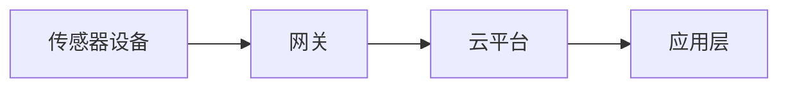

                 

**物联网(IoT)技术和各种传感器设备的集成：光电传感器的应用**

## 1. 背景介绍

物联网（IoT）是当今世界最前沿的技术之一，它将物理世界与数字世界连接起来，为我们提供了前所未有的可能性。传感器设备是物联网的基础，它们收集环境数据，为我们提供了对世界的洞察。光电传感器是其中一种常用的传感器，它可以检测光线的强度，在各种应用中发挥着关键作用。

## 2. 核心概念与联系

### 2.1 物联网（IoT）架构

物联网架构通常包括传感器设备、网关、云平台和应用层。传感器设备收集数据，网关将数据传输到云平台，云平台存储和处理数据，应用层则提供了对数据的访问和控制。



### 2.2 光电传感器原理

光电传感器利用光敏元件将光信号转换为电信号。当光照强度改变时，电信号也会随之改变，从而检测到光线的变化。

## 3. 核心算法原理 & 具体操作步骤

### 3.1 算法原理概述

光电传感器的算法原理是基于光电效应，即光照强度与电信号的关系。当光照强度增加时，电信号也会增加；反之亦然。

### 3.2 算法步骤详解

1. 选择合适的光敏元件，如光敏电阻或光敏二极管。
2. 设计电路，将光敏元件与放大电路连接。
3. 将电路连接到单片机或微控制器。
4. 编写程序，读取电信号，并将其转换为光照强度值。
5. 根据需要，对数据进行滤波和校准。

### 3.3 算法优缺点

优点：简单易行，成本低，可以检测到光线的变化。

缺点：精确度有限，受环境因素影响较大。

### 3.4 算法应用领域

光电传感器广泛应用于照明控制、安全系统、自动门控制等领域。

## 4. 数学模型和公式 & 详细讲解 & 举例说明

### 4.1 数学模型构建

光电效应的数学模型可以表示为：

$$I = \frac{P}{A} \cdot \eta$$

其中，$I$是电流强度，$P$是光照强度，$A$是光敏元件的面积，$\eta$是光电转换效率。

### 4.2 公式推导过程

根据光电效应原理，光照强度与电流强度成正比。光电转换效率$\eta$是一个常数，可以通过实验测得。光敏元件的面积$A$也可以测得。因此，我们可以将光照强度$P$表示为：

$$P = \frac{I \cdot A}{\eta}$$

### 4.3 案例分析与讲解

例如，假设我们使用光敏电阻作为光敏元件，其面积$A=1$平方厘米，光电转换效率$\eta=0.05$. 当电流强度$I=1$毫安时，光照强度$P$可以计算为：

$$P = \frac{1 \times 1}{0.05} = 20 \text{ Lux}$$

## 5. 项目实践：代码实例和详细解释说明

### 5.1 开发环境搭建

我们将使用Arduino单片机和光敏电阻来构建这个项目。我们需要的硬件包括：

- Arduino单片机
- 光敏电阻
- 电阻（10kΩ）
- LED灯
- 电源

### 5.2 源代码详细实现

```cpp
const int photoresistorPin = A0;
const int ledPin = 13;

void setup() {
  pinMode(ledPin, OUTPUT);
  Serial.begin(9600);
}

void loop() {
  int photoresistorReading = analogRead(photoresistorPin);
  Serial.println(photoresistorReading);
  if (photoresistorReading < 500) {
    digitalWrite(ledPin, HIGH);
  } else {
    digitalWrite(ledPin, LOW);
  }
}
```

### 5.3 代码解读与分析

在`setup()`函数中，我们设置了LED灯的引脚模式为输出，并初始化了串口通信。在`loop()`函数中，我们读取光敏电阻的电压值，并将其打印到串口。如果电压值小于500，则点亮LED灯；否则，熄灭LED灯。

### 5.4 运行结果展示

当环境光线变暗时，LED灯会点亮。当环境光线变亮时，LED灯会熄灭。同时，串口会显示光敏电阻的电压值。

## 6. 实际应用场景

### 6.1 照明控制

光电传感器可以用于自动控制照明。当环境光线变暗时，它可以自动打开灯光；当环境光线变亮时，它可以自动关闭灯光。

### 6.2 安全系统

光电传感器也可以用于安全系统。例如，它可以检测到入侵者的移动，从而触发警报。

### 6.3 未来应用展望

随着物联网技术的发展，光电传感器的应用将会更加广泛。它可以与其他传感器设备集成，为我们提供更丰富的环境数据。

## 7. 工具和资源推荐

### 7.1 学习资源推荐

- "物联网技术与应用"（书籍）
- "物联网：从传感器到云端"（在线课程）

### 7.2 开发工具推荐

- Arduino IDE
- Raspberry Pi

### 7.3 相关论文推荐

- "A Survey on Internet of Things: Architecture, Protocols, and Applications"（论文）

## 8. 总结：未来发展趋势与挑战

### 8.1 研究成果总结

光电传感器是物联网的关键组成部分。它可以检测环境光线的变化，为我们提供了对世界的洞察。

### 8.2 未来发展趋势

随着物联网技术的发展，光电传感器的应用将会更加广泛。它可以与其他传感器设备集成，为我们提供更丰富的环境数据。

### 8.3 面临的挑战

光电传感器的精确度有限，受环境因素影响较大。如何提高其精确度，是未来需要解决的关键问题。

### 8.4 研究展望

未来的研究方向包括：提高光电传感器的精确度，开发新的光电传感器材料，将光电传感器与其他传感器设备集成等。

## 9. 附录：常见问题与解答

**Q：光电传感器的精确度有多高？**

A：光电传感器的精确度有限，通常在10%左右。受环境因素影响较大，如温度、湿度等。

**Q：光电传感器可以检测到什么光线？**

A：光电传感器可以检测到可见光线。它不能检测到红外线、紫外线等其他光线。

**Q：光电传感器的成本是多少？**

A：光电传感器的成本很低，通常在1美元以下。

**作者：禅与计算机程序设计艺术 / Zen and the Art of Computer Programming**

