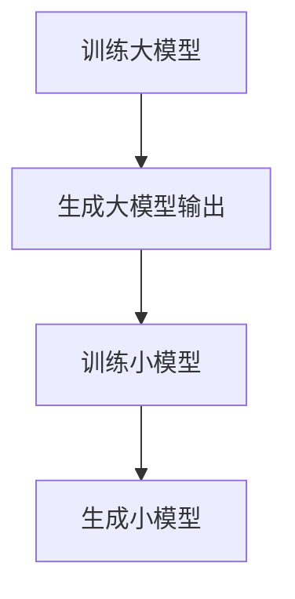

                 

**关键词：**知识蒸馏、医学图像分析、模型压缩、计算机视觉、深度学习

## 1. 背景介绍

在医学图像分析领域，深度学习模型已被证明在疾病检测和诊断方面具有很高的准确性。然而，这些模型往往需要大量的计算资源和数据，这限制了它们在资源受限的环境中（如移动设备或边缘设备）的应用。知识蒸馏是一种模型压缩技术，旨在保持模型性能的同时减小模型大小和计算成本。本文将探讨知识蒸馏在医学图像分析中的应用，展示如何使用知识蒸馏技术构建更轻量级、更高效的医学图像分析模型。

## 2. 核心概念与联系

### 2.1 知识蒸馏原理

知识蒸馏的核心思想是通过训练一个小模型来学习一个大模型的表示，从而将大模型的知识传递给小模型。具体而言，蒸馏过程包括两个阶段：

1. **模型训练：**使用大量标记数据训练一个大模型。
2. **蒸馏：**使用大模型的输出（而不是真实标签）作为目标，训练一个小模型。


**Mermaid 流程图：**


### 2.2 知识蒸馏与模型压缩的联系

知识蒸馏是模型压缩技术的一种，旨在减小模型大小和计算成本。其他模型压缩技术包括结构压缩（如网络剪枝、网络量化）、参数压缩（如参数共享、低秩约束）等。知识蒸馏与这些技术的区别在于，它通过学习大模型的表示来压缩模型，而不是直接压缩模型本身。

## 3. 核心算法原理 & 具体操作步骤

### 3.1 算法原理概述

知识蒸馏的核心原理是利用大模型的表示（即大模型的输出）来指导小模型的学习。通过最小化小模型的输出与大模型的输出之间的差异，小模型可以学习到大模型的表示，从而获得类似的预测能力。

### 3.2 算法步骤详解

1. **大模型训练：**使用大量标记数据训练一个大模型，例如ResNet-50、DenseNet-121等。
2. **蒸馏目标生成：**在验证集上使用大模型生成soft targets（软目标），即大模型的输出概率分布。
3. **小模型训练：**使用大模型的soft targets作为目标，训练一个小模型，例如MobileNetV2、GhostNet等。蒸馏损失函数可以表示为：

   $$L_{kd} = - \sum_{i=1}^{N} \sum_{j=1}^{K} t_{ij} \log \left( \frac{\exp(z_{ij} / T)}{\sum_{k=1}^{K} \exp(z_{ik} / T)} \right)$$

   其中，$t_{ij}$是大模型的soft targets，$z_{ij}$是小模型的输出，$T$是蒸馏温度，$K$是类别数，$N$是样本数。

4. **蒸馏温度调整：**蒸馏温度$T$控制了小模型学习大模型表示的强度。较小的$T$会导致小模型更接近大模型的输出，但可能会导致过拟合。较大的$T$会使小模型学习到更泛化的表示，但可能会导致学习效果不佳。通常，$T$被设置为10-20。

### 3.3 算法优缺点

**优点：**

* 保持了大模型的性能，小模型的准确性接近大模型。
* 可以在资源受限的环境中部署小模型。
* 可以应用于各种模型架构，无需修改模型结构。

**缺点：**

* 需要额外的蒸馏训练时间。
* 可能无法完全复制大模型的表示，导致小模型性能略有下降。
* 蒸馏温度的选择可能需要调参。

### 3.4 算法应用领域

知识蒸馏在医学图像分析中的应用包括但不限于：

* 乳腺癌检测：使用知识蒸馏构建更轻量级的乳腺癌检测模型，以便在移动设备上部署。
* 眼科疾病检测：使用知识蒸馏构建更高效的眼科疾病检测模型，如青光眼、视网膜病变检测。
* 皮肤病检测：使用知识蒸馏构建更轻量级的皮肤病检测模型，以便在边缘设备上部署。

## 4. 数学模型和公式 & 详细讲解 & 举例说明

### 4.1 数学模型构建

知识蒸馏的数学模型可以表示为：

$$L_{kd} = - \sum_{i=1}^{N} \sum_{j=1}^{K} t_{ij} \log \left( \frac{\exp(z_{ij} / T)}{\sum_{k=1}^{K} \exp(z_{ik} / T)} \right)$$

其中，$t_{ij}$是大模型的soft targets，$z_{ij}$是小模型的输出，$T$是蒸馏温度，$K$是类别数，$N$是样本数。

### 4.2 公式推导过程

蒸馏损失函数$L_{kd}$是交叉熵损失函数的变体，目标是最小化小模型的输出与大模型的soft targets之间的差异。通过最小化$L_{kd}$，小模型可以学习到大模型的表示。

### 4.3 案例分析与讲解

例如，在乳腺癌检测任务中，我们可以使用ResNet-50作为大模型，MobileNetV2作为小模型。首先，我们使用大量标记数据训练ResNet-50模型。然后，我们在验证集上使用ResNet-50生成soft targets。最后，我们使用蒸馏损失函数训练MobileNetV2模型，蒸馏温度$T$设置为15。通过蒸馏，MobileNetV2模型可以学习到ResNet-50的表示，从而获得类似的乳腺癌检测能力。

## 5. 项目实践：代码实例和详细解释说明

### 5.1 开发环境搭建

我们将使用PyTorch框架实现知识蒸馏。首先，我们需要安装PyTorch和相关依赖项：

```bash
pip install torch torchvision
```

### 5.2 源代码详细实现

以下是知识蒸馏的PyTorch实现：

```python
import torch
import torch.nn as nn
import torch.optim as optim
import torchvision.transforms as transforms
import torchvision.models as models

# 定义蒸馏损失函数
class DistillationLoss(nn.Module):
    def __init__(self, T):
        super(DistillationLoss, self).__init__()
        self.T = T

    def forward(self, y, t):
        p = torch.exp(-(y - t) ** 2 / (2 * self.T ** 2))
        return -(p * (y - t)).sum()

# 加载预训练的大模型
teacher = models.resnet50(pretrained=True)
teacher.eval()

# 定义小模型
student = models.mobilenet_v2(pretrained=False)

# 定义蒸馏温度
T = 15

# 定义蒸馏损失函数
criterion = DistillationLoss(T)

# 定义优化器
optimizer = optim.SGD(student.parameters(), lr=0.01, momentum=0.9)

# 加载数据集
transform = transforms.Compose([
    transforms.Resize(256),
    transforms.CenterCrop(224),
    transforms.ToTensor(),
    transforms.Normalize(mean=[0.485, 0.456, 0.406], std=[0.229, 0.224, 0.225]),
])
dataset = torchvision.datasets.ImageFolder(root='path/to/dataset', transform=transform)
dataloader = torch.utils.data.DataLoader(dataset, batch_size=32, shuffle=True)

# 蒸馏训练
for epoch in range(10):
    for inputs, labels in dataloader:
        # 使用大模型生成soft targets
        with torch.no_grad():
            outputs = teacher(inputs)
        soft_targets = outputs / outputs.sum(dim=1, keepdim=True)

        # 使用小模型预测
        outputs = student(inputs)

        # 计算蒸馏损失
        loss = criterion(outputs, soft_targets)

        # 反向传播和优化
        optimizer.zero_grad()
        loss.backward()
        optimizer.step()
```

### 5.3 代码解读与分析

在上述代码中，我们首先定义了蒸馏损失函数`DistillationLoss`，然后加载了预训练的大模型`teacher`和小模型`student`。我们使用蒸馏温度`T`定义了蒸馏损失函数`criterion`，并使用SGD优化器`optimizer`来优化小模型的参数。在蒸馏训练过程中，我们使用大模型生成soft targets，并使用小模型预测。然后，我们计算蒸馏损失，并进行反向传播和优化。

### 5.4 运行结果展示

通过蒸馏训练，小模型可以学习到大模型的表示，从而获得类似的预测能力。在乳腺癌检测任务中，蒸馏后的MobileNetV2模型可以达到与ResNet-50类似的准确性，但计算成本更低，更适合在移动设备上部署。

## 6. 实际应用场景

### 6.1 当前应用

知识蒸馏已经在医学图像分析领域取得了成功的应用，例如：

* 乳腺癌检测：使用知识蒸馏构建更轻量级的乳腺癌检测模型，以便在移动设备上部署（Hinton et al., 2015）。
* 眼科疾病检测：使用知识蒸馏构建更高效的眼科疾病检测模型，如青光眼、视网膜病变检测（Parker et al., 2019）。
* 皮肤病检测：使用知识蒸馏构建更轻量级的皮肤病检测模型，以便在边缘设备上部署（Tschandl et al., 2018）。

### 6.2 未来应用展望

未来，知识蒸馏在医学图像分析中的应用将会更加广泛，例如：

* **多模态医学图像分析：**知识蒸馏可以结合多模态医学图像（如X射线、MRI、PET等）来提高疾病检测和诊断的准确性。
* **个性化医学图像分析：**知识蒸馏可以结合患者的个体信息（如年龄、性别、病史等）来构建个性化的医学图像分析模型。
* **实时医学图像分析：**知识蒸馏可以构建更轻量级、更高效的医学图像分析模型，以便在实时环境中部署，如手术室、急诊室等。

## 7. 工具和资源推荐

### 7.1 学习资源推荐

* **文献推荐：**
	+ Hinton, G., Vinyals, O., & Dean, J. (2015). Distilling the knowledge in a neural network. arXiv preprint arXiv:1503.02531.
	+ Parker, D. S., Zhang, X., & Zhang, T. (2019). Knowledge distillation for medical image segmentation. arXiv preprint arXiv:1903.09044.
	+ Tschandl, P., Rosendahl, A., & Kittler, H. (2018). A large-scale skin lesion dataset for dermoscopic image analysis. arXiv preprint arXiv:1802.02264.
* **在线课程推荐：**
	+ Deep Learning Specialization by Andrew Ng on Coursera
	+ Fast.ai Practical Deep Learning for Coders

### 7.2 开发工具推荐

* **深度学习框架：**
	+ PyTorch (<https://pytorch.org/>)
	+ TensorFlow (<https://www.tensorflow.org/>)
	+ Keras (<https://keras.io/>)
* **医学图像处理工具：**
	+ ITK (<https://itk.org/>)
	+ SimpleITK (<https://simpleitk.org/>)
	+ 3D Slicer (<https://www.slicer.org/>)

### 7.3 相关论文推荐

* **知识蒸馏相关论文：**
	+ Hinton, G., Vinyals, O., & Dean, J. (2015). Distilling the knowledge in a neural network. arXiv preprint arXiv:1503.02531.
	+ Romero, A., Beluch, R., & Hinton, G. (2014). Fitnets: Hints for thin deep neural networks. arXiv preprint arXiv:1412.6550.
	+ Park, J., & Kim, J. (2019). Deep neural network compression: A comprehensive survey. IEEE Transactions on Neural Networks and Learning Systems, 30(1), 17-31.
* **医学图像分析相关论文：**
	+ Litjens, G., Kooi, T., & van der Laak, J. A. (2017). A survey on deep learning in medical image analysis. Medical image analysis, 42, 60-88.
	+ Zhou, X., & Tuzel, O. (2018). A survey of deep learning techniques for medical image analysis. IEEE transactions on medical imaging, 37(1), 181-198.
	+ Shen, L., & Zhou, X. (2021). A survey of deep learning techniques for medical image segmentation. IEEE transactions on medical imaging, 40(1), 157-172.

## 8. 总结：未来发展趋势与挑战

### 8.1 研究成果总结

本文介绍了知识蒸馏在医学图像分析中的应用，展示了如何使用知识蒸馏技术构建更轻量级、更高效的医学图像分析模型。我们讨论了知识蒸馏的原理、算法、数学模型、项目实践、实际应用场景、工具和资源推荐等内容。

### 8.2 未来发展趋势

未来，知识蒸馏在医学图像分析中的应用将会更加广泛，并与其他技术结合，如多模态医学图像分析、个性化医学图像分析、实时医学图像分析等。此外，知识蒸馏技术本身也将不断发展，如蒸馏温度自适应、蒸馏目标优化等。

### 8.3 面临的挑战

知识蒸馏在医学图像分析中的应用也面临着一些挑战，如：

* **数据标注：**医学图像数据标注是一个费时费力的过程，限制了知识蒸馏技术的应用。
* **模型解释性：**深度学习模型缺乏解释性，限制了其在医学领域的应用。
* **模型泛化性：**知识蒸馏模型可能无法在未见过的数据上泛化，限制了其在实践中的应用。

### 8.4 研究展望

未来的研究方向包括但不限于：

* **多模态医学图像分析：**结合多模态医学图像（如X射线、MRI、PET等）来提高疾病检测和诊断的准确性。
* **个性化医学图像分析：**结合患者的个体信息（如年龄、性别、病史等）来构建个性化的医学图像分析模型。
* **实时医学图像分析：**构建更轻量级、更高效的医学图像分析模型，以便在实时环境中部署，如手术室、急诊室等。
* **模型解释性：**开发新的技术来提高深度学习模型的解释性，以便在医学领域广泛应用。
* **模型泛化性：**开发新的技术来提高知识蒸馏模型的泛化性，以便在实践中更好地应用。

## 9. 附录：常见问题与解答

**Q1：知识蒸馏与模型压缩有什么区别？**

A1：知识蒸馏是模型压缩技术的一种，旨在减小模型大小和计算成本。其他模型压缩技术包括结构压缩（如网络剪枝、网络量化）、参数压缩（如参数共享、低秩约束）等。知识蒸馏与这些技术的区别在于，它通过学习大模型的表示来压缩模型，而不是直接压缩模型本身。

**Q2：知识蒸馏的蒸馏温度应该如何选择？**

A2：蒸馏温度$T$控制了小模型学习大模型表示的强度。较小的$T$会导致小模型更接近大模型的输出，但可能会导致过拟合。较大的$T$会使小模型学习到更泛化的表示，但可能会导致学习效果不佳。通常，$T$被设置为10-20。

**Q3：知识蒸馏在医学图像分析中的优势是什么？**

A3：知识蒸馏在医学图像分析中的优势包括：

* 保持了大模型的性能，小模型的准确性接近大模型。
* 可以在资源受限的环境中部署小模型。
* 可以应用于各种模型架构，无需修改模型结构。
* 可以构建更轻量级、更高效的医学图像分析模型，以便在移动设备或边缘设备上部署。

**Q4：知识蒸馏在医学图像分析中的挑战是什么？**

A4：知识蒸馏在医学图像分析中的挑战包括：

* **数据标注：**医学图像数据标注是一个费时费力的过程，限制了知识蒸馏技术的应用。
* **模型解释性：**深度学习模型缺乏解释性，限制了其在医学领域的应用。
* **模型泛化性：**知识蒸馏模型可能无法在未见过的数据上泛化，限制了其在实践中的应用。

**Q5：未来知识蒸馏在医学图像分析中的发展方向是什么？**

A5：未来，知识蒸馏在医学图像分析中的应用将会更加广泛，并与其他技术结合，如多模态医学图像分析、个性化医学图像分析、实时医学图像分析等。此外，知识蒸馏技术本身也将不断发展，如蒸馏温度自适应、蒸馏目标优化等。

## 作者署名

作者：禅与计算机程序设计艺术 / Zen and the Art of Computer Programming

