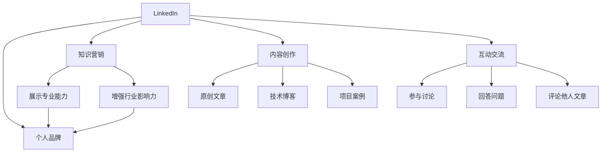

                 

# 程序员如何利用LinkedIn进行知识营销

## 1. 背景介绍

在当今数字时代，程序员不仅仅是编写代码的工程师，更是社交网络上的思想传播者和知识分享者。LinkedIn作为全球最大的职业社交平台，是程序员进行知识营销的理想场所。通过在LinkedIn上发布专业文章、参与专业讨论、建立个人品牌，程序员不仅可以展示自己的技术实力，还可以吸引更多同行关注，拓展职业发展路径，甚至开启自由职业之路。

本文将系统地介绍如何在LinkedIn上进行知识营销，包括建立专业形象、内容创作、互动交流、品牌建设等关键环节，帮助程序员更好地利用LinkedIn平台，展示自己的技术才能，提升职业影响力。

## 2. 核心概念与联系

### 2.1 核心概念概述

- **LinkedIn**：全球最大的职业社交平台，提供职业网络、职位招聘、知识分享等功能。
- **知识营销**：通过分享专业知识、技术经验，提升个人或品牌在行业内的知名度和影响力。
- **个人品牌**：在LinkedIn上建立和维护个人形象，展示个人专业能力、技术见解和行业影响力。
- **内容创作**：在LinkedIn上发布原创文章、技术博客、项目案例，分享最新的技术趋势和实践经验。
- **互动交流**：在LinkedIn上参与讨论、回答问题、评论他人文章，与同行进行深度交流和互动。

这些概念之间的联系通过以下Mermaid流程图来展示：



这个流程图展示了LinkedIn平台上的关键活动和概念之间的联系。通过在LinkedIn上创作和交流内容，可以逐步建立和维护个人品牌，提升自己在行业内的知名度和影响力。

## 3. 核心算法原理 & 具体操作步骤

### 3.1 算法原理概述

LinkedIn上的知识营销主要依赖于以下算法原理：

- **内容推荐算法**：LinkedIn根据用户的兴趣、互动历史、浏览行为等数据，推荐相关的内容，提高内容的曝光率和互动率。
- **社交网络算法**：LinkedIn的社交网络算法，通过用户的连接关系、互动情况等数据，优化社交网络的构建和维护，增强用户的连接强度和互动频率。
- **影响力计算算法**：LinkedIn通过用户的粉丝数、互动率、内容质量等因素，计算用户的个人影响力，作为用户推荐的依据。

### 3.2 算法步骤详解

#### 3.2.1 内容创作

1. **选择主题**：选择与个人技术专长和兴趣相关的领域，如人工智能、软件开发、云计算等，确保内容有深度和广度。
2. **撰写文章**：根据选择的领域，撰写高质量、有深度的技术文章。文章应包括技术背景、问题描述、解决方案、代码实现和测试结果等部分。
3. **添加标签和关键词**：为文章添加相关标签和关键词，如Python、机器学习、大数据等，提高文章的搜索可见性。
4. **发布和分享**：发布文章后，利用LinkedIn的分享功能，分享到个人和群组，增加文章的曝光率。

#### 3.2.2 互动交流

1. **参与讨论**：在LinkedIn的群组或话题页上，积极参与相关讨论，回答问题，提供技术见解。
2. **评论他人文章**：阅读并评论他人的技术文章，提出建设性意见，并与作者进行交流互动。
3. **建立连接**：在LinkedIn上寻找和连接同行业的专家和同行，扩大个人专业网络。

#### 3.2.3 品牌建设

1. **完善个人资料**：确保个人资料完整、专业，包括个人介绍、教育背景、工作经历、技能证书等。
2. **定期更新动态**：定期发布技术动态、项目进展、行业趋势等内容，保持个人活跃度。
3. **维护专业形象**：在所有互动中保持专业、礼貌的态度，树立良好的个人品牌形象。

### 3.3 算法优缺点

#### 3.3.1 优点

- **高效曝光**：通过LinkedIn的内容推荐算法，文章可以被推荐给更多同行业或兴趣相关的人群，提高曝光率。
- **广泛交流**：通过社交网络算法，可以与更多同行建立连接，拓展专业网络。
- **品牌提升**：通过持续发布高质量内容，逐步建立起个人的专业形象和品牌影响力。

#### 3.3.2 缺点

- **内容质量要求高**：需要持续输出高质量、有深度的技术内容，对技术水平和写作能力有较高要求。
- **时间投入大**：内容创作、互动交流、品牌建设都需要大量的时间和精力投入，对工作和生活平衡提出挑战。

### 3.4 算法应用领域

LinkedIn上的知识营销不仅可以应用于个人职业发展，还可以用于企业品牌建设、行业知识传播、技术社区构建等领域。

- **个人职业发展**：通过持续发布高质量技术内容，建立个人品牌，吸引同行关注，提升职业影响力，甚至开启自由职业之路。
- **企业品牌建设**：通过在LinkedIn上发布公司技术动态、项目案例、行业见解等内容，提升企业品牌知名度和影响力。
- **行业知识传播**：利用LinkedIn的广泛覆盖和高度互动性，传播行业最新技术趋势和实践经验，带动整个行业的发展。
- **技术社区构建**：建立LinkedIn群组，聚集同行业的技术爱好者和从业者，形成技术交流和学习的社区，促进技术进步。

## 4. 数学模型和公式 & 详细讲解 & 举例说明

### 4.1 数学模型构建

LinkedIn上的内容推荐和社交网络算法通常使用机器学习模型来实现，包括协同过滤、基于图神经网络(GNN)的方法等。这里以协同过滤为例，构建内容推荐模型。

设用户集合为 $U$，文章集合为 $I$，用户 $u$ 对文章 $i$ 的评分 $r_{ui}$ 为 $0$ 或 $1$（评分 $1$ 表示用户 $u$ 阅读了文章 $i$）。目标是为用户 $u$ 推荐可能感兴趣的文章 $i$，使用协同过滤方法，可以通过用户 $u$ 的评分向量 $r_u$ 和文章 $i$ 的评分向量 $r_i$ 计算相似度 $s_{ui}$，推荐与用户 $u$ 最相似的文章：

$$
s_{ui} = \frac{\sum_{v\in U}(r_{uv}-r_u\bar{r_v})(r_{vi}-r_i\bar{r_v})}{\sqrt{\sum_{v\in U}(r_{uv}-r_u\bar{r_v})^2}\sqrt{\sum_{v\in U}(r_{vi}-r_i\bar{r_v})^2}}
$$

其中 $\bar{r_v}$ 表示用户 $v$ 的平均评分，$U$ 为用户集合，$I$ 为文章集合，$r_{uv}$ 表示用户 $v$ 对文章 $u$ 的评分。

### 4.2 公式推导过程

设用户 $u$ 的评分向量为 $r_u$，文章 $i$ 的评分向量为 $r_i$，用户集合为 $U$，文章集合为 $I$。用户 $u$ 对文章 $i$ 的评分 $r_{ui}$ 为 $0$ 或 $1$。目标是为用户 $u$ 推荐可能感兴趣的文章 $i$。

协同过滤算法基于用户和物品之间的相似度，计算用户 $u$ 的评分向量 $r_u$ 和文章 $i$ 的评分向量 $r_i$，计算相似度 $s_{ui}$：

$$
s_{ui} = \frac{\sum_{v\in U}(r_{uv}-r_u\bar{r_v})(r_{vi}-r_i\bar{r_v})}{\sqrt{\sum_{v\in U}(r_{uv}-r_u\bar{r_v})^2}\sqrt{\sum_{v\in U}(r_{vi}-r_i\bar{r_v})^2}}
$$

其中 $\bar{r_v}$ 表示用户 $v$ 的平均评分，$U$ 为用户集合，$I$ 为文章集合，$r_{uv}$ 表示用户 $v$ 对文章 $u$ 的评分。

通过相似度 $s_{ui}$，可以计算推荐文章 $i$ 的得分 $r'_{ui}$：

$$
r'_{ui} = \frac{s_{ui}(r_{iu}\bar{r_i} - r_u\bar{r_u})}{\sum_{j\in I}(s_{uj}(r_{ij}\bar{r_i} - r_u\bar{r_u})}
$$

### 4.3 案例分析与讲解

假设某技术博主在LinkedIn上发布了一篇关于深度学习模型的文章，内容涉及模型架构、优化策略、代码实现等。文章发布后，LinkedIn的推荐算法会基于用户的历史阅读行为、互动历史等数据，计算出该文章的推荐得分，并将其推荐给对该领域感兴趣的用户。

例如，某用户阅读了该博主的多篇文章，并对深度学习有浓厚的兴趣，根据协同过滤算法，LinkedIn会计算该用户与博主的相似度，以及该用户与推荐文章之间的相似度，从而决定是否将该文章推荐给该用户。

## 5. 项目实践：代码实例和详细解释说明

### 5.1 开发环境搭建

1. **安装Python**：确保计算机上安装了Python 3.x版本。
2. **安装LinkedIn API**：使用pip安装LinkedIn API库，如`linkedin-api`。
3. **创建LinkedIn账号**：在LinkedIn上创建个人账号，并使用LinkedIn账号进行认证。

### 5.2 源代码详细实现

以下是一个简单的LinkedIn文章发布和互动的Python代码实现：

```python
from linkedin_api import LinkedInAPI

# 创建LinkedInAPI实例
api = LinkedInAPI(client_id='YOUR_CLIENT_ID', client_secret='YOUR_CLIENT_SECRET', access_token='YOUR_ACCESS_TOKEN')

# 发布文章
title = '我的深度学习模型优化实践'
content = '本文介绍了我如何优化深度学习模型，包括架构选择、损失函数设计、超参数调优等。'
post = api.post(
    message=f'{title}：{content}',
    topic_id='your_topic_id'
)

# 获取文章ID
post_id = post.id

# 评论文章
comment = api.comment(post_id, message='非常棒的分享，谢谢！')
print(f'评论ID：{comment.id}')
```

### 5.3 代码解读与分析

**LinkedInAPI类**：
- 提供与LinkedIn进行交互的方法，包括文章发布、评论等功能。
- 使用API的访问方式，通过`LinkedInAPI`类创建API实例，调用方法进行文章发布和评论。

**文章发布**：
- `post`方法用于发布文章，包括文章标题、内容、主题ID等参数。
- 使用`api.post`方法发布文章，并通过`post.id`获取文章ID。

**评论文章**：
- `comment`方法用于评论文章，包括文章ID、评论内容等参数。
- 使用`api.comment`方法评论文章，并通过`comment.id`获取评论ID。

**代码运行结果**：
- 运行上述代码后，可以在LinkedIn上看到发布的文章，以及评论的文章。

## 6. 实际应用场景

### 6.1 个人职业发展

在LinkedIn上发布技术文章、参与技术讨论、建立专业连接，可以极大地提升个人在行业内的知名度和影响力。通过持续输出高质量内容，可以逐渐建立起自己的专业形象，吸引更多同行关注，甚至开启自由职业之路。

**案例分析**：
某技术博主在LinkedIn上发布了一系列关于机器学习算法优化、模型部署、数据分析的文章，并通过评论、互动等方式积极参与行业讨论。逐渐建立了自己在机器学习领域的影响力，吸引了众多同行的关注，甚至收到了几家大公司的招聘邀约。

### 6.2 企业品牌建设

通过在LinkedIn上发布公司技术动态、项目案例、行业见解等内容，可以有效提升企业品牌知名度和影响力。企业可以借助LinkedIn的广泛覆盖和高度互动性，向更多潜在客户和员工展示自己的技术实力和企业文化。

**案例分析**：
某科技公司通过在LinkedIn上发布公司内部的技术创新、项目案例、行业分析等内容，逐步提升了品牌知名度，吸引了更多人才的关注，加速了公司的快速发展。

### 6.3 行业知识传播

利用LinkedIn的广泛覆盖和高度互动性，可以传播行业最新技术趋势和实践经验，带动整个行业的发展。通过在LinkedIn上发布高质量的技术文章、参与行业讨论、建立专业连接，可以形成行业知识共享和学习的社区。

**案例分析**：
某开源社区通过在LinkedIn上发布开源项目的进展、技术难题解决、社区活动安排等内容，逐步聚集了同行业的技术爱好者和从业者，形成了一个开放、活跃的社区，为行业的发展贡献了力量。

## 7. 工具和资源推荐

### 7.1 学习资源推荐

- **LinkedIn官方文档**：提供了LinkedIn API的详细文档和使用示例，帮助开发者快速上手。
- **LinkedIn社区**：可以加入LinkedIn上的技术群组，与其他开发者交流技术经验，获取最新的行业动态。
- **技术博客和论坛**：如CSDN、Stack Overflow等，可以发布和分享技术文章，参与行业讨论。

### 7.2 开发工具推荐

- **PyCharm**：强大的Python IDE，支持LinkedIn API的开发和调试。
- **Jupyter Notebook**：支持Python代码的交互式开发和展示。
- **Git**：使用版本控制系统，管理代码库和项目。

### 7.3 相关论文推荐

- **LinkedIn推荐算法研究**：介绍LinkedIn推荐算法的基本原理和实现方法，帮助理解LinkedIn内容推荐的核心技术。
- **社交网络分析**：探讨社交网络的数据分析方法，帮助理解LinkedIn社交网络的构建和优化。
- **知识共享与社区构建**：研究知识共享和社区构建的理论和方法，帮助理解LinkedIn在行业知识传播中的应用。

## 8. 总结：未来发展趋势与挑战

### 8.1 研究成果总结

本文系统地介绍了如何在LinkedIn上进行知识营销，包括建立专业形象、内容创作、互动交流、品牌建设等关键环节。通过在LinkedIn上发布高质量内容、积极参与行业讨论、建立专业连接，可以显著提升个人或企业的知名度和影响力。

### 8.2 未来发展趋势

LinkedIn上的知识营销将呈现以下几个发展趋势：

- **内容多样化**：除了技术文章，还包括视频、直播、演示等内容，丰富内容形式，增强用户互动。
- **智能推荐**：使用更先进的算法和模型，提升内容推荐的精准度和个性化水平，提高用户满意度。
- **社交网络优化**：优化社交网络的构建和维护，增强用户连接强度和互动频率，形成更紧密的社区。
- **品牌影响力增强**：通过持续输出高质量内容，逐步建立起个人或企业的专业形象和品牌影响力。

### 8.3 面临的挑战

LinkedIn上的知识营销也面临一些挑战：

- **内容质量要求高**：需要持续输出高质量、有深度的技术内容，对技术水平和写作能力有较高要求。
- **时间投入大**：内容创作、互动交流、品牌建设都需要大量的时间和精力投入，对工作和生活平衡提出挑战。
- **用户互动率低**：如果内容质量和互动方式不够吸引人，可能会导致用户互动率低，影响品牌曝光。

### 8.4 研究展望

未来的研究可以从以下几个方向进行探索：

- **内容生成技术**：利用自然语言生成技术，自动生成高质量的技术文章，减轻内容创作的压力。
- **个性化推荐**：通过更深入的用户行为分析和数据挖掘，提升内容的个性化推荐水平。
- **社交网络优化**：研究更有效的社交网络构建和维护方法，增强用户连接强度和互动频率。
- **品牌影响力提升**：研究品牌建设的策略和方法，提升个人或企业在LinkedIn上的知名度和影响力。

## 9. 附录：常见问题与解答

**Q1：如何在LinkedIn上发布文章？**

A: 通过LinkedIn API的`post`方法，指定文章的标题、内容和主题ID，即可发布文章。

**Q2：如何评论他人文章？**

A: 通过LinkedIn API的`comment`方法，指定文章ID和评论内容，即可评论文章。

**Q3：LinkedIn上的内容推荐算法是如何工作的？**

A: LinkedIn的内容推荐算法通常使用协同过滤、基于图神经网络等方法，根据用户的历史行为和互动数据，计算相似度，推荐相关内容。

**Q4：LinkedIn上的社交网络是如何构建的？**

A: LinkedIn的社交网络通过用户的连接关系、互动情况等数据，使用图算法优化网络结构，增强用户的连接强度和互动频率。

**Q5：如何提高LinkedIn上的互动率？**

A: 可以通过发布高质量内容、参与行业讨论、建立专业连接等方式，提高互动率，增强个人或品牌的影响力。

---

作者：禅与计算机程序设计艺术 / Zen and the Art of Computer Programming

