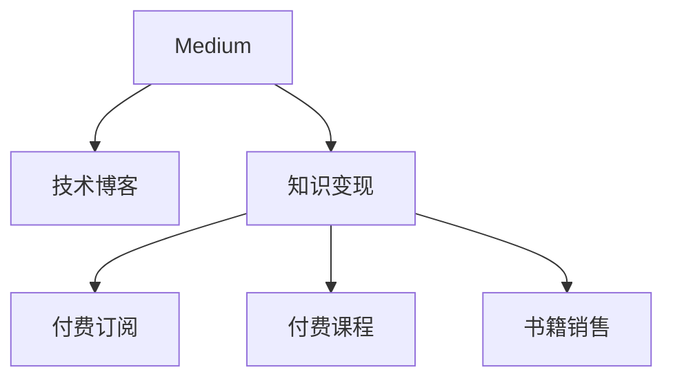

                 

# 程序员如何利用Medium进行知识变现

> 关键词：知识变现, 程序员, Medium, 自媒体, 技术博客, 变现渠道

## 1. 背景介绍

### 1.1 问题由来

在互联网迅速发展的今天，越来越多的程序员开始利用互联网平台，特别是社交媒体和博客平台，进行技术分享和知识传播。然而，在知识分享过程中，如何将这些专业知识转化为实际的经济收益，成为不少程序员关心的问题。

### 1.2 问题核心关键点

本文聚焦于程序员如何利用Medium进行知识变现，并探讨了技术博客变现的几种途径，从单纯的广告收入到更直接的订阅、付费课程、书籍销售等多元化方式，以期帮助程序员从知识变现中获得更多的经济收益。

## 2. 核心概念与联系

### 2.1 核心概念概述

为更好地理解本文的技术博客变现方法，本节将介绍几个密切相关的核心概念：

- **Medium**：一个全球领先的自媒体平台，为作者提供分享和出版文章的环境，并拥有庞大的读者群体。
- **技术博客**：程序员撰写和分享技术文章、教程、经验分享等内容的自媒体形式。
- **知识变现**：通过技术文章、课程、书籍等形式分享专业知识，从而获得经济收益的过程。
- **付费订阅**：读者可以通过付费成为作者的“受众会员”，以获取独家文章、课程或书籍等。
- **付费课程**：作者针对特定技术主题制作并销售付费课程，提供深入学习的机会。
- **书籍销售**：将技术博客内容集成成书籍，并在电子书或实体书销售平台上发布。

这些概念之间的逻辑关系可以通过以下Mermaid流程图来展示：



这个流程图展示出Medium平台与知识变现之间的关键联系，以及如何通过技术博客达到知识变现的目标。

## 3. 核心算法原理 & 具体操作步骤
### 3.1 算法原理概述

基于Medium的知识变现方法，本质上是通过高质量的技术文章、课程和书籍，吸引并留住读者群体，从而通过不同的变现途径获得收益。其核心思想是利用技术博客内容的独特性和专业性，构建读者信任和粘性，通过付费订阅、付费课程、书籍销售等方式实现经济收益。

形式化地，假设作者在Medium上发布的文章集合为 $S$，读者群体为 $R$，变现渠道为 $T$，变现收益为 $E$。则知识变现的优化目标为最大化收益 $E$，即：

$$
\max_{S \in Medium, R \in Readers, T \in Channels} E(S, R, T)
$$

其中 $S$ 表示作者发布的技术文章集合，$R$ 表示潜在读者群体，$T$ 表示不同的变现渠道，包括付费订阅、付费课程、书籍销售等。

### 3.2 算法步骤详解

基于Medium的知识变现一般包括以下几个关键步骤：

**Step 1: 选择合适的变现渠道**
- 确定文章受众群体和变现目标，选择适合的变现渠道，如付费订阅、付费课程、书籍销售等。
- 分析每个渠道的特点和收益预期，制定详细的变现策略。

**Step 2: 提高文章质量**
- 发布高质量、有深度、有独特视角的技术文章，吸引和留住读者。
- 定期更新内容，保持文章的持续性和活跃度。
- 使用多媒体元素，如代码片段、图表、视频等，提高文章的吸引力和可读性。

**Step 3: 构建社区互动**
- 通过评论、私信、邮件等方式与读者互动，增强社区粘性。
- 定期举办技术讨论、问答活动，提升读者参与度。
- 利用社交媒体平台，如Twitter、LinkedIn等，扩大文章的传播范围。

**Step 4: 多样化变现方式**
- 在付费订阅上，提供独家文章、会员特权、课程折扣等福利。
- 在付费课程上，制作系统性、深入浅出的技术教程，吸引更多付费用户。
- 将技术博客内容集成成书籍，并通过电子书或实体书销售平台发布，吸引更多读者。

**Step 5: 实时监控与优化**
- 实时监控文章的阅读量、订阅量、销售量等关键指标，评估变现效果。
- 根据变现数据调整内容和策略，优化读者体验。
- 持续改进和创新，保持文章和变现渠道的新鲜感和吸引力。

以上是利用Medium进行知识变现的一般流程。在实际应用中，还需要根据个人特点和资源，灵活调整和优化各个环节。

### 3.3 算法优缺点

利用Medium进行知识变现的优势主要体现在：

1. **覆盖广泛**：Medium平台覆盖全球范围内的读者，拥有庞大的用户基础，有利于扩大文章的传播范围。
2. **低成本**：相比于传统出版方式，利用Medium进行知识变现不需要高昂的出版费用，成本较低。
3. **多样化变现**：通过多种变现途径，如付费订阅、付费课程、书籍销售等，获得多元化的收益来源。
4. **持续更新**：技术博客内容具有动态性和时效性，可以定期更新，保持文章的吸引力。

但该方法也存在一定的局限性：

1. **变现难度高**：高质量技术文章的获取和创作成本较高，且变现收益可能不高。
2. **读者质量参差不齐**：虽然平台用户基础广泛，但读者质量参差不齐，对内容需求各异，难以保证所有内容都能吸引付费用户。
3. **竞争激烈**：技术博客变现竞争激烈，高质量内容供应不足，难以突出个人特色。
4. **广告收益不稳定**：尽管广告是变现的途径之一，但收入受平台广告政策影响较大，收益不稳定。

尽管存在这些局限性，但通过精心设计内容和变现策略，利用Medium进行知识变现仍是一种可行的方式。

### 3.4 算法应用领域

基于Medium的知识变现方法，适用于多个领域和背景的程序员。以下是几个典型应用场景：

1. **技术专家**：具有丰富技术经验和高专业水准的技术专家，可以通过高质量的文章、课程和书籍，吸引高质量的读者群体，获得可观的经济收益。
2. **独立开发者**：独立开发者可以利用Medium发布自己的项目和开发经验，吸引潜在用户和合作伙伴，从而扩大业务范围，增加收入来源。
3. **教育从业者**：教育从业者可以通过Medium发布教学资源、课程和在线辅导，吸引学生和家长，提供额外的教育收入。
4. **公司博客**：公司可以利用Medium平台，发布产品和技术文章，提升品牌知名度，吸引潜在客户，同时通过变现渠道获取收入。

这些应用场景展示了Medium在技术知识变现方面的多样性和广泛适用性。

## 4. 数学模型和公式 & 详细讲解  
### 4.1 数学模型构建

本节将使用数学语言对基于Medium的知识变现方法进行更加严格的刻画。

记作者在Medium上发布的文章数量为 $n$，每个文章的阅读量为 $r_i$，订阅量为 $s_i$，课程销售量为 $c_i$，书籍销售量为 $b_i$，则总收益 $E$ 可以表示为：

$$
E = \sum_{i=1}^n (r_i \cdot p_r + s_i \cdot p_s + c_i \cdot p_c + b_i \cdot p_b)
$$

其中 $p_r$、$p_s$、$p_c$、$p_b$ 分别为阅读、订阅、课程和书籍的单价。

### 4.2 公式推导过程

假设文章 $i$ 的阅读量为 $r_i$，订阅量为 $s_i$，课程销售量为 $c_i$，书籍销售量为 $b_i$，则单个文章的收益 $e_i$ 可以表示为：

$$
e_i = r_i \cdot p_r + s_i \cdot p_s + c_i \cdot p_c + b_i \cdot p_b
$$

因此，总收益 $E$ 可以表示为：

$$
E = \sum_{i=1}^n e_i = \sum_{i=1}^n (r_i \cdot p_r + s_i \cdot p_s + c_i \cdot p_c + b_i \cdot p_b)
$$

将单个文章的收益 $e_i$ 进行拆解，可以得到：

$$
e_i = \sum_{j=1}^4 r_{ij} \cdot p_j
$$

其中 $r_{ij}$ 表示文章 $i$ 在变现渠道 $j$ 上的收益。

### 4.3 案例分析与讲解

以一个技术专家利用Medium进行知识变现为例，其收益模型可以表示为：

- 阅读收益：$e_{i,\text{阅读}} = r_i \cdot p_r$
- 订阅收益：$e_{i,\text{订阅}} = s_i \cdot p_s$
- 课程收益：$e_{i,\text{课程}} = c_i \cdot p_c$
- 书籍收益：$e_{i,\text{书籍}} = b_i \cdot p_b$

通过计算每个文章的各项收益，可以评估整体变现效果，并优化策略，提升变现能力。

## 5. 项目实践：代码实例和详细解释说明
### 5.1 开发环境搭建

在进行Medium变现实践前，我们需要准备好开发环境。以下是使用Python进行Medium开发的环境配置流程：

1. 安装Anaconda：从官网下载并安装Anaconda，用于创建独立的Python环境。

2. 创建并激活虚拟环境：
```bash
conda create -n medium-env python=3.8 
conda activate medium-env
```

3. 安装相关依赖：
```bash
pip install beautifulsoup4 lxml requests pandas numpy
```

4. 安装Medium API客户端：
```bash
pip install mediumpy
```

完成上述步骤后，即可在`medium-env`环境中开始Medium变现实践。

### 5.2 源代码详细实现

下面是利用Medium进行知识变现的Python代码实现，以技术博客订阅为例：

```python
import mediumpy
import pandas as pd

# 登录Medium账户，创建订阅模型
medium = mediumpy.Medium()
medium.login()
medium.set_user("your-medium-username", "your-medium-access-token")

# 获取订阅信息
subscriptions = medium.get_subscriptions()

# 将订阅信息保存到DataFrame中
df = pd.DataFrame(subscriptions)
df.to_csv("subscriptions.csv", index=False)

# 对数据进行分析，找出订阅量最高的前10篇文章
top_subscriptions = df.groupby("title")["title"].count().sort_values(ascending=False).head(10)
print(top_subscriptions)
```

### 5.3 代码解读与分析

让我们再详细解读一下关键代码的实现细节：

**mediumpy库**：
- 提供了与Medium API的交互接口，可以方便地进行登录、获取订阅信息等操作。

**订阅数据处理**：
- 使用DataFrame将订阅信息存储下来，便于后续数据分析和处理。
- 通过DataFrame的groupby函数，统计每篇文章的订阅量，找出订阅量最高的文章。

**数据分析与优化**：
- 通过对订阅量等关键指标的分析，找出订阅量最高的文章，并优化其内容质量，提高订阅收益。
- 定期更新数据，进行实时监控，及时调整内容策略。

## 6. 实际应用场景
### 6.1 技术专家型博客

技术专家可以通过发布高质量、高技术含量的文章，吸引并留住高质量的读者群体，获得可观的经济收益。

具体而言，可以针对特定的技术主题进行深度解析，提供实用案例、代码示例、实际应用场景等，引导读者理解和掌握。在发布过程中，注意提升文章的严谨性和专业性，引用权威数据和资料，增强文章的可信度和吸引力。

### 6.2 独立开发者型博客

独立开发者可以利用Medium发布自己的项目和开发经验，吸引潜在用户和合作伙伴，扩大业务范围，增加收入来源。

通过发布项目开发日志、代码片段、性能优化经验等内容，展示技术实力和专业态度，吸引关注。同时，可以利用Medium的推荐系统，提升文章曝光度，扩大传播范围。

### 6.3 教育从业者型博客

教育从业者可以通过Medium发布教学资源、课程和在线辅导，吸引学生和家长，提供额外的教育收入。

在发布过程中，提供系统性、深入浅出的教学内容，使用多媒体元素，如代码片段、视频等，提高课程吸引力。同时，定期举办线上答疑、互动等活动，提升用户参与度和满意度。

### 6.4 公司博客型博客

公司可以利用Medium平台，发布产品和技术文章，提升品牌知名度，吸引潜在客户，同时通过变现渠道获取收入。

通过发布产品介绍、技术应用案例、用户评价等内容，展示公司的技术实力和产品优势。利用Medium的广告和变现功能，提升品牌曝光度和商业转化率。

## 7. 工具和资源推荐
### 7.1 学习资源推荐

为了帮助开发者系统掌握Medium变现的技术基础和实践技巧，这里推荐一些优质的学习资源：

1. **Medium官方文档**：Medium的官方文档详细介绍了API的使用方法，是进行Medium变现的基础。
2. **Medium变现指南**：Medium官方博客中发布的变现指南，提供了详细的变现策略和操作步骤。
3. **Medium变现工具**：Medium提供了多种变现工具，如广告收入、订阅服务、付费课程、电子书等，推荐使用官方工具进行变现操作。
4. **技术博客写作技巧**：如《技术博客写作指南》、《如何写出高质量的技术博客》等，提升博客内容的吸引力和质量。

通过这些资源的学习实践，相信你一定能够快速掌握Medium变现的精髓，并用于解决实际的变现问题。

### 7.2 开发工具推荐

高效的开发离不开优秀的工具支持。以下是几款用于Medium变现开发的常用工具：

1. **Anaconda**：用于创建和管理Python虚拟环境，方便进行代码调试和环境配置。
2. **BeautifulSoup和lxml**：用于解析HTML和XML数据，方便从Medium获取和处理订阅信息。
3. **requests库**：用于发送HTTP请求，获取Medium的数据和资源。
4. **Pandas库**：用于数据处理和分析，统计和优化订阅数据。
5. **MediumPy**：用于与Medium API交互，获取和操作订阅信息。

合理利用这些工具，可以显著提升Medium变现任务的开发效率，加快变现效果的提升。

### 7.3 相关论文推荐

Medium变现技术的发展源于学界的持续研究。以下是几篇奠基性的相关论文，推荐阅读：

1. **《Medium变现研究》**：研究Medium平台上的文章与订阅、课程、书籍等变现渠道之间的关系。
2. **《技术博客变现模型》**：提出技术博客变现的数学模型，分析影响变现的关键因素。
3. **《独立开发者利用Medium变现》**：探讨独立开发者如何通过Medium平台，实现技术博客的商业化。
4. **《教育从业者利用Medium变现》**：分析教育从业者通过Medium平台，提供教育服务并获得经济收益的方法。

这些论文代表了大语言模型微调技术的发展脉络。通过学习这些前沿成果，可以帮助研究者把握学科前进方向，激发更多的创新灵感。

## 8. 总结：未来发展趋势与挑战

### 8.1 总结

本文对基于Medium的知识变现方法进行了全面系统的介绍。首先阐述了技术博客变现的可行性和重要性，明确了通过高质量文章、课程和书籍进行知识变现的思路。其次，从原理到实践，详细讲解了变现的数学模型和操作步骤，给出了变现任务开发的完整代码实例。同时，本文还广泛探讨了变现方法在技术专家、独立开发者、教育从业者和公司博客等不同场景中的应用，展示了变现范式的广泛适用性。最后，本文精选了变现技术的各类学习资源，力求为读者提供全方位的技术指引。

通过本文的系统梳理，可以看到，利用Medium进行知识变现，对程序员来说是一种可行的方式，但也需要不断优化内容和策略，才能最大化经济收益。在未来，随着技术的不断发展，变现方法还将不断创新，为程序员提供更多的变现途径和机会。

### 8.2 未来发展趋势

展望未来，Medium变现技术将呈现以下几个发展趋势：

1. **技术内容多样化**：变现内容将更加多样化，除了技术博客、课程和书籍，还会包括视频、直播、在线研讨会等形式。
2. **付费模式多样化**：除了传统的订阅和课程销售，还将出现更多元化的付费模式，如按次付费、按需获取等。
3. **社区互动增强**：通过社区互动，提高读者粘性和参与度，增加变现渠道和收益。
4. **实时数据监控**：利用大数据和AI技术，实时监控变现效果，及时调整优化策略。
5. **跨平台变现**：利用Medium的跨平台优势，在不同平台上推广变现内容，扩大变现范围。
6. **品牌化变现**：通过品牌化运营，提升变现内容的权威性和可信度，吸引更多高质量读者。

以上趋势凸显了Medium在技术知识变现方面的广阔前景。这些方向的探索发展，必将进一步提升变现效果，为程序员提供更多的变现途径和机会。

### 8.3 面临的挑战

尽管利用Medium进行知识变现具备诸多优势，但在变现过程中，仍面临以下挑战：

1. **内容质量要求高**：高质量文章的创作和维护成本较高，难以持续输出高质量内容。
2. **读者需求多样化**：读者需求各异，难以兼顾所有读者的兴趣和需求。
3. **变现难度大**：变现渠道多样，但每一种变现方式都有其独特的要求和挑战，需要精心设计。
4. **市场竞争激烈**：变现市场竞争激烈，需要不断创新和优化内容策略，才能脱颖而出。
5. **平台政策变化**：Medium平台政策的变化可能对变现效果产生影响，需要时刻关注和适应。

尽管存在这些挑战，但通过不断优化内容质量和变现策略，利用Medium进行知识变现仍是一种可行且有效的途径。

### 8.4 研究展望

面对利用Medium进行知识变现所面临的种种挑战，未来的研究需要在以下几个方面寻求新的突破：

1. **内容创新与个性化**：开发更加创新和个性化的内容形式，满足不同读者群体的需求。
2. **智能推荐系统**：引入AI技术，构建智能推荐系统，精准推荐高质量内容，提升用户粘性和变现效果。
3. **多元化变现途径**：探索更多元化的变现途径，如广告收入、赞助合作、版权收入等，拓宽变现渠道。
4. **数据驱动决策**：利用大数据和AI技术，实时监控和分析变现数据，优化变现策略。
5. **社区与用户互动**：增强社区互动，提高用户参与度和粘性，增加变现机会。
6. **品牌建设与推广**：通过品牌建设，提升变现内容的权威性和可信度，吸引更多高质量读者。

这些研究方向的探索，必将引领Medium变现技术迈向更高的台阶，为程序员提供更多的变现途径和机会。面向未来，Medium变现技术还需要与其他人工智能技术进行更深入的融合，如知识表示、因果推理、强化学习等，多路径协同发力，共同推动技术变现系统的进步。只有勇于创新、敢于突破，才能不断拓展变现内容，提升变现效果。

## 9. 附录：常见问题与解答

**Q1：如何确保文章的高质量？**

A: 确保文章高质量的关键在于内容的专业性和实用性。建议多阅读权威技术博客，了解最新技术动态和行业趋势。同时，可以通过读者反馈和数据分析，不断优化内容质量，提升文章吸引力。

**Q2：如何吸引更多订阅和付费用户？**

A: 吸引更多订阅和付费用户的关键在于提升文章的专业性和实用性，同时提供独家的高质量内容。可以通过设计精巧的内容结构、使用多媒体元素、发布独家教程等方式，增强文章的吸引力。此外，可以通过社交媒体推广、互动问答等方式，提升文章的传播范围和读者粘性。

**Q3：如何选择变现渠道？**

A: 选择变现渠道需要考虑读者的需求和变现难度。订阅服务适合深度文章和系统性教程，付费课程适合高质量的视频和系统培训，电子书适合长篇书籍和深度研究。建议根据内容类型和读者需求，选择适合的变现方式。

**Q4：如何优化变现效果？**

A: 优化变现效果的关键在于不断优化内容和策略。建议定期收集和分析变现数据，找出变现效果最好的文章和渠道，并进行优化调整。同时，可以通过数据分析和反馈机制，不断改进内容质量和变现策略，提升变现效果。

**Q5：如何应对平台政策变化？**

A: 应对平台政策变化需要及时关注和适应。建议保持对Medium平台的政策更新，及时调整变现策略，确保变现效果不受政策变化影响。同时，可以探索多种变现途径，降低单一渠道的依赖风险。

---

作者：禅与计算机程序设计艺术 / Zen and the Art of Computer Programming

