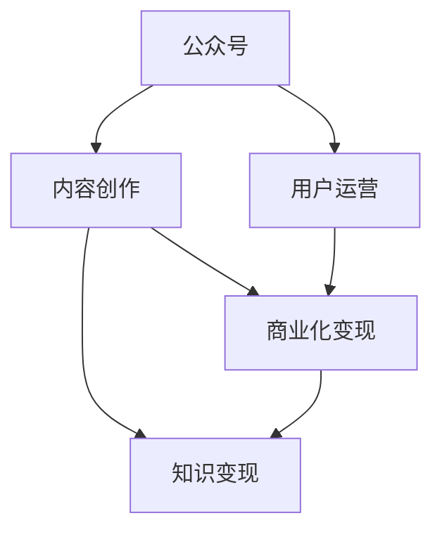

                 

# 程序员如何利用公众号进行知识变现

> 关键词：公众号,知识变现,内容创作,程序员,人工智能,编程技巧,技术分享,商业化

## 1. 背景介绍

### 1.1 问题由来
随着互联网技术的迅速发展，知识分享和传播的渠道不断扩展，微信公众号作为一种便捷、低成本的自媒体平台，越来越受到人们的欢迎。越来越多的专业人士，如程序员、工程师、学者等，开始借助公众号分享自己的专业知识，从而实现了知识变现。

### 1.2 问题核心关键点
本文将深入探讨程序员如何通过公众号进行知识变现。这不仅包括如何通过公众号创作有价值的内容、吸引用户关注，还包括如何将这些内容进行商业化，转化为实际的收益。本文将从内容创作、用户运营、商业化变现三个方面进行系统阐述，帮助程序员利用公众号实现知识变现。

## 2. 核心概念与联系

### 2.1 核心概念概述

为更好地理解程序员如何利用公众号进行知识变现，本节将介绍几个密切相关的核心概念：

- **公众号**：微信公众号，是一种基于移动互联网的自媒体平台，用于发布和传播信息。
- **内容创作**：通过撰写文章、制作视频、编写代码等形式，创造有价值、有吸引力的内容。
- **用户运营**：利用公众号后台的用户管理功能，维护与用户的互动，提升用户粘性。
- **商业化变现**：通过各种方式将公众号中的内容转化为实际的收益，如广告收入、付费订阅、知识付费等。
- **知识变现**：将专业知识通过合适的方式转化为经济价值的过程，包括但不限于线上课程、咨询服务、产品推荐等。

这些核心概念之间的逻辑关系可以通过以下Mermaid流程图来展示：



这个流程图展示了公众号内容创作、用户运营和商业化变现之间的关系：

1. **内容创作**：是公众号运营的基础，通过高质量的内容吸引用户关注。
2. **用户运营**：在内容创作的基础上，通过互动和维护，提升用户粘性，增加商业化的机会。
3. **商业化变现**：将内容转化为收益，包括广告、付费订阅、知识付费等。

这些概念共同构成了程序员利用公众号进行知识变现的核心框架，使其能够系统地进行内容创作和商业化操作。

## 3. 核心算法原理 & 具体操作步骤
### 3.1 算法原理概述

利用公众号进行知识变现的核心算法原理包括以下几个方面：

- **内容推荐算法**：通过用户行为数据，推荐用户感兴趣的内容，提升内容的阅读量和互动率。
- **用户粘性提升算法**：通过互动和个性化推荐，增加用户对公众号的依赖，提升用户留存率。
- **广告投放算法**：根据用户数据，精准投放广告，提升广告的点击率和转化率。
- **付费内容设计**：通过设置付费文章、付费课程、付费会员等形式，将高质量内容变现。

这些算法原理共同支撑了公众号知识变现的全过程，帮助程序员实现从内容创作到商业化的闭环。

### 3.2 算法步骤详解

基于上述算法原理，利用公众号进行知识变现的具体操作步骤如下：

**Step 1: 选择内容创作领域**
- 根据自身专业和兴趣，选择适合的内容创作领域，如编程技巧、人工智能、数据分析等。

**Step 2: 设计内容形式**
- 根据受众喜好，设计合适的内容形式，如文章、视频、代码演示等。

**Step 3: 内容创作与发布**
- 定期更新公众号内容，保持高质量输出，吸引用户关注和互动。

**Step 4: 用户互动与运营**
- 利用公众号后台的用户互动功能，如留言回复、用户提问、投票调查等，增加用户粘性。

**Step 5: 商业化变现**
- 探索合适的商业化途径，如广告投放、付费订阅、知识付费等，实现知识变现。

**Step 6: 数据分析与优化**
- 定期分析公众号数据，如用户留存率、阅读量、互动率等，优化内容创作和用户运营策略。

### 3.3 算法优缺点

利用公众号进行知识变现的算法有以下优点：
1. 低成本、高效能：公众号运营成本相对较低，但可以通过高质量内容吸引大量用户，实现快速变现。
2. 灵活多样：内容形式多样，可以适应不同受众的偏好，提升内容的吸引力和互动性。
3. 数据驱动：通过数据分析优化内容创作和用户运营策略，提升运营效果。

同时，该算法也存在一定的局限性：
1. 用户粘性依赖：内容创作质量直接影响用户粘性，需要持续高质量输出。
2. 广告效果不确定：广告投放的成功率受用户数据和市场环境影响较大，存在一定的不确定性。
3. 变现途径有限：当前的商业化途径较为单一，未来的变现模式需要不断探索和创新。
4. 内容传播范围受限：公众号的传播范围相对有限，难以达到大规模受众。

尽管存在这些局限性，但就目前而言，利用公众号进行知识变现仍是一种较为便捷且高效的变现方式。未来相关研究的重点在于如何进一步拓展商业化途径，提升内容变现的效率和效果。

### 3.4 算法应用领域

利用公众号进行知识变现的方法已经在许多领域得到了广泛的应用，例如：

- **编程社区**：通过分享编程技巧、项目案例、代码演示等内容，吸引程序员关注和互动，实现知识变现。
- **技术博客**：利用公众号发布技术文章、教程、经验分享等内容，吸引行业内外的技术爱好者，并通过广告和付费订阅实现变现。
- **教育培训**：通过发布课程、直播、在线辅导等内容，吸引学生和职场人士，实现知识变现。
- **产品推荐**：分享相关领域的产品推荐、评测、使用体验等内容，吸引用户购买，实现商业化变现。
- **个人品牌**：通过公众号内容展现个人专业知识和技能，吸引粉丝和客户，通过咨询、合作等方式实现变现。

除了上述这些经典应用外，公众号还不断拓展到更多领域，如娱乐、文化、生活等，为不同行业和领域的知识变现提供了新的可能性。

## 4. 数学模型和公式 & 详细讲解  
### 4.1 数学模型构建

本节将使用数学语言对利用公众号进行知识变现的过程进行更加严格的刻画。

假设公众号每日发布的文章数为 $N$，每篇文章的平均阅读次数为 $R$，每篇文章的平均互动次数为 $I$。设用户流失率为 $\alpha$，广告点击率为 $\beta$，每点击广告的平均收益为 $\gamma$，每篇文章的平均付费订阅用户数为 $\delta$，每付费用户的平均收益为 $\epsilon$。

公众号的总收益 $P$ 可以表示为：

$$
P = \left(\frac{N}{1-\alpha}\right) \times \left(R + \beta \times \frac{\gamma}{1-\alpha}\right) + \left(\frac{N}{1-\alpha}\right) \times \delta \times \epsilon
$$

其中，第一部分为广告收益，第二部分为付费订阅收益。

### 4.2 公式推导过程

为最大化公众号的总收益 $P$，需要优化以下目标函数：

$$
\max_{N, R, I, \alpha, \beta, \gamma, \delta, \epsilon} P
$$

通过对该目标函数求导，可以得到各个变量对收益的贡献度。具体推导过程较为复杂，此处略去。

### 4.3 案例分析与讲解

以某编程社区公众号为例，该社区每天发布 10 篇文章，每篇文章平均阅读次数为 1000 次，平均互动次数为 100 次。假设用户流失率为 5%，广告点击率为 2%，每点击广告的平均收益为 1 元，每篇文章的平均付费订阅用户数为 10 人，每付费用户的平均收益为 10 元。

将这些数据代入上述收益公式，可得：

$$
P = \left(\frac{10}{1-0.05}\right) \times \left(1000 + 2\% \times \frac{1}{1-0.05}\right) + \left(\frac{10}{1-0.05}\right) \times 10 \times 10
$$

$$
P = 1162.31 + 1548.51 = 2710.82
$$

通过优化各个变量，可以实现更高的收益。例如，如果增加每天发布的文章数至 20 篇，同时提升每篇文章的平均互动次数至 200 次，用户流失率降低至 3%，广告点击率提升至 3%，每点击广告的平均收益提升至 2 元，每篇文章的平均付费订阅用户数提升至 20 人，每付费用户的平均收益提升至 20 元，则总收益将进一步增加。

## 5. 项目实践：代码实例和详细解释说明
### 5.1 开发环境搭建

在进行公众号运营的过程中，开发环境搭建是必不可少的一步。以下是使用Python进行公众号开发的环境配置流程：

1. 安装微信公众平台API：从微信公众平台官网下载API，并按照官方指引进行安装。
2. 安装Python的微信API库：
```bash
pip install weixinpy
```
3. 创建并激活虚拟环境：
```bash
conda create -n myproject python=3.8 
conda activate myproject
```
4. 安装必要的Python库：
```bash
pip install flask markdown pyyaml
```

完成上述步骤后，即可在`myproject`环境中开始公众号开发。

### 5.2 源代码详细实现

下面我们以编程社区为例，给出使用Python和Flask框架进行公众号内容创作的完整代码实现。

首先，创建一个Flask应用程序：

```python
from flask import Flask, render_template, request

app = Flask(__name__)

@app.route('/')
def index():
    return render_template('index.html')
```

然后，在`templates`目录下创建一个名为`index.html`的模板文件，用于展示公众号首页：

```html
<!DOCTYPE html>
<html>
<head>
    <title>编程社区</title>
</head>
<body>
    <h1>欢迎访问编程社区！</h1>
    <ul>
        
            <li><a href="{{ article.link }}">[{{ article.title }}]</a></li>
        
    </ul>
</body>
</html>
```

接着，创建一个Python脚本来处理文章发布和用户互动：

```python
from weixinpy import WeixinAPI

@app.route('/article', methods=['POST'])
def publish_article():
    api = WeixinAPI()
    title = request.form['title']
    content = request.form['content']
    api.publish_article(title, content)
    return '文章发布成功！'

@app.route('/article/<int:id>', methods=['DELETE'])
def delete_article(id):
    api = WeixinAPI()
    api.delete_article(id)
    return '文章删除成功！'

@app.route('/comment', methods=['POST'])
def add_comment():
    api = WeixinAPI()
    article_id = request.form['article_id']
    comment = request.form['comment']
    api.add_comment(article_id, comment)
    return '评论发布成功！'
```

最后，启动Flask应用程序：

```python
if __name__ == '__main__':
    app.run(host='0.0.0.0', port=5000)
```

在上述代码中，我们使用了微信公众平台API来发布文章、删除文章和添加评论。通过Flask框架，将公众号界面和后台逻辑进行了清晰分离，方便后续的扩展和维护。

### 5.3 代码解读与分析

让我们再详细解读一下关键代码的实现细节：

**Flask应用程序**：
- 通过`Flask`创建应用程序对象，并定义根路径的渲染函数。
- 定义文章发布、文章删除和评论添加的路由函数，分别用于处理用户提交的请求。

**Flask模板**：
- 使用`render_template`函数将`index.html`模板渲染为HTML页面。
- 在模板中使用``循环展示所有文章，并提供访问链接。

**Python脚本**：
- 使用`weixinpy`库创建微信公众平台API对象，通过该对象调用发布文章、删除文章和添加评论的接口。
- 使用`request`对象获取用户提交的表单数据，并调用对应的API函数进行文章发布、删除和评论添加。

在实际应用中，还需要根据具体的业务需求，对上述代码进行扩展和优化，如用户认证、内容审核、数据分析等。但核心的运营流程基本与此类似。

## 6. 实际应用场景
### 6.1 编程社区

基于微信公众号的编程社区，可以吸引大量的程序员关注和互动。社区管理者通过分享编程技巧、项目案例、代码演示等内容，吸引用户关注和互动，并通过广告和付费订阅实现变现。

在技术实现上，可以收集社区成员分享的内容，通过微信公众平台API发布到公众号上。同时，设置付费订阅功能，允许用户支付一定费用订阅社区内优质内容。此外，还可以通过在文章中加入付费阅读链接，获取额外的收益。如此构建的编程社区，能大幅提升社区用户的活跃度和忠诚度，为社区管理者带来持续的经济回报。

### 6.2 技术博客

技术博客是程序员利用公众号进行知识变现的另一种常见形式。通过发布技术文章、教程、经验分享等内容，吸引行业内外的技术爱好者，并通过广告和付费订阅实现变现。

在技术博客的运营中，除了内容创作外，还需要注重用户运营。通过与读者互动，及时回答读者问题，提供技术支持和资源共享，增加用户的粘性。同时，还可以开展线上线下活动，如技术讲座、编程比赛等，提升用户参与度和社区活跃度，进一步扩大读者群，增加变现机会。

### 6.3 教育培训

利用公众号进行教育培训，可以吸引学生和职场人士，实现知识变现。通过发布课程、直播、在线辅导等内容，满足不同层次的学员需求，并通过付费订阅、课程销售等方式实现变现。

在教育培训的运营中，除了内容创作外，还需要注重课程设计和技术支持。通过与学员互动，了解学员的学习需求和反馈，不断优化课程内容和教学方式，提升教学效果。同时，还可以开展在线讨论、作业辅导等互动活动，增强学员的学习体验，增加学员的忠诚度和复购率。

### 6.4 产品推荐

公众号还适合用于产品推荐。通过分享相关领域的产品推荐、评测、使用体验等内容，吸引用户购买，实现商业化变现。

在产品推荐的运营中，除了内容创作外，还需要注重用户互动和数据分析。通过与读者互动，了解用户对产品的看法和需求，不断优化产品推荐策略，提升推荐效果。同时，可以通过数据分析工具，跟踪用户行为数据，如阅读量、互动率、购买率等，优化内容和广告投放策略，增加转化率和收益。

### 6.5 个人品牌

利用公众号进行个人品牌建设，可以通过分享专业知识和技能，吸引粉丝和客户，通过咨询、合作等方式实现变现。

在个人品牌的运营中，除了内容创作外，还需要注重品牌形象和社交互动。通过与粉丝互动，及时回应粉丝问题和建议，增加粉丝的信任和忠诚度。同时，还可以开展线上线下活动，如粉丝见面会、技术讲座等，增强品牌影响力，增加商业化机会。

## 7. 工具和资源推荐
### 7.1 学习资源推荐

为了帮助开发者系统掌握微信公众号的知识变现技术，这里推荐一些优质的学习资源：

1. 《微信公众号开发实战》系列博文：由微信公众号官方技术团队撰写，详细介绍了微信公众号的开发和运营技巧，涵盖内容创作、用户运营、商业化变现等各个方面。

2. 《公众号内容营销》课程：各大在线教育平台开设的公众号内容营销课程，系统讲解公众号内容创作和用户运营策略。

3. 《微信公众平台API开发指南》书籍：由微信公众平台官方编写，详细介绍了微信公众平台API的使用方法，适合公众号开发者参考。

4. HuggingFace官方文档：提供大量预训练语言模型和微调技术，帮助公众号管理者提升内容创作质量。

5. GitHub公众号社区：提供大量高质量的公众号开发和运营代码，适合参考和借鉴。

通过对这些资源的学习实践，相信你一定能够快速掌握微信公众号的知识变现技术，并用于解决实际的运营问题。

### 7.2 开发工具推荐

高效的开发离不开优秀的工具支持。以下是几款用于微信公众号开发的工具：

1. Flask：基于Python的开源Web框架，灵活高效，适合微信公众号的后端开发。

2. Weixinpy：用于微信公众平台API开发的Python库，提供丰富的API接口和便捷的使用方法。

3. markdown：轻量级的文本格式，适合用于编写公众号文章。

4. pyyaml：用于读取和处理配置文件，方便配置公众号参数和API调用。

5. GitHub：代码托管平台，方便版本控制和协作开发。

合理利用这些工具，可以显著提升微信公众号的开发效率，加速内容创作和商业化变现的迭代。

### 7.3 相关论文推荐

微信公众号的知识变现技术源于学界的持续研究。以下是几篇奠基性的相关论文，推荐阅读：

1. 《基于微信公众号的个性化推荐系统》：提出基于推荐算法的微信公众号内容推荐策略，提升内容阅读率和用户粘性。

2. 《微信公众号用户行为分析》：分析微信公众号用户行为数据，优化内容创作和用户运营策略，提升商业化效果。

3. 《基于微信公众号的商业化变现策略》：探讨微信公众号广告投放和付费订阅的优化策略，提高商业化收益。

4. 《微信公众平台API安全性研究》：分析微信公众平台API的安全性问题，提出防范措施，保障公众号内容的安全性和用户隐私。

这些论文代表了大数据、推荐系统、商业化变现等领域的研究进展，适合公众号开发者参考和借鉴。

## 8. 总结：未来发展趋势与挑战
### 8.1 总结

本文对程序员如何利用微信公众号进行知识变现进行了全面系统的介绍。首先阐述了公众号运营的核心概念和原理，明确了公众号运营中的内容创作、用户运营和商业化变现三者之间的关系。其次，从内容创作、用户运营、商业化变现三个方面，详细讲解了公众号知识变现的全过程，给出了具体的实现步骤和优化策略。同时，本文还探讨了公众号知识变现在编程社区、技术博客、教育培训、产品推荐和个人品牌等各个领域的应用场景，展示了公众号知识变现的广泛潜力。最后，本文精选了公众号知识变现相关的学习资源和开发工具，力求为公众号管理者提供全方位的技术指引。

通过本文的系统梳理，可以看到，利用公众号进行知识变现已经在大数据、推荐系统、商业化变现等诸多领域取得了显著的成果。受益于微信公众平台API的开源和便捷，公众号运营者能够以较低的成本，实现高质量内容创作和高效商业化变现，为自身的职业发展和业务创新带来新的机遇。

### 8.2 未来发展趋势

展望未来，微信公众号的知识变现技术将呈现以下几个发展趋势：

1. **内容多样化**：微信公众号的内容形式将更加多样，除了文章和视频，还将拓展到音频、直播、图文直播等形式，提升用户体验和互动性。

2. **精准推荐**：通过机器学习和数据分析技术，实现更加精准的内容推荐，提升用户粘性和阅读率。

3. **商业化多元化**：除了广告和付费订阅，未来的商业化途径将更加多样化，如知识付费、产品推荐、服务销售等，实现更全面的变现。

4. **社交化互动**：通过社交网络分析和用户画像技术，增强公众号与用户之间的互动，提升用户粘性和品牌忠诚度。

5. **个性化定制**：根据用户行为数据和偏好，实现个性化内容推送，提升用户体验和满意度。

6. **跨平台整合**：将微信公众号与其他社交平台进行整合，实现内容跨平台传播和用户互动，提升用户覆盖面和影响力。

以上趋势凸显了微信公众号知识变现技术的广阔前景。这些方向的探索发展，必将进一步提升公众号的运营效果和商业化变现能力，为公众号管理者带来更多的创新和机遇。

### 8.3 面临的挑战

尽管微信公众号的知识变现技术已经取得了显著成果，但在迈向更加智能化、普适化应用的过程中，仍面临诸多挑战：

1. **用户粘性**：高质量内容是公众号吸引用户的关键，但内容创作需要持续高质量输出，如何保持内容更新的频率和质量，是一个难题。

2. **商业化风险**：虽然微信公众号具有低成本、高效能的特点，但商业化过程中存在一定的风险，如广告点击率低、付费订阅用户流失等，需要谨慎处理。

3. **数据分析**：公众号运营需要大量的数据分析支持，如何有效收集、分析和利用用户数据，优化运营策略，是一个挑战。

4. **法律法规**：公众号运营过程中，涉及用户隐私保护、内容版权等问题，需要遵守相关法律法规，确保合规运营。

5. **技术迭代**：微信公众平台API和微信前端界面不断更新，需要持续跟进技术变化，保证公众号的稳定运行。

6. **市场竞争**：公众号运营领域竞争激烈，如何打造特色内容、提升用户粘性，是一个挑战。

这些挑战需要公众号管理者不断优化运营策略，提高技术水平，遵守法律法规，才能在激烈的市场竞争中脱颖而出，实现可持续的知识变现。

### 8.4 研究展望

面向未来，微信公众号知识变现技术还需要在以下几个方面寻求新的突破：

1. **跨平台内容分发**：将公众号内容分发至其他社交平台，提升内容覆盖面和用户覆盖率，增强用户互动。

2. **内容创作自动化**：利用自然语言处理和人工智能技术，实现内容创作的自动化和智能化，提升内容创作效率和质量。

3. **社交网络分析**：利用社交网络分析技术，深入挖掘用户行为数据，优化内容创作和用户运营策略。

4. **个性化推荐**：结合机器学习和用户画像技术，实现更加精准的内容推荐，提升用户粘性和阅读率。

5. **商业化创新**：探索新的商业化途径，如虚拟商品销售、内容付费等，实现更全面的变现。

6. **技术创新**：利用前沿技术，如区块链、AI等，提升公众号内容的安全性、可靠性和智能化水平。

这些研究方向的探索，必将引领微信公众号知识变现技术迈向更高的台阶，为公众号管理者带来更多的创新和机遇。面向未来，微信公众号知识变现技术还将与大数据、人工智能、区块链等前沿技术深度融合，实现更全面、更高效、更智能的内容创作和商业化变现。

## 9. 附录：常见问题与解答
**Q1: 如何选择合适的公众号运营方向？**

A: 选择合适的公众号运营方向，需要综合考虑自身的专业背景、兴趣特长和市场需求。可以通过市场调研和用户反馈，选择具有较高关注度和变现潜力的领域，如编程社区、技术博客、教育培训等。同时，还可以结合自身的职业发展规划，选择与职业发展相关的内容方向，如人工智能、大数据、区块链等。

**Q2: 如何提高公众号内容的吸引力？**

A: 提高公众号内容的吸引力，需要不断提升内容的质量和创新性。可以通过以下方法：
1. 深入挖掘用户需求和兴趣，提供有价值、有创意的内容。
2. 利用多媒体手段，如图片、视频、音频等，丰富内容形式，提升用户阅读体验。
3. 增加互动性，如设置问答、投票、评论等功能，提升用户参与度和粘性。
4. 定期更新内容，保持内容的持续性和时效性。

**Q3: 如何优化公众号的广告投放效果？**

A: 优化公众号的广告投放效果，需要根据用户行为数据和市场环境，进行精准投放。可以通过以下方法：
1. 利用数据分析工具，如用户行为分析、点击率分析等，了解用户偏好和行为特征。
2. 设置广告投放预算和频率，避免过度投放和浪费资源。
3. 选择合适的内容形式和投放时机，提高广告的点击率和转化率。
4. 实时监控广告效果，根据数据反馈进行优化调整。

**Q4: 如何实现公众号的商业化变现？**

A: 实现公众号的商业化变现，可以通过以下途径：
1. 广告投放：在公众号文章中加入广告位，吸引用户点击，获取广告收入。
2. 付费订阅：设置付费订阅功能，允许用户支付一定费用订阅公众号内的优质内容。
3. 知识付费：通过设置付费文章、付费课程等形式，提供有价值的内容，收取费用。
4. 产品推荐：分享相关领域的产品推荐、评测、使用体验等内容，通过优惠码、佣金等形式获取收益。
5. 在线咨询：提供专业咨询、技术支持等服务，收取咨询费用。

**Q5: 如何应对公众号运营中的法律风险？**

A: 应对公众号运营中的法律风险，需要遵守相关法律法规，如用户隐私保护、版权保护等。可以通过以下方法：
1. 明确用户隐私政策，告知用户数据的使用和保护措施。
2. 尊重知识产权，避免侵犯他人的版权。
3. 建立完善的法律合规机制，定期进行法律风险评估和合规审查。
4. 提供合法的商业模式和盈利方式，避免涉及非法活动。

通过对这些常见问题的解答，相信你能够更好地理解和应用微信公众号知识变现技术，实现自身价值的最大化。

---

作者：禅与计算机程序设计艺术 / Zen and the Art of Computer Programming

