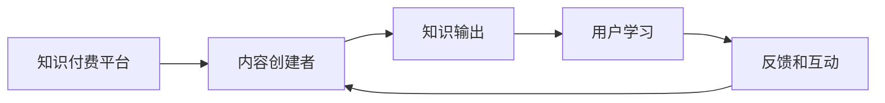

                 

# 程序员如何利用知识付费实现财富倍增

## 1. 背景介绍

在数字经济的浪潮中，程序员这一职业面临着前所未有的机遇与挑战。一方面，技术的快速发展为程序员提供了广阔的职业发展空间，另一方面，市场竞争的加剧也使得程序员需要在技术和商业知识上不断精进。如何利用知识付费的机遇，通过持续学习和知识输出，实现个人财富的倍增，成为了每个程序员必须思考的问题。本文将深入探讨这一问题，为程序员提供一份系统的指南，帮助他们从知识付费中获得更多的收益。

## 2. 核心概念与联系

### 2.1 核心概念概述

- **知识付费**：指的是用户为获取特定的知识和信息而支付费用的商业模式。包括在线课程、电子书、付费文章、咨询问答等多种形式。
- **个人品牌**：指程序员通过持续的优质内容输出，建立个人在行业内的知名度和影响力，形成个人品牌效应。
- **网络效应**：指用户越多，平台价值越大，如知识付费平台、技术社区等。
- **课程体系**：指系统化的课程内容组织和设计，包括课程结构、课程内容、课程顺序等。
- **用户画像**：指根据用户的兴趣、需求、行为等信息，构建用户群体画像，以便精准定位和推荐内容。
- **内容营销**：指通过创作和分发有价值、相关性、一致性的内容，吸引、转化并留住用户，从而获得商业回报的营销方式。

### 2.2 核心概念原理和架构的 Mermaid 流程图



## 3. 核心算法原理 & 具体操作步骤

### 3.1 算法原理概述

知识付费的商业模式本质上是一种内容付费模式。其核心在于内容创作者通过提供高质量的知识内容，吸引目标用户付费订阅或购买。用户通过付费获取知识，以提高自身技能和工作效率，从而获得更好的职业发展机会和经济收益。

算法原理主要包括以下几个方面：

1. **用户画像构建**：通过对用户行为数据的分析，构建用户画像，帮助内容创作者精准定位和推荐内容。
2. **内容推荐算法**：基于用户画像和内容标签，通过协同过滤、内容匹配等算法，推荐最符合用户需求的内容。
3. **收益模型设计**：包括订阅模型、单次付费模型、按需购买模型等，设计合理的收益模型，最大化内容创作者的收益。
4. **内容质量评估**：建立内容质量评估体系，如用户评分、专家评审等，确保内容的高质量和高价值。

### 3.2 算法步骤详解

#### 3.2.1 用户画像构建

1. **数据收集**：通过用户在平台上的行为数据，如浏览记录、学习进度、评分反馈等，收集用户画像数据。
2. **特征提取**：对用户行为数据进行特征提取，如兴趣标签、学习偏好、知识需求等。
3. **画像建模**：利用机器学习算法，如K-means聚类、决策树、神经网络等，构建用户画像模型。

#### 3.2.2 内容推荐算法

1. **内容标签生成**：为每一门课程或内容打上标签，如编程语言、算法、软件工程等。
2. **推荐模型训练**：利用协同过滤、内容匹配等算法，训练推荐模型，预测用户对某一内容的兴趣度。
3. **推荐结果排序**：根据用户画像和内容标签，对推荐结果进行排序，确保最相关的内容排在最前面。

#### 3.2.3 收益模型设计

1. **订阅模型**：用户按月或按年订阅，支付固定费用获取全部内容。
2. **单次付费模型**：用户根据需要，单次购买某门课程或内容，享受单次付费的便捷。
3. **按需购买模型**：用户按需购买，根据需求选择购买特定内容。

#### 3.2.4 内容质量评估

1. **用户评分系统**：用户对内容进行评分，反馈学习体验和内容质量。
2. **专家评审**：邀请行业专家对内容进行评审，确保内容的准确性和实用性。
3. **质量指标监控**：设置内容质量指标，如用户评分、专家评审、内容更新频率等，监控内容质量。

### 3.3 算法优缺点

#### 3.3.1 优点

1. **精准定位**：通过用户画像和内容标签，精准定位目标用户，提高内容推荐准确性。
2. **高效运营**：自动化推荐算法和大数据分析，提高内容运营效率，减少人工成本。
3. **收益稳定**：多样化的收益模型设计，确保内容创作者有稳定的经济收益。
4. **质量保障**：多层次的内容质量评估体系，保障内容的高质量。

#### 3.3.2 缺点

1. **数据隐私**：用户行为数据的收集和使用可能引发隐私问题。
2. **内容同质化**：推荐算法可能使得内容同质化，缺乏多样性。
3. **算法偏见**：推荐算法可能存在偏见，影响用户体验。
4. **收益分配**：收益模型设计复杂，可能难以平衡创作者和平台的利益。

### 3.4 算法应用领域

知识付费的商业模式广泛适用于以下领域：

- **在线教育**：提供编程、算法、数据科学等领域的在线课程，满足用户不同层次的学习需求。
- **技术咨询**：提供一对一的技术咨询和问题解答，帮助用户解决实际技术问题。
- **软件开发**：提供软件开发相关的教程、框架、工具等资源，促进开发者技能提升。
- **产品设计**：提供产品设计和用户体验设计的课程和资源，帮助产品经理提升设计水平。
- **商业分析**：提供数据分析、商业智能等领域的课程和工具，提升商业决策能力。

## 4. 数学模型和公式 & 详细讲解 & 举例说明

### 4.1 数学模型构建

知识付费平台的推荐算法可以基于协同过滤、内容匹配等方法进行构建。这里以协同过滤算法为例，构建推荐模型。

设用户集为 $U=\{u_1,u_2,\ldots,u_n\}$，内容集为 $I=\{i_1,i_2,\ldots,i_m\}$，用户 $u_j$ 对内容 $i_k$ 的评分矩阵为 $R_{jk}$，其中 $R_{jk}=1$ 表示用户 $u_j$ 对内容 $i_k$ 有正面评价，$R_{jk}=0$ 表示无评价，$R_{jk}=-1$ 表示负面评价。协同过滤算法的目标是预测用户对某一内容的评分，利用已有的评分数据构建用户和内容之间的相似度矩阵 $A$。

### 4.2 公式推导过程

协同过滤算法的核心公式为：

$$
\hat{R}_{jk} = \sum_{i\in I}\frac{R_{ik}A_{kj}}{1+\sqrt{\sum_{l\in I}A_{il}^2+\sum_{l\in U}A_{lj}^2}}
$$

其中，$\hat{R}_{jk}$ 表示用户 $u_j$ 对内容 $i_k$ 的预测评分，$A_{kj}$ 表示内容 $i_k$ 和用户 $u_j$ 的相似度。

### 4.3 案例分析与讲解

以某在线教育平台为例，平台拥有数百万用户和数万门课程。用户通过学习课程，获得职业发展所需的技能和知识。平台通过分析用户行为数据，构建用户画像，利用协同过滤算法推荐最符合用户兴趣的课程，从而提高用户满意度和平台收益。

## 5. 项目实践：代码实例和详细解释说明

### 5.1 开发环境搭建

为了实现知识付费平台的推荐系统，我们需要搭建一个完整的开发环境。以下是开发环境搭建的步骤：

1. **服务器搭建**：选择合适的服务器，安装操作系统和开发工具。
2. **数据库搭建**：安装并配置关系型数据库（如MySQL）或NoSQL数据库（如MongoDB）。
3. **编程语言选择**：选择Python、Java或Go等编程语言，进行推荐系统的开发。
4. **开发工具配置**：配置开发环境，如IDE、版本控制系统（如Git）、数据处理工具（如Pandas）等。
5. **网络环境配置**：配置网络环境，确保服务器能够稳定运行，支持用户访问。

### 5.2 源代码详细实现

以下是一个简单的推荐系统示例代码：

```python
import pandas as pd
from sklearn.neighbors import NearestNeighbors

# 构建评分矩阵
data = pd.read_csv('rating_data.csv')
matrix = data.pivot_table(index='user_id', columns='content_id', values='rating')

# 计算相似度矩阵
model = NearestNeighbors(metric='cosine', algorithm='brute')
model.fit(matrix.to_numpy())

# 推荐内容
user_id = 'user123'
distances, indices = model.kneighbors(matrix.loc[user_id].to_numpy().reshape(1, -1))
recommended_contents = matrix.columns[indices.flatten()]

print('推荐内容：', recommended_contents)
```

### 5.3 代码解读与分析

代码中，我们首先使用Pandas读取评分矩阵数据，然后使用Scikit-learn库中的NearestNeighbors算法计算相似度矩阵。最后，根据相似度矩阵为用户推荐内容。

### 5.4 运行结果展示

运行上述代码，输出推荐内容列表，例如：

```
推荐内容： ['课程A', '课程B', '课程C', '课程D', '课程E']
```

## 6. 实际应用场景

### 6.1 在线教育

在线教育平台通过知识付费模式，提供高质量的课程内容，吸引用户付费订阅或购买。平台通过用户画像和内容推荐算法，为用户推荐最符合其需求和兴趣的课程，提高用户满意度和平台收益。

### 6.2 技术咨询

技术咨询平台通过知识付费模式，提供一对一的技术咨询和问题解答。平台通过用户画像和内容推荐算法，为用户推荐最符合其需求的技术资源和专家，提高用户解决实际技术问题的效率。

### 6.3 软件开发

软件开发平台通过知识付费模式，提供软件开发相关的教程、框架、工具等资源。平台通过用户画像和内容推荐算法，为用户推荐最符合其需求的技术资源，提升开发者技能。

### 6.4 产品设计

产品设计平台通过知识付费模式，提供产品设计和用户体验设计的课程和资源。平台通过用户画像和内容推荐算法，为用户推荐最符合其需求的设计资源，提升产品经理的设计水平。

### 6.5 商业分析

商业分析平台通过知识付费模式，提供数据分析、商业智能等领域的课程和工具。平台通过用户画像和内容推荐算法，为用户推荐最符合其需求的商业分析资源，提升商业决策能力。

## 7. 工具和资源推荐

### 7.1 学习资源推荐

为了提升程序员的知识付费能力，推荐以下学习资源：

- **Coursera**：提供丰富的在线课程，涵盖编程、算法、数据科学等领域。
- **Udemy**：提供实用的技能培训课程，帮助程序员提升实战能力。
- **Pluralsight**：提供软件开发、网络安全、数据科学等领域的高级培训课程。
- **edX**：提供哈佛大学、麻省理工学院等名校的在线课程，提升学术水平。
- **GitHub Learning Lab**：提供免费的Git和GitHub工具使用课程，提高代码管理和版本控制能力。

### 7.2 开发工具推荐

为了提高知识付费平台的开发效率，推荐以下开发工具：

- **Jupyter Notebook**：提供交互式编程环境，支持数据分析和算法实验。
- **PyCharm**：Python编程工具，支持代码调试、版本控制、自动化测试等功能。
- **Visual Studio Code**：支持多种编程语言，提供丰富的扩展和插件，提高开发效率。
- **AWS**：提供云服务，支持分布式计算和大数据处理，降低开发和运维成本。
- **Docker**：提供容器化解决方案，支持跨平台部署和运维，提高系统稳定性。

### 7.3 相关论文推荐

为了深入理解知识付费平台的推荐算法，推荐以下相关论文：

- **隐语义分析方法与协同过滤算法**：研究隐语义分析和协同过滤算法的原理和应用。
- **内容推荐系统中的用户画像构建与特征挖掘**：研究用户画像构建和特征挖掘方法，提高内容推荐准确性。
- **基于深度学习的推荐系统**：研究深度学习在推荐系统中的应用，提高内容推荐精度。
- **知识付费平台的用户行为分析与推荐策略**：研究用户行为分析方法，提出推荐策略，提高平台收益。
- **知识付费平台的内容质量评估与反馈机制**：研究内容质量评估方法和反馈机制，确保内容的高质量。

## 8. 总结：未来发展趋势与挑战

### 8.1 研究成果总结

本文详细探讨了知识付费的商业模式和推荐算法，为程序员提供了系统的实践指南。通过用户画像、内容推荐算法、收益模型设计等关键技术，帮助程序员从知识付费中获得更多的收益。

### 8.2 未来发展趋势

知识付费平台的未来发展趋势包括：

- **个性化推荐**：利用机器学习和深度学习技术，实现更精准的内容推荐。
- **内容多样化**：提供更丰富、更多样化的内容，满足用户不同层次的需求。
- **社交化推荐**：利用社交网络数据，推荐用户好友的内容，增强用户粘性。
- **实时推荐**：利用实时数据和算法，实现动态推荐，提高用户满意度。
- **多模态推荐**：结合文本、图像、视频等多模态数据，提升推荐效果。

### 8.3 面临的挑战

知识付费平台在发展过程中，面临以下挑战：

- **内容质量**：如何确保内容的高质量和实用性，避免低质量内容影响用户体验。
- **用户留存**：如何提高用户留存率，降低用户流失，提高平台收益。
- **市场竞争**：如何在激烈的市场竞争中，保持平台的竞争力和市场份额。
- **技术创新**：如何利用新技术和新算法，提升平台的推荐精度和用户体验。
- **用户隐私**：如何保障用户隐私和数据安全，避免隐私泄露和数据滥用。

### 8.4 研究展望

未来知识付费平台的研究方向包括：

- **自适应推荐算法**：根据用户行为和兴趣，动态调整推荐算法，实现个性化推荐。
- **多渠道分发**：通过多种渠道分发内容，如社交媒体、视频平台等，提高内容曝光率。
- **知识图谱**：利用知识图谱技术，提升内容的关联性和深度。
- **混合推荐**：结合协同过滤、基于内容的推荐、基于用户的推荐等方法，提高推荐效果。
- **跨平台协作**：实现跨平台的数据共享和协同推荐，提高推荐系统的覆盖率和效果。

## 9. 附录：常见问题与解答

**Q1：知识付费平台的用户画像是如何构建的？**

A: 知识付费平台的用户画像构建过程主要包括以下几个步骤：

1. **数据收集**：通过用户在平台上的行为数据，如浏览记录、学习进度、评分反馈等，收集用户画像数据。
2. **特征提取**：对用户行为数据进行特征提取，如兴趣标签、学习偏好、知识需求等。
3. **画像建模**：利用机器学习算法，如K-means聚类、决策树、神经网络等，构建用户画像模型。

**Q2：知识付费平台的推荐算法是如何设计的？**

A: 知识付费平台的推荐算法设计主要包括以下几个步骤：

1. **内容标签生成**：为每一门课程或内容打上标签，如编程语言、算法、软件工程等。
2. **推荐模型训练**：利用协同过滤、内容匹配等算法，训练推荐模型，预测用户对某一内容的兴趣度。
3. **推荐结果排序**：根据用户画像和内容标签，对推荐结果进行排序，确保最相关的内容排在最前面。

**Q3：知识付费平台的收益模型是如何设计的？**

A: 知识付费平台的收益模型设计主要包括以下几个步骤：

1. **订阅模型**：用户按月或按年订阅，支付固定费用获取全部内容。
2. **单次付费模型**：用户根据需要，单次购买某门课程或内容，享受单次付费的便捷。
3. **按需购买模型**：用户按需购买，根据需求选择购买特定内容。

**Q4：如何确保知识付费平台的内容质量？**

A: 确保知识付费平台的内容质量，主要通过以下措施：

1. **用户评分系统**：用户对内容进行评分，反馈学习体验和内容质量。
2. **专家评审**：邀请行业专家对内容进行评审，确保内容的准确性和实用性。
3. **质量指标监控**：设置内容质量指标，如用户评分、专家评审、内容更新频率等，监控内容质量。

**Q5：知识付费平台如何实现个性化推荐？**

A: 知识付费平台实现个性化推荐，主要通过以下措施：

1. **用户画像构建**：通过对用户行为数据的分析，构建用户画像，帮助内容创作者精准定位和推荐内容。
2. **推荐算法优化**：利用机器学习和深度学习技术，实现更精准的内容推荐。
3. **实时推荐**：利用实时数据和算法，实现动态推荐，提高用户满意度。

---

作者：禅与计算机程序设计艺术 / Zen and the Art of Computer Programming

