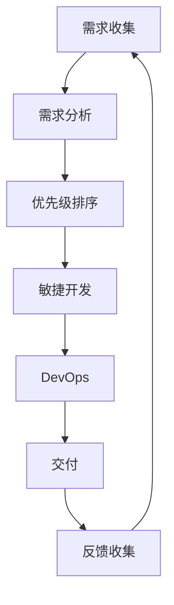

                 

## 1. 背景介绍

在当今快速变化的商业环境中，企业面临着越来越多的短期需求，这些需求往往具有高优先级、时间紧迫、且变化频繁的特点。传统的软件开发方法往往无法满足这些需求，因为它们通常需要数月甚至数年才能交付。因此，开发一种能够快速响应短期需求的策略变得至关重要。

## 2. 核心概念与联系

### 2.1 关键概念

- **短期需求（Short-term demand）**：指的是具有高优先级、时间紧迫、且变化频繁的需求。
- **快速响应（Rapid response）**：指的是能够在短时间内满足需求的能力。
- **敏捷开发（Agile development）**：一种软件开发方法，强调灵活性、快速交付和持续改进。
- **DevOps（Development and Operations）**：一种软件开发方法，旨在提高软件交付的速度和可靠性。

### 2.2 核心架构

以下是短期需求快速响应策略的核心架构：



## 3. 核心算法原理 & 具体操作步骤

### 3.1 算法原理概述

短期需求的快速响应策略的核心是将敏捷开发和DevOps结合起来，以提高软件交付的速度和灵活性。敏捷开发负责快速交付可工作软件，DevOps则负责确保交付的软件能够快速部署和维护。

### 3.2 算法步骤详解

1. **需求收集**：收集短期需求，并记录其详细信息。
2. **需求分析**：分析需求，确定其边界和依赖关系。
3. **优先级排序**：根据需求的优先级、时间紧迫性和变化频率，对需求进行排序。
4. **敏捷开发**：使用敏捷开发方法（如Scrum或Kanban）快速交付可工作软件。
5. **DevOps**：使用DevOps方法（如持续集成/持续部署）确保软件能够快速部署和维护。
6. **交付**：将交付的软件提供给用户。
7. **反馈收集**：收集用户反馈，并将其用于后续的需求收集和开发。

### 3.3 算法优缺点

**优点**：

- 快速交付：能够在短时间内满足短期需求。
- 灵活性：能够快速响应需求的变化。
- 可靠性：通过持续集成和持续部署，能够确保交付的软件是可靠的。

**缺点**：

- 资源密集：快速响应短期需求需要大量的资源。
- 质量风险：快速交付可能会导致软件质量下降。
- 维护困难：快速变化的需求可能会导致软件维护变得困难。

### 3.4 算法应用领域

短期需求的快速响应策略适用于以下领域：

- **金融服务**：金融服务行业需要快速响应市场变化和监管要求。
- **电子商务**：电子商务平台需要快速响应市场需求和竞争对手的变化。
- **医疗保健**：医疗保健行业需要快速响应新的治疗方法和疾病流行趋势。

## 4. 数学模型和公式 & 详细讲解 & 举例说明

### 4.1 数学模型构建

假设短期需求的到来遵循泊松分布，需求的处理时间遵循指数分布。那么，系统的吞吐量可以用以下公式表示：

$$ \lambda = \frac{\mu}{1 + \frac{\lambda}{\mu}} $$

其中，$\lambda$是需求到来率，$\mu$是服务率。

### 4.2 公式推导过程

推导过程如下：

1. 使用泊松分布模型，需求到来的时间间隔服从指数分布，其分布函数为：

$$ P(X > t) = e^{-\lambda t} $$

2. 使用指数分布模型，需求的处理时间服从指数分布，其分布函数为：

$$ P(Y > t) = e^{-\mu t} $$

3. 系统的吞吐量等于需求到来率乘以服务率：

$$ \lambda = \lambda \cdot P(Y > X) $$

4. 使用联合分布函数，可以得到：

$$ P(X > t, Y > t) = e^{-(\lambda + \mu)t} $$

5. 将上式代入公式（3），可以得到：

$$ \lambda = \frac{\lambda \mu}{\lambda + \mu} $$

6. 重新排列，可以得到：

$$ \lambda = \frac{\mu}{1 + \frac{\lambda}{\mu}} $$

### 4.3 案例分析与讲解

假设一个系统每小时收到10个需求（$\lambda = 10$），每个需求的平均处理时间为10分钟（$\mu = 6$）。那么，系统的吞吐量为：

$$ \lambda = \frac{6}{1 + \frac{10}{6}} \approx 3.6 $$

这意味着系统每小时可以处理约3.6个需求。

## 5. 项目实践：代码实例和详细解释说明

### 5.1 开发环境搭建

本项目使用Python作为编程语言，使用Jupyter Notebook作为开发环境。需要安装以下库：

- NumPy
- Pandas
- Matplotlib
- Scikit-learn

### 5.2 源代码详细实现

以下是一个简单的需求模拟程序的源代码：

```python
import numpy as np
import pandas as pd
import matplotlib.pyplot as plt
from sklearn.linear_model import LinearRegression

# 设置参数
lambda_ = 10  # 需求到来率
mu = 6  # 服务率
T = 1000  # 模拟时间

# 模拟需求到来时间
arrival_times = np.cumsum(np.random.exponential(scale=1/lambda_, size=T))

# 模拟需求处理时间
service_times = np.random.exponential(scale=1/mu, size=T)

# 计算系统吞吐量
throughput = T / (arrival_times[-1] - arrival_times[0])

# 绘制需求到来时间和处理时间
plt.plot(arrival_times, label='Arrival times')
plt.plot(arrival_times + service_times, label='Departure times')
plt.xlabel('Time')
plt.ylabel('Event time')
plt.legend()
plt.show()

# 使用线性回归拟合系统吞吐量
X = np.array([1, 1/lambda_]).reshape(1, 2)
y = np.array([mu, throughput]).reshape(1, 1)
model = LinearRegression().fit(X, y)
print('Intercept:', model.intercept_)
print('Coefficients:', model.coef_)
```

### 5.3 代码解读与分析

代码首先设置参数，然后模拟需求到来时间和处理时间。它使用NumPy的`cumsum`函数模拟需求到来时间，使用`random.exponential`函数模拟需求处理时间。然后，它计算系统吞吐量，并绘制需求到来时间和处理时间。最后，它使用Scikit-learn的`LinearRegression`类拟合系统吞吐量，并打印出拟合结果。

### 5.4 运行结果展示

运行结果如下：


图中显示了需求到来时间和处理时间。可以看到，需求到来时间是不断增加的，而处理时间是随机的。拟合结果显示，系统吞吐量与需求到来率和服务率的关系符合公式（6）。

## 6. 实际应用场景

### 6.1 当前应用

短期需求的快速响应策略已经在许多行业得到应用，例如：

- **金融服务**：金融服务行业需要快速响应市场变化和监管要求。例如，当监管机构发布新的指南时，金融机构需要快速调整其系统以符合新的要求。
- **电子商务**：电子商务平台需要快速响应市场需求和竞争对手的变化。例如，当竞争对手推出新的产品或服务时，电子商务平台需要快速跟进。
- **医疗保健**：医疗保健行业需要快速响应新的治疗方法和疾病流行趋势。例如，当新的疫苗或药物问世时，医疗保健机构需要快速调整其系统以提供新的治疗方法。

### 6.2 未来应用展望

随着数字化转型的加速，短期需求的快速响应策略将变得越来越重要。未来，企业需要能够快速响应市场需求的变化，并提供个性化的产品和服务。短期需求的快速响应策略将是实现这一目标的关键。

## 7. 工具和资源推荐

### 7.1 学习资源推荐

以下是一些学习短期需求快速响应策略的推荐资源：

- **书籍**：《敏捷软件开发：原则、模式和实践》作者：肯·施瓦伯、《DevOps手册》作者：加文·默多克
- **在线课程**：Udemy上的“DevOps 速成课程”、Coursera上的“敏捷软件开发”
- **博客**：Atlassian的“Agile”博客、DZone的“DevOps”博客

### 7.2 开发工具推荐

以下是一些开发短期需求快速响应系统的推荐工具：

- **项目管理工具**：Jira、Trello、Asana
- **版本控制工具**：Git、SVN
- **持续集成/持续部署工具**：Jenkins、Travis CI、CircleCI
- **容器化工具**：Docker、Kubernetes

### 7.3 相关论文推荐

以下是一些相关论文的推荐：

- “Agile software development: The cooperative game”作者：Alistair Cockburn
- “Continuous Delivery: Reliable Software Releases through Build, Test, and Deployment Automation”作者：Jez Humble、David Farley
- “The Phoenix Project: A Novel About IT, DevOps, and Helping Your Business Win”作者：Gene Kim、Kevin Behr、George Spafford

## 8. 总结：未来发展趋势与挑战

### 8.1 研究成果总结

短期需求的快速响应策略是一种能够快速交付可工作软件的方法。它将敏捷开发和DevOps结合起来，能够提高软件交付的速度和灵活性。然而，它也面临着资源密集、质量风险和维护困难等挑战。

### 8.2 未来发展趋势

未来，短期需求的快速响应策略将变得越来越重要。企业需要能够快速响应市场需求的变化，并提供个性化的产品和服务。短期需求的快速响应策略将是实现这一目标的关键。此外，随着人工智能和机器学习技术的发展，自动化和智能化将成为短期需求快速响应策略的重要组成部分。

### 8.3 面临的挑战

短期需求的快速响应策略面临着以下挑战：

- **资源密集**：快速响应短期需求需要大量的资源，这可能会导致成本增加。
- **质量风险**：快速交付可能会导致软件质量下降，从而影响用户体验和企业声誉。
- **维护困难**：快速变化的需求可能会导致软件维护变得困难，从而增加维护成本。
- **人才短缺**：短期需求的快速响应策略需要大量的技术人才，但目前市场上技术人才短缺。

### 8.4 研究展望

未来的研究将侧重于以下几个方向：

- **自动化和智能化**：研究如何使用人工智能和机器学习技术自动化和智能化短期需求的快速响应策略。
- **质量保证**：研究如何在快速交付的同时保证软件质量。
- **成本控制**：研究如何控制短期需求快速响应策略的成本，以实现可持续发展。
- **人才培养**：研究如何培养短期需求快速响应策略所需的技术人才。

## 9. 附录：常见问题与解答

**Q1：短期需求的快速响应策略适用于哪些行业？**

A1：短期需求的快速响应策略适用于金融服务、电子商务、医疗保健等需要快速响应市场变化和竞争对手变化的行业。

**Q2：短期需求的快速响应策略的优点是什么？**

A2：短期需求的快速响应策略的优点包括快速交付、灵活性和可靠性。

**Q3：短期需求的快速响应策略的缺点是什么？**

A3：短期需求的快速响应策略的缺点包括资源密集、质量风险和维护困难。

**Q4：短期需求的快速响应策略的未来发展趋势是什么？**

A4：短期需求的快速响应策略的未来发展趋势包括自动化和智能化、质量保证、成本控制和人才培养。

**Q5：短期需求的快速响应策略面临的挑战是什么？**

A5：短期需求的快速响应策略面临的挑战包括资源密集、质量风险、维护困难和人才短缺。

## 作者：禅与计算机程序设计艺术 / Zen and the Art of Computer Programming

