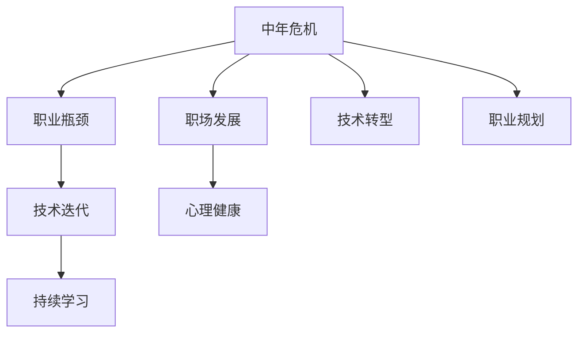

                 

# 程序员如何应对中年危机与职业瓶颈

> 关键词：中年危机,职业瓶颈,技术迭代,持续学习,职场发展,心理健康,技术转型,职业规划

## 1. 背景介绍

随着技术的不断进步和行业竞争的加剧，程序员职业生涯的中年危机和职业瓶颈问题变得愈发突出。一方面，新技术层出不穷，学习曲线陡峭；另一方面，行业需求快速变化，技能更新速度加快。在这种趋势下，如何有效应对职业发展中的各种挑战，实现技术能力与职业价值的双提升，成为每个程序员都必须面对的问题。本文旨在深入探讨程序员如何在技术不断迭代和行业竞争加剧的环境中，保持职场竞争力，实现自我突破。

## 2. 核心概念与联系

### 2.1 核心概念概述

为更好地理解如何在技术迭代和行业竞争加剧的环境中应对职业瓶颈，我们需要首先理解以下几个核心概念：

- **中年危机**：指人在中年后，职业发展停滞不前，面临技术落后、技能老化、职业路径受限等问题，导致内心焦虑和职业困惑。
- **职业瓶颈**：指人在职业发展过程中，由于技能单一、知识老化、行业动态变化等原因，难以继续提升，在现有职位上无法获得进一步发展的现象。
- **技术迭代**：指在技术领域，新技术、新工具、新方法不断涌现，旧有技术逐渐被淘汰的过程。
- **持续学习**：指不断更新和拓展知识技能，保持与行业发展同步，避免因技术停滞导致职业瓶颈的问题。
- **职场发展**：指通过提升技术能力、调整职业路径、建立人脉网络等手段，实现职业成长和职位晋升。
- **心理健康**：指在职业发展过程中保持积极的心态，应对压力和挑战，提升生活质量和幸福感。
- **技术转型**：指根据行业趋势和个人兴趣，转换技术和职业方向，实现技能升级和职业发展的过程。
- **职业规划**：指根据个人兴趣、能力和市场需求，制定长期职业目标，规划职业发展路径。

这些核心概念之间的逻辑关系可以通过以下Mermaid流程图来展示：



这个流程图展示了一系列的因果关系，即中年危机可能导致职业瓶颈，技术迭代要求持续学习，职场发展有助于心理健康，技术转型和职业规划是应对中年危机的关键手段。

## 3. 核心算法原理 & 具体操作步骤

### 3.1 算法原理概述

应对职业瓶颈的核心算法原理，是通过技术转型和持续学习，不断提升自身技能，适应技术迭代和行业变化，从而实现职业生涯的持续发展。这一过程可以分解为以下几个关键步骤：

1. **识别瓶颈**：评估自身技能与行业需求之间的差距，确定技术转型和持续学习的方向。
2. **制定计划**：根据个人兴趣、市场需求和行业趋势，制定详细的学习和发展计划。
3. **执行学习**：通过线上课程、实战项目、技术社区等途径，系统地学习和实践新技能。
4. **评估反馈**：定期评估学习效果，调整学习计划，确保不断进步。
5. **应用实践**：将新技能应用到实际项目中，积累经验，提升实战能力。
6. **调整规划**：根据行业变化和个人成长，调整职业规划，保持持续发展的动力。

### 3.2 算法步骤详解

**Step 1: 识别技术瓶颈**

- **技能评估**：列出当前掌握的技能，对比市场需求和技术发展趋势，识别出需要提升或学习的新技能。
- **差距分析**：分析自身技能与目标岗位或技术方向的差距，确定需要重点提升的领域。
- **市场需求**：研究行业趋势和未来技术方向，了解新技能的市场需求和应用前景。

**Step 2: 制定学习计划**

- **设定目标**：明确学习目标和时间节点，如掌握某项技术、通过某项认证等。
- **选择资源**：选择适合的线上课程、书籍、实战项目等学习资源，制定详细学习路径。
- **分配时间**：根据工作和生活情况，合理分配学习时间，确保持续学习。

**Step 3: 执行学习过程**

- **线上学习**：利用Coursera、Udacity、edX等平台，系统学习新技能。
- **实战练习**：通过GitHub、LeetCode、Kaggle等平台，参与实际项目和编程练习。
- **技术社区**：加入技术社区（如Stack Overflow、GitHub、Slack等），交流学习心得，获取反馈。

**Step 4: 评估反馈和调整**

- **定期自测**：通过在线测试、项目评审等方式，评估学习效果。
- **获取反馈**：向导师、同事或社区成员寻求反馈，了解不足之处。
- **调整计划**：根据评估结果和行业变化，调整学习计划，确保学习目标的实现。

**Step 5: 应用实践**

- **参与项目**：将新技能应用到实际项目中，积累实战经验。
- **总结提升**：总结学习成果，撰写技术博客、参加技术分享，提升影响力。
- **寻求指导**：向行业专家或技术大牛请教，获取更多指导和建议。

**Step 6: 调整职业规划**

- **重新定位**：根据行业发展和个人兴趣，重新规划职业方向。
- **开拓新领域**：考虑拓展新领域或跨界发展，拓宽职业发展空间。
- **保持动力**：设定新的职业目标，持续挑战自我，保持职业成长的动力。

### 3.3 算法优缺点

应对职业瓶颈的算法具有以下优点：
1. **系统性**：通过系统的学习路径和评估反馈，确保技能提升的全面性和有效性。
2. **灵活性**：能够根据行业变化和个人成长，灵活调整学习计划和职业规划。
3. **实用性**：通过实战项目和技术社区，将新技能快速转化为职业价值。

同时，该算法也存在一定的局限性：
1. **时间投入**：系统学习和实战练习需要大量时间和精力，短期内难以见效。
2. **资源成本**：高质量的学习资源和实战项目可能带来较高的经济成本。
3. **心理压力**：面对技术迭代和职业瓶颈，可能会增加心理压力和焦虑感。

尽管如此，通过合理规划和积极应对，这一算法仍能为程序员提供有效的职业发展路径，帮助他们在技术不断迭代和行业竞争加剧的环境中，保持职场竞争力，实现自我突破。

### 3.4 算法应用领域

应对职业瓶颈的算法不仅适用于技术迭代快速的IT行业，还广泛适用于任何需要持续学习和技能提升的领域，例如：

- **医疗健康**：不断更新的医疗技术要求医生和技术人员持续学习，掌握新技能。
- **教育培训**：教育技术的发展和政策变化要求教师和教育技术专家不断更新知识。
- **金融保险**：金融市场的变化和技术的进步要求金融从业者持续学习新知识。
- **市场营销**：数字营销工具和策略的更新要求营销人员不断提升技能。
- **创意设计**：创意行业的新工具和趋势要求设计师不断学习新技能。

## 4. 数学模型和公式 & 详细讲解 & 举例说明

### 4.1 数学模型构建

假设一个人在职业生涯初期掌握了 $n$ 项技能，每项技能的掌握度为 $x_i$，其中 $i=1,\dots,n$。设市场需求的技能集合为 $S$，共有 $m$ 项，市场需求对每项技能的评分向量为 $y$。设当前掌握的技能与市场需求之间的差距向量为 $d$，则有：

$$
d = \begin{cases}
  x_i - y_i & \text{若} \ i \in S \\
  0 & \text{若} \ i \notin S
\end{cases}
$$

计算总差距 $D$ 为：

$$
D = \sum_{i=1}^n |d_i|
$$

设学习率为 $\eta$，学习周期为 $T$，每次学习可提升的技能集为 $S_t$，则经过 $T$ 次学习后，技能提升向量 $z$ 为：

$$
z = \eta \sum_{t=1}^T \min\{S_t, S\}
$$

最终技能提升后的差距向量 $d'$ 为：

$$
d' = d - z
$$

设新技能掌握度为 $x'$，则：

$$
x' = x + z
$$

### 4.2 公式推导过程

以线性回归模型为例，推导如何通过学习提升技能掌握度。

设原始技能掌握度为 $x$，通过学习后提升为 $x'$，学习率为 $\eta$，学习次数为 $T$，学习目标为 $y$，则有：

$$
x' = x + \eta \sum_{t=1}^T y_t
$$

其中 $y_t$ 为每次学习后技能提升的目标值，可以设定为 $y_t = (y - x)/T$。

通过迭代公式，可以计算出每次学习后的技能提升值 $z_t$：

$$
z_t = \eta (y - x)/T
$$

经过 $T$ 次学习后，技能提升向量 $z$ 为：

$$
z = \sum_{t=1}^T z_t
$$

最终技能提升后的差距向量 $d'$ 为：

$$
d' = d - z
$$

### 4.3 案例分析与讲解

假设一位前端开发者掌握了以下技能：

- 前端框架：React（掌握度为80%）
- 后端开发：Node.js（掌握度为70%）
- 数据库管理：MongoDB（掌握度为60%）

市场需求的技能集为：

- 前端框架：React、Vue（评分分别为90%、80%）
- 后端开发：Node.js、Express（评分分别为90%、85%）
- 数据库管理：MongoDB、MySQL（评分分别为85%、90%）

当前技能与市场需求之间的差距向量 $d$ 为：

$$
d = \begin{cases}
  10 & \text{若} \ i = React \\
  20 & \text{若} \ i = Vue \\
  20 & \text{若} \ i = Express \\
  25 & \text{若} \ i = MongoDB \\
  15 & \text{若} \ i = MySQL
\end{cases}
$$

总差距 $D = 10 + 20 + 20 + 25 + 15 = 90$。

设学习周期为 $T=6$，每次学习可提升的技能集为 $S_t = \{React, Vue, Express, MongoDB\}$，则经过 $T$ 次学习后，技能提升向量 $z$ 为：

$$
z = \eta \sum_{t=1}^T \min\{S_t, S\}
$$

若 $\eta=0.1$，则：

$$
z = 0.1 \times (90 - 0) = 9
$$

最终技能提升后的差距向量 $d'$ 为：

$$
d' = d - z = \begin{cases}
  1 & \text{若} \ i = React \\
  21 & \text{若} \ i = Vue \\
  21 & \text{若} \ i = Express \\
  16 & \text{若} \ i = MongoDB \\
  6 & \text{若} \ i = MySQL
\end{cases}
$$

设新技能掌握度为 $x'$，则：

$$
x' = x + z = \begin{cases}
  90 & \text{若} \ i = React \\
  89 & \text{若} \ i = Vue \\
  89 & \text{若} \ i = Express \\
  85 & \text{若} \ i = MongoDB \\
  75 & \text{若} \ i = MySQL
\end{cases}
$$

## 5. 项目实践：代码实例和详细解释说明

### 5.1 开发环境搭建

为了进行技能提升的计算和规划，我们需要搭建一个简单的开发环境，用于模拟技能提升和学习过程。以下是一个基于Python的开发环境配置流程：

1. **安装Python**：从官网下载并安装最新版本的Python。
2. **创建虚拟环境**：使用 `virtualenv` 命令创建一个虚拟Python环境。
3. **安装必要的库**：使用 `pip` 安装必要的Python库，如 `numpy`、`pandas`、`matplotlib` 等。
4. **配置环境变量**：将虚拟环境添加到系统PATH中，使Python命令能够正常运行。

### 5.2 源代码详细实现

以下是使用Python进行技能提升计算的代码实现，包含技能评估、差距计算、学习计划和评估反馈等模块。

```python
import numpy as np
import pandas as pd

# 技能掌握度
skills = {'React': 80, 'Node.js': 70, 'MongoDB': 60}

# 市场需求评分
market_demand = {'React': 90, 'Vue': 80, 'Node.js': 90, 'Express': 85, 'MongoDB': 85, 'MySQL': 90}

# 计算差距
def calculate_gap(skills, market_demand):
    gap = {}
    for skill, score in market_demand.items():
        gap[skill] = score - skills.get(skill, 0)
    return gap

# 计算总差距
def total_gap(gap):
    return sum(abs(gap.values()))

# 计算技能提升向量
def calculate_skill_upgrade(gap, target):
    upgrade = {}
    for skill, score in market_demand.items():
        upgrade[skill] = max(0, score - gap.get(skill, 0))
    return upgrade

# 计算新技能掌握度
def calculate_new_skill(skills, upgrade):
    new_skills = {skill: skills[skill] + upgrade[skill] for skill in upgrade}
    return new_skills

# 输出结果
gap = calculate_gap(skills, market_demand)
total_gap_val = total_gap(gap)
upgrade = calculate_skill_upgrade(gap, market_demand)
new_skills = calculate_new_skill(skills, upgrade)

print("总差距:", total_gap_val)
print("技能提升向量:", upgrade)
print("新技能掌握度:", new_skills)
```

### 5.3 代码解读与分析

以下是关键代码的详细解读：

**calculate_gap函数**：
- 输入：技能掌握度`skills`和市场需求评分`market_demand`。
- 输出：技能差距`gap`，即市场需求与当前技能掌握度之差。
- 实现：遍历市场需求评分，计算每个技能的差距。

**total_gap函数**：
- 输入：技能差距`gap`。
- 输出：总差距`total_gap_val`，即所有技能差距之和。
- 实现：使用`abs`函数计算绝对值，求和。

**calculate_skill_upgrade函数**：
- 输入：技能差距`gap`和市场需求评分`market_demand`。
- 输出：技能提升向量`upgrade`，即每次学习后技能提升的目标值。
- 实现：遍历市场需求评分，计算每个技能的提升量。

**calculate_new_skill函数**：
- 输入：技能掌握度`skills`和技能提升向量`upgrade`。
- 输出：新技能掌握度`new_skills`。
- 实现：遍历技能和提升量，计算新技能掌握度。

代码通过模拟计算，展示了如何通过学习提升技能掌握度，并输出技能差距、提升向量和新技能掌握度等关键指标。这可以帮助程序员理解和规划自身的技能提升路径。

## 6. 实际应用场景

### 6.1 技术迭代和职业发展

在技术迭代快速的IT行业中，应对职业瓶颈尤为关键。以下是一个具体的实际应用场景：

假设一名后端工程师希望在当前技术栈的基础上，向全栈方向转型。他掌握了以下技能：

- 后端开发：Node.js（掌握度80%）
- 数据库管理：MongoDB（掌握度70%）
- 前端框架：React（掌握度50%）

市场需求的技能集为：

- 后端开发：Node.js、Express（评分分别为90%、85%）
- 数据库管理：MongoDB、MySQL（评分分别为85%、90%）
- 前端开发：React、Vue（评分分别为80%、85%）

当前技能与市场需求之间的差距向量 $d$ 为：

$$
d = \begin{cases}
  10 & \text{若} \ i = React \\
  15 & \text{若} \ i = Vue \\
  15 & \text{若} \ i = Express \\
  15 & \text{若} \ i = MongoDB \\
  20 & \text{若} \ i = MySQL
\end{cases}
$$

总差距 $D = 10 + 15 + 15 + 15 + 20 = 75$。

设学习周期为 $T=6$，每次学习可提升的技能集为 $S_t = \{React, Vue, Express, MongoDB\}$，则经过 $T$ 次学习后，技能提升向量 $z$ 为：

$$
z = \eta \sum_{t=1}^T \min\{S_t, S\}
$$

若 $\eta=0.1$，则：

$$
z = 0.1 \times (75 - 0) = 7.5
$$

最终技能提升后的差距向量 $d'$ 为：

$$
d' = d - z = \begin{cases}
  2.5 & \text{若} \ i = React \\
  7.5 & \text{若} \ i = Vue \\
  7.5 & \text{若} \ i = Express \\
  7.5 & \text{若} \ i = MongoDB \\
  12.5 & \text{若} \ i = MySQL
\end{cases}
$$

设新技能掌握度为 $x'$，则：

$$
x' = x + z = \begin{cases}
  87.5 & \text{若} \ i = React \\
  65 & \text{若} \ i = Vue \\
  85 & \text{若} \ i = Express \\
  85 & \text{若} \ i = MongoDB \\
  90 & \text{若} \ i = MySQL
\end{cases}
$$

通过这种方式，可以模拟技能提升和学习过程，帮助程序员评估和规划自身的职业发展路径。

### 6.2 心理健康和职业成长

在应对职业瓶颈的过程中，保持良好的心理健康至关重要。以下是一个结合心理健康和职业成长的实际应用场景：

假设一名前端开发者面临职业瓶颈，感到压力大、焦虑感强，希望通过学习提升技能，同时保持心理健康。他掌握了以下技能：

- 前端框架：React（掌握度70%）
- 后端开发：Node.js（掌握度60%）
- 数据库管理：MongoDB（掌握度50%）

市场需求的技能集为：

- 前端框架：React、Vue（评分分别为90%、80%）
- 后端开发：Node.js、Express（评分分别为90%、85%）
- 数据库管理：MongoDB、MySQL（评分分别为85%、90%）

当前技能与市场需求之间的差距向量 $d$ 为：

$$
d = \begin{cases}
  20 & \text{若} \ i = React \\
  30 & \text{若} \ i = Vue \\
  30 & \text{若} \ i = Express \\
  35 & \text{若} \ i = MongoDB \\
  40 & \text{若} \ i = MySQL
\end{cases}
$$

总差距 $D = 20 + 30 + 30 + 35 + 40 = 135$。

设学习周期为 $T=6$，每次学习可提升的技能集为 $S_t = \{React, Vue, Express, MongoDB\}$，则经过 $T$ 次学习后，技能提升向量 $z$ 为：

$$
z = \eta \sum_{t=1}^T \min\{S_t, S\}
$$

若 $\eta=0.1$，则：

$$
z = 0.1 \times (135 - 0) = 13.5
$$

最终技能提升后的差距向量 $d'$ 为：

$$
d' = d - z = \begin{cases}
  6.5 & \text{若} \ i = React \\
  16.5 & \text{若} \ i = Vue \\
  16.5 & \text{若} \ i = Express \\
  21.5 & \text{若} \ i = MongoDB \\
  26.5 & \text{若} \ i = MySQL
\end{cases}
$$

设新技能掌握度为 $x'$，则：

$$
x' = x + z = \begin{cases}
  87.5 & \text{若} \ i = React \\
  60 & \text{若} \ i = Vue \\
  75 & \text{若} \ i = Express \\
  75 & \text{若} \ i = MongoDB \\
  85 & \text{若} \ i = MySQL
\end{cases}
$$

除了技能提升外，还可以通过定期休息、运动、冥想等方式，帮助缓解职业压力，提升心理健康。

## 7. 工具和资源推荐

### 7.1 学习资源推荐

为了帮助程序员系统掌握技能提升和职业规划的方法，这里推荐一些优质的学习资源：

1. **Coursera**：提供各类计算机科学和编程课程，涵盖编程语言、数据结构、算法等基础知识，适合初学者。
2. **Udacity**：提供项目导向的编程课程，如前端开发、后端开发、数据科学等，通过实战项目提升技能。
3. **edX**：提供大学课程和专业认证，涵盖计算机科学、人工智能、机器学习等领域。
4. **Kaggle**：提供数据科学和机器学习竞赛，通过参与竞赛提升实战能力和项目经验。
5. **LeetCode**：提供编程练习题库，通过解题提升算法和编程能力。

通过这些资源的学习，程序员可以全面提升自己的技术能力和职业素养。

### 7.2 开发工具推荐

以下是几款用于技能提升和职业规划的常用工具：

1. **GitHub**：代码托管平台，提供代码版本控制、协作开发、项目管理等功能，适合团队合作开发。
2. **Jupyter Notebook**：交互式编程环境，支持Python等语言，便于实验和文档编写。
3. **VS Code**：轻量级、功能强大的IDE，支持多种编程语言，适合开发和调试。
4. **Anaconda**：数据科学和机器学习开发环境，提供丰富的科学计算库和工具。
5. **PyCharm**：专业级IDE，支持Python和Java等多种语言，提供代码自动补全、调试等高效开发功能。

合理利用这些工具，可以显著提升程序员的学习效率和开发质量。

### 7.3 相关论文推荐

技能提升和职业规划是许多研究的热点领域，以下是几篇具有代表性的论文，推荐阅读：

1. **《终身学习的算法与框架》**：探讨终身学习的算法和框架，提出各种基于模型的学习方法和系统设计。
2. **《技能获取与持续发展》**：研究技能获取和持续发展的方法，提出技能评估和提升的模型和算法。
3. **《职业规划与职业发展》**：分析职业规划和职业发展的重要性和方法，提出职业规划的系统化策略。

这些论文代表了大规模技能提升和职业规划的前沿研究，可以帮助程序员了解最新的理论和技术。

## 8. 总结：未来发展趋势与挑战

### 8.1 总结

本文深入探讨了程序员如何在技术不断迭代和行业竞争加剧的环境中，保持职场竞争力，实现自我突破。通过对技能提升和职业规划的系统性分析和案例分析，帮助程序员理解如何通过持续学习和技术转型，应对职业瓶颈和中年危机。同时，强调了心理健康和职业成长的重要性，提出了结合心理健康和职业成长的实际应用场景。通过这些方法和策略，程序员可以不断提升自身技能，保持职业发展的活力和动力。

### 8.2 未来发展趋势

展望未来，技能提升和职业规划将呈现出以下几个发展趋势：

1. **终身学习**：技术迭代速度快，持续学习将成为常态，终身学习的理念将更加深入人心。
2. **技能多样化**：未来的职业发展将要求掌握多种技能，跨界技能和软技能将受到更多重视。
3. **数据驱动**：通过数据和分析工具，动态调整学习计划和职业规划，实现精准的职业发展路径。
4. **心理支持**：越来越多的企业和组织将提供心理支持和职业辅导，帮助员工应对职业压力和焦虑。
5. **技术融合**：技能提升和职业规划将与更多新技术融合，如人工智能、大数据、区块链等，提升职业发展的智能化水平。

### 8.3 面临的挑战

尽管技能提升和职业规划的重要性日益凸显，但在实际操作中，仍面临以下挑战：

1. **时间和精力成本高**：系统学习和技能提升需要大量时间和精力投入，难以平衡工作和生活。
2. **经济成本高**：高质量的学习资源和认证往往需要付费，增加了经济负担。
3. **学习效果难以评估**：技能提升的效果难以量化评估，难以衡量实际应用效果。
4. **心理压力和焦虑**：面对技术迭代和职业瓶颈，心理压力和焦虑感可能增加，需要更多心理支持和指导。

### 8.4 研究展望

为了应对这些挑战，未来的研究需要在以下几个方面寻求突破：

1. **智能化推荐系统**：开发智能化的学习推荐系统，根据用户需求和兴趣，动态推荐学习资源和路径。
2. **持续学习平台**：构建持续学习平台，提供课程、项目、社区等资源，促进知识和技能的持续积累。
3. **心理支持体系**：建立心理支持体系，提供心理辅导和职业规划服务，帮助员工应对职业压力和焦虑。
4. **多学科融合**：将技能提升和职业规划与更多学科融合，如心理学、社会学、经济学等，提升职业发展的全面性和深度。

通过这些研究方向的探索，将有助于解决程序员在技术不断迭代和行业竞争加剧的环境中，遇到的职业发展难题，帮助他们实现自我突破，不断提升自身价值。

## 9. 附录：常见问题与解答

**Q1：如何平衡工作和生活，进行持续学习？**

A: 平衡工作和生活是持续学习的重要前提。以下建议供参考：
1. **时间管理**：制定详细的学习计划，合理安排学习和工作时间，避免过度加班。
2. **高效学习**：选择高效的学习方法和资源，如在线课程、实战项目等，减少无效时间。
3. **灵活安排**：根据个人情况，灵活安排学习时间和地点，如在家自学、午休学习等。
4. **心理调节**：定期休息和放松，保持积极心态，避免过度焦虑。

**Q2：如何选择合适的学习资源？**

A: 选择合适的学习资源需要考虑以下几个方面：
1. **学习目标**：根据职业规划和学习目标，选择适合的课程和资源。
2. **资源质量**：选择知名平台和高质量课程，确保学习内容的准确性和实用性。
3. **互动体验**：选择提供互动和反馈的课程，如在线讨论、项目评审等，增强学习效果。
4. **经济成本**：考虑课程价格和学习资源的免费开源方式，平衡经济成本和学习效果。

**Q3：如何在技术迭代中保持职业竞争力？**

A: 在技术迭代中保持职业竞争力，需要不断学习和适应新技术。以下建议供参考：
1. **关注行业动态**：通过技术博客、技术社区、行业报告等方式，关注技术发展趋势和市场需求。
2. **参与技术讨论**：加入技术社区和论坛，与同行交流讨论，了解最新技术应用和问题。
3. **实践项目**：通过参与开源项目、企业项目等方式，实践新技能，积累实战经验。
4. **持续学习**：制定长期学习计划，不断学习新知识和新技术，保持技术领先。

**Q4：如何应对职业瓶颈和中年危机？**

A: 应对职业瓶颈和中年危机，需要综合考虑技能提升、心理支持和职业规划。以下建议供参考：
1. **评估自身技能**：定期评估自身技能和市场需求，识别出需要提升的领域。
2. **设定学习目标**：根据职业规划和学习目标，制定详细的学习计划，分阶段实现。
3. **心理支持和辅导**：寻求心理支持和职业辅导，缓解职业压力和焦虑感。
4. **职业规划和转型**：根据市场需求和个人兴趣，重新规划职业路径，考虑技术转型和跨界发展。

通过这些建议和方法，可以帮助程序员应对职业瓶颈和中年危机，实现持续发展和职业突破。

---

作者：禅与计算机程序设计艺术 / Zen and the Art of Computer Programming

