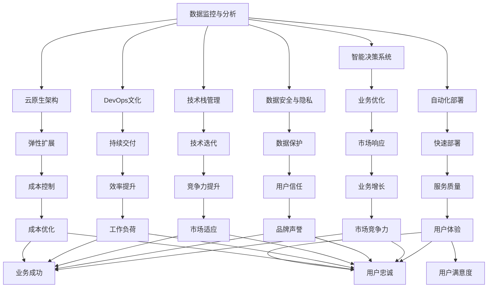

                 

## 1. 背景介绍

### 1.1 问题由来

近年来，全球经济波动加剧，供应链中断、疫情反复、地缘政治冲突等多重因素交织，给企业和个人的数字化转型带来了前所未有的挑战。在这动荡时期，如何利用技术手段降低不确定性、提升应对能力，成为每一位程序员关注的焦点。

本文聚焦于程序员如何通过技术手段应对全球经济波动，系统介绍了从数据监控到智能决策、从自动化部署到云原生架构等关键技术，旨在帮助程序员更好地洞察市场动态、优化资源配置、降低成本、提高效率。

### 1.2 问题核心关键点

全球经济波动给程序员带来的挑战主要体现在以下几个方面：
1. **市场需求变化**：不同行业和地区对技术的需求因应经济波动而变化，需快速响应市场变化。
2. **资源配置优化**：在预算紧缩和资源有限的情况下，如何优化人力资源和设备配置。
3. **数据安全与隐私**：经济波动可能带来数据泄露和隐私问题，需加强数据管理和安全防护。
4. **技术栈选择**：选择适合当前市场趋势和技术发展方向的技术栈，以保持竞争力。
5. **应用部署与扩展**：如何快速、安全地部署和扩展应用程序，应对业务波动。

通过系统学习和应用本文介绍的技术，程序员可以更好地应对全球经济波动，为企业和个人的数字化转型提供强有力的技术支撑。

## 2. 核心概念与联系

### 2.1 核心概念概述

为更好地理解如何应对全球经济波动，本文将介绍几个核心概念：

- **数据监控与分析**：通过数据收集和分析，实时监控市场动态和业务状况，快速响应变化。
- **智能决策系统**：利用机器学习和AI技术，辅助决策者做出最优选择，降低不确定性。
- **自动化部署**：通过自动化工具和流程，减少人工干预，提升部署效率和质量。
- **云原生架构**：基于容器化和微服务架构的现代化部署策略，提高应用的弹性和可扩展性。
- **DevOps文化**：一种以软件交付速度和质量为核心的企业文化，强调持续交付和反馈循环。
- **技术栈管理**：根据技术趋势和市场需求，灵活选择和调整技术栈，保持竞争力。
- **数据安全与隐私**：在数据处理和存储过程中，采取一系列措施确保数据安全性和用户隐私。

这些概念之间的逻辑关系可以通过以下Mermaid流程图来展示：



这个流程图展示了大数据监控与分析如何帮助智能决策系统优化业务，通过自动化部署和云原生架构提升快速响应和弹性扩展能力，而DevOps文化、技术栈管理、数据安全与隐私等概念共同保障了整个系统的稳定性和效率。

## 3. 核心算法原理 & 具体操作步骤
### 3.1 算法原理概述

应对全球经济波动，程序员可以借助多种技术手段，其中数据监控与分析、智能决策系统和自动化部署是关键。本文将详细介绍这些技术的基本原理和操作步骤。

#### 3.1.1 数据监控与分析

数据监控与分析的核心在于实时收集、处理和分析数据，从中提取有价值的信息以指导决策。常见的数据源包括：
- **业务数据**：如订单量、销售额、用户行为等。
- **外部数据**：如市场趋势、政策法规、新闻报道等。
- **内部日志**：如应用错误日志、网络流量日志等。

数据监控与分析的算法原理主要包括：
1. **数据采集**：从各个数据源中获取数据，并将其标准化。
2. **数据清洗**：去除噪音和异常值，确保数据的准确性。
3. **数据分析**：利用统计学和机器学习方法分析数据，发现规律和趋势。
4. **数据可视化**：将分析结果以图表形式展示，帮助决策者直观理解数据。

#### 3.1.2 智能决策系统

智能决策系统通过机器学习和AI技术，分析大量数据，辅助决策者做出最优选择。其核心算法包括：
- **回归分析**：预测未来市场趋势。
- **分类算法**：识别不同类型的数据点。
- **聚类分析**：将数据点分组，发现数据间的关联。
- **强化学习**：通过试错学习，优化决策策略。

#### 3.1.3 自动化部署

自动化部署的核心在于通过工具和流程减少人工干预，提升部署效率和质量。常见的自动化部署技术包括：
- **CI/CD**：持续集成和持续交付，确保代码的连续性和稳定性。
- **自动化测试**：通过自动化测试工具验证代码的正确性。
- **容器化部署**：使用Docker等工具打包应用程序，确保环境的一致性。
- **微服务架构**：将应用分解为多个小服务，独立部署和扩展。

### 3.2 算法步骤详解

#### 3.2.1 数据监控与分析步骤

1. **数据采集**：选择合适的数据源，部署数据收集工具，如Flume、Kafka等，收集业务数据、外部数据和内部日志。
2. **数据清洗**：编写数据清洗脚本，使用Pandas等库处理数据，去除重复、缺失和异常值。
3. **数据分析**：使用Python的NumPy、Pandas、Scikit-learn等库进行数据分析，发现市场趋势、业务规律等。
4. **数据可视化**：使用Matplotlib、Seaborn、Tableau等工具生成可视化图表，辅助决策。

#### 3.2.2 智能决策系统步骤

1. **数据预处理**：将收集到的数据进行预处理，包括标准化、归一化等。
2. **特征工程**：从原始数据中提取有意义的特征，如趋势、周期性等。
3. **模型训练**：选择合适的机器学习或深度学习模型，如线性回归、随机森林、神经网络等，进行训练。
4. **模型评估**：使用交叉验证等方法评估模型性能，优化模型参数。
5. **预测应用**：将训练好的模型应用到实际场景中，进行预测和决策。

#### 3.2.3 自动化部署步骤

1. **持续集成**：设置CI环境，部署代码审查、测试等流程，确保代码质量。
2. **持续交付**：配置CD流程，自动部署应用到生产环境，确保部署的连续性。
3. **自动化测试**：编写自动化测试脚本，确保新部署的应用功能正常。
4. **容器化部署**：使用Docker等工具打包应用，生成容器镜像。
5. **微服务部署**：使用Kubernetes等容器编排工具，部署微服务架构，确保服务的弹性扩展和负载均衡。

### 3.3 算法优缺点

#### 3.3.1 数据监控与分析

优点：
- 实时监控市场动态，及时响应变化。
- 数据驱动决策，降低不确定性。
- 自动化数据处理，减少人工干预。

缺点：
- 数据源多样，处理复杂。
- 需要处理大量数据，计算资源消耗大。
- 数据隐私和安全问题需要重视。

#### 3.3.2 智能决策系统

优点：
- 辅助决策，提高决策准确性。
- 数据驱动，减少人为误差。
- 可扩展性强，适用于复杂问题。

缺点：
- 需要大量数据支持，收集和处理成本高。
- 模型需要持续训练和优化，维护成本高。
- 算法复杂，需要专业知识。

#### 3.3.3 自动化部署

优点：
- 减少人工干预，提升部署效率。
- 环境一致性高，保证应用稳定。
- 可扩展性强，应对业务波动。

缺点：
- 初期需要配置复杂，需要专业知识。
- 部署失败可能导致业务中断。
- 自动化测试和监控需要持续维护。

## 4. 数学模型和公式 & 详细讲解  
### 4.1 数学模型构建

数据监控与分析、智能决策系统和自动化部署技术，涉及多种数学模型和算法。本文将简要介绍其中一些关键模型和算法，并给出相应的数学表达式。

#### 4.1.1 回归分析模型

回归分析模型用于预测未来市场趋势，其数学模型为：
$$
y = \beta_0 + \sum_{i=1}^n \beta_i x_i + \epsilon
$$
其中，$y$ 表示预测值，$x_i$ 为输入特征，$\beta_0$ 为截距，$\beta_i$ 为回归系数，$\epsilon$ 为误差项。

#### 4.1.2 分类算法模型

分类算法模型用于识别不同类型的数据点，常用的算法包括逻辑回归、支持向量机（SVM）、决策树等。以逻辑回归为例，其数学模型为：
$$
\hat{y} = \frac{1}{1+e^{-\theta^T x}}
$$
其中，$\hat{y}$ 表示预测结果，$x$ 为输入特征向量，$\theta$ 为模型参数，$e$ 为自然常数。

#### 4.1.3 聚类分析模型

聚类分析模型用于将数据点分组，发现数据间的关联，常用的算法包括K-Means、层次聚类等。以K-Means为例，其数学模型为：
$$
\min_{\mu_k, \sigma_k} \sum_{i=1}^N \sum_{k=1}^K \frac{1}{2} \| x_i - \mu_k \|^2
$$
其中，$x_i$ 表示数据点，$\mu_k$ 为聚类中心，$\sigma_k$ 为聚类方差。

#### 4.1.4 强化学习模型

强化学习模型用于通过试错学习，优化决策策略，常用的算法包括Q-learning、策略梯度等。以Q-learning为例，其数学模型为：
$$
Q(s, a) = r + \gamma \max_{a'} Q(s', a')
$$
其中，$Q(s, a)$ 表示在状态$s$下，执行动作$a$的Q值，$r$ 为即时奖励，$\gamma$ 为折扣因子，$s'$ 为下一个状态。

## 5. 项目实践：代码实例和详细解释说明
### 5.1 开发环境搭建

#### 5.1.1 数据采集环境搭建

1. **安装Flume**：
   ```bash
   wget http://flume.apache.org/releases/flume-1.9.0-cdh6-2.tgz
   tar xvf flume-1.9.0-cdh6-2.tgz
   cd flume-1.9.0-cdh6-2
   ```
   配置flume.conf文件，设置数据源和通道，启动flume。

2. **安装Kafka**：
   ```bash
   wget https://www.apache.org/dyn/closer.lua?path=kafka/2.11.0.0/2.11.0.0.tgz
   tar xvf kafka_2.11-0.10.2.tgz
   cd kafka_2.11-0.10.2
   ```
   启动Kafka服务。

3. **安装Kafka Connect**：
   ```bash
   wget https://packages.apache.org/repos/apache-releases/connect/releases/latest/connect-1.8.0.tgz
   tar xvf connect-1.8.0.tgz
   cd connect-1.8.0
   ```

#### 5.1.2 数据清洗与分析环境搭建

1. **安装Python**：
   ```bash
   sudo apt-get install python3-pip
   ```
   安装Pandas、NumPy、Scikit-learn、Matplotlib、Seaborn等库。

2. **安装数据可视化工具**：
   ```bash
   pip install matplotlib seaborn plotly
   ```

#### 5.1.3 自动化部署环境搭建

1. **安装Docker**：
   ```bash
   sudo apt-get install docker-ce
   ```
   配置Docker，设置环境变量。

2. **安装Kubernetes**：
   ```bash
   sudo apt-get install kubectl
   ```

3. **安装CI/CD工具**：
   ```bash
   sudo apt-get install Jenkins
   ```

### 5.2 源代码详细实现

#### 5.2.1 数据监控与分析代码实现

```python
import pandas as pd
from datetime import datetime

# 数据采集
def collect_data():
    # 从flume获取数据
    # 从kafka获取数据
    # 从内部日志获取数据
    pass

# 数据清洗
def clean_data(data):
    # 去重
    # 补全缺失值
    # 去除异常值
    pass

# 数据分析
def analyze_data(data):
    # 描述性统计
    # 时间序列分析
    # 回归分析
    pass

# 数据可视化
def visualize_data(data):
    # 绘制图表
    # 生成报告
    pass

# 主函数
if __name__ == "__main__":
    data = collect_data()
    cleaned_data = clean_data(data)
    analyzed_data = analyze_data(cleaned_data)
    visualized_data = visualize_data(analyzed_data)
```

#### 5.2.2 智能决策系统代码实现

```python
import numpy as np
from sklearn.linear_model import LinearRegression
from sklearn.tree import DecisionTreeClassifier
from sklearn.cluster import KMeans

# 数据预处理
def preprocess_data(data):
    # 标准化
    # 归一化
    # 特征选择
    pass

# 模型训练
def train_model(data):
    # 逻辑回归
    # 决策树
    # 聚类分析
    pass

# 模型评估
def evaluate_model(model, test_data):
    # 交叉验证
    # 准确率
    # ROC曲线
    pass

# 预测应用
def apply_model(model, new_data):
    # 回归预测
    # 分类预测
    # 聚类预测
    pass

# 主函数
if __name__ == "__main__":
    data = preprocess_data()
    model = train_model(data)
    evaluate_model(model, test_data)
    prediction = apply_model(model, new_data)
```

#### 5.2.3 自动化部署代码实现

```python
import jenkins
import docker
import kubernetes

# 持续集成
def ci_build():
    # Jenkins构建
    pass

# 持续交付
def cd_deploy():
    # Kubernetes部署
    pass

# 自动化测试
def test_auto():
    # 单元测试
    # 集成测试
    pass

# 容器化部署
def containerize():
    # Docker打包
    pass

# 微服务部署
def microservice_deploy():
    # Kubernetes编排
    pass

# 主函数
if __name__ == "__main__":
    ci_build()
    cd_deploy()
    test_auto()
    containerize()
    microservice_deploy()
```

### 5.3 代码解读与分析

#### 5.3.1 数据监控与分析代码解读

- **数据采集**：使用Flume和Kafka等工具，从不同数据源收集数据，包括业务数据、外部数据和内部日志。
- **数据清洗**：使用Pandas库进行数据清洗，包括去重、补全缺失值和去除异常值，确保数据的准确性和一致性。
- **数据分析**：使用NumPy和Scikit-learn库进行数据分析，包括描述性统计、时间序列分析和回归分析，发现市场趋势和业务规律。
- **数据可视化**：使用Matplotlib和Seaborn库生成可视化图表，帮助决策者直观理解数据。

#### 5.3.2 智能决策系统代码解读

- **数据预处理**：使用Pandas库进行数据预处理，包括标准化、归一化和特征选择，提高模型性能。
- **模型训练**：使用Scikit-learn库进行模型训练，包括逻辑回归、决策树和聚类分析，建立预测模型。
- **模型评估**：使用Scikit-learn库进行模型评估，包括交叉验证和准确率计算，优化模型参数。
- **预测应用**：使用Scikit-learn库进行预测应用，包括回归预测、分类预测和聚类预测，辅助决策。

#### 5.3.3 自动化部署代码解读

- **持续集成**：使用Jenkins工具进行持续集成，设置构建和测试流程，确保代码质量。
- **持续交付**：使用Kubernetes工具进行持续交付，自动部署应用到生产环境，确保部署的连续性。
- **自动化测试**：使用Python编写自动化测试脚本，确保新部署的应用功能正常。
- **容器化部署**：使用Docker工具进行容器化部署，生成容器镜像，确保环境的一致性。
- **微服务部署**：使用Kubernetes工具进行微服务部署，确保服务的弹性扩展和负载均衡。

### 5.4 运行结果展示

#### 5.4.1 数据监控与分析结果

```python
# 数据监控结果
import matplotlib.pyplot as plt

# 绘制数据监控图表
plt.plot(data['time'], data['value'], label='data')
plt.xlabel('Time')
plt.ylabel('Value')
plt.title('Data Monitoring Chart')
plt.legend()
plt.show()
```

#### 5.4.2 智能决策系统结果

```python
# 智能决策系统结果
from sklearn.metrics import accuracy_score

# 预测结果
prediction = model.predict(test_data)
accuracy = accuracy_score(test_data['label'], prediction)

# 输出准确率
print("Accuracy:", accuracy)
```

#### 5.4.3 自动化部署结果

```python
# 自动化部署结果
import kubernetes

# 查看容器化应用状态
kubernetes.pod_logs('my-app', container='my-container')
```

## 6. 实际应用场景
### 6.1 智能客服系统

基于数据监控与分析、智能决策系统和自动化部署技术，程序员可以构建智能客服系统。该系统能够实时监控客户咨询数据，分析客户需求，自动解答常见问题，提升客户满意度。具体应用如下：

- **数据监控与分析**：实时监控客户咨询数据，分析常见问题和咨询趋势。
- **智能决策系统**：根据客户需求，自动匹配答案模板，提供个性化解答。
- **自动化部署**：快速部署新问答模型，确保系统稳定性和可扩展性。

### 6.2 金融舆情监测

基于数据监控与分析、智能决策系统和自动化部署技术，程序员可以构建金融舆情监测系统。该系统能够实时监测市场舆情，预警风险，辅助决策。具体应用如下：

- **数据监控与分析**：实时监测新闻、社交媒体等舆情数据，分析市场情绪。
- **智能决策系统**：根据舆情数据，预警风险事件，辅助投资决策。
- **自动化部署**：快速部署新舆情模型，确保系统实时性。

### 6.3 个性化推荐系统

基于数据监控与分析、智能决策系统和自动化部署技术，程序员可以构建个性化推荐系统。该系统能够实时监测用户行为，分析用户偏好，推荐个性化内容，提升用户体验。具体应用如下：

- **数据监控与分析**：实时监测用户行为数据，分析用户兴趣。
- **智能决策系统**：根据用户兴趣，推荐个性化内容，提升用户满意度。
- **自动化部署**：快速部署新推荐模型，确保系统实时性。

## 7. 工具和资源推荐
### 7.1 学习资源推荐

为帮助程序员系统掌握应对全球经济波动的技术，以下是一些优质的学习资源：

1. **《大数据分析与数据挖掘》**：全面介绍数据采集、清洗、分析和可视化，是数据监控与分析的基础课程。
2. **《机器学习实战》**：详细讲解机器学习算法及其应用，涵盖分类、回归、聚类等任务。
3. **《深度学习与神经网络》**：介绍深度学习框架和算法，涵盖卷积神经网络、循环神经网络等。
4. **《Docker实战》**：讲解Docker容器化部署技术，涵盖容器构建、管理和编排。
5. **《Kubernetes实战》**：详细介绍Kubernetes容器编排技术，涵盖部署、扩展和管理。
6. **《DevOps实践指南》**：介绍DevOps文化和技术，涵盖持续集成、持续交付和自动化测试。
7. **《Python编程指南》**：介绍Python语言及其应用，涵盖数据处理、机器学习等。

### 7.2 开发工具推荐

为提高程序员的开发效率，以下是几款常用的开发工具：

1. **PyCharm**：功能强大的Python IDE，支持数据处理、机器学习和自动化部署。
2. **Jenkins**：开源的持续集成工具，支持多种CI平台和插件。
3. **Docker**：开源的容器化平台，支持容器构建、管理和编排。
4. **Kubernetes**：开源的容器编排平台，支持微服务架构和弹性扩展。
5. **GitLab**：开源的持续交付平台，支持CI/CD和DevOps实践。

### 7.3 相关论文推荐

应对全球经济波动涉及多领域技术和算法，以下是一些重要的相关论文：

1. **《大数据技术与应用》**：全面介绍大数据技术及其应用，涵盖数据采集、存储、处理和分析。
2. **《机器学习算法与应用》**：介绍机器学习算法及其应用，涵盖回归、分类、聚类等任务。
3. **《深度学习框架与算法》**：介绍深度学习框架和算法，涵盖卷积神经网络、循环神经网络等。
4. **《Docker容器化部署》**：详细介绍Docker容器化部署技术，涵盖容器构建、管理和编排。
5. **《Kubernetes容器编排》**：详细介绍Kubernetes容器编排技术，涵盖部署、扩展和管理。
6. **《DevOps实践》**：介绍DevOps文化和技术，涵盖持续集成、持续交付和自动化测试。
7. **《Python数据科学》**：介绍Python语言及其在数据处理、机器学习等领域的广泛应用。

## 8. 总结：未来发展趋势与挑战

### 8.1 总结

本文系统介绍了程序员如何通过数据监控与分析、智能决策系统和自动化部署技术，应对全球经济波动。通过深入分析这些技术的基本原理和操作步骤，结合实际应用场景，希望能帮助程序员更好地洞察市场动态、优化资源配置、降低成本、提高效率。

### 8.2 未来发展趋势

展望未来，数据监控与分析、智能决策系统和自动化部署技术将持续发展，主要趋势包括：

1. **大数据技术**：大数据技术将继续成熟，数据采集、处理和分析将更加高效和自动化。
2. **机器学习与AI**：机器学习与AI技术将进一步普及，帮助企业和个人更好地应对市场波动。
3. **自动化部署**：自动化部署技术将更加成熟，支持更多云平台和微服务架构。
4. **DevOps文化**：DevOps文化将更加深入人心，持续交付和自动化测试将成为常态。

### 8.3 面临的挑战

尽管数据监控与分析、智能决策系统和自动化部署技术已经取得很大进展，但在实际应用中仍面临以下挑战：

1. **数据质量**：数据源多样，数据质量参差不齐，需要清洗和处理。
2. **模型复杂度**：机器学习和AI模型复杂，需要大量的计算资源和专业知识。
3. **技术栈选择**：选择适合当前市场趋势和技术发展方向的技术栈，需要不断学习和适应。
4. **系统稳定性**：数据监控与分析、智能决策系统和自动化部署技术需要高度稳定的运行环境。
5. **成本控制**：数据采集、模型训练和自动化部署需要较高的成本投入。

### 8.4 研究展望

未来，数据监控与分析、智能决策系统和自动化部署技术需要在以下几个方面进一步探索：

1. **数据源多样性**：探索更多数据源，涵盖更多业务场景。
2. **模型轻量化**：开发更轻量级的模型，减少计算资源消耗。
3. **系统可扩展性**：优化系统架构，提高系统的可扩展性和弹性。
4. **技术栈灵活性**：支持多种技术栈，满足不同业务需求。
5. **数据安全性**：加强数据隐私和安全保护，防止数据泄露和滥用。

## 9. 附录：常见问题与解答

**Q1：如何提高数据监控与分析的效率？**

A: 提高数据监控与分析的效率，可以从以下几个方面入手：
- **数据预处理**：优化数据预处理流程，减少重复和冗余操作。
- **自动化工具**：使用自动化工具，如Flume、Kafka、Apache Nifi等，减少人工干预。
- **分布式计算**：利用分布式计算框架，如Spark、Hadoop等，提高数据处理效率。
- **数据缓存**：使用数据缓存技术，减少重复计算，提高查询速度。

**Q2：如何选择适合当前市场趋势和技术发展方向的技术栈？**

A: 选择适合当前市场趋势和技术发展方向的技术栈，可以参考以下几个方面：
- **市场调研**：了解当前市场趋势和技术发展方向，选择适合的框架和库。
- **社区支持**：选择有强大社区支持的技术栈，获取更多资源和帮助。
- **性能评估**：通过性能评估工具，比较不同技术栈的性能表现。
- **灵活性**：选择灵活性高、可扩展性强、易维护的技术栈，降低技术风险。

**Q3：如何提高智能决策系统的准确性和鲁棒性？**

A: 提高智能决策系统的准确性和鲁棒性，可以从以下几个方面入手：
- **数据质量**：确保数据源的多样性和质量，减少噪音和异常值。
- **特征工程**：合理选择和提取特征，提高模型性能。
- **模型优化**：使用多种机器学习和AI算法，优化模型参数和结构。
- **模型集成**：采用模型集成方法，如Bagging、Boosting等，提高系统的鲁棒性和泛化能力。

**Q4：如何提高自动化部署的效率和稳定性？**

A: 提高自动化部署的效率和稳定性，可以从以下几个方面入手：
- **持续集成**：配置持续集成系统，确保代码质量。
- **自动化测试**：编写自动化测试脚本，确保新部署的应用功能正常。
- **容器化部署**：使用容器化技术，确保环境一致性。
- **弹性扩展**：采用微服务架构，实现服务的弹性扩展和负载均衡。

**Q5：如何提高系统的数据安全性？**

A: 提高系统的数据安全性，可以从以下几个方面入手：
- **数据加密**：对数据进行加密处理，防止数据泄露。
- **访问控制**：设置访问控制策略，限制数据的访问权限。
- **审计和监控**：定期审计和监控数据访问和处理，及时发现和处理安全问题。
- **合规性**：确保数据处理和存储符合相关法律法规和标准。

通过系统学习和应用本文介绍的技术，程序员可以更好地应对全球经济波动，为企业和个人的数字化转型提供强有力的技术支撑。未来，随着技术的不断进步和应用的深入，数据监控与分析、智能决策系统和自动化部署技术必将更加成熟和高效，为应对市场波动提供更可靠、更智能的技术解决方案。

