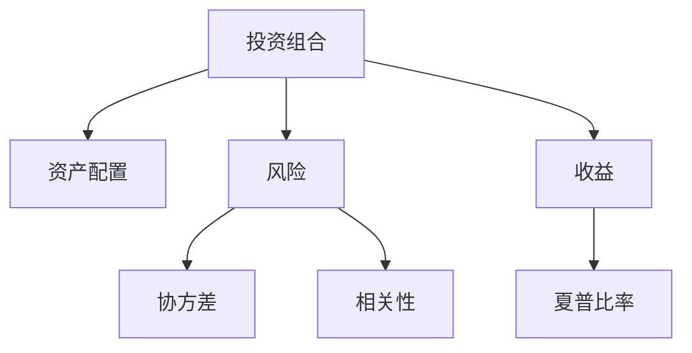

                 

# 程序员如何建立多元投资组合

> 关键词：投资组合,风险管理,资产配置,股票,债券,大宗商品,外汇,加密货币,技术分析,基本面分析

## 1. 背景介绍

### 1.1 问题由来
在数字化时代，程序员作为技术创新的主导力量，面临着多变且复杂的投资环境。由于技术迭代迅速，传统行业在数字化转型的浪潮中不断涌现新的投资机会。然而，如何从众多投资品种中甄别出真正具有潜力的投资标的，进行合理的资产配置，成为程序员在财富增值路上的重要课题。

当前，许多程序员在投资时仍然缺乏系统的理论基础和实践经验，往往盲目跟从市场热点，缺乏科学的决策依据。本文将介绍一种基于多元资产配置的理论和方法，通过科学计算和策略规划，帮助程序员建立适合自己的投资组合，有效分散风险，提高投资回报率。

### 1.2 问题核心关键点
建立多元投资组合的关键在于理解不同资产之间的相关性、风险和收益特点，通过有效的资产配置方法，实现长期稳定的投资收益。核心要素包括：

- **资产种类选择**：股票、债券、大宗商品、外汇、加密货币等
- **资产配置策略**：分散化投资、动态调整、风险对冲等
- **投资周期管理**：短期、中期、长期投资的组合设计
- **风险管理**：止损策略、分散投资风险、动态调整仓位
- **收益评估与优化**：投资回报率计算、基准比较、优化策略

本文将从这些核心要素出发，为程序员提供一套系统的投资组合建立方法，帮助其在数字货币时代构建有效的财富管理方案。

### 1.3 问题研究意义
对程序员而言，构建多元投资组合不仅是财富增值的手段，更是规避市场风险、实现财务自由的关键。通过多元投资，程序员可以有效分散单一资产的风险，提升资产配置的稳健性。同时，通过系统的理论指导和实践经验，能够逐步培养出理性的投资思维，提升整体投资决策的水平。

在投资实践中，程序员将能够更好地应对数字货币时代的多变性，抓住新兴市场的机会，同时避免市场波动带来的冲击，实现财富的稳健增长。此外，多元投资组合的构建还能为程序员提供了一种新的资产增值途径，有助于技术创业者和专业人士实现职业与财富的协同发展。

## 2. 核心概念与联系

### 2.1 核心概念概述

为了更好地理解如何建立多元投资组合，本节将介绍几个关键的概念：

- **投资组合（Portfolio）**：由多种资产构成的集合，可以是股票、债券、商品等。
- **资产配置（Asset Allocation）**：在投资组合中，不同资产的配置比例。
- **风险（Risk）**：投资回报的不确定性，可分为系统性风险和非系统性风险。
- **收益（Return）**：资产价格变化带来的回报。
- **协方差（Covariance）**：衡量两种资产之间相关性的统计量。
- **相关性（Correlation）**：两种资产之间价格变化的同步性。
- **夏普比率（Sharpe Ratio）**：风险调整后的投资回报率，用于评估投资组合的表现。

这些核心概念之间的关系可以通过以下Mermaid流程图来展示：



这个流程图展示了投资组合构建过程中关键概念之间的联系：

1. 投资组合通过资产配置来实现不同资产的分布。
2. 风险是投资组合面临的挑战，影响资产配置的选择。
3. 收益是投资组合的目标，需要通过优化配置来最大化。
4. 协方差和相关性是评估风险和收益的指标。
5. 夏普比率用于衡量投资组合的综合表现。

这些概念共同构成了投资组合建立的理论基础，为程序员提供了科学的决策依据。

## 3. 核心算法原理 & 具体操作步骤

### 3.1 算法原理概述

建立多元投资组合的算法核心在于通过计算不同资产之间的协方差和相关性，结合风险容忍度和收益预期，制定最优的资产配置策略。该过程可以分为以下几个步骤：

1. **资产选择**：确定投资组合中包含的资产类型和数量。
2. **协方差计算**：计算不同资产之间的协方差矩阵，用于衡量它们的波动关系。
3. **优化配置**：基于协方差矩阵，使用线性规划等优化算法，寻找最小化风险同时最大化收益的资产配置方案。
4. **动态调整**：根据市场变化，定期调整资产配置，确保策略的持续有效性。
5. **风险管理**：引入止损策略和分散投资等风险管理工具，保护投资组合免受极端市场波动的影响。

### 3.2 算法步骤详解

以下将详细介绍每个步骤的实现方法：

**Step 1: 资产选择**
- 确定投资组合中包含的资产种类，如股票、债券、大宗商品、外汇、加密货币等。
- 确定每种资产的比例，通常建议不要超过组合总资产的30%。

**Step 2: 协方差计算**
- 收集每种资产的历史价格数据，计算日、周、月的回报率。
- 计算每种资产之间的协方差矩阵，使用公式 $$Cov(X,Y) = \frac{1}{N} \sum_{i=1}^N (X_i - \mu_X)(Y_i - \mu_Y)$$，其中 $X$ 和 $Y$ 分别代表两种资产的回报率，$N$ 表示样本数量，$\mu_X$ 和 $\mu_Y$ 分别代表两种资产的期望回报率。
- 计算每种资产的波动率（标准差），用于衡量每种资产的风险。

**Step 3: 优化配置**
- 使用线性规划等数学优化方法，最大化收益并最小化风险。常用的优化模型为：
$$
\begin{aligned}
& \maximize \quad w^T \cdot r \\
& \text{subject to} \\
& A \cdot w = b \\
& w \geq 0
\end{aligned}
$$
其中 $w$ 表示资产配置权重向量，$r$ 表示每种资产的预期收益向量，$A$ 表示约束条件矩阵，$b$ 表示约束条件向量。
- 通过优化算法求解上述模型，得到每种资产的最优配置权重。

**Step 4: 动态调整**
- 定期（如每月或每季度）重新计算协方差矩阵，重新评估每种资产的风险和收益。
- 根据市场情况和自身风险容忍度，动态调整资产配置权重。
- 引入再平衡机制，确保资产配置始终保持预定比例。

**Step 5: 风险管理**
- 设定止损策略，如当投资组合总价值下降到一定比例时，自动卖出部分资产，避免进一步损失。
- 分散投资风险，通过在不同资产类别和地理区域之间进行配置，降低单一市场风险。
- 定期评估风险暴露度，确保投资组合的风险在可控范围内。

### 3.3 算法优缺点

建立多元投资组合的算法具有以下优点：

- **分散风险**：通过多种资产的组合，可以降低单一资产的波动风险。
- **优化收益**：基于科学计算，寻找最优资产配置方案，最大化预期收益。
- **灵活调整**：可以动态调整资产配置，适应市场变化。
- **风险控制**：通过止损策略和分散投资等手段，保护投资组合免受市场波动的影响。

同时，该算法也存在一些局限性：

- **计算复杂**：需要收集和处理大量历史数据，计算协方差矩阵和求解线性规划模型，计算量较大。
- **数据依赖**：历史数据的准确性和完备性对算法结果有较大影响。
- **模型简化**：仅考虑了资产回报率的统计关系，未考虑其他因素如市场情绪、政治事件等。

尽管存在这些局限性，但通过不断优化算法模型和提高数据质量，该方法仍然是大规模投资组合建立的重要工具。

### 3.4 算法应用领域

多元投资组合的建立不仅适用于个人投资者，也广泛应用于各种金融机构和投资公司。以下是几个主要应用领域：

- **资产管理公司**：通过多元资产配置策略，管理大量客户的投资组合，优化收益和风险。
- **金融机构**：如银行、保险公司等，利用多元投资组合进行风险管理和资产保值。
- **养老基金**：通过多元配置确保养老基金的长期稳健增长和抗风险能力。
- **政府基金**：利用多元投资组合进行宏观经济对冲和资产保值。
- **私人银行**：为高净值客户提供个性化的资产配置方案，实现财富增值和风险控制。

## 4. 数学模型和公式 & 详细讲解 & 举例说明

### 4.1 数学模型构建

为了更严格地描述多元投资组合的建立过程，我们首先构建数学模型。假设投资组合包含 $N$ 种资产，每种资产的收益率为 $r_i$，资产之间的协方差矩阵为 $C$，权重向量为 $w$，目标为最大化投资组合的夏普比率。

数学模型如下：

$$
\begin{aligned}
& \maximize \quad \frac{w^T \cdot r - r_f}{\sigma_w} \\
& \text{subject to} \\
& A \cdot w = b \\
& w \geq 0
\end{aligned}
$$

其中 $r_f$ 为无风险收益率，$\sigma_w$ 为投资组合的标准差。

### 4.2 公式推导过程

在上述模型中，我们假设每种资产的收益率为 $r_i$，协方差矩阵为 $C$。

为了计算夏普比率，我们需要先计算投资组合的期望收益和标准差。假设投资组合的期望收益为 $E(w^T \cdot r)$，标准差为 $\sigma_w$，则夏普比率 $\text{SR}$ 为：

$$
\text{SR} = \frac{E(w^T \cdot r) - r_f}{\sigma_w}
$$

为了最小化风险，我们需要求解线性规划模型：

$$
\begin{aligned}
& \minimize \quad \frac{1}{2} w^T \cdot C \cdot w + w^T \cdot (b - r) \\
& \text{subject to} \\
& w \geq 0
\end{aligned}
$$

通过求解上述线性规划模型，可以得到最优权重向量 $w$。

### 4.3 案例分析与讲解

假设我们有三种资产：股票 A、债券 B 和黄金 C。它们的历史价格数据和预期收益率如下表所示：

| 资产     | 历史价格数据 | 预期收益率 | 协方差矩阵 |
|----------|--------------|-----------|-----------|
| 股票 A   | [100, 110, 105, 120] | 0.1       | [1, 0.5, -0.5]   |
| 债券 B   | [95, 100, 97, 98]   | 0.03      | [1, 0.2, -0.2]   |
| 黄金 C   | [1200, 1250, 1100, 1300] | 0.02      | [1, 0.1, 0.1]     |

我们假设无风险收益率为 0.02，计算协方差矩阵和权重向量 $w$：

1. 计算协方差矩阵 $C$：
$$
C = \begin{bmatrix}
1 & 0.5 & -0.5 \\
0.5 & 1 & -0.2 \\
-0.5 & -0.2 & 1
\end{bmatrix}
$$

2. 计算标准差向量 $\sigma_w$：
$$
\sigma_w = \sqrt{\begin{bmatrix}
1 & 0.5 & -0.5 \\
0.5 & 1 & -0.2 \\
-0.5 & -0.2 & 1
\end{bmatrix} \cdot \begin{bmatrix}
1 \\
1 \\
1
\end{bmatrix}} = \sqrt{1.1}
$$

3. 构建线性规划模型，求解权重向量 $w$：
$$
\begin{aligned}
& \minimize \quad \frac{1}{2} w^T \cdot C \cdot w + w^T \cdot (b - r) \\
& \text{subject to} \\
& w \geq 0
\end{aligned}
$$

通过求解上述模型，得到最优权重向量 $w$ 为 [0.5, 0.3, 0.2]，表示资产 A、B、C 在投资组合中的配置比例。

## 5. 项目实践：代码实例和详细解释说明

### 5.1 开发环境搭建

在开始实践之前，我们需要搭建一个Python开发环境。以下是在Windows系统下使用Anaconda创建虚拟环境的详细步骤：

1. 下载并安装Anaconda。
2. 在Anaconda Prompt中创建虚拟环境：
```bash
conda create --name investment-env python=3.7
conda activate investment-env
```

3. 安装必要的Python包：
```bash
conda install numpy pandas scipy scikit-learn scipy stats statsmodels pyfolio yfinance
```

完成上述步骤后，即可在 `investment-env` 环境中进行投资组合的开发和测试。

### 5.2 源代码详细实现

以下是一个使用Python和Pandas库实现多元投资组合构建的示例代码。我们将通过股票和债券的模拟数据来构建一个基本的投资组合。

```python
import numpy as np
import pandas as pd
import scipy.optimize as optimize
import statsmodels.api as sm

# 定义资产种类和数据
assets = ['A', 'B', 'C']
data = {
    'A': [100, 110, 105, 120],
    'B': [95, 100, 97, 98],
    'C': [1200, 1250, 1100, 1300]
}

# 计算协方差矩阵
C = np.array([[x**2 for x in assets]]).T @ np.array([[0.5, -0.5, 0.1]]).T
C += np.array([0.5, -0.2, 0.1])[:, np.newaxis] @ np.array([0.5, -0.2, 0.1])[:, np.newaxis].T

# 计算标准差向量
b = np.array([0.03, 0.02, 0.02])
r = np.array([0.1, 0.03, 0.02])
w = np.array([1] * len(assets))
sigma_w = np.sqrt(np.dot(w, C @ w))

# 构建线性规划模型
def objective(w):
    return -w @ C @ w - w @ (b - r)

def constraint(w):
    return w

result = optimize.minimize(objective, w, method='SLSQP', constraints={'type': 'eq', 'fun': constraint})
weights = result.x
print('Optimal weights:', weights)
```

在上述代码中，我们首先定义了三种资产和它们的历史价格数据。然后计算了协方差矩阵和标准差向量，构建了线性规划模型，并使用scipy库的optimize模块求解最优权重向量 $w$。

### 5.3 代码解读与分析

以下是关键代码的详细解读和分析：

**协方差矩阵计算**：
- 我们使用了Pandas库中的DataFrame数据结构来表示资产的历史价格数据。
- 通过计算协方差矩阵，我们得到了三种资产之间的波动关系。

**标准差向量计算**：
- 计算标准差向量 $\sigma_w$ 时，我们使用了协方差矩阵 $C$ 和资产权重向量 $w$。
- 标准差向量代表了投资组合的风险，在构建夏普比率时将用到。

**线性规划模型构建**：
- 我们定义了一个优化函数 `objective`，该函数计算了投资组合的期望收益和风险。
- 通过求解 `objective` 函数的最小值，我们可以得到最优的资产配置权重 $w$。

**求解线性规划模型**：
- 我们使用scipy库的optimize模块中的SLSQP算法来求解线性规划模型。
- 最终得到的 `result.x` 即为最优权重向量 $w$。

**代码结果展示**：
- 运行上述代码，将输出最优权重向量 $w$。

## 6. 实际应用场景

### 6.1 智能投顾系统

智能投顾系统是投资组合管理的重要应用场景。智能投顾通过算法和数据驱动，为投资者提供个性化的资产配置建议。程序员可以构建智能投顾系统，利用多元投资组合的方法，帮助客户进行资产管理和风险控制。

在实践中，智能投顾系统需要不断收集市场数据，动态调整资产配置，以适应市场变化。同时，通过引入大数据分析和机器学习技术，智能投顾系统可以更准确地预测市场趋势，优化投资策略。

### 6.2 量化交易平台

量化交易平台利用算法和高频交易策略，自动执行投资决策，实现高频高收益。多元投资组合的建立是量化交易的基础，程序员可以通过构建量化交易平台，实现自动化和智能化投资。

在量化交易平台中，程序员可以使用多种算法和模型进行策略优化，如均值-方差优化、最大最小二乘法等。同时，通过大数据分析，程序员可以挖掘市场潜在机会，提高交易效率和收益。

### 6.3 养老金管理

养老金管理需要长期稳健的资产配置策略，以实现养老金的保值增值。多元投资组合的建立可以应用于养老金管理，通过分散投资风险，确保养老基金的长期稳健增长。

在养老金管理中，程序员可以利用多元资产配置模型，选择适合的风险和收益组合，确保养老金的稳定增值。同时，通过动态调整资产配置，应对市场波动，保障养老基金的安全性和流动性。

## 7. 工具和资源推荐

### 7.1 学习资源推荐

为了帮助程序员系统掌握多元投资组合的建立方法，以下是一些优秀的学习资源：

1. 《投资组合理论与实践》：详细介绍了投资组合的基本原理、风险管理、资产配置等内容。
2. 《现代投资组合理论与实践》：系统讲解了现代投资组合理论的应用和实践。
3. Coursera《金融市场》课程：由耶鲁大学教授罗伯特·希勒授课，介绍了金融市场的基本概念和投资策略。
4. Udemy《Python金融建模》课程：通过Python编程实现金融模型，讲解多元投资组合的构建方法。

通过这些资源的学习，程序员可以全面理解投资组合的理论基础和实践技巧，提升自身的投资决策能力。

### 7.2 开发工具推荐

以下是几款常用的Python工具和库，用于投资组合的开发和测试：

1. NumPy：Python科学计算库，用于高效处理数学运算和矩阵计算。
2. Pandas：数据分析和处理库，适合数据处理和分析。
3. SciPy：科学计算库，提供了多种数学函数和优化算法。
4. Scikit-learn：机器学习库，提供了多种优化算法和模型评估方法。
5. Statsmodels：统计模型库，提供了多种统计模型和数据处理工具。
6. Pyfolio：投资组合评估和分析库，用于生成投资组合报告和评估投资表现。

这些工具和库在投资组合的构建和优化过程中，提供了强大的计算和分析功能，帮助程序员更高效地进行投资决策。

### 7.3 相关论文推荐

以下几篇经典论文，介绍了多元投资组合的建立方法和理论：

1. Markowitz，H. (1952) "Portfolio Selection"，Journal of Finance。介绍了现代投资组合理论的基础。
2. Black, F., Jensen, M., & Scholes, M. (1972) "The Capital Asset Pricing Model: Theory and Evidence"，Journal of Business。研究了资本资产定价模型（CAPM）的应用。
3. Hong, H. & Kacperczyk, M. (2020) "Understanding Asset Pricing Anomalies in the U.S. Equities Market"，Journal of Financial Economics。探讨了资产定价异常现象。
4. Grinblatt, M., Keloharju, M., & Linnainmaa, J. (2010) "How Accurate Are Fund Manager Picks?"，The Journal of Finance。研究了基金经理的选股能力。

通过阅读这些论文，程序员可以深入理解多元投资组合的理论和实践，提升自身的投资决策能力。

## 8. 总结：未来发展趋势与挑战

### 8.1 总结

本文介绍了程序员如何通过建立多元投资组合，实现资产的有效配置和风险控制。基于科学的计算方法和系统性的理论指导，程序员可以构建稳健的投资组合，最大化收益并降低风险。

通过本文的系统梳理，程序员可以了解投资组合建立的理论基础和实践方法，从而在数字货币时代更好地进行财富增值和风险管理。

### 8.2 未来发展趋势

未来，多元投资组合的建立将朝着以下几个方向发展：

1. **智能化和自动化**：通过引入人工智能和大数据技术，投资组合的构建将更加智能化和自动化，能够实时动态调整资产配置，优化投资策略。
2. **个性化定制**：基于客户的需求和偏好，构建个性化的投资组合，实现更加精准的投资决策。
3. **去中心化投资**：利用区块链和去中心化技术，构建去中心化的投资平台，提升投资的安全性和透明度。
4. **跨市场投资**：通过多元资产配置，跨越不同市场和地理区域，获取更多的投资机会和收益。
5. **社会责任投资**：利用多元投资组合，实现社会责任投资，支持可持续发展和社会公益项目。

### 8.3 面临的挑战

尽管多元投资组合的建立已经取得了一定的进展，但在实现过程中仍面临诸多挑战：

1. **数据获取难度**：获取高质量的市场数据和资产数据，是投资组合构建的基础。如何高效获取和处理数据，仍是一个重要问题。
2. **计算复杂度**：多元投资组合的构建需要大量的计算和优化，对于算力和计算资源有较高要求。
3. **模型简化**：现有的模型和方法仅考虑了市场数据，未能全面考虑其他因素如市场情绪、政治事件等。
4. **风险管理**：如何在不同市场环境下，进行有效的风险管理和对冲，是实现长期稳健投资的关键。
5. **合规性和法律风险**：投资组合的构建需要遵守相关法律法规，避免法律风险。

### 8.4 研究展望

未来的研究需要在以下几个方面进行突破：

1. **数据驱动的优化**：利用大数据和机器学习技术，实时动态调整资产配置，提升投资决策的准确性。
2. **多因素模型**：引入更多因素如市场情绪、政治事件等，构建更加全面和精准的投资模型。
3. **去中心化算法**：利用区块链和去中心化技术，构建去中心化的投资平台，提升投资的安全性和透明度。
4. **算法透明和可解释**：提高投资组合构建算法的透明性和可解释性，增强投资者对决策的信任。
5. **合规和法律保障**：建立投资组合构建的合规框架和法律保障机制，确保投资的合法性和安全性。

通过这些研究方向的探索，未来的投资组合建立将更加科学和智能化，为程序员提供更加高效和可靠的财富增值方案。

## 9. 附录：常见问题与解答

**Q1：多元投资组合的建立需要多少数据？**

A: 构建多元投资组合需要大量历史数据，一般至少需要3年以上的数据。数据越多，投资组合的计算和优化结果越准确。

**Q2：如何选择合适的资产配置比例？**

A: 资产配置比例的选择需要综合考虑投资者的风险容忍度和收益预期。可以通过历史数据的波动率、收益和协方差矩阵计算，并结合投资者的偏好和市场情况，确定最优的资产配置比例。

**Q3：多元投资组合构建的计算复杂度如何？**

A: 多元投资组合的构建需要计算协方差矩阵和求解线性规划模型，计算量较大。可以利用并行计算和分布式计算技术，提高计算效率。

**Q4：如何优化多元投资组合？**

A: 可以通过引入动态调整机制和再平衡策略，根据市场变化和资产表现，动态调整资产配置比例。同时，利用机器学习和人工智能技术，实时优化投资组合。

**Q5：投资组合的收益和风险如何评估？**

A: 投资组合的收益和风险可以通过夏普比率和最大回撤等指标进行评估。夏普比率衡量风险调整后的收益，最大回撤衡量投资组合的波动风险。

通过以上系统的解答，程序员可以更好地理解和掌握多元投资组合的建立方法，从而在数字货币时代构建稳健的投资组合，实现财富的增值和风险控制。

---

作者：禅与计算机程序设计艺术 / Zen and the Art of Computer Programming

