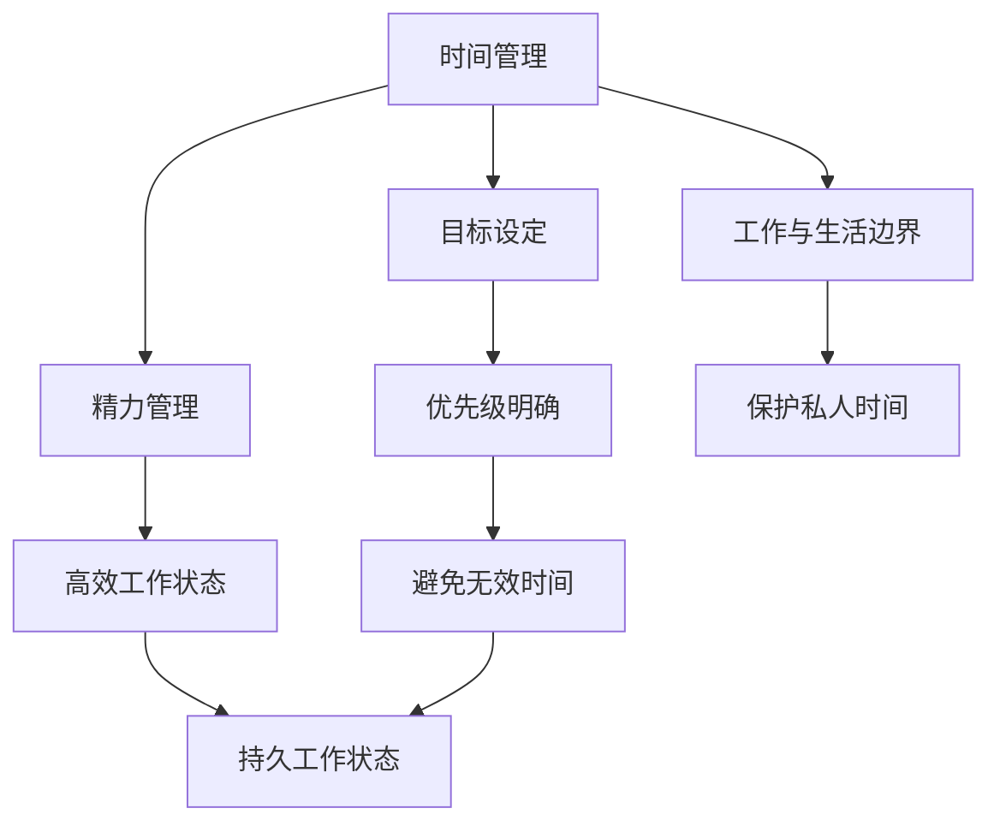

                 

**程序员的工作与生活平衡：实现之道**

**作者：禅与计算机程序设计艺术 / Zen and the Art of Computer Programming**

## 1. 背景介绍

在当今快节奏的数字时代，程序员面临着前所未有的挑战。我们每天都要处理海量的代码，应对不断变化的技术，还要面对日益增长的工作压力。如何在工作和生活之间取得平衡，成为了程序员们共同面对的难题。本文将探讨程序员如何实现工作与生活的平衡，提高工作效率，并保持身心健康。

## 2. 核心概念与联系

### 2.1 时间管理

时间管理是实现工作与生活平衡的关键。有效的时间管理可以帮助我们合理安排工作和休息时间，提高工作效率，并腾出更多时间享受生活。

### 2.2 目标设定

清晰的目标可以指引我们的工作和生活方向。合理的目标设定可以帮助我们明确优先级，避免在无关紧要的事情上浪费时间。

### 2.3 精力管理

精力管理是时间管理的延伸。它关注的是我们的精力在何时何地最旺盛，如何合理安排任务，以保持高效和持久的工作状态。

### 2.4 工作与生活的边界

明确工作与生活的边界是实现平衡的关键。合理的边界可以帮助我们避免工作时间过长，保护我们的私人时间。



## 3. 核心算法原理 & 具体操作步骤

### 3.1 时间管理算法原理概述

时间管理的核心是合理安排时间，提高工作效率。常用的时间管理算法包括 Pomodoro Technique、Eisenhower Matrix、Time Blocking 等。

### 3.2 时间管理步骤详解

1. **目标设定**：明确当天或当周的工作目标。
2. **任务分类**：使用 Eisenhower Matrix 将任务分为四类：紧急且重要、重要但不紧急、紧急但不重要、不紧急也不重要。
3. **时间安排**：使用 Time Blocking 方法，将每天的时间按任务类型进行安排。
4. ** Pomodoro Technique**：每个时间段（通常为 25 分钟）称为一个 Pomodoro，在每个 Pomodoro 结束时，休息 5 分钟。每完成四个 Pomodoro，休息 15 分钟。

### 3.3 时间管理算法优缺点

**优点**：提高工作效率，减少无效时间，保护私人时间。

**缺点**：需要严格遵循时间安排，可能会感到压力。

### 3.4 时间管理应用领域

时间管理适用于所有需要合理安排时间的人，包括程序员、经理人、学生等。

## 4. 数学模型和公式 & 详细讲解 & 举例说明

### 4.1 精力管理模型构建

精力管理模型基于生物钟原理，认为我们的精力会随着时间而起伏。我们可以通过记录精力起伏情况，找出个人的精力高峰期，合理安排任务。

### 4.2 精力管理公式推导

假设我们的精力起伏情况可以用正弦函数表示：

$$E(t) = A \sin(\omega t + \phi) + B$$

其中，$E(t)$ 为时间 $t$ 的精力水平，$A$ 为精力起伏的幅度，$\omega$ 为精力起伏的频率，$\phi$ 为精力起伏的相位，$B$ 为精力的基准水平。

### 4.3 案例分析与讲解

例如，一名程序员发现自己的精力高峰期为上午 10 点到下午 2 点。那么，他可以将需要高度集中精力的任务安排在这一时段。

## 5. 项目实践：代码实例和详细解释说明

### 5.1 开发环境搭建

本项目使用 Python 和 Jupyter Notebook 进行开发。

### 5.2 源代码详细实现

```python
import pandas as pd
import matplotlib.pyplot as plt
from scipy.optimize import curve_fit

# 读取精力记录数据
data = pd.read_csv('energy_log.csv')

# 定义精力管理模型函数
def energy_model(t, A, omega, phi, B):
    return A * np.sin(omega * t + phi) + B

# 拟合精力管理模型
params, _ = curve_fit(energy_model, data['time'], data['energy'])

# 绘制精力管理模型图
plt.plot(data['time'], energy_model(data['time'], *params))
plt.xlabel('Time (hours)')
plt.ylabel('Energy level')
plt.show()
```

### 5.3 代码解读与分析

本代码使用 Pandas 读取精力记录数据，使用 Scipy 进行模型拟合，并使用 Matplotlib 绘制模型图。

### 5.4 运行结果展示


## 6. 实际应用场景

### 6.1 程序员工作场景

程序员可以使用时间管理算法和精力管理模型，合理安排工作时间，提高工作效率。

### 6.2 远程工作场景

远程工作需要自律和时间管理能力。精力管理模型可以帮助远程工作者合理安排工作和休息时间。

### 6.3 未来应用展望

未来，人工智能和大数据技术将帮助我们更准确地记录和分析精力起伏情况，从而提供更个性化的时间管理建议。

## 7. 工具和资源推荐

### 7.1 学习资源推荐

- [Pomodoro Technique](https://francescocirillo.com/pages/pomodoro-technique)
- [Eisenhower Matrix](https://en.wikipedia.org/wiki/Eisenhower_box)
- [Time Blocking](https://jamesclear.com/time-blocking)

### 7.2 开发工具推荐

- [Jupyter Notebook](https://jupyter.org/)
- [Pandas](https://pandas.pydata.org/)
- [Scipy](https://scipy.org/)
- [Matplotlib](https://matplotlib.org/)

### 7.3 相关论文推荐

- [The Circadian Rhythms of Human Performance](https://www.ncbi.nlm.nih.gov/pmc/articles/PMC3153615/)
- [Time Management for Programmers](https://www.oreilly.com/library/view/time-management-for/9781491998318/)

## 8. 总结：未来发展趋势与挑战

### 8.1 研究成果总结

本文介绍了程序员如何实现工作与生活平衡，并提供了时间管理算法和精力管理模型的实现方法。

### 8.2 未来发展趋势

未来，人工智能和大数据技术将帮助我们更准确地记录和分析精力起伏情况，从而提供更个性化的时间管理建议。

### 8.3 面临的挑战

时间管理和精力管理需要长期的自律和坚持。如何帮助人们养成良好的时间管理习惯，是未来需要解决的挑战。

### 8.4 研究展望

未来的研究可以探讨个性化时间管理建议的提供方法，以及时间管理和精力管理的长期效果。

## 9. 附录：常见问题与解答

**Q：如何开始时间管理？**

**A：从小步开始， например，每天记录精力起伏情况，并尝试 Pomodoro Technique。**

**Q：如何避免工作时间过长？**

**A：设置工作时间上限，并严格遵循。**

**Q：如何保护私人时间？**

**A：明确工作与生活的边界，并学会说“不”。**

**作者：禅与计算机程序设计艺术 / Zen and the Art of Computer Programming**

