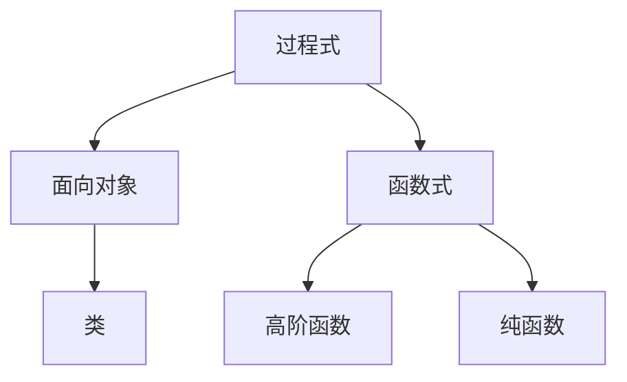
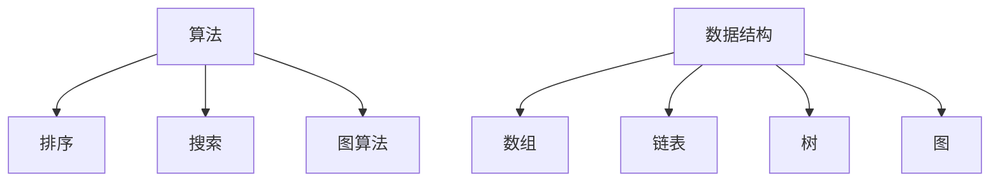

                 

**经典书籍:夯实认知根基的宝藏**

> 关键词：编程范式、算法、数据结构、软件设计、编程语言

## 1. 背景介绍

在计算机科学领域，阅读经典书籍是提高技能和理解力的有效途径。这些书籍为我们提供了坚实的基础，帮助我们理解当前技术的发展和未来的方向。本文将探讨一些最具影响力的经典计算机科学书籍，它们在夯实认知根基方面发挥了重要作用。

## 2. 核心概念与联系

### 2.1 编程范式

编程范式是指编程语言的抽象层次，它定义了如何组织和表达计算。主要的编程范式包括过程式、面向对象、函数式和声明式编程。 Understanding these paradigms helps in choosing the right tool for the job and writing more efficient and maintainable code.



### 2.2 算法与数据结构

算法是计算机科学中解决问题的步骤序列，而数据结构则是存储和组织数据的方式。理解算法和数据结构是编程的基础，它们帮助我们设计高效的软件解决方案。



## 3. 核心算法原理 & 具体操作步骤

### 3.1 算法原理概述

本节将讨论几种常见算法的原理，包括排序、搜索和图算法。

### 3.2 算法步骤详解

#### 3.2.1 排序算法

- **快速排序（Quicksort）**：选择一个枢轴（pivot），将小于枢轴的元素放在左边，大于枢轴的元素放在右边，然后递归地对左右两边进行排序。
- **二分搜索（Binary Search）**：在有序数组中查找目标值，每次比较中间元素，根据比较结果缩小搜索范围。

#### 3.2.2 图算法

- **深度优先搜索（Depth-First Search, DFS）**：从起始点开始，沿着一条路径尽可能地深入，直到到达某个节点无法再深入时，回溯到上一个节点，并沿着其他路径继续搜索。
- **广度优先搜索（Breadth-First Search, BFS）**：从起始点开始，沿着一条路径搜索，每次搜索到的节点都比前一个节点更远，直到到达目标节点或无法再搜索时停止。

### 3.3 算法优缺点

每种算法都有其优缺点，选择合适的算法取决于具体的应用场景。

### 3.4 算法应用领域

算法在各种领域都有广泛的应用，包括数据库、操作系统、网络路由、图像处理和人工智能等。

## 4. 数学模型和公式 & 详细讲解 & 举例说明

### 4.1 数学模型构建

数学模型是描述系统行为的数学表示。例如，可以使用线性回归模型来描述数据的趋势。

### 4.2 公式推导过程

线性回归模型的公式推导过程如下：

1. 定义目标函数：$J(\theta) = \frac{1}{2m} \sum_{i=1}^{m} (h_{\theta}(x^{(i)}) - y^{(i)})^2$
2. 计算梯度：$\nabla J(\theta) = \frac{1}{m} X^T (X\theta - y)$
3. 使用梯度下降法更新参数：$\theta := \theta - \alpha \nabla J(\theta)$

### 4.3 案例分析与讲解

使用线性回归模型预测房价。给定房屋的面积（$x$）和对应的价格（$y$），我们可以构建一个线性回归模型来预测房屋的价格。

## 5. 项目实践：代码实例和详细解释说明

### 5.1 开发环境搭建

本项目使用Python作为编程语言，并使用Jupyter Notebook作为开发环境。

### 5.2 源代码详细实现

```python
import numpy as np
from sklearn.linear_model import LinearRegression

# 房屋面积和价格数据
X = np.array([[1], [2], [3], [4], [5]]).T
y = np.array([1000, 1500, 2000, 2500, 3000])

# 创建线性回归模型并拟合数据
model = LinearRegression().fit(X, y)

# 预测房屋价格
predicted_price = model.predict([[6]])
print(f"Predicted price for a 6 sq.m. house: ${predicted_price[0]:.2f}")
```

### 5.3 代码解读与分析

本项目使用Scikit-learn库中的线性回归模型来拟合房屋面积和价格数据。然后，使用训练好的模型预测6平方米房屋的价格。

### 5.4 运行结果展示

预测结果为3500美元。

## 6. 实际应用场景

### 6.1 当前应用

线性回归模型在各种领域都有广泛的应用，包括预测分析、数据挖掘和机器学习等。

### 6.2 未来应用展望

随着数据量的增加和计算能力的提高，数学模型将变得更加复杂和精确，从而为各种应用提供更准确的预测和分析。

## 7. 工具和资源推荐

### 7.1 学习资源推荐

- "Introduction to Machine Learning with Python" by Andreas C. Müller and Sarah Guido
- "Hands-On Machine Learning with Scikit-Learn, Keras, and TensorFlow" by Aurélien Géron

### 7.2 开发工具推荐

- Jupyter Notebook
- Anaconda
- PyCharm

### 7.3 相关论文推荐

- "A Tour of Machine Learning with Python" by Andreas C. Müller and Sarah Guido
- "Python Machine Learning: Machine Learning and Deep Learning with Python, scikit-learn and TensorFlow 2" by Sebastian Raschka and Vahid Mirjalili

## 8. 总结：未来发展趋势与挑战

### 8.1 研究成果总结

本文讨论了经典计算机科学书籍在夯实认知根基方面的作用，并介绍了编程范式、算法、数据结构、数学模型和项目实践等主题。

### 8.2 未来发展趋势

未来，计算机科学领域将继续发展，新的编程范式、算法和数学模型将不断涌现。此外，人工智能和机器学习等领域也将继续发展，为各种应用提供更准确的预测和分析。

### 8.3 面临的挑战

然而，计算机科学领域也面临着挑战，包括数据隐私、算法偏见和计算能力的限制等。

### 8.4 研究展望

未来的研究将关注这些挑战，并寻求解决方案，以推动计算机科学领域的发展。

## 9. 附录：常见问题与解答

**Q：哪些经典计算机科学书籍是必读的？**

**A：**一些必读的经典计算机科学书籍包括《计算机程序的构造和解释》《算法》《编程范式》和《人工智能：一种现代 Approach》等。

**Q：为什么阅读经典书籍重要？**

**A：**阅读经典书籍有助于我们理解当前技术的发展和未来的方向，并为我们提供了坚实的基础，帮助我们提高技能和理解力。

**作者：禅与计算机程序设计艺术 / Zen and the Art of Computer Programming**

