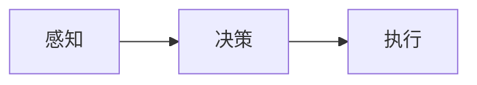

                 

## 自动化技术的未来发展方向

> 关键词：自动化、人工智能、机器学习、深度学习、边缘计算、云原生、数字孪生、自主系统

## 1. 背景介绍

自动化技术自诞生以来，就不断地改变着我们的生活和工作方式。从工业自动化到家庭智能设备，从自动驾驶到无人机，自动化技术无处不在。随着人工智能、物联网、大数据等技术的发展，自动化技术正在迎来新的发展机遇和挑战。本文将探讨自动化技术的未来发展方向，并就其面临的机遇和挑战展开讨论。

## 2. 核心概念与联系

自动化技术的核心是自动控制系统，其目的是在无人干预的情况下，根据预先设定的程序或算法，自动完成特定的任务。自动控制系统由感知、决策和执行三个基本环节组成，如下图所示：



- **感知**：自动控制系统通过传感器等设备感知环境和系统状态，获取输入信息。
- **决策**：自动控制系统根据输入信息和预设的控制策略，做出决策，生成控制指令。
- **执行**：自动控制系统根据控制指令，驱动执行机构完成相应的动作。

自动化技术与人工智能、机器学习、深度学习等技术密切相关。人工智能为自动化技术提供了更智能的决策能力，机器学习和深度学习则为自动化技术提供了更强大的感知和决策能力。此外，边缘计算、云原生、数字孪生等技术也为自动化技术的发展带来了新的机遇。

## 3. 核心算法原理 & 具体操作步骤

### 3.1 算法原理概述

自动化技术的核心算法是控制算法，其目的是根据系统状态和控制目标，生成控制指令，使系统状态趋于目标状态。常用的控制算法包括PID控制算法、模糊控制算法、神经网络控制算法等。

### 3.2 算法步骤详解

以PID控制算法为例，其控制步骤如下：

1. **测量**：测量系统状态，获取实际输出值。
2. **比较**：将实际输出值与期望输出值进行比较，计算误差。
3. **计算**：根据误差，计算P（比例）、I（积分）、D（微分）三个控制量的值。
4. **控制**：将三个控制量的值进行加权求和，生成控制指令。
5. **反馈**：将控制指令发送给执行机构，并返回步骤1，进行下一次控制循环。

### 3.3 算法优缺点

PID控制算法优点是简单、易于实现，缺点是对系统模型要求高，且调参困难。模糊控制算法优点是不需要精确的系统模型，缺点是控制精度较低。神经网络控制算法优点是学习能力强，缺点是训练时间长，且易于过拟合。

### 3.4 算法应用领域

控制算法广泛应用于工业控制、机器人控制、无人驾驶、航天航空等领域。例如，在工业控制领域，PID控制算法被广泛应用于温度、压力、流量等参数的控制。在机器人控制领域，模糊控制算法被应用于机器人导航和姿态控制。在无人驾驶领域，神经网络控制算法被应用于车辆定位和路径规划。

## 4. 数学模型和公式 & 详细讲解 & 举例说明

### 4.1 数学模型构建

自动化系统的数学模型通常是线性时不变系统（LTI）模型，其状态空间表示为：

$$
\begin{cases}
\dot{x}(t) = Ax(t) + Bu(t) \\
y(t) = Cx(t) + Du(t)
\end{cases}
$$

其中，$x(t)$为系统状态向量，$u(t)$为输入向量，$y(t)$为输出向量，$A$, $B$, $C$, $D$为系统矩阵。

### 4.2 公式推导过程

PID控制算法的数学表达式为：

$$
u(t) = K_p e(t) + K_i \int_{0}^{t} e(\tau) d\tau + K_d \frac{de(t)}{dt}
$$

其中，$u(t)$为控制指令，$e(t)$为误差，$K_p$, $K_i$, $K_d$为比例、积分、微分系数。

### 4.3 案例分析与讲解

例如，考虑一个简单的温度控制系统，其状态空间模型为：

$$
\begin{cases}
\dot{x}(t) = \begin{bmatrix} 0 & 1 \\ 0 & -1 \end{bmatrix}x(t) + \begin{bmatrix} 0 \\ 1 \end{bmatrix}u(t) \\
y(t) = \begin{bmatrix} 1 & 0 \end{bmatrix}x(t)
\end{cases}
$$

设定比例、积分、微分系数为$K_p = 1$, $K_i = 0.5$, $K_d = 0.2$, 则PID控制算法的数学表达式为：

$$
u(t) = e(t) + 0.5 \int_{0}^{t} e(\tau) d\tau + 0.2 \frac{de(t)}{dt}
$$

## 5. 项目实践：代码实例和详细解释说明

### 5.1 开发环境搭建

本项目使用Python语言开发，开发环境为Anaconda3。需要安装以下库：numpy、matplotlib、control。

### 5.2 源代码详细实现

以下是PID控制算法的Python实现代码：

```python
import numpy as np
import matplotlib.pyplot as plt
from control import tf, pid

# 系统传递函数
G = tf([1], [1, 2, 1])

# PID控制器参数
Kp = 1
Ki = 0.5
Kd = 0.2

# PID控制器
C = pid(Kp, Ki, Kd)

# 闭环系统
sys = C * G

# 仿真时间
t = np.linspace(0, 20, 1000)

# 设定值
r = np.ones(len(t))

# 仿真
t, y, x = lsim(sys, r, t)

# 绘图
plt.plot(t, r, label='设定值')
plt.plot(t, y, label='输出值')
plt.xlabel('时间(s)')
plt.ylabel('值')
plt.legend()
plt.show()
```

### 5.3 代码解读与分析

代码首先定义系统传递函数$G(s)$, 然后定义PID控制器参数$K_p$, $K_i$, $K_d$, 并使用`control`库中的`pid`函数构建PID控制器。之后，构建闭环系统，并进行仿真。最后，绘制设定值和输出值的时间响应曲线。

### 5.4 运行结果展示

运行代码后，将得到如下图所示的时间响应曲线：


从图中可以看出，闭环系统的输出值快速趋于设定值，说明PID控制器的控制效果良好。

## 6. 实际应用场景

### 6.1 工业控制

在工业控制领域，自动化技术广泛应用于生产过程控制、设备维护、质量检测等方面。例如，在化工生产过程中，需要对温度、压力、流量等参数进行实时控制，以确保生产过程的安全性和稳定性。自动化技术可以实现这些控制任务，提高生产效率，降低劳动强度。

### 6.2 机器人控制

在机器人控制领域，自动化技术被应用于机器人导航、姿态控制、抓取等方面。例如，在物流仓库中，自动导航机器人需要根据传感器信息，实时调整行驶路径，避免碰撞。自动化技术可以实现这些控制任务，提高机器人导航的准确性和效率。

### 6.3 无人驾驶

在无人驾驶领域，自动化技术被应用于车辆定位、路径规划、车速控制等方面。例如，在自动驾驶汽车中，需要实时感知环境，并根据感知信息调整车速和方向，以避免碰撞。自动化技术可以实现这些控制任务，提高无人驾驶的安全性和可靠性。

### 6.4 未来应用展望

随着人工智能、物联网、大数据等技术的发展，自动化技术将迎来新的发展机遇。未来，自动化技术将更加智能化、网络化、数据化。例如，基于人工智能的自动化技术将具有更强的感知和决策能力，能够适应更复杂的环境和任务。基于物联网的自动化技术将具有更强的网络连接能力，能够实现更复杂的协同控制任务。基于大数据的自动化技术将具有更强的数据分析能力，能够实现更智能的预测和决策。

## 7. 工具和资源推荐

### 7.1 学习资源推荐

- **书籍**：
  - "自动控制系统"（作者：Franklin、Davidson、Emerson）
  - "现代控制理论"（作者：Kwakernaak、Sivan）
  - "人工智能：一种现代 Approach"（作者：Stuart Russell、Peter Norvig）
- **在线课程**：
  - Coursera上的"控制系统工程"课程（作者：University of Michigan）
  - edX上的"人工智能"课程（作者：Stanford University）

### 7.2 开发工具推荐

- **Python**：Python是一种广泛应用于自动化技术开发的编程语言。其丰富的库和模块，如NumPy、Matplotlib、Scikit-learn等，为自动化技术开发提供了强大的支持。
- **MATLAB/Simulink**：MATLAB/Simulink是一种广泛应用于自动化技术开发的软件平台。其强大的数学建模和仿真能力，为自动化技术开发提供了便利。
- **ROS（Robot Operating System）**：ROS是一种开源的机器人操作系统，为机器人控制开发提供了丰富的库和工具。

### 7.3 相关论文推荐

- [Model Predictive Control: Theory, Computation, and Applications](https://ieeexplore.ieee.org/document/4256628)
- [Deep Reinforcement Learning for Continuous Control](https://arxiv.org/abs/1509.02971)
- [Event-triggered Control of Cyber-Physical Systems: A Survey](https://ieeexplore.ieee.org/document/8434452)

## 8. 总结：未来发展趋势与挑战

### 8.1 研究成果总结

本文从自动化技术的核心概念、算法原理、数学模型、项目实践等方面，对自动化技术的未来发展方向进行了讨论。我们总结了自动化技术的核心算法原理，并通过项目实践展示了PID控制算法的实现过程。我们还分析了自动化技术在工业控制、机器人控制、无人驾驶等领域的实际应用场景，并展望了未来的发展趋势。

### 8.2 未来发展趋势

未来，自动化技术将朝着更智能化、网络化、数据化的方向发展。人工智能、物联网、大数据等技术将为自动化技术的发展带来新的机遇。自动化技术将更加智能化，具有更强的感知和决策能力。自动化技术将更加网络化，具有更强的网络连接能力。自动化技术将更加数据化，具有更强的数据分析能力。

### 8.3 面临的挑战

然而，自动化技术的发展也面临着挑战。例如，人工智能技术的可解释性和安全性问题，物联网技术的安全和隐私问题，大数据技术的存储和处理问题等。此外，自动化技术的标准化和互操作性问题，也是自动化技术发展面临的挑战。

### 8.4 研究展望

未来，自动化技术的研究将聚焦于以下几个方向：

- **智能控制**：研究基于人工智能的智能控制算法，提高自动化技术的感知和决策能力。
- **网络化控制**：研究基于物联网的网络化控制系统，提高自动化技术的网络连接能力。
- **数据驱动控制**：研究基于大数据的数据驱动控制系统，提高自动化技术的数据分析能力。
- **安全和隐私保护**：研究自动化技术的安全和隐私保护技术，提高自动化技术的可信度和可靠性。

## 9. 附录：常见问题与解答

**Q1：什么是自动化技术？**

自动化技术是指利用机器、设备和软件等自动完成特定任务的技术。自动化技术的目的是提高生产效率、降低劳动强度、提高产品质量和安全性。

**Q2：自动化技术的核心是什

