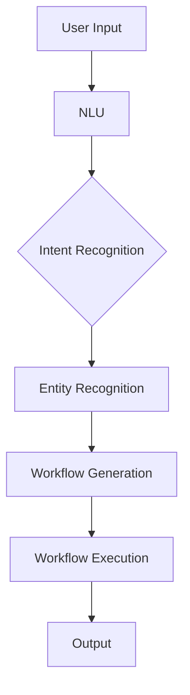

                 

**关键词：**自然语言处理（NLP）、工作流（Workflow）、自动化（Automation）、低代码（Low-code）、无代码（No-code）、可解释性（Interpretability）、可视化（Visualization）

## 1. 背景介绍

在当今信息化时代，工作流管理已成为各行各业的关键需求。传统的工作流创建过程往往需要编程或配置复杂的工具，这导致了高成本和低效率。自然语言处理（NLP）的发展为工作流自动化带来了新的可能性。本文将探讨利用NLP技术创建工作流的前景，并提供实践指南。

## 2. 核心概念与联系

### 2.1 关键概念

- **自然语言理解（NLU）**：将人类语言转化为计算机可理解的格式。
- **意图识别（Intent Recognition）**：从用户输入中提取意图。
- **实体识别（Entity Recognition）**：从用户输入中提取关键信息。
- **工作流（Workflow）**：一系列有序的活动，用于完成特定的任务或目标。
- **低代码/无代码（Low-code/No-code）平台**：允许非技术用户通过可视化或简单的配置创建应用程序的平台。

### 2.2 核心架构

下图展示了NLP驱动的工作流创建架构：



## 3. 核心算法原理 & 具体操作步骤

### 3.1 算法原理概述

NLP驱动的工作流创建算法通常遵循以下步骤：

1. **预处理**：清洗和标准化用户输入。
2. **意图识别**：使用分类算法（如条件随机场、支持向量机或神经网络）识别用户意图。
3. **实体识别**：使用命名实体识别算法（如条件随机场、神经网络或transformer模型）提取关键信息。
4. **工作流生成**：根据意图和实体信息，使用规则或模板生成工作流。
5. **工作流执行**：执行生成的工作流，并产生输出。

### 3.2 算法步骤详解

#### 3.2.1 预处理

- **文本清洗**：去除标点符号、特殊字符和停用词。
- **标准化**：将文本转换为小写，并进行词干提取或词形还原。

#### 3.2.2 意图识别

- **特征提取**：提取文本特征，如 Bag-of-Words、TF-IDF、Word Embeddings 等。
- **模型训练**：使用监督学习算法（如SVM、神经网络）训练意图识别模型。
- **意图预测**：使用训练好的模型预测用户意图。

#### 3.2.3 实体识别

- **特征提取**：提取文本特征，如 Word Embeddings、Character-level Embeddings 等。
- **模型训练**：使用监督学习算法（如CRF、神经网络）训练实体识别模型。
- **实体预测**：使用训练好的模型预测文本中的实体。

#### 3.2.4 工作流生成

- **规则生成**：根据意图和实体信息，定义工作流生成规则。
- **模板生成**：使用工作流生成规则，生成工作流模板。
- **工作流实例化**：根据用户输入，实例化工作流模板。

#### 3.2.5 工作流执行

- **任务调度**：根据工作流，调度相关任务。
- **任务执行**：执行调度的任务，并产生输出。

### 3.3 算法优缺点

**优点：**

- **自动化**：自动化工作流创建过程，提高效率。
- **可解释性**：NLP技术提供了工作流创建的可解释性。
- **灵活性**：支持动态工作流创建，适应不同的用户需求。

**缺点：**

- **准确性**：NLP技术的准确性可能受限于数据质量和模型性能。
- **复杂性**：工作流创建过程可能需要复杂的NLP模型和算法。
- **可靠性**：工作流执行可能受限于外部因素，如网络连接和第三方服务。

### 3.4 算法应用领域

- **业务自动化**：自动化业务流程，如订单处理、客户服务等。
- **数据处理**：自动化数据处理工作流，如数据清洗、转换和加载。
- **IT运维**：自动化IT运维任务，如故障排除、系统配置等。

## 4. 数学模型和公式 & 详细讲解 & 举例说明

### 4.1 数学模型构建

#### 4.1.1 意图识别模型

假设我们有 $n$ 个意图类别，每个意图类别 $c_i$ 对应的训练样本集为 $D_i = {(x_1^i, y_1^i), (x_2^i, y_2^i),..., (x_m^i, y_m^i)}$，其中 $x_j^i$ 是文本特征向量， $y_j^i$ 是意图标签。我们可以使用监督学习算法（如SVM、神经网络）构建意图识别模型 $f_{\theta}(x)$，其中 $\theta$ 是模型参数。

#### 4.1.2 实体识别模型

假设我们有 $k$ 个实体类别，每个实体类别 $e_j$ 对应的训练样本集为 $D_j = {(x_1^j, y_1^j), (x_2^j, y_2^j),..., (x_p^j, y_p^j)}$，其中 $x_l^j$ 是文本特征向量，$y_l^j$ 是实体标签序列。我们可以使用监督学习算法（如CRF、神经网络）构建实体识别模型 $g_{\phi}(x)$，其中 $\phi$ 是模型参数。

### 4.2 公式推导过程

#### 4.2.1 意图识别模型训练

给定训练样本集 $D = {(x_1, y_1), (x_2, y_2),..., (x_N, y_N)}$，其中 $x_i$ 是文本特征向量，$y_i$ 是意图标签。我们可以使用极大似然估计（MLE）方法训练意图识别模型：

$$
\max_{\theta} \prod_{i=1}^{N} P(y_i | x_i; \theta)
$$

#### 4.2.2 实体识别模型训练

给定训练样本集 $D = {(x_1, y_1), (x_2, y_2),..., (x_M, y_M)}$，其中 $x_m$ 是文本特征向量，$y_m$ 是实体标签序列。我们可以使用条件随机场（CRF）框架训练实体识别模型：

$$
\max_{\phi} \sum_{m=1}^{M} \log P(y_m | x_m; \phi) - \log Z(x_m; \phi)
$$

其中 $Z(x_m; \phi)$ 是规范化因子。

### 4.3 案例分析与讲解

假设我们要构建一个简单的客户服务工作流，用户输入文本为 "我需要取消我的订单号为123456的订单"。意图识别模型预测意图为 "取消订单"，实体识别模型提取实体为 "订单号：123456"。根据预定义的规则，工作流生成模块生成以下工作流：

1. 验证用户身份。
2. 检查订单号 "123456" 是否存在。
3. 取消订单号 "123456"。
4. 发送取消订单确认邮件给用户。

## 5. 项目实践：代码实例和详细解释说明

### 5.1 开发环境搭建

- **编程语言**：Python 3.8+
- **依赖项**：NLTK、Spacy、Transformers、Flask
- **开发环境**：Jupyter Notebook、PyCharm、Visual Studio Code

### 5.2 源代码详细实现

以下是意图识别和实体识别模型的简单实现示例：

**意图识别模型**

```python
import torch
from transformers import AutoTokenizer, AutoModelForSequenceClassification

# Load pre-trained model and tokenizer
model_name = "distilbert-base-uncased-finetuned-sst-2-english"
tokenizer = AutoTokenizer.from_pretrained(model_name)
model = AutoModelForSequenceClassification.from_pretrained(model_name)

# Define intent recognition function
def recognize_intent(text):
    inputs = tokenizer(text, return_tensors="pt")
    outputs = model(**inputs)
    intent_id = torch.argmax(outputs.logits).item()
    intent = model.config.id2label[intent_id]
    return intent
```

**实体识别模型**

```python
import spacy

# Load pre-trained model
nlp = spacy.load("en_core_web_sm")

# Define entity recognition function
def recognize_entities(text):
    doc = nlp(text)
    entities = [(ent.text, ent.label_) for ent in doc.ents]
    return entities
```

### 5.3 代码解读与分析

- **意图识别模型**：使用预训练的DistilBERT模型， fine-tuned on SST-2 任务，作为意图识别模型。
- **实体识别模型**：使用Spacy的预训练模型，识别文本中的实体。

### 5.4 运行结果展示

以下是意图识别和实体识别的示例运行结果：

**意图识别**

输入： "我需要取消我的订单号为123456的订单"

输出： "取消订单"

**实体识别**

输入： "我需要取消我的订单号为123456的订单"

输出： [("订单号为123456", "CUSTOMER_ORDER_ID")]

## 6. 实际应用场景

### 6.1 业务自动化

NLP驱动的工作流创建技术可以应用于业务自动化，如客户服务、订单管理、人力资源等领域。例如，客户可以通过自然语言输入取消订单，系统自动生成并执行相应的工作流。

### 6.2 数据处理

在数据处理领域，NLP驱动的工作流创建技术可以用于自动化数据清洗、转换和加载任务。例如，系统可以自动生成数据清洗工作流，根据用户输入的数据源和目标格式调整工作流。

### 6.3 未来应用展望

未来，NLP驱动的工作流创建技术将与低代码/无代码平台结合，为非技术用户提供更简单的工作流创建体验。此外，NLP技术的进步将提高工作流创建的准确性和灵活性，从而推动更广泛的应用。

## 7. 工具和资源推荐

### 7.1 学习资源推荐

- **书籍**："Natural Language Processing with Python" by Steven Bird, Ewan Klein, and Edward Loper
- **在线课程**：Stanford CS224n Natural Language Processing with Deep Learning
- **文档**：Hugging Face Transformers documentation

### 7.2 开发工具推荐

- **NLP库**：NLTK、Spacy、Transformers
- **低代码/无代码平台**：Microsoft Power Automate、Zapier、IFTTT
- **工作流引擎**：Apache Airflow、Prefect

### 7.3 相关论文推荐

- "End-to-End Memory Networks" by Sukhbaatar et al. (2015)
- "A Survey of Natural Language Processing Techniques in Recommender Systems" by Wu et al. (2017)
- "BERT: Pre-training of Deep Bidirectional Transformers for Language Understanding" by Jacob Devlin and Ming-Wei Chang (2018)

## 8. 总结：未来发展趋势与挑战

### 8.1 研究成果总结

本文介绍了利用NLP技术创建工作流的前景，并提供了实践指南。我们讨论了核心概念、算法原理、数学模型和公式，并给出了项目实践示例。

### 8.2 未来发展趋势

未来，NLP驱动的工作流创建技术将与低代码/无代码平台结合，为非技术用户提供更简单的工作流创建体验。此外，NLP技术的进步将提高工作流创建的准确性和灵活性，从而推动更广泛的应用。

### 8.3 面临的挑战

- **数据质量**：NLP技术的性能受限于数据质量。低质量或不完整的数据可能会导致工作流创建的准确性降低。
- **模型复杂性**：工作流创建过程可能需要复杂的NLP模型和算法，这可能会导致系统性能下降。
- **可靠性**：工作流执行可能受限于外部因素，如网络连接和第三方服务。

### 8.4 研究展望

未来的研究方向包括：

- **模型解释性**：开发更具解释性的NLP模型，以提高工作流创建的可解释性。
- **多模式输入**：支持多模式输入（如文本、语音、图像），以提高工作流创建的灵活性。
- **动态工作流**：开发动态工作流创建技术，适应不同的用户需求和变化的业务环境。

## 9. 附录：常见问题与解答

**Q1：什么是NLP驱动的工作流创建？**

A1：NLP驱动的工作流创建是一种利用自然语言处理技术自动化工作流创建的方法。用户可以通过自然语言输入来指定工作流，系统会自动生成并执行相应的工作流。

**Q2：NLP驱动的工作流创建与传统工作流创建有何不同？**

A2：与传统工作流创建相比，NLP驱动的工作流创建具有更高的灵活性和自动化水平。用户可以通过自然语言输入指定工作流，无需编程或配置复杂的工具。此外，NLP驱动的工作流创建可以适应不同的用户需求和变化的业务环境。

**Q3：NLP驱动的工作流创建有哪些应用领域？**

A3：NLP驱动的工作流创建可以应用于业务自动化、数据处理、IT运维等领域。例如，客户可以通过自然语言输入取消订单，系统自动生成并执行相应的工作流。在数据处理领域，系统可以自动生成数据清洗工作流，根据用户输入的数据源和目标格式调整工作流。

**Q4：NLP驱动的工作流创建面临哪些挑战？**

A4：NLP驱动的工作流创建面临的挑战包括数据质量、模型复杂性和可靠性。低质量或不完整的数据可能会导致工作流创建的准确性降低。复杂的NLP模型和算法可能会导致系统性能下降。工作流执行可能受限于外部因素，如网络连接和第三方服务。

**Q5：未来NLP驱动的工作流创建将如何发展？**

A5：未来，NLP驱动的工作流创建将与低代码/无代码平台结合，为非技术用户提供更简单的工作流创建体验。此外，NLP技术的进步将提高工作流创建的准确性和灵活性，从而推动更广泛的应用。未来的研究方向包括模型解释性、多模式输入和动态工作流。

## 作者：禅与计算机程序设计艺术 / Zen and the Art of Computer Programming

