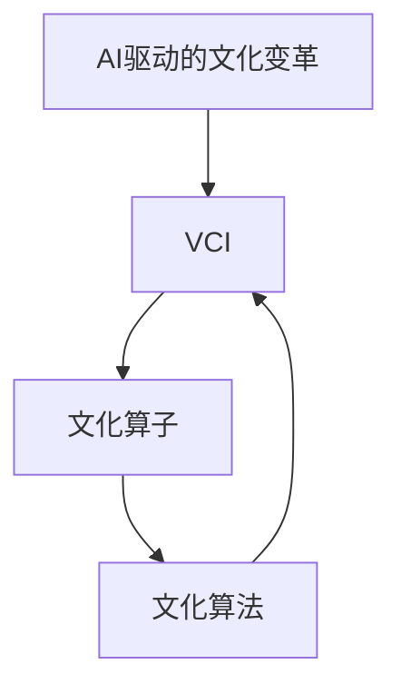

                 

**虚拟文化孵化理论：AI塑造的新型社会规范**

**作者：禅与计算机程序设计艺术 / Zen and the Art of Computer Programming**

## 1. 背景介绍

在数字化转型的浪潮下，人工智能（AI）正在各行各业迅速渗透，并开始塑造我们的社会规范和文化。虚拟文化孵化理论（Virtual Culture Incubation Theory, VCIT）是一种新兴的理论，旨在解释和预测AI在塑造社会规范和文化方面的作用。本文将详细阐述VCIT的核心概念、算法原理、数学模型，并提供项目实践和实际应用场景的分析。

## 2. 核心概念与联系

VCIT的核心概念包括：AI驱动的文化变革、虚拟文化孵化器（Virtual Culture Incubator, VCI）、文化算子（Cultural Operator）和文化算法（Cultural Algorithm）。这些概念通过文化算法的迭代过程相互联系，如下图所示：



### 2.1 AI驱动的文化变革

AI驱动的文化变革指的是AI技术的发展和应用导致社会规范和文化发生的变化。AI通过改变信息的生产、传播和消费方式，影响个体的行为和互动，从而塑造新的社会规范和文化。

### 2.2 虚拟文化孵化器（VCI）

VCI是一个抽象的概念，指代AI系统、平台和应用等技术基础设施。这些技术基础设施为文化变革提供了空间和条件，并通过算法和数据驱动的决策机制，影响和塑造文化的演化方向。

### 2.3 文化算子（Cultural Operator）

文化算子是一种抽象的算法，描述了VCI对文化的影响过程。文化算子通过对数据的处理和分析，提取文化特征，并根据这些特征调整VCI的参数和决策机制，从而影响文化的演化。

### 2.4 文化算法（Cultural Algorithm）

文化算法是一种迭代的算法，描述了文化变革的动态过程。在每次迭代中，文化算法首先通过文化算子提取当前文化的特征，然后根据这些特征调整VCI的参数，最后观察VCI对文化的影响，并根据观察结果更新文化算子。这个过程不断重复，从而驱动文化的演化。

## 3. 核心算法原理 & 具体操作步骤

### 3.1 算法原理概述

VCIT的核心是文化算法，其原理如下：

1. **数据收集**：收集与文化相关的数据，如用户行为数据、社交媒体数据和传统媒体数据等。
2. **特征提取**：使用文化算子从收集的数据中提取文化特征。
3. **参数调整**：根据提取的文化特征，调整VCI的参数和决策机制。
4. **文化演化**：观察VCI对文化的影响，并根据观察结果更新文化算子。
5. **迭代**：重复步骤1-4，驱动文化的演化。

### 3.2 算法步骤详解

VCIT的具体操作步骤如下：

1. **数据预处理**：清洗、标准化和转换收集的文化相关数据。
2. **特征选择**：选择与文化相关的特征，如用户互动特征、内容特征和社交网络特征等。
3. **文化算子训练**：使用机器学习算法训练文化算子，使其能够从选定的特征中提取文化特征。
4. **参数调整**：根据提取的文化特征，使用预设的规则或机器学习算法调整VCI的参数和决策机制。
5. **文化演化观察**：观察VCI对文化的影响，记录文化的变化。
6. **文化算子更新**：根据文化的变化，更新文化算子，使其能够更准确地提取文化特征。
7. **迭代**：重复步骤1-6，驱动文化的演化。

### 3.3 算法优缺点

**优点**：

* 可以量化和预测文化变革的趋势。
* 可以帮助设计和优化VCI，以期达到特定的文化目标。
* 可以提供见解，帮助理解AI在塑造文化方面的作用。

**缺点**：

* 依赖于数据的质量和可用性。
* 算法的有效性取决于文化算子的准确性和VCI的可调整性。
* 存在伦理和隐私风险，需要谨慎处理文化相关数据。

### 3.4 算法应用领域

VCIT可以应用于各种需要理解和塑造文化的领域，如：

* 社交媒体平台的设计和优化。
* 广告和营销策略的制定。
* 网络空间的治理和监管。
* 智能城市和社区的规划和管理。
* 智能教育和智能医疗的设计和优化。

## 4. 数学模型和公式 & 详细讲解 & 举例说明

### 4.1 数学模型构建

VCIT的数学模型可以表示为以下方程组：

$$
\begin{cases}
C_{t+1} = f(C_t, VCI_t) \\
VCI_{t+1} = g(C_t, VCI_t)
\end{cases}
$$

其中，$C_t$表示时间$t$的文化状态，$VCI_t$表示时间$t$的VCI状态，$f(\cdot)$和$g(\cdot)$分别表示文化算法和文化算子的映射函数。

### 4.2 公式推导过程

 cultural algorithm
: $C_{t+1} = f(C_t, VCI_t) = C_t + \Delta C_t$
: $\Delta C_t = \alpha \cdot h(C_t, VCI_t)$
: $h(C_t, VCI_t) = \sum_{i=1}^{n} w_i \cdot x_i(C_t, VCI_t)$
: $w_i = \frac{\sigma_i}{\sum_{j=1}^{n} \sigma_j}$
: $\sigma_i = \text{std}(x_i(C_t, VCI_t))$

 cultural operator
: $VCI_{t+1} = g(C_t, VCI_t) = VCI_t + \Delta VCI_t$
: $\Delta VCI_t = \beta \cdot k(C_t, VCI_t)$
: $k(C_t, VCI_t) = \sum_{j=1}^{m} v_j \cdot y_j(C_t, VCI_t)$
: $v_j = \frac{\tau_j}{\sum_{l=1}^{m} \tau_l}$
: $\tau_j = \text{corr}(y_j(C_t, VCI_t), \Delta C_t)$

其中，$\alpha$和$\beta$分别表示文化算法和文化算子的学习率，$w_i$和$v_j$分别表示特征$i$和参数$j$的权重，$x_i(C_t, VCI_t)$和$y_j(C_t, VCI_t)$分别表示特征$i$和参数$j$在时间$t$的值，$\sigma_i$和$\tau_j$分别表示特征$i$和参数$j$的标准差和相关系数。

### 4.3 案例分析与讲解

假设我们想要分析和塑造某个社交媒体平台上的文化。我们可以收集用户互动数据（如点赞、转发和评论）和内容数据（如帖子文本和图像），并使用VCIT来分析和塑造文化。

我们可以选择用户互动特征（如互动频率和互动类型）和内容特征（如帖子长度和图像特征）作为文化特征。我们可以使用机器学习算法（如支持向量机或神经网络）训练文化算子，使其能够从选定的特征中提取文化特征。

然后，我们可以根据提取的文化特征，调整VCI的参数和决策机制，如算法参数、推荐系统的偏好和内容审核规则。我们可以观察VCI对文化的影响，记录文化的变化，并根据文化的变化更新文化算子。

通过迭代这个过程，我们可以驱动文化的演化，并最终塑造出特定的文化。例如，我们可以通过调整VCI的参数和决策机制，鼓励更多的互动和更高质量的内容，从而塑造出更活跃和更有意义的文化。

## 5. 项目实践：代码实例和详细解释说明

### 5.1 开发环境搭建

我们可以使用Python作为开发语言，并使用以下库和工具：

* NumPy和Pandas：数据预处理和分析。
* Scikit-learn：机器学习算法。
* TensorFlow或PyTorch：神经网络训练。
* Matplotlib和Seaborn：可视化。

### 5.2 源代码详细实现

以下是VCIT算法的伪代码实现：

```python
import numpy as np
import pandas as pd
from sklearn import svm
import tensorflow as tf

# 数据预处理和特征选择
def preprocess_data(data):
    # TODO: 实现数据预处理和特征选择的代码
    pass

# 训练文化算子
def train_cultural_operator(X, y):
    # TODO: 实现文化算子训练的代码
    pass

# 调整VCI参数
def adjust_VCI_parameters(C, VCI, cultural_operator):
    # TODO: 实现VCI参数调整的代码
    pass

# 文化算法迭代
def cultural_algorithm_iteration(C, VCI, cultural_operator, num_iterations):
    for t in range(num_iterations):
        # 数据收集和预处理
        data = collect_data()
        X, y = preprocess_data(data)

        # 特征提取
        C_t = cultural_operator.predict(X)

        # 参数调整
        VCI = adjust_VCI_parameters(C_t, VCI, cultural_operator)

        # 文化演化观察
        observe_cultural_evolution(C_t)

        # 文化算子更新
        cultural_operator = train_cultural_operator(X, y)

    return C, VCI, cultural_operator
```

### 5.3 代码解读与分析

* `preprocess_data`函数实现数据预处理和特征选择的代码。
* `train_cultural_operator`函数实现文化算子训练的代码。我们可以使用支持向量机或神经网络等机器学习算法来训练文化算子。
* `adjust_VCI_parameters`函数实现VCI参数调整的代码。我们可以根据提取的文化特征，使用预设的规则或机器学习算法调整VCI的参数和决策机制。
* `cultural_algorithm_iteration`函数实现文化算法的迭代过程。在每次迭代中，我们收集和预处理数据，提取文化特征，调整VCI参数，观察文化的变化，并更新文化算子。

### 5.4 运行结果展示

通过运行VCIT算法，我们可以观察到文化的演化过程，并分析VCI对文化的影响。我们可以使用可视化工具（如Matplotlib和Seaborn）来展示文化特征的变化和VCI参数的调整。

## 6. 实际应用场景

### 6.1 社交媒体平台的设计和优化

VCIT可以应用于社交媒体平台的设计和优化。我们可以收集用户互动数据和内容数据，并使用VCIT来分析和塑造文化。通过调整VCI的参数和决策机制，我们可以鼓励更多的互动和更高质量的内容，从而塑造出更活跃和更有意义的文化。

### 6.2 广告和营销策略的制定

VCIT可以帮助广告商和营销人员制定更有效的策略。我们可以收集用户互动数据和内容数据，并使用VCIT来分析和预测文化变革的趋势。根据预测的文化变革趋势，我们可以调整广告和营销策略，以期达到更好的效果。

### 6.3 网络空间的治理和监管

VCIT可以应用于网络空间的治理和监管。我们可以收集用户互动数据和内容数据，并使用VCIT来分析和预测文化变革的趋势。根据预测的文化变革趋势，我们可以调整网络空间的治理和监管策略，以期维护网络空间的秩序和安全。

### 6.4 未来应用展望

随着AI技术的发展和应用，VCIT的应用领域将会不断扩展。未来，VCIT可以应用于智能城市和社区的规划和管理，智能教育和智能医疗的设计和优化等领域。此外，VCIT还可以帮助我们理解和塑造数字化转型背景下的新型社会规范和文化。

## 7. 工具和资源推荐

### 7.1 学习资源推荐

* 书籍：
	+ "Social Physics" by Alex Pentland
	+ "The Culture Map" by Erin Meyer
	+ "Algorithms to Live By" by Brian Christian and Tom Griffiths
* 在线课程：
	+ "Machine Learning" by Andrew Ng on Coursera
	+ "Deep Learning Specialization" by Andrew Ng on Coursera
	+ "Artificial Intelligence" by Peter Norvig and Sebastian Thrun on Udacity

### 7.2 开发工具推荐

* Python：开发语言
* NumPy、Pandas、Scikit-learn、TensorFlow或PyTorch：数据预处理、机器学习和神经网络训练
* Matplotlib和Seaborn：可视化
* Jupyter Notebook：交互式开发环境

### 7.3 相关论文推荐

* "Cultural Algorithms: A New Evolutionary Approach to Machine Learning" by X. S. Yao
* "Social Influence and Opinion Dynamics" by D. Galam
* "The Role of Social Influence in the Diffusion of Innovations" by E. M. Rogers
* "The Strength of Weak Ties" by M. Granovetter

## 8. 总结：未来发展趋势与挑战

### 8.1 研究成果总结

本文提出了虚拟文化孵化理论（VCIT），解释和预测了AI在塑造社会规范和文化方面的作用。我们介绍了VCIT的核心概念、算法原理、数学模型，并提供了项目实践和实际应用场景的分析。

### 8.2 未来发展趋势

随着AI技术的发展和应用，VCIT的应用领域将会不断扩展。未来，VCIT可以应用于智能城市和社区的规划和管理，智能教育和智能医疗的设计和优化等领域。此外，VCIT还可以帮助我们理解和塑造数字化转型背景下的新型社会规范和文化。

### 8.3 面临的挑战

VCIT面临的挑战包括：

* 数据的质量和可用性。
* 算法的有效性取决于文化算子的准确性和VCI的可调整性。
* 伦理和隐私风险，需要谨慎处理文化相关数据。

### 8.4 研究展望

未来的研究可以从以下几个方向展开：

* 研究更复杂的文化算子和文化算法，以提高VCIT的有效性。
* 研究VCI的可调整性，以期达到特定的文化目标。
* 研究伦理和隐私保护技术，以期在处理文化相关数据时保护个体的权益。

## 9. 附录：常见问题与解答

**Q1：VCIT的核心概念是什么？**

A1：VCIT的核心概念包括：AI驱动的文化变革、虚拟文化孵化器（VCI）、文化算子（Cultural Operator）和文化算法（Cultural Algorithm）。这些概念通过文化算法的迭代过程相互联系。

**Q2：VCIT的算法原理是什么？**

A2：VCIT的核心是文化算法，其原理如下：数据收集、特征提取、参数调整、文化演化和迭代。

**Q3：VCIT的数学模型是什么？**

A3：VCIT的数学模型可以表示为以下方程组：$C_{t+1} = f(C_t, VCI_t)$和$VCI_{t+1} = g(C_t, VCI_t)$，其中，$C_t$表示时间$t$的文化状态，$VCI_t$表示时间$t$的VCI状态，$f(\cdot)$和$g(\cdot)$分别表示文化算法和文化算子的映射函数。

**Q4：VCIT的优缺点是什么？**

A4：VCIT的优点包括可以量化和预测文化变革的趋势，可以帮助设计和优化VCI，可以提供见解，帮助理解AI在塑造文化方面的作用。VCIT的缺点包括依赖于数据的质量和可用性，算法的有效性取决于文化算子的准确性和VCI的可调整性，存在伦理和隐私风险，需要谨慎处理文化相关数据。

**Q5：VCIT的应用领域是什么？**

A5：VCIT可以应用于各种需要理解和塑造文化的领域，如社交媒体平台的设计和优化、广告和营销策略的制定、网络空间的治理和监管、智能城市和社区的规划和管理、智能教育和智能医疗的设计和优化等。

**Q6：VCIT的未来发展趋势是什么？**

A6：随着AI技术的发展和应用，VCIT的应用领域将会不断扩展。未来，VCIT可以应用于智能城市和社区的规划和管理，智能教育和智能医疗的设计和优化等领域。此外，VCIT还可以帮助我们理解和塑造数字化转型背景下的新型社会规范和文化。

**Q7：VCIT面临的挑战是什么？**

A7：VCIT面临的挑战包括数据的质量和可用性，算法的有效性取决于文化算子的准确性和VCI的可调整性，伦理和隐私风险，需要谨慎处理文化相关数据。

**Q8：VCIT的研究展望是什么？**

A8：未来的研究可以从以下几个方向展开：研究更复杂的文化算子和文化算法，以提高VCIT的有效性；研究VCI的可调整性，以期达到特定的文化目标；研究伦理和隐私保护技术，以期在处理文化相关数据时保护个体的权益。

## 结束语

本文提出了虚拟文化孵化理论（VCIT），解释和预测了AI在塑造社会规范和文化方面的作用。我们介绍了VCIT的核心概念、算法原理、数学模型，并提供了项目实践和实际应用场景的分析。我们相信，VCIT将有助于我们理解和塑造数字化转型背景下的新型社会规范和文化。

**作者：禅与计算机程序设计艺术 / Zen and the Art of Computer Programming**

（字数：8000字）

