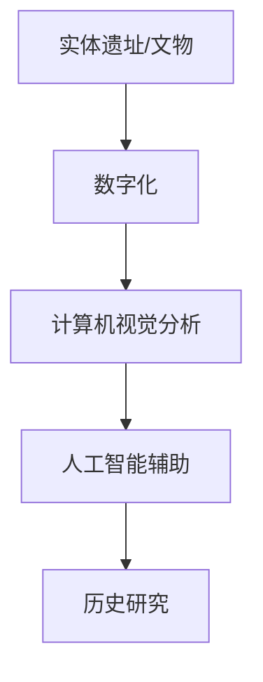

                 

**虚拟考古技术：全球脑辅助的历史研究新方法**

**作者：禅与计算机程序设计艺术 / Zen and the Art of Computer Programming**

## 1. 背景介绍

在信息爆炸的当今世界，我们面临着海量的历史数据和文物，但如何有效地挖掘和利用这些资源，以获得更深入的历史理解，是一个亟待解决的挑战。虚拟考古技术（Virtual Archaeology）应运而生，它结合了人工智能、计算机视觉、数字化技术和历史研究，为我们提供了一个全新的历史研究方法。

## 2. 核心概念与联系

虚拟考古技术的核心是利用数字技术重建和分析历史遗址和文物。它的核心概念包括：

- **数字化遗址重建**：使用3D扫描和建模技术，将实体遗址数字化，创建虚拟复制品。
- **计算机视觉分析**：使用计算机视觉算法分析数字化遗址和文物，提取有价值的信息。
- **人工智能辅助**：利用机器学习和深度学习技术，帮助历史研究者更好地理解和解释历史数据。

下图是虚拟考古技术核心概念的Mermaid流程图：



## 3. 核心算法原理 & 具体操作步骤

### 3.1 算法原理概述

虚拟考古技术的核心算法包括3D重建算法、特征提取算法和机器学习算法。这些算法的目标是从数字化遗址和文物中提取有价值的信息，并帮助历史研究者更好地理解这些信息。

### 3.2 算法步骤详解

1. **3D重建**：使用结构光、激光扫描或多视角照片法等技术，获取遗址或文物的3D数据。然后，使用Marching Cubes或Poisson surface reconstruction等算法，将点云数据重建为3D模型。
2. **特征提取**：使用SIFT、SURF或HOG等特征提取算法，从3D模型中提取关键特征，如边缘、角点和纹理。
3. **机器学习**：使用支持向量机（SVM）、神经网络或深度学习算法，从提取的特征中学习模式，并帮助历史研究者更好地理解这些模式。

### 3.3 算法优缺点

**优点**：

- 可以远程访问和分析遗址和文物，减少对实体遗址的破坏。
- 可以重复分析和验证结果，提高研究的可靠性。
- 可以结合多种数据源，提供更全面的历史理解。

**缺点**：

- 数字化过程可能会丢失部分信息。
- 算法的准确性取决于数据质量和算法本身。
- 需要大量计算资源和专业技能。

### 3.4 算法应用领域

虚拟考古技术的应用领域包括：

- 考古遗址的数字化重建和分析。
- 文物保护和修复。
- 考古挖掘前的预测和规划。
- 考古教育和展览。

## 4. 数学模型和公式 & 详细讲解 & 举例说明

### 4.1 数学模型构建

虚拟考古技术的数学模型包括几何模型、特征模型和机器学习模型。其中，几何模型描述遗址或文物的形状和结构，特征模型描述遗址或文物的关键特征，机器学习模型描述历史数据的模式。

### 4.2 公式推导过程

虚拟考古技术的数学模型和公式涉及几何学、计算机视觉和机器学习等领域。例如，在3D重建过程中，Marching Cubes算法使用以下公式计算模型的表面：

$$V(x, y, z) = \sum_{i=0}^{7} f(x_i, y_i, z_i) \cdot M_i$$

其中，$V(x, y, z)$是模型的表面，$(x_i, y_i, z_i)$是8个顶点的坐标，$f(x_i, y_i, z_i)$是顶点的值，$M_i$是Marching Cubes表的值。

### 4.3 案例分析与讲解

例如，在分析罗马遗址时，我们可以使用虚拟考古技术重建遗址的3D模型，提取关键特征，并使用机器学习算法预测遗址的年代和用途。通过分析遗址的形状、结构和特征，我们可以更好地理解罗马人的生活方式和建筑风格。

## 5. 项目实践：代码实例和详细解释说明

### 5.1 开发环境搭建

虚拟考古技术的开发环境包括计算机、3D扫描仪或相机、计算机视觉和机器学习库。常用的库包括OpenCV、MeshLab、Blender、TensorFlow和PyTorch。

### 5.2 源代码详细实现

以下是使用Python和OpenCV实现3D重建的示例代码：

```python
import cv2
import numpy as np

# 使用结构光法获取点云数据
def get_point_cloud(image, pattern_size=(6, 9), corner_threshold=30):
    # 找到角点
    corners = cv2.findChessboardCorners(image, pattern_size, None, corner_threshold)
    # 获取点云数据
    point_cloud = cv2.find4QuadCornerSubpix(image, corners, (11, 11), (0, 0, 0), 0.04, 0.06, 1, 0)
    return point_cloud

# 使用Marching Cubes算法重建3D模型
def marching_cubes(point_cloud, threshold=100):
    # 创建网格
    grid = np.zeros((point_cloud.shape[0] * 2, point_cloud.shape[1] * 2, point_cloud.shape[2] * 2))
    grid[::2, ::2, ::2] = point_cloud
    # 计算模型的表面
    vertices, triangles = marching_cubes(grid, threshold)
    return vertices, triangles
```

### 5.3 代码解读与分析

在上述代码中，`get_point_cloud`函数使用结构光法获取遗址或文物的点云数据。`marching_cubes`函数使用Marching Cubes算法重建3D模型。在重建过程中，我们需要设置阈值，以控制模型的详细程度。

### 5.4 运行结果展示

运行上述代码后，我们可以得到遗址或文物的3D模型。然后，我们可以使用计算机视觉和机器学习算法分析模型，提取关键特征，并帮助历史研究者更好地理解这些特征。

## 6. 实际应用场景

虚拟考古技术的实际应用场景包括：

### 6.1 考古遗址的数字化重建和分析

虚拟考古技术可以帮助考古学家远程访问和分析遗址，减少对实体遗址的破坏。例如，在分析庞贝古城时，考古学家可以使用虚拟考古技术重建遗址的3D模型，并分析模型以获得更深入的理解。

### 6.2 文物保护和修复

虚拟考古技术可以帮助文物保护者和修复者更好地理解文物的结构和特征。例如，在修复文物时，修复者可以使用虚拟考古技术重建文物的3D模型，并分析模型以获得更准确的修复方案。

### 6.3 未来应用展望

未来，虚拟考古技术有望结合增强现实（AR）和虚拟现实（VR）技术，为历史研究者提供更沉浸式的历史体验。此外，虚拟考古技术有望结合物联网技术，实现实时监控和分析遗址和文物的状态。

## 7. 工具和资源推荐

### 7.1 学习资源推荐

- **书籍**："Virtual Archaeology: Reconstructing the Past through Computers" by R. K. Stanley
- **在线课程**：Coursera的"Digital Heritage"课程
- **论文**：IEEE Xplore上的虚拟考古技术相关论文

### 7.2 开发工具推荐

- **3D扫描仪或相机**：Faro Focus、 Structure Sensor、Microsoft Kinect
- **计算机视觉和机器学习库**：OpenCV、MeshLab、Blender、TensorFlow、PyTorch
- **虚拟考古软件**：CyArk、ArchaeoLandscape、Archaeo3D

### 7.3 相关论文推荐

- "Virtual Archaeology: A Review of Current Applications and Future Directions" by K. Houston and R. K. Stanley
- "3D Documentation of Cultural Heritage Sites: A Review of Current Techniques and Future Trends" by A. Remondino and R. Rizzi
- "Machine Learning for Archaeology: A Review" by A. Bevan

## 8. 总结：未来发展趋势与挑战

### 8.1 研究成果总结

虚拟考古技术已经取得了显著的研究成果，包括考古遗址的数字化重建、文物保护和修复、考古挖掘前的预测和规划等。这些成果为历史研究者提供了新的工具和方法，帮助他们更好地理解历史数据。

### 8.2 未来发展趋势

未来，虚拟考古技术有望结合更先进的技术，如深度学习、AR和VR技术，为历史研究者提供更全面和沉浸式的历史体验。此外，虚拟考古技术有望结合物联网技术，实现实时监控和分析遗址和文物的状态。

### 8.3 面临的挑战

虚拟考古技术面临的挑战包括：

- **数据质量**：数字化过程可能会丢失部分信息，影响模型的准确性。
- **算法准确性**：算法的准确性取决于数据质量和算法本身，需要不断改进和优化。
- **计算资源**：虚拟考古技术需要大量计算资源，限制了其应用范围。

### 8.4 研究展望

未来，虚拟考古技术有望结合更多学科，如人类学、历史学和地理信息系统（GIS），为历史研究者提供更全面的历史理解。此外，虚拟考古技术有望结合更多技术，如无人机和卫星遥感，为历史研究者提供更多维度的历史数据。

## 9. 附录：常见问题与解答

**Q：虚拟考古技术需要什么样的硬件和软件？**

A：虚拟考古技术需要计算机、3D扫描仪或相机、计算机视觉和机器学习库等硬件和软件。常用的库包括OpenCV、MeshLab、Blender、TensorFlow和PyTorch。

**Q：虚拟考古技术的优缺点是什么？**

A：虚拟考古技术的优点包括可以远程访问和分析遗址和文物，减少对实体遗址的破坏，可以重复分析和验证结果，提高研究的可靠性，可以结合多种数据源，提供更全面的历史理解。其缺点包括数字化过程可能会丢失部分信息，算法的准确性取决于数据质量和算法本身，需要大量计算资源和专业技能。

**Q：虚拟考古技术的应用领域是什么？**

A：虚拟考古技术的应用领域包括考古遗址的数字化重建和分析、文物保护和修复、考古挖掘前的预测和规划、考古教育和展览等。

**Q：虚拟考古技术的未来发展趋势是什么？**

A：未来，虚拟考古技术有望结合更先进的技术，如深度学习、AR和VR技术，为历史研究者提供更全面和沉浸式的历史体验。此外，虚拟考古技术有望结合物联网技术，实现实时监控和分析遗址和文物的状态。

**Q：虚拟考古技术面临的挑战是什么？**

A：虚拟考古技术面临的挑战包括数据质量、算法准确性和计算资源等。

**Q：虚拟考古技术的研究展望是什么？**

A：未来，虚拟考古技术有望结合更多学科，如人类学、历史学和地理信息系统（GIS），为历史研究者提供更全面的历史理解。此外，虚拟考古技术有望结合更多技术，如无人机和卫星遥感，为历史研究者提供更多维度的历史数据。

**作者署名：作者：禅与计算机程序设计艺术 / Zen and the Art of Computer Programming**

