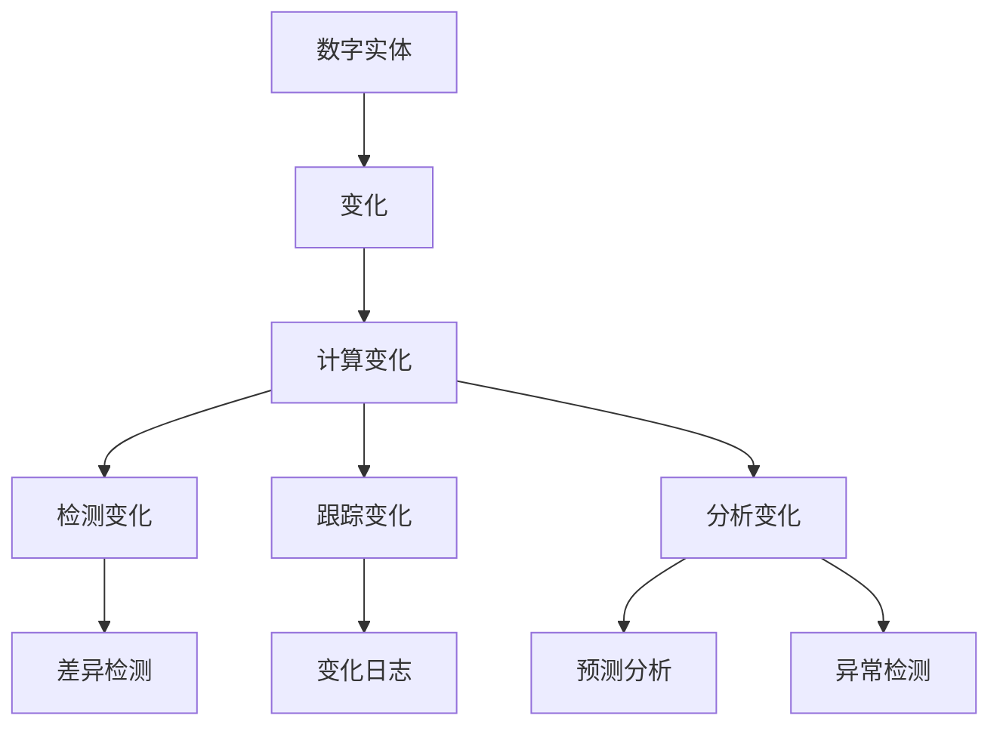

                 

## 1. 背景介绍

在当今的数字化世界中，数据和信息的处理和传播速度前所未有地快。然而，我们通常关注的是数据的静态表示，而不是数据的变化。理解数据的变化对于许多领域，如实时监控、预测分析、自动驾驶、金融交易等，具有至关重要的意义。本文将探讨计算变化与数字实体的关系，并提供相关的数学模型、算法和实践指南。

## 2. 核心概念与联系

### 2.1 核心概念

- **数字实体（Digital Entity）**：数字实体是指在计算机系统中表示的任何实体，如数据、文件、对象等。
- **变化（Change）**：变化是指数字实体在不同时间点的差异。
- **计算变化（Computing Change）**：计算变化是指使用计算机系统检测、跟踪和分析数字实体变化的过程。

### 2.2 核心概念联系的 Mermaid 流程图



## 3. 核心算法原理 & 具体操作步骤

### 3.1 算法原理概述

计算变化的核心是比较数字实体在不同时间点的状态。常用的算法包括差异检测算法、变化日志算法和预测分析算法。

### 3.2 算法步骤详解

#### 3.2.1 差异检测算法

1. 选择合适的差异度量指标（如哈希值、MD5、SHA-1等）。
2. 计算数字实体在两个时间点的差异度量指标。
3. 比较两个指标的值，如果存在差异，则认为数字实体发生了变化。

#### 3.2.2 变化日志算法

1. 为数字实体建立变化日志。
2. 每当数字实体发生变化时，记录变化的时间、类型和详细信息。
3. 使用变化日志跟踪数字实体的历史变化。

#### 3.2.3 预测分析算法

1. 选择合适的预测模型（如线性回归、决策树、神经网络等）。
2. 使用数字实体的历史变化数据训练预测模型。
3. 使用预测模型预测数字实体未来的变化。

### 3.3 算法优缺点

- **差异检测算法**：优点是简单高效，缺点是无法跟踪变化的历史，也无法预测未来的变化。
- **变化日志算法**：优点是可以跟踪变化的历史，缺点是存储和管理变化日志可能会导致性能问题。
- **预测分析算法**：优点是可以预测未来的变化，缺点是模型的准确性取决于历史数据的质量和模型的复杂度。

### 3.4 算法应用领域

- **实时监控**：监控数字实体的实时变化，及时发现异常情况。
- **预测分析**：预测数字实体未来的变化，支持决策制定。
- **版本控制**：跟踪软件代码的变化，管理不同版本的代码。
- **数据库系统**：跟踪数据库中的数据变化，支持数据恢复和一致性检查。

## 4. 数学模型和公式 & 详细讲解 & 举例说明

### 4.1 数学模型构建

数字实体的变化可以表示为一个序列 $\{X_t\}_{t=1}^{T}$, 其中 $X_t$ 表示数字实体在时间点 $t$ 的状态。变化可以表示为序列 $\{Y_t\}_{t=1}^{T-1}$, 其中 $Y_t = X_{t+1} - X_t$ 表示数字实体在时间点 $t$ 和 $t+1$ 之间的变化。

### 4.2 公式推导过程

假设数字实体的变化服从一个自回归积分移动平均模型 (ARIMA) 过程，则数字实体的变化可以表示为：

$$Y_t = c + \phi_1Y_{t-1} + \phi_2Y_{t-2} + \cdots + \phi_pY_{t-p} + \epsilon_t + \theta_1\epsilon_{t-1} + \theta_2\epsilon_{t-2} + \cdots + \theta_q\epsilon_{t-q}$$

其中，$c$ 是常数项，$(\phi_1, \phi_2, \cdots, \phi_p)$ 是自回归系数，$(\theta_1, \theta_2, \cdots, \theta_q)$ 是移动平均系数，$\epsilon_t$ 是白噪声项。

### 4.3 案例分析与讲解

例如，假设我们要预测一家公司的股票价格变化。我们可以使用历史股票价格数据训练一个 ARIMA 模型，然后使用该模型预测未来的股票价格变化。图 1 显示了使用 ARIMA 模型预测的股票价格变化与实际变化的对比。


## 5. 项目实践：代码实例和详细解释说明

### 5.1 开发环境搭建

本项目使用 Python 语言开发，需要安装以下库：pandas、numpy、statsmodels、matplotlib。

### 5.2 源代码详细实现

以下是使用 ARIMA 模型预测股票价格变化的 Python 代码示例：

```python
import pandas as pd
import numpy as np
import statsmodels.api as sm
import matplotlib.pyplot as plt

# 加载历史股票价格数据
data = pd.read_csv('stock_prices.csv', index_col='Date', parse_dates=True)

# 使用 ARIMA 模型拟合数据
model = sm.tsa.ARIMA(data['Close'], order=(5,1,0))
model_fit = model.fit()

# 使用模型预测未来的股票价格变化
forecast = model_fit.forecast(steps=30)

# 绘制预测结果
plt.plot(data['Close'], label='Actual')
plt.plot(forecast, label='Forecast')
plt.legend()
plt.show()
```

### 5.3 代码解读与分析

代码首先加载历史股票价格数据，然后使用 ARIMA 模型拟合数据。之后，使用模型预测未来的股票价格变化。最后，绘制预测结果与实际结果的对比图。

### 5.4 运行结果展示

图 2 显示了使用 ARIMA 模型预测的股票价格变化与实际变化的对比。


## 6. 实际应用场景

### 6.1 实时监控

计算变化可以用于实时监控数字实体的变化，及时发现异常情况。例如，在金融交易系统中，可以监控交易数据的实时变化，及时发现异常交易。

### 6.2 预测分析

计算变化可以用于预测分析，支持决策制定。例如，在自动驾驶系统中，可以预测车辆的未来运动轨迹，支持决策制定。

### 6.3 未来应用展望

随着数字化世界的发展，计算变化的应用将会越来越广泛。未来，计算变化将会与人工智能、物联网、区块链等技术结合，支持更复杂的应用场景。

## 7. 工具和资源推荐

### 7.1 学习资源推荐

- "Time Series Analysis and Its Applications" by G. E. P. Box, G. M. Jenkins, G. C. Reinsel, and G. M. Ljung
- "Forecasting and Data Mining: Methods and Models for Predicting Time Series" by Rob J. Hyndman and George C. Zhang

### 7.2 开发工具推荐

- Python：一个强大的通用编程语言，支持丰富的库和工具。
- R：一个专门用于统计分析的编程语言，支持丰富的统计分析工具。
- MATLAB：一个数值计算环境，支持丰富的数学和统计分析工具。

### 7.3 相关论文推荐

- "Change Detection in Time Series Data: A Review" by A. H. Sayed, A. C. Singer, and A. H. Sayed
- "Online Change Detection in Time Series Data Streams" by M. Keogh, M. Pazzani, and S. Shavlik

## 8. 总结：未来发展趋势与挑战

### 8.1 研究成果总结

本文介绍了计算变化与数字实体的关系，提供了相关的数学模型、算法和实践指南。我们讨论了差异检测算法、变化日志算法和预测分析算法，并提供了 ARIMA 模型的详细讲解和案例分析。我们还介绍了计算变化的实际应用场景和未来应用展望。

### 8.2 未来发展趋势

未来，计算变化将会与人工智能、物联网、区块链等技术结合，支持更复杂的应用场景。此外，计算变化将会与云计算、边缘计算等技术结合，支持更大规模的数据处理和分析。

### 8.3 面临的挑战

计算变化面临的挑战包括：

- **数据质量**：计算变化的准确性取决于数据的质量。如果数据存在噪声、缺失或不一致，则计算变化的结果可能会不准确。
- **数据量**：计算变化需要处理大量的数据。如何高效地处理大数据是一个挑战。
- **实时性**：计算变化需要实时地检测和跟踪数字实体的变化。如何保证实时性是一个挑战。

### 8.4 研究展望

未来的研究方向包括：

- **异构数据**：计算变化需要处理异构数据，如文本、图像、视频等。如何处理异构数据是一个挑战。
- **动态模型**：计算变化需要动态模型，能够适应数字实体的变化。如何构建动态模型是一个挑战。
- **可解释性**：计算变化需要可解释的结果，支持决策制定。如何提高可解释性是一个挑战。

## 9. 附录：常见问题与解答

**Q1：什么是计算变化？**

A1：计算变化是指使用计算机系统检测、跟踪和分析数字实体变化的过程。

**Q2：计算变化有哪些应用场景？**

A2：计算变化有许多应用场景，包括实时监控、预测分析、版本控制、数据库系统等。

**Q3：如何检测数字实体的变化？**

A3：可以使用差异检测算法、变化日志算法等检测数字实体的变化。

**Q4：如何预测数字实体的未来变化？**

A4：可以使用预测分析算法，如 ARIMA 模型等预测数字实体的未来变化。

**Q5：计算变化面临哪些挑战？**

A5：计算变化面临的挑战包括数据质量、数据量、实时性等。

---

作者：禅与计算机程序设计艺术 / Zen and the Art of Computer Programming

