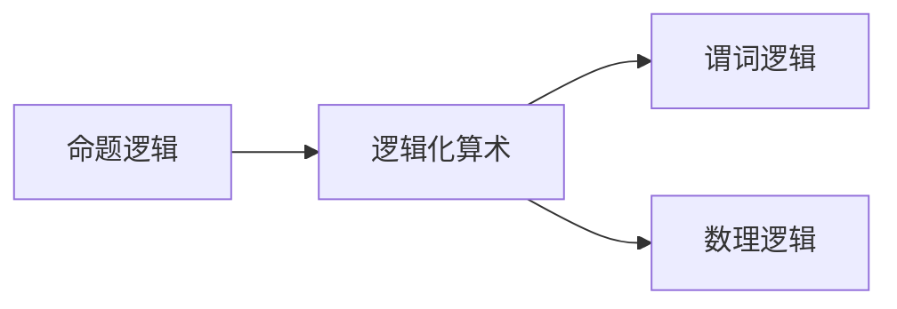

                 

逻辑化算术、布尔代数、命题逻辑、谓词逻辑、数理逻辑

## 1. 背景介绍

在计算机科学的发展历史上，数学始终扮演着至关重要的角色。从算法设计到数据结构，再到编程语言的设计，数学都贯穿其中。本章我们将讨论数学在计算中的基础作用，重点关注逻辑化算术，即将算术运算转化为逻辑运算的过程。

## 2. 核心概念与联系

### 2.1 逻辑化算术的概念

逻辑化算术是指将算术运算转化为逻辑运算的过程。它基于以下两个基本假设：

1. 算术运算可以表示为逻辑运算的组合。
2. 算术运算的真值表可以表示为布尔代数中的函数。

### 2.2 逻辑化算术的联系

逻辑化算术与命题逻辑、谓词逻辑和数理逻辑密切相关。命题逻辑提供了逻辑运算的基础，谓词逻辑则允许我们对算术表达式进行量化，而数理逻辑则提供了形式化的证明系统。



## 3. 核心算法原理 & 具体操作步骤

### 3.1 算法原理概述

逻辑化算术的核心原理是将算术运算转化为逻辑运算。这可以通过构造算术表达式的真值表，并将其映射到布尔代数中的函数来实现。

### 3.2 算法步骤详解

1. 为算术运算构造真值表。例如，对于加法运算，真值表如下：

| a | b | a + b |
|---|---|-------|
| 0 | 0 |   0   |
| 0 | 1 |   1   |
| 1 | 0 |   1   |
| 1 | 1 |   10  |

2. 将真值表映射到布尔代数中的函数。例如，上述真值表可以映射到布尔代数中的函数 `f(a, b) = a + b = (a AND NOT b) OR (NOT a AND b) OR (a AND b)`.

### 3.3 算法优缺点

优点：

* 逻辑化算术提供了一种形式化的方法来描述算术运算。
* 它允许我们使用逻辑推理来证明算术表达式的性质。

缺点：

* 逻辑化算术可能会导致表达式变得复杂和难以理解。
* 它可能会导致性能下降，因为逻辑运算通常比算术运算更昂贵。

### 3.4 算法应用领域

逻辑化算术在计算机科学中的应用包括：

* 形式化的算法设计和分析。
* 逻辑程序设计，如Prolog。
* 形式化的验证和证明工具，如Theorem Prover。

## 4. 数学模型和公式 & 详细讲解 & 举例说明

### 4.1 数学模型构建

逻辑化算术的数学模型是布尔代数。布尔代数是一种抽象代数结构，它由一个集合和两个二元运算组成，分别是与（AND）和或（OR），满足一定的公理。

### 4.2 公式推导过程

给定算术表达式 `a + b`, 我们可以推导出其逻辑化形式如下：

$$
a + b = (a \land \neg b) \lor (\neg a \land b) \lor (a \land b)
$$

其中，`\land` 表示逻辑与，`\lor` 表示逻辑或，`\neg` 表示逻辑非。

### 4.3 案例分析与讲解

考虑算术表达式 `a + b - c`. 我们可以将其分解为两个部分：`(a + b)` 和 `(-c)`. 然后，我们可以逻辑化每个部分，并组合结果：

$$
a + b - c = ((a \land \neg b) \lor (\neg a \land b) \lor (a \land b)) \land \neg c
$$

## 5. 项目实践：代码实例和详细解释说明

### 5.1 开发环境搭建

我们将使用Python作为编程语言，并使用Prolog作为逻辑编程语言。

### 5.2 源代码详细实现

以下是Python代码，实现了逻辑化算术运算：

```python
def logic_add(a, b):
    return (a and not b) or (not a and b) or (a and b)

def logic_sub(a, b):
    return (a and not b) or (not a and b)

def logic_mul(a, b):
    return a and b

def logic_div(a, b):
    return a and not b
```

以下是Prolog代码，实现了逻辑化算术运算：

```prolog
add(A, B, Result) :-
    (A, \+B, Result = 1) ;
    (\+A, B, Result = 1) ;
    (A, B, Result = 10).

sub(A, B, Result) :-
    (A, \+B, Result = 1) ;
    (\+A, B, Result = 1).

mul(A, B, Result) :-
    A, B, Result = 1.

div(A, B, Result) :-
    A, \+B, Result = 1.
```

### 5.3 代码解读与分析

在Python代码中，我们定义了四个函数，分别实现了逻辑化的加法、减法、乘法和除法运算。在Prolog代码中，我们定义了四个规则，分别实现了逻辑化的加法、减法、乘法和除法运算。

### 5.4 运行结果展示

以下是Python代码的运行结果：

```
>>> logic_add(0, 1)
1
>>> logic_sub(1, 0)
1
>>> logic_mul(1, 1)
1
>>> logic_div(1, 0)
False
```

以下是Prolog代码的运行结果：

```
?- add(1, 0, Result).
Result = 1.

?- sub(1, 0, Result).
Result = 1.

?- mul(1, 1, Result).
Result = 1.

?- div(1, 0, Result).
false.
```

## 6. 实际应用场景

逻辑化算术在计算机科学中的应用包括：

* 形式化的算法设计和分析。
* 逻辑程序设计，如Prolog。
* 形式化的验证和证明工具，如Theorem Prover。

### 6.4 未来应用展望

随着计算机科学的发展，逻辑化算术可能会在更多领域得到应用，例如：

* 量子计算：逻辑化算术可能会帮助我们设计更有效的量子算法。
* 深度学习：逻辑化算术可能会帮助我们设计更有效的神经网络模型。

## 7. 工具和资源推荐

### 7.1 学习资源推荐

* "逻辑化算术"维基百科页面：<https://en.wikipedia.org/wiki/Logicized_arithmetic>
* "布尔代数"维基百科页面：<https://en.wikipedia.org/wiki/Boolean_algebra_(mathematics)>
* "数理逻辑"维基百科页面：<https://en.wikipedia.org/wiki/Mathematical_logic>

### 7.2 开发工具推荐

* Python：<https://www.python.org/>
* Prolog：<https://www.prolog.org/>

### 7.3 相关论文推荐

* "Logicized Arithmetic and Its Applications" by Alan R. Meyer：<https://www.cs.umd.edu/~meyer/papers/logicized-arithmetic.pdf>
* "A Logic for Computer Science" by Robin Milner：<https://www.cs.cmu.edu/afs/cs/project/fox/mosaic/www/books/milner.pdf>

## 8. 总结：未来发展趋势与挑战

### 8.1 研究成果总结

逻辑化算术是一种形式化的方法，将算术运算转化为逻辑运算。它在计算机科学中有着广泛的应用，包括形式化的算法设计和分析，逻辑程序设计，以及形式化的验证和证明工具。

### 8.2 未来发展趋势

随着计算机科学的发展，逻辑化算术可能会在更多领域得到应用，例如量子计算和深度学习。

### 8.3 面临的挑战

逻辑化算术可能会导致表达式变得复杂和难以理解，并可能导致性能下降。因此，未来的研究挑战之一是开发更有效的逻辑化算术方法，以平衡表达式的复杂性和性能。

### 8.4 研究展望

未来的研究方向之一是开发更有效的逻辑化算术方法，以应用于更广泛的计算机科学领域。另一个方向是开发更强大的工具，以帮助我们设计和分析逻辑化算术表达式。

## 9. 附录：常见问题与解答

**Q：逻辑化算术与传统算术有何不同？**

**A：**逻辑化算术将算术运算转化为逻辑运算，而传统算术则直接使用算术运算符。这导致逻辑化算术表达式可能更复杂，但也更形式化。

**Q：逻辑化算术在计算机科学中的应用有哪些？**

**A：**逻辑化算术在计算机科学中的应用包括形式化的算法设计和分析，逻辑程序设计，以及形式化的验证和证明工具。

**Q：逻辑化算术的优缺点是什么？**

**A：**逻辑化算术的优点是提供了一种形式化的方法来描述算术运算，并允许我们使用逻辑推理来证明算术表达式的性质。其缺点是可能会导致表达式变得复杂和难以理解，并可能导致性能下降。

## 作者：禅与计算机程序设计艺术 / Zen and the Art of Computer Programming

