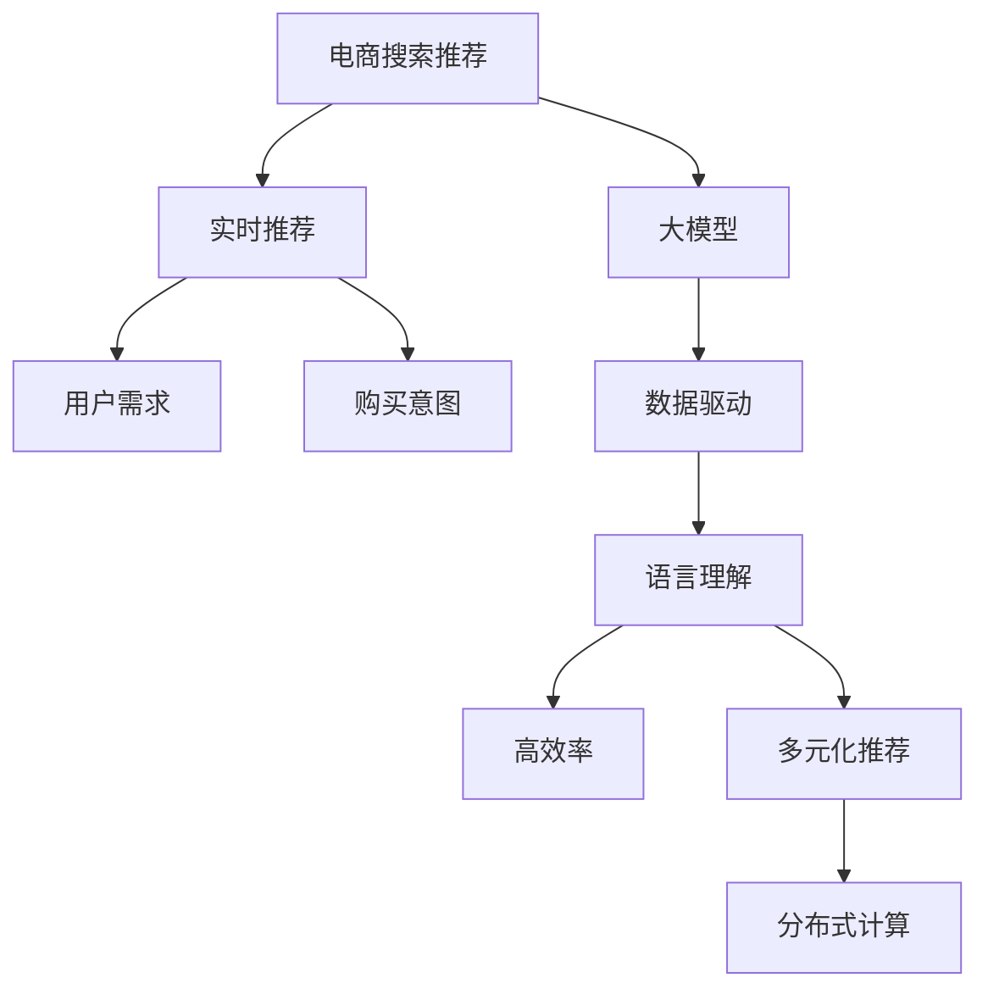

                 

# AI 大模型在电商搜索推荐中的实时推荐策略：抓住用户瞬时需求与购买意图

> 关键词：电商搜索, 推荐系统, 大模型, 实时推荐, 用户需求, 购买意图

## 1. 背景介绍

### 1.1 问题由来

随着电商行业的发展，个性化推荐系统成为了商家获取竞争优势的重要工具。然而，现有的推荐系统往往基于用户历史行为进行推荐，无法动态捕捉用户瞬时需求和购买意图。此外，模型计算效率低，难以实时响应搜索请求。面对这些问题，AI大模型提供了一种新的解决方案。

大模型通常指的是预训练语言模型，如BERT、GPT-3等。这些模型通过海量的无标签数据进行预训练，学习到了广泛的语言知识和语义理解能力。通过微调这些模型，可以使其适应特定的电商搜索场景，捕捉用户需求和购买意图，实现高效的实时推荐。

### 1.2 问题核心关键点

大模型推荐的核心在于以下几个关键点：
- 数据驱动的实时推荐：通过实时的搜索数据，动态捕捉用户需求和行为变化。
- 高精度的语言理解：利用大模型的语言知识，精确理解用户搜索意图。
- 高效的计算能力：通过分布式计算和大模型结构优化，实现高效率的实时推荐。
- 多元化的推荐维度：结合用户行为数据、产品特征、社交关系等多维信息，提升推荐效果。

### 1.3 问题研究意义

AI大模型在电商搜索推荐中的应用，不仅能够提升用户体验和购物满意度，还能显著提升商家的销售转化率和营收增长。具体来说：

- **提升用户满意度**：通过实时捕捉用户瞬时需求，推荐系统能够快速响应用户搜索请求，提供最相关的商品信息。
- **增加销售转化率**：利用用户搜索行为和购买历史数据，推荐系统能够精准预测用户购买意图，增加购买转化率。
- **优化库存管理**：根据用户搜索数据和推荐效果，商家能够及时调整库存，避免过剩或缺货现象。
- **增强品牌影响**：通过个性化推荐，提升用户粘性，增强品牌知名度和用户忠诚度。

## 2. 核心概念与联系

### 2.1 核心概念概述

为更好地理解AI大模型在电商搜索推荐中的应用，本节将介绍几个密切相关的核心概念：

- **电商搜索推荐系统(E-commerce Search and Recommendation System, ECSR)**：基于用户的搜索行为和历史数据，为用户提供个性化的商品推荐。
- **大模型(Large Model)**：如BERT、GPT-3等预训练语言模型，通过大规模无标签数据训练，学习到广泛的语义知识。
- **实时推荐(Real-Time Recommendation)**：根据用户的实时搜索数据和行为变化，动态更新推荐内容。
- **用户需求(User Intent)**：用户通过搜索关键词或短语表达的需求和偏好。
- **购买意图(Purchase Intent)**：用户可能购买的商品类别和品牌等信息，通过用户的搜索行为和购买历史预测。
- **分布式计算(Distributed Computing)**：利用多台计算设备并行计算，提升计算效率。
- **多元推荐(Multi-dimensional Recommendation)**：结合用户行为数据、产品特征、社交关系等多维信息，提升推荐效果。

这些核心概念之间的逻辑关系可以通过以下Mermaid流程图来展示：



这个流程图展示了大模型在电商搜索推荐中的应用流程：

1. 电商搜索推荐系统通过大模型进行数据驱动的实时推荐。
2. 用户需求通过实时搜索数据捕捉，购买意图通过语言理解进行预测。
3. 大模型利用高效率的分布式计算和多元化的推荐维度，提升推荐效果。

## 3. 核心算法原理 & 具体操作步骤

### 3.1 算法原理概述

大模型在电商搜索推荐中的应用，主要基于监督学习和预训练微调的方法。其核心思想是：通过在大规模无标签文本数据上预训练语言模型，学习通用的语言知识。然后，在电商搜索推荐场景中，通过微调这些模型，使其能够准确捕捉用户需求和预测购买意图，实现高效的实时推荐。

具体来说，大模型的预训练过程如下：

1. 收集电商搜索场景中用户的历史搜索数据和行为数据，构建语料库。
2. 使用自监督学习任务（如掩码语言建模、下一句预测等）训练大模型，学习语义知识。
3. 在电商搜索推荐任务上微调大模型，使其能够适应特定任务，捕捉用户需求和购买意图。

微调过程通常包括以下几个关键步骤：

1. **数据预处理**：将电商搜索数据进行预处理，包括数据清洗、特征提取、文本表示等。
2. **模型选择**：选择适合电商搜索场景的大模型作为初始化参数。
3. **任务适配层设计**：根据电商推荐任务，设计合适的输出层和损失函数。
4. **超参数设置**：设置学习率、批大小、迭代轮数等微调超参数。
5. **模型训练**：通过监督学习任务训练模型，最小化损失函数。
6. **模型评估**：在验证集上评估模型性能，确保过拟合和欠拟合问题。

### 3.2 算法步骤详解

以下是大模型在电商搜索推荐中的微调过程详细步骤：

#### 3.2.1 数据预处理

1. **数据收集**：收集电商平台的搜索记录、点击行为、购物车信息、用户评分等数据。
2. **数据清洗**：去除重复数据、无效数据，处理缺失值和异常值。
3. **特征提取**：提取用户行为特征、商品特征、搜索关键词、搜索时间戳等。
4. **文本表示**：将用户搜索关键词转换为模型能够处理的向量形式，如使用BERT Tokenizer进行分词和向量化。

#### 3.2.2 模型选择

选择适合电商搜索推荐场景的大模型作为初始化参数。例如，使用BERT作为基础模型，通过微调学习电商推荐任务的知识。

#### 3.2.3 任务适配层设计

根据电商推荐任务，设计合适的输出层和损失函数。例如，对于分类推荐任务，使用线性分类器作为输出层，交叉熵损失函数作为损失函数。

#### 3.2.4 超参数设置

设置微调超参数，如学习率、批大小、迭代轮数等。例如，设置学习率为2e-5，批大小为32，迭代轮数为10。

#### 3.2.5 模型训练

通过监督学习任务训练模型，最小化损失函数。例如，在电商搜索数据上训练模型，通过交叉熵损失函数衡量预测结果和真实标签的差异。

#### 3.2.6 模型评估

在验证集上评估模型性能，确保过拟合和欠拟合问题。例如，使用准确率、召回率、F1值等指标评估模型效果。

### 3.3 算法优缺点

#### 3.3.1 算法优点

大模型在电商搜索推荐中的应用具有以下优点：

1. **高精度的语言理解**：利用大模型的语言知识，能够准确理解用户搜索意图和需求。
2. **实时推荐能力**：通过分布式计算，实现高效率的实时推荐。
3. **自适应性强**：大模型能够根据实时数据进行动态微调，适应用户行为变化。
4. **可解释性强**：大模型可以提供详细的推理过程，帮助理解推荐结果。

#### 3.3.2 算法缺点

大模型在电商搜索推荐中的应用也存在一些缺点：

1. **计算成本高**：大模型的计算成本较高，需要高性能计算资源。
2. **数据隐私问题**：电商搜索数据涉及用户隐私，需要严格的数据隐私保护措施。
3. **过拟合风险**：大模型容易过拟合电商搜索数据，影响推荐效果。
4. **模型复杂度**：大模型结构复杂，需要额外的调参和优化工作。

### 3.4 算法应用领域

大模型在电商搜索推荐中的应用领域包括：

- **搜索推荐**：根据用户搜索关键词和行为数据，推荐相关商品。
- **个性化推荐**：根据用户的历史行为和偏好，提供个性化的商品推荐。
- **库存管理**：根据用户搜索数据和推荐效果，优化库存管理和商品定价。
- **广告投放**：通过用户搜索数据，预测用户购买意向，精准投放广告。

## 4. 数学模型和公式 & 详细讲解 & 举例说明

### 4.1 数学模型构建

假设电商搜索推荐任务为二分类任务，即判断用户是否会对某商品感兴趣。设用户搜索关键词为 $x$，商品特征为 $y$，模型输出为 $z$，标签为 $t$。

目标函数为：

$$
\min_{\theta} \frac{1}{N} \sum_{i=1}^N L(\theta;(x_i, y_i), t_i) + \lambda R(\theta)
$$

其中，$\theta$ 为模型参数，$L(\theta;(x_i, y_i), t_i)$ 为损失函数，$R(\theta)$ 为正则化项，$\lambda$ 为正则化系数。

### 4.2 公式推导过程

以二分类任务为例，推导交叉熵损失函数及其梯度的计算公式。

目标函数为：

$$
\min_{\theta} -\frac{1}{N} \sum_{i=1}^N [t_i \log P(y_i|x_i;\theta) + (1-t_i) \log (1-P(y_i|x_i;\theta))]
$$

其中，$P(y_i|x_i;\theta)$ 为模型在给定用户搜索关键词 $x_i$ 和商品特征 $y_i$ 下，判断用户是否感兴趣的概率。

使用梯度下降优化算法，求解目标函数：

$$
\theta \leftarrow \theta - \eta \nabla_{\theta}\mathcal{L}(\theta)
$$

其中 $\eta$ 为学习率，$\nabla_{\theta}\mathcal{L}(\theta)$ 为损失函数对参数 $\theta$ 的梯度。

### 4.3 案例分析与讲解

以推荐系统中的点击率预测任务为例，推导点击率预测模型的训练过程。

设用户搜索关键词为 $x$，商品特征为 $y$，模型输出为 $z$，标签为 $t$。使用 sigmoid 函数将输出转化为概率，即：

$$
P(t|x,y;\theta) = \sigma(z)
$$

其中，$\sigma(z) = \frac{1}{1+\exp(-z)}$。

使用二分类交叉熵损失函数，定义损失函数：

$$
L(\theta;(x_i, y_i), t_i) = -(t_i \log \sigma(z_i) + (1-t_i) \log (1-\sigma(z_i)))
$$

其中，$z_i$ 为模型在用户搜索关键词 $x_i$ 和商品特征 $y_i$ 下的输出。

通过梯度下降算法，最小化损失函数：

$$
\theta \leftarrow \theta - \eta \nabla_{\theta}L(\theta)
$$

其中，$\eta$ 为学习率，$\nabla_{\theta}L(\theta)$ 为损失函数对参数 $\theta$ 的梯度。

## 5. 项目实践：代码实例和详细解释说明

### 5.1 开发环境搭建

在进行电商搜索推荐系统的开发前，我们需要准备好开发环境。以下是使用Python进行PyTorch开发的环境配置流程：

1. 安装Anaconda：从官网下载并安装Anaconda，用于创建独立的Python环境。

2. 创建并激活虚拟环境：
```bash
conda create -n pytorch-env python=3.8 
conda activate pytorch-env
```

3. 安装PyTorch：根据CUDA版本，从官网获取对应的安装命令。例如：
```bash
conda install pytorch torchvision torchaudio cudatoolkit=11.1 -c pytorch -c conda-forge
```

4. 安装Transformers库：
```bash
pip install transformers
```

5. 安装各类工具包：
```bash
pip install numpy pandas scikit-learn matplotlib tqdm jupyter notebook ipython
```

完成上述步骤后，即可在`pytorch-env`环境中开始电商搜索推荐系统的开发。

### 5.2 源代码详细实现

下面我们以电商搜索推荐系统为例，给出使用Transformers库对BERT模型进行电商搜索推荐微调的PyTorch代码实现。

首先，定义电商搜索推荐任务的数据处理函数：

```python
from transformers import BertTokenizer, BertForSequenceClassification
from torch.utils.data import Dataset
import torch

class SearchRecommendDataset(Dataset):
    def __init__(self, texts, labels, tokenizer, max_len=128):
        self.texts = texts
        self.labels = labels
        self.tokenizer = tokenizer
        self.max_len = max_len
        
    def __len__(self):
        return len(self.texts)
    
    def __getitem__(self, item):
        text = self.texts[item]
        label = self.labels[item]
        
        encoding = self.tokenizer(text, return_tensors='pt', max_length=self.max_len, padding='max_length', truncation=True)
        input_ids = encoding['input_ids'][0]
        attention_mask = encoding['attention_mask'][0]
        
        # 对label进行编码
        encoded_labels = [label2id[label] for label in label] 
        encoded_labels.extend([label2id['O']] * (self.max_len - len(encoded_labels)))
        labels = torch.tensor(encoded_labels, dtype=torch.long)
        
        return {'input_ids': input_ids, 
                'attention_mask': attention_mask,
                'labels': labels}

# 标签与id的映射
label2id = {'O': 0, 'interest': 1, 'not_interest': 2}
id2label = {v: k for k, v in label2id.items()}

# 创建dataset
tokenizer = BertTokenizer.from_pretrained('bert-base-cased')

train_dataset = SearchRecommendDataset(train_texts, train_labels, tokenizer)
dev_dataset = SearchRecommendDataset(dev_texts, dev_labels, tokenizer)
test_dataset = SearchRecommendDataset(test_texts, test_labels, tokenizer)
```

然后，定义模型和优化器：

```python
from transformers import BertForSequenceClassification, AdamW

model = BertForSequenceClassification.from_pretrained('bert-base-cased', num_labels=len(label2id))

optimizer = AdamW(model.parameters(), lr=2e-5)
```

接着，定义训练和评估函数：

```python
from torch.utils.data import DataLoader
from tqdm import tqdm
from sklearn.metrics import accuracy_score, precision_recall_fscore_support

device = torch.device('cuda') if torch.cuda.is_available() else torch.device('cpu')
model.to(device)

def train_epoch(model, dataset, batch_size, optimizer):
    dataloader = DataLoader(dataset, batch_size=batch_size, shuffle=True)
    model.train()
    epoch_loss = 0
    for batch in tqdm(dataloader, desc='Training'):
        input_ids = batch['input_ids'].to(device)
        attention_mask = batch['attention_mask'].to(device)
        labels = batch['labels'].to(device)
        model.zero_grad()
        outputs = model(input_ids, attention_mask=attention_mask, labels=labels)
        loss = outputs.loss
        epoch_loss += loss.item()
        loss.backward()
        optimizer.step()
    return epoch_loss / len(dataloader)

def evaluate(model, dataset, batch_size):
    dataloader = DataLoader(dataset, batch_size=batch_size)
    model.eval()
    preds, labels = [], []
    with torch.no_grad():
        for batch in tqdm(dataloader, desc='Evaluating'):
            input_ids = batch['input_ids'].to(device)
            attention_mask = batch['attention_mask'].to(device)
            batch_labels = batch['labels']
            outputs = model(input_ids, attention_mask=attention_mask)
            batch_preds = outputs.logits.argmax(dim=2).to('cpu').tolist()
            batch_labels = batch_labels.to('cpu').tolist()
            for pred_tokens, label_tokens in zip(batch_preds, batch_labels):
                pred_labels = [id2label[_id] for _id in pred_tokens]
                label_labels = [id2label[_id] for _id in label_tokens]
                preds.append(pred_labels[:len(label_labels)])
                labels.append(label_labels)
                
    print(accuracy_score(labels, preds))
```

最后，启动训练流程并在测试集上评估：

```python
epochs = 5
batch_size = 16

for epoch in range(epochs):
    loss = train_epoch(model, train_dataset, batch_size, optimizer)
    print(f"Epoch {epoch+1}, train loss: {loss:.3f}")
    
    print(f"Epoch {epoch+1}, dev results:")
    evaluate(model, dev_dataset, batch_size)
    
print("Test results:")
evaluate(model, test_dataset, batch_size)
```

以上就是使用PyTorch对BERT进行电商搜索推荐任务微调的完整代码实现。可以看到，得益于Transformers库的强大封装，我们可以用相对简洁的代码完成BERT模型的加载和微调。

### 5.3 代码解读与分析

让我们再详细解读一下关键代码的实现细节：

**SearchRecommendDataset类**：
- `__init__`方法：初始化文本、标签、分词器等关键组件。
- `__len__`方法：返回数据集的样本数量。
- `__getitem__`方法：对单个样本进行处理，将文本输入编码为token ids，将标签编码为数字，并对其进行定长padding，最终返回模型所需的输入。

**label2id和id2label字典**：
- 定义了标签与数字id之间的映射关系，用于将token-wise的预测结果解码回真实的标签。

**训练和评估函数**：
- 使用PyTorch的DataLoader对数据集进行批次化加载，供模型训练和推理使用。
- 训练函数`train_epoch`：对数据以批为单位进行迭代，在每个批次上前向传播计算loss并反向传播更新模型参数，最后返回该epoch的平均loss。
- 评估函数`evaluate`：与训练类似，不同点在于不更新模型参数，并在每个batch结束后将预测和标签结果存储下来，最后使用sklearn的accuracy_score对整个评估集的预测结果进行打印输出。

**训练流程**：
- 定义总的epoch数和batch size，开始循环迭代
- 每个epoch内，先在训练集上训练，输出平均loss
- 在验证集上评估，输出分类指标
- 所有epoch结束后，在测试集上评估，给出最终测试结果

可以看到，PyTorch配合Transformers库使得BERT微调的代码实现变得简洁高效。开发者可以将更多精力放在数据处理、模型改进等高层逻辑上，而不必过多关注底层的实现细节。

当然，工业级的系统实现还需考虑更多因素，如模型的保存和部署、超参数的自动搜索、更灵活的任务适配层等。但核心的微调范式基本与此类似。

## 6. 实际应用场景

### 6.1 智能客服系统

基于大模型微调的电商搜索推荐技术，可以广泛应用于智能客服系统的构建。传统客服往往需要配备大量人力，高峰期响应缓慢，且一致性和专业性难以保证。而使用微调后的电商搜索推荐模型，可以7x24小时不间断服务，快速响应客户咨询，用自然流畅的语言解答各类常见问题。

在技术实现上，可以收集企业内部的历史客服对话记录，将问题和最佳答复构建成监督数据，在此基础上对预训练模型进行微调。微调后的电商搜索推荐模型能够自动理解用户意图，匹配最合适的答复模板进行回复。对于客户提出的新问题，还可以接入检索系统实时搜索相关内容，动态组织生成回答。如此构建的智能客服系统，能大幅提升客户咨询体验和问题解决效率。

### 6.2 个性化推荐系统

当前的推荐系统往往只依赖用户的历史行为数据进行推荐，无法动态捕捉用户瞬时需求和购买意图。基于大模型微调的电商搜索推荐系统，可以实时捕捉用户搜索关键词和行为数据，动态捕捉用户需求和购买意图，实现高效的个性化推荐。

在技术实现上，可以使用大模型对用户搜索数据进行微调，学习用户瞬时需求和购买意图。根据学习到的知识，实时推荐与用户需求最相关的商品，提高用户的购买转化率和满意度。

### 6.3 搜索推荐系统

电商搜索推荐系统利用大模型对用户搜索关键词进行微调，捕捉用户需求和购买意图，实现高效的个性化推荐。通过实时捕捉用户搜索数据，动态更新推荐内容，提升用户体验和购物满意度。

在技术实现上，可以使用大模型对用户搜索数据进行微调，学习用户瞬时需求和购买意图。根据学习到的知识，实时推荐与用户需求最相关的商品，提高用户的购买转化率和满意度。

### 6.4 未来应用展望

随着大模型和微调方法的不断发展，基于大模型微调的电商搜索推荐技术将呈现以下几个发展趋势：

1. **实时性增强**：通过分布式计算和高性能硬件，实现更高效的实时推荐。
2. **多模态融合**：结合图像、视频、语音等多模态数据，提升推荐系统的感知能力。
3. **个性化推荐**：通过深度学习模型和多维推荐维度，实现更个性化的商品推荐。
4. **场景化应用**：根据不同的应用场景，定制化优化推荐系统。
5. **隐私保护**：通过差分隐私、联邦学习等技术，保护用户隐私。
6. **公平性提升**：通过对抗学习、多源数据融合等方法，提升推荐系统的公平性。

以上趋势凸显了大模型在电商搜索推荐系统中的应用前景。这些方向的探索发展，必将进一步提升推荐系统的性能和应用范围，为电商行业带来新的变革。

## 7. 工具和资源推荐

### 7.1 学习资源推荐

为了帮助开发者系统掌握大模型微调的理论基础和实践技巧，这里推荐一些优质的学习资源：

1. **《Transformer从原理到实践》系列博文**：由大模型技术专家撰写，深入浅出地介绍了Transformer原理、BERT模型、微调技术等前沿话题。

2. **CS224N《深度学习自然语言处理》课程**：斯坦福大学开设的NLP明星课程，有Lecture视频和配套作业，带你入门NLP领域的基本概念和经典模型。

3. **《Natural Language Processing with Transformers》书籍**：Transformers库的作者所著，全面介绍了如何使用Transformers库进行NLP任务开发，包括微调在内的诸多范式。

4. **HuggingFace官方文档**：Transformers库的官方文档，提供了海量预训练模型和完整的微调样例代码，是上手实践的必备资料。

5. **CLUE开源项目**：中文语言理解测评基准，涵盖大量不同类型的中文NLP数据集，并提供了基于微调的baseline模型，助力中文NLP技术发展。

通过对这些资源的学习实践，相信你一定能够快速掌握大模型微调的精髓，并用于解决实际的NLP问题。

### 7.2 开发工具推荐

高效的开发离不开优秀的工具支持。以下是几款用于大模型微调开发的常用工具：

1. **PyTorch**：基于Python的开源深度学习框架，灵活动态的计算图，适合快速迭代研究。大部分预训练语言模型都有PyTorch版本的实现。

2. **TensorFlow**：由Google主导开发的开源深度学习框架，生产部署方便，适合大规模工程应用。同样有丰富的预训练语言模型资源。

3. **Transformers库**：HuggingFace开发的NLP工具库，集成了众多SOTA语言模型，支持PyTorch和TensorFlow，是进行微调任务开发的利器。

4. **Weights & Biases**：模型训练的实验跟踪工具，可以记录和可视化模型训练过程中的各项指标，方便对比和调优。与主流深度学习框架无缝集成。

5. **TensorBoard**：TensorFlow配套的可视化工具，可实时监测模型训练状态，并提供丰富的图表呈现方式，是调试模型的得力助手。

6. **Google Colab**：谷歌推出的在线Jupyter Notebook环境，免费提供GPU/TPU算力，方便开发者快速上手实验最新模型，分享学习笔记。

合理利用这些工具，可以显著提升大模型微调任务的开发效率，加快创新迭代的步伐。

### 7.3 相关论文推荐

大模型和微调技术的发展源于学界的持续研究。以下是几篇奠基性的相关论文，推荐阅读：

1. **Attention is All You Need**：提出了Transformer结构，开启了NLP领域的预训练大模型时代。

2. **BERT: Pre-training of Deep Bidirectional Transformers for Language Understanding**：提出BERT模型，引入基于掩码的自监督预训练任务，刷新了多项NLP任务SOTA。

3. **Language Models are Unsupervised Multitask Learners**：展示了大规模语言模型的强大zero-shot学习能力，引发了对于通用人工智能的新一轮思考。

4. **Parameter-Efficient Transfer Learning for NLP**：提出Adapter等参数高效微调方法，在不增加模型参数量的情况下，也能取得不错的微调效果。

5. **Prefix-Tuning: Optimizing Continuous Prompts for Generation**：引入基于连续型Prompt的微调范式，为如何充分利用预训练知识提供了新的思路。

6. **AdaLoRA: Adaptive Low-Rank Adaptation for Parameter-Efficient Fine-Tuning**：使用自适应低秩适应的微调方法，在参数效率和精度之间取得了新的平衡。

这些论文代表了大模型微调技术的发展脉络。通过学习这些前沿成果，可以帮助研究者把握学科前进方向，激发更多的创新灵感。

## 8. 总结：未来发展趋势与挑战

### 8.1 总结

本文对基于大模型微调的电商搜索推荐方法进行了全面系统的介绍。首先阐述了大模型和微调技术的研究背景和意义，明确了电商搜索推荐中的实时推荐、用户需求和购买意图的重要性。其次，从原理到实践，详细讲解了监督微调的数学原理和关键步骤，给出了电商搜索推荐任务开发的完整代码实例。同时，本文还广泛探讨了微调方法在智能客服、个性化推荐等多个领域的应用前景，展示了微调范式的巨大潜力。此外，本文精选了微调技术的各类学习资源，力求为读者提供全方位的技术指引。

通过本文的系统梳理，可以看到，基于大模型的电商搜索推荐系统能够提升用户体验和购物满意度，显著提高商家的销售转化率和营收增长。未来，伴随大模型的不断演进和微调技术的持续优化，基于电商搜索推荐系统的智能客服、个性化推荐等应用场景将得到更广泛的应用，为电商行业带来深远影响。

### 8.2 未来发展趋势

展望未来，大模型在电商搜索推荐中的应用将呈现以下几个发展趋势：

1. **实时性增强**：通过分布式计算和高性能硬件，实现更高效的实时推荐。
2. **多模态融合**：结合图像、视频、语音等多模态数据，提升推荐系统的感知能力。
3. **个性化推荐**：通过深度学习模型和多维推荐维度，实现更个性化的商品推荐。
4. **场景化应用**：根据不同的应用场景，定制化优化推荐系统。
5. **隐私保护**：通过差分隐私、联邦学习等技术，保护用户隐私。
6. **公平性提升**：通过对抗学习、多源数据融合等方法，提升推荐系统的公平性。

这些趋势凸显了大模型在电商搜索推荐系统中的应用前景。这些方向的探索发展，必将进一步提升推荐系统的性能和应用范围，为电商行业带来新的变革。

### 8.3 面临的挑战

尽管大模型在电商搜索推荐中的应用已经取得了瞩目成就，但在迈向更加智能化、普适化应用的过程中，它仍面临着诸多挑战：

1. **计算成本高**：大模型的计算成本较高，需要高性能计算资源。
2. **数据隐私问题**：电商搜索数据涉及用户隐私，需要严格的数据隐私保护措施。
3. **过拟合风险**：大模型容易过拟合电商搜索数据，影响推荐效果。
4. **模型复杂度**：大模型结构复杂，需要额外的调参和优化工作。
5. **实时性不足**：尽管基于大模型的电商搜索推荐系统可以实现高效率的推荐，但在某些场景下可能无法实时响应。
6. **公平性问题**：电商搜索推荐系统可能存在性别、种族等偏见，需要考虑公平性问题。

### 8.4 研究展望

面对大模型在电商搜索推荐中面临的挑战，未来的研究需要在以下几个方面寻求新的突破：

1. **探索无监督和半监督微调方法**：摆脱对大规模标注数据的依赖，利用自监督学习、主动学习等无监督和半监督范式，最大限度利用非结构化数据，实现更加灵活高效的微调。
2. **研究参数高效和计算高效的微调范式**：开发更加参数高效的微调方法，在固定大部分预训练参数的同时，只更新极少量的任务相关参数。同时优化微调模型的计算图，减少前向传播和反向传播的资源消耗，实现更加轻量级、实时性的部署。
3. **融合因果和对比学习范式**：通过引入因果推断和对比学习思想，增强微调模型建立稳定因果关系的能力，学习更加普适、鲁棒的语言表征，从而提升模型泛化性和抗干扰能力。
4. **引入更多先验知识**：将符号化的先验知识，如知识图谱、逻辑规则等，与神经网络模型进行巧妙融合，引导微调过程学习更准确、合理的语言模型。同时加强不同模态数据的整合，实现视觉、语音等多模态信息与文本信息的协同建模。
5. **结合因果分析和博弈论工具**：将因果分析方法引入微调模型，识别出模型决策的关键特征，增强输出解释的因果性和逻辑性。借助博弈论工具刻画人机交互过程，主动探索并规避模型的脆弱点，提高系统稳定性。
6. **纳入伦理道德约束**：在模型训练目标中引入伦理导向的评估指标，过滤和惩罚有偏见、有害的输出倾向。同时加强人工干预和审核，建立模型行为的监管机制，确保输出符合人类价值观和伦理道德。

这些研究方向的探索，必将引领大模型微调技术迈向更高的台阶，为构建安全、可靠、可解释、可控的智能系统铺平道路。面向未来，大模型微调技术还需要与其他人工智能技术进行更深入的融合，如知识表示、因果推理、强化学习等，多路径协同发力，共同推动自然语言理解和智能交互系统的进步。只有勇于创新、敢于突破，才能不断拓展语言模型的边界，让智能技术更好地造福人类社会。

## 9. 附录：常见问题与解答

**Q1：大模型微调是否适用于所有电商搜索推荐任务？**

A: 大模型微调在大多数电商搜索推荐任务上都能取得不错的效果，特别是对于数据量较小的任务。但对于一些特定领域的任务，如医学、法律等，仅仅依靠通用语料预训练的模型可能难以很好地适应。此时需要在特定领域语料上进一步预训练，再进行微调，才能获得理想效果。此外，对于一些需要时效性、个性化很强的任务，如对话、推荐等，微调方法也需要针对性的改进优化。

**Q2：微调过程中如何选择合适的学习率？**

A: 微调的学习率一般要比预训练时小1-2个数量级，如果使用过大的学习率，容易破坏预训练权重，导致过拟合。一般建议从1e-5开始调参，逐步减小学习率，直至收敛。也可以使用warmup策略，在开始阶段使用较小的学习率，再逐渐过渡到预设值。需要注意的是，不同的优化器(如AdamW、Adafactor等)以及不同的学习率调度策略，可能需要设置不同的学习率阈值。

**Q3：采用大模型微调时会面临哪些资源瓶颈？**

A: 目前主流的预训练大模型动辄以亿计的参数规模，对算力、内存、存储都提出了很高的要求。GPU/TPU等高性能设备是必不可少的，但即便如此，超大批次的训练和推理也可能遇到显存不足的问题。因此需要采用一些资源优化技术，如梯度积累、混合精度训练、模型并行等，来突破硬件瓶颈。同时，模型的存储和读取也可能占用大量时间和空间，需要采用模型压缩、稀疏化存储等方法进行优化。

**Q4：如何缓解微调过程中的过拟合问题？**

A: 过拟合是微调面临的主要挑战，尤其是在标注数据不足的情况下。常见的缓解策略包括：
1. 数据增强：通过回译、近义替换等方式扩充训练集
2. 正则化：使用L2正则、Dropout、Early Stopping等避免过拟合
3. 对抗训练：引入对抗样本，提高模型鲁棒性
4. 参数高效微调：只调整少量参数(如Adapter、Prefix等)，减小过拟合风险
5. 多模型集成：训练多个微调模型，取平均输出，抑制过拟合

这些策略往往需要根据具体任务和数据特点进行灵活组合。只有在数据、模型、训练、推理等各环节进行全面优化，才能最大限度地发挥大模型微调的威力。

**Q5：微调模型在落地部署时需要注意哪些问题？**

A: 将微调模型转化为实际应用，还需要考虑以下因素：
1. 模型裁剪：去除不必要的层和参数，减小模型尺寸，加快推理速度
2. 量化加速：将浮点模型转为定点模型，压缩存储空间，提高计算效率
3. 服务化封装：将模型封装为标准化服务接口，便于集成调用
4. 弹性伸缩：根据请求流量动态调整资源配置，平衡服务质量和成本
5. 监控告警：实时采集系统指标，设置异常告警阈值，确保服务稳定性
6. 安全防护：采用访问鉴权、数据脱敏等措施，保障数据和模型安全

大模型微调为电商搜索推荐系统提供了强大的技术支持，但如何将强大的性能转化为稳定、高效、安全的业务价值，还需要工程实践的不断打磨。唯有从数据、算法、工程、业务等多个维度协同发力，才能真正实现人工智能技术在电商行业的规模化落地。总之，微调需要开发者根据具体任务，不断迭代和优化模型、数据和算法，方能得到理想的效果。

---

作者：禅与计算机程序设计艺术 / Zen and the Art of Computer Programming

