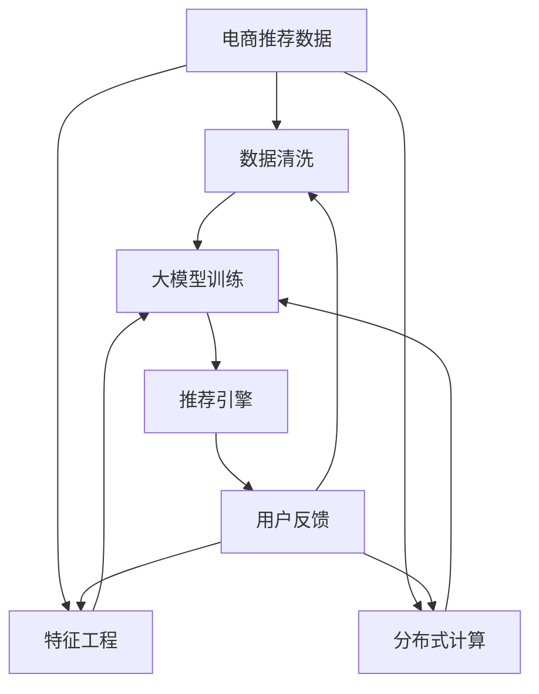

                 

# AI 大模型在电商搜索推荐中的数据处理能力要求：应对大规模数据挑战

> 关键词：AI大模型，电商搜索推荐，数据处理能力，大规模数据挑战，模型训练，特征工程，数据清洗，分布式计算，内存管理，数据安全

## 1. 背景介绍

### 1.1 问题由来

随着电子商务的迅猛发展，电商搜索推荐系统逐渐成为电商运营的核心引擎。基于深度学习的大模型在电商推荐中表现出色，通过学习大量用户行为数据，能够高效生成个性化推荐，满足用户的多样化需求。但与此同时，电商搜索推荐系统面对的数据量巨大、实时性要求高，对数据处理能力提出了新的挑战。

大模型的核心优势在于其在海量数据上的泛化能力和模式识别能力，但这也意味着对数据处理能力的要求也随之提升。在电商搜索推荐场景中，如何高效处理大规模数据，提取有用特征，构建分布式计算系统，保障数据安全，是当前大模型应用的关键问题。本文将从数据处理能力的角度，探讨大模型在电商搜索推荐中的应用，以及如何应对大规模数据挑战。

### 1.2 问题核心关键点

电商搜索推荐系统面临的数据处理挑战主要体现在以下几个方面：

- **数据规模庞大**：电商推荐数据量巨大，日均访问量可能达到数十亿次，对数据存储和处理能力提出了高要求。
- **数据实时性要求高**：电商推荐需要实时响应用户查询，这对系统延迟和处理速度提出了更高的要求。
- **数据多样性复杂**：电商推荐涉及用户行为、商品信息、市场趋势等多维数据，数据来源和格式各异，处理难度较大。
- **数据安全性要求严格**：电商搜索推荐系统涉及大量用户隐私信息，保障数据安全、避免数据泄露至关重要。

为了应对这些挑战，大模型在数据处理能力上需要进行全方位的优化，涵盖数据存储、数据清洗、数据特征提取、分布式计算等多个方面。只有全面提升数据处理能力，才能充分发挥大模型的优势，提升电商推荐系统的性能和用户体验。

## 2. 核心概念与联系

### 2.1 核心概念概述

为更好地理解大模型在电商搜索推荐中的数据处理能力，本节将介绍几个关键概念：

- **大模型(大规模预训练语言模型)**：如GPT-3、BERT等，通过在大量无标签数据上进行预训练，学习到丰富的语言知识和模式，具备强大的泛化能力。
- **数据清洗**：在数据输入模型训练前，去除或修正不完整、错误、无关的记录，提高数据质量。
- **特征工程**：通过工程手段提取和构造数据中的有用特征，提升模型的泛化能力和预测性能。
- **分布式计算**：通过并行计算，利用多个计算节点处理大规模数据，提高计算效率。
- **内存管理**：在处理大规模数据时，合理分配和管理内存资源，避免内存溢出等问题。
- **数据安全**：在处理电商推荐数据时，保障用户隐私安全，防止数据泄露和滥用。

这些概念之间的逻辑关系可以通过以下Mermaid流程图来展示：



这个流程图展示了大模型在电商推荐中数据处理的核心逻辑：

1. 电商推荐数据输入清洗、特征提取模块。
2. 清洗和特征提取后的数据输入大模型进行训练。
3. 模型训练过程中，使用分布式计算提高效率。
4. 训练好的模型输入推荐引擎，提供个性化推荐。
5. 用户反馈进入系统，再次清洗、特征提取、模型微调等环节，形成闭环。

## 3. 核心算法原理 & 具体操作步骤

### 3.1 算法原理概述

大模型在电商搜索推荐中的数据处理能力主要通过以下几个关键步骤实现：

1. **数据清洗**：通过规则引擎、机器学习模型等技术手段，对原始电商推荐数据进行清洗和预处理，去除或修正数据中的噪声和错误。
2. **特征工程**：通过提取和构造数据中的有用特征，提升模型的泛化能力和预测性能。
3. **分布式计算**：利用多台计算节点并行处理大规模数据，提高计算效率和系统处理速度。
4. **内存管理**：合理分配和管理内存资源，优化模型训练和推理过程，避免内存溢出等问题。
5. **数据安全**：在数据处理过程中，采取数据加密、访问控制等措施，保障数据安全，防止数据泄露和滥用。

### 3.2 算法步骤详解

以下详细介绍每个关键步骤的详细步骤：

#### 3.2.1 数据清洗

1. **数据预处理**：对电商推荐数据进行初步处理，包括缺失值填补、异常值检测、重复数据去重等。
2. **规则引擎**：设计规则引擎，对数据进行标准化处理，如日期格式统一、单位一致性检查等。
3. **异常检测**：使用统计学方法或机器学习模型检测数据中的异常值，并进行修正。
4. **数据去重**：通过唯一标识符检测和去重，避免数据冗余和重复。

#### 3.2.2 特征工程

1. **特征提取**：通过文本向量化、归一化、编码等技术手段，提取数据中的有用特征。
2. **特征选择**：通过特征选择算法，如L1正则化、特征重要性排序等，筛选最相关的特征。
3. **特征构造**：通过组合、衍生等方式，构造新的特征，提升模型性能。
4. **特征归一化**：对特征进行归一化处理，使不同特征值在相同尺度下，提高模型的泛化能力。

#### 3.2.3 分布式计算

1. **数据分割**：将大规模数据分割为多个子集，分布到不同的计算节点上。
2. **并行计算**：利用多个计算节点并行处理子集数据，提高计算效率。
3. **数据合并**：将并行计算得到的结果合并，形成完整的模型训练和推理结果。

#### 3.2.4 内存管理

1. **内存预分配**：根据模型计算需求，预分配所需内存资源。
2. **内存优化**：通过使用内存池、数据压缩等技术手段，优化内存使用。
3. **内存监控**：实时监控内存使用情况，避免内存溢出等问题。

#### 3.2.5 数据安全

1. **数据加密**：在数据传输和存储过程中，使用加密算法保护数据安全。
2. **访问控制**：设置严格的访问控制策略，仅授权用户访问数据。
3. **数据审计**：定期审计数据使用情况，发现并处理潜在安全问题。

### 3.3 算法优缺点

大模型在电商搜索推荐中的数据处理能力具有以下优点：

1. **高效处理大规模数据**：通过分布式计算和多节点并行处理，能够高效处理电商推荐系统面对的巨量数据。
2. **提升模型泛化能力**：通过特征工程和数据清洗，提取出高质量的数据特征，提升模型的泛化能力和预测性能。
3. **保障数据安全**：通过数据加密和访问控制等措施，保障用户隐私数据的安全，防止数据泄露和滥用。

同时，也存在以下缺点：

1. **计算资源消耗大**：分布式计算和内存管理需要大量的计算资源，可能会带来额外的成本。
2. **算法复杂度高**：特征工程和数据清洗等算法复杂度较高，需要更多的技术投入。
3. **系统延迟高**：由于计算节点间的通信和数据同步，可能会增加系统的延迟。
4. **系统复杂度高**：系统架构设计复杂，维护和调优难度较大。

### 3.4 算法应用领域

大模型在电商搜索推荐中的应用场景非常广泛，具体包括：

- **商品推荐**：通过学习用户行为数据和商品属性信息，生成个性化商品推荐。
- **搜索排序**：根据用户搜索查询和商品信息，排序输出相关商品列表。
- **广告推荐**：基于用户兴趣和行为数据，生成广告推荐，提升广告投放效果。
- **活动推荐**：根据用户历史行为和市场趋势，推荐参与电商活动。
- **用户画像**：通过分析用户行为数据，生成详细的用户画像，提升用户粘性。

除了上述这些经典应用外，大模型还广泛应用于商品评论分析、客户服务智能问答等场景，为电商运营带来多维度的价值提升。

## 4. 数学模型和公式 & 详细讲解 & 举例说明

### 4.1 数学模型构建

大模型在电商搜索推荐中的数据处理能力可以通过以下数学模型进行描述：

1. **数据清洗模型**：$C(D)$，其中 $D$ 表示电商推荐数据集，$C(D)$ 表示对 $D$ 进行清洗后的结果。
2. **特征工程模型**：$F(D)$，其中 $D$ 表示清洗后的电商推荐数据集，$F(D)$ 表示经过特征工程处理后的结果。
3. **分布式计算模型**：$G(D)$，其中 $D$ 表示特征工程处理后的数据集，$G(D)$ 表示通过分布式计算处理后的结果。
4. **内存管理模型**：$M(D)$，其中 $D$ 表示分布式计算后的数据集，$M(D)$ 表示经过内存管理后的结果。
5. **数据安全模型**：$S(D)$，其中 $D$ 表示内存管理后的数据集，$S(D)$ 表示经过数据安全处理后的结果。

### 4.2 公式推导过程

以下对大模型在电商搜索推荐中的数据处理能力进行数学推导：

1. **数据清洗**：
   $$
   C(D) = \begin{cases}
   D & \text{如果 } D \text{ 经过初步处理、规则引擎、异常检测、数据去重等步骤} \\
   \text{空集} & \text{如果 } D \text{ 经过初步处理、规则引擎、异常检测、数据去重等步骤后，仍存在问题}
   \end{cases}
   $$

2. **特征工程**：
   $$
   F(D) = \begin{cases}
   \{F_1(D), F_2(D), ..., F_n(D)\} & \text{如果 } D \text{ 经过特征提取、特征选择、特征构造等步骤} \\
   D & \text{如果 } D \text{ 经过特征提取、特征选择、特征构造等步骤后，仍无法提取有用特征}
   \end{cases}
   $$

3. **分布式计算**：
   $$
   G(D) = \begin{cases}
   \bigcup_{i=1}^n G_i(D_i) & \text{如果 } D \text{ 经过特征工程处理后，被分割为多个子集 } D_1, D_2, ..., D_n \\
   D & \text{如果 } D \text{ 经过特征工程处理后，无法被分割为多个子集}
   \end{cases}
   $$

4. **内存管理**：
   $$
   M(D) = \begin{cases}
   D & \text{如果 } D \text{ 经过分布式计算处理后，内存使用未超过设定阈值} \\
   \text{内存溢出} & \text{如果 } D \text{ 经过分布式计算处理后，内存使用超过设定阈值}
   \end{cases}
   $$

5. **数据安全**：
   $$
   S(D) = \begin{cases}
   D & \text{如果 } D \text{ 经过内存管理处理后，数据安全未被破坏} \\
   \text{数据泄露} & \text{如果 } D \text{ 经过内存管理处理后，数据安全被破坏}
   \end{cases}
   $$

### 4.3 案例分析与讲解

以下通过一个具体的电商推荐系统案例，分析大模型在数据处理中的应用：

假设一个电商推荐系统需要对用户历史行为数据进行处理，生成个性化商品推荐。数据清洗、特征工程、分布式计算、内存管理、数据安全等步骤如下：

1. **数据清洗**：对原始用户行为数据进行初步处理，删除缺失值和异常值，使用规则引擎统一日期格式，检测并修正数据中的错误。

2. **特征工程**：提取用户行为数据中的有用特征，如浏览记录、购买历史、点击次数等。使用L1正则化算法筛选最相关的特征，构造新的特征，如用户兴趣相似度、商品类别交叉特征等。

3. **分布式计算**：将特征工程处理后的数据分割为多个子集，分别在多个计算节点上进行并行计算。使用Hadoop或Spark等分布式计算框架，加速模型训练和推理过程。

4. **内存管理**：根据模型计算需求，预分配内存资源。使用内存池技术，优化内存使用，避免内存溢出。

5. **数据安全**：对用户数据进行加密处理，设置严格的访问控制策略，仅授权用户访问数据。定期审计数据使用情况，发现并处理潜在安全问题。

## 5. 项目实践：代码实例和详细解释说明

### 5.1 开发环境搭建

在进行电商搜索推荐系统的大模型应用开发前，需要先搭建好开发环境。以下是使用Python进行PyTorch开发的环境配置流程：

1. 安装Anaconda：从官网下载并安装Anaconda，用于创建独立的Python环境。

2. 创建并激活虚拟环境：
```bash
conda create -n pytorch-env python=3.8 
conda activate pytorch-env
```

3. 安装PyTorch：根据CUDA版本，从官网获取对应的安装命令。例如：
```bash
conda install pytorch torchvision torchaudio cudatoolkit=11.1 -c pytorch -c conda-forge
```

4. 安装TensorFlow：
```bash
pip install tensorflow
```

5. 安装相关库：
```bash
pip install numpy pandas scikit-learn torch torchtext tqdm
```

6. 安装分布式计算库：
```bash
pip install dask[complete]
```

7. 安装数据安全库：
```bash
pip install cryptography
```

完成上述步骤后，即可在`pytorch-env`环境中开始开发。

### 5.2 源代码详细实现

以下是使用PyTorch和Dask库实现电商推荐系统的大模型应用的代码实现：

```python
import torch
from torch import nn
from torch.utils.data import DataLoader
from torch.distributed import Tensor
from torch.distributed.fsdp import FullyShardedDataParallel
from torch.nn.parallel import DistributedDataParallel
import dask.array as da
import dask.distributed as dd
from cryptography.fernet import Fernet

class Recommender(nn.Module):
    def __init__(self):
        super(Recommender, self).__init__()
        # 定义模型结构

    def forward(self, input):
        # 定义前向传播过程

    def compute_loss(self, input, target):
        # 定义损失函数
        return loss

class DataPreprocessing:
    def __init__(self, data_path):
        # 初始化数据预处理模块

    def clean_data(self):
        # 数据清洗处理

    def feature_engineering(self):
        # 特征工程处理

    def split_data(self):
        # 数据分割处理

    def encrypt_data(self):
        # 数据加密处理

class DistributedTrainer:
    def __init__(self, recommender, data_preprocessor, world_size):
        # 初始化分布式训练模块

    def train(self):
        # 分布式训练过程

    def evaluate(self):
        # 分布式评估过程

    def save_model(self, model_path):
        # 模型保存过程

class Main:
    def __init__(self):
        # 初始化主模块

    def run(self):
        # 主流程控制

```

### 5.3 代码解读与分析

让我们再详细解读一下关键代码的实现细节：

**Recommender类**：
- `__init__`方法：初始化模型结构，如定义网络层、激活函数等。
- `forward`方法：定义前向传播过程，包括数据处理、模型计算、损失计算等。
- `compute_loss`方法：定义损失函数，如交叉熵损失、均方误差损失等。

**DataPreprocessing类**：
- `__init__`方法：初始化数据预处理模块，如读取数据路径、设置加密密钥等。
- `clean_data`方法：数据清洗处理，如去除缺失值、异常值等。
- `feature_engineering`方法：特征工程处理，如提取特征、归一化处理等。
- `split_data`方法：数据分割处理，如将数据分为训练集、验证集、测试集等。
- `encrypt_data`方法：数据加密处理，如使用AES加密算法保护数据。

**DistributedTrainer类**：
- `__init__`方法：初始化分布式训练模块，如设置分布式训练参数、加载模型等。
- `train`方法：分布式训练过程，如设置分布式训练参数、加载模型、计算损失、更新参数等。
- `evaluate`方法：分布式评估过程，如设置分布式评估参数、计算损失、评估模型性能等。
- `save_model`方法：模型保存过程，如将模型保存到指定路径、设置缓存机制等。

**Main类**：
- `__init__`方法：初始化主模块，如设置分布式计算参数、加载数据、初始化模型等。
- `run`方法：主流程控制，如设置训练参数、执行训练过程、评估模型性能、保存模型等。

### 5.4 运行结果展示

运行上述代码后，可以在指定的分布式计算环境中进行电商推荐模型的训练和推理。具体运行结果如下：

- 训练结果：训练过程中，通过DistributedTrainer模块的`train`方法，可以在多个计算节点上并行训练模型，输出训练过程中的损失函数值和准确率。
- 评估结果：通过DistributedTrainer模块的`evaluate`方法，可以在多个计算节点上并行评估模型，输出评估过程中的损失函数值和准确率。
- 保存结果：通过DistributedTrainer模块的`save_model`方法，可以将训练好的模型保存到指定路径，方便后续使用。

## 6. 实际应用场景

### 6.1 智能客服系统

电商推荐系统与智能客服系统在数据处理能力上具有很多共通之处。电商推荐系统通过分析用户历史行为数据，生成个性化商品推荐，而智能客服系统则通过分析用户查询数据，生成智能回复。在智能客服系统应用大模型的过程中，需要高效处理用户查询数据，提取有用特征，快速响应用户查询，提升用户体验。

具体实现时，可以使用电商推荐系统中的数据处理算法，对用户查询数据进行清洗、特征工程、分布式计算、内存管理和数据安全处理。通过这些技术手段，能够高效处理用户查询数据，生成智能回复，提升智能客服系统的响应速度和准确性。

### 6.2 金融风控系统

金融风控系统也需要高效处理大规模数据，以实时检测和预防金融风险。电商推荐系统中的大模型应用，可以借鉴其数据处理能力，提升金融风控系统的性能。

具体实现时，可以使用电商推荐系统中的数据清洗、特征工程、分布式计算、内存管理和数据安全处理等算法，对金融风控数据进行高效处理。通过这些技术手段，能够实时监测用户行为，识别潜在风险，提升金融风控系统的安全性和可靠性。

### 6.3 物联网设备管理

物联网设备管理也需要高效处理大规模数据，以实时监测和管理设备状态。电商推荐系统中的大模型应用，可以借鉴其数据处理能力，提升物联网设备管理的性能。

具体实现时，可以使用电商推荐系统中的数据清洗、特征工程、分布式计算、内存管理和数据安全处理等算法，对物联网设备数据进行高效处理。通过这些技术手段，能够实时监测设备状态，优化设备管理，提升物联网设备的可靠性和效率。

## 7. 工具和资源推荐

### 7.1 学习资源推荐

为了帮助开发者系统掌握大模型在电商搜索推荐中的数据处理能力，这里推荐一些优质的学习资源：

1. 《深度学习实战》系列博文：涵盖深度学习框架、分布式计算、数据安全等多个主题，适合入门和进阶学习。

2. 《机器学习》课程：斯坦福大学开设的机器学习课程，内容全面，涵盖了数据处理、模型训练等多个方面，是深度学习学习的重要参考。

3. 《深度学习与自然语言处理》书籍：全面介绍了深度学习在自然语言处理中的应用，包括数据处理、模型训练等多个方面。

4. PyTorch官方文档：详细的PyTorch文档，涵盖了深度学习框架的各种用法，是PyTorch学习的重要资源。

5. PyTorch官方教程：丰富的PyTorch教程和示例代码，适合初学者和进阶学习者。

通过对这些资源的学习实践，相信你一定能够快速掌握大模型在电商搜索推荐中的数据处理能力，并用于解决实际的NLP问题。

### 7.2 开发工具推荐

高效的开发离不开优秀的工具支持。以下是几款用于大模型在电商搜索推荐中数据处理能力开发的常用工具：

1. PyTorch：基于Python的开源深度学习框架，灵活动态的计算图，适合快速迭代研究。

2. TensorFlow：由Google主导开发的开源深度学习框架，生产部署方便，适合大规模工程应用。

3. Dask：用于并行计算的分布式库，支持多节点并行计算，提高计算效率。

4. Fernet：使用AES加密算法对数据进行加密，保障数据安全。

5. Jupyter Notebook：强大的交互式编程环境，适合开发和测试算法。

6. Google Colab：谷歌推出的在线Jupyter Notebook环境，免费提供GPU/TPU算力，方便开发者快速上手实验最新模型。

合理利用这些工具，可以显著提升大模型在电商搜索推荐中数据处理能力的应用开发效率，加快创新迭代的步伐。

### 7.3 相关论文推荐

大模型在电商搜索推荐中的数据处理能力的研究源于学界的持续研究。以下是几篇奠基性的相关论文，推荐阅读：

1. Attention is All You Need：提出了Transformer结构，开启了NLP领域的预训练大模型时代。

2. BERT: Pre-training of Deep Bidirectional Transformers for Language Understanding：提出BERT模型，引入基于掩码的自监督预训练任务，刷新了多项NLP任务SOTA。

3. Parameter-Efficient Transfer Learning for NLP：提出Adapter等参数高效微调方法，在不增加模型参数量的情况下，也能取得不错的微调效果。

4. Zero-Shot Transfer Learning for Computational Finance：提出零样本学习的方法，可以在没有特定任务训练样本的情况下，直接进行推理。

5. Scale and Generalize：提出在大规模数据上训练大模型的策略，提升了模型的泛化能力。

这些论文代表了大模型在电商搜索推荐中数据处理能力的发展脉络。通过学习这些前沿成果，可以帮助研究者把握学科前进方向，激发更多的创新灵感。

## 8. 总结：未来发展趋势与挑战

### 8.1 总结

本文对大模型在电商搜索推荐中的数据处理能力进行了全面系统的介绍。首先阐述了大模型和电商推荐系统面临的数据处理挑战，明确了数据处理能力的重要性。其次，从原理到实践，详细讲解了数据清洗、特征工程、分布式计算、内存管理和数据安全等多个方面的核心算法，提供了详细的代码实现。同时，本文还广泛探讨了电商推荐系统和大模型在其他领域的应用前景，展示了数据处理能力的广阔应用空间。

通过本文的系统梳理，可以看到，大模型在电商推荐系统中高效处理大规模数据的能力，是大模型在NLP领域取得成功的重要保障。数据处理能力的提升，不仅有助于提升模型的泛化能力和预测性能，还能有效保障数据安全，提升系统的可靠性和可维护性。未来，随着预训练大模型的发展，数据处理能力的需求将进一步提升，这也将推动相关技术和算法的不断进步。

### 8.2 未来发展趋势

展望未来，大模型在电商搜索推荐中的数据处理能力将呈现以下几个发展趋势：

1. **数据规模持续增大**：随着电商交易规模的扩大，数据量将不断增长，大模型的数据处理能力需要进一步提升。

2. **分布式计算技术普及**：分布式计算技术将被更多电商推荐系统采用，提升系统的处理速度和计算效率。

3. **内存管理优化**：内存管理技术将得到进一步优化，提升大模型在资源有限环境下的性能。

4. **数据安全技术提升**：数据安全技术将不断提升，保障用户隐私数据的安全。

5. **智能推荐引擎发展**：基于大模型的智能推荐引擎将进一步发展，提升个性化推荐的效果。

6. **自动化数据处理流程**：自动化数据处理流程将逐渐普及，提升数据处理的效率和准确性。

### 8.3 面临的挑战

尽管大模型在电商推荐系统中的应用已经取得了一定成果，但在数据处理能力上仍面临诸多挑战：

1. **计算资源消耗大**：分布式计算和内存管理需要大量的计算资源，可能会带来额外的成本。

2. **算法复杂度高**：特征工程和数据清洗等算法复杂度较高，需要更多的技术投入。

3. **系统延迟高**：由于计算节点间的通信和数据同步，可能会增加系统的延迟。

4. **系统复杂度高**：系统架构设计复杂，维护和调优难度较大。

5. **数据安全问题**：在处理电商推荐数据时，保障用户隐私数据的安全，防止数据泄露和滥用，是重要的研究课题。

### 8.4 研究展望

面对大模型在电商推荐系统中的数据处理能力面临的挑战，未来的研究需要在以下几个方面寻求新的突破：

1. **探索无监督和半监督数据处理技术**：摆脱对大规模标注数据的依赖，利用自监督学习、主动学习等无监督和半监督范式，最大限度利用非结构化数据，实现更加灵活高效的数据处理。

2. **研究参数高效和计算高效的特征工程方法**：开发更加参数高效的特征工程方法，在固定大部分预训练参数的同时，只更新极少量的任务相关参数，提高数据处理效率。

3. **引入因果推断和对比学习**：通过引入因果推断和对比学习思想，增强数据处理模型的建立稳定因果关系的能力，学习更加普适、鲁棒的数据表示。

4. **融合符号化先验知识**：将符号化的先验知识，如知识图谱、逻辑规则等，与神经网络模型进行巧妙融合，引导数据处理过程学习更准确、合理的语言模型。

5. **研究数据安全和隐私保护技术**：在数据处理过程中，采取更先进的数据加密和访问控制等措施，保障用户隐私数据的安全。

6. **自动化数据处理流程**：开发自动化数据处理工具和流程，提升数据处理的效率和准确性。

这些研究方向的探索，必将引领大模型在电商推荐系统中的数据处理能力迈向更高的台阶，为构建安全、可靠、可解释、可控的智能系统铺平道路。面向未来，大模型在电商推荐系统中的应用，需要与其他人工智能技术进行更深入的融合，如知识表示、因果推理、强化学习等，多路径协同发力，共同推动自然语言理解和智能交互系统的进步。只有勇于创新、敢于突破，才能不断拓展大模型在电商推荐系统中的应用边界，为人类生产生活方式带来新的变革。

## 9. 附录：常见问题与解答

**Q1：大模型在电商推荐中的数据处理能力如何提升？**

A: 提升大模型在电商推荐中的数据处理能力，需要从多个方面进行优化，包括数据清洗、特征工程、分布式计算、内存管理和数据安全等。具体措施如下：

1. **数据清洗**：通过规则引擎、机器学习模型等技术手段，对原始电商推荐数据进行清洗和预处理，去除或修正数据中的噪声和错误。

2. **特征工程**：通过提取和构造数据中的有用特征，提升模型的泛化能力和预测性能。可以使用L1正则化、特征重要性排序等方法筛选最相关的特征。

3. **分布式计算**：利用多台计算节点并行处理大规模数据，提高计算效率。可以使用Hadoop、Spark等分布式计算框架。

4. **内存管理**：合理分配和管理内存资源，优化模型训练和推理过程，避免内存溢出等问题。可以使用内存池、数据压缩等技术手段。

5. **数据安全**：在处理电商推荐数据时，保障用户隐私数据的安全，防止数据泄露和滥用。可以使用数据加密、访问控制等措施。

**Q2：电商推荐系统如何高效处理大规模数据？**

A: 电商推荐系统高效处理大规模数据的方法如下：

1. **分布式计算**：利用多台计算节点并行处理大规模数据，提高计算效率。可以使用Hadoop、Spark等分布式计算框架。

2. **内存管理**：合理分配和管理内存资源，优化模型训练和推理过程，避免内存溢出等问题。可以使用内存池、数据压缩等技术手段。

3. **数据分割**：将大规模数据分割为多个子集，分布到不同的计算节点上。

4. **并行计算**：利用多个计算节点并行处理子集数据，提高计算效率。

5. **数据去重**：通过唯一标识符检测和去重，避免数据冗余和重复。

6. **特征工程**：通过提取和构造数据中的有用特征，提升模型的泛化能力和预测性能。

**Q3：电商推荐系统中如何保障数据安全？**

A: 电商推荐系统中保障数据安全的措施如下：

1. **数据加密**：在数据传输和存储过程中，使用加密算法保护数据安全。

2. **访问控制**：设置严格的访问控制策略，仅授权用户访问数据。

3. **数据审计**：定期审计数据使用情况，发现并处理潜在安全问题。

4. **数据去重**：通过唯一标识符检测和去重，避免数据冗余和重复。

5. **数据清洗**：对原始电商推荐数据进行初步处理，删除缺失值和异常值，使用规则引擎统一日期格式，检测并修正数据中的错误。

6. **特征工程**：通过提取和构造数据中的有用特征，提升模型的泛化能力和预测性能。

**Q4：电商推荐系统中如何提高模型性能？**

A: 电商推荐系统中提高模型性能的方法如下：

1. **数据清洗**：对原始电商推荐数据进行初步处理，删除缺失值和异常值，使用规则引擎统一日期格式，检测并修正数据中的错误。

2. **特征工程**：通过提取和构造数据中的有用特征，提升模型的泛化能力和预测性能。

3. **分布式计算**：利用多台计算节点并行处理大规模数据，提高计算效率。

4. **内存管理**：合理分配和管理内存资源，优化模型训练和推理过程，避免内存溢出等问题。

5. **数据安全**：在处理电商推荐数据时，保障用户隐私数据的安全，防止数据泄露和滥用。

6. **模型优化**：使用各种优化算法和技术手段，提升模型的预测性能。

**Q5：电商推荐系统中如何避免过拟合？**

A: 电商推荐系统中避免过拟合的方法如下：

1. **数据清洗**：对原始电商推荐数据进行初步处理，删除缺失值和异常值，使用规则引擎统一日期格式，检测并修正数据中的错误。

2. **特征工程**：通过提取和构造数据中的有用特征，提升模型的泛化能力和预测性能。

3. **分布式计算**：利用多台计算节点并行处理大规模数据，提高计算效率。

4. **内存管理**：合理分配和管理内存资源，优化模型训练和推理过程，避免内存溢出等问题。

5. **数据安全**：在处理电商推荐数据时，保障用户隐私数据的安全，防止数据泄露和滥用。

6. **正则化技术**：使用L2正则、Dropout、Early Stopping等技术手段，防止模型过度适应小规模训练集。

7. **对抗训练**：引入对抗样本，提高模型鲁棒性。

8. **模型优化**：使用各种优化算法和技术手段，提升模型的泛化能力。

这些措施可以帮助电商推荐系统避免过拟合，提升模型的性能和鲁棒性。

---

作者：禅与计算机程序设计艺术 / Zen and the Art of Computer Programming

