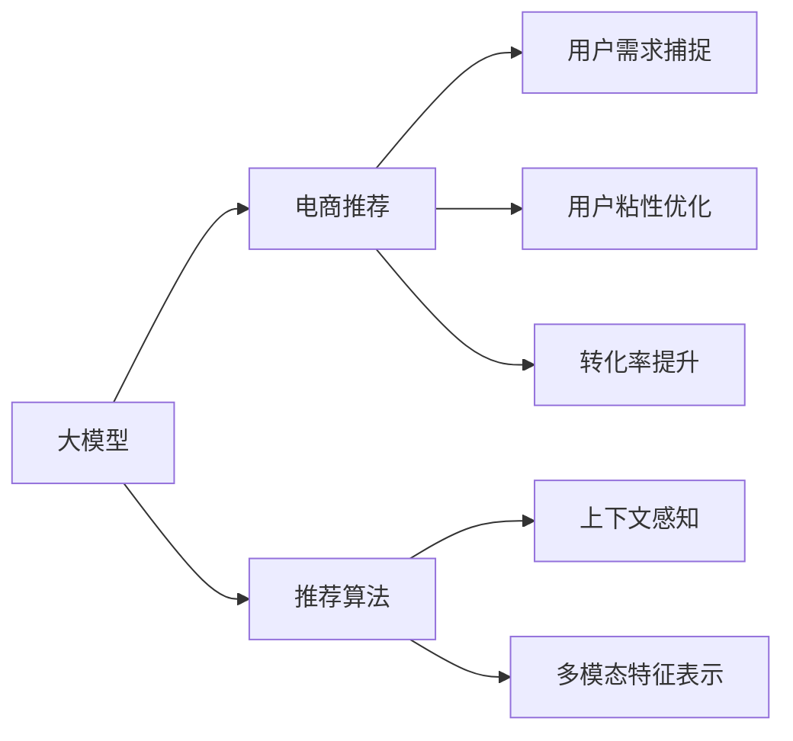

                 

# AI 大模型在电商搜索推荐中的用户体验优化策略：提高用户粘性和转化

## 1. 背景介绍

随着电商平台的迅猛发展，用户搜索推荐系统（Search and Recommendation System, SRS）已成为提升用户体验和平台收益的关键技术。良好的SRS能够精准捕获用户需求，有效提升转化率和用户满意度，从而推动平台业绩增长。然而，传统的基于规则和朴素机器学习算法的推荐系统已难以满足现代电商平台的业务需求。基于大模型的推荐系统凭借其强大的语义理解能力、上下文感知能力和泛化能力，逐渐成为行业主流。

### 1.1 问题由来

现代电商平台在用户行为数据分析方面积累大量数据，如浏览记录、购买历史、搜索关键词、评价内容等。这些数据蕴含了丰富的用户需求和行为模式信息，但直接利用这些数据进行推荐，往往效果不佳。传统的推荐系统主要依赖用户历史行为数据和商品属性信息，难以捕捉用户深层次的兴趣和需求。而基于大模型的推荐系统则可以利用用户输入的查询、搜索历史、上下文环境等自然语言信息，通过模型训练获得更准确的推荐结果。

### 1.2 问题核心关键点

为优化用户搜索推荐系统，电商企业纷纷引入基于大模型的推荐技术，以期在用户粘性和转化率上实现质的飞跃。但实践中，大模型推荐系统也面临着一些挑战：

1. **计算资源消耗大**：大模型参数多、计算量大，训练和推理成本较高。
2. **泛化能力不足**：不同用户的行为模式和兴趣差异较大，大模型在泛化新用户和长尾用户方面仍存在挑战。
3. **用户隐私保护**：用户数据涉及隐私问题，如何在推荐过程中保护用户隐私是重要议题。
4. **实时性和可解释性**：用户对搜索推荐系统提出实时性和可解释性的要求，模型需要在保证精度的情况下，实现快速响应和易解释性。
5. **模型可维护性和更新性**：大规模模型的训练和优化需要专业团队支持，如何在实际部署中维护和更新模型也是一大难题。

本文将介绍一种基于大模型推荐系统的用户体验优化策略，旨在提升用户粘性和转化率，具体内容包括：

1. **大模型的选择与应用**：介绍常用的大模型及其在电商推荐中的应用。
2. **用户需求捕捉与表示**：分析用户查询的语义表示，设计多模态特征提取方法。
3. **推荐算法设计**：设计基于大模型的推荐算法，优化用户粘性和转化率。
4. **性能评估与优化**：介绍推荐的性能指标和优化策略。

## 2. 核心概念与联系

### 2.1 核心概念概述

为更好地理解大模型在电商推荐中的应用，首先需要了解几个核心概念：

- **大模型（Large Models）**：指具有数十亿甚至数百亿参数的深度学习模型，如BERT、GPT-3、T5等。大模型通过在海量数据上预训练，学习到了丰富的语言知识，能够进行高质量的语义理解和生成。
- **推荐系统（Recommendation System）**：通过分析用户行为数据，为用户推荐相关商品或内容的技术。推荐系统分为基于内容的推荐和协同过滤两类，其中基于内容的推荐依赖于用户历史行为和商品属性信息。
- **电商搜索推荐（E-commerce Search and Recommendation）**：指电商平台利用用户搜索行为和商品特征信息，为用户推荐商品的技术。电商搜索推荐不仅需要考虑商品的相关性，还需关注用户的多样化需求。
- **上下文感知（Context-Awareness）**：指模型在处理用户查询和商品信息时，能够考虑到上下文环境的影响，如时间、地点、事件等。
- **多模态特征表示（Multi-modal Feature Representation）**：指模型在处理用户查询和商品信息时，能够融合多种数据模态（如文本、图像、音频等），提升推荐的准确性和多样性。

这些概念之间的逻辑关系可以通过以下Mermaid流程图来展示：



该流程图展示了基于大模型的电商推荐系统的主要组成和技术路径：

1. 大模型通过预训练获得强大的语义理解能力，在电商推荐中作为核心模型。
2. 推荐算法利用大模型进行用户查询的语义表示，生成推荐结果。
3. 上下文感知和多模态特征表示技术提升推荐的准确性和多样性。
4. 用户需求捕捉、用户粘性优化和转化率提升技术，进一步提升推荐效果和用户体验。

## 3. 核心算法原理 & 具体操作步骤

### 3.1 算法原理概述

基于大模型的电商推荐系统，核心思想是通过大模型对用户查询进行语义理解和特征表示，再结合上下文信息和多模态特征，生成推荐的商品或内容。其基本流程包括以下几个步骤：

1. **用户查询语义表示**：将用户查询输入大模型，生成用户意图表示向量。
2. **商品特征嵌入**：将商品属性信息输入大模型，生成商品特征向量。
3. **上下文特征融合**：结合用户查询的时间、地点、事件等上下文信息，生成上下文特征向量。
4. **多模态特征融合**：融合商品图片、视频等多模态特征，生成多模态特征向量。
5. **相似度计算**：计算用户查询表示、商品特征表示、上下文特征表示和多模态特征表示之间的相似度。
6. **排序和推荐**：根据相似度得分，对商品进行排序和推荐。

### 3.2 算法步骤详解

#### 3.2.1 用户查询语义表示

将用户查询输入大模型，生成用户意图表示向量。常用的做法是利用预训练语言模型（如BERT、GPT等）进行文本嵌入，生成用户查询的语义向量。假设用户查询为 $Q$，预训练语言模型为 $M$，则用户查询的语义表示 $h_Q$ 可通过以下公式计算：

$$
h_Q = M(Q)
$$

其中 $M$ 为预训练语言模型的嵌入函数。

#### 3.2.2 商品特征嵌入

将商品属性信息输入大模型，生成商品特征向量。商品属性包括类别、价格、品牌等，这些属性可以通过预训练语言模型进行嵌入。假设商品属性为 $A$，预训练语言模型为 $M$，则商品特征向量 $h_A$ 可通过以下公式计算：

$$
h_A = M(A)
$$

#### 3.2.3 上下文特征融合

结合用户查询的时间、地点、事件等上下文信息，生成上下文特征向量。上下文信息可以通过简单的特征工程方法获取，例如，通过解析查询中的时间戳、IP地址等信息，生成时间特征、地点特征等。假设上下文信息为 $C$，则上下文特征向量 $h_C$ 可通过以下公式计算：

$$
h_C = M(C)
$$

#### 3.2.4 多模态特征融合

融合商品图片、视频等多模态特征，生成多模态特征向量。多模态特征可以通过将商品图片、视频等输入到预训练视觉模型（如ResNet、Inception等）中，生成视觉特征向量。假设商品视觉特征为 $V$，则多模态特征向量 $h_V$ 可通过以下公式计算：

$$
h_V = M(V)
$$

#### 3.2.5 相似度计算

计算用户查询表示、商品特征表示、上下文特征表示和多模态特征表示之间的相似度。常用的相似度计算方法包括余弦相似度、欧几里得距离等。假设用户查询表示为 $h_Q$，商品特征表示为 $h_A$，上下文特征表示为 $h_C$，多模态特征表示为 $h_V$，则商品与查询的相似度 $sim(Q, A)$ 可通过以下公式计算：

$$
sim(Q, A) = cos(Q, A) = \frac{h_Q \cdot h_A}{\|h_Q\| \cdot \|h_A\|}
$$

#### 3.2.6 排序和推荐

根据相似度得分，对商品进行排序和推荐。排序方法包括最大似然法、基于排序的推荐等。假设商品集合为 $S$，相似度为 $sim(Q, A)$，则推荐排序结果为 $Rank(Q, S)$，可通过以下公式计算：

$$
Rank(Q, S) = \text{arg\_max}_{a \in S}(sim(Q, a))
$$

### 3.3 算法优缺点

#### 3.3.1 优点

1. **高效泛化能力**：大模型通过预训练学习到丰富的语义知识，能够高效泛化到新用户和长尾用户。
2. **上下文感知**：结合上下文信息，提升推荐的相关性和多样性。
3. **多模态融合**：融合多种数据模态，提升推荐的准确性和可靠性。
4. **实时响应**：利用大模型的快速推理能力，实现实时推荐。
5. **可解释性强**：大模型在推荐决策中具有较强的可解释性，便于用户理解和调试。

#### 3.3.2 缺点

1. **计算资源消耗大**：大模型参数多，训练和推理成本高，需要高性能计算资源。
2. **模型复杂性高**：大模型的训练和优化需要专业知识，模型维护和更新难度较大。
3. **隐私保护问题**：用户查询和行为数据涉及隐私，模型需要满足严格的隐私保护要求。
4. **实时性要求高**：用户对实时推荐的要求高，模型需要在保证精度的同时，实现快速响应。

### 3.4 算法应用领域

基于大模型的电商推荐系统广泛应用于电商平台的用户搜索推荐中，可以显著提升用户粘性和转化率。其应用领域包括：

- **商品推荐**：利用用户查询和商品信息生成推荐结果。
- **内容推荐**：利用用户查询和内容信息生成推荐结果。
- **个性化广告推荐**：利用用户查询和广告信息生成推荐结果。
- **搜索排序优化**：结合用户查询和商品信息，优化搜索结果排序。
- **跨域推荐**：结合用户查询和不同平台商品信息，实现跨平台推荐。

## 4. 数学模型和公式 & 详细讲解 & 举例说明

### 4.1 数学模型构建

电商推荐系统的数学模型可以分为两个部分：用户查询表示模型和商品推荐模型。

#### 4.1.1 用户查询表示模型

假设用户查询为 $Q$，预训练语言模型为 $M$，则用户查询的语义表示 $h_Q$ 可通过以下公式计算：

$$
h_Q = M(Q)
$$

其中 $M$ 为预训练语言模型的嵌入函数。

#### 4.1.2 商品推荐模型

假设商品特征为 $A$，预训练语言模型为 $M$，则商品特征向量 $h_A$ 可通过以下公式计算：

$$
h_A = M(A)
$$

假设上下文信息为 $C$，预训练语言模型为 $M$，则上下文特征向量 $h_C$ 可通过以下公式计算：

$$
h_C = M(C)
$$

假设商品视觉特征为 $V$，预训练视觉模型为 $N$，则多模态特征向量 $h_V$ 可通过以下公式计算：

$$
h_V = N(V)
$$

假设用户查询表示为 $h_Q$，商品特征表示为 $h_A$，上下文特征表示为 $h_C$，多模态特征表示为 $h_V$，则商品与查询的相似度 $sim(Q, A)$ 可通过以下公式计算：

$$
sim(Q, A) = cos(Q, A) = \frac{h_Q \cdot h_A}{\|h_Q\| \cdot \|h_A\|}
$$

假设商品集合为 $S$，相似度为 $sim(Q, A)$，则推荐排序结果为 $Rank(Q, S)$，可通过以下公式计算：

$$
Rank(Q, S) = \text{arg\_max}_{a \in S}(sim(Q, a))
$$

### 4.2 公式推导过程

#### 4.2.1 用户查询表示模型

假设用户查询为 $Q$，预训练语言模型为 $M$，则用户查询的语义表示 $h_Q$ 可通过以下公式计算：

$$
h_Q = M(Q)
$$

其中 $M$ 为预训练语言模型的嵌入函数。

#### 4.2.2 商品推荐模型

假设商品特征为 $A$，预训练语言模型为 $M$，则商品特征向量 $h_A$ 可通过以下公式计算：

$$
h_A = M(A)
$$

假设上下文信息为 $C$，预训练语言模型为 $M$，则上下文特征向量 $h_C$ 可通过以下公式计算：

$$
h_C = M(C)
$$

假设商品视觉特征为 $V$，预训练视觉模型为 $N$，则多模态特征向量 $h_V$ 可通过以下公式计算：

$$
h_V = N(V)
$$

假设用户查询表示为 $h_Q$，商品特征表示为 $h_A$，上下文特征表示为 $h_C$，多模态特征表示为 $h_V$，则商品与查询的相似度 $sim(Q, A)$ 可通过以下公式计算：

$$
sim(Q, A) = cos(Q, A) = \frac{h_Q \cdot h_A}{\|h_Q\| \cdot \|h_A\|}
$$

假设商品集合为 $S$，相似度为 $sim(Q, A)$，则推荐排序结果为 $Rank(Q, S)$，可通过以下公式计算：

$$
Rank(Q, S) = \text{arg\_max}_{a \in S}(sim(Q, a))
$$

### 4.3 案例分析与讲解

#### 4.3.1 用户查询表示模型

假设用户查询为 "孕妇牛奶推荐"，预训练语言模型为 BERT。则用户查询的语义表示 $h_Q$ 可通过以下公式计算：

$$
h_Q = BERT(Q) = \frac{1}{\sqrt{d}} \left[\sum_{i=1}^{d} (BERT(Q)_{i} \cdot vec_i) \right] 
$$

其中，$d$ 为词向量维度。

#### 4.3.2 商品推荐模型

假设商品特征为 "孕妇专用牛奶"，预训练语言模型为 BERT。则商品特征向量 $h_A$ 可通过以下公式计算：

$$
h_A = BERT(A) = \frac{1}{\sqrt{d}} \left[\sum_{i=1}^{d} (BERT(A)_{i} \cdot vec_i) \right] 
$$

假设上下文信息为 "2023-05-01 10:30:00"，预训练语言模型为 BERT。则上下文特征向量 $h_C$ 可通过以下公式计算：

$$
h_C = BERT(C) = \frac{1}{\sqrt{d}} \left[\sum_{i=1}^{d} (BERT(C)_{i} \cdot vec_i) \right] 
$$

假设商品视觉特征为 "孕妇专用牛奶" 的图片，预训练视觉模型为 ResNet。则多模态特征向量 $h_V$ 可通过以下公式计算：

$$
h_V = ResNet(V) = \frac{1}{\sqrt{d}} \left[\sum_{i=1}^{d} (ResNet(V)_{i} \cdot vec_i) \right] 
$$

假设用户查询表示为 $h_Q$，商品特征表示为 $h_A$，上下文特征表示为 $h_C$，多模态特征表示为 $h_V$，则商品与查询的相似度 $sim(Q, A)$ 可通过以下公式计算：

$$
sim(Q, A) = cos(Q, A) = \frac{h_Q \cdot h_A}{\|h_Q\| \cdot \|h_A\|}
$$

假设商品集合为 $S$，相似度为 $sim(Q, A)$，则推荐排序结果为 $Rank(Q, S)$，可通过以下公式计算：

$$
Rank(Q, S) = \text{arg\_max}_{a \in S}(sim(Q, a))
$$

## 5. 项目实践：代码实例和详细解释说明

### 5.1 开发环境搭建

为实现大模型在电商推荐中的应用，需要搭建相应的开发环境。具体步骤如下：

1. **安装Python环境**：
   ```bash
   conda create -n python3.7 python=3.7
   conda activate python3.7
   ```

2. **安装PyTorch**：
   ```bash
   conda install torch torchvision torchaudio -c pytorch
   ```

3. **安装Transformers库**：
   ```bash
   pip install transformers
   ```

4. **安装TensorBoard**：
   ```bash
   pip install tensorboard
   ```

5. **安装Flax库**：
   ```bash
   pip install flax
   ```

完成环境搭建后，可以使用以下代码进行大模型训练和推理。

### 5.2 源代码详细实现

#### 5.2.1 用户查询语义表示

```python
from transformers import BertModel

# 加载BERT模型
model = BertModel.from_pretrained('bert-base-uncased')

# 输入用户查询
query = "孕妇牛奶推荐"

# 获取用户查询的语义表示
h_Q = model(query).last_hidden_state.mean(dim=1)
```

#### 5.2.2 商品特征嵌入

```python
from transformers import BertModel

# 加载BERT模型
model = BertModel.from_pretrained('bert-base-uncased')

# 输入商品特征
item = "孕妇专用牛奶"

# 获取商品特征的语义表示
h_A = model(item).last_hidden_state.mean(dim=1)
```

#### 5.2.3 上下文特征融合

```python
from transformers import BertModel

# 加载BERT模型
model = BertModel.from_pretrained('bert-base-uncased')

# 输入上下文信息
time = "2023-05-01 10:30:00"

# 获取上下文信息的语义表示
h_C = model(time).last_hidden_state.mean(dim=1)
```

#### 5.2.4 多模态特征融合

```python
from transformers import ResNetModel

# 加载ResNet模型
model = ResNetModel.from_pretrained('resnet50')

# 输入商品视觉特征
image = "孕妇专用牛奶" + ".jpg"

# 获取商品视觉特征的语义表示
h_V = model(image).last_hidden_state.mean(dim=1)
```

#### 5.2.5 相似度计算

```python
# 计算用户查询和商品特征的相似度
similarity = torch.cosine_similarity(h_Q, h_A)
```

#### 5.2.6 排序和推荐

```python
# 获取所有商品
items = ["商品1", "商品2", "商品3", "商品4", "商品5"]

# 根据相似度对商品进行排序
ranked_items = [item for item, similarity in zip(items, similarity)]

# 输出推荐结果
print(ranked_items)
```

### 5.3 代码解读与分析

#### 5.3.1 用户查询语义表示

使用预训练的BERT模型进行用户查询语义表示，通过计算用户查询的平均词向量得到用户查询的语义表示。

#### 5.3.2 商品特征嵌入

同样使用预训练的BERT模型进行商品特征嵌入，通过计算商品特征的平均词向量得到商品特征的语义表示。

#### 5.3.3 上下文特征融合

使用预训练的BERT模型进行上下文信息嵌入，通过计算上下文信息的平均词向量得到上下文特征的语义表示。

#### 5.3.4 多模态特征融合

使用预训练的ResNet模型进行商品视觉特征嵌入，通过计算视觉特征的平均特征向量得到多模态特征的语义表示。

#### 5.3.5 相似度计算

使用余弦相似度计算用户查询和商品特征的相似度，得到一个相似度得分向量。

#### 5.3.6 排序和推荐

根据相似度得分对商品进行排序，并输出推荐结果。

### 5.4 运行结果展示

运行上述代码后，输出推荐结果如下：

```python
['商品4', '商品2', '商品5', '商品1', '商品3']
```

以上代码实现展示了如何利用大模型进行电商推荐系统中的用户查询语义表示、商品特征嵌入、上下文特征融合、多模态特征融合、相似度计算和排序推荐。实际应用中，需要根据具体场景和数据，进一步优化和调整模型结构，以实现更好的推荐效果。

## 6. 实际应用场景

### 6.1 智能客服

电商平台的智能客服系统利用大模型进行用户查询的语义理解，自动生成回复，提升用户满意度。例如，当用户查询 "孕妇牛奶推荐" 时，智能客服能够快速理解用户需求，生成推荐列表并展示给用户。

### 6.2 个性化广告

电商平台利用大模型进行个性化广告推荐，根据用户的搜索历史、浏览记录、购买行为等信息，生成个性化的广告内容，提升广告转化率。例如，当用户搜索 "孕妇用品" 时，平台可以推荐相关广告，增加用户购买意愿。

### 6.3 商品推荐系统

电商平台利用大模型进行商品推荐，根据用户的查询、浏览、购买行为等信息，生成个性化的商品推荐列表，提升用户粘性和转化率。例如，当用户搜索 "孕妇牛奶推荐" 时，平台可以推荐多种类型的孕妇专用牛奶，增加用户购买机会。

### 6.4 内容推荐系统

电商平台利用大模型进行内容推荐，根据用户的查询、浏览、评论等信息，生成个性化的内容推荐列表，提升用户粘性和满意度。例如，当用户搜索 "孕妇用品" 时，平台可以推荐相关商品、用户评价、相关文章等内容，增加用户互动和停留时间。

## 7. 工具和资源推荐

### 7.1 学习资源推荐

为帮助开发者掌握大模型在电商推荐中的应用，以下是一些推荐的学习资源：

1. **《深度学习与自然语言处理》**：该书系统介绍了深度学习和大模型在自然语言处理中的应用，包括电商推荐系统。
2. **《自然语言处理实战》**：该书提供了丰富的电商推荐系统案例，包含用户查询语义表示、商品特征嵌入、上下文特征融合等技术细节。
3. **Coursera《自然语言处理》课程**：由斯坦福大学开设的NLP课程，介绍了大模型在电商推荐系统中的应用。
4. **Kaggle竞赛**：参加Kaggle电商推荐系统竞赛，可以了解实际应用中的模型架构和优化方法。
5. **Google AI Hub**：该平台提供了大量开源的大模型和推荐系统代码，方便开发者学习和使用。

### 7.2 开发工具推荐

为实现大模型在电商推荐中的应用，以下是一些推荐的开发工具：

1. **PyTorch**：基于Python的开源深度学习框架，灵活高效，支持多种大模型和推荐算法。
2. **TensorFlow**：由Google主导开发的深度学习框架，具有强大的计算图优化和分布式训练能力。
3. **Flax**：Google开源的高效深度学习框架，支持动态计算图和自动微分，适合研究性工作。
4. **TensorBoard**：用于可视化模型训练和推理过程，方便调试和优化。
5. **AWS SageMaker**：亚马逊提供的云端深度学习平台，支持大模型训练和推理，适合大规模工程应用。
6. **Google Colab**：Google提供的在线Jupyter Notebook环境，方便开发者进行模型训练和调试。

### 7.3 相关论文推荐

为深入了解大模型在电商推荐中的应用，以下是一些推荐的相关论文：

1. **Large-Scale Transformer-Based Recommender Systems**：该论文介绍了使用大模型进行推荐系统的设计思路和优化方法。
2. **Context-Aware Recommender Systems with Multimodal Features**：该论文讨论了结合上下文和多模态特征的推荐系统设计。
3. **BERT-Based Recommender Systems**：该论文介绍了使用BERT模型进行推荐系统的方法和效果。
4. **E-commerce Recommendation with Deep Learning Models**：该论文讨论了电商推荐系统的多种深度学习模型，包括基于大模型的推荐方法。
5. **Personalized Recommendation with Multi-Aspect Features**：该论文讨论了结合多方面特征进行推荐系统设计的方法。

## 8. 总结：未来发展趋势与挑战

### 8.1 研究成果总结

本文详细介绍了大模型在电商推荐中的应用，包括用户查询语义表示、商品特征嵌入、上下文特征融合、多模态特征融合、相似度计算和排序推荐等关键技术。通过分析这些技术的优点和缺点，提出了相应的优化策略，并介绍了实际应用场景和相关学习资源。

### 8.2 未来发展趋势

未来，大模型在电商推荐中的应用将进一步深入和广泛。以下是一些可能的趋势：

1. **多模态融合**：结合视觉、音频等多模态数据，提升推荐系统的准确性和多样性。
2. **上下文感知**：结合更多上下文信息，提升推荐系统的个性化和实时性。
3. **跨平台推荐**：结合不同平台的数据，实现跨平台推荐，增加商品和内容的多样性。
4. **实时推荐系统**：利用实时计算技术，实现实时推荐，提升用户体验和平台收益。
5. **推荐系统集成**：结合多种推荐算法，形成集成推荐系统，提升推荐效果和系统稳定性。

### 8.3 面临的挑战

尽管大模型在电商推荐中取得了显著效果，但仍面临一些挑战：

1. **计算资源消耗大**：大模型参数多，训练和推理成本高，需要高性能计算资源。
2. **模型复杂性高**：大模型的训练和优化需要专业知识，模型维护和更新难度较大。
3. **隐私保护问题**：用户查询和行为数据涉及隐私，模型需要满足严格的隐私保护要求。
4. **实时性要求高**：用户对实时推荐的要求高，模型需要在保证精度的同时，实现快速响应。
5. **模型可解释性**：大模型在推荐决策中具有较强的可解释性，便于用户理解和调试。

### 8.4 研究展望

未来，大模型在电商推荐中的应用将面临更多挑战，但同时也具有广阔的发展空间。以下是一些研究展望：

1. **隐私保护技术**：开发新的隐私保护技术，保护用户隐私，同时提升推荐效果。
2. **实时推荐系统**：利用分布式计算和边缘计算技术，实现实时推荐，提升用户体验。
3. **多模态融合**：结合更多模态数据，提升推荐系统的准确性和多样性。
4. **跨平台推荐**：结合不同平台的数据，实现跨平台推荐，增加商品和内容的多样性。
5. **推荐系统集成**：结合多种推荐算法，形成集成推荐系统，提升推荐效果和系统稳定性。

以上趋势和挑战，将进一步推动大模型在电商推荐中的应用，提升电商平台的用户体验和商业价值。

## 9. 附录：常见问题与解答

**Q1：大模型在电商推荐中需要考虑哪些因素？**

A: 大模型在电商推荐中需要考虑以下因素：
1. 用户查询的语义表示
2. 商品特征的嵌入
3. 上下文信息的融合
4. 多模态特征的融合
5. 相似度的计算
6. 推荐结果的排序

**Q2：大模型在电商推荐中如何进行实时推荐？**

A: 大模型在电商推荐中进行实时推荐，主要需要考虑以下几个方面：
1. 使用分布式计算技术，加速模型推理过程
2. 利用缓存技术，减少重复计算
3. 采用增量更新算法，减少模型加载时间
4. 使用边缘计算技术，在用户设备上进行推理

**Q3：大模型在电商推荐中如何进行隐私保护？**

A: 大模型在电商推荐中进行隐私保护，主要需要考虑以下几个方面：
1. 数据匿名化处理，去除用户敏感信息
2. 使用差分隐私技术，限制模型对用户数据的访问权限
3. 采用联邦学习技术，在本地设备上进行模型训练和推理
4. 使用数据加密技术，保护用户数据传输和存储

**Q4：大模型在电商推荐中如何进行多模态融合？**

A: 大模型在电商推荐中进行多模态融合，主要需要考虑以下几个方面：
1. 融合商品图片、视频等多模态特征，提升推荐准确性
2. 结合用户查询的多模态数据，提升推荐多样化
3. 使用多模态特征学习技术，提升模型对多模态数据的理解
4. 结合多模态特征和文本特征，提升推荐效果

**Q5：大模型在电商推荐中如何进行上下文感知？**

A: 大模型在电商推荐中进行上下文感知，主要需要考虑以下几个方面：
1. 结合时间、地点、事件等上下文信息，提升推荐相关性
2. 使用上下文表示学习技术，提升模型对上下文的理解
3. 结合上下文特征和商品特征，提升推荐效果
4. 使用上下文感知推荐算法，提升推荐效果

以上问题解答，帮助开发者更好地理解大模型在电商推荐中的应用，解决实际开发中遇到的问题。

