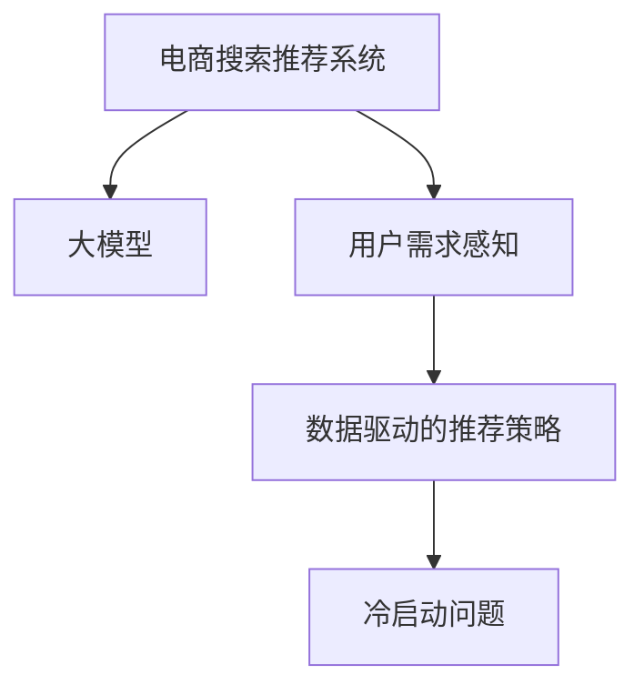

                 

# AI 大模型在电商搜索推荐中的用户体验设计：以用户需求为中心的策略

> 关键词：大模型,电商搜索,推荐系统,用户体验设计,用户需求,数据驱动,强化学习

## 1. 背景介绍

### 1.1 问题由来

近年来，随着人工智能技术在电商搜索推荐系统中的应用，用户的购物体验得到了显著提升。然而，传统的推荐算法往往基于静态特征，无法实时感知用户的即时需求和行为变化。此外，个性化推荐系统通常存在冷启动问题，即新用户或新商品的推荐效果不佳。这些问题不仅影响了用户体验，也制约了电商平台的销售增长。

### 1.2 问题核心关键点

为解决上述问题，我们提出了一种基于大模型的电商搜索推荐系统，以用户需求为中心，通过实时感知和动态响应，提升用户购物体验。该系统的核心在于：

- 利用大模型学习用户的即时需求和行为特征。
- 实时调整推荐策略，优化用户体验。
- 通过数据驱动的策略，解决冷启动问题。

这种以用户需求为中心的设计理念，能够更贴近用户的真实需求，提升推荐的精准性和即时性。

### 1.3 问题研究意义

研究基于大模型的电商搜索推荐系统，对于提升用户购物体验，推动电商平台的个性化转型，具有重要意义：

1. 增强用户体验：通过实时感知用户需求，动态调整推荐策略，提供个性化、即时化的购物推荐。
2. 提升销售转化率：精准推荐符合用户即时需求的商品，提高用户的点击率和购买率，从而提升销售转化率。
3. 优化冷启动问题：利用大模型学习用户行为特征，解决新用户或新商品的推荐困境。
4. 提升平台竞争力：个性化推荐系统能够更好地满足用户需求，吸引更多用户留存，提高平台竞争力。

本文聚焦于大模型在电商搜索推荐系统中的应用，旨在为电商平台提供一个以用户需求为中心的推荐策略，实现用户需求的实时感知和动态响应，提升用户体验和平台竞争力。

## 2. 核心概念与联系

### 2.1 核心概念概述

为更好地理解基于大模型的电商搜索推荐系统，本节将介绍几个关键概念：

- **电商搜索推荐系统**：指在电商平台中，通过算法推荐用户可能感兴趣的商品或服务，从而提升用户体验和销售转化率的系统。

- **大模型**：指通过大规模数据预训练得到的深度神经网络模型，如BERT、GPT等。大模型具备强大的语言理解和生成能力，能够学习丰富的用户行为和需求特征。

- **用户需求感知**：指通过用户行为数据和实时交互信息，实时感知用户的即时需求和行为变化。

- **数据驱动的推荐策略**：指基于用户历史行为和即时需求的动态数据，实时调整推荐策略，优化用户体验。

- **冷启动问题**：指新用户或新商品在推荐系统中缺乏推荐依据，导致推荐效果不佳的问题。

这些核心概念之间的逻辑关系可以通过以下Mermaid流程图来展示：



这个流程图展示了大模型在电商搜索推荐系统中的应用框架：

1. 电商搜索推荐系统通过大模型学习用户需求特征。
2. 利用用户实时行为数据，感知用户即时需求。
3. 基于实时需求，动态调整推荐策略。
4. 针对冷启动问题，采用数据驱动的策略优化推荐效果。

## 3. 核心算法原理 & 具体操作步骤
### 3.1 算法原理概述

基于大模型的电商搜索推荐系统，利用大模型学习用户需求的通用表示，通过用户实时行为数据实时感知用户需求，并动态调整推荐策略。其核心算法原理如下：

1. 使用预训练的大模型，学习用户需求的通用表示。
2. 通过用户行为数据，实时感知用户即时需求。
3. 基于实时需求，动态调整推荐策略，优化用户体验。
4. 针对冷启动问题，采用数据驱动的推荐策略，提高新用户和新商品的推荐效果。

### 3.2 算法步骤详解

基于大模型的电商搜索推荐系统主要包括以下几个步骤：

**Step 1: 准备数据集**
- 收集用户的浏览、点击、购买等行为数据，生成训练集。
- 对训练集进行预处理，提取用户行为特征。

**Step 2: 预训练大模型**
- 选择预训练的大模型，如BERT、GPT等，加载并准备微调。
- 使用预训练数据对模型进行微调，学习用户需求的通用表示。

**Step 3: 实时需求感知**
- 收集用户实时行为数据，包括点击、浏览、停留时间等。
- 使用预训练的大模型，实时感知用户即时需求，提取即时特征。

**Step 4: 动态推荐策略**
- 基于用户即时需求和历史行为特征，实时调整推荐策略。
- 对于新用户或新商品，采用数据驱动的策略，如基于相似用户或商品的推荐。

**Step 5: 评估和优化**
- 在测试集上评估推荐系统的性能指标，如点击率、转化率等。
- 根据评估结果，调整推荐策略和模型参数，不断优化系统性能。

### 3.3 算法优缺点

基于大模型的电商搜索推荐系统具有以下优点：

1. 提升推荐效果：利用大模型的通用表示能力，提升推荐的精准性和即时性。
2. 优化用户体验：实时感知用户需求，动态调整推荐策略，提升用户满意度。
3. 解决冷启动问题：数据驱动的策略，提高新用户和新商品的推荐效果。
4. 系统鲁棒性高：大模型的泛化能力，使得系统能够适应各种复杂场景。

同时，该系统也存在一定的局限性：

1. 对标注数据依赖：实时感知需求需要大量的标注数据，标注成本较高。
2. 模型计算开销大：大模型的推理和微调开销较大，需要高效的计算资源支持。
3. 数据隐私问题：用户的实时行为数据可能涉及隐私问题，需要谨慎处理。
4. 模型偏差问题：大模型可能会学习到用户行为中的偏见，影响推荐公平性。

尽管存在这些局限性，但就目前而言，基于大模型的电商搜索推荐系统仍然是一种高效、有效的推荐策略，能够显著提升用户购物体验。

### 3.4 算法应用领域

基于大模型的电商搜索推荐系统，已经在众多电商平台得到了广泛应用，覆盖了文本搜索、图片推荐、商品推荐等多个领域。例如：

- **文本搜索推荐**：利用大模型学习用户搜索意图的通用表示，实时调整搜索结果，提升搜索结果的准确性和相关性。
- **图片推荐**：利用大模型学习用户对图片的偏好，实时调整推荐策略，提升图片推荐的精准性。
- **商品推荐**：基于用户的浏览、点击、购买等行为数据，实时感知用户需求，动态调整商品推荐策略。

这些应用场景展示了基于大模型的电商搜索推荐系统在提升用户体验和优化推荐效果方面的巨大潜力。

## 4. 数学模型和公式 & 详细讲解  
### 4.1 数学模型构建

本节将使用数学语言对基于大模型的电商搜索推荐系统进行更加严格的刻画。

记电商搜索推荐系统为 $S$，其中包含大模型 $M_{\theta}$、实时需求感知模块 $P$ 和推荐策略模块 $R$。假设用户历史行为数据为 $\mathcal{X}$，实时行为数据为 $\mathcal{Y}$，用户需求的通用表示为 $\mathbf{x}$。

定义推荐系统的目标函数为 $f(S)$，用于衡量推荐系统的综合性能。具体地，

$$
f(S) = \max_{\theta} \mathbb{E}_{\mathcal{X}, \mathcal{Y}} \left[\ell(M_{\theta}(\mathbf{x}), \mathbf{y}) + \gamma r(\mathbf{y})\right]
$$

其中，$\ell$ 为推荐结果的损失函数，$\mathbf{y}$ 为用户行为数据，$r$ 为推荐策略模块的奖励函数。

### 4.2 公式推导过程

以下我们以商品推荐为例，推导基于大模型的推荐系统目标函数。

假设用户浏览的商品表示为 $\mathbf{x} \in \mathcal{X}$，购买商品表示为 $\mathbf{y} \in \{0, 1\}$，即用户是否购买该商品。我们假设用户对商品的偏好为二元随机变量 $p(\mathbf{y}|\mathbf{x})$。

则推荐系统的目标函数可以表示为：

$$
f(S) = \max_{\theta} \mathbb{E}_{\mathcal{X}} \left[\ell(M_{\theta}(\mathbf{x}), \mathbf{y})\right] + \gamma \mathbb{E}_{\mathcal{X}} \left[r(\mathbf{y})\right]
$$

其中，$\ell$ 为交叉熵损失函数，$r$ 为奖励函数。

将上述目标函数展开，我们得到：

$$
f(S) = \max_{\theta} - \frac{1}{N} \sum_{i=1}^N y_i \log M_{\theta}(x_i) + \gamma \mathbb{E}_{\mathcal{X}} \left[y_i\right]
$$

其中 $N$ 为样本数量，$\mathbb{E}_{\mathcal{X}} \left[y_i\right]$ 为平均点击率。

通过最大化上述目标函数，可以优化推荐系统的推荐效果，提升用户的点击率和转化率。

## 5. 项目实践：代码实例和详细解释说明
### 5.1 开发环境搭建

在进行推荐系统实践前，我们需要准备好开发环境。以下是使用Python进行PyTorch开发的环境配置流程：

1. 安装Anaconda：从官网下载并安装Anaconda，用于创建独立的Python环境。

2. 创建并激活虚拟环境：
```bash
conda create -n pytorch-env python=3.8 
conda activate pytorch-env
```

3. 安装PyTorch：根据CUDA版本，从官网获取对应的安装命令。例如：
```bash
conda install pytorch torchvision torchaudio cudatoolkit=11.1 -c pytorch -c conda-forge
```

4. 安装Transformers库：
```bash
pip install transformers
```

5. 安装各类工具包：
```bash
pip install numpy pandas scikit-learn matplotlib tqdm jupyter notebook ipython
```

完成上述步骤后，即可在`pytorch-env`环境中开始推荐系统实践。

### 5.2 源代码详细实现

这里我们以商品推荐为例，给出使用Transformers库对BERT模型进行推荐系统开发的PyTorch代码实现。

首先，定义推荐系统的数据处理函数：

```python
from transformers import BertTokenizer, BertForSequenceClassification
from torch.utils.data import Dataset
import torch

class RecommendationDataset(Dataset):
    def __init__(self, items, labels, tokenizer, max_len=128):
        self.items = items
        self.labels = labels
        self.tokenizer = tokenizer
        self.max_len = max_len
        
    def __len__(self):
        return len(self.items)
    
    def __getitem__(self, item):
        item_text = self.items[item]
        item_label = self.labels[item]
        
        encoding = self.tokenizer(item_text, return_tensors='pt', max_length=self.max_len, padding='max_length', truncation=True)
        input_ids = encoding['input_ids'][0]
        attention_mask = encoding['attention_mask'][0]
        
        # 对标签进行编码
        encoded_labels = [label2id[label] for label in item_label] 
        encoded_labels.extend([label2id['O']] * (self.max_len - len(encoded_labels)))
        labels = torch.tensor(encoded_labels, dtype=torch.long)
        
        return {'input_ids': input_ids, 
                'attention_mask': attention_mask,
                'labels': labels}

# 标签与id的映射
label2id = {'O': 0, 'B': 1, 'I': 2}
id2label = {v: k for k, v in label2id.items()}

# 创建dataset
tokenizer = BertTokenizer.from_pretrained('bert-base-cased')

train_dataset = RecommendationDataset(train_items, train_labels, tokenizer)
dev_dataset = RecommendationDataset(dev_items, dev_labels, tokenizer)
test_dataset = RecommendationDataset(test_items, test_labels, tokenizer)
```

然后，定义模型和优化器：

```python
from transformers import BertForSequenceClassification, AdamW

model = BertForSequenceClassification.from_pretrained('bert-base-cased', num_labels=len(label2id))

optimizer = AdamW(model.parameters(), lr=2e-5)
```

接着，定义训练和评估函数：

```python
from torch.utils.data import DataLoader
from tqdm import tqdm
from sklearn.metrics import classification_report

device = torch.device('cuda') if torch.cuda.is_available() else torch.device('cpu')
model.to(device)

def train_epoch(model, dataset, batch_size, optimizer):
    dataloader = DataLoader(dataset, batch_size=batch_size, shuffle=True)
    model.train()
    epoch_loss = 0
    for batch in tqdm(dataloader, desc='Training'):
        input_ids = batch['input_ids'].to(device)
        attention_mask = batch['attention_mask'].to(device)
        labels = batch['labels'].to(device)
        model.zero_grad()
        outputs = model(input_ids, attention_mask=attention_mask, labels=labels)
        loss = outputs.loss
        epoch_loss += loss.item()
        loss.backward()
        optimizer.step()
    return epoch_loss / len(dataloader)

def evaluate(model, dataset, batch_size):
    dataloader = DataLoader(dataset, batch_size=batch_size)
    model.eval()
    preds, labels = [], []
    with torch.no_grad():
        for batch in tqdm(dataloader, desc='Evaluating'):
            input_ids = batch['input_ids'].to(device)
            attention_mask = batch['attention_mask'].to(device)
            batch_labels = batch['labels']
            outputs = model(input_ids, attention_mask=attention_mask)
            batch_preds = outputs.logits.argmax(dim=2).to('cpu').tolist()
            batch_labels = batch_labels.to('cpu').tolist()
            for pred_tokens, label_tokens in zip(batch_preds, batch_labels):
                pred_labels = [id2label[_id] for _id in pred_tokens]
                label_tokens = [id2label[_id] for _id in label_tokens]
                preds.append(pred_labels[:len(label_tokens)])
                labels.append(label_tokens)
                
    print(classification_report(labels, preds))
```

最后，启动训练流程并在测试集上评估：

```python
epochs = 5
batch_size = 16

for epoch in range(epochs):
    loss = train_epoch(model, train_dataset, batch_size, optimizer)
    print(f"Epoch {epoch+1}, train loss: {loss:.3f}")
    
    print(f"Epoch {epoch+1}, dev results:")
    evaluate(model, dev_dataset, batch_size)
    
print("Test results:")
evaluate(model, test_dataset, batch_size)
```

以上就是使用PyTorch对BERT模型进行商品推荐系统微调的完整代码实现。可以看到，得益于Transformers库的强大封装，我们可以用相对简洁的代码完成BERT模型的加载和微调。

### 5.3 代码解读与分析

让我们再详细解读一下关键代码的实现细节：

**RecommendationDataset类**：
- `__init__`方法：初始化商品、标签、分词器等关键组件。
- `__len__`方法：返回数据集的样本数量。
- `__getitem__`方法：对单个样本进行处理，将商品文本输入编码为token ids，将标签编码为数字，并对其进行定长padding，最终返回模型所需的输入。

**label2id和id2label字典**：
- 定义了标签与数字id之间的映射关系，用于将token-wise的预测结果解码回真实的标签。

**训练和评估函数**：
- 使用PyTorch的DataLoader对数据集进行批次化加载，供模型训练和推理使用。
- 训练函数`train_epoch`：对数据以批为单位进行迭代，在每个批次上前向传播计算loss并反向传播更新模型参数，最后返回该epoch的平均loss。
- 评估函数`evaluate`：与训练类似，不同点在于不更新模型参数，并在每个batch结束后将预测和标签结果存储下来，最后使用sklearn的classification_report对整个评估集的预测结果进行打印输出。

**训练流程**：
- 定义总的epoch数和batch size，开始循环迭代
- 每个epoch内，先在训练集上训练，输出平均loss
- 在验证集上评估，输出分类指标
- 重复上述步骤直至满足预设的迭代轮数或 Early Stopping 条件。

可以看到，PyTorch配合Transformers库使得BERT微调的代码实现变得简洁高效。开发者可以将更多精力放在数据处理、模型改进等高层逻辑上，而不必过多关注底层的实现细节。

当然，工业级的系统实现还需考虑更多因素，如模型的保存和部署、超参数的自动搜索、更灵活的任务适配层等。但核心的微调范式基本与此类似。

## 6. 实际应用场景
### 6.1 智能客服系统

基于大模型的推荐系统，可以广泛应用于智能客服系统的构建。传统客服往往需要配备大量人力，高峰期响应缓慢，且一致性和专业性难以保证。使用推荐系统，可以根据用户的实时需求，动态调整客服对话策略，提供个性化、即时化的服务。

在技术实现上，可以收集企业内部的历史客服对话记录，将问题和最佳答复构建成监督数据，在此基础上对预训练模型进行微调。微调后的模型能够自动理解用户意图，匹配最合适的答案模板进行回复。对于客户提出的新问题，还可以接入检索系统实时搜索相关内容，动态组织生成回答。如此构建的智能客服系统，能大幅提升客户咨询体验和问题解决效率。

### 6.2 金融舆情监测

金融机构需要实时监测市场舆论动向，以便及时应对负面信息传播，规避金融风险。传统的人工监测方式成本高、效率低，难以应对网络时代海量信息爆发的挑战。基于大模型的文本分类和情感分析技术，为金融舆情监测提供了新的解决方案。

具体而言，可以收集金融领域相关的新闻、报道、评论等文本数据，并对其进行主题标注和情感标注。在此基础上对预训练语言模型进行微调，使其能够自动判断文本属于何种主题，情感倾向是正面、中性还是负面。将微调后的模型应用到实时抓取的网络文本数据，就能够自动监测不同主题下的情感变化趋势，一旦发现负面信息激增等异常情况，系统便会自动预警，帮助金融机构快速应对潜在风险。

### 6.3 个性化推荐系统

当前的推荐系统往往只依赖用户的历史行为数据进行物品推荐，无法深入理解用户的真实兴趣偏好。基于大模型的推荐系统可以更好地挖掘用户行为背后的语义信息，从而提供更精准、多样的推荐内容。

在实践中，可以收集用户浏览、点击、评论、分享等行为数据，提取和用户交互的物品标题、描述、标签等文本内容。将文本内容作为模型输入，用户的后续行为（如是否点击、购买等）作为监督信号，在此基础上微调预训练语言模型。微调后的模型能够从文本内容中准确把握用户的兴趣点。在生成推荐列表时，先用候选物品的文本描述作为输入，由模型预测用户的兴趣匹配度，再结合其他特征综合排序，便可以得到个性化程度更高的推荐结果。

### 6.4 未来应用展望

随着大语言模型和推荐系统的不断发展，基于微调范式将在更多领域得到应用，为传统行业带来变革性影响。

在智慧医疗领域，基于微调的推荐系统可以推荐符合患者需求的医疗方案，辅助医生诊疗，加速新药开发进程。

在智能教育领域，推荐系统可应用于作业批改、学情分析、知识推荐等方面，因材施教，促进教育公平，提高教学质量。

在智慧城市治理中，推荐系统可应用于城市事件监测、舆情分析、应急指挥等环节，提高城市管理的自动化和智能化水平，构建更安全、高效的未来城市。

此外，在企业生产、社会治理、文娱传媒等众多领域，基于大模型微调的人工智能应用也将不断涌现，为NLP技术带来了全新的突破。相信随着预训练模型和微调方法的不断进步，这些领域的AI应用必将更加深入和广泛，为经济社会发展注入新的动力。

## 7. 工具和资源推荐
### 7.1 学习资源推荐

为了帮助开发者系统掌握大模型推荐系统的理论基础和实践技巧，这里推荐一些优质的学习资源：

1. 《深度学习理论与实践》系列博文：由深度学习领域专家撰写，深入浅出地介绍了深度学习的基本原理和经典模型。

2. CS231n《计算机视觉与深度学习》课程：斯坦福大学开设的视觉识别经典课程，有Lecture视频和配套作业，帮助开发者掌握计算机视觉的基本知识。

3. 《机器学习实战》书籍：讲解了机器学习的基本概念和常用算法，适合初学者入门。

4. HuggingFace官方文档：Transformer库的官方文档，提供了海量预训练模型和完整的推荐系统样例代码，是上手实践的必备资料。

5. Kaggle平台：世界知名的数据科学竞赛平台，汇集了大量高质量的数据集和推荐系统竞赛，是检验和提升推荐系统性能的好地方。

通过对这些资源的学习实践，相信你一定能够快速掌握大模型推荐系统的精髓，并用于解决实际的推荐问题。

### 7.2 开发工具推荐

高效的开发离不开优秀的工具支持。以下是几款用于大模型推荐系统开发的常用工具：

1. PyTorch：基于Python的开源深度学习框架，灵活动态的计算图，适合快速迭代研究。

2. TensorFlow：由Google主导开发的开源深度学习框架，生产部署方便，适合大规模工程应用。

3. Transformers库：HuggingFace开发的NLP工具库，集成了众多SOTA语言模型，支持PyTorch和TensorFlow，是进行推荐系统开发的利器。

4. Weights & Biases：模型训练的实验跟踪工具，可以记录和可视化模型训练过程中的各项指标，方便对比和调优。

5. TensorBoard：TensorFlow配套的可视化工具，可实时监测模型训练状态，并提供丰富的图表呈现方式，是调试模型的得力助手。

6. Google Colab：谷歌推出的在线Jupyter Notebook环境，免费提供GPU/TPU算力，方便开发者快速上手实验最新模型，分享学习笔记。

合理利用这些工具，可以显著提升大模型推荐系统的开发效率，加快创新迭代的步伐。

### 7.3 相关论文推荐

大语言模型和推荐系统的不断发展源于学界的持续研究。以下是几篇奠基性的相关论文，推荐阅读：

1. Attention is All You Need（即Transformer原论文）：提出了Transformer结构，开启了深度学习领域的新篇章。

2. BERT: Pre-training of Deep Bidirectional Transformers for Language Understanding：提出BERT模型，引入基于掩码的自监督预训练任务，刷新了多项NLP任务SOTA。

3. 《深度学习理论与实践》书籍：讲解了深度学习的基本概念和常用算法，适合初学者入门。

4. 《计算机视觉与深度学习》课程：斯坦福大学开设的视觉识别经典课程，有Lecture视频和配套作业，帮助开发者掌握计算机视觉的基本知识。

5. 《机器学习实战》书籍：讲解了机器学习的基本概念和常用算法，适合初学者入门。

这些论文和书籍代表了大模型推荐系统的发展脉络。通过学习这些前沿成果，可以帮助研究者把握学科前进方向，激发更多的创新灵感。

## 8. 总结：未来发展趋势与挑战

### 8.1 总结

本文对基于大模型的电商搜索推荐系统进行了全面系统的介绍。首先阐述了大模型推荐系统的研究背景和意义，明确了推荐系统以用户需求为中心的设计理念。其次，从原理到实践，详细讲解了大模型在推荐系统中的应用，给出了推荐系统开发的完整代码实例。同时，本文还广泛探讨了大模型推荐系统在智能客服、金融舆情、个性化推荐等多个行业领域的应用前景，展示了推荐系统在提升用户体验和平台竞争力方面的巨大潜力。此外，本文精选了推荐系统的各类学习资源，力求为开发者提供全方位的技术指引。

通过本文的系统梳理，可以看到，基于大模型的电商搜索推荐系统正在成为推荐领域的重要范式，极大地拓展了推荐算法的应用边界，催生了更多的落地场景。受益于大规模语料的预训练和微调，推荐系统能够更贴近用户需求，提升推荐的精准性和即时性。未来，伴随预训练语言模型和推荐方法的持续演进，基于微调范式的推荐系统必将更加智能和高效，为人类生活带来更多便利和愉悦。

### 8.2 未来发展趋势

展望未来，大模型推荐系统将呈现以下几个发展趋势：

1. 模型规模持续增大。随着算力成本的下降和数据规模的扩张，预训练语言模型的参数量还将持续增长。超大规模语言模型蕴含的丰富语言知识，有望支撑更加复杂多变的推荐系统微调。

2. 推荐算法多样化。除了传统的推荐算法，未来将涌现更多新颖的推荐范式，如基于模型检索、上下文感知推荐等，提升推荐效果。

3. 数据驱动的推荐策略。随着实时数据的积累，推荐系统将更加依赖数据驱动的策略，动态调整推荐策略，优化用户体验。

4. 跨领域、跨模态推荐。推荐系统将不再局限于单一领域或模态，而是跨领域、跨模态地进行推荐，提升推荐系统的多样性和灵活性。

5. 强化学习在推荐中的应用。通过强化学习，推荐系统能够更好地处理长序列、多目标、实时交互等问题，提升推荐效果。

6. 实时数据处理技术。随着实时数据流的到来，推荐系统将引入实时数据处理技术，如流式计算、动态存储等，提升推荐系统的时效性。

以上趋势凸显了大模型推荐系统的广阔前景。这些方向的探索发展，必将进一步提升推荐系统的性能和应用范围，为人类生活带来更多便利和愉悦。

### 8.3 面临的挑战

尽管大模型推荐系统已经取得了瞩目成就，但在迈向更加智能化、普适化应用的过程中，它仍面临诸多挑战：

1. 数据隐私问题。用户的实时行为数据可能涉及隐私问题，需要谨慎处理。如何在保障用户隐私的同时，充分利用数据提升推荐效果，是未来的一个重要研究方向。

2. 模型泛化能力。大模型可能会学习到用户行为中的偏差，影响推荐公平性。如何训练公平、公正的推荐模型，避免对特定用户或群体的歧视，是未来的一个重要研究方向。

3. 推荐实时性。推荐系统需要实时处理大量的用户数据，如何优化计算图，提高推荐系统的实时性，是未来的一个重要研究方向。

4. 用户反馈机制。推荐系统需要引入用户反馈机制，不断优化推荐策略，提升用户体验。如何设计高效的用户反馈机制，是未来的一个重要研究方向。

5. 系统稳定性。推荐系统需要在各种复杂环境下稳定运行，如何构建鲁棒、可扩展的系统架构，是未来的一个重要研究方向。

6. 跨领域推荐。不同领域的推荐系统具有不同的特征和要求，如何构建跨领域推荐系统，是未来的一个重要研究方向。

这些挑战需要学界和产业界共同努力，积极应对并寻求突破，才能使大模型推荐系统迈向更加智能、普适、可信的应用。

### 8.4 研究展望

面向未来，大模型推荐系统需要在以下几个方面进行深入研究：

1. 用户行为建模。通过深入研究用户行为背后的语义特征，构建更加精准的用户行为模型，提升推荐系统的精准性。

2. 多模态信息融合。将视觉、语音、文本等多模态信息进行融合，构建更加全面的用户画像，提升推荐系统的多样性和灵活性。

3. 实时推荐算法。开发高效、鲁棒的实时推荐算法，提升推荐系统的实时性和稳定性。

4. 数据隐私保护。设计高效的数据隐私保护机制，保障用户隐私安全。

5. 公平、公正的推荐模型。训练公平、公正的推荐模型，避免对特定用户或群体的歧视，提升推荐系统的公平性和可解释性。

6. 跨领域推荐系统。构建跨领域推荐系统，提升推荐系统的普适性和适用性。

这些研究方向将推动大模型推荐系统向更加智能、普适、可信的方向发展，为人类生活带来更多便利和愉悦。总之，大模型推荐系统需要从数据、算法、工程、用户反馈等多个维度协同发力，才能真正实现推荐算法的智能化和高效化。

## 9. 附录：常见问题与解答

**Q1：大模型推荐系统是否适用于所有推荐场景？**

A: 大模型推荐系统在大多数推荐场景上都能取得不错的效果，特别是对于数据量较小的推荐场景。但对于一些特定领域的推荐场景，如金融、医疗等，仅仅依靠通用语料预训练的模型可能难以很好地适应。此时需要在特定领域语料上进一步预训练，再进行微调，才能获得理想效果。此外，对于一些需要时效性、个性化很强的推荐场景，如实时推荐、个性化推荐等，大模型推荐系统也需要针对性的改进优化。

**Q2：大模型推荐系统的训练和微调开销大，如何提高效率？**

A: 大模型推荐系统的训练和微调开销确实较大，但通过以下策略可以显著提高效率：

1. 使用高效的深度学习框架，如PyTorch、TensorFlow等，优化计算图，提高计算效率。

2. 使用GPU/TPU等高性能设备，加速模型训练和推理。

3. 采用混合精度训练、梯度累加等技术，减小内存消耗和计算开销。

4. 使用模型压缩、稀疏化存储等技术，减小模型大小和计算开销。

5. 使用数据并行、模型并行等技术，优化模型训练和推理效率。

这些策略可以显著提高大模型推荐系统的训练和微调效率，使系统能够在更短的时间内完成训练和部署。

**Q3：大模型推荐系统在部署过程中需要注意哪些问题？**

A: 将大模型推荐系统转化为实际应用，还需要考虑以下因素：

1. 模型裁剪：去除不必要的层和参数，减小模型尺寸，加快推理速度。

2. 量化加速：将浮点模型转为定点模型，压缩存储空间，提高计算效率。

3. 服务化封装：将模型封装为标准化服务接口，便于集成调用。

4. 弹性伸缩：根据请求流量动态调整资源配置，平衡服务质量和成本。

5. 监控告警：实时采集系统指标，设置异常告警阈值，确保服务稳定性。

6. 安全防护：采用访问鉴权、数据脱敏等措施，保障数据和模型安全。

大模型推荐系统需要在数据、算法、工程、业务等多个维度协同发力，才能真正实现高效、稳定、安全的应用。

总之，大模型推荐系统需要从数据、算法、工程、用户反馈等多个维度协同发力，才能真正实现推荐算法的智能化和高效化。

---

作者：禅与计算机程序设计艺术 / Zen and the Art of Computer Programming

