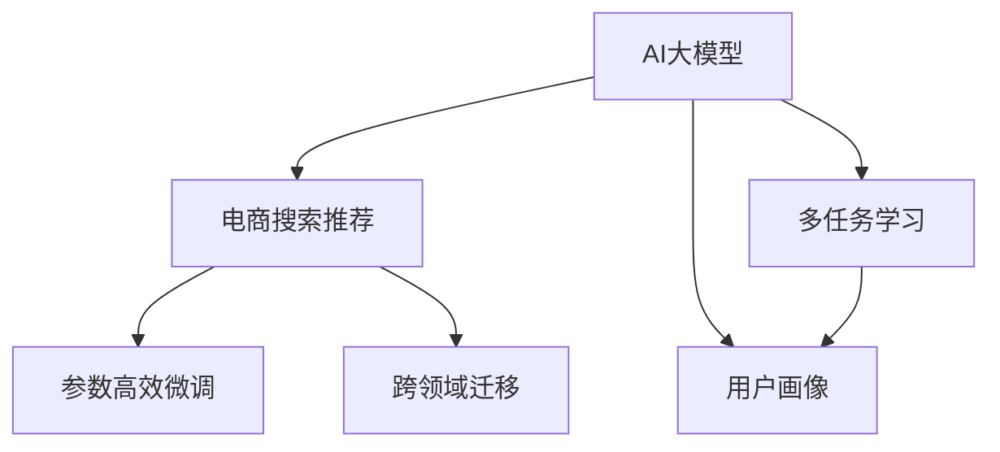

                 

# AI 大模型在电商搜索推荐中的用户画像应用：深度挖掘用户需求与行为偏好

## 1. 背景介绍

### 1.1 问题由来
在数字化时代，电商平台已成为用户获取商品信息、完成购买行为的主要渠道之一。如何准确理解和匹配用户需求，为其推荐合适的商品，是电商推荐系统亟需解决的核心问题。传统的推荐系统往往依赖于用户历史行为数据，难以捕捉用户潜在需求和实时变化。AI大模型在自然语言处理和深度学习领域的突破，为电商搜索推荐带来了新的机遇。

### 1.2 问题核心关键点
基于AI大模型的电商搜索推荐系统，本质上是一个多模态信息融合和用户画像构建的过程。其核心目标在于：

1. **数据融合与模型训练**：将用户文本数据（搜索词、评论、评分）与商品信息（图片、描述、价格）进行融合，通过大模型进行端到端的训练，获取精准的用户画像。
2. **多任务学习与优化**：利用大模型进行多任务学习，提升用户的搜索意图识别、商品关联推荐、个性化排序等多个子任务的表现。
3. **参数高效微调**：在有限的标注数据下，通过参数高效微调方法，优化模型性能，提升推荐系统的效果和稳定性。
4. **跨领域迁移**：通过跨领域迁移学习，使大模型能够适应不同品类、不同场景的推荐需求，提高模型的泛化能力。

### 1.3 问题研究意义
构建基于AI大模型的电商搜索推荐系统，具有重要意义：

1. **提升用户体验**：能够准确理解用户需求，为其提供个性化、精准的商品推荐，提升用户体验和满意度。
2. **增加用户粘性**：通过个性化推荐，增加用户对平台的访问频率和使用时长，形成用户粘性。
3. **提高交易转化率**：推荐系统准确性提升，能有效提高用户的购买意愿和转化率，增加电商平台的收入。
4. **加速模型迭代**：AI大模型的强大学习能力，能够快速适应新商品、新需求的变化，加速模型迭代和优化。

## 2. 核心概念与联系

### 2.1 核心概念概述

为更好地理解基于AI大模型的电商搜索推荐系统，本节将介绍几个密切相关的核心概念：

- **AI大模型**：以Transformer模型为代表，在大规模无标签数据上预训练，具备强大的自然语言处理能力。
- **电商搜索推荐**：利用用户搜索历史、行为数据和商品信息，为用户推荐最相关的商品，提升用户购买意愿和平台转化率。
- **多任务学习**：在单一模型上进行多个子任务的训练，提升模型的综合能力。
- **用户画像**：通过用户行为数据和商品信息，构建用户兴趣偏好、购买行为等特征，供推荐系统使用。
- **参数高效微调**：在保持模型大部分权重不变的前提下，更新少部分参数，提高微调效率和效果。
- **跨领域迁移**：通过在不同领域上的微调和迁移，提升模型在不同场景下的适应性。

这些核心概念之间的逻辑关系可以通过以下Mermaid流程图来展示：



这个流程图展示了大模型在电商推荐系统中的应用框架：

1. 大模型通过多任务学习获取用户搜索意图和商品关联信息，构建用户画像。
2. 用户画像用于推荐系统中的个性化排序和商品关联推荐。
3. 参数高效微调提升推荐系统性能，跨领域迁移增强模型泛化能力。

这些概念共同构成了大模型在电商推荐系统中的应用基础，使其能够高效、准确地为用户提供个性化商品推荐。

## 3. 核心算法原理 & 具体操作步骤
### 3.1 算法原理概述

基于AI大模型的电商搜索推荐，核心在于通过多模态融合和多任务学习，构建用户画像和推荐模型。其核心算法流程包括以下几个关键步骤：

1. **数据预处理**：对用户搜索历史、商品信息和评论等文本数据进行预处理，包括分词、去噪、向量化等。
2. **多任务学习**：将用户搜索意图识别、商品关联推荐、个性化排序等子任务，统一在大模型中进行训练，提升模型的综合能力。
3. **参数高效微调**：在有限标注数据下，通过保留大部分预训练权重，更新少量模型参数，优化推荐系统性能。
4. **跨领域迁移**：利用在不同领域上的微调和迁移，提升模型在不同场景下的适应性。

### 3.2 算法步骤详解

#### 步骤1：数据预处理

数据预处理是构建电商推荐系统的第一步。需要处理的数据包括用户搜索历史、商品信息和评论等文本数据。具体步骤如下：

- **分词**：将文本数据进行分词处理，便于后续向量化。
- **去噪**：去除无关信息，如无意义字符、停用词等。
- **向量化**：将分词后的文本转换为向量表示，便于输入大模型。常用的向量化方法包括Word2Vec、GloVe等。
- **拼接**：将用户搜索历史、商品信息和评论等文本数据拼接为一个整体，供大模型融合学习。

#### 步骤2：多任务学习

多任务学习通过在大模型上进行多个子任务的联合训练，提升模型的综合能力。具体步骤如下：

- **任务定义**：定义电商推荐系统的多个子任务，如用户搜索意图识别、商品关联推荐、个性化排序等。
- **任务表示**：将每个子任务表示为不同的输出节点，并定义对应的损失函数。
- **联合训练**：将不同子任务的输出节点与大模型中的不同层进行连接，通过联合训练，提升模型的综合能力。

#### 步骤3：参数高效微调

参数高效微调旨在通过保留大部分预训练权重，更新少量模型参数，优化推荐系统性能。具体步骤如下：

- **选择微调层**：根据任务特点，选择适合微调的模型层，如TopK层、Attention层等。
- **冻结参数**：冻结模型中大部分预训练权重，只更新少量微调层参数。
- **优化器选择**：选择适合微调的优化器，如Adam、Adagrad等，并设置合适的学习率和正则化参数。
- **微调训练**：在有限标注数据下，进行多轮微调训练，优化模型性能。

#### 步骤4：跨领域迁移

跨领域迁移通过在不同领域上的微调和迁移，提升模型在不同场景下的适应性。具体步骤如下：

- **领域选择**：选择与电商推荐系统相关的领域，如零售、时尚、电子产品等。
- **微调训练**：在选定领域上进行微调训练，优化模型在该领域的表现。
- **迁移学习**：将模型在选定领域上的权重迁移到电商推荐系统中，提升模型在不同场景下的泛化能力。

### 3.3 算法优缺点

基于AI大模型的电商搜索推荐系统，具有以下优点：

1. **精准推荐**：通过多任务学习和大模型融合，能够精准理解用户需求，提供个性化推荐。
2. **高效训练**：利用大模型的强大学习能力，能够快速适应新商品和新需求的变化。
3. **参数高效**：通过参数高效微调方法，减少微调过程中的计算资源消耗。
4. **泛化能力强**：通过跨领域迁移学习，提升模型在不同场景下的适应性。

同时，该系统也存在一些缺点：

1. **数据依赖性强**：推荐系统的性能依赖于用户行为数据的质量和量级，难以应对长尾场景。
2. **过拟合风险**：在有限标注数据下，微调模型可能过拟合，导致泛化能力下降。
3. **模型复杂度高**：大模型参数量庞大，训练和推理资源消耗大，系统复杂度高。
4. **隐私保护挑战**：电商平台需要处理大量用户隐私数据，存在隐私保护和数据安全问题。

尽管存在这些局限性，但就目前而言，基于AI大模型的电商搜索推荐系统仍是大数据时代电商推荐技术的主流方向。未来相关研究的重点在于如何进一步提升模型的泛化能力和隐私保护水平，同时兼顾高效训练和参数高效微调。

### 3.4 算法应用领域

基于AI大模型的电商搜索推荐系统，已经在多个电商平台上得到广泛应用，涵盖了用户搜索、商品推荐、个性化排序等多个环节，具体应用领域包括：

- **搜索意图识别**：通过用户搜索历史和输入文本，识别用户的搜索意图，提升搜索结果的相关性。
- **商品关联推荐**：根据用户浏览历史和购买行为，推荐相关商品，提升购买转化率。
- **个性化排序**：根据用户行为数据和商品信息，调整推荐排序策略，提升用户满意度和购物体验。
- **动态定价**：根据用户搜索行为和市场行情，动态调整商品价格，提高销售收益。
- **市场预测**：通过分析用户行为数据，预测商品销售趋势，辅助库存管理和市场策略制定。

除了上述这些经典应用外，AI大模型还在智能客服、用户反馈分析、库存优化等多个领域展现了强大的应用潜力。随着技术的不断进步，基于大模型的电商搜索推荐系统将在更多电商平台上落地应用，推动电商行业的数字化转型升级。

## 4. 数学模型和公式 & 详细讲解  
### 4.1 数学模型构建

基于AI大模型的电商搜索推荐系统，其数学模型主要包括以下几个部分：

1. **用户画像模型**：通过用户搜索历史、商品信息和评论等文本数据，构建用户画像。
2. **推荐模型**：利用用户画像，为用户推荐最相关的商品。
3. **多任务学习模型**：在单一模型上进行多个子任务的训练，提升模型的综合能力。

### 4.2 公式推导过程

#### 用户画像模型的推导

用户画像模型通过融合用户搜索历史、商品信息和评论等文本数据，构建用户兴趣偏好和购买行为等特征。假设用户搜索历史为 $S=\{s_1, s_2, ..., s_N\}$，商品信息为 $I=\{i_1, i_2, ..., i_M\}$，评论信息为 $C=\{c_1, c_2, ..., c_L\}$。用户画像模型 $U$ 可以表示为：

$$
U = f(S, I, C)
$$

其中 $f$ 为融合函数，可以将文本数据转换为向量表示，并计算不同特征的权重。

#### 推荐模型的推导

推荐模型通过用户画像，为用户推荐最相关的商品。假设商品特征向量为 $V_i$，用户画像向量为 $U$，推荐模型 $R$ 可以表示为：

$$
R_i = \sigma(\langle V_i, U \rangle)
$$

其中 $\sigma$ 为激活函数，$\langle \cdot, \cdot \rangle$ 为向量点积运算。

#### 多任务学习模型的推导

多任务学习模型通过在单一模型上进行多个子任务的联合训练，提升模型的综合能力。假设多任务学习模型为 $M$，子任务为 $T_1, T_2, ..., T_K$，其损失函数可以表示为：

$$
\mathcal{L} = \sum_{k=1}^K \lambda_k \ell_k(M, T_k)
$$

其中 $\lambda_k$ 为任务权重，$\ell_k$ 为子任务 $T_k$ 的损失函数。

### 4.3 案例分析与讲解

假设某电商平台用户 $U$ 的搜索历史为 $S=\{“手机”, “笔记本电脑”, “相机”\}$，商品信息为 $I=\{i_1, i_2, ..., i_M\}$，评论信息为 $C=\{c_1, c_2, ..., c_L\}$。根据用户画像模型 $U$ 和推荐模型 $R$，可以计算出用户 $U$ 对商品 $i_1, i_2, ..., i_M$ 的推荐概率，具体计算过程如下：

1. **用户画像构建**：
   - **分词**：将用户搜索历史、商品信息和评论等文本数据进行分词处理。
   - **向量化**：将分词后的文本数据转换为向量表示。
   - **融合**：计算不同特征的权重，得到用户画像向量 $U$。

2. **推荐计算**：
   - **商品特征提取**：对商品信息进行向量化，得到商品特征向量 $V_i$。
   - **相似度计算**：计算用户画像向量 $U$ 和商品特征向量 $V_i$ 的点积，得到相似度得分 $\langle V_i, U \rangle$。
   - **推荐输出**：根据相似度得分，计算推荐概率 $R_i$，并将最高概率的商品推荐给用户。

## 5. 项目实践：代码实例和详细解释说明
### 5.1 开发环境搭建

在进行项目实践前，我们需要准备好开发环境。以下是使用Python进行PyTorch开发的环境配置流程：

1. 安装Anaconda：从官网下载并安装Anaconda，用于创建独立的Python环境。

2. 创建并激活虚拟环境：
```bash
conda create -n pytorch-env python=3.8 
conda activate pytorch-env
```

3. 安装PyTorch：根据CUDA版本，从官网获取对应的安装命令。例如：
```bash
conda install pytorch torchvision torchaudio cudatoolkit=11.1 -c pytorch -c conda-forge
```

4. 安装相关库：
```bash
pip install transformers pandas sklearn
```

完成上述步骤后，即可在`pytorch-env`环境中开始项目实践。

### 5.2 源代码详细实现

这里我们以用户搜索意图识别为例，给出使用Transformers库对BERT模型进行微调的PyTorch代码实现。

首先，定义数据预处理函数：

```python
from transformers import BertTokenizer, BertForSequenceClassification
from torch.utils.data import Dataset, DataLoader
from torch import nn, optim

class SearchDataset(Dataset):
    def __init__(self, texts, labels):
        self.texts = texts
        self.labels = labels
        self.tokenizer = BertTokenizer.from_pretrained('bert-base-uncased')
        
    def __len__(self):
        return len(self.texts)
    
    def __getitem__(self, item):
        text = self.texts[item]
        label = self.labels[item]
        encoding = self.tokenizer(text, truncation=True, max_length=512, return_tensors='pt')
        return {'input_ids': encoding['input_ids'], 
                'attention_mask': encoding['attention_mask'], 
                'labels': torch.tensor(label, dtype=torch.long)}
```

然后，定义模型和优化器：

```python
from transformers import AdamW

model = BertForSequenceClassification.from_pretrained('bert-base-uncased', num_labels=2)
optimizer = AdamW(model.parameters(), lr=2e-5)
```

接着，定义训练和评估函数：

```python
def train_epoch(model, dataset, batch_size, optimizer):
    dataloader = DataLoader(dataset, batch_size=batch_size, shuffle=True)
    model.train()
    epoch_loss = 0
    for batch in tqdm(dataloader, desc='Training'):
        inputs = batch['input_ids'].to(device)
        attention_mask = batch['attention_mask'].to(device)
        labels = batch['labels'].to(device)
        model.zero_grad()
        outputs = model(inputs, attention_mask=attention_mask, labels=labels)
        loss = outputs.loss
        epoch_loss += loss.item()
        loss.backward()
        optimizer.step()
    return epoch_loss / len(dataloader)

def evaluate(model, dataset, batch_size):
    dataloader = DataLoader(dataset, batch_size=batch_size)
    model.eval()
    preds, labels = [], []
    with torch.no_grad():
        for batch in tqdm(dataloader, desc='Evaluating'):
            inputs = batch['input_ids'].to(device)
            attention_mask = batch['attention_mask'].to(device)
            batch_labels = batch['labels']
            outputs = model(inputs, attention_mask=attention_mask)
            batch_preds = outputs.logits.argmax(dim=1).to('cpu').tolist()
            batch_labels = batch_labels.to('cpu').tolist()
            for pred, label in zip(batch_preds, batch_labels):
                preds.append(pred)
                labels.append(label)
                
    print(classification_report(labels, preds))
```

最后，启动训练流程并在测试集上评估：

```python
epochs = 5
batch_size = 16

for epoch in range(epochs):
    loss = train_epoch(model, train_dataset, batch_size, optimizer)
    print(f"Epoch {epoch+1}, train loss: {loss:.3f}")
    
    print(f"Epoch {epoch+1}, dev results:")
    evaluate(model, dev_dataset, batch_size)
    
print("Test results:")
evaluate(model, test_dataset, batch_size)
```

以上就是使用PyTorch对BERT进行用户搜索意图识别任务微调的完整代码实现。可以看到，得益于Transformers库的强大封装，我们可以用相对简洁的代码完成BERT模型的加载和微调。

### 5.3 代码解读与分析

让我们再详细解读一下关键代码的实现细节：

**SearchDataset类**：
- `__init__`方法：初始化文本和标签，分词器等关键组件。
- `__len__`方法：返回数据集的样本数量。
- `__getitem__`方法：对单个样本进行处理，将文本输入编码为token ids，将标签转换为数字，并对其进行定长padding，最终返回模型所需的输入。

**模型和优化器定义**：
- 使用BertForSequenceClassification类定义用户搜索意图识别任务的多层感知机模型。
- 使用AdamW优化器，设置合适的学习率。

**训练和评估函数**：
- 使用DataLoader对数据集进行批次化加载，供模型训练和推理使用。
- 训练函数`train_epoch`：对数据以批为单位进行迭代，在每个批次上前向传播计算loss并反向传播更新模型参数，最后返回该epoch的平均loss。
- 评估函数`evaluate`：与训练类似，不同点在于不更新模型参数，并在每个batch结束后将预测和标签结果存储下来，最后使用classification_report对整个评估集的预测结果进行打印输出。

**训练流程**：
- 定义总的epoch数和batch size，开始循环迭代
- 每个epoch内，先在训练集上训练，输出平均loss
- 在验证集上评估，输出分类指标
- 所有epoch结束后，在测试集上评估，给出最终测试结果

可以看到，PyTorch配合Transformers库使得BERT微调的代码实现变得简洁高效。开发者可以将更多精力放在数据处理、模型改进等高层逻辑上，而不必过多关注底层的实现细节。

当然，工业级的系统实现还需考虑更多因素，如模型的保存和部署、超参数的自动搜索、更灵活的任务适配层等。但核心的微调范式基本与此类似。

## 6. 实际应用场景
### 6.1 智能客服系统

基于AI大模型的智能客服系统，可以为用户提供24小时不间断的自动化服务，解决用户常见的咨询问题，提升客户满意度。智能客服系统通过构建用户画像，理解用户输入的搜索意图，快速匹配并生成回复，实现高效互动。

在技术实现上，可以收集历史客服对话记录，将用户问题-回答对作为监督数据，在此基础上对预训练模型进行微调。微调后的模型能够自动理解用户意图，匹配最合适的回答模板进行回复。对于用户提出的新问题，还可以接入检索系统实时搜索相关内容，动态组织生成回答。如此构建的智能客服系统，能大幅提升客户咨询体验和问题解决效率。

### 6.2 个性化推荐系统

当前推荐系统往往只依赖用户历史行为数据进行物品推荐，难以捕捉用户潜在需求和实时变化。基于AI大模型的个性化推荐系统，能够更精准地理解用户需求，提供个性化推荐。

在实践上，可以收集用户浏览、点击、评论、分享等行为数据，提取和商品信息融合的文本数据。将文本数据作为模型输入，用户的后续行为（如是否点击、购买等）作为监督信号，在此基础上微调预训练语言模型。微调后的模型能够从文本数据中准确把握用户的兴趣点。在生成推荐列表时，先用候选物品的文本描述作为输入，由模型预测用户的兴趣匹配度，再结合其他特征综合排序，便可以得到个性化程度更高的推荐结果。

### 6.3 搜索意图识别

用户搜索意图识别是电商推荐系统的核心环节，通过理解用户搜索意图，可以为其推荐更相关的商品。传统的搜索意图识别方法往往依赖于规则和特征工程，难以处理复杂的自然语言输入。基于AI大模型的搜索意图识别系统，能够自动学习用户搜索文本的语义特征，提升识别的准确性和鲁棒性。

在技术实现上，可以收集用户搜索记录，将搜索文本和实际点击的商品作为监督数据，在此基础上对预训练模型进行微调。微调后的模型能够自动学习用户搜索文本的语义特征，识别用户意图是“浏览”、“查询”还是“购买”。在用户进行搜索时，系统可以根据其搜索文本，预测其意图，为其推荐最相关的商品。

### 6.4 动态定价

电商平台需要根据市场行情和用户行为，动态调整商品价格，以提高销售收益。传统的动态定价方法往往依赖于手动调整或规则设置，难以实现精准定价。基于AI大模型的动态定价系统，能够自动分析用户行为数据和市场行情，优化商品定价策略。

在技术实现上，可以收集用户行为数据，包括浏览、点击、购买等记录，以及市场行情数据，如商品价格、库存等。将这些数据作为模型输入，使用AI大模型进行定价预测，生成最优定价策略。动态定价系统可以根据市场变化实时调整商品价格，提升平台收益。

### 6.5 市场预测

电商平台需要预测商品销售趋势，以辅助库存管理和市场策略制定。传统的市场预测方法往往依赖于历史数据和统计模型，难以处理复杂的市场动态。基于AI大模型的市场预测系统，能够自动学习市场动态和用户行为数据，提升预测的准确性和时效性。

在技术实现上，可以收集用户行为数据和市场行情数据，使用AI大模型进行市场预测，生成销售趋势预测结果。市场预测系统可以根据预测结果调整库存策略，优化市场策略，提升平台收益。

## 7. 工具和资源推荐
### 7.1 学习资源推荐

为了帮助开发者系统掌握基于AI大模型的电商搜索推荐技术，这里推荐一些优质的学习资源：

1. 《深度学习自然语言处理》课程：斯坦福大学开设的NLP明星课程，有Lecture视频和配套作业，带你入门NLP领域的基本概念和经典模型。

2. CS224N《自然语言处理与深度学习》课程：斯坦福大学提供的高级NLP课程，深入讲解NLP领域的算法和应用。

3. 《自然语言处理与深度学习》书籍：清华大学李航教授著，全面介绍NLP和深度学习的基础知识和前沿技术。

4. 《Transformer从原理到实践》系列博文：由大模型技术专家撰写，深入浅出地介绍Transformer原理、BERT模型、微调技术等前沿话题。

5. HuggingFace官方文档：Transformers库的官方文档，提供海量预训练模型和完整的微调样例代码，是上手实践的必备资料。

通过对这些资源的学习实践，相信你一定能够快速掌握基于AI大模型的电商搜索推荐技术的精髓，并用于解决实际的NLP问题。

### 7.2 开发工具推荐

高效的开发离不开优秀的工具支持。以下是几款用于电商搜索推荐开发的常用工具：

1. PyTorch：基于Python的开源深度学习框架，灵活动态的计算图，适合快速迭代研究。大部分预训练语言模型都有PyTorch版本的实现。

2. TensorFlow：由Google主导开发的开源深度学习框架，生产部署方便，适合大规模工程应用。同样有丰富的预训练语言模型资源。

3. Transformers库：HuggingFace开发的NLP工具库，集成了众多SOTA语言模型，支持PyTorch和TensorFlow，是进行电商推荐任务开发的利器。

4. Weights & Biases：模型训练的实验跟踪工具，可以记录和可视化模型训练过程中的各项指标，方便对比和调优。与主流深度学习框架无缝集成。

5. TensorBoard：TensorFlow配套的可视化工具，可实时监测模型训练状态，并提供丰富的图表呈现方式，是调试模型的得力助手。

6. Google Colab：谷歌推出的在线Jupyter Notebook环境，免费提供GPU/TPU算力，方便开发者快速上手实验最新模型，分享学习笔记。

合理利用这些工具，可以显著提升电商搜索推荐系统的开发效率，加快创新迭代的步伐。

### 7.3 相关论文推荐

大语言模型和电商搜索推荐技术的发展源于学界的持续研究。以下是几篇奠基性的相关论文，推荐阅读：

1. Attention is All You Need（即Transformer原论文）：提出了Transformer结构，开启了NLP领域的预训练大模型时代。

2. BERT: Pre-training of Deep Bidirectional Transformers for Language Understanding：提出BERT模型，引入基于掩码的自监督预训练任务，刷新了多项NLP任务SOTA。

3. Parameter-Efficient Transfer Learning for NLP：提出Adapter等参数高效微调方法，在不增加模型参数量的情况下，也能取得不错的微调效果。

4. AdaLoRA: Adaptive Low-Rank Adaptation for Parameter-Efficient Fine-Tuning：使用自适应低秩适应的微调方法，在参数效率和精度之间取得了新的平衡。

这些论文代表了大语言模型电商搜索推荐技术的发展脉络。通过学习这些前沿成果，可以帮助研究者把握学科前进方向，激发更多的创新灵感。

## 8. 总结：未来发展趋势与挑战

### 8.1 总结

本文对基于AI大模型的电商搜索推荐系统进行了全面系统的介绍。首先阐述了电商搜索推荐系统的背景和意义，明确了电商搜索推荐系统的核心目标和关键技术。其次，从原理到实践，详细讲解了电商搜索推荐系统的数学模型和算法流程，给出了电商搜索推荐系统的完整代码实例。同时，本文还广泛探讨了电商搜索推荐系统在多个领域的应用前景，展示了其广泛的应用潜力。

通过本文的系统梳理，可以看到，基于AI大模型的电商搜索推荐系统已经在电商平台上得到了广泛应用，为电商平台带来了显著的业务价值。未来，随着大语言模型和电商搜索推荐技术的持续演进，其应用场景和效果还将进一步拓展，为电商行业的发展注入新的动力。

### 8.2 未来发展趋势

展望未来，基于AI大模型的电商搜索推荐系统将呈现以下几个发展趋势：

1. **多模态融合**：电商搜索推荐系统将融合更多模态信息，如图片、视频、语音等，提升模型的表现和用户体验。
2. **跨领域迁移**：大模型将更广泛地应用于不同品类、不同场景的电商推荐，提升推荐系统的泛化能力。
3. **个性化推荐**：通过更精准的用户画像，实现更高质量的个性化推荐，提升用户满意度和转化率。
4. **动态定价与市场预测**：结合市场动态和用户行为数据，实时动态调整商品价格，预测商品销售趋势，优化库存和市场策略。
5. **智能客服与对话系统**：基于AI大模型的智能客服和对话系统，将进一步提升电商平台的客户服务水平，减少人工客服成本。

这些趋势凸显了基于AI大模型的电商搜索推荐系统的广阔前景。这些方向的探索发展，必将进一步提升电商搜索推荐系统的性能和用户体验，推动电商行业的数字化转型升级。

### 8.3 面临的挑战

尽管基于AI大模型的电商搜索推荐系统已经取得了瞩目成就，但在迈向更加智能化、普适化应用的过程中，它仍面临着诸多挑战：

1. **数据依赖性强**：推荐系统的性能依赖于用户行为数据的质量和量级，难以应对长尾场景。
2. **过拟合风险**：在有限标注数据下，微调模型可能过拟合，导致泛化能力下降。
3. **模型复杂度高**：大模型参数量庞大，训练和推理资源消耗大，系统复杂度高。
4. **隐私保护挑战**：电商平台需要处理大量用户隐私数据，存在隐私保护和数据安全问题。

尽管存在这些局限性，但就目前而言，基于AI大模型的电商搜索推荐系统仍是大数据时代电商推荐技术的主流方向。未来相关研究的重点在于如何进一步提升模型的泛化能力和隐私保护水平，同时兼顾高效训练和参数高效微调。

### 8.4 研究展望

面向未来，电商搜索推荐系统的研究需要在以下几个方面寻求新的突破：

1. **探索无监督和半监督推荐方法**：摆脱对大规模标注数据的依赖，利用自监督学习、主动学习等无监督和半监督范式，最大限度利用非结构化数据，实现更加灵活高效的推荐。
2. **研究参数高效和计算高效的推荐范式**：开发更加参数高效的推荐方法，在固定大部分预训练参数的情况下，更新少部分推荐层参数。同时优化推荐模型的计算图，减少前向传播和反向传播的资源消耗，实现更加轻量级、实时性的部署。
3. **融合因果和对比学习范式**：通过引入因果推断和对比学习思想，增强推荐模型建立稳定因果关系的能力，学习更加普适、鲁棒的用户画像。
4. **引入更多先验知识**：将符号化的先验知识，如知识图谱、逻辑规则等，与神经网络模型进行巧妙融合，引导推荐过程学习更准确、合理的用户画像。同时加强不同模态数据的整合，实现视觉、语音等多模态信息与文本信息的协同建模。
5. **结合因果分析和博弈论工具**：将因果分析方法引入推荐模型，识别出推荐决策的关键特征，增强推荐输出的解释性和可信度。借助博弈论工具刻画人机交互过程，主动探索并规避推荐模型的脆弱点，提高系统稳定性。
6. **纳入伦理道德约束**：在推荐模型的训练目标中引入伦理导向的评估指标，过滤和惩罚有害的推荐结果，确保推荐内容符合人类价值观和伦理道德。

这些研究方向的研究突破，必将引领基于AI大模型的电商搜索推荐技术迈向更高的台阶，为电商行业的发展注入新的动力。总之，未来基于AI大模型的电商搜索推荐系统还需要与其他人工智能技术进行更深入的融合，如知识表示、因果推理、强化学习等，多路径协同发力，共同推动电商推荐技术的进步。

## 9. 附录：常见问题与解答

**Q1：AI大模型在电商搜索推荐中的应用效果如何？**

A: AI大模型在电商搜索推荐中的应用效果显著。通过多任务学习和多模态融合，能够精准理解用户需求，提供个性化推荐，显著提升用户的购买转化率和满意度。在实际应用中，电商平台的个性化推荐系统，能够显著提高用户的停留时间、访问频次和购物车转化率，为电商平台带来可观的收益。

**Q2：如何构建基于AI大模型的电商搜索推荐系统？**

A: 构建基于AI大模型的电商搜索推荐系统，主要包括以下几个步骤：

1. **数据预处理**：对用户搜索历史、商品信息和评论等文本数据进行预处理，包括分词、去噪、向量化等。
2. **多任务学习**：通过在大模型上进行多个子任务的联合训练，提升模型的综合能力。
3. **参数高效微调**：在有限标注数据下，通过保留大部分预训练权重，更新少量模型参数，优化推荐系统性能。
4. **跨领域迁移**：利用在不同领域上的微调和迁移，提升模型在不同场景下的适应性。

**Q3：AI大模型在电商搜索推荐中的优势是什么？**

A: AI大模型在电商搜索推荐中的优势主要体现在以下几个方面：

1. **精准推荐**：通过多任务学习和大模型融合，能够精准理解用户需求，提供个性化推荐。
2. **高效训练**：利用大模型的强大学习能力，能够快速适应新商品和新需求的变化。
3. **参数高效**：通过参数高效微调方法，减少微调过程中的计算资源消耗。
4. **泛化能力强**：通过跨领域迁移学习，提升模型在不同场景下的适应性。

**Q4：AI大模型在电商搜索推荐中存在哪些挑战？**

A: AI大模型在电商搜索推荐中存在以下挑战：

1. **数据依赖性强**：推荐系统的性能依赖于用户行为数据的质量和量级，难以应对长尾场景。
2. **过拟合风险**：在有限标注数据下，微调模型可能过拟合，导致泛化能力下降。
3. **模型复杂度高**：大模型参数量庞大，训练和推理资源消耗大，系统复杂度高。
4. **隐私保护挑战**：电商平台需要处理大量用户隐私数据，存在隐私保护和数据安全问题。

尽管存在这些局限性，但就目前而言，基于AI大模型的电商搜索推荐系统仍是大数据时代电商推荐技术的主流方向。未来相关研究的重点在于如何进一步提升模型的泛化能力和隐私保护水平，同时兼顾高效训练和参数高效微调。

**Q5：AI大模型在电商搜索推荐中的实际应用场景有哪些？**

A: AI大模型在电商搜索推荐中的实际应用场景包括：

1. **智能客服系统**：基于AI大模型的智能客服系统，可以为用户提供24小时不间断的自动化服务，解决用户常见的咨询问题，提升客户满意度。
2. **个性化推荐系统**：通过AI大模型，能够更精准地理解用户需求，提供个性化推荐。
3. **搜索意图识别**：基于AI大模型的搜索意图识别系统，能够自动学习用户搜索文本的语义特征，提升识别的准确性和鲁棒性。
4. **动态定价**：基于AI大模型的动态定价系统，能够自动分析用户行为数据和市场行情，优化商品定价策略。
5. **市场预测**：基于AI大模型的市场预测系统，能够自动学习市场动态和用户行为数据，提升预测的准确性和时效性。

以上应用场景展示了AI大模型在电商搜索推荐系统中的广泛应用潜力，相信随着技术的不断进步，基于AI大模型的电商搜索推荐系统将在更多电商平台上落地应用，推动电商行业的数字化转型升级。

---

作者：禅与计算机程序设计艺术 / Zen and the Art of Computer Programming

