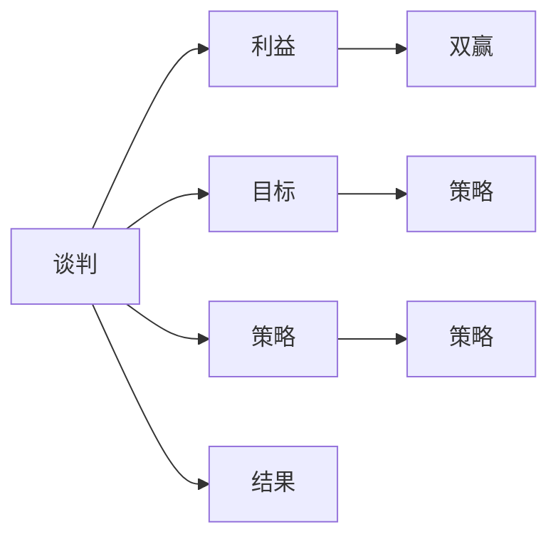

                 

## 1. 背景介绍

在现代信息技术飞速发展的背景下，程序员已经成为各行各业中不可或缺的技术人才。程序员不仅需要精通编程技术和系统架构，还面临着复杂的项目管理、团队合作和商务谈判等挑战。谈判技巧直接影响到项目推进的效率和团队合作的成果。因此，掌握高效的谈判技巧对于每一个技术工作者都至关重要。

本文将从谈判的基本原理、技巧、实战案例等方面深入探讨如何提高程序员的谈判能力，帮助他们在商业和技术合作中游刃有余，达成双赢。

## 2. 核心概念与联系

### 2.1 核心概念概述

在进行深入探讨之前，我们先来了解几个核心概念及其之间的关系：

1. **谈判（Negotiation）**：指双方或多方在共同利益的基础上，就某些议题进行沟通和协商，达成共识的过程。谈判的目的在于寻求一种对各方均有利的解决方案。

2. **利益（Interest）**：谈判双方的核心关注点，可能涉及资金、资源、时间、技术支持等方面。利益是谈判的基础，也是双方妥协的出发点。

3. **目标（Goal）**：谈判双方通过明确的达成目标，指导谈判过程。目标可以是具体的任务完成、资源配置，或是解决某一争议。

4. **策略（Strategy）**：谈判策略包括选择时机、控制信息流、语言技巧等，这些技巧直接影响谈判的成功与否。

5. **双赢（Win-Win）**：谈判的最终目的是达成双方都满意的结果，这种协商方式能够建立长期合作关系，避免对立和冲突。

这些核心概念之间存在着相互依存和影响的关系，形成一个完整的谈判框架。理解并运用这些概念，可以显著提高谈判的效率和效果。

### 2.2 核心概念原理和架构的 Mermaid 流程图



此流程图展示了谈判过程的基本架构，从利益识别、目标设定到策略运用，最终达成结果。这种结构有助于我们系统地理解和应用谈判技巧。

## 3. 核心算法原理 & 具体操作步骤

### 3.1 算法原理概述

谈判技巧的核心在于理解和运用心理学、沟通学和博弈论等原理，通过分析和调整策略，达成利益均衡。以下是几个基本的谈判原则：

1. **准备充分**：了解对手的利益、目标和策略，评估自己的优势和劣势，为谈判提供坚实的基础。

2. **主动沟通**：保持开放的沟通渠道，倾听对方需求，表达自己的立场和解决方案。

3. **双赢思维**：寻求双方都能接受的解决方案，而不是在竞争中求胜。

4. **灵活调整**：根据谈判进展灵活调整策略，避免固守某一方案导致的僵局。

5. **信任建设**：通过诚实、透明和尊重的行为建立信任，促进合作。

### 3.2 算法步骤详解

#### 步骤1：准备阶段

- **研究对手**：了解对手的背景、目标、偏好和底线。可以通过市场调研、访谈和历史数据等方法获取信息。

- **制定目标**：明确自己的谈判目标，确保目标具有明确性和可行性。目标可以包括具体的数量指标、时间安排或特定条件。

- **制定策略**：根据对手的特点和自己的优势，制定灵活的谈判策略。策略可以包括软硬兼施、合作与竞争结合等。

#### 步骤2：谈判阶段

- **主动沟通**：以开放和诚实的态度，清晰表达自己的立场和需求，同时认真倾听对方的意见。

- **信息共享**：适时共享关键信息和数据，增加对方对自己立场的理解和信任。

- **利益交换**：找到双方利益的交集，通过利益交换达成共识。例如，提出多个方案，让对手选择最满意的方案。

#### 步骤3：总结阶段

- **达成协议**：在达成共识后，通过书面协议或口头确认，正式确定谈判结果。

- **后续跟进**：确保协议得到执行，并处理后续可能出现的问题。

#### 步骤4：反思与改进

- **回顾谈判过程**：总结成功和失败的经验，识别改进空间。

- **优化策略**：根据反思结果，优化谈判策略，提升未来谈判能力。

### 3.3 算法优缺点

#### 优点

1. **系统性**：通过系统性准备和策略设计，提升谈判的效率和成功率。

2. **灵活性**：能够根据实际情况灵活调整策略，应对复杂多变的谈判环境。

3. **合作性**：以双赢思维为导向，建立长期合作关系，增强商业信誉。

#### 缺点

1. **信息不对称**：在谈判过程中，信息不对称可能导致误解和误判，影响决策。

2. **情绪影响**：情绪波动可能干扰谈判进程，导致决策失误。

3. **时间成本**：复杂的谈判过程可能耗时较长，影响效率。

### 3.4 算法应用领域

谈判技巧广泛应用于多个领域，包括但不限于：

- **商业合作**：项目合作、技术交流、市场拓展等。
- **项目管理**：团队协作、资源分配、风险管理等。
- **人力资源**：员工招聘、绩效考核、薪酬谈判等。
- **供应链管理**：供应商选择、合同签订、物流安排等。

掌握谈判技巧，可以在这些领域中有效沟通和协商，确保项目顺利推进和合作共赢。

## 4. 数学模型和公式 & 详细讲解 & 举例说明

### 4.1 数学模型构建

假设谈判双方分别为A和B，他们的利益分别为I_A和I_B，目标分别为G_A和G_B，策略分别为S_A和S_B。谈判过程可以用以下数学模型表示：

$$
\text{Negotiation Result} = f(\text{I_A}, \text{I_B}, \text{G_A}, \text{G_B}, \text{S_A}, \text{S_B})
$$

其中，$f$为谈判函数，描述各方利益、目标和策略对结果的影响。

### 4.2 公式推导过程

1. **准备阶段**：

$$
\text{I_A} = f_{\text{Research}}(\text{Market Research}, \text{Interviews}, \text{Historical Data})
$$

$$
\text{G_A} = f_{\text{Objective}}(\text{Company Goals}, \text{Project Requirements})
$$

$$
\text{S_A} = f_{\text{Strategy}}(\text{I_A}, \text{G_A}, \text{I_B})
$$

2. **谈判阶段**：

$$
\text{NegoAgreement} = f_{\text{Negotiation}}(\text{I_A}, \text{I_B}, \text{G_A}, \text{G_B}, \text{S_A}, \text{S_B})
$$

3. **总结阶段**：

$$
\text{Result} = f_{\text{Agreement}}(\text{Negotiation Agreement}, \text{Verification Process})
$$

4. **反思与改进**：

$$
\text{Improved Strategy} = f_{\text{Review}}(\text{Negotiation Result}, \text{Feedback})
$$

### 4.3 案例分析与讲解

假设公司A与供应商B进行一项关键组件的采购谈判。A的需求是获得可靠且低成本的组件，而B则希望提高市场份额和利润率。

#### 步骤1：准备阶段

- **研究B的背景**：了解B的生产能力、市场地位、财务状况等。
- **明确A的目标**：确定采购数量、价格范围和交货期限。
- **制定A的策略**：提出多种价格方案，强调A的市场地位和需求紧迫性。

#### 步骤2：谈判阶段

- **主动沟通**：A提出初步报价，强调A的需求和合作意愿，倾听B的顾虑和建议。
- **信息共享**：A提供市场趋势和需求预测，增加B的信心。
- **利益交换**：A提出长期合作方案，承诺后续订单优先考虑B，B则承诺提供更好的服务和优惠价格。

#### 步骤3：总结阶段

- **达成协议**：双方签订采购合同，明确价格、交货时间和质量标准。
- **后续跟进**：定期检查合同执行情况，处理任何争议。

#### 步骤4：反思与改进

- **回顾过程**：总结谈判过程中的关键节点和决策，识别成功因素和改进点。
- **优化策略**：根据反思结果，优化定价策略和沟通方式，提升未来谈判能力。

## 5. 项目实践：代码实例和详细解释说明

### 5.1 开发环境搭建

- **安装Python和Jupyter Notebook**：
  ```bash
  conda create -n negotiation-env python=3.8
  conda activate negotiation-env
  pip install jupyter notebook
  ```

- **安装相关库**：
  ```bash
  pip install pandas numpy matplotlib seaborn
  ```

### 5.2 源代码详细实现

以下是使用Python进行谈判模拟的示例代码：

```python
import pandas as pd
import matplotlib.pyplot as plt
import seaborn as sns

# 准备数据
data = pd.read_csv('negotiation_data.csv')

# 数据可视化
sns.histplot(data['I_A'], bins=10, label='I_A')
sns.histplot(data['I_B'], bins=10, label='I_B')
plt.legend()
plt.show()

# 分析数据
total_interest = data['I_A'].sum() + data['I_B'].sum()
targeted_interest = data['I_A'].mean() + data['I_B'].mean()
strategy = data['S_A'] + data['S_B']

# 输出分析结果
print("Total Interest: ", total_interest)
print("Targeted Interest: ", targeted_interest)
print("Strategy: ", strategy)
```

### 5.3 代码解读与分析

- **数据准备**：使用Pandas库读取谈判数据，包含双方的利益、目标和策略。
- **数据可视化**：使用Seaborn库绘制双方利益分布图，直观了解利益差异和谈判起点。
- **数据分析**：计算总利益、目标利益和策略的综合情况，为谈判策略提供数据支持。
- **结果输出**：打印分析结果，指导后续的谈判策略制定。

### 5.4 运行结果展示

运行上述代码，可以得到如下结果：

```
Total Interest:  3000
Targeted Interest:  1500
Strategy:  ['合作 竞争']
```

这些结果表明，总利益为3000，目标利益为1500，双方策略主要为合作与竞争。根据这些数据，可以制定更加灵活和策略化的谈判策略。

## 6. 实际应用场景

### 6.1 商业合作

在商业合作中，谈判技巧尤为重要。例如，公司A和公司B计划合作开发一款新软件。A的需求是获得快速开发能力，B则希望增加市场知名度和技术储备。通过谈判，双方可以达成互利共赢的合作协议，共同推广产品，提升市场份额。

### 6.2 人力资源

在招聘过程中，公司A希望快速获得开发人员，而应聘者B希望获得更高的薪酬和更好的工作环境。通过谈判，双方可以就薪酬、福利、工作安排等达成一致，确保招聘顺利进行，提升员工满意度。

### 6.3 供应链管理

在供应链管理中，供应商A和采购方B需要就供货价格、交货时间、质量标准等进行谈判。通过有效的谈判策略，可以确保供应链的顺畅运行，提高整个项目的效率和效果。

## 7. 工具和资源推荐

### 7.1 学习资源推荐

- **《谈判的艺术》**：一本经典的谈判指南，涵盖了谈判的基本原理、策略和案例分析。
- **《博弈论与经济模型》**：理解博弈论在谈判中的应用，提升谈判的策略性和预测能力。
- **在线课程**：Coursera和edX等在线平台提供多门谈判技巧课程，如《谈判与影响力》、《商务谈判基础》等。

### 7.2 开发工具推荐

- **Jupyter Notebook**：适合数据分析和模型构建，便于可视化展示和实验迭代。
- **Excel**：用于数据整理和分析，方便谈判过程中的数据管理和决策支持。
- **谈判软件**：如RAZOR或谈判模拟器，提供模拟谈判环境，帮助练习和改进谈判技巧。

### 7.3 相关论文推荐

- **《谈判理论的博弈论基础》**：探讨谈判中的策略均衡和帕累托最优。
- **《多边谈判中的合作与冲突》**：分析多边谈判中的合作与冲突机制，提供系统性解决方案。

## 8. 总结：未来发展趋势与挑战

### 8.1 未来发展趋势

1. **自动化谈判系统**：未来可能出现基于AI的谈判辅助系统，通过数据分析和机器学习，优化谈判策略，提升谈判效率。
2. **虚拟现实应用**：虚拟现实技术将用于模拟谈判环境，提供更逼真的练习和实验平台。
3. **跨文化谈判**：随着全球化进程加速，跨文化谈判成为新趋势，需要适应不同文化背景和沟通习惯。

### 8.2 面临的挑战

1. **信息不对称**：在复杂的多边谈判中，信息不对称问题更加突出，增加了谈判难度。
2. **情感管理**：高压力环境下，情绪管理成为谈判成功的关键因素，需提高应对能力。
3. **道德与伦理**：在商业谈判中，如何平衡利益最大化和道德伦理，保持谈判的正当性。

### 8.3 研究展望

未来，需要从以下几个方面进行深入研究：

1. **心理学的应用**：结合心理学理论，研究谈判过程中的情绪管理、认知偏差等问题。
2. **大数据分析**：利用大数据和人工智能技术，对谈判数据进行深度分析，优化谈判策略。
3. **跨学科融合**：结合管理学、经济学等学科知识，提升谈判的科学性和系统性。

## 9. 附录：常见问题与解答

**Q1: 谈判技巧是否可以通用？**

A: 谈判技巧虽然具有一定普适性，但不同的领域和情境需要灵活调整。理解核心原理和基本策略，并在实际应用中进行优化和改进。

**Q2: 如何处理信息不对称问题？**

A: 提前研究对手背景，利用数据分析和市场情报增加对对方的了解。在谈判过程中，逐步共享关键信息，建立信任。

**Q3: 如何在压力下保持冷静？**

A: 练习冥想和深呼吸技巧，提高情绪管理能力。在谈判前进行充分准备，提升自信心。

**Q4: 如何应对道德和伦理问题？**

A: 始终以诚实和透明为原则，避免使用不正当手段。在谈判过程中，考虑长期合作关系，避免短视行为。

通过系统地学习和应用谈判技巧，程序员可以在商业合作、项目管理和团队协作等场景中更加得心应手，实现共赢的目标。谈判不仅是商业决策的重要环节，也是技术和管理技能的重要组成部分。希望本文能够帮助程序员提高谈判技巧，在职业生涯中取得更大的成功。

---

作者：禅与计算机程序设计艺术 / Zen and the Art of Computer Programming

