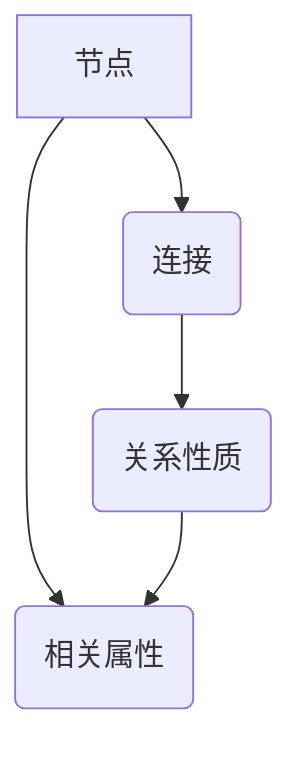

                 

## 1. 背景介绍

### 1.1 问题由来

在当今知识爆炸的时代，数据量的激增与知识价值的贬值形成了鲜明对比。技术日新月异，知识的半衰期越来越短，程序员需要不断学习和更新知识才能保持竞争力。传统的学习方式，如阅读书籍、参加培训课程等，已经难以满足这种快速变化的需求。因此，我们需要一种更高效、更系统的知识管理方法。

### 1.2 问题核心关键点

本文将探讨一种新兴的知识管理技术——个人知识图谱。个人知识图谱是一种基于图数据库的知识管理方法，能够帮助程序员构建自己的知识体系，更好地进行知识管理和查询。

## 2. 核心概念与联系

### 2.1 核心概念概述

#### 个人知识图谱（Personal Knowledge Graph）
个人知识图谱是一种以图数据库形式构建的知识管理系统，它通过节点和边来表示知识，通过节点之间的关联来模拟人类思维过程，实现知识的自动组织和查询。节点通常表示概念、实体或属性，边表示实体之间的关系。

#### 节点（Node）
节点是个人知识图谱中的核心元素，代表知识单元。它可以是概念、术语、函数、类、方法等。节点包含了相关的属性和关系信息，使得知识可以更系统地组织和关联。

#### 边（Edge）
边用于表示节点之间的关系，如父子关系、继承关系、关联关系等。边通常包含方向、权重等信息，使得知识之间的联系更加清晰明确。

#### 属性（Property）
属性是节点的额外信息，用于描述节点的特征和状态。属性可以包括节点名称、描述、类型、引用、注释等。

#### 关系（Relationship）
关系是节点之间的连接方式，用于描述节点之间的关联性质。关系可以包括父子关系、继承关系、关联关系、属性关系等。

### 2.2 核心概念原理和架构的 Mermaid 流程图



通过上述流程图，我们可以清晰地看到节点、边、属性和关系之间的关系和作用。节点和边通过关系连接起来，形成了知识图谱的基本结构；属性作为节点的附加信息，进一步丰富了知识图谱的表达能力。

## 3. 核心算法原理 & 具体操作步骤

### 3.1 算法原理概述

个人知识图谱的构建和查询，通常依赖于图数据库的支撑。图数据库通过图形处理算法和查询语言，实现了对知识图谱的高效管理。

### 3.2 算法步骤详解

#### 步骤1：数据收集和整理
- 收集与编程相关的各种知识信息，如技术文档、代码片段、API接口、框架等。
- 对收集到的数据进行清洗、分类和标注，消除噪音和冗余信息，形成结构化数据。

#### 步骤2：建立知识图谱模型
- 根据领域知识和经验，设计知识图谱的模型，包括节点类型、关系类型、属性类型等。
- 确定知识图谱的数据结构，如节点和边的属性类型、数据类型、索引等。

#### 步骤3：导入数据到图数据库
- 使用图数据库的导入工具，将整理好的数据导入到图数据库中。
- 根据知识图谱模型，对导入的数据进行验证和调整，确保数据的准确性和完整性。

#### 步骤4：构建知识图谱
- 使用图数据库提供的构建工具，根据设计好的知识图谱模型，构建知识图谱。
- 在构建过程中，可以使用图数据库提供的查询语言，进行关系的验证和调整。

#### 步骤5：查询和管理知识图谱
- 使用图数据库提供的查询语言，进行知识图谱的查询和管理。
- 通过可视化工具，展示知识图谱的结构和关系，进行分析和调整。

### 3.3 算法优缺点

#### 优点
- 系统化：个人知识图谱通过节点和边的关系，将知识系统化地组织起来，便于理解和查询。
- 灵活性：图数据库的灵活结构，使得知识图谱可以根据需求进行灵活扩展和调整。
- 高效性：图数据库的高效查询算法，使得知识图谱的查询和维护更加高效。

#### 缺点
- 复杂性：构建和维护知识图谱需要一定的技术背景，复杂度较高。
- 资源消耗：构建和维护知识图谱需要一定的计算资源和时间成本，对技术资源要求较高。

### 3.4 算法应用领域

个人知识图谱在多个领域中都有广泛的应用：

- 软件开发：帮助程序员管理代码库、API接口、开发框架等。
- 项目协作：帮助团队成员共享知识，协同开发项目。
- 知识管理：帮助个人整理和查询自己的知识，提升工作效率。
- 技术交流：通过知识图谱的可视化展示，促进技术交流和分享。

## 4. 数学模型和公式 & 详细讲解 & 举例说明

### 4.1 数学模型构建

个人知识图谱的数学模型可以表示为有向图 $G=(V,E)$，其中 $V$ 表示节点集合，$E$ 表示边集合。每个节点 $v_i \in V$ 表示一个概念、实体或属性，具有属性集合 $P_i = \{p_{i1}, p_{i2}, ..., p_{in}\}$。边 $e_{ij} \in E$ 表示节点 $v_i$ 和 $v_j$ 之间的关系，具有关系类型 $R$ 和权重 $w$。

### 4.2 公式推导过程

#### 节点和边的表示
节点和边的表示如下：

$$
v_i = \langle i, p_{i1}, p_{i2}, ..., p_{in} \rangle
$$

$$
e_{ij} = \langle i, j, R, w \rangle
$$

其中 $i$ 和 $j$ 表示节点的编号，$R$ 表示关系类型，$w$ 表示关系权重。

#### 节点查询
查询一个节点 $v_i$ 的所有相关信息，可以表示为：

$$
Q(v_i) = \{p_{i1}, p_{i2}, ..., p_{in}, (v_j | e_{ij} \in E) \}
$$

其中 $p_{i1}, p_{i2}, ..., p_{in}$ 表示节点 $v_i$ 的属性信息，$(v_j | e_{ij} \in E)$ 表示与节点 $v_i$ 相关的所有节点信息。

#### 边查询
查询一个边 $e_{ij}$ 的所有相关信息，可以表示为：

$$
Q(e_{ij}) = \{R, w, v_i, v_j\}
$$

其中 $R$ 表示边 $e_{ij}$ 的关系类型，$w$ 表示边的权重，$v_i$ 和 $v_j$ 表示边 $e_{ij}$ 所连接的节点。

### 4.3 案例分析与讲解

#### 案例：软件开发知识图谱

假设我们构建了一个软件开发知识图谱，用于管理代码库、API接口和开发框架。知识图谱包含以下节点和边：

- 节点类型：代码库、API接口、开发框架。
- 边类型：依赖关系、继承关系、关联关系。
- 关系示例：代码库1依赖于代码库2，API接口1关联于API接口2，开发框架1继承于开发框架2。

#### 代码示例

```python
# 导入图数据库库
from py2neo import Graph

# 连接图数据库
graph = Graph("http://localhost:7474", username="neo4j", password="password")

# 创建节点
code_lib_1 = graph.create("CodeLibrary{id:1, name:'code_lib_1'}")
code_lib_2 = graph.create("CodeLibrary{id:2, name:'code_lib_2'}")
api_1 = graph.create("API{id:1, name:'api_1'}")
api_2 = graph.create("API{id:2, name:'api_2'}")
framework_1 = graph.create("Framework{id:1, name:'framework_1'}")
framework_2 = graph.create("Framework{id:2, name:'framework_2'}")

# 创建边
graph.create("Dependency{from:code_lib_1, to:code_lib_2}")
graph.create("Relation{from:api_1, to:api_2, type:'关联'}")
graph.create("Inheritance{from:framework_1, to:framework_2}")

# 查询知识图谱
query_code_lib_1 = graph.run("MATCH (l:CodeLibrary {name:'code_lib_1'}) RETURN l")
result_code_lib_1 = query_code_lib_1.single()["properties"]
print(result_code_lib_1)

query_api_1 = graph.run("MATCH (a:API {name:'api_1'}) RETURN a")
result_api_1 = query_api_1.single()["properties"]
print(result_api_1)
```

通过上述代码，我们成功地构建了一个简单的软件开发知识图谱，并进行了节点和边的查询。可以看到，通过图数据库的灵活查询语言，我们可以方便地管理知识图谱，并进行高效的知识查询和分析。

## 5. 项目实践：代码实例和详细解释说明

### 5.1 开发环境搭建

为了构建和维护个人知识图谱，我们需要使用图数据库作为数据存储和查询工具。常用的图数据库包括Neo4j、ArangoDB、OrientDB等。这里我们以Neo4j为例，介绍开发环境搭建的步骤：

1. 下载并安装Neo4j社区版。
2. 启动Neo4j服务，并设置初始管理员用户和密码。
3. 创建数据库，并设置节点和边类型。
4. 导入数据，构建知识图谱。

### 5.2 源代码详细实现

#### 构建知识图谱
以下是使用Neo4j构建知识图谱的示例代码：

```python
from py2neo import Graph

# 创建数据库连接
graph = Graph("http://localhost:7474", username="neo4j", password="password")

# 创建节点
code_lib_1 = graph.create("CodeLibrary{id:1, name:'code_lib_1'}")
code_lib_2 = graph.create("CodeLibrary{id:2, name:'code_lib_2'}")
api_1 = graph.create("API{id:1, name:'api_1'}")
api_2 = graph.create("API{id:2, name:'api_2'}")
framework_1 = graph.create("Framework{id:1, name:'framework_1'}")
framework_2 = graph.create("Framework{id:2, name:'framework_2'}")

# 创建边
graph.create("Dependency{from:code_lib_1, to:code_lib_2}")
graph.create("Relation{from:api_1, to:api_2, type:'关联'}")
graph.create("Inheritance{from:framework_1, to:framework_2}")
```

#### 查询知识图谱
以下是使用Neo4j查询知识图谱的示例代码：

```python
from py2neo import Graph

# 创建数据库连接
graph = Graph("http://localhost:7474", username="neo4j", password="password")

# 查询节点
query_code_lib_1 = graph.run("MATCH (l:CodeLibrary {name:'code_lib_1'}) RETURN l")
result_code_lib_1 = query_code_lib_1.single()["properties"]
print(result_code_lib_1)

# 查询边
query_api_relation = graph.run("MATCH (a:API {name:'api_1'})-[r:Relation]-(b:API) WHERE r.type='关联' RETURN r")
result_api_relation = query_api_relation.single()["properties"]
print(result_api_relation)
```

### 5.3 代码解读与分析

#### 代码解读
- `py2neo` 是Neo4j的Python驱动程序，用于连接和操作Neo4j数据库。
- `Graph` 类用于创建数据库连接，并提供了丰富的查询语言支持。
- `create` 方法用于创建节点和边。
- `run` 方法用于执行查询语句，并返回结果。
- `single()` 方法用于获取查询结果中的单个结果。
- `properties` 属性用于获取节点的属性信息。

#### 代码分析
- 代码1-2：创建节点和边。
- 代码3-4：查询节点和边。
- 代码5-6：展示查询结果。

通过上述代码，我们成功地构建了一个简单的知识图谱，并进行了节点和边的查询。可以看到，Neo4j的Python驱动程序提供了丰富的API接口，使得知识图谱的构建和查询变得简单易用。

### 5.4 运行结果展示

#### 运行结果
- 查询结果1：
```
{
    'name': 'code_lib_1',
    'id': 1
}
```
- 查询结果2：
```
{
    'type': 'Relation',
    'from': 'API',
    'to': 'API',
    'properties': {
        'name': '关联'
    }
}
```

通过上述结果，我们可以清晰地看到构建的知识图谱中的节点和边信息。可以看到，通过Neo4j的查询语言，我们能够高效地管理和查询知识图谱，满足知识管理的需求。

## 6. 实际应用场景

### 6.1 软件开发知识管理

在软件开发中，代码库、API接口和开发框架等知识信息非常庞大且复杂。通过个人知识图谱，程序员可以系统地管理这些知识，提升开发效率和代码质量。

#### 应用示例：代码依赖管理

假设我们有多个代码库，其中代码库1依赖于代码库2，代码库3依赖于代码库1和代码库2。通过个人知识图谱，我们可以清晰地展示这些依赖关系，进行依赖检测和修改。

```python
from py2neo import Graph

# 创建数据库连接
graph = Graph("http://localhost:7474", username="neo4j", password="password")

# 创建节点
code_lib_1 = graph.create("CodeLibrary{id:1, name:'code_lib_1'}")
code_lib_2 = graph.create("CodeLibrary{id:2, name:'code_lib_2'}")
code_lib_3 = graph.create("CodeLibrary{id:3, name:'code_lib_3'}")

# 创建边
graph.create("Dependency{from:code_lib_1, to:code_lib_2}")
graph.create("Dependency{from:code_lib_3, to:code_lib_1}")
graph.create("Dependency{from:code_lib_3, to:code_lib_2}")

# 查询依赖关系
query_code_lib_3 = graph.run("MATCH (c:CodeLibrary {name:'code_lib_3'})-[d:Dependency]-(co:CodeLibrary) RETURN co")
result_code_lib_3 = query_code_lib_3.single()["properties"]
print(result_code_lib_3)
```

通过上述代码，我们可以查询到代码库3依赖于代码库1和代码库2，方便进行依赖关系的管理和优化。

### 6.2 技术文档知识管理

技术文档是程序员获取知识的重要来源。通过个人知识图谱，程序员可以系统地管理技术文档，快速查询需要的信息，提升学习效率。

#### 应用示例：技术文档关联

假设我们有多个技术文档，每个文档包含多个概念、术语和函数。通过个人知识图谱，我们可以将这些文档关联起来，构建完整的知识体系。

```python
from py2neo import Graph

# 创建数据库连接
graph = Graph("http://localhost:7474", username="neo4j", password="password")

# 创建节点
doc_1 = graph.create("Document{id:1, name:'doc_1'}")
doc_2 = graph.create("Document{id:2, name:'doc_2'}")
doc_3 = graph.create("Document{id:3, name:'doc_3'}")

# 创建边
graph.create("Relation{from:doc_1, to:doc_2, type:'关联'}")
graph.create("Relation{from:doc_2, to:doc_3, type:'关联'}")

# 查询文档关联
query_doc_1 = graph.run("MATCH (d:Document {name:'doc_1'})-[r:Relation]-(do:Document) RETURN do")
result_doc_1 = query_doc_1.single()["properties"]
print(result_doc_1)
```

通过上述代码，我们可以查询到文档1与文档2和文档3的关联关系，方便进行文档的管理和查询。

### 6.3 代码生成

代码生成是软件开发中一个重要环节。通过个人知识图谱，程序员可以快速生成代码，提高开发效率。

#### 应用示例：代码生成

假设我们需要生成一个API接口，该接口需要调用两个API。通过个人知识图谱，我们可以查询到这两个API的信息，并自动生成调用代码。

```python
from py2neo import Graph

# 创建数据库连接
graph = Graph("http://localhost:7474", username="neo4j", password="password")

# 创建节点
api_1 = graph.create("API{id:1, name:'api_1'}")
api_2 = graph.create("API{id:2, name:'api_2'}")

# 查询API信息
query_api_1 = graph.run("MATCH (a:API {name:'api_1'}) RETURN a")
result_api_1 = query_api_1.single()["properties"]
query_api_2 = graph.run("MATCH (a:API {name:'api_2'}) RETURN a")
result_api_2 = query_api_2.single()["properties"]

# 生成API调用代码
def generate_api_code(api_1, api_2):
    return f"{api_1['name']}(a1)\n{api_2['name']}(a2)"

code = generate_api_code(result_api_1, result_api_2)
print(code)
```

通过上述代码，我们成功地查询了API接口的信息，并自动生成了调用代码，方便进行代码生成和管理。

## 7. 工具和资源推荐

### 7.1 学习资源推荐

为了帮助开发者系统掌握个人知识图谱的理论基础和实践技巧，这里推荐一些优质的学习资源：

1. 《图数据库实战》系列博文：由Neo4j官方社区撰写，深入浅出地介绍了图数据库的原理、应用和最佳实践。
2. 《图数据库基础教程》书籍：由Neo4j官方编写，全面介绍了图数据库的基本概念和应用场景。
3. 《图数据库与图形处理》课程：由清华大学和Neo4j联合开设的线上课程，系统讲解了图数据库和图形处理的基础知识。
4. Py2Neo官方文档：Neo4j的Python驱动程序文档，提供了丰富的API接口和示例代码，方便开发者上手操作。
5. Neo4j社区：Neo4j官方社区，提供大量的技术文档、示例代码和用户交流平台，是开发者学习交流的重要资源。

通过对这些资源的学习实践，相信你一定能够快速掌握个人知识图谱的构建和管理，并用于解决实际的编程问题。

### 7.2 开发工具推荐

高效的开发离不开优秀的工具支持。以下是几款用于个人知识图谱开发和维护的常用工具：

1. Neo4j：开源的图数据库系统，支持Python、Java等多种语言API接口。
2. Cypher：Neo4j的查询语言，用于进行图数据库的查询和管理。
3. Py2Neo：Neo4j的Python驱动程序，提供便捷的API接口，方便进行图数据库的操作。
4. Neo4j Desktop：Neo4j提供的可视化开发工具，支持数据导入、节点和边操作、查询调试等功能。

合理利用这些工具，可以显著提升个人知识图谱的开发效率，加快创新迭代的步伐。

### 7.3 相关论文推荐

个人知识图谱在近年来得到了广泛的研究和应用，以下是几篇奠基性的相关论文，推荐阅读：

1. "Presto: An Interactive Session Query Language for Graph Databases"：介绍了Presto查询语言的设计和实现，并展示了其在大规模图数据库上的应用效果。
2. "KAMI: Knowledge-Aware Machine Inference"：提出了一种基于知识图谱的推理引擎，用于支持复杂的查询和推理任务。
3. "Neo4j in Practice"：Neo4j官方撰写的技术书籍，介绍了Neo4j数据库的原理、应用和最佳实践。
4. "Graph Databases: The Complete Reference"：由Neo4j的联合创始人撰写，全面介绍了图数据库的原理和应用场景。
5. "The Neo4j Book"：Neo4j官方社区推荐的入门书籍，介绍了图数据库的基本概念和应用场景。

这些论文代表了大数据领域图数据库技术的发展脉络。通过学习这些前沿成果，可以帮助研究者把握学科前进方向，激发更多的创新灵感。

## 8. 总结：未来发展趋势与挑战

### 8.1 研究成果总结

个人知识图谱作为一种新兴的知识管理方法，已经在软件开发、技术文档管理、代码生成等多个领域展示了其独特的优势和价值。通过图数据库的高效管理和查询，程序员可以系统地组织和管理知识，提升开发效率和学习效率。

### 8.2 未来发展趋势

展望未来，个人知识图谱技术将呈现以下几个发展趋势：

1. 知识图谱的智能化：随着人工智能技术的发展，未来知识图谱将具备更强的智能化能力，能够进行更复杂的推理和知识挖掘。
2. 知识图谱的可视化：知识图谱的可视化展示，将帮助程序员更好地理解和利用知识，进行更高效的查询和管理。
3. 知识图谱的云化：知识图谱的云化部署，将使得知识图谱更加灵活和易于维护，支持大规模协作和共享。
4. 知识图谱的自然语言处理：知识图谱的自然语言处理能力，将使得知识图谱与人类语言更加接近，提升知识获取的效率和精度。
5. 知识图谱的跨领域应用：知识图谱将更多地应用于跨领域知识的管理和共享，推动各领域知识的整合和协同。

### 8.3 面临的挑战

尽管个人知识图谱技术已经取得了一定的成果，但在应用推广和实际落地过程中，仍面临着诸多挑战：

1. 知识图谱的构建复杂：知识图谱的构建需要大量的数据和算法支持，构建过程复杂度高，对技术要求高。
2. 知识图谱的维护成本高：知识图谱的维护和更新需要持续投入人力和技术资源，维护成本高。
3. 知识图谱的可扩展性差：知识图谱的扩展性较差，难以适应大规模数据和复杂场景。
4. 知识图谱的隐私和安全问题：知识图谱中包含大量的敏感信息，如何保护隐私和安全，是一个重要问题。
5. 知识图谱的跨平台支持差：目前知识图谱的技术和工具多以特定的平台和语言为主，跨平台支持差。

### 8.4 研究展望

面对知识图谱面临的这些挑战，未来的研究需要在以下几个方面寻求新的突破：

1. 自动化构建和维护：开发更智能化的知识图谱构建工具，自动化生成知识图谱，降低构建复杂度。
2. 知识图谱的云化和可视化：开发知识图谱的云化部署和可视化展示工具，提升知识图谱的灵活性和易用性。
3. 知识图谱的自然语言处理：结合自然语言处理技术，提升知识图谱的智能化水平，支持复杂的查询和推理。
4. 知识图谱的跨平台支持：开发跨平台支持的知识图谱技术和工具，提升知识图谱的应用范围和普及度。
5. 知识图谱的隐私和安全保护：开发隐私保护和安全保护技术，确保知识图谱中的敏感信息不被泄露。

这些研究方向的探索，必将引领知识图谱技术迈向更高的台阶，为程序员的知识管理提供更加系统化、智能化、易用的解决方案。面向未来，知识图谱技术还将与其他人工智能技术进行更深入的融合，如自然语言处理、深度学习等，推动知识图谱的进一步发展和应用。总之，知识图谱技术需要从技术、工程、应用等多个维度协同发力，才能真正实现其在知识管理中的潜力。

## 9. 附录：常见问题与解答

**Q1：个人知识图谱和传统的知识管理方式有何不同？**

A: 个人知识图谱和传统的知识管理方式相比，具有以下几个不同点：

1. 系统化：个人知识图谱通过节点和边的关系，将知识系统化地组织起来，便于理解和查询。而传统的知识管理方式通常以文档、文件夹等方式组织知识，缺乏系统性。
2. 查询效率高：个人知识图谱使用图数据库进行管理，查询效率高，支持复杂的查询和推理。而传统的知识管理方式查询效率较低，不支持复杂的查询和推理。
3. 灵活性高：个人知识图谱的节点和边可以根据需求灵活调整，支持知识的动态扩展和调整。而传统的知识管理方式缺乏灵活性，难以适应复杂和动态的知识环境。

**Q2：个人知识图谱的构建需要哪些技术支持？**

A: 个人知识图谱的构建需要以下技术支持：

1. 图数据库：如Neo4j、ArangoDB等，提供高效的数据存储和查询能力。
2. 数据清洗和标注：对收集到的数据进行清洗、分类和标注，消除噪音和冗余信息。
3. 图数据库API：如Py2Neo、Gremlin等，提供便捷的API接口，方便进行图数据库的操作。
4. 图数据库查询语言：如Cypher，用于进行图数据库的查询和管理。
5. 可视化工具：如Neo4j Desktop，提供可视化展示，方便进行知识的查询和管理。

**Q3：如何利用个人知识图谱进行知识管理？**

A: 利用个人知识图谱进行知识管理，可以采取以下几个步骤：

1. 收集和整理知识：收集与编程相关的各种知识信息，如技术文档、代码片段、API接口、框架等。对收集到的数据进行清洗、分类和标注，消除噪音和冗余信息。

2. 设计知识图谱模型：根据领域知识和经验，设计知识图谱的模型，包括节点类型、关系类型、属性类型等。确定知识图谱的数据结构，如节点和边的属性类型、数据类型、索引等。

3. 导入数据到图数据库：使用图数据库的导入工具，将整理好的数据导入到图数据库中。根据知识图谱模型，对导入的数据进行验证和调整，确保数据的准确性和完整性。

4. 构建知识图谱：使用图数据库提供的构建工具，根据设计好的知识图谱模型，构建知识图谱。在构建过程中，可以使用图数据库提供的查询语言，进行关系的验证和调整。

5. 查询和管理知识图谱：使用图数据库提供的查询语言，进行知识图谱的查询和管理。通过可视化工具，展示知识图谱的结构和关系，进行分析和调整。

**Q4：个人知识图谱的应用前景如何？**

A: 个人知识图谱的应用前景非常广泛，主要包括：

1. 软件开发：帮助程序员管理代码库、API接口、开发框架等。
2. 项目协作：帮助团队成员共享知识，协同开发项目。
3. 知识管理：帮助个人整理和查询自己的知识，提升工作效率。
4. 技术交流：通过知识图谱的可视化展示，促进技术交流和分享。
5. 数据挖掘：结合数据挖掘技术，从知识图谱中挖掘有价值的信息和知识。

总之，个人知识图谱作为一种新兴的知识管理方法，具有系统化、灵活性和高效性等优势，能够帮助程序员更好地进行知识管理，提升开发效率和学习效率。未来，随着技术的发展和应用的推广，个人知识图谱将在更多的领域得到应用，为人类知识的组织和管理提供更加高效和智能的解决方案。

