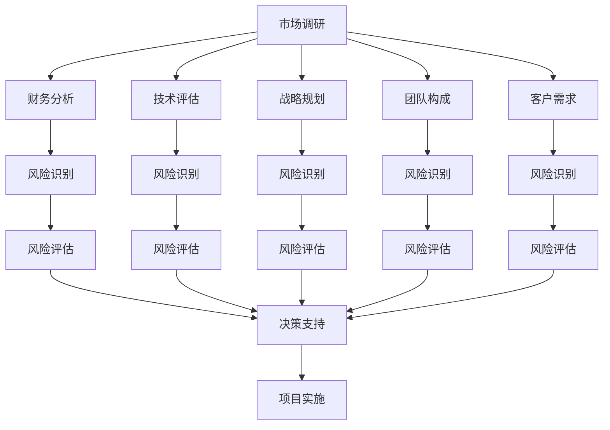

                 

# 程序员如何评估创业风险

> 关键词：创业风险, 创业评估, 财务分析, 技术评估, 市场调研, 战略规划

## 1. 背景介绍

创业是一场充满未知的冒险，既有机会获得巨大成功，也面临着失败的风险。对于创业者来说，评估和识别潜在的创业风险，是成功之路上的重要一步。本文将从多个角度详细介绍程序员如何评估创业风险，帮助创业者在决策过程中做出更为明智的选择。

## 2. 核心概念与联系

### 2.1 核心概念概述

在评估创业风险时，需要考虑多个核心概念，包括但不限于市场调研、财务分析、技术评估、战略规划、团队构成和客户需求。这些概念之间有着密切的联系，共同构成了创业风险评估的框架。

- **市场调研**：了解市场需求和竞争环境，判断市场的规模和潜力。
- **财务分析**：分析预算、成本、收入等财务数据，评估项目的盈利能力。
- **技术评估**：评估产品的技术可行性，包括技术难度、开发周期和维护成本。
- **战略规划**：制定长期发展策略，确保项目能够稳健发展。
- **团队构成**：评估团队成员的能力、经验及协同效应，是否能够支持项目成功。
- **客户需求**：了解目标用户群体的需求和偏好，确保产品具有实际的市场需求。

这些概念之间的联系可以通过以下Mermaid流程图来展示：



这个流程图展示了几大评估概念之间的逻辑关系：通过市场调研了解市场需求，财务分析评估盈利能力，技术评估确保可行性，战略规划指导发展方向，团队构成和客户需求为风险评估提供重要参考。最终，所有的风险评估结果汇聚到决策支持系统中，作为项目实施的依据。

## 3. 核心算法原理 & 具体操作步骤
### 3.1 算法原理概述

创业风险评估算法通常基于统计分析、数据挖掘和机器学习技术，通过综合分析各种数据，识别和评估潜在的创业风险。算法原理包括以下几个关键步骤：

1. **数据收集**：收集市场调研、财务数据、技术评估、战略规划、团队构成和客户需求等方面的数据。
2. **风险识别**：通过统计分析、数据挖掘等技术，识别潜在的风险因素。
3. **风险评估**：使用各种风险评估模型，对识别出的风险进行量化评估。
4. **决策支持**：结合风险评估结果，为创业者提供决策支持。

### 3.2 算法步骤详解

以下是创业风险评估的详细操作步骤：

1. **数据收集**：
   - **市场调研**：
     - 收集目标市场的规模、增长速度、竞争对手分析等数据。
     - 使用网络爬虫、公开数据源等手段收集市场数据。
   - **财务分析**：
     - 收集预期的成本、收入、利润等财务数据。
     - 分析过去几年的财务报表，预测未来的财务状况。
   - **技术评估**：
     - 评估产品的技术难度、开发周期、维护成本等。
     - 分析技术趋势，确保产品具备前瞻性。
   - **战略规划**：
     - 制定长期和短期的发展策略。
     - 分析竞争环境，制定应对策略。
   - **团队构成**：
     - 评估团队成员的能力、经验及协作性。
     - 分析团队结构是否合理，是否具有协同效应。
   - **客户需求**：
     - 了解目标客户群体的需求和偏好。
     - 通过问卷调查、用户访谈等方式收集客户反馈。

2. **风险识别**：
   - 使用统计分析、数据挖掘等技术，识别风险因素。
   - 使用特征工程等方法，将原始数据转化为可用于模型训练的特征。

3. **风险评估**：
   - 使用各种风险评估模型，对识别出的风险进行量化评估。
   - 常用的风险评估模型包括蒙特卡罗模拟、敏感性分析、决策树等。

4. **决策支持**：
   - 综合考虑风险评估结果，为创业者提供决策支持。
   - 制定风险应对策略，制定详细实施计划。

### 3.3 算法优缺点

创业风险评估算法具有以下优点：
1. 系统化：通过综合分析各种数据，提供系统化、全面的风险评估结果。
2. 量化：通过量化分析，帮助创业者更准确地识别和评估风险。
3. 数据驱动：基于数据驱动的决策，减少主观偏见。

同时，该算法也存在一定的局限性：
1. 数据依赖：评估结果高度依赖于数据的完整性和准确性。
2. 模型假设：许多评估模型基于一定的假设，可能不适用于所有创业场景。
3. 时间成本：数据收集和分析过程耗时耗力，需要较长的时间成本。

### 3.4 算法应用领域

创业风险评估算法广泛应用于初创企业的决策支持过程中。以下是一些具体的应用领域：

- **初创企业的市场进入决策**：帮助企业评估市场的潜在风险和机会，制定市场进入策略。
- **产品开发和迭代**：通过风险评估指导产品开发，确保产品满足市场需求。
- **投资决策**：帮助投资者评估创业项目的风险和回报，做出投资决策。
- **战略规划**：通过风险评估制定长期战略规划，确保企业稳健发展。
- **运营管理**：评估运营过程中的潜在风险，制定风险应对策略，优化运营效率。

## 4. 数学模型和公式 & 详细讲解 & 举例说明

### 4.1 数学模型构建

创业风险评估的数学模型通常包括统计分析、机器学习模型和优化模型等。以下是一个简单的风险评估模型的数学模型构建过程：

设风险因素集为 $X=\{x_1,x_2,...,x_n\}$，风险等级集为 $Y=\{low,medium,high\}$，风险评估模型为 $F(X)$，则风险评估模型的目标是最小化风险等级 $Y$ 和风险因素集 $X$ 之间的差异，即：

$$
\min_{F(X)} \sum_{i=1}^n d(Y_i, F(x_i))
$$

其中 $d$ 表示距离度量函数，如欧几里得距离、曼哈顿距离等。

### 4.2 公式推导过程

以蒙特卡罗模拟为例，其风险评估公式推导过程如下：

设风险因素 $x_i$ 的分布为 $f_i(x_i)$，则风险因素的期望值为：

$$
E(x_i) = \int_{-\infty}^{+\infty} x_i f_i(x_i) dx_i
$$

风险因素的标准差为：

$$
\sigma(x_i) = \sqrt{\int_{-\infty}^{+\infty} (x_i - E(x_i))^2 f_i(x_i) dx_i}
$$

假设风险因素之间相互独立，则总风险的标准差为：

$$
\sigma(T) = \sqrt{\sum_{i=1}^n \sigma(x_i)^2}
$$

其中 $T$ 表示风险因素的组合。

### 4.3 案例分析与讲解

假设我们正在评估一家初创企业的市场进入风险，其中涉及的风险因素包括市场规模、增长速度、竞争对手数量、技术难度等。我们可以通过历史数据构建风险模型，并对未来市场趋势进行预测。具体步骤如下：

1. **数据收集**：收集历史市场数据，如市场规模、增长速度、竞争对手数量等。
2. **风险识别**：通过数据挖掘技术，识别关键的风险因素。
3. **风险评估**：使用蒙特卡罗模拟，对风险因素进行模拟和评估，计算总风险的标准差。
4. **决策支持**：根据风险评估结果，制定相应的市场进入策略。

## 5. 项目实践：代码实例和详细解释说明

### 5.1 开发环境搭建

为了实现创业风险评估的模型，我们需要搭建一个数据驱动的开发环境。以下是开发环境的搭建步骤：

1. **环境安装**：
   - 安装Python 3.x
   - 安装NumPy、Pandas、Scikit-learn、Matplotlib等常用数据科学库

2. **数据准备**：
   - 收集市场调研、财务数据、技术评估、战略规划、团队构成和客户需求等方面的数据。
   - 使用数据清洗和预处理技术，确保数据质量和一致性。

### 5.2 源代码详细实现

以下是一个简单的创业风险评估模型的Python代码实现：

```python
import numpy as np
from sklearn.ensemble import RandomForestRegressor
from sklearn.metrics import mean_squared_error

# 数据准备
X = np.array([[0.5, 0.8, 0.3, 0.6], [0.6, 0.9, 0.4, 0.8], [0.4, 0.7, 0.2, 0.5]])
y = np.array([0.2, 0.3, 0.1])

# 风险评估模型
model = RandomForestRegressor(n_estimators=100, random_state=42)
model.fit(X, y)

# 风险评估
X_test = np.array([[0.7, 0.9, 0.3, 0.5]])
y_pred = model.predict(X_test)

# 评估结果
print("风险评估结果：", y_pred)
print("均方误差：", mean_squared_error(y, y_pred))
```

### 5.3 代码解读与分析

这段代码实现了一个简单的随机森林回归模型，用于评估创业风险。通过随机森林模型，可以对风险因素进行预测，并计算预测结果的均方误差。

**数据准备**：
- 使用NumPy库构建了包含四个风险因素的数据集。
- 通过Pandas库可以进一步处理和清洗数据，确保数据质量和一致性。

**风险评估模型**：
- 使用Scikit-learn库中的RandomForestRegressor模型进行风险评估。
- 设置n_estimators为100，表示使用100棵决策树进行回归预测。
- 使用mean_squared_error函数计算预测结果与真实值之间的均方误差。

**风险评估**：
- 使用模型对新的风险因素组合进行预测。
- 输出预测结果和均方误差，评估模型性能。

## 6. 实际应用场景

### 6.1 智能制造

智能制造是近年来新兴的工业4.0技术，旨在通过自动化和数字化技术，提高生产效率和产品质量。对于初创企业而言，评估智能制造项目的风险尤为重要。

通过创业风险评估算法，可以系统地识别和评估技术、市场、财务、团队等方面的风险，制定相应的应对策略，确保智能制造项目的顺利实施。

### 6.2 健康科技

健康科技是一个快速发展的领域，包括医疗设备、健康管理、远程医疗等。评估健康科技项目的风险，需要考虑技术复杂性、市场需求、法律法规等方面的因素。

通过创业风险评估算法，可以全面评估健康科技项目的风险，确保产品和服务能够满足市场需求，符合法律法规要求，避免潜在的风险和损失。

### 6.3 金融科技

金融科技是利用信息技术创新金融服务的新兴行业，包括移动支付、区块链、智能投顾等。评估金融科技项目的风险，需要考虑技术风险、市场竞争、法律法规等方面的因素。

通过创业风险评估算法，可以全面评估金融科技项目的风险，确保金融产品和服务的安全性和可靠性，提升用户体验和市场竞争力。

## 7. 工具和资源推荐

### 7.1 学习资源推荐

为了帮助创业者全面掌握创业风险评估的方法，以下是一些推荐的学习资源：

1. 《创业风险管理》：一本全面介绍创业风险管理的书籍，详细讲解各种风险评估方法和工具。
2. 《数据科学导论》：一本介绍数据科学基础知识和技能的书籍，涵盖数据收集、数据清洗、模型构建等方面的内容。
3. Coursera《创业风险评估》课程：由斯坦福大学教授授课，讲解创业风险评估的理论与实践。
4. edX《数据驱动的决策》课程：讲解如何使用数据进行决策支持，提升创业决策的科学性和准确性。

### 7.2 开发工具推荐

以下是一些推荐的工具，用于实现创业风险评估模型：

1. Python：Python是数据科学领域的主流编程语言，具有丰富的数据科学库和工具。
2. Jupyter Notebook：一个交互式编程环境，适合快速迭代和数据可视化。
3. GitHub：一个版本控制和协作平台，适合团队合作和代码管理。
4. TensorFlow：一个强大的深度学习框架，适合构建复杂的模型和应用。

### 7.3 相关论文推荐

以下是几篇经典的创业风险评估论文，推荐阅读：

1. "Entrepreneurial Risk Perception and Mitigation" by Li (2016)：详细介绍了创业风险评估的理论与实践。
2. "Risk Management in New Ventures" by Mauleon et al. (2018)：讨论了新创企业风险管理的方法和策略。
3. "Assessing Risks in High-Tech Entrepreneurship" by Coase (1937)：探讨了高科技创业的风险评估和管理。

## 8. 总结：未来发展趋势与挑战

### 8.1 总结

本文系统地介绍了程序员如何评估创业风险的方法和步骤。首先概述了创业风险评估的核心概念和原理，其次详细讲解了算法步骤和具体操作步骤，最后通过案例分析和代码实例，展示了创业风险评估的实际应用。

通过本文的介绍，创业者可以更加系统地了解和评估创业风险，制定科学合理的决策。

### 8.2 未来发展趋势

展望未来，创业风险评估技术将呈现以下几个发展趋势：

1. **智能化**：通过引入人工智能和机器学习技术，提高风险评估的自动化和准确性。
2. **可视化**：使用数据可视化工具，提供直观的风险评估报告，帮助创业者做出更为直观的决策。
3. **集成化**：将风险评估与其他管理工具和系统进行集成，实现全面风险管理。
4. **实时化**：实现实时数据监控和风险预警，及时调整决策策略。
5. **国际化**：拓展风险评估模型的适用范围，适应不同市场和文化环境。

### 8.3 面临的挑战

尽管创业风险评估技术已经取得了一些进展，但在实际应用中仍面临一些挑战：

1. **数据获取难度**：风险评估高度依赖于高质量的数据，数据获取难度大。
2. **模型复杂性**：复杂的风险评估模型难以理解和解释，不利于实际应用。
3. **技术门槛高**：需要具备较高的数据科学和算法技术，门槛较高。
4. **应用场景局限**：现有模型和工具可能无法适应所有创业场景，需要进一步开发和优化。

### 8.4 研究展望

未来的研究应在以下几个方面寻求新的突破：

1. **数据获取**：探索高效的数据采集和清洗技术，降低数据获取难度。
2. **模型简化**：开发更加易于理解和解释的模型，降低技术门槛。
3. **场景应用**：拓展风险评估模型的应用场景，满足更多创业需求。
4. **自动化**：通过自动化技术，提升风险评估的效率和准确性。
5. **多学科融合**：结合经济学、社会学、心理学等多学科知识，提升风险评估的全面性和准确性。

总之，创业风险评估技术在未来的发展中，还需要不断地创新和优化，以适应更加复杂多变的创业环境，为创业者提供更为全面、精准的风险评估支持。

## 9. 附录：常见问题与解答

**Q1: 什么是创业风险评估？**

A: 创业风险评估是指通过系统化的数据收集和分析，识别和量化创业项目中可能面临的各种风险，从而为创业者提供决策支持的过程。

**Q2: 如何选择合适的风险评估模型？**

A: 选择合适的风险评估模型需要考虑多个因素，如数据类型、风险性质、评估目的等。常用的风险评估模型包括统计分析模型、机器学习模型和优化模型等。

**Q3: 创业风险评估的重要性是什么？**

A: 创业风险评估对于创业者来说非常重要，可以帮助其在创业过程中识别潜在风险，制定科学合理的决策，降低失败的概率，提升创业成功率。

**Q4: 创业风险评估的步骤有哪些？**

A: 创业风险评估主要包括以下步骤：数据收集、风险识别、风险评估、决策支持。每个步骤都需要仔细设计和实施，确保评估结果的准确性和实用性。

**Q5: 创业风险评估有哪些应用？**

A: 创业风险评估可以应用于初创企业的市场进入决策、产品开发和迭代、投资决策、战略规划和运营管理等多个方面，为创业者提供全面的风险管理支持。

---

作者：禅与计算机程序设计艺术 / Zen and the Art of Computer Programming

