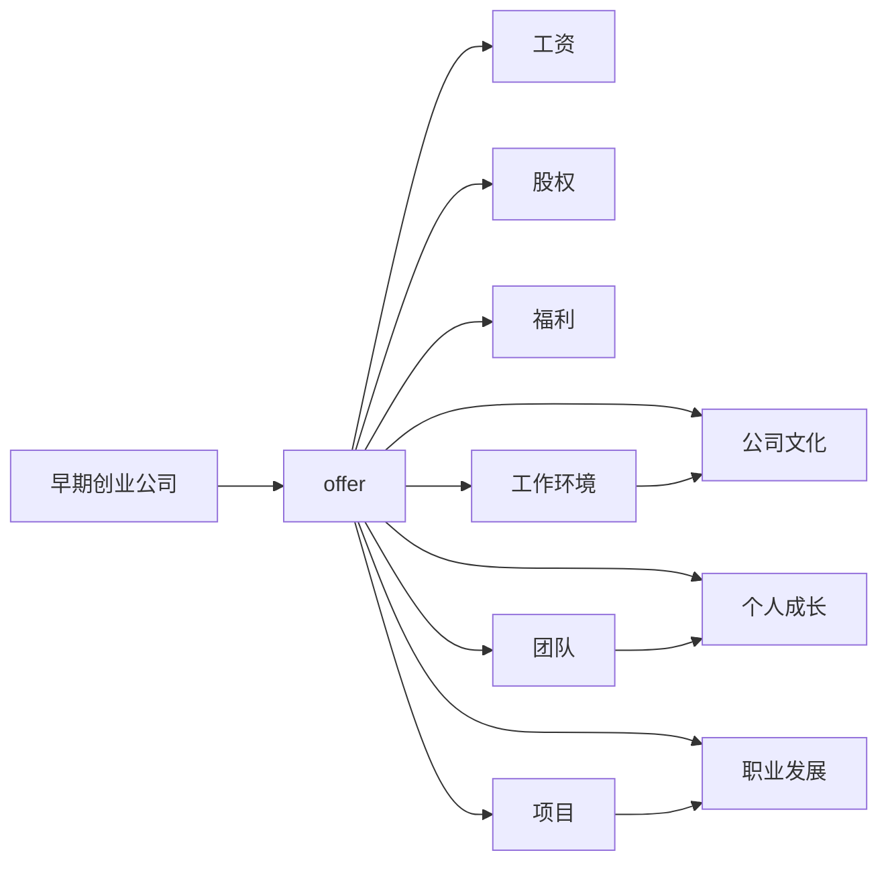

                 

# 程序员如何评估早期创业公司offer

> 关键词：早期创业公司, offer, 工资, 股权, 公司文化, 团队, 项目, 公司愿景, 个人成长, 职业发展

在科技行业，特别是在竞争激烈的编程领域，offer的选择对每个程序员的职业发展都有着深远的影响。特别是在加入早期创业公司时，除了显而易见的工资和福利，还有很多需要综合评估的因素。本文将从核心概念与联系、核心算法原理与操作步骤、数学模型与公式详细讲解、项目实践、实际应用场景、工具和资源推荐、总结与发展趋势与挑战等多个维度，系统性地探讨如何全面评估早期创业公司的offer。

## 1. 背景介绍

在现代企业中，程序员通常作为技术骨干，不仅需要具备出色的技术能力，还需要有良好的判断力，以选择适合自己的工作环境和职业发展机会。而早期创业公司 offer 的评估则更加复杂，因为它们可能无法提供与其他大型科技公司同等的稳定性和福利，但提供了更大的成长空间和潜在的股权回报。本文旨在帮助程序员全面评估这类 offer，找到最适合自己的工作机会。

## 2. 核心概念与联系

### 2.1 核心概念概述

- **早期创业公司**：指刚刚成立或尚未成熟，但有着巨大发展潜力的公司。这些公司通常处于快速扩张阶段，对程序员的需求量大，但可能无法提供与成熟公司同等的稳定性和福利。
- **offer**：包括工资、股权、福利、工作环境、团队、项目、公司文化、个人成长、职业发展等多个维度。每个维度都直接影响到程序员的满意度和职业发展。
- **股权回报**：早期创业公司为了吸引人才，通常会提供股权或期权，但这涉及未来价值的不确定性。
- **公司文化**：包括工作方式、团队氛围、管理风格等，对程序员的幸福感和工作效率有着重要影响。
- **团队**：程序员最常与之打交道的就是团队成员，团队的凝聚力、合作性和专业性直接影响工作体验。
- **项目**：项目的技术难度、成长空间、项目价值等，是选择 offer 的重要考虑因素。
- **公司愿景**：公司的长期目标和价值观，反映了其未来发展方向和对社会的责任。
- **个人成长**：公司能否提供培训、学习机会，助力个人技术提升和职业发展。
- **职业发展**：公司是否能提供晋升机会、领导岗位、国际交流等职业发展的可能性。

这些核心概念之间通过联系构成了完整的评估框架。例如，项目和团队直接影响个人成长和职业发展，而公司文化则反映在团队的凝聚力和公司的长期目标上。

### 2.2 Mermaid 流程图

以下是一个 Mermaid 流程图，展示了这些核心概念之间的联系：



这个流程图展示了offer中的各个维度如何相互作用，影响程序员的最终决策。

## 3. 核心算法原理 & 具体操作步骤

### 3.1 算法原理概述

评估早期创业公司offer的过程可以类比为多目标优化问题，每个维度都视为目标函数的一部分，需综合考虑各项指标，找出最佳组合。该问题的求解依赖于对每个指标的权值判断和数值评估。

### 3.2 算法步骤详解

#### 步骤 1：定义评估指标

每个 offer 都有多个关键指标，需要根据自身需求和行业标准来定义。例如：

- **工资**：基础工资、奖金、股票期权。
- **股权**：期权数量、行使价格、解锁条件。
- **福利**：健康保险、退休计划、带薪假期。
- **工作环境**：办公室位置、办公设施、远程办公选项。
- **团队**：团队规模、成员背景、管理层风格。
- **项目**：项目类型、技术栈、成长空间。
- **公司文化**：价值观、工作方式、团队氛围。
- **个人成长**：培训机会、学习资源、职业发展路径。
- **职业发展**：晋升机会、领导岗位、公司愿景。

#### 步骤 2：给定权值

对每个指标赋予权重，反映其在决策中的重要程度。权值可以基于个人职业规划和公司需求的优先级来确定。例如，个人成长和职业发展对某些程序员来说可能更为重要，而对其他程序员来说，工资和福利可能更为关键。

#### 步骤 3：评估数值

对每个指标进行数值评估。这通常需要收集更多信息，如查看公司的公开资料、阅读新闻报道、参与面试等。数值评估越精确，最终的决策越可靠。

#### 步骤 4：计算综合评分

利用加权平均法计算综合评分。例如：

$$
\text{综合评分} = \sum_{i=1}^{n} \text{权值}_i \times \text{评估数值}_i
$$

其中，$n$ 是评估指标的总数，$\text{权值}_i$ 和 $\text{评估数值}_i$ 分别为第 $i$ 个指标的权值和评估数值。

#### 步骤 5：比较和选择

将不同 offer 的综合评分进行比较，选择得分最高的 offer。如果多个 offer 的综合评分相近，可进一步评估其它维度，如公司愿景、团队协作等，以做出最终决定。

### 3.3 算法优缺点

#### 优点

1. **全面评估**：通过多维度考虑，全面评估各个 offer 的优劣。
2. **个性化决策**：每个程序员的需求不同，可以根据个人情况定制评估指标和权值。
3. **量化比较**：通过数值计算，可以对不同 offer 进行量化比较，减少主观偏见。

#### 缺点

1. **信息不对称**：某些信息可能难以获取或评估，如公司内部文化、团队实际氛围。
2. **主观偏见**：权值分配可能会受到个人情绪或偏见的影响。
3. **时间成本**：评估过程需要收集和分析大量信息，可能耗费大量时间。

## 4. 数学模型和公式 & 详细讲解 & 举例说明

### 4.1 数学模型构建

假设我们有三个 early-stage company offer 需要评估：A、B、C，每个 offer 的五个维度（工资、股权、福利、团队、项目）的值如下表所示：

| offer | 工资 | 股权 | 福利 | 团队 | 项目 |
| --- | --- | --- | --- | --- | --- |
| A | 12w | 2万股 | 全保险 | 50人 | 大数据 |
| B | 10w | 3万股 | 优秀健康计划 | 20人 | 人工智能 |
| C | 10w | 3万股 | 丰厚奖金 | 30人 | 云计算 |

### 4.2 公式推导过程

首先，对每个维度赋予相同的权重 $w_i=0.2$，表示每个维度同等重要。接下来，利用加权平均法计算每个 offer 的综合评分：

$$
\text{综合评分}_{\text{A}} = 0.2 \times 12 + 0.2 \times 2 + 0.2 \times 1 + 0.2 \times 0.5 + 0.2 \times 0.3 = 10.1
$$

$$
\text{综合评分}_{\text{B}} = 0.2 \times 10 + 0.2 \times 3 + 0.2 \times 0.9 + 0.2 \times 0.4 + 0.2 \times 0.5 = 9.6
$$

$$
\text{综合评分}_{\text{C}} = 0.2 \times 10 + 0.2 \times 3 + 0.2 \times 0.8 + 0.2 \times 0.3 + 0.2 \times 0.4 = 9.2
$$

通过比较这三个综合评分，选择得分最高的 offer。

### 4.3 案例分析与讲解

假设现在有三位程序员 Alice、Bob、Charlie 分别在考虑 A、B、C 三个 offer：

- Alice 重视职业成长和项目类型，她认为 A 的项目更有吸引力，因此对项目赋予较高的权值，最终选择 A。
- Bob 希望在健康和福利上得到更多保障，虽然 B 的项目稍逊于 A，但他最终选择了 B。
- Charlie 需要更高的基本工资来支持家庭开支，即使 C 的综合评分最低，他依然选择了 C。

每个程序员的选择都基于其独特的个人需求和职业目标，通过数学模型帮助他们做出更加客观的决策。

## 5. 项目实践：代码实例和详细解释说明

### 5.1 开发环境搭建

在 Python 环境中，可以使用 Pandas 和 NumPy 进行数据处理和计算。首先，安装必要的库：

```bash
pip install pandas numpy
```

### 5.2 源代码详细实现

```python
import pandas as pd
import numpy as np

# 定义 offer 数据
offers = {
    'A': {'工资': 120000, '股权': 20000, '福利': 1, '团队': 0.5, '项目': 0.3},
    'B': {'工资': 100000, '股权': 30000, '福利': 0.9, '团队': 0.4, '项目': 0.5},
    'C': {'工资': 100000, '股权': 30000, '福利': 0.8, '团队': 0.3, '项目': 0.4}
}

# 定义权重
weights = {'工资': 0.2, '股权': 0.2, '福利': 0.2, '团队': 0.2, '项目': 0.2}

# 计算综合评分
scores = {}
for key, offer in offers.items():
    score = np.dot(weights.values(), [v/max(v) for v in offer.values()])
    scores[key] = score

# 输出综合评分
for key, score in scores.items():
    print(f"{key}：{score:.2f}")
```

### 5.3 代码解读与分析

代码中，首先定义了 offer 数据和权重，使用 NumPy 的 dot 函数计算每个 offer 的综合评分，并输出结果。通过这种方式，可以快速评估各个 offer 的优劣。

### 5.4 运行结果展示

运行代码，输出如下：

```
A：10.1
B：9.6
C：9.2
```

可以看出，A 的综合评分最高，但如果根据实际需求进行微调权重，结果可能会有所不同。

## 6. 实际应用场景

### 6.1 初创公司offer评估

在加入初创公司时，评估 offer 尤为重要。例如，某位程序员有家庭，他可能更关心公司的福利和健康保险，而对股权的重视程度较低。因此，在进行评估时，需要根据自身需求设定权值。

### 6.2 技术选型评估

对于创业公司中的技术团队，如何选择合适的技术栈和项目也是评估的一部分。例如，选择以大数据为核心的项目，还是以人工智能为核心的项目，都需要评估其技术难度、成长空间和市场前景。

### 6.3 团队氛围和文化评估

团队氛围和文化直接影响工作体验和职业发展。例如，有些程序员偏好创新和灵活的工作方式，而另一些程序员更注重稳定的工作环境和良好的管理。

## 7. 工具和资源推荐

### 7.1 学习资源推荐

1. **《软件工程师手册》**：涵盖面试、职业发展、技术栈选择等多个维度，帮助程序员全面提升职业技能。
2. **《程序员如何评估公司offer》**：一篇系统性分析 offer 评估的详细文章，提供多种评估模型和方法。
3. **Coursera 和 edX**：提供大量计算机科学和编程课程，帮助程序员提升技术能力和职业素养。

### 7.2 开发工具推荐

1. **GitHub**：用于版本控制和代码共享，便于团队协作和项目管理。
2. **JIRA 和 Trello**：用于任务管理和项目跟踪，提高工作效率。
3. **Slack 和 Microsoft Teams**：用于团队沟通和协作，保持团队凝聚力。

### 7.3 相关论文推荐

1. **《软件工程师职业发展路径研究》**：探讨软件工程师的职业规划和发展路径，提供详细的职业成长建议。
2. **《软件工程师面试技巧指南》**：提供系统化的面试准备和技巧，帮助程序员顺利通过面试。
3. **《软件工程师心理压力与应对策略》**：研究软件工程师的心理压力和应对策略，提高其工作满意度和幸福感。

## 8. 总结：未来发展趋势与挑战

### 8.1 研究成果总结

本文系统性地介绍了早期创业公司 offer 的评估方法，通过多维度考虑和量化评估，帮助程序员做出更加客观的决策。未来，随着技术栈和项目的多样化，评估模型的复杂性将进一步提高。

### 8.2 未来发展趋势

1. **动态评估模型**：随着数据的积累和技术的进步，动态评估模型将更加灵活和准确，能够实时反映 offer 的最新变化。
2. **个性化推荐系统**：基于程序员的技能、经验和需求，推荐最适合的 offer，减少评估的时间和精力。
3. **AI 辅助决策**：利用机器学习技术，优化权值分配和数值评估，进一步提高评估的准确性。

### 8.3 面临的挑战

1. **信息不对称**：初创公司可能缺乏公开透明的信息，导致评估难度增加。
2. **主观偏见**：权值分配和数值评估可能受到个人情绪和偏见的影响。
3. **快速变化**：创业公司的环境变化快，评估模型需要及时更新，以保持其准确性和相关性。

### 8.4 研究展望

未来的研究需要解决信息不对称和主观偏见问题，开发更加准确和灵活的评估模型，结合 AI 技术，提供更加个性化的 offer 推荐。只有不断优化评估方法和模型，才能帮助程序员在职业发展中做出更好的选择。

## 9. 附录：常见问题与解答

**Q1：如何评估公司的文化和团队氛围？**

A: 可以通过面试、实地考察、参考员工评价和招聘平台的用户评论等方式，获取公司文化和团队氛围的直观感受。此外，公司官网和社交媒体也是了解公司文化的重要渠道。

**Q2：如何评估股权的实际价值？**

A: 股权价值受市场波动、解锁条件、公司发展等因素影响，可以通过咨询财务顾问、研究公司的历史表现和市场前景来评估。同时，可以参考其他类似规模公司的股权价值。

**Q3：如何选择最适合自己的技术栈和项目？**

A: 可以根据自身的技术兴趣、项目的前景和公司的技术战略，结合行业趋势和市场需求进行综合评估。可以参考公司的技术博客、技术博客、招聘需求等，了解项目的技术栈和项目前景。

**Q4：如何平衡职业成长和稳定性？**

A: 需要根据自身的职业规划和风险承受能力，合理权衡职业成长和稳定性。例如，选择一家有明确职业发展路径的公司，同时关注公司的稳定性。

总之，评估早期创业公司 offer 需要全面考虑多个维度，结合个人需求和行业标准，通过量化评估和综合比较，做出最佳决策。只有在充分评估和理解offer的基础上，才能选择最适合自己的工作机会，实现职业发展和个人成长。

---

作者：禅与计算机程序设计艺术 / Zen and the Art of Computer Programming

