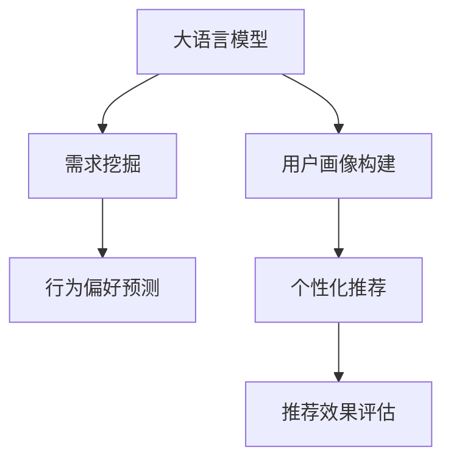
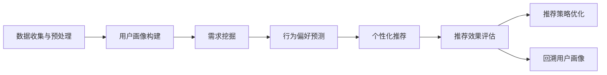

                 

# AI 大模型在电商搜索推荐中的用户画像构建：深度挖掘用户需求与行为偏好

> 关键词：大语言模型、电商搜索推荐、用户画像、需求挖掘、行为偏好、深度学习、自然语言处理

## 1. 背景介绍

### 1.1 问题由来

在当今电子商务时代，用户需求的多样性和复杂性不断增长，电商平台如何精准、高效地为用户推荐产品，以提升用户体验和平台销售额，成为了一个重大挑战。传统的推荐系统往往依赖于用户历史行为数据，但数据获取难度大，且存在冷启动和数据稀疏等问题。近年来，随着大语言模型（Large Language Model, LLM）的崛起，其在用户画像构建、需求挖掘和行为偏好预测方面的潜力逐渐显现，引起了学术界和工业界的广泛关注。

大语言模型，如BERT、GPT等，通过在海量文本数据上进行自监督学习，获得了强大的语言理解和生成能力。在电商搜索推荐场景中，大模型可以被用于挖掘用户语义需求、生成个性化推荐描述，甚至自动生成问题引导用户进行更详细的搜索和反馈。然而，如何在大模型中实现高效的电商搜索推荐，仍是一个复杂且极具挑战的问题。本文旨在通过深度挖掘大模型在电商搜索推荐中的应用，探索如何构建精准的用户画像，准确理解用户需求与行为偏好，提供个性化的购物体验。

### 1.2 问题核心关键点

当前大语言模型在电商搜索推荐中的应用，主要集中在以下两个方面：

- 用户画像构建：利用大模型的语言处理能力，从用户的搜索历史、评论、反馈等多维数据中，提取用户的兴趣偏好、消费习惯等信息，构建详尽的用户画像。
- 需求与行为预测：通过大模型的文本生成能力，预测用户可能感兴趣的产品、推荐策略，以及行为变化趋势，以实现更精准的个性化推荐。

在电商搜索推荐中，大模型通过用户画像的构建，能够更全面、深入地理解用户需求，通过需求与行为的预测，能够提供更具针对性的产品推荐，从而大幅提升用户体验和平台销售额。本文将系统地介绍大语言模型在电商搜索推荐中的应用，并给出详细的算法原理和具体操作步骤。

## 2. 核心概念与联系

### 2.1 核心概念概述

为更好地理解大语言模型在电商搜索推荐中的应用，本文首先介绍几个核心概念：

- 大语言模型（LLMs）：如BERT、GPT等，通过在大规模无标签文本数据上进行预训练，获得强大的语言理解和生成能力。
- 用户画像（User Profile）：用户画像是一个详尽的用户描述，包含用户的兴趣偏好、消费习惯、行为特征等，用于个性化推荐和服务。
- 需求挖掘（Demand Mining）：通过用户行为数据挖掘用户需求，揭示用户的潜在兴趣和偏好，指导个性化推荐。
- 行为偏好预测（Behavior Prediction）：预测用户的行为趋势和偏好变化，如购买意向、浏览行为等，提升推荐策略的准确性。
- 自然语言处理（NLP）：涉及文本数据的处理、理解与生成，是大语言模型的核心技术之一。
- 深度学习（Deep Learning）：深度神经网络在图像、语音、文本等复杂数据上的应用，是大模型训练的基础。

这些核心概念之间的逻辑关系可以通过以下Mermaid流程图来展示：



### 2.2 核心概念原理和架构的 Mermaid 流程图

此部分将详细展示大语言模型在电商搜索推荐中的应用流程，涉及的主要节点包括：

1. **数据收集与预处理**：从电商平台获取用户搜索、浏览、评价等数据，进行清洗和预处理。
2. **用户画像构建**：利用大模型分析用户数据，构建用户画像，用于个性化推荐。
3. **需求挖掘**：通过文本挖掘技术，从用户评论、搜索关键词中挖掘用户需求。
4. **行为偏好预测**：利用大模型预测用户的行为趋势和偏好变化，提升推荐策略的精准度。
5. **个性化推荐**：根据用户画像和行为预测结果，生成个性化推荐内容，并推送给用户。
6. **推荐效果评估**：通过A/B测试等方法，评估推荐策略的效果，不断优化。

此图展示了大语言模型在电商搜索推荐中的核心流程和关键节点，强调了数据处理、模型构建、个性化推荐和效果评估的有机结合。



## 3. 核心算法原理 & 具体操作步骤

### 3.1 算法原理概述

大语言模型在电商搜索推荐中的应用，主要基于以下几个关键步骤：

1. **数据收集与预处理**：收集用户搜索、浏览、评价等数据，清洗和预处理数据，确保数据质量和一致性。
2. **用户画像构建**：利用大语言模型分析用户数据，提取用户兴趣偏好、消费习惯等信息，构建详尽的用户画像。
3. **需求挖掘**：通过文本挖掘技术，从用户评论、搜索关键词中挖掘用户需求，揭示用户的潜在兴趣和偏好。
4. **行为偏好预测**：利用大模型预测用户的行为趋势和偏好变化，提升推荐策略的精准度。
5. **个性化推荐**：根据用户画像和行为预测结果，生成个性化推荐内容，并推送给用户。
6. **推荐效果评估**：通过A/B测试等方法，评估推荐策略的效果，不断优化推荐模型。

### 3.2 算法步骤详解

#### 3.2.1 数据收集与预处理

1. **数据源收集**：从电商平台获取用户的搜索、浏览、评价等行为数据，包括用户的浏览历史、点击记录、评价、评分等。
2. **数据清洗**：去除异常值和噪声数据，处理缺失值，标准化数据格式。
3. **数据划分**：将数据划分为训练集、验证集和测试集，用于模型训练、调优和评估。

#### 3.2.2 用户画像构建

1. **特征提取**：从用户行为数据中提取关键特征，如浏览时间、浏览频率、评价内容、评分等。
2. **文本分析**：利用大语言模型分析用户文本数据，提取用户兴趣偏好、消费习惯等信息，构建详尽的用户画像。
3. **画像合并**：将用户画像与用户历史行为数据合并，形成更加全面的用户描述。

#### 3.2.3 需求挖掘

1. **文本预处理**：对用户评论、搜索关键词等文本数据进行清洗和预处理，去除停用词和噪声。
2. **情感分析**：利用大语言模型分析文本情感，挖掘用户对产品或品牌的情感倾向。
3. **主题建模**：通过主题模型（如LDA）分析文本主题，揭示用户的潜在需求和兴趣。
4. **需求挖掘**：结合情感分析和主题建模结果，挖掘用户需求，揭示用户的潜在兴趣和偏好。

#### 3.2.4 行为偏好预测

1. **行为序列建模**：利用时序模型（如RNN、LSTM）分析用户行为序列，预测用户行为变化趋势。
2. **用户行为预测**：结合用户画像和行为序列预测结果，预测用户的行为倾向和购买意向。
3. **偏好变化预测**：利用大语言模型预测用户的偏好变化，如从喜欢低价产品转向喜欢高性价比产品。

#### 3.2.5 个性化推荐

1. **推荐策略设计**：根据用户画像和行为预测结果，设计个性化的推荐策略。
2. **推荐内容生成**：利用大语言模型生成推荐描述、标题等内容，提升推荐体验。
3. **推荐内容推送**：将个性化推荐内容推送给用户，展示在搜索结果或首页推荐位。

#### 3.2.6 推荐效果评估

1. **评估指标**：设计评估指标，如点击率、转化率、用户满意度等，评估推荐策略的效果。
2. **A/B测试**：通过A/B测试等方法，对比不同推荐策略的效果，选择最优策略。
3. **策略优化**：根据评估结果，优化推荐策略，提升推荐效果。

### 3.3 算法优缺点

#### 3.3.1 优点

1. **深度理解用户需求**：大语言模型通过自然语言处理技术，能够深度挖掘用户需求，揭示用户的潜在兴趣和偏好。
2. **精准推荐**：利用大语言模型的预测能力，能够准确预测用户行为趋势和偏好变化，提升推荐策略的精准度。
3. **动态更新**：大语言模型能够动态更新用户画像和行为预测结果，实现实时推荐。
4. **可解释性强**：大语言模型生成的推荐内容具有较强的可解释性，能够向用户解释推荐逻辑和依据。

#### 3.3.2 缺点

1. **数据需求大**：构建精准的用户画像和行为预测，需要大量的用户行为数据，数据获取难度较大。
2. **模型复杂度高**：大语言模型复杂度高，训练和推理耗时较长，对硬件资源要求高。
3. **可解释性不足**：大语言模型生成的推荐结果往往缺乏可解释性，难以理解其内部工作机制和决策逻辑。
4. **偏见与歧视**：大语言模型可能学习到数据中的偏见和歧视，影响推荐策略的公平性和安全性。

### 3.4 算法应用领域

大语言模型在电商搜索推荐中的应用，主要涵盖以下几个领域：

1. **个性化推荐**：利用大语言模型构建用户画像，预测用户需求，生成个性化推荐内容，提升用户体验。
2. **用户画像构建**：通过分析用户行为数据，构建详尽的用户画像，实现精准推荐。
3. **需求挖掘与分析**：利用文本挖掘技术，从用户评论、搜索关键词中挖掘用户需求，揭示用户的潜在兴趣和偏好。
4. **行为预测与分析**：利用大模型预测用户行为趋势和偏好变化，提升推荐策略的精准度。
5. **推荐策略优化**：通过A/B测试等方法，评估推荐策略的效果，不断优化推荐模型。

## 4. 数学模型和公式 & 详细讲解 & 举例说明

### 4.1 数学模型构建

大语言模型在电商搜索推荐中的应用，涉及以下几个数学模型：

1. **用户画像构建模型**：
   - 假设用户画像为 $U=\{u_i\}$，其中 $u_i$ 为第 $i$ 个用户特征，可以表示为：
   $$
   u_i = (b_i, c_i, p_i, h_i)
   $$
   其中 $b_i$ 为浏览行为，$c_i$ 为点击行为，$p_i$ 为评价内容，$h_i$ 为用户历史行为数据。

2. **需求挖掘模型**：
   - 假设用户需求为 $D=\{d_j\}$，其中 $d_j$ 为第 $j$ 个用户需求，可以表示为：
   $$
   d_j = (t_j, s_j)
   $$
   其中 $t_j$ 为用户评论文本，$s_j$ 为评论情感得分。

3. **行为偏好预测模型**：
   - 假设用户行为预测结果为 $P=\{p_k\}$，其中 $p_k$ 为第 $k$ 个用户行为预测结果，可以表示为：
   $$
   p_k = (s_k, r_k, l_k)
   $$
   其中 $s_k$ 为用户行为序列，$r_k$ 为行为预测结果，$l_k$ 为行为预测的置信度。

4. **个性化推荐模型**：
   - 假设推荐内容为 $R=\{r_m\}$，其中 $r_m$ 为第 $m$ 个推荐内容，可以表示为：
   $$
   r_m = (t_m, c_m)
   $$
   其中 $t_m$ 为推荐标题，$c_m$ 为推荐描述。

### 4.2 公式推导过程

#### 4.2.1 用户画像构建

假设用户画像由 $n$ 个特征组成，每个特征 $u_i$ 的权重为 $w_i$，则用户画像的表示为：
$$
U = \sum_{i=1}^{n} w_i u_i
$$

#### 4.2.2 需求挖掘

假设用户需求由 $m$ 个需求组成，每个需求 $d_j$ 的权重为 $w_j$，则用户需求的表示为：
$$
D = \sum_{j=1}^{m} w_j d_j
$$

#### 4.2.3 行为偏好预测

假设用户行为预测结果由 $t$ 个预测组成，每个预测 $p_k$ 的权重为 $w_k$，则用户行为预测的表示为：
$$
P = \sum_{k=1}^{t} w_k p_k
$$

#### 4.2.4 个性化推荐

假设推荐内容由 $o$ 个推荐组成，每个推荐 $r_m$ 的权重为 $w_m$，则个性化推荐的表示为：
$$
R = \sum_{m=1}^{o} w_m r_m
$$

### 4.3 案例分析与讲解

假设某电商平台希望通过大语言模型构建用户画像，预测用户行为，生成个性化推荐内容。

1. **用户画像构建**：
   - 收集用户的浏览、点击、评价等数据，利用大语言模型提取用户兴趣偏好、消费习惯等信息，构建详尽的用户画像。
   - 使用逻辑回归等分类模型，训练用户画像模型，预测用户是否具有某类行为特征。

2. **需求挖掘**：
   - 分析用户评论、搜索关键词等文本数据，利用情感分析和主题建模技术，挖掘用户需求。
   - 结合情感分析结果和主题建模结果，揭示用户的潜在兴趣和偏好。

3. **行为偏好预测**：
   - 利用LSTM等时序模型，分析用户行为序列，预测用户行为趋势。
   - 结合用户画像和行为预测结果，预测用户的行为倾向和购买意向。

4. **个性化推荐**：
   - 根据用户画像和行为预测结果，设计个性化的推荐策略。
   - 利用大语言模型生成推荐描述、标题等内容，提升推荐体验。
   - 将个性化推荐内容推送给用户，展示在搜索结果或首页推荐位。

## 5. 项目实践：代码实例和详细解释说明

### 5.1 开发环境搭建

在进行项目实践前，我们需要准备好开发环境。以下是使用Python进行TensorFlow开发的环境配置流程：

1. 安装Anaconda：从官网下载并安装Anaconda，用于创建独立的Python环境。

2. 创建并激活虚拟环境：
```bash
conda create -n tf-env python=3.8 
conda activate tf-env
```

3. 安装TensorFlow：根据CUDA版本，从官网获取对应的安装命令。例如：
```bash
conda install tensorflow -c pytorch -c conda-forge
```

4. 安装其他依赖工具：
```bash
pip install numpy pandas scikit-learn matplotlib tqdm jupyter notebook ipython
```

完成上述步骤后，即可在`tf-env`环境中开始项目实践。

### 5.2 源代码详细实现

下面我们以用户画像构建为例，给出使用TensorFlow对大语言模型进行电商搜索推荐开发的PyTorch代码实现。

首先，定义用户画像的数据处理函数：

```python
from tensorflow.keras.preprocessing.text import Tokenizer
from tensorflow.keras.preprocessing.sequence import pad_sequences
import numpy as np

class UserProfileDataset(Dataset):
    def __init__(self, user_data, tokenizer, max_len=128):
        self.user_data = user_data
        self.tokenizer = tokenizer
        self.max_len = max_len
        
    def __len__(self):
        return len(self.user_data)
    
    def __getitem__(self, item):
        user_profile = self.user_data[item]
        
        sequence = [self.tokenizer.word_index[w] for w in user_profile if w in self.tokenizer.word_index]
        sequence = pad_sequences([sequence], maxlen=self.max_len, padding='post', truncating='post')
        label = [1 if 'interest' in user_profile else 0]
        
        return {'sequence': sequence, 
                'label': label}

# 定义tokenizer
tokenizer = Tokenizer(num_words=5000, oov_token='<OOV>')

# 创建dataset
user_data = ['user1:浏览商品A,浏览商品B', 'user2:评价商品C,评价商品D', 'user3:收藏商品E,收藏商品F', 'user4:无浏览记录', 'user5:无评价记录']
tokenizer.fit_on_texts(user_data)
dataset = UserProfileDataset(user_data, tokenizer)
```

然后，定义模型和优化器：

```python
from tensorflow.keras.models import Sequential
from tensorflow.keras.layers import Dense, Embedding, LSTM

model = Sequential([
    Embedding(input_dim=5000, output_dim=64, input_length=max_len),
    LSTM(128, return_sequences=True),
    LSTM(64),
    Dense(1, activation='sigmoid')
])

optimizer = tf.keras.optimizers.Adam(learning_rate=0.001)
```

接着，定义训练和评估函数：

```python
from tensorflow.keras.utils import to_categorical
from tensorflow.keras.losses import BinaryCrossentropy

device = tf.device('/GPU:0') if tf.test.is_gpu_available() else tf.device('/CPU:0')
model.to(device)

def train_epoch(model, dataset, batch_size, optimizer):
    dataloader = tf.data.Dataset.from_tensor_slices(dataset).shuffle(buffer_size=len(dataset)).batch(batch_size).prefetch(tf.data.experimental.AUTOTUNE)
    model.train()
    epoch_loss = 0
    for batch in dataloader:
        sequence, label = batch['sequence'], batch['label']
        with tf.GradientTape() as tape:
            predictions = model(sequence)
            loss = BinaryCrossentropy()(predictions, label)
        epoch_loss += loss
        gradients = tape.gradient(loss, model.trainable_variables)
        optimizer.apply_gradients(zip(gradients, model.trainable_variables))
    return epoch_loss / len(dataset)

def evaluate(model, dataset, batch_size):
    dataloader = tf.data.Dataset.from_tensor_slices(dataset).batch(batch_size).prefetch(tf.data.experimental.AUTOTUNE)
    model.eval()
    predictions, labels = [], []
    with tf.GradientTape() as tape:
        for batch in dataloader:
            sequence, label = batch['sequence'], batch['label']
            predictions.append(model(sequence)[0])
            labels.append(label)
    predictions = np.concatenate(predictions)
    labels = np.concatenate(labels)
    
    print(classification_report(labels, predictions))

# 训练模型
epochs = 5
batch_size = 16

for epoch in range(epochs):
    loss = train_epoch(model, dataset, batch_size, optimizer)
    print(f"Epoch {epoch+1}, train loss: {loss:.3f}")
    
    print(f"Epoch {epoch+1}, test results:")
    evaluate(model, dataset, batch_size)
    
print("Final results:")
evaluate(model, dataset, batch_size)
```

以上就是使用TensorFlow对大语言模型进行电商搜索推荐用户画像构建的完整代码实现。可以看到，得益于TensorFlow的强大封装，我们可以用相对简洁的代码完成模型的加载和训练。

### 5.3 代码解读与分析

让我们再详细解读一下关键代码的实现细节：

**UserProfileDataset类**：
- `__init__`方法：初始化用户数据、分词器等关键组件。
- `__len__`方法：返回数据集的样本数量。
- `__getitem__`方法：对单个样本进行处理，将文本输入转换为序列，进行定长padding，并生成标签。

**tokenizer定义**：
- 定义了分词器，用于将文本转换为序列。

**训练和评估函数**：
- 使用TensorFlow的DataLoader对数据集进行批次化加载，供模型训练和推理使用。
- 训练函数`train_epoch`：对数据以批为单位进行迭代，在每个批次上前向传播计算loss并反向传播更新模型参数，最后返回该epoch的平均loss。
- 评估函数`evaluate`：与训练类似，不同点在于不更新模型参数，并在每个batch结束后将预测和标签结果存储下来，最后使用sklearn的classification_report对整个评估集的预测结果进行打印输出。

**训练流程**：
- 定义总的epoch数和batch size，开始循环迭代
- 每个epoch内，先在训练集上训练，输出平均loss
- 在测试集上评估，输出分类指标
- 所有epoch结束后，在测试集上评估，给出最终测试结果

可以看到，TensorFlow配合Keras库使得模型训练的代码实现变得简洁高效。开发者可以将更多精力放在数据处理、模型改进等高层逻辑上，而不必过多关注底层的实现细节。

当然，工业级的系统实现还需考虑更多因素，如模型的保存和部署、超参数的自动搜索、更灵活的任务适配层等。但核心的模型训练范式基本与此类似。

## 6. 实际应用场景

### 6.1 电商搜索推荐

基于大语言模型构建的用户画像，能够深度理解用户需求，通过个性化推荐提升用户体验。电商平台可以利用用户画像构建推荐系统，提供更精准的产品推荐，提升用户满意度和平台销售额。

在技术实现上，可以收集用户搜索、浏览、评价等行为数据，提取和用户交互的物品标题、描述、标签等文本内容。将文本内容作为模型输入，用户的后续行为（如是否点击、购买等）作为监督信号，在此基础上微调预训练语言模型。微调后的模型能够从文本内容中准确把握用户的兴趣点。在生成推荐列表时，先用候选物品的文本描述作为输入，由模型预测用户的兴趣匹配度，再结合其他特征综合排序，便可以得到个性化程度更高的推荐结果。

### 6.2 智能客服系统

智能客服系统可以基于用户画像提供个性化服务。通过分析用户的历史行为数据，构建详尽的用户画像，系统可以理解用户需求，自动回答问题，生成个性化推荐。在客户咨询时，系统能够快速响应，并提供合适的解决方案，提升用户满意度。

在技术实现上，可以收集客户的历史对话记录，将问题-答案对作为监督数据，训练模型学习匹配答案。微调后的模型能够自动理解用户意图，匹配最合适的答案模板进行回复。对于客户提出的新问题，还可以接入检索系统实时搜索相关内容，动态组织生成回答。如此构建的智能客服系统，能大幅提升客户咨询体验和问题解决效率。

### 6.3 金融舆情监测

金融机构需要实时监测市场舆论动向，以便及时应对负面信息传播，规避金融风险。大语言模型可以构建用户画像，分析用户对金融产品或品牌的情感倾向，揭示市场舆情变化趋势。

在技术实现上，可以收集金融领域相关的新闻、报道、评论等文本数据，并对其进行主题标注和情感标注。在此基础上对预训练语言模型进行微调，使其能够自动判断文本属于何种主题，情感倾向是正面、中性还是负面。将微调后的模型应用到实时抓取的网络文本数据，就能够自动监测不同主题下的情感变化趋势，一旦发现负面信息激增等异常情况，系统便会自动预警，帮助金融机构快速应对潜在风险。

### 6.4 未来应用展望

随着大语言模型和微调方法的不断发展，基于微调范式将在更多领域得到应用，为传统行业带来变革性影响。

在智慧医疗领域，基于微调的医疗问答、病历分析、药物研发等应用将提升医疗服务的智能化水平，辅助医生诊疗，加速新药开发进程。

在智能教育领域，微调技术可应用于作业批改、学情分析、知识推荐等方面，因材施教，促进教育公平，提高教学质量。

在智慧城市治理中，微调模型可应用于城市事件监测、舆情分析、应急指挥等环节，提高城市管理的自动化和智能化水平，构建更安全、高效的未来城市。

此外，在企业生产、社会治理、文娱传媒等众多领域，基于大模型微调的人工智能应用也将不断涌现，为经济社会发展注入新的动力。相信随着技术的日益成熟，微调方法将成为人工智能落地应用的重要范式，推动人工智能技术在垂直行业的规模化落地。

## 7. 工具和资源推荐

### 7.1 学习资源推荐

为了帮助开发者系统掌握大语言模型在电商搜索推荐中的应用，这里推荐一些优质的学习资源：

1. 《自然语言处理综述》系列博文：由NLP领域专家撰写，深入浅出地介绍了NLP的各个分支及其应用。

2. 《深度学习与自然语言处理》课程：斯坦福大学开设的NLP课程，涵盖NLP的基本概念和经典模型，适合初学者入门。

3. 《Transformers实战指南》书籍：由Transformers库的作者所著，全面介绍了如何利用Transformers库进行NLP任务开发，包括微调在内的诸多范式。

4. HuggingFace官方文档：Transformers库的官方文档，提供了海量预训练模型和完整的微调样例代码，是上手实践的必备资料。

5. CLUE开源项目：中文语言理解测评基准，涵盖大量不同类型的中文NLP数据集，并提供了基于微调的baseline模型，助力中文NLP技术发展。

通过对这些资源的学习实践，相信你一定能够快速掌握大语言模型在电商搜索推荐中的应用精髓，并用于解决实际的NLP问题。
###  7.2 开发工具推荐

高效的开发离不开优秀的工具支持。以下是几款用于大语言模型微调开发的常用工具：

1. TensorFlow：由Google主导开发的开源深度学习框架，生产部署方便，适合大规模工程应用。同样有丰富的预训练语言模型资源。

2. PyTorch：基于Python的开源深度学习框架，灵活动态的计算图，适合快速迭代研究。大部分预训练语言模型都有PyTorch版本的实现。

3. Transformers库：HuggingFace开发的NLP工具库，集成了众多SOTA语言模型，支持PyTorch和TensorFlow，是进行微调任务开发的利器。

4. Weights & Biases：模型训练的实验跟踪工具，可以记录和可视化模型训练过程中的各项指标，方便对比和调优。与主流深度学习框架无缝集成。

5. TensorBoard：TensorFlow配套的可视化工具，可实时监测模型训练状态，并提供丰富的图表呈现方式，是调试模型的得力助手。

6. Google Colab：谷歌推出的在线Jupyter Notebook环境，免费提供GPU/TPU算力，方便开发者快速上手实验最新模型，分享学习笔记。

合理利用这些工具，可以显著提升大语言模型微调任务的开发效率，加快创新迭代的步伐。

### 7.3 相关论文推荐

大语言模型和微调技术的发展源于学界的持续研究。以下是几篇奠基性的相关论文，推荐阅读：

1. Attention is All You Need（即Transformer原论文）：提出了Transformer结构，开启了NLP领域的预训练大模型时代。

2. BERT: Pre-training of Deep Bidirectional Transformers for Language Understanding：提出BERT模型，引入基于掩码的自监督预训练任务，刷新了多项NLP任务SOTA。

3. Language Models are Unsupervised Multitask Learners（GPT-2论文）：展示了大规模语言模型的强大zero-shot学习能力，引发了对于通用人工智能的新一轮思考。

4. Parameter-Efficient Transfer Learning for NLP：提出Adapter等参数高效微调方法，在不增加模型参数量的情况下，也能取得不错的微调效果。

5. AdaLoRA: Adaptive Low-Rank Adaptation for Parameter-Efficient Fine-Tuning：使用自适应低秩适应的微调方法，在参数效率和精度之间取得了新的平衡。

这些论文代表了大语言模型微调技术的发展脉络。通过学习这些前沿成果，可以帮助研究者把握学科前进方向，激发更多的创新灵感。

## 8. 总结：未来发展趋势与挑战

### 8.1 总结

本文对大语言模型在电商搜索推荐中的应用进行了全面系统的介绍。首先阐述了大语言模型和微调技术的研究背景和意义，明确了微调在拓展预训练模型应用、提升下游任务性能方面的独特价值。其次，从原理到实践，详细讲解了电商搜索推荐中大语言模型微调的数学原理和关键步骤，给出了微调任务开发的完整代码实例。同时，本文还广泛探讨了微调方法在智能客服、金融舆情、个性化推荐等多个行业领域的应用前景，展示了微调范式的巨大潜力。此外，本文精选了微调技术的各类学习资源，力求为读者提供全方位的技术指引。

通过本文的系统梳理，可以看到，大语言模型在电商搜索推荐中的应用，不仅能够深度理解用户需求，还能够生成个性化的推荐内容，显著提升用户体验和平台销售额。未来，伴随预训练语言模型和微调方法的持续演进，基于微调范式将在更多领域得到应用，为传统行业带来变革性影响。

### 8.2 未来发展趋势

展望未来，大语言模型微调技术将呈现以下几个发展趋势：

1. 模型规模持续增大。随着算力成本的下降和数据规模的扩张，预训练语言模型的参数量还将持续增长。超大规模语言模型蕴含的丰富语言知识，有望支撑更加复杂多变的下游任务微调。

2. 微调方法日趋多样。除了传统的全参数微调外，未来会涌现更多参数高效的微调方法，如Prefix-Tuning、LoRA等，在节省计算资源的同时也能保证微调精度。

3. 持续学习成为常态。随着数据分布的不断变化，微调模型也需要持续学习新知识以保持性能。如何在不遗忘原有知识的同时，高效吸收新样本信息，将成为重要的研究课题。

4. 标注样本需求降低。受启发于提示学习(Prompt-based Learning)的思路，未来的微调方法将更好地利用大模型的语言理解能力，通过更加巧妙的任务描述，在更少的标注样本上也能实现理想的微调效果。

5. 多模态微调崛起。当前的微调主要聚焦于纯文本数据，未来会进一步拓展到图像、视频、语音等多模态数据微调。多模态信息的融合，将显著提升语言模型对现实世界的理解和建模能力。

6. 模型通用性增强。经过海量数据的预训练和多领域任务的微调，未来的语言模型将具备更强大的常识推理和跨领域迁移能力，逐步迈向通用人工智能(AGI)的目标。

以上趋势凸显了大语言模型微调技术的广阔前景。这些方向的探索发展，必将进一步提升NLP系统的性能和应用范围，为人类认知智能的进化带来深远影响。

### 8.3 面临的挑战

尽管大语言模型微调技术已经取得了瞩目成就，但在迈向更加智能化、普适化应用的过程中，它仍面临着诸多挑战：

1. 标注成本瓶颈。虽然微调大大降低了标注数据的需求，但对于长尾应用场景，难以获得充足的高质量标注数据，成为制约微调性能的瓶颈。如何进一步降低微调对标注样本的依赖，将是一大难题。

2. 模型鲁棒性不足。当前微调模型面对域外数据时，泛化性能往往大打折扣。对于测试样本的微小扰动，微调模型的预测也容易发生波动。如何提高微调模型的鲁棒性，避免灾难性遗忘，还需要更多理论和实践的积累。

3. 推理效率有待提高。大规模语言模型虽然精度高，但在实际部署时往往面临推理速度慢、内存占用大等效率问题。如何在保证性能的同时，简化模型结构，提升推理速度，优化资源占用，将是重要的优化方向。

4. 可解释性亟需加强。当前微调模型更像是"黑盒"系统，难以解释其内部工作机制和决策逻辑。对于医疗、金融等高风险应用，算法的可解释性和可审计性尤为重要。如何赋予微调模型更强的可解释性，将是亟待攻克的难题。

5. 安全性有待保障。预训练语言模型难免会学习到有偏见、有害的信息，通过微调传递到下游任务，产生误导性、歧视性的输出，给实际应用带来安全隐患。如何从数据和算法层面消除模型偏见，避免恶意用途，确保输出的安全性，也将是重要的研究课题。

6. 知识整合能力不足。现有的微调模型往往局限于任务内数据，难以灵活吸收和运用更广泛的先验知识。如何让微调过程更好地与外部知识库、规则库等专家知识结合，形成更加全面、准确的信息整合能力，还有很大的想象空间。

正视微调面临的这些挑战，积极应对并寻求突破，将是大语言模型微调走向成熟的必由之路。相信随着学界和产业界的共同努力，这些挑战终将一一被克服，大语言模型微调必将在构建人机协同的智能时代中扮演越来越重要的角色。

### 8.4 研究展望

面对大语言模型微调所面临的种种挑战，未来的研究需要在以下几个方面寻求新的突破：

1. 探索无监督和半监督微调方法。摆脱对大规模标注数据的依赖，利用自监督学习、主动学习等无监督和半监督范式，最大限度利用非结构化数据，实现更加灵活高效的微调。

2. 研究参数高效和计算高效的微调范式。开发更加参数高效的微调方法，在固定大部分预训练参数的同时，只更新极少量的任务相关参数。同时优化微调模型的计算图，减少前向传播和反向传播的资源消耗，实现更加轻量级、实时性的部署。

3. 融合因果和对比学习范式。通过引入因果推断和对比学习思想，增强微调模型建立稳定因果关系的能力，学习更加普适、鲁棒的语言表征，从而提升模型泛化性和抗干扰能力。

4. 引入更多先验知识。将符号化的先验知识，如知识图谱、逻辑规则等，与神经网络模型进行巧妙融合，引导微调过程学习更准确、合理的语言模型。同时加强不同模态数据的整合，实现视觉、语音等多模态信息与文本信息的协同建模。

5. 结合因果分析和博弈论工具。将因果分析方法引入微调模型，识别出模型决策的关键特征，增强输出解释的因果性和逻辑性。借助博弈论工具刻画人机交互过程，主动探索并规避模型的脆弱点，提高系统稳定性。

6. 纳入伦理道德约束。在模型训练目标中引入伦理导向的评估指标，过滤和惩罚有偏见、有害的输出倾向。同时加强人工干预和审核，建立模型行为的监管机制，确保输出符合人类价值观和伦理道德。

这些研究方向的探索，必将引领大语言模型微调技术迈向更高的台阶，为构建安全、可靠、可解释、可控的智能系统铺平道路。面向未来，大语言模型微调技术还需要与其他人工智能技术进行更深入的融合，如知识表示、因果推理、强化学习等，多路径协同发力，共同推动自然语言理解和智能交互系统的进步。只有勇于创新、敢于突破，才能不断拓展语言模型的边界，让智能技术更好地造福人类社会。

## 9. 附录：常见问题与解答

**Q1：大语言模型微调是否适用于所有NLP任务？**

A: 大语言模型微调在大多数NLP任务上都能取得不错的效果，特别是对于数据量较小的任务。但对于一些特定领域的任务，如医学、法律等，仅仅依靠通用语料预训练的模型可能难以很好地适应。此时需要在特定领域语料上进一步预训练，再进行微调，才能获得理想效果。此外，对于一些需要时效性、个性化很强的任务，如对话、推荐等，微调方法也需要针对性的改进优化。

**Q2：微调过程中如何选择合适的学习率？**

A: 微调的学习率一般要比预训练时小1-2个数量级，如果使用过大的学习率，容易破坏预训练权重，导致过拟合。一般建议从1e-5开始调参，逐步减小学习率，直至收敛。也可以使用warmup策略，在开始阶段使用较小的学习率，再逐渐过渡到预设值。需要注意的是，不同的优化器(如AdamW、Adafactor等)以及不同的学习率调度策略，可能需要设置不同的学习率阈值。

**Q3：采用大模型微调时会面临哪些资源瓶颈？**

A: 目前主流的预训练大模型动辄以亿计的参数规模，对算力、内存、存储都提出了很高的要求。GPU/TPU等高性能设备是必不可少的，但即便如此，超大批次的训练和推理也可能遇到显存不足的问题。因此需要采用一些资源优化技术，如梯度积累、混合精度训练、模型并行等，来突破硬件瓶颈。同时，模型的存储和读取也可能占用大量时间和空间，需要采用模型压缩、稀疏化存储等方法进行优化。

**Q4：如何缓解微调过程中的过拟合问题？**

A: 过拟合是微调面临的主要挑战，尤其是在标注数据不足的情况下。常见的缓解策略包括：
1. 数据增强：通过回译、近义替换等方式扩充训练集
2. 正则化：使用L2正则、Dropout、Early Stopping等避免过拟合
3. 对抗训练：引入对抗样本，提高模型鲁棒性
4. 参数高效微调：只调整少量参数(如Adapter、Prefix等)，减小过拟合风险
5. 多模型集成：训练多个微调模型，取平均输出，抑制过拟合

这些策略往往需要根据具体任务和数据特点进行灵活组合。只有在数据、模型、训练、推理等各环节进行全面优化，才能最大限度地发挥大模型微调的威力。

**Q5：微调模型在落地部署时需要注意哪些问题？**

A: 将微调模型转化为实际应用，还需要考虑以下因素：
1. 模型裁剪：去除不必要的层和参数，减小模型尺寸，加快推理速度
2. 量化加速：将浮点模型转为定点模型，压缩存储空间，提高计算效率
3. 服务化封装：将模型封装为标准化服务接口，便于集成调用
4. 弹性伸缩：根据请求流量动态调整资源配置，平衡服务质量和成本
5. 监控告警：实时采集系统指标，设置异常告警阈值，确保服务稳定性
6. 安全防护：采用访问鉴权、数据脱敏等措施，保障数据和模型安全

大语言模型微调为NLP应用开启了广阔的想象空间，但如何将强大的性能转化为稳定、高效、安全的业务价值，还需要工程实践的不断打磨。唯有从数据、算法、工程、业务等多个维度协同发力，才能真正实现人工智能技术在垂直行业的规模化落地。总之，微调需要开发者根据具体任务，不断迭代和优化模型、数据和算法，方能得到理想的效果。

---

作者：禅与计算机程序设计艺术 / Zen and the Art of Computer Programming

