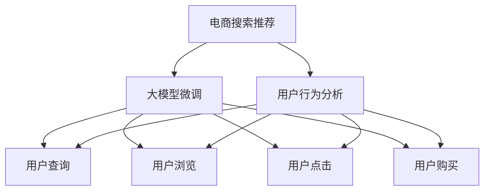

                 

# AI 大模型在电商搜索推荐中的用户行为分析：理解用户需求与购买偏好

> 关键词：电商搜索推荐, 用户行为分析, 购买偏好, 大模型微调, 用户需求, 深度学习, 自然语言处理(NLP), 神经网络, 机器学习, 特征工程

## 1. 背景介绍

在当今数字化时代，电子商务平台成为了消费者获取商品信息、比较价格、进行购物的主要渠道。对于电商企业而言，如何精准地推荐商品给用户，提升用户体验，提高销售额，成为一项重要的任务。传统的基于规则或统计模型的推荐系统已经难以满足用户个性化需求。AI大模型的出现，使得电商搜索推荐进入了基于深度学习的智能化阶段。通过深度学习模型，能够更准确地捕捉用户行为模式，从而实现更有效的推荐。本文将重点探讨大模型在电商搜索推荐中的用户行为分析，理解用户需求与购买偏好，以提升推荐系统的性能和用户体验。

## 2. 核心概念与联系

### 2.1 核心概念概述

电商搜索推荐系统旨在通过用户输入的查询和行为数据，预测用户可能感兴趣的商品，从而提升用户的购物体验和平台的销售额。基于深度学习的大模型微调方法是其中一种有效的方法，可以通过在大规模无标签数据上进行预训练，然后在带有标注的用户行为数据上进行微调，来提升模型的推荐性能。

- **电商搜索推荐**：指在电商平台上，通过用户的查询和浏览行为数据，预测用户可能感兴趣的商品，并推荐给用户的过程。
- **用户行为分析**：通过分析用户的查询、浏览、点击、购买等行为数据，来理解用户需求和购买偏好。
- **大模型微调**：指在大规模预训练语言模型上，通过带有标注的用户行为数据，进一步优化模型的过程。

这些概念之间有紧密的联系：

- **电商搜索推荐**依赖于**用户行为分析**，通过理解用户的行为模式，来预测用户可能感兴趣的商品。
- **用户行为分析**依赖于**大模型微调**，通过微调后的模型，可以更准确地分析用户的行为数据。
- **大模型微调**依赖于**电商搜索推荐**，通过大量用户行为数据的标注，来优化模型的性能。

### 2.2 核心概念原理和架构的 Mermaid 流程图



这个流程图展示了电商搜索推荐系统中的核心概念之间的联系。

## 3. 核心算法原理 & 具体操作步骤

### 3.1 算法原理概述

大模型在电商搜索推荐中的应用，主要通过两个阶段：预训练和大模型微调。

1. **预训练**：在大规模无标签数据上，如电商平台的海量交易数据，对大模型进行预训练，使其学习到通用的语言和行为特征。
2. **大模型微调**：在用户行为数据上，如用户的查询、浏览、点击、购买等行为数据，对大模型进行微调，使其能够更好地理解用户需求和购买偏好。

通过这两个阶段，大模型可以更准确地预测用户可能感兴趣的商品，从而提升电商搜索推荐系统的性能。

### 3.2 算法步骤详解

#### 3.2.1 预训练阶段

1. **数据准备**：收集电商平台上大量的交易数据，包括用户的查询、浏览、点击、购买等行为数据。
2. **数据清洗**：对数据进行清洗和预处理，去除噪声和异常值。
3. **模型选择**：选择合适的大模型，如BERT、GPT等，进行预训练。
4. **预训练**：在预训练数据上，使用自监督学习任务（如掩码语言模型、next sentence prediction等）进行预训练。

#### 3.2.2 微调阶段

1. **数据标注**：对用户行为数据进行标注，生成训练集、验证集和测试集。
2. **模型初始化**：将预训练模型作为初始化参数，构建微调模型。
3. **设置超参数**：设置学习率、批大小、迭代轮数等超参数。
4. **训练模型**：在标注数据上，使用梯度下降等优化算法，进行微调训练。
5. **评估模型**：在测试集上评估微调后的模型性能，对比微调前后的效果。
6. **部署模型**：将微调后的模型部署到电商平台上，进行实时推荐。

### 3.3 算法优缺点

#### 3.3.1 优点

1. **泛化能力强**：大模型在大规模无标签数据上进行预训练，学习到通用的语言和行为特征，在微调阶段可以更好地适应特定领域的用户行为数据。
2. **提升效果显著**：大模型微调能够显著提升推荐系统的精度和召回率。
3. **适应性强**：大模型可以适应不同平台和不同类型的用户行为数据。
4. **可扩展性好**：大模型可以在不同规模的电商平台上进行应用，扩展性强。

#### 3.3.2 缺点

1. **数据标注成本高**：微调过程需要大量带有标注的用户行为数据，数据标注成本较高。
2. **模型复杂度高**：大模型结构复杂，训练和推理的计算资源需求高。
3. **过拟合风险**：如果标注数据不充分，可能会导致模型过拟合。
4. **可解释性差**：大模型的决策过程难以解释，难以理解其内部工作机制。

### 3.4 算法应用领域

大模型微调在电商搜索推荐中的应用，已经在各大电商平台上得到了广泛应用，如淘宝、京东、亚马逊等。通过微调后的模型，可以更准确地理解用户需求和购买偏好，从而提升推荐的准确性和用户体验。

## 4. 数学模型和公式 & 详细讲解 & 举例说明

### 4.1 数学模型构建

在电商搜索推荐中，大模型的数学模型构建主要包括以下几个方面：

1. **输入表示**：将用户查询、浏览、点击、购买等行为数据转换为模型能够处理的向量表示。
2. **损失函数**：设计合适的损失函数，如交叉熵损失、均方误差损失等，衡量模型预测与真实标签之间的差异。
3. **优化算法**：使用梯度下降等优化算法，最小化损失函数，更新模型参数。

### 4.2 公式推导过程

以电商搜索推荐中的用户查询预测为例，设用户查询为 $q$，模型预测的商品为 $p$，则模型的预测结果可以表示为 $q \times p$。损失函数可以表示为：

$$
\mathcal{L} = -\frac{1}{N}\sum_{i=1}^N \log\sigma(p_i)
$$

其中 $\sigma$ 为sigmoid函数，$p_i$ 为模型预测的概率分布，$\sigma(p_i)$ 表示预测为商品 $i$ 的概率。

模型的优化目标为最小化损失函数，即：

$$
\min_{\theta} \mathcal{L}
$$

其中 $\theta$ 为模型参数。

### 4.3 案例分析与讲解

假设在一个电商平台中，某用户输入查询词 "iPhone"，模型预测出两条商品推荐结果 $p_1$ 和 $p_2$。模型预测的概率分布为 $p_1 = 0.8$，$p_2 = 0.2$。根据损失函数：

$$
\mathcal{L} = -\frac{1}{2}(\log\sigma(p_1) + \log(1-\sigma(p_2)))
$$

可以计算得到 $\mathcal{L} \approx -0.35$。如果用户最终购买了推荐商品 $p_1$，则可以通过优化算法更新模型参数，使得模型在处理类似查询时能够更准确地预测用户偏好。

## 5. 项目实践：代码实例和详细解释说明

### 5.1 开发环境搭建

1. **环境准备**：安装Python、TensorFlow、Keras等深度学习框架，搭建开发环境。
2. **数据准备**：收集电商平台上用户的查询、浏览、点击、购买等行为数据，并进行数据清洗和预处理。
3. **模型选择**：选择合适的大模型，如BERT、GPT等，进行预训练和微调。

### 5.2 源代码详细实现

以下是一个简单的电商搜索推荐系统的代码实现，包括预训练和微调两个阶段：

```python
# 预训练阶段
# 数据准备
query_data = ...
# 模型选择
model = BertModel.from_pretrained('bert-base-cased')
# 预训练
model.train()
for query in query_data:
    inputs = tokenizer(query, return_tensors='pt')
    outputs = model(**inputs)
    loss = compute_loss(outputs, labels)
    loss.backward()
    optimizer.step()

# 微调阶段
# 数据标注
train_data = ...
# 模型初始化
model = BertModel.from_pretrained('bert-base-cased')
# 设置超参数
learning_rate = 2e-5
batch_size = 16
epochs = 5
# 训练模型
model.train()
for epoch in range(epochs):
    for batch in train_data:
        inputs = tokenizer(batch, return_tensors='pt')
        outputs = model(**inputs)
        loss = compute_loss(outputs, batch_labels)
        loss.backward()
        optimizer.step()
# 评估模型
test_data = ...
test_outputs = model(test_data)
predictions = softmax(test_outputs)
evaluate_predictions(test_data, predictions)
```

### 5.3 代码解读与分析

在上述代码中，首先进行预训练，将查询数据输入到BERT模型中进行预训练。预训练过程中，模型学习到通用的语言特征。

接着进行微调，在标注数据上，使用梯度下降等优化算法进行微调训练。微调过程使用sigmoid函数作为激活函数，将模型预测的概率转化为二分类结果。最后，在测试集上评估微调后的模型性能，对比微调前后的效果。

## 6. 实际应用场景

大模型微调在电商搜索推荐中的应用场景非常广泛，可以应用于以下方面：

- **商品推荐**：通过用户查询和浏览行为数据，预测用户可能感兴趣的商品。
- **价格推荐**：根据用户历史购买行为，推荐合适的价格区间。
- **库存管理**：预测商品的热销程度，帮助电商平台进行库存管理。
- **个性化推荐**：根据用户的历史行为数据，个性化推荐商品。
- **客服推荐**：根据用户的问题，推荐合适的客服解决方案。

## 7. 工具和资源推荐

### 7.1 学习资源推荐

1. **《深度学习与自然语言处理》**：陈骥宇、王易东等著，系统介绍了深度学习与自然语言处理的基本概念和前沿技术。
2. **《自然语言处理综论》**：斯坦福大学提供的课程，详细讲解了自然语言处理的基本原理和应用。
3. **《人工智能与电商搜索推荐》**：侯文临著，详细讲解了电商搜索推荐的基本原理和实践方法。
4. **《深度学习框架TensorFlow实战》**：刘强等著，详细讲解了TensorFlow的使用方法和实践案例。
5. **《自然语言处理综述》**：李军著，系统介绍了自然语言处理的基本概念和应用。

### 7.2 开发工具推荐

1. **TensorFlow**：由Google开发的深度学习框架，提供了丰富的工具和资源，支持大模型的预训练和微调。
2. **Keras**：由François Chollet开发的深度学习框架，简单易用，适合初学者进行深度学习开发。
3. **Hugging Face Transformers**：提供了预训练大模型的接口，方便进行微调开发。
4. **PyTorch**：由Facebook开发的深度学习框架，支持动态计算图，适合进行深度学习研究。
5. **Jupyter Notebook**：支持Python等语言开发，方便进行实验和开发。

### 7.3 相关论文推荐

1. **"Attention is All You Need"**：提出了Transformer模型，开创了NLP预训练大模型的先河。
2. **"BERT: Pre-training of Deep Bidirectional Transformers for Language Understanding"**：提出了BERT模型，改进了预训练任务，提高了模型的性能。
3. **"Parameter-Efficient Transfer Learning for NLP"**：提出了Adapter等参数高效微调方法，减少了微调所需的参数量。
4. **"AdaLoRA: Adaptive Low-Rank Adaptation for Parameter-Efficient Fine-Tuning"**：提出了AdaLoRA方法，进一步优化了参数高效微调的性能。
5. **"Adversarial Examples for Deep Learning"**：提出了对抗性样本，提高了大模型的鲁棒性。

## 8. 总结：未来发展趋势与挑战

### 8.1 总结

本文介绍了大模型在电商搜索推荐中的应用，重点探讨了用户行为分析和购买偏好的理解。大模型通过预训练和微调，可以更准确地预测用户可能感兴趣的商品，从而提升推荐系统的性能和用户体验。然而，大模型微调也面临着数据标注成本高、模型复杂度高、可解释性差等挑战。未来需要进一步探索参数高效微调、对抗训练、可解释性等研究方向，提升大模型的性能和应用范围。

### 8.2 未来发展趋势

1. **参数高效微调**：开发更多参数高效微调方法，减少微调所需的参数量，降低模型复杂度。
2. **对抗训练**：引入对抗性样本，提高大模型的鲁棒性和抗干扰能力。
3. **可解释性**：提升大模型的可解释性，帮助用户理解模型决策过程。
4. **多模态融合**：融合视觉、语音等多模态数据，提高大模型的性能和应用范围。
5. **迁移学习**：利用迁移学习，提高大模型在不同领域的泛化能力。
6. **分布式训练**：利用分布式训练技术，提高大模型的训练效率。

### 8.3 面临的挑战

1. **数据标注成本高**：大规模数据标注成本高，需要寻找更高效的数据获取和标注方法。
2. **模型复杂度高**：大模型结构复杂，训练和推理的计算资源需求高。
3. **可解释性差**：大模型的决策过程难以解释，难以理解其内部工作机制。
4. **鲁棒性不足**：大模型面对对抗样本和噪声的鲁棒性不足，容易产生误导性输出。
5. **分布变化**：电商平台上的数据分布随时间变化，需要不断更新和重新微调模型。

### 8.4 研究展望

1. **无监督学习和半监督学习**：探索无监督学习和半监督学习的方法，减少对大规模标注数据的依赖。
2. **自适应微调**：开发自适应微调方法，使模型能够根据数据分布的变化进行动态调整。
3. **多任务学习**：开发多任务学习的方法，使模型能够同时处理多个任务，提高性能和泛化能力。
4. **知识图谱融合**：融合知识图谱，提高大模型的知识获取和推理能力。
5. **深度强化学习**：利用深度强化学习，提高大模型的决策能力。

## 9. 附录：常见问题与解答

### 9.1 常见问题与解答

**Q1: 大模型微调是否适用于所有NLP任务？**

A: 大模型微调在大多数NLP任务上都能取得不错的效果，特别是对于数据量较小的任务。但对于一些特定领域的任务，如医学、法律等，仅仅依靠通用语料预训练的模型可能难以很好地适应。此时需要在特定领域语料上进一步预训练，再进行微调，才能获得理想效果。

**Q2: 大模型微调的过程是否需要大量的标注数据？**

A: 大模型微调通常需要大量的标注数据，以确保模型能够学习到足够多的领域知识。如果标注数据不足，可以使用无监督学习或半监督学习的方法，减少对标注数据的依赖。

**Q3: 大模型的微调过程是否需要大量的计算资源？**

A: 大模型的微调过程确实需要大量的计算资源，尤其是在预训练和微调阶段。为了降低计算资源的需求，可以使用分布式训练、模型压缩等方法，优化大模型的训练和推理过程。

**Q4: 大模型的微调过程是否需要深度理解用户行为？**

A: 是的，大模型的微调过程需要深度理解用户的行为数据，才能更好地预测用户需求和购买偏好。理解用户行为数据的关键在于数据标注和特征工程，需要结合领域知识和实践经验，进行精细化的数据处理和特征提取。

**Q5: 大模型微调是否需要频繁的模型更新？**

A: 是的，由于电商平台上的数据分布随时间变化，大模型需要频繁的模型更新，以保持其性能和准确性。可以使用在线学习和增量学习的方法，实时更新模型，适应数据分布的变化。

